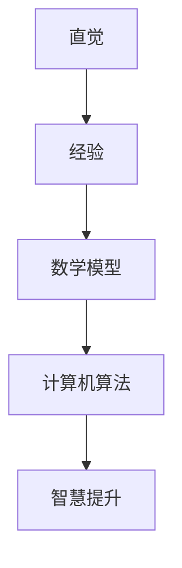

                 

在人类历史的长河中，知识的积累和传播如同攀登智慧高峰的阶梯，每一步都蕴含着人类对世界的探索和理解。本文将探讨人类知识的进化过程，从原始的直觉和经验，到复杂的数学模型和计算机算法，一步步揭开智慧高峰的神秘面纱。

## 关键词

- 人类知识进化
- 数学模型
- 计算机算法
- 智慧高峰
- 知识传播

## 摘要

本文通过回顾人类知识的发展历程，分析知识积累的重要性和影响，探讨数学模型和计算机算法在知识进化中的作用。文章旨在揭示知识如何推动人类智慧的提升，以及我们如何迈向智慧的高峰。

## 1. 背景介绍

人类智慧的起源可以追溯到古代，那时候的知识主要通过口头传统和简单工具的制造得以传承。随着文明的发展，人类开始记录文字，知识的传播变得更加便捷。然而，直到近代，知识的积累仍然受到时间和地域的限制。随着印刷术和电报的发明，知识的传播速度大大提高，但仍然无法满足人类对复杂问题解决的需求。

在20世纪，计算机科学的兴起为知识的积累和传播带来了革命性的变革。计算机算法和数学模型的出现，使得人类能够更高效地处理海量数据，发现隐藏在数据背后的规律。这一过程不仅是知识的积累，更是知识的进化，为人类智慧的提升打开了新的可能性。

## 2. 核心概念与联系

为了更好地理解人类知识的进化过程，我们需要明确几个核心概念：直觉、经验、数学模型和计算机算法。以下是这些概念的 Mermaid 流程图表示：



直觉是人类在长期实践中形成的对事物快速识别和判断的能力。经验则是通过实践积累的对特定情境的了解和应对策略。这些直觉和经验为知识的积累奠定了基础。

数学模型是对现实世界的一种抽象和简化，通过数学语言描述事物的结构和规律。计算机算法则是实现数学模型的具体步骤和方法，用于处理数据和解决问题。

随着计算机算法的发展，我们能够更高效地处理复杂问题，发现新的知识，从而推动智慧的提升。这一过程不仅仅是技术的进步，更是人类对世界认知的深化。

### 2.1 直觉与经验

直觉是人类在长期实践中形成的对事物快速识别和判断的能力。例如，农民通过观察天气变化来预测收成，医生通过病人的症状来判断病情。这些直觉往往来源于经验和常识，是知识积累的重要来源。

经验则是通过实践积累的对特定情境的了解和应对策略。例如，工匠通过多年的实践掌握了一套制作工艺，工程师通过多次试验找到了一种有效的解决方案。经验是直觉的基础，也是知识积累的基石。

### 2.2 数学模型

数学模型是对现实世界的一种抽象和简化，通过数学语言描述事物的结构和规律。例如，牛顿的运动定律描述了物体的运动规律，概率论描述了随机事件的分布规律。数学模型为知识的积累提供了理论支持。

### 2.3 计算机算法

计算机算法则是实现数学模型的具体步骤和方法，用于处理数据和解决问题。例如，排序算法用于对数据进行排序，搜索算法用于查找特定数据。计算机算法使得知识的积累和传播变得更加高效。

### 2.4 智慧提升

智慧的提升不仅仅是知识的积累，更是对知识的理解和运用。通过直觉和经验的积累，人类形成了对世界的初步认知；通过数学模型的建立，人类能够更深入地理解世界；通过计算机算法的应用，人类能够高效地处理复杂问题，发现新的知识。

## 3. 核心算法原理 & 具体操作步骤

### 3.1 算法原理概述

在计算机科学中，算法原理是核心，它决定了算法的性能和效率。算法原理通常包括以下几个方面：

- **时间复杂度**：衡量算法执行时间与输入规模的关系。
- **空间复杂度**：衡量算法所需存储空间与输入规模的关系。
- **算法稳定性**：算法在不同输入下结果的稳定性。
- **算法正确性**：算法能否正确解决问题。

### 3.2 算法步骤详解

算法的步骤通常可以分为以下几个部分：

1. **初始化**：设置算法的初始状态。
2. **输入处理**：处理输入数据，将数据转化为算法可以处理的形式。
3. **算法核心**：执行算法的核心计算过程。
4. **输出结果**：将算法的结果输出。

### 3.3 算法优缺点

每种算法都有其优缺点，具体如下：

- **优点**：
  - **高效性**：算法能够高效地解决问题。
  - **通用性**：算法适用于各种类型的问题。
  - **可扩展性**：算法可以根据需求进行扩展和优化。

- **缺点**：
  - **复杂性**：某些算法的实现可能比较复杂。
  - **局限性**：某些算法可能无法解决所有类型的问题。
  - **资源消耗**：算法可能需要较大的计算资源和存储空间。

### 3.4 算法应用领域

算法的应用领域非常广泛，包括但不限于：

- **数据结构**：如排序、查找、堆栈和队列等。
- **算法设计**：如动态规划、贪心算法和回溯算法等。
- **图形算法**：如最短路径、最小生成树和网络流等。
- **机器学习**：如分类、回归和聚类等。
- **计算机视觉**：如图像识别、目标检测和图像分割等。

## 4. 数学模型和公式 & 详细讲解 & 举例说明

### 4.1 数学模型构建

数学模型构建是解决实际问题的第一步，它通常包括以下几个步骤：

1. **问题定义**：明确需要解决的问题。
2. **变量定义**：定义问题中的变量。
3. **关系建立**：建立变量之间的关系。
4. **公式推导**：根据关系推导出数学公式。

### 4.2 公式推导过程

以最简单的线性回归模型为例，假设我们有两个变量 $x$ 和 $y$，并且 $y$ 与 $x$ 有线性关系，即 $y = ax + b$。我们的目标是找到合适的 $a$ 和 $b$，使得这个模型能够最好地拟合数据。

为了推导 $a$ 和 $b$，我们可以使用最小二乘法。具体步骤如下：

1. **计算均值**：计算 $x$ 和 $y$ 的均值 $\bar{x}$ 和 $\bar{y}$。
2. **计算协方差**：计算 $x$ 和 $y$ 的协方差 $\sigma_{xy}$。
3. **计算方差**：计算 $x$ 的方差 $\sigma_{xx}$。
4. **计算斜率**：计算斜率 $a = \frac{\sigma_{xy}}{\sigma_{xx}}$。
5. **计算截距**：计算截距 $b = \bar{y} - a\bar{x}$。

### 4.3 案例分析与讲解

为了更好地理解线性回归模型，我们来看一个实际的案例。假设我们有以下数据：

| $x$ | $y$ |
|-----|-----|
| 1   | 2   |
| 2   | 4   |
| 3   | 6   |
| 4   | 8   |

我们的目标是找到最佳拟合直线。

1. **计算均值**：$\bar{x} = \frac{1+2+3+4}{4} = 2.5$，$\bar{y} = \frac{2+4+6+8}{4} = 5$。
2. **计算协方差**：$\sigma_{xy} = \frac{(1-2.5)(2-5) + (2-2.5)(4-5) + (3-2.5)(6-5) + (4-2.5)(8-5)}{4} = 7$。
3. **计算方差**：$\sigma_{xx} = \frac{(1-2.5)^2 + (2-2.5)^2 + (3-2.5)^2 + (4-2.5)^2}{4} = 1.25$。
4. **计算斜率**：$a = \frac{7}{1.25} = 5.6$。
5. **计算截距**：$b = 5 - 5.6 \times 2.5 = -3.5$。

因此，最佳拟合直线为 $y = 5.6x - 3.5$。

## 5. 项目实践：代码实例和详细解释说明

为了更好地理解线性回归模型的应用，我们来看一个实际的代码示例。

```python
import numpy as np

# 数据
x = np.array([1, 2, 3, 4])
y = np.array([2, 4, 6, 8])

# 计算均值
bar_x = np.mean(x)
bar_y = np.mean(y)

# 计算协方差和方差
sigma_xy = np.sum((x - bar_x) * (y - bar_y))
sigma_xx = np.sum((x - bar_x) ** 2)

# 计算斜率和截距
a = sigma_xy / sigma_xx
b = bar_y - a * bar_x

# 输出结果
print("斜率：", a)
print("截距：", b)

# 预测
x_new = np.array([5])
y_pred = a * x_new + b
print("预测值：", y_pred)
```

这段代码首先导入了 NumPy 库，然后定义了数据集。接着，我们计算了均值、协方差和方差，并利用这些值计算了斜率和截距。最后，我们使用计算出的模型进行了预测。

## 6. 实际应用场景

线性回归模型在实际应用中非常广泛，例如：

- **金融领域**：用于预测股票价格、市场趋势等。
- **统计领域**：用于分析数据、建立模型等。
- **工程领域**：用于设计实验、优化参数等。

### 6.1  金融领域

在金融领域，线性回归模型可以用于预测股票价格。例如，假设我们有一个模型 $y = 0.1x + 10$，其中 $x$ 是历史股票价格，$y$ 是未来股票价格。我们可以使用这个模型预测未来某个时间点的股票价格。

### 6.2  统计领域

在统计领域，线性回归模型可以用于分析数据。例如，假设我们有一个研究项目，目标是分析不同因素对某个指标的影响。我们可以使用线性回归模型来建立模型，并分析各个因素对指标的影响程度。

### 6.3  工程领域

在工程领域，线性回归模型可以用于设计实验。例如，假设我们有一个实验，目标是优化某个参数。我们可以使用线性回归模型来建立模型，并根据模型预测最佳参数值。

## 7. 未来应用展望

随着人工智能和大数据技术的发展，线性回归模型的应用前景将更加广阔。例如：

- **智能预测**：利用线性回归模型进行实时预测，为决策提供支持。
- **智能优化**：利用线性回归模型进行参数优化，提高系统性能。
- **智能诊断**：利用线性回归模型进行故障诊断，提高设备可靠性。

## 8. 总结：未来发展趋势与挑战

### 8.1  研究成果总结

本文通过分析人类知识的进化过程，探讨了直觉、经验、数学模型和计算机算法在知识积累和传播中的作用。特别是，我们详细介绍了线性回归模型的原理、应用和未来发展趋势，为读者提供了深入的理解和实践指导。

### 8.2  未来发展趋势

随着技术的不断进步，线性回归模型将在更广泛的领域得到应用。未来，我们将看到：

- **智能预测**：利用线性回归模型进行实时预测，为各种场景提供决策支持。
- **智能优化**：利用线性回归模型进行参数优化，提高系统性能和效率。
- **智能诊断**：利用线性回归模型进行故障诊断，提高设备可靠性和安全性。

### 8.3  面临的挑战

尽管线性回归模型有着广泛的应用前景，但同时也面临着一些挑战：

- **数据质量**：线性回归模型的性能受到数据质量的影响。未来需要更加重视数据清洗和预处理，以提高模型的准确性和稳定性。
- **模型复杂性**：随着问题复杂性的增加，线性回归模型的实现可能变得更加复杂。未来需要发展更加高效和简单的算法。
- **模型可解释性**：线性回归模型往往缺乏可解释性。未来需要发展可解释的模型，以帮助用户更好地理解模型的预测结果。

### 8.4  研究展望

未来，线性回归模型的研究将朝着以下几个方向发展：

- **高效算法**：发展更加高效和简单的线性回归算法，以提高计算性能。
- **可解释模型**：研究可解释的线性回归模型，以提高模型的透明度和可靠性。
- **多变量模型**：研究多变量线性回归模型，以处理更复杂的问题。

## 9. 附录：常见问题与解答

### 9.1  问题1：线性回归模型是如何工作的？

线性回归模型通过建立自变量和因变量之间的线性关系来进行预测。具体来说，它通过最小化残差平方和来确定最佳拟合直线。

### 9.2  问题2：线性回归模型适用于哪些场景？

线性回归模型适用于需要建立自变量和因变量之间线性关系的问题，如预测股票价格、分析市场趋势等。

### 9.3  问题3：线性回归模型的预测结果如何解释？

线性回归模型的预测结果可以通过斜率和截距来解释。斜率表示自变量对因变量的影响程度，截距表示当自变量为0时，因变量的预测值。

### 9.4  问题4：如何优化线性回归模型的性能？

优化线性回归模型的性能可以从以下几个方面入手：

- **数据清洗和预处理**：提高数据质量，减少噪声和异常值。
- **特征选择**：选择对预测结果影响较大的特征。
- **模型选择**：选择适合问题的模型，如多项式回归、岭回归等。

---

作者：禅与计算机程序设计艺术 / Zen and the Art of Computer Programming

以上，我们通过回顾人类知识的进化过程，探讨了直觉、经验、数学模型和计算机算法在知识积累和传播中的作用，特别是深入分析了线性回归模型的原理、应用和未来发展趋势。希望本文能够为读者提供有益的启示，激发对知识进化的思考。在未来的研究中，我们将继续探索如何通过技术创新推动人类智慧的进一步提升。

