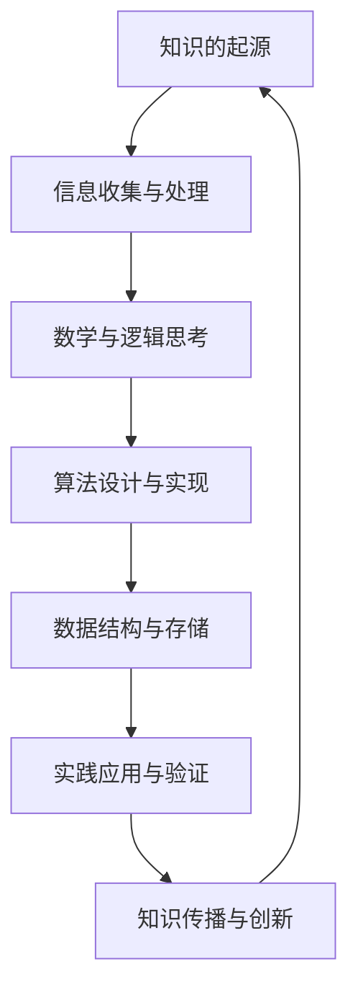

                 

关键词：知识进步、历史探索、人工智能、编程艺术、技术发展、算法原理

> 摘要：本文将探讨人类知识进步的历史，从古代文明到现代科技，特别关注信息技术和人工智能领域的发展。通过分析核心概念、算法原理、数学模型及实际应用，我们将揭示知识进步的力量和其对未来社会的影响。

## 1. 背景介绍

人类文明的发展历程是一部不断探索、积累和创新的历史。从古代的数学、物理到现代的信息技术，知识的进步推动了社会的进步。本文旨在梳理这一历史进程，探索知识进步的动力源泉。

### 1.1 古代文明的基石

古代文明的兴起，标志着人类对知识探索的初步尝试。在古埃及、巴比伦和希腊等文明中，数学、天文学和医学等领域取得了显著成就。例如，古埃及人发展了数学和几何学，为后来的工程和建筑提供了基础。

### 1.2 中世纪的黑暗与复兴

中世纪是知识的黑暗时期，但文艺复兴的到来重新点燃了知识的火炬。欧洲的学者们开始重新研究古代文献，推动了科学和艺术的复兴。

### 1.3 现代科技的崛起

17世纪以来，现代科技迅速崛起，牛顿力学、达尔文的进化论和爱因斯坦的相对论等一系列重大科学发现，极大地推动了人类对自然界的认识。

## 2. 核心概念与联系

为了深入理解知识进步的过程，我们需要明确几个核心概念，并了解它们之间的联系。

### 2.1 知识与信息

知识是信息的深入理解和应用，而信息是知识的基础。信息的获取、处理和传递是知识进步的关键环节。

### 2.2 算法与数据结构

算法是解决问题的方法，而数据结构是算法的基础。有效的算法和合理的数据结构能够提高问题的解决效率。

### 2.3 数学与逻辑

数学是科学的基础，逻辑是思维的工具。数学和逻辑的结合，能够揭示自然界的规律和事物的本质。

### 2.4 Mermaid 流程图

以下是一个描述知识进步过程的 Mermaid 流程图：



## 3. 核心算法原理 & 具体操作步骤

### 3.1 算法原理概述

算法是计算机科学的核心，其原理和具体操作步骤直接影响知识进步的速度和质量。

#### 3.1.1 排序算法

排序算法是一种常见且重要的算法，用于将数据按特定顺序排列。常见的排序算法有冒泡排序、选择排序和快速排序等。

#### 3.1.2 搜索算法

搜索算法用于在数据中查找特定元素，如二分搜索法和广度优先搜索等。

#### 3.1.3 动态规划

动态规划是一种解决复杂问题的算法方法，通过将问题分解为更小的子问题，并利用子问题的解来构建原问题的解。

### 3.2 算法步骤详解

#### 3.2.1 冒泡排序

冒泡排序的基本步骤如下：

1. 比较相邻的两个元素，如果它们的顺序错误，就交换它们的位置。
2. 继续对下一对相邻元素进行相同的比较和交换，直到整个数组被排序。

#### 3.2.2 二分搜索法

二分搜索法的基本步骤如下：

1. 确定搜索范围。
2. 计算中间位置。
3. 比较中间位置的元素与目标元素。
4. 根据比较结果，缩小搜索范围，重复步骤2和3，直到找到目标元素或确定不存在。

### 3.3 算法优缺点

#### 3.3.1 冒泡排序

优点：简单易懂，适合数据量较小的场景。

缺点：效率较低，不适合大数据量场景。

#### 3.3.2 二分搜索法

优点：时间复杂度较低，适合大数据量场景。

缺点：需要有序的数据，对数据的初始状态有要求。

### 3.4 算法应用领域

排序算法和搜索算法在计算机科学的各个领域都有广泛应用，如数据库、算法竞赛和人工智能等。

## 4. 数学模型和公式 & 详细讲解 & 举例说明

### 4.1 数学模型构建

数学模型是对现实世界问题的抽象和简化，通常包括变量、方程和约束条件等。

### 4.2 公式推导过程

以下是一个简单的线性回归模型公式推导：

$$y = w_0 + w_1 \cdot x_1 + w_2 \cdot x_2 + ... + w_n \cdot x_n$$

其中，$y$ 是因变量，$w_0, w_1, ..., w_n$ 是模型参数，$x_1, x_2, ..., x_n$ 是自变量。

### 4.3 案例分析与讲解

假设我们有一个简单的一元线性回归模型，用于预测房价：

$$y = w_0 + w_1 \cdot x$$

其中，$y$ 表示房价，$x$ 表示房屋面积，$w_0$ 和 $w_1$ 是模型参数。

我们可以通过以下步骤进行模型训练：

1. 收集房屋面积和房价的数据。
2. 计算每个样本的误差：$error = y - \hat{y}$，其中 $\hat{y} = w_0 + w_1 \cdot x$。
3. 利用误差计算模型参数的梯度：$\frac{\partial error}{\partial w_0} = -error$，$\frac{\partial error}{\partial w_1} = -x \cdot error$。
4. 更新模型参数：$w_0 = w_0 - \alpha \cdot \frac{\partial error}{\partial w_0}$，$w_1 = w_1 - \alpha \cdot \frac{\partial error}{\partial w_1}$，其中 $\alpha$ 是学习率。

## 5. 项目实践：代码实例和详细解释说明

### 5.1 开发环境搭建

在本项目中，我们使用 Python 编写代码，需要安装以下库：

- NumPy：用于数学计算。
- Matplotlib：用于数据可视化。
- Scikit-learn：用于机器学习算法。

### 5.2 源代码详细实现

以下是一个简单的线性回归模型的 Python 代码实现：

```python
import numpy as np
import matplotlib.pyplot as plt
from sklearn.linear_model import LinearRegression

# 数据集
X = np.array([[1], [2], [3], [4], [5]])
y = np.array([1, 2, 2.5, 4, 5])

# 创建线性回归模型
model = LinearRegression()

# 训练模型
model.fit(X, y)

# 预测
y_pred = model.predict(X)

# 可视化
plt.scatter(X, y, color='blue')
plt.plot(X, y_pred, color='red')
plt.show()
```

### 5.3 代码解读与分析

在这个代码示例中，我们首先导入了必要的库，然后定义了一个包含5个样本的数据集。接下来，我们创建了一个线性回归模型，并使用数据集进行模型训练。最后，我们使用模型进行预测，并将预测结果可视化。

## 6. 实际应用场景

### 6.1 数据分析

线性回归模型在数据分析中广泛应用，如预测股票价格、分析消费者行为等。

### 6.2 人工智能

线性回归模型是许多人工智能算法的基础，如神经网络、支持向量机等。

### 6.3 工程优化

线性回归模型可用于工程优化，如优化生产线流程、优化资源配置等。

## 7. 工具和资源推荐

### 7.1 学习资源推荐

- 《线性回归教程》
- 《Python数据分析》
- 《机器学习实战》

### 7.2 开发工具推荐

- Jupyter Notebook：用于编写和运行代码。
- PyCharm：用于 Python 开发。
- VSCode：用于多语言开发。

### 7.3 相关论文推荐

- "Linear Regression: A Self-Guided Learning Course"
- "Practical Guide to Linear Regression Analysis"
- "An Introduction to Machine Learning with Python"

## 8. 总结：未来发展趋势与挑战

### 8.1 研究成果总结

线性回归模型在数据分析、人工智能和工程优化等领域取得了显著成果，为知识进步提供了有力支持。

### 8.2 未来发展趋势

随着人工智能和大数据技术的发展，线性回归模型的应用前景将更加广阔。

### 8.3 面临的挑战

线性回归模型在处理高维度数据和复杂问题时存在一定局限性，未来研究需要解决这些问题。

### 8.4 研究展望

未来研究应关注线性回归模型的理论优化、算法改进和应用拓展。

## 9. 附录：常见问题与解答

### 9.1 什么是线性回归？

线性回归是一种用于预测因变量与自变量之间线性关系的统计方法。

### 9.2 线性回归模型有哪些类型？

线性回归模型主要分为一元线性回归和多元线性回归。

### 9.3 线性回归模型如何训练？

线性回归模型的训练过程主要包括数据收集、模型拟合和参数优化等步骤。

----------------------------------------------------------------

以上是文章的完整内容，接下来我们将按照markdown格式进行排版，确保文章的结构清晰、易于阅读。请稍等片刻，我们将开始排版工作。

