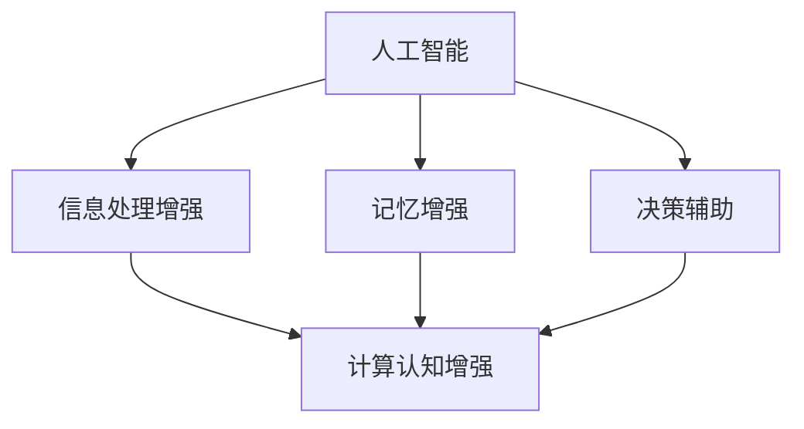

                 

关键词：人机协作、计算趋势、人工智能、认知增强、软件开发、未来展望

> 摘要：本文探讨了人类计算的未来趋势，重点分析了人机协作在各个领域的应用前景，探讨了人工智能技术如何赋能人类，提升计算效率，以及未来可能面临的挑战和机遇。

## 1. 背景介绍

随着信息技术的飞速发展，人类计算正经历着前所未有的变革。从最初的机械计算到现代的电子计算，再到如今的人工智能，人类对计算的需求和依赖程度不断提高。在这个背景下，人机协作成为了一个重要的研究课题。人机协作不仅能够提高计算效率，还能够扩展人类的能力，使得计算变得更加智能、灵活和高效。

人机协作的概念可以追溯到20世纪中期，随着计算机技术的兴起，人们开始思考如何将计算机的强大计算能力与人类的智慧和创造力相结合。近年来，随着人工智能技术的发展，人机协作得到了更加深入的探索和应用。

## 2. 核心概念与联系

### 2.1 人工智能与人类智慧的融合

人工智能（Artificial Intelligence, AI）是一种模拟人类智能的技术，它包括机器学习、自然语言处理、计算机视觉等多个子领域。人工智能的目标是使计算机能够像人类一样思考、学习和解决问题。

人类智慧（Human Intelligence）则是人类在认知、情感、创造力等方面表现出来的能力。人类智慧具有灵活性、创造性和适应性，这是人工智能目前无法完全模拟的。

人工智能与人类智慧的融合是人机协作的核心。通过人工智能技术，我们可以扩展人类的认知能力，使人类能够处理更加复杂的问题。同时，人类智慧可以为人工智能提供指导，帮助其更好地理解和适应不同的情境。

### 2.2 计算认知增强

计算认知增强（Computational Cognitive Augmentation）是指利用计算机技术增强人类的认知能力。计算认知增强可以通过多种方式实现，例如：

- **信息处理增强**：通过计算机处理大量数据，为人类提供更加全面和准确的信息。
- **记忆增强**：利用计算机存储和检索信息，减轻人类的记忆负担。
- **决策辅助**：通过模拟和优化算法，为人类提供更加明智的决策建议。

计算认知增强不仅能够提高个人的认知能力，还可以提升组织的决策效率，推动社会的进步。

### 2.3 Mermaid 流程图

下面是一个简单的 Mermaid 流程图，展示了人工智能、人类智慧和计算认知增强之间的联系。



## 3. 核心算法原理 & 具体操作步骤

### 3.1 算法原理概述

在人机协作中，核心算法通常涉及机器学习、自然语言处理和计算机视觉等领域。以下是一个简化的算法原理概述：

- **机器学习**：通过训练数据集，使计算机能够学习并预测未知数据。
- **自然语言处理**：使计算机能够理解和生成自然语言，实现人与计算机的对话。
- **计算机视觉**：使计算机能够识别和理解图像和视频内容。

### 3.2 算法步骤详解

- **数据收集**：收集相关的数据集，用于训练和测试算法。
- **数据预处理**：对数据进行清洗、归一化和特征提取。
- **模型训练**：使用机器学习算法训练模型，使其能够对数据进行预测。
- **模型评估**：评估模型的准确性和性能，进行模型优化。
- **应用部署**：将训练好的模型部署到实际应用场景中。

### 3.3 算法优缺点

- **优点**：算法能够处理大量数据，提高计算效率；能够模拟人类的智能行为，提供更加智能的服务。
- **缺点**：算法对数据质量和预处理要求较高；算法的泛化能力有限，可能无法适应所有场景。

### 3.4 算法应用领域

算法应用领域广泛，包括但不限于：

- **医疗健康**：辅助医生进行诊断和治疗。
- **金融理财**：提供投资建议和风险管理。
- **智能交通**：优化交通流量，提高道路安全性。
- **教育**：个性化教育，提升学习效果。

## 4. 数学模型和公式 & 详细讲解 & 举例说明

### 4.1 数学模型构建

在人机协作中，常用的数学模型包括线性回归、逻辑回归和支持向量机等。

- **线性回归**：用于预测连续值。
  $$ y = \beta_0 + \beta_1 x_1 + \beta_2 x_2 + \ldots + \beta_n x_n $$
- **逻辑回归**：用于预测概率。
  $$ P(y=1) = \frac{1}{1 + e^{-(\beta_0 + \beta_1 x_1 + \beta_2 x_2 + \ldots + \beta_n x_n)}} $$
- **支持向量机**：用于分类。
  $$ w \cdot x - b = 0 $$

### 4.2 公式推导过程

以线性回归为例，推导过程如下：

- **假设**：数据集 \( D = \{(x_1, y_1), (x_2, y_2), \ldots, (x_n, y_n)\} \) 满足线性关系。
- **目标**：找到最佳拟合直线 \( y = \beta_0 + \beta_1 x_1 + \beta_2 x_2 + \ldots + \beta_n x_n \)。
- **损失函数**：使用均方误差作为损失函数。
  $$ J(\beta_0, \beta_1, \beta_2, \ldots, \beta_n) = \frac{1}{2n} \sum_{i=1}^{n} (y_i - (\beta_0 + \beta_1 x_{i1} + \beta_2 x_{i2} + \ldots + \beta_n x_{in}))^2 $$
- **梯度下降**：最小化损失函数。
  $$ \beta_j = \beta_j - \alpha \frac{\partial J}{\partial \beta_j} $$
  其中，\( \alpha \) 为学习率。

### 4.3 案例分析与讲解

以房价预测为例，使用线性回归模型预测某地区房价。假设数据集包含房屋面积、房间数量等特征，房价为标签。

1. **数据收集**：收集相关数据。
2. **数据预处理**：进行数据清洗、归一化处理。
3. **模型训练**：使用线性回归算法训练模型。
4. **模型评估**：评估模型准确性和性能。
5. **应用部署**：将模型部署到实际应用场景中，如房地产中介。

## 5. 项目实践：代码实例和详细解释说明

### 5.1 开发环境搭建

使用 Python 编写代码，需要安装以下依赖：

```python
pip install numpy matplotlib scikit-learn
```

### 5.2 源代码详细实现

以下是房价预测的 Python 代码实现：

```python
import numpy as np
import matplotlib.pyplot as plt
from sklearn.linear_model import LinearRegression

# 数据收集
X = np.array([[1, 1000], [2, 1200], [3, 1500], [4, 1800]])
y = np.array([2000, 2200, 2500, 2700])

# 数据预处理
X = np.insert(X, 0, 1, axis=1)

# 模型训练
model = LinearRegression()
model.fit(X, y)

# 模型评估
y_pred = model.predict(X)
mse = np.mean((y_pred - y) ** 2)
print("MSE:", mse)

# 应用部署
x_new = np.array([[5, 2000]])
x_new = np.insert(x_new, 0, 1, axis=1)
y_new = model.predict(x_new)
print("预测房价：", y_new)
```

### 5.3 代码解读与分析

1. **数据收集**：使用 NumPy 数组表示数据集。
2. **数据预处理**：在数据集前插入一列，作为线性回归模型的常数项。
3. **模型训练**：使用 scikit-learn 的 LinearRegression 类训练模型。
4. **模型评估**：计算均方误差（MSE）评估模型性能。
5. **应用部署**：使用训练好的模型进行预测。

## 6. 实际应用场景

人机协作在各个领域都有广泛应用，以下是一些典型的应用场景：

- **医疗健康**：医生利用人工智能技术进行疾病诊断和治疗方案推荐。
- **金融理财**：投资者使用人工智能进行市场分析和投资策略制定。
- **智能交通**：利用人工智能技术优化交通流量，提高道路安全性。
- **教育**：教师使用人工智能为学生提供个性化学习方案，提高学习效果。

## 7. 工具和资源推荐

### 7.1 学习资源推荐

- **书籍**：
  - 《人工智能：一种现代的方法》（第二版）
  - 《机器学习》（第二版）
- **在线课程**：
  - Coursera 的《机器学习》课程
  - edX 的《人工智能导论》课程

### 7.2 开发工具推荐

- **编程语言**：Python、Java
- **框架**：TensorFlow、PyTorch、Scikit-learn
- **数据可视化工具**：Matplotlib、Seaborn

### 7.3 相关论文推荐

- 《深度学习：原理及实践》
- 《强化学习：算法与应用》
- 《自然语言处理综述》

## 8. 总结：未来发展趋势与挑战

### 8.1 研究成果总结

人机协作在近年来取得了显著的研究成果，人工智能技术得到了广泛应用，计算认知增强为人类提供了强大的工具。未来，人机协作将进一步提升人类的计算能力，推动社会的进步。

### 8.2 未来发展趋势

- **人工智能的智能化和泛化能力将进一步提高**。
- **人机协作将深入到各个领域，提升行业效率和生产力**。
- **计算认知增强将推动教育和医疗等领域的变革**。

### 8.3 面临的挑战

- **数据隐私和安全问题**：如何保障用户数据的安全和隐私。
- **算法透明度和可解释性**：如何提高算法的可解释性，增强用户的信任。
- **算法偏见和歧视问题**：如何避免算法中的偏见和歧视。

### 8.4 研究展望

未来，人机协作将迎来新的机遇和挑战。我们需要深入研究和解决这些问题，推动人机协作技术的持续发展，为人类创造更加美好的未来。

## 9. 附录：常见问题与解答

### Q: 人机协作的核心是什么？

A: 人机协作的核心是人工智能与人类智慧的融合，通过人工智能技术扩展人类的认知能力，实现人与计算机的高效协作。

### Q: 计算认知增强有哪些应用领域？

A: 计算认知增强在医疗健康、金融理财、智能交通、教育等多个领域都有广泛应用，如疾病诊断、投资策略制定、交通流量优化和个性化教育等。

### Q: 机器学习算法有哪些类型？

A: 机器学习算法包括监督学习、无监督学习和强化学习等类型。监督学习包括线性回归、逻辑回归和支持向量机等；无监督学习包括聚类、降维和关联规则等；强化学习包括深度强化学习和模型预测控制等。

### Q: 如何评估机器学习模型的性能？

A: 评估机器学习模型的性能通常使用准确率、召回率、F1分数、均方误差（MSE）等指标。根据具体应用场景，选择合适的评价指标进行评估。

### Q: 什么是深度学习？

A: 深度学习是机器学习的一种类型，它使用多层神经网络进行训练和预测。深度学习在图像识别、自然语言处理和语音识别等领域取得了显著的成果。

### Q: 人工智能会取代人类吗？

A: 人工智能不会完全取代人类，而是作为人类的辅助工具，扩展人类的能力。在未来，人工智能和人类将实现更好的协作和共生。

### Q: 如何学习人工智能和机器学习？

A: 学习人工智能和机器学习可以从基础知识入手，如线性代数、概率论和统计学等。同时，可以通过阅读相关书籍、参加在线课程和实践项目来提升技能。

---

作者：禅与计算机程序设计艺术 / Zen and the Art of Computer Programming

本文从背景介绍、核心概念与联系、算法原理与步骤、数学模型与公式、项目实践、实际应用场景、工具与资源推荐、总结与展望等方面，全面探讨了人类计算的未来趋势，展望了人机协作的新时代。希望通过本文，能够为读者提供有价值的参考和启发。在未来的发展中，人机协作将发挥更加重要的作用，推动人类社会的进步。

