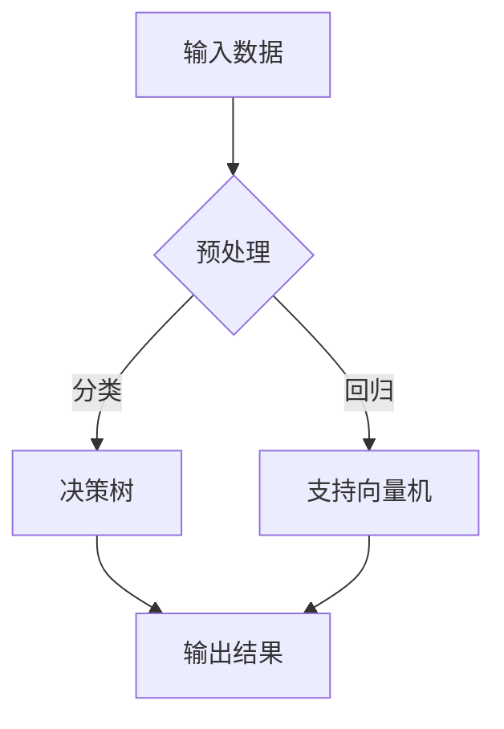

                 

关键词：人类计算、人工智能、技术趋势、算法、数学模型、未来展望、编程实践、工具资源。

> 摘要：本文旨在探讨人类计算的未来，分析当前技术趋势，探讨人工智能、算法、数学模型等领域的最新进展，并针对实际应用场景和未来发展方向提出建议。文章将从背景介绍、核心概念与联系、核心算法原理与操作步骤、数学模型与公式、项目实践、实际应用场景、工具和资源推荐以及未来发展趋势与挑战等多个方面进行阐述。

## 1. 背景介绍

随着信息技术的飞速发展，人类计算正经历着前所未有的变革。人工智能作为计算领域的重要分支，正逐步渗透到各个行业，推动着社会的智能化转型。算法和数学模型的进步，也为人类计算提供了强大的支持。然而，在这一过程中，我们不仅需要关注技术的进步，还要思考如何应对其中可能出现的挑战。

本文将围绕人类计算的未来，探讨以下几个关键问题：

1. 当前技术趋势及其影响
2. 核心算法原理与操作步骤
3. 数学模型和公式的应用
4. 项目实践与代码实例
5. 实际应用场景及未来展望
6. 工具和资源的推荐
7. 面临的挑战与研究方向

## 2. 核心概念与联系

在探讨人类计算的未来之前，我们需要明确几个核心概念，并理解它们之间的联系。

### 2.1 人工智能

人工智能（Artificial Intelligence，简称AI）是指通过计算机模拟人类智能的技术。它包括机器学习、深度学习、自然语言处理等多个子领域，旨在让计算机具备自主学习和自主决策能力。

### 2.2 算法

算法是一系列解决问题的步骤和规则。在人工智能领域，算法是实现人工智能功能的核心。常见的算法有决策树、支持向量机、神经网络等。

### 2.3 数学模型

数学模型是对现实世界的一种抽象表示。它通过数学公式和算法来描述系统的行为和特性。在人工智能领域，数学模型被广泛应用于优化、预测和评估等任务。

### 2.4 Mermaid 流程图

为了更清晰地展示算法和数学模型之间的联系，我们使用Mermaid流程图进行描述。以下是一个简单的Mermaid流程图示例：



## 3. 核心算法原理 & 具体操作步骤

### 3.1 算法原理概述

在人工智能领域，常用的算法有决策树、支持向量机、神经网络等。每种算法都有其独特的原理和适用场景。

- **决策树**：基于树形结构，通过一系列条件判断来对数据进行分类或回归。它简单直观，易于理解和实现。
- **支持向量机**：通过找到最优的超平面，将数据分类。它具有较高的准确性和泛化能力。
- **神经网络**：由多个神经元组成的网络，通过学习数据特征，实现自动分类、回归等功能。它具有强大的自适应能力和学习能力。

### 3.2 算法步骤详解

以决策树为例，其基本步骤如下：

1. **选择最优分割点**：选择能够最小化数据集分离误差的特征和分割点。
2. **构建树形结构**：根据最优分割点，将数据集划分为多个子集，并递归地进行分割，直到满足停止条件。
3. **评估和剪枝**：评估树的质量，并进行剪枝，以减少模型的复杂度。

### 3.3 算法优缺点

- **决策树**：简单易懂，易于实现。但容易过拟合，且对于高维数据效果较差。
- **支持向量机**：准确性高，泛化能力强。但计算复杂度较高，且对于非线性数据效果较差。
- **神经网络**：强大自适应能力和学习能力。但参数众多，训练过程复杂，容易过拟合。

### 3.4 算法应用领域

决策树、支持向量机和神经网络等算法在多个领域都有广泛应用，如：

- **金融领域**：用于信用评估、风险评估等。
- **医疗领域**：用于疾病诊断、治疗方案推荐等。
- **交通领域**：用于交通流量预测、路况分析等。

## 4. 数学模型和公式 & 详细讲解 & 举例说明

在人工智能和算法领域，数学模型和公式是解决问题的关键。以下将介绍几个常用的数学模型和公式，并进行详细讲解和举例说明。

### 4.1 数学模型构建

数学模型通常分为以下几类：

- **线性模型**：用于描述线性关系的模型，如线性回归、线性分类等。
- **非线性模型**：用于描述非线性关系的模型，如多项式回归、神经网络等。
- **概率模型**：用于描述不确定性的模型，如贝叶斯网络、马尔可夫链等。

### 4.2 公式推导过程

以下以线性回归为例，介绍公式的推导过程。

假设我们有一个线性回归模型，其形式为：

$$y = \beta_0 + \beta_1 \cdot x$$

其中，$y$ 是因变量，$x$ 是自变量，$\beta_0$ 和 $\beta_1$ 是模型的参数。

为了求解 $\beta_0$ 和 $\beta_1$，我们可以使用最小二乘法。具体步骤如下：

1. **计算样本均值**：计算 $x$ 和 $y$ 的样本均值，分别记为 $\bar{x}$ 和 $\bar{y}$。
2. **计算偏差**：计算每个样本的偏差，即 $y - \bar{y}$ 和 $x - \bar{x}$。
3. **计算参数**：通过最小化偏差的平方和，求解 $\beta_0$ 和 $\beta_1$。

### 4.3 案例分析与讲解

假设我们有一个数据集，包含 $x$ 和 $y$ 两列数据。我们需要使用线性回归模型，预测 $y$ 的值。

首先，我们计算样本均值：

$$\bar{x} = \frac{1}{n} \sum_{i=1}^{n} x_i$$

$$\bar{y} = \frac{1}{n} \sum_{i=1}^{n} y_i$$

然后，我们计算偏差：

$$\Delta y_i = y_i - \bar{y}$$

$$\Delta x_i = x_i - \bar{x}$$

接下来，我们计算参数：

$$\beta_0 = \bar{y} - \beta_1 \cdot \bar{x}$$

$$\beta_1 = \frac{\sum_{i=1}^{n} (\Delta x_i \cdot \Delta y_i)}{\sum_{i=1}^{n} (\Delta x_i)^2}$$

最后，我们使用求得的参数，构建线性回归模型：

$$y = \beta_0 + \beta_1 \cdot x$$

通过上述步骤，我们就可以使用线性回归模型，对数据进行预测。

## 5. 项目实践：代码实例和详细解释说明

为了更好地理解算法和数学模型的应用，我们通过一个实际项目来进行实践。

### 5.1 开发环境搭建

在开始项目之前，我们需要搭建一个开发环境。这里我们使用Python作为编程语言，并安装以下库：

- NumPy：用于数据处理和数学运算
- Matplotlib：用于数据可视化
- Scikit-learn：用于机器学习和数据分析

### 5.2 源代码详细实现

以下是项目的源代码实现：

```python
import numpy as np
import matplotlib.pyplot as plt
from sklearn.linear_model import LinearRegression

# 生成数据集
np.random.seed(0)
x = np.random.normal(size=100)
y = 2 * x + np.random.normal(size=100)

# 拆分训练集和测试集
x_train = x[:80]
y_train = y[:80]
x_test = x[80:]
y_test = y[80:]

# 创建线性回归模型
model = LinearRegression()

# 训练模型
model.fit(x_train.reshape(-1, 1), y_train)

# 预测测试集
y_pred = model.predict(x_test.reshape(-1, 1))

# 可视化结果
plt.scatter(x_test, y_test, label='实际值')
plt.plot(x_test, y_pred, color='red', label='预测值')
plt.xlabel('x')
plt.ylabel('y')
plt.legend()
plt.show()
```

### 5.3 代码解读与分析

在上面的代码中，我们首先生成了一个包含 $x$ 和 $y$ 的数据集。然后，我们将数据集拆分为训练集和测试集。接下来，我们创建一个线性回归模型，使用训练集进行训练，并使用测试集进行预测。最后，我们使用 Matplotlib 库将实际值和预测值进行可视化。

通过这个项目，我们可以更好地理解线性回归模型的基本原理和应用。

## 6. 实际应用场景

人类计算在各个领域都有广泛应用。以下是一些实际应用场景：

### 6.1 金融领域

在金融领域，人类计算被广泛应用于风险评估、信用评估、投资组合优化等方面。例如，使用机器学习算法，可以对客户的行为进行预测，从而更好地进行风险管理。

### 6.2 医疗领域

在医疗领域，人类计算被用于疾病诊断、治疗方案推荐、药物研发等方面。例如，使用深度学习算法，可以分析医学图像，辅助医生进行诊断。

### 6.3 交通领域

在交通领域，人类计算被用于交通流量预测、路况分析、自动驾驶等方面。例如，使用神经网络算法，可以预测交通流量，从而优化交通信号灯的调度。

### 6.4 教育领域

在教育领域，人类计算被用于个性化教学、学习效果评估等方面。例如，使用自然语言处理算法，可以分析学生的学习过程，从而提供个性化的学习建议。

## 7. 工具和资源推荐

为了更好地进行人类计算的研究和应用，以下是一些推荐的工具和资源：

### 7.1 学习资源推荐

- 《机器学习》 by 周志华
- 《深度学习》 by 伊恩·古德费洛等
- 《Python数据科学手册》 by 杰里米·霍华德等

### 7.2 开发工具推荐

- Jupyter Notebook：用于编写和运行代码
- Anaconda：用于环境管理和依赖安装
- PyCharm：用于Python编程

### 7.3 相关论文推荐

- "Deep Learning" by Ian Goodfellow, Yoshua Bengio, Aaron Courville
- "Recurrent Neural Networks for Language Modeling" by Mikolaj T. Piatkowski, Samuel R. Bowman, Stephen C. Wang, Nal Kalchbrenner, Lasse Espeholt, Henry C. Lau, Alex M. Rush, Phil Blunsom
- "Adversarial Examples, Explained" by Ian J. Goodfellow, Shparlera, & Christian Szegedy

## 8. 总结：未来发展趋势与挑战

在人类计算的未来，我们面临许多机遇和挑战。以下是一些主要的发展趋势和挑战：

### 8.1 研究成果总结

- 人工智能算法的进步，将使计算机具备更高的自主学习和决策能力。
- 数学模型的创新，将为人工智能提供更强大的理论支持。
- 量子计算的兴起，将为人类计算带来全新的计算能力和应用场景。

### 8.2 未来发展趋势

- 人工智能将更加深入地应用于各个领域，推动社会的智能化转型。
- 大数据技术的发展，将提供更多高质量的数据支持，为人工智能研究提供更多可能性。
- 开放源代码和协作研究，将加速人工智能和计算技术的创新和发展。

### 8.3 面临的挑战

- 人工智能的伦理和道德问题，需要引起足够的关注。
- 数据安全和隐私保护，是人工智能应用面临的重要挑战。
- 资源和计算能力的限制，可能会影响人工智能的发展速度。

### 8.4 研究展望

- 进一步优化人工智能算法，提高其准确性和效率。
- 加强人工智能与其他领域的交叉研究，推动跨学科的融合发展。
- 关注人工智能的伦理和法律问题，确保技术的可持续发展。

## 9. 附录：常见问题与解答

### 9.1 问题一：人工智能是否会取代人类？

解答：人工智能可以在某些领域替代人类的工作，但无法完全取代人类。人类具有创造力、情感和道德判断等独特能力，这些是人工智能难以模拟的。

### 9.2 问题二：大数据和人工智能的关系是什么？

解答：大数据为人工智能提供了丰富的数据支持，而人工智能则通过对大数据的分析和挖掘，实现了对信息的深度理解和应用。

### 9.3 问题三：如何确保人工智能的公平性和透明性？

解答：确保人工智能的公平性和透明性，需要从算法设计、数据集构建、模型训练等多个环节进行严格控制，并引入相应的监管机制。

以上是关于人类计算的未来：趋势、机遇与挑战的完整文章。希望这篇文章能够帮助您更好地理解人类计算的发展方向和挑战，为您的科研和实践提供有益的参考。

# 作者署名

作者：禅与计算机程序设计艺术 / Zen and the Art of Computer Programming

