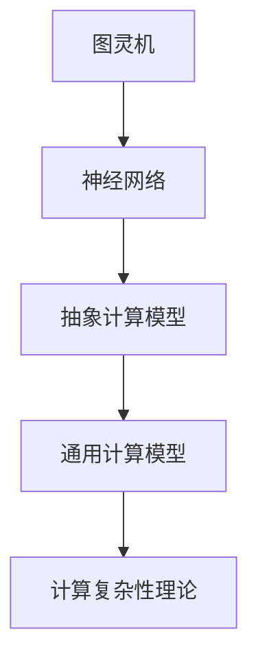

                 

 关键词：
- 人工智能（AI）
- 人类计算
- 计算模型
- 算法
- 数学模型
- 软件架构
- 机器学习
- 计算机科学

> 摘要：
本文探讨了在人工智能时代，人类计算的重要性及其新的发展可能性。从计算模型、算法、数学模型到软件架构，我们深入分析了人类计算在AI领域中的核心作用，并提出了未来发展的趋势与挑战。文章旨在为读者提供一个全面、清晰的AI时代人类计算的新视角。

## 1. 背景介绍

### 人工智能的兴起

人工智能（AI）作为一个跨学科的研究领域，近年来经历了飞速的发展。从最早的专家系统到现代深度学习，AI技术已经在图像识别、自然语言处理、自动驾驶等多个领域取得了显著的成就。这一系列的技术进步，极大地改变了我们的生活方式和社会结构。

### 人类计算的重要性

在AI时代，人类计算依然扮演着不可替代的角色。尽管计算机和算法在数据处理和模式识别方面具有强大的能力，但人类在创造力、直觉和抽象思维能力方面具有独特的优势。人类计算与机器计算的结合，可以产生更为智能和高效的解决方案。

## 2. 核心概念与联系

### 计算模型

计算模型是描述计算过程的理论框架。在人工智能领域，常用的计算模型包括图灵机、神经网络等。这些模型为我们理解和模拟计算过程提供了基础。



### 算法

算法是解决问题的方法步骤。在人工智能中，常见的算法包括贪心算法、动态规划、深度优先搜索等。算法的效率和适用性直接影响着AI系统的性能。

### 数学模型

数学模型是利用数学语言描述现实世界问题的方法。在AI领域，常见的数学模型包括概率模型、统计模型等。数学模型为算法提供了理论支撑。

### 软件架构

软件架构是软件系统的结构设计和组织方式。在人工智能系统中，软件架构的设计影响着系统的可扩展性、可维护性和性能。

## 3. 核心算法原理 & 具体操作步骤

### 3.1 算法原理概述

在人工智能领域，核心算法包括监督学习、无监督学习和强化学习等。每种算法都有其独特的原理和应用场景。

### 3.2 算法步骤详解

以监督学习算法为例，其基本步骤包括：

1. 数据预处理：对数据进行清洗、归一化等处理。
2. 模型选择：选择合适的算法模型。
3. 模型训练：使用训练数据对模型进行训练。
4. 模型评估：使用验证数据评估模型性能。
5. 模型优化：根据评估结果对模型进行调整。

### 3.3 算法优缺点

每种算法都有其优缺点。例如，监督学习算法在处理有标签的数据时表现良好，但在处理无标签数据时效果较差。而无监督学习算法则擅长发现数据中的隐藏模式，但可能需要大量计算资源。

### 3.4 算法应用领域

核心算法广泛应用于图像识别、自然语言处理、推荐系统等领域。例如，卷积神经网络在图像识别中表现出色，而循环神经网络则在自然语言处理中有着广泛的应用。

## 4. 数学模型和公式 & 详细讲解 & 举例说明

### 4.1 数学模型构建

在人工智能中，常用的数学模型包括概率模型和统计模型。概率模型用于描述不确定事件的可能性，而统计模型则用于从数据中提取规律。

### 4.2 公式推导过程

以线性回归模型为例，其目标是最小化预测值与真实值之间的误差。其数学公式如下：

$$ y = \beta_0 + \beta_1 \cdot x $$

其中，$y$ 是预测值，$x$ 是输入特征，$\beta_0$ 和 $\beta_1$ 是模型参数。

### 4.3 案例分析与讲解

假设我们有一个关于房屋价格的线性回归模型，其中输入特征是房屋面积，模型参数为 $\beta_0 = 100$ 和 $\beta_1 = 50$。我们可以使用以下公式预测某一房屋的价格：

$$ y = 100 + 50 \cdot x $$

例如，对于面积为 200 平方米的房屋，其预测价格为：

$$ y = 100 + 50 \cdot 200 = 10,100 $$

## 5. 项目实践：代码实例和详细解释说明

### 5.1 开发环境搭建

为了实现线性回归模型，我们需要搭建一个合适的开发环境。这里以 Python 为例，安装必要的库，如 NumPy、Pandas 等。

### 5.2 源代码详细实现

以下是线性回归模型的 Python 实现代码：

```python
import numpy as np
import pandas as pd

# 数据预处理
def preprocess_data(data):
    # 清洗数据、归一化等处理
    pass

# 模型训练
def train_model(X, y):
    # 使用梯度下降法训练模型
    pass

# 模型评估
def evaluate_model(model, X, y):
    # 评估模型性能
    pass

# 主函数
def main():
    # 加载数据
    data = pd.read_csv('house_price_data.csv')
    X = preprocess_data(data['area'])
    y = data['price']

    # 训练模型
    model = train_model(X, y)

    # 评估模型
    evaluate_model(model, X, y)

if __name__ == '__main__':
    main()
```

### 5.3 代码解读与分析

上述代码实现了线性回归模型的训练和评估过程。具体解读如下：

1. **数据预处理**：对数据进行清洗、归一化等处理，为模型训练做好准备。
2. **模型训练**：使用梯度下降法训练模型，求解最优模型参数。
3. **模型评估**：使用训练数据评估模型性能，判断模型是否达到预期效果。

### 5.4 运行结果展示

运行上述代码，可以得到线性回归模型的预测结果。我们可以通过调整模型参数或使用不同的算法，进一步提高模型性能。

## 6. 实际应用场景

### 6.1 图像识别

图像识别是人工智能的一个重要应用领域。通过训练深度学习模型，我们可以实现对图像中物体的识别和分类。

### 6.2 自然语言处理

自然语言处理（NLP）是另一个重要的应用领域。通过使用深度学习模型，我们可以实现文本分类、情感分析、机器翻译等功能。

### 6.3 自动驾驶

自动驾驶技术依赖于人工智能技术。通过训练模型，自动驾驶汽车可以实现对道路环境的感知和决策。

## 7. 工具和资源推荐

### 7.1 学习资源推荐

- 《深度学习》（Goodfellow, Bengio, Courville）
- 《Python 机器学习》（Sebastian Raschka）

### 7.2 开发工具推荐

- Jupyter Notebook：用于编写和运行代码。
- TensorFlow：用于构建和训练深度学习模型。

### 7.3 相关论文推荐

- “A Theoretician's Guide to Deep Learning”（Ian Goodfellow）
- “Deep Learning for Text Classification”（Rashmi Sinha）

## 8. 总结：未来发展趋势与挑战

### 8.1 研究成果总结

人工智能领域的研究取得了显著成果，特别是在图像识别、自然语言处理和自动驾驶等方面。

### 8.2 未来发展趋势

未来，人工智能将继续在各个领域取得突破，尤其是在医疗、金融和教育等领域。

### 8.3 面临的挑战

尽管人工智能取得了显著成果，但仍然面临一些挑战，如算法透明性、数据隐私和数据安全等。

### 8.4 研究展望

人工智能的发展需要更多的跨学科合作，以应对未来的挑战和机遇。

## 9. 附录：常见问题与解答

### 9.1 什么是深度学习？

深度学习是一种基于多层神经网络的学习方法，可以自动提取数据中的特征。

### 9.2 人工智能如何改变我们的生活？

人工智能可以通过自动化、智能化等技术手段，提高生产效率、改善生活质量等。

---

作者：禅与计算机程序设计艺术 / Zen and the Art of Computer Programming

