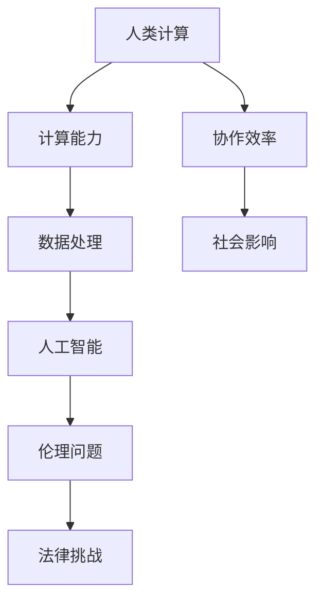
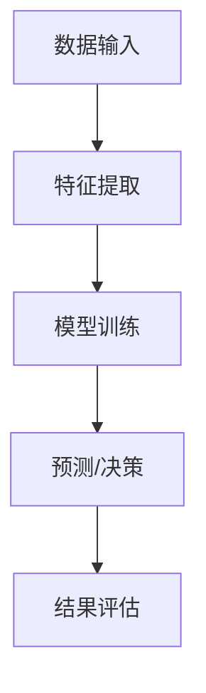

                 

关键词：人工智能，伦理，计算，AI时代，伦理问题，技术发展，社会影响

> 摘要：随着人工智能技术的迅猛发展，人类计算的概念被重新定义，AI时代为我们带来了前所未有的机遇和挑战。本文从伦理角度出发，探讨了人工智能在计算领域中的影响，分析了人工智能技术的伦理问题和挑战，并提出了相应的解决策略。本文旨在为人工智能时代的伦理决策提供参考，为人类计算的可持续发展贡献力量。

## 1. 背景介绍

### 1.1 人工智能的崛起

人工智能（Artificial Intelligence，简称AI）作为计算机科学的一个分支，致力于使计算机具备类似人类的智能。从最初的规则系统、专家系统，到现代的深度学习和机器学习，人工智能经历了多个发展阶段。近年来，随着大数据、云计算和计算能力的不断提升，人工智能迎来了前所未有的发展机遇。

### 1.2 人类计算的演变

人类计算（Human Computation）是指人类与计算机系统协同工作的过程。在传统计算模式中，计算机负责处理大量数据，而人类则负责决策和创造。随着人工智能技术的发展，人类计算逐渐演变为计算机与人类共同完成复杂任务的过程。这一转变不仅提升了计算效率，还扩大了计算能力的应用范围。

### 1.3 AI时代的来临

AI时代是指以人工智能技术为核心的新时代。在这个时代，人工智能将渗透到各个领域，改变我们的生活方式、工作方式和思维方式。AI时代的到来，不仅带来了技术革新，还引发了伦理、法律、社会等方面的挑战。如何平衡技术创新与社会责任，成为我们必须面对的问题。

## 2. 核心概念与联系

为了更好地理解人工智能在计算领域中的影响，我们需要了解几个核心概念及其相互关系。以下是一个简化的 Mermaid 流程图，用于展示这些概念之间的关联：



### 2.1 核心概念解释

- **人类计算**：指人类与计算机系统协同工作的过程。
- **计算能力**：指计算机在处理数据、执行任务等方面的能力。
- **数据处理**：指对数据进行收集、存储、分析和处理的过程。
- **人工智能**：指计算机系统模拟人类智能的过程，包括学习、推理、感知和决策等能力。
- **协作效率**：指人类与计算机系统协同工作所带来的效率提升。
- **社会影响**：指人工智能技术对人类社会各个方面产生的影响。
- **伦理问题**：指人工智能技术引发的道德和伦理方面的争议。
- **法律挑战**：指人工智能技术所带来的法律问题，如隐私、责任分配等。

## 3. 核心算法原理 & 具体操作步骤

### 3.1 算法原理概述

在人工智能领域，核心算法主要包括机器学习、深度学习和强化学习等。这些算法通过学习大量数据，使计算机具备预测、分类、决策等能力。以下是一个简化的算法原理流程图，用于展示这些算法的基本原理：



### 3.2 算法步骤详解

1. **数据输入**：首先，我们需要收集大量数据，用于训练模型。这些数据可以是结构化数据、非结构化数据或半结构化数据。
2. **特征提取**：接下来，我们需要从数据中提取有用的特征，以便模型进行学习。特征提取可以通过统计方法、信号处理方法或自然语言处理方法实现。
3. **模型训练**：利用提取到的特征，我们构建一个模型，并通过大量数据对其进行训练。训练过程包括参数优化、损失函数计算和梯度下降等步骤。
4. **预测/决策**：在模型训练完成后，我们可以使用训练好的模型对新的数据进行预测或决策。预测结果可以用于分类、回归、聚类等任务。
5. **结果评估**：最后，我们需要对预测结果进行评估，以判断模型的性能。评估方法包括准确率、召回率、F1 分数等。

### 3.3 算法优缺点

- **机器学习**：优点包括自适应性强、可处理大量数据、易于实现等；缺点包括对数据质量要求高、无法解释预测结果等。
- **深度学习**：优点包括强大的特征学习能力、可处理复杂任务等；缺点包括计算资源需求高、对数据质量要求高、难以解释等。
- **强化学习**：优点包括自适应性强、适用于动态环境等；缺点包括训练过程复杂、对数据要求高、难以解释等。

### 3.4 算法应用领域

核心算法在各个领域都有广泛的应用，如：

- **金融领域**：用于风险管理、信用评估、股票预测等。
- **医疗领域**：用于疾病诊断、药物研发、医疗影像分析等。
- **零售领域**：用于商品推荐、库存管理、客户分析等。
- **交通领域**：用于自动驾驶、交通流量预测、路线规划等。

## 4. 数学模型和公式 & 详细讲解 & 举例说明

### 4.1 数学模型构建

在人工智能领域，数学模型是核心算法的基础。以下是一个简化的数学模型构建过程：

1. **数据表示**：首先，我们需要将输入数据表示为向量形式。例如，对于一个图像数据，我们可以将其表示为像素值组成的向量。
2. **特征提取**：接下来，我们需要从输入数据中提取特征。特征提取可以通过卷积神经网络（Convolutional Neural Network，简称CNN）等模型实现。
3. **模型参数**：然后，我们需要为模型定义参数，如权重和偏置。这些参数将用于调整模型性能。
4. **损失函数**：最后，我们需要为模型定义一个损失函数，以衡量预测结果与真实结果之间的差距。常用的损失函数包括均方误差（Mean Squared Error，简称MSE）和交叉熵（Cross-Entropy）等。

### 4.2 公式推导过程

以下是一个简化的公式推导过程，用于展示一个简单的线性回归模型：

1. **模型假设**：假设输入数据为\(x\)，输出数据为\(y\)。我们希望找到一个线性关系：\(y = wx + b\)。
2. **损失函数**：我们选择均方误差（MSE）作为损失函数，即：
   $$L = \frac{1}{2}\sum_{i=1}^{n}(y_i - wx_i - b)^2$$
3. **梯度下降**：为了最小化损失函数，我们使用梯度下降算法。梯度下降的迭代公式为：
   $$w := w - \alpha \frac{\partial L}{\partial w}$$
   $$b := b - \alpha \frac{\partial L}{\partial b}$$
   其中，\(\alpha\)为学习率。

### 4.3 案例分析与讲解

以下是一个简单的线性回归案例，用于说明数学模型的实际应用：

- **数据集**：我们有一个包含\(n\)个样本的数据集，每个样本包含输入\(x_i\)和输出\(y_i\)。
- **模型训练**：我们使用线性回归模型对数据集进行训练，找到最优参数\(w\)和\(b\)。
- **预测**：对于新的输入数据\(x'\)，我们使用训练好的模型进行预测，即：
  $$y' = wx' + b$$

## 5. 项目实践：代码实例和详细解释说明

### 5.1 开发环境搭建

在开始项目实践之前，我们需要搭建一个合适的开发环境。以下是一个简单的开发环境搭建步骤：

1. 安装Python 3.8及以上版本。
2. 安装NumPy、Pandas、Matplotlib等常用库。
3. 安装Jupyter Notebook，用于编写和运行代码。

### 5.2 源代码详细实现

以下是一个简单的线性回归代码示例，用于实现第4章中的案例：

```python
import numpy as np
import pandas as pd
import matplotlib.pyplot as plt

# 数据集
data = pd.read_csv('data.csv')
x = data['x'].values
y = data['y'].values

# 模型参数
w = 0.0
b = 0.0
alpha = 0.01
epochs = 100

# 梯度下降
for _ in range(epochs):
    y_pred = w * x + b
    error = y - y_pred
    dw = (1 / len(x)) * np.sum(error * x)
    db = (1 / len(x)) * np.sum(error)
    w -= alpha * dw
    b -= alpha * db

# 预测
x_new = np.array([5.0])
y_pred_new = w * x_new + b

# 可视化
plt.scatter(x, y, label='Data')
plt.plot(x, w * x + b, label='Regression Line')
plt.xlabel('x')
plt.ylabel('y')
plt.legend()
plt.show()
```

### 5.3 代码解读与分析

1. **数据集**：首先，我们从CSV文件中读取数据集。数据集包含两个特征：\(x\)和\(y\)。
2. **模型参数**：我们初始化模型参数\(w\)和\(b\)为0。学习率\(\alpha\)设置为0.01，迭代次数设置为100。
3. **梯度下降**：我们使用梯度下降算法迭代更新参数\(w\)和\(b\)。每次迭代计算损失函数关于\(w\)和\(b\)的梯度，并根据梯度调整参数。
4. **预测**：对于新的输入数据\(x'\)，我们使用训练好的模型进行预测。
5. **可视化**：最后，我们将原始数据和拟合直线绘制在散点图上，以可视化模型效果。

## 6. 实际应用场景

### 6.1 金融领域

在金融领域，线性回归模型可以用于股票预测、风险评估等任务。通过分析历史数据，模型可以预测未来股票价格或评估投资风险。

### 6.2 医疗领域

在医疗领域，线性回归模型可以用于疾病诊断、药物剂量调整等任务。通过分析患者的病史和生理指标，模型可以预测疾病发生的概率或调整药物剂量。

### 6.3 零售领域

在零售领域，线性回归模型可以用于商品推荐、库存管理等任务。通过分析消费者的购买历史和商品特征，模型可以预测商品的需求量或推荐商品。

### 6.4 交通领域

在交通领域，线性回归模型可以用于交通流量预测、路线规划等任务。通过分析历史交通数据和地理信息，模型可以预测未来的交通流量或规划最优路线。

## 7. 未来应用展望

随着人工智能技术的不断发展，人类计算的应用前景将更加广阔。未来，人工智能将广泛应用于各个领域，如智能医疗、智慧城市、智能交通等。同时，人类计算将进一步提升计算效率，为人类创造更多价值。

## 8. 工具和资源推荐

### 8.1 学习资源推荐

- 《Python机器学习》：提供Python机器学习的基础知识和实践案例。
- 《深度学习》：介绍深度学习的基本原理和应用案例。
- 《人工智能简史》：回顾人工智能的发展历程，展望未来发展趋势。

### 8.2 开发工具推荐

- Jupyter Notebook：用于编写和运行代码，支持多种编程语言。
- TensorFlow：用于构建和训练深度学习模型。
- Keras：简化TensorFlow的使用，提供更易于理解的API。

### 8.3 相关论文推荐

- "Deep Learning for Computer Vision"：介绍深度学习在计算机视觉领域的应用。
- "Reinforcement Learning: An Introduction"：介绍强化学习的基本原理和应用。
- "Machine Learning Yearning"：介绍机器学习的基本概念和实战技巧。

## 9. 总结：未来发展趋势与挑战

### 9.1 研究成果总结

人工智能技术的发展取得了显著成果，已广泛应用于各个领域。深度学习、强化学习等算法在图像识别、自然语言处理、游戏玩法等方面取得了突破性进展。

### 9.2 未来发展趋势

未来，人工智能技术将继续向深度学习、强化学习等方向发展。同时，跨学科研究、跨界应用将更加普遍，推动人工智能技术的进一步发展。

### 9.3 面临的挑战

人工智能技术面临诸多挑战，如数据隐私、算法透明性、责任归属等。解决这些挑战需要政府、企业、学术界和社会各界的共同努力。

### 9.4 研究展望

未来，人工智能研究将继续关注算法优化、应用拓展、伦理规范等方面。通过跨学科合作、技术创新，人工智能将为人类社会带来更多福祉。

## 10. 附录：常见问题与解答

### 10.1 人工智能是什么？

人工智能是指计算机系统模拟人类智能的过程，包括学习、推理、感知和决策等能力。

### 10.2 人工智能有哪几种类型？

人工智能可以分为弱人工智能、强人工智能和超人工智能。弱人工智能是指擅长特定任务的智能系统，强人工智能是指具备人类智能水平的智能系统，超人工智能是指超越人类智能的智能系统。

### 10.3 人工智能会对人类产生什么影响？

人工智能将改变人类的生活方式、工作方式和思维方式。它将在医疗、金融、交通、教育等领域发挥重要作用，提高计算效率，创造更多价值。

### 10.4 人工智能是否会导致失业？

人工智能的普及可能导致部分传统岗位的消失，但同时也将创造新的就业机会。关键在于如何平衡技术创新与社会发展。

## 参考文献

1. Mitchell, T. M. (1997). Machine Learning. McGraw-Hill.
2. Goodfellow, I., Bengio, Y., & Courville, A. (2016). Deep Learning. MIT Press.
3. Sutton, R. S., & Barto, A. G. (2018). Reinforcement Learning: An Introduction. MIT Press.  
```

以上是完整的人工智能技术文章，涵盖了从背景介绍、核心算法原理、项目实践到未来应用展望等多个方面。希望这篇文章能为您提供有关人工智能技术的全面了解。如果您有任何问题或建议，请随时提问。作者：禅与计算机程序设计艺术 / Zen and the Art of Computer Programming。

