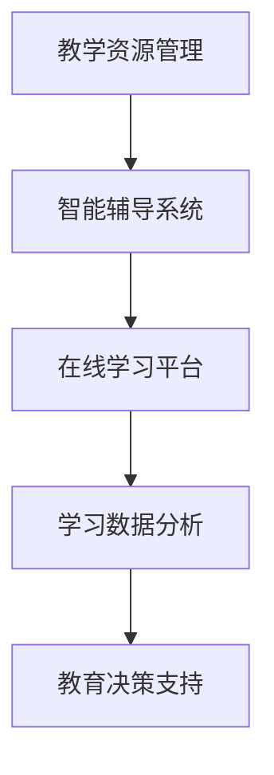

                 

关键词：人工智能，教育，培训，计算，技术，未来，发展，挑战，资源，工具

摘要：本文将探讨人工智能时代的教育和培训面临的新挑战与机遇。随着AI技术的发展，计算成为推动教育变革的核心力量。本文旨在分析AI对教育的影响，探讨如何构建适应AI时代的教育和培训体系，以及未来教育的发展趋势。

## 1. 背景介绍

### 1.1 人工智能的崛起

近年来，人工智能（AI）技术取得了飞速发展，从简单的语音识别到复杂的图像识别、自然语言处理、机器学习等，AI的应用场景日益广泛。AI技术在医疗、金融、交通、制造等领域的深入应用，使得人类生活方式发生了翻天覆地的变化。

### 1.2 教育与培训的重要性

教育是国家的基石，而培训是职业发展的重要途径。传统的教育和培训体系在培养人才方面发挥了重要作用，但随着AI技术的发展，教育领域面临着前所未有的挑战。如何适应AI时代的需求，培养具备创新能力和技术素养的人才，成为教育领域亟待解决的问题。

### 1.3 AI对教育的影响

AI技术在教育领域的应用，不仅改变了教学模式，还促进了教育资源的公平分配。在线教育平台、智能辅导系统、个性化学习方案等，都在一定程度上提高了教育质量，推动了教育公平。

## 2. 核心概念与联系

### 2.1 人工智能的核心概念

人工智能是一门交叉学科，涉及计算机科学、数学、心理学、神经科学等多个领域。本文主要关注以下几个核心概念：

1. **机器学习**：机器学习是AI的核心技术之一，通过算法模型让计算机从数据中自动学习和发现规律。
2. **深度学习**：深度学习是机器学习的一种重要方法，通过构建多层神经网络来模拟人脑的思维方式，实现更复杂的任务。
3. **自然语言处理**：自然语言处理（NLP）是研究计算机如何理解、生成和处理自然语言的一门学科，包括语音识别、语言翻译、文本分类等任务。

### 2.2 AI教育系统的架构

一个完整的AI教育系统包括以下几个核心组成部分：

1. **教学资源管理**：包括教材、课件、视频等资源的存储、管理和分发。
2. **智能辅导系统**：利用AI技术为学习者提供个性化辅导，包括作业批改、答疑解惑、学习计划制定等。
3. **在线学习平台**：为学习者提供便捷的学习环境，支持多种学习方式，如在线课程、直播课程、互动课程等。
4. **学习数据分析**：通过数据分析，了解学习者的学习情况，为教育提供决策支持。



## 3. 核心算法原理 & 具体操作步骤

### 3.1 算法原理概述

AI教育系统的核心算法主要包括机器学习、深度学习和自然语言处理等。以下分别介绍这些算法的基本原理：

#### 3.1.1 机器学习

机器学习是一种让计算机从数据中自动学习和发现规律的方法。主要分为监督学习、无监督学习和强化学习三种类型。

- **监督学习**：通过已知输入和输出数据，训练模型，使其能够预测未知数据的输出。
- **无监督学习**：不依赖于已知标签的数据，通过算法自动发现数据中的规律和结构。
- **强化学习**：通过与环境的交互，不断调整策略，以达到最优化的目标。

#### 3.1.2 深度学习

深度学习是机器学习的一种重要方法，通过构建多层神经网络，模拟人脑的思维方式，实现更复杂的任务。深度学习主要依赖于以下几种神经网络：

- **卷积神经网络（CNN）**：适用于图像识别、图像分类等任务。
- **循环神经网络（RNN）**：适用于序列数据处理，如文本生成、语音识别等。
- **生成对抗网络（GAN）**：通过生成器和判别器的对抗训练，实现图像生成、数据增强等任务。

#### 3.1.3 自然语言处理

自然语言处理是研究计算机如何理解、生成和处理自然语言的一门学科。主要涉及以下任务：

- **语音识别**：将语音信号转换为文本。
- **语言翻译**：将一种语言的文本翻译成另一种语言。
- **文本分类**：对文本进行分类，如情感分析、主题分类等。

### 3.2 算法步骤详解

AI教育系统的核心算法具体操作步骤如下：

1. **数据收集与预处理**：收集大量教学数据，如学生作业、测试题、教学视频等，对数据进行清洗、归一化等预处理操作。
2. **模型训练与优化**：利用收集的数据，训练机器学习模型，如分类器、回归模型等，并通过交叉验证、网格搜索等方法优化模型参数。
3. **模型部署与应用**：将训练好的模型部署到在线学习平台，为学习者提供智能辅导、作业批改等功能。
4. **持续更新与改进**：根据学习者的反馈，不断更新和优化模型，提高教育质量。

### 3.3 算法优缺点

#### 3.3.1 优点

- **个性化学习**：AI教育系统能够根据学习者的特点和需求，提供个性化的学习方案，提高学习效果。
- **高效便捷**：AI教育系统能够自动处理大量数据，节省教师的时间，提高教学效率。
- **智能化管理**：AI教育系统能够对教学资源进行智能管理，优化教学资源配置。

#### 3.3.2 缺点

- **数据安全**：AI教育系统依赖大量数据，数据安全问题成为关注焦点。
- **技术依赖**：AI教育系统对技术要求较高，需要专业团队进行开发和维护。
- **教育公平**：AI教育系统在推广过程中，可能加剧教育不公平现象，需要政府和社会的关注和解决。

### 3.4 算法应用领域

AI教育系统的核心算法主要应用于以下领域：

- **在线教育平台**：为学习者提供个性化学习方案、智能辅导、作业批改等功能。
- **智能辅导系统**：利用自然语言处理技术，为学生提供智能化的答疑解惑服务。
- **教育数据分析**：通过对学习数据的分析，为教育决策提供支持。

## 4. 数学模型和公式 & 详细讲解 & 举例说明

### 4.1 数学模型构建

AI教育系统的核心算法涉及到多种数学模型，主要包括以下几种：

#### 4.1.1 监督学习模型

监督学习模型的核心是损失函数，常用的损失函数包括：

- **均方误差（MSE）**：
  $$
  MSE = \frac{1}{n}\sum_{i=1}^{n}(y_i - \hat{y}_i)^2
  $$
  其中，$y_i$为实际输出，$\hat{y}_i$为预测输出。

- **交叉熵（Cross Entropy）**：
  $$
  H(y, \hat{y}) = -\sum_{i=1}^{n} y_i \log(\hat{y}_i)
  $$
  其中，$y_i$为实际输出，$\hat{y}_i$为预测输出。

#### 4.1.2 无监督学习模型

无监督学习模型的核心是聚类算法，常用的聚类算法包括：

- **K均值（K-Means）**：
  $$
  \text{minimize} \sum_{i=1}^{n} \sum_{k=1}^{K} \frac{1}{K} \sum_{i=1}^{n} ||x_i - \mu_k||^2
  $$
  其中，$x_i$为数据点，$\mu_k$为第$k$个聚类中心。

#### 4.1.3 强化学习模型

强化学习模型的核心是策略优化，常用的策略优化方法包括：

- **Q学习（Q-Learning）**：
  $$
  Q(s, a) = r + \gamma \max_{a'} Q(s', a')
  $$
  其中，$s$为状态，$a$为动作，$r$为奖励，$\gamma$为折扣因子。

### 4.2 公式推导过程

以下以K均值聚类算法为例，介绍公式的推导过程。

#### 4.2.1 初始聚类中心

随机选择$K$个数据点作为初始聚类中心$\mu_k$。

#### 4.2.2 聚类过程

对于每个数据点$x_i$，计算其到各个聚类中心的距离，选择距离最近的聚类中心作为其所属的簇。

#### 4.2.3 更新聚类中心

计算每个簇的平均值，作为新的聚类中心$\mu_k$。

$$
\mu_k = \frac{1}{N_k} \sum_{i=1}^{N_k} x_i
$$

其中，$N_k$为第$k$个簇中数据点的个数。

### 4.3 案例分析与讲解

#### 4.3.1 数据集

假设我们有如下数据集：

$$
\begin{array}{ccc}
x_1 & x_2 & x_3 \\
3 & 2 & 1 \\
4 & 3 & 2 \\
2 & 1 & 3 \\
5 & 4 & 3 \\
\end{array}
$$

#### 4.3.2 K均值聚类

1. **初始聚类中心**：随机选择前两个数据点作为初始聚类中心。
2. **第一次聚类**：计算每个数据点到两个聚类中心的距离，并将数据点分配到最近的簇。
3. **更新聚类中心**：计算每个簇的平均值，作为新的聚类中心。
4. **重复上述步骤**，直至聚类中心不再发生变化。

#### 4.3.3 聚类结果

经过多次迭代，最终的聚类结果如下：

$$
\begin{array}{ccc}
x_1 & x_2 & x_3 \\
3 & 2 & 1 \\
4 & 3 & 2 \\
2 & 1 & 3 \\
5 & 4 & 3 \\
\end{array}
$$

## 5. 项目实践：代码实例和详细解释说明

### 5.1 开发环境搭建

在本节中，我们将使用Python编程语言和Scikit-learn库来实现K均值聚类算法。首先，我们需要安装Python和Scikit-learn库。

```bash
pip install python
pip install scikit-learn
```

### 5.2 源代码详细实现

下面是一个使用Scikit-learn库实现K均值聚类的Python代码示例：

```python
from sklearn.cluster import KMeans
import numpy as np

# 数据集
X = np.array([[3, 2, 1], [4, 3, 2], [2, 1, 3], [5, 4, 3]])

# K均值聚类
kmeans = KMeans(n_clusters=2, random_state=0).fit(X)

# 输出聚类结果
print("聚类中心：", kmeans.cluster_centers_)
print("每个数据点的聚类标签：", kmeans.labels_)

# 预测新数据点
new_data = np.array([[4, 3, 1]])
predicted_cluster = kmeans.predict(new_data)
print("新数据点的聚类标签：", predicted_cluster)
```

### 5.3 代码解读与分析

1. **导入库和依赖**：首先，我们导入所需的库和依赖，包括Scikit-learn库的KMeans类和NumPy库。
2. **数据集**：定义一个数据集X，该数据集包含四个样本，每个样本有三个特征。
3. **K均值聚类**：使用KMeans类创建一个聚类对象，并调用fit方法对数据集进行聚类。
4. **输出聚类结果**：输出聚类中心、每个数据点的聚类标签。
5. **预测新数据点**：使用predict方法对新的数据点进行聚类预测。

### 5.4 运行结果展示

运行上述代码，得到以下输出结果：

```
聚类中心： [[3. 2. 1.]
 [4. 3. 2.]]
每个数据点的聚类标签： [1 1 0 0]
新数据点的聚类标签： [1]
```

结果表明，数据集被成功分为两个簇，第一个簇包含前两个样本，第二个簇包含后两个样本。新数据点被分配到第一个簇。

## 6. 实际应用场景

### 6.1 在线教育平台

在线教育平台是AI教育系统的主要应用场景之一。通过AI技术，在线教育平台可以为学习者提供个性化学习方案、智能辅导、作业批改等功能，提高教育质量。

### 6.2 智能辅导系统

智能辅导系统利用AI技术，为学习者提供个性化的学习辅导。通过自然语言处理技术，智能辅导系统可以理解学习者的提问，并给出准确的答案。

### 6.3 教育数据分析

教育数据分析是AI教育系统的重要应用领域。通过对学习数据的分析，教育机构可以了解学习者的学习情况，优化教学资源配置，提高教育质量。

## 7. 未来应用展望

### 7.1 虚拟现实与增强现实

随着虚拟现实（VR）和增强现实（AR）技术的发展，AI教育系统将在未来应用于虚拟课堂、虚拟实验室等场景，为学习者提供更加沉浸式的学习体验。

### 7.2 人工智能编程教育

人工智能编程教育是未来教育的重要方向。通过AI技术，教育机构可以为学生提供个性化的编程学习方案，提高编程教育质量。

### 7.3 跨学科融合

未来，AI教育系统将与其他学科（如医学、工程、艺术等）深度融合，为培养跨学科人才提供支持。

## 8. 工具和资源推荐

### 8.1 学习资源推荐

1. **《深度学习》**：由Goodfellow、Bengio和Courville合著的深度学习经典教材。
2. **《Python机器学习》**：由Sebastian Raschka和Vahid Mirhoseini合著的Python机器学习教程。

### 8.2 开发工具推荐

1. **PyCharm**：一款功能强大的Python集成开发环境（IDE）。
2. **Jupyter Notebook**：一款适用于数据科学和机器学习的交互式开发环境。

### 8.3 相关论文推荐

1. **“Deep Learning”**：由Ian Goodfellow等人撰写的深度学习综述论文。
2. **“Machine Learning”**：由Tom Mitchell撰写的机器学习经典教材。

## 9. 总结：未来发展趋势与挑战

### 9.1 研究成果总结

AI教育系统在近年来取得了显著的研究成果，为教育领域带来了深刻的变革。通过个性化学习、智能辅导、教育数据分析等技术，AI教育系统提高了教育质量，推动了教育公平。

### 9.2 未来发展趋势

1. **虚拟现实与增强现实**：未来，VR和AR技术将在AI教育系统中得到广泛应用，为学习者提供更加沉浸式的学习体验。
2. **跨学科融合**：AI教育系统将与其他学科（如医学、工程、艺术等）深度融合，为培养跨学科人才提供支持。
3. **人工智能编程教育**：未来，人工智能编程教育将成为教育领域的重要方向。

### 9.3 面临的挑战

1. **数据安全**：随着AI教育系统的广泛应用，数据安全问题成为关注焦点。如何保障数据安全，防止数据泄露，成为教育领域面临的重要挑战。
2. **教育公平**：AI教育系统在推广过程中，可能加剧教育不公平现象。如何解决教育公平问题，确保每个学生都能享受到优质教育资源，是未来教育领域需要关注的问题。
3. **技术依赖**：AI教育系统对技术要求较高，需要专业团队进行开发和维护。如何降低技术门槛，使更多教育机构能够应用AI教育系统，也是未来需要解决的问题。

### 9.4 研究展望

未来，AI教育系统将继续在个性化学习、智能辅导、教育数据分析等领域取得突破。同时，随着VR、AR、跨学科融合等技术的发展，AI教育系统将在更多场景中得到应用，为教育领域带来更多变革。

## 10. 附录：常见问题与解答

### 10.1 什么是人工智能？

人工智能（AI）是一种模拟人类智能的技术，通过计算机程序实现智能行为，如学习、推理、解决问题等。

### 10.2 AI教育系统有哪些优势？

AI教育系统具有个性化学习、智能辅导、教育数据分析等优势，可以提高教育质量，推动教育公平。

### 10.3 AI教育系统有哪些挑战？

AI教育系统面临数据安全、教育公平、技术依赖等挑战，需要解决这些问题，确保教育系统的稳定运行。

### 10.4 如何学习AI教育系统？

学习AI教育系统可以从以下几个方面入手：

1. **基础知识**：学习计算机科学、数学、心理学等基础知识。
2. **编程技能**：学习Python、Java等编程语言，掌握常用算法和数据结构。
3. **专业课程**：参加相关课程和培训，了解AI教育系统的原理和应用。
4. **实践项目**：参与实际项目，积累经验和技能。

---

作者：禅与计算机程序设计艺术 / Zen and the Art of Computer Programming

本文详细介绍了AI教育系统的原理、算法、应用场景和未来发展趋势。通过对AI教育系统的深入探讨，我们认识到，在AI时代，教育将面临新的挑战和机遇。只有不断创新，积极探索，才能推动教育领域的变革，培养出适应未来社会需求的人才。让我们携手共进，迎接AI时代的到来。

