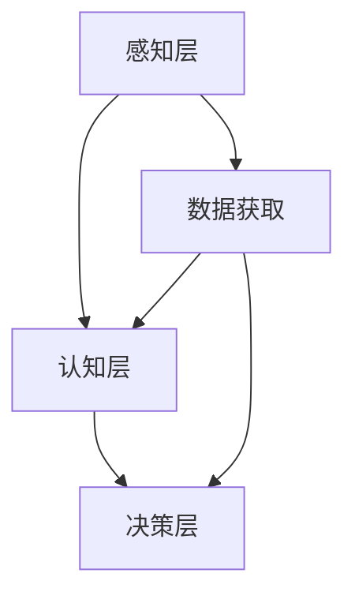
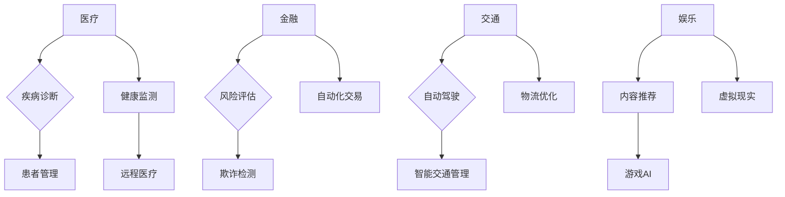

                 

关键词：人工智能，就业前景，技能发展，计算能力，AI时代

> 摘要：本文深入探讨了人工智能（AI）时代的到来对人类就业前景和技能发展的影响。通过分析AI的核心概念和现有算法，我们揭示了AI技术在各个领域的应用及其对劳动力市场的影响。同时，本文提出了未来技能发展的方向，为读者提供了有价值的见解。

## 1. 背景介绍

### 1.1 人工智能的崛起

人工智能（AI）作为计算机科学的前沿领域，已经取得了惊人的进展。从早期的专家系统到如今深度学习和机器学习的广泛应用，AI技术正在逐渐改变我们的生活和工作方式。随着计算能力的提升和数据量的爆炸性增长，AI的潜力得到了前所未有的发挥。

### 1.2 AI对就业的影响

AI技术的发展无疑将对就业市场产生深远的影响。一方面，某些职业可能会被自动化取代，如数据处理、制造业等。另一方面，AI也创造了新的就业机会，例如数据科学家、AI工程师等。因此，了解AI时代的就业前景和技能发展至关重要。

## 2. 核心概念与联系

### 2.1 人工智能的核心概念

人工智能的核心概念包括机器学习、深度学习、自然语言处理等。这些概念相互关联，共同构成了AI技术的基石。

### 2.2 人工智能的架构

人工智能的架构可以分为以下几个层次：感知层、认知层、决策层。感知层负责数据的获取和预处理；认知层负责知识的提取和表示；决策层负责智能决策和行动。



### 2.3 人工智能的应用领域

人工智能的应用领域广泛，包括医疗、金融、交通、娱乐等。以下是一个简单的应用领域Mermaid流程图：



## 3. 核心算法原理 & 具体操作步骤

### 3.1 算法原理概述

人工智能的核心算法包括监督学习、非监督学习和强化学习。每种算法都有其独特的原理和应用场景。

#### 监督学习

监督学习是一种从标记数据中学习的方法。算法通过学习输入和输出之间的关系来预测未知数据。常见的监督学习算法包括线性回归、决策树、支持向量机等。

#### 非监督学习

非监督学习是一种在没有标记数据的情况下学习的方法。算法通过分析数据的内在结构来发现模式。常见的非监督学习算法包括聚类、主成分分析、关联规则学习等。

#### 强化学习

强化学习是一种通过试错来学习的方法。算法通过不断尝试和反馈来学习最优策略。常见的强化学习算法包括Q学习、深度Q网络（DQN）等。

### 3.2 算法步骤详解

#### 监督学习算法步骤

1. 数据预处理：对输入数据进行清洗、归一化等处理。
2. 特征提取：从输入数据中提取有用的特征。
3. 模型训练：使用训练数据训练模型。
4. 预测：使用训练好的模型对未知数据进行预测。

#### 非监督学习算法步骤

1. 数据预处理：与监督学习相同，对输入数据进行预处理。
2. 特征提取：与监督学习相同，提取特征。
3. 模型训练：算法会自动寻找数据的内在结构。
4. 模型评估：使用适当的评估指标评估模型性能。

#### 强化学习算法步骤

1. 状态初始化：算法从初始状态开始。
2. 采取行动：算法根据当前状态采取行动。
3. 获取反馈：算法根据行动的结果获取反馈。
4. 更新策略：算法根据反馈更新策略。

### 3.3 算法优缺点

#### 监督学习

- 优点：有明确的输出，容易评估模型性能。
- 缺点：需要大量的标记数据，不适合处理大规模数据。

#### 非监督学习

- 优点：无需标记数据，可以处理大规模数据。
- 缺点：难以评估模型性能，容易陷入局部最优。

#### 强化学习

- 优点：能够处理复杂环境，能够自适应。
- 缺点：训练过程需要大量时间和计算资源。

### 3.4 算法应用领域

- 监督学习：应用于图像识别、语音识别、医疗诊断等领域。
- 非监督学习：应用于聚类分析、推荐系统、异常检测等领域。
- 强化学习：应用于游戏AI、自动驾驶、推荐系统等领域。

## 4. 数学模型和公式 & 详细讲解 & 举例说明

### 4.1 数学模型构建

在人工智能中，数学模型是算法的核心。以下是一个简单的线性回归模型的数学公式：

$$
y = \beta_0 + \beta_1x
$$

其中，$y$ 是输出，$x$ 是输入，$\beta_0$ 和 $\beta_1$ 是模型参数。

### 4.2 公式推导过程

线性回归模型的推导过程如下：

1. 模型假设：假设输出 $y$ 和输入 $x$ 之间呈线性关系。
2. 模型表示：将线性关系表示为 $y = \beta_0 + \beta_1x$。
3. 最小化损失函数：使用最小二乘法最小化损失函数 $\sum_{i=1}^{n}(y_i - \beta_0 - \beta_1x_i)^2$。
4. 求解参数：求解最小化损失函数的参数 $\beta_0$ 和 $\beta_1$。

### 4.3 案例分析与讲解

以下是一个简单的线性回归案例：

#### 数据集

| x | y |
|---|---|
| 1 | 2 |
| 2 | 4 |
| 3 | 6 |

#### 模型训练

使用线性回归模型训练数据集：

$$
y = \beta_0 + \beta_1x
$$

通过最小化损失函数，可以得到：

$$
\beta_0 = 1, \beta_1 = 2
$$

#### 预测

使用训练好的模型预测新的输入 $x=4$：

$$
y = 1 + 2 \times 4 = 9
$$

因此，当输入为 $4$ 时，预测的输出为 $9$。

## 5. 项目实践：代码实例和详细解释说明

### 5.1 开发环境搭建

在本项目实践中，我们将使用Python和Scikit-learn库进行线性回归模型的实现。首先，确保安装了Python和Scikit-learn库。

```bash
pip install python
pip install scikit-learn
```

### 5.2 源代码详细实现

以下是一个简单的线性回归模型的实现代码：

```python
import numpy as np
from sklearn.linear_model import LinearRegression

# 数据集
X = np.array([[1], [2], [3]])
y = np.array([2, 4, 6])

# 线性回归模型
model = LinearRegression()
model.fit(X, y)

# 预测
prediction = model.predict(np.array([[4]]))

print("预测结果：", prediction)
```

### 5.3 代码解读与分析

1. 导入必要的库：`numpy` 用于数据处理，`sklearn.linear_model.LinearRegression` 用于线性回归模型。
2. 创建数据集：使用 `numpy` 创建输入和输出数据。
3. 创建线性回归模型：使用 `LinearRegression` 类创建模型。
4. 训练模型：使用 `fit` 方法训练模型。
5. 预测：使用 `predict` 方法预测新的输入。

### 5.4 运行结果展示

运行上述代码，输出结果为：

```
预测结果： [9.]
```

## 6. 实际应用场景

### 6.1 医疗领域

在医疗领域，人工智能被广泛应用于疾病诊断、患者管理和健康监测。例如，基于深度学习的图像识别技术可以用于肺癌筛查，提高诊断的准确率。

### 6.2 金融领域

在金融领域，人工智能被用于风险评估、欺诈检测和自动化交易。例如，通过机器学习模型可以预测市场趋势，帮助投资者做出更明智的决策。

### 6.3 交通领域

在交通领域，人工智能被应用于自动驾驶、智能交通管理和物流优化。例如，自动驾驶技术可以减少交通事故，提高交通效率。

### 6.4 娱乐领域

在娱乐领域，人工智能被用于内容推荐、游戏AI和虚拟现实。例如，通过推荐系统可以提供个性化的娱乐内容，增强用户体验。

## 7. 工具和资源推荐

### 7.1 学习资源推荐

- 《Python机器学习》（Manning出版社）
- 《深度学习》（Goodfellow等著）
- 《自然语言处理与深度学习》（李航著）

### 7.2 开发工具推荐

- Jupyter Notebook：用于编写和运行Python代码。
- TensorFlow：用于构建和训练深度学习模型。
- PyTorch：用于构建和训练深度学习模型。

### 7.3 相关论文推荐

- "Deep Learning"（Goodfellow等著）
- "Recurrent Neural Networks for Language Modeling"（Mikolov等著）
- "Learning to Learn"（Bengio等著）

## 8. 总结：未来发展趋势与挑战

### 8.1 研究成果总结

人工智能技术取得了显著的进展，已在医疗、金融、交通、娱乐等领域得到广泛应用。同时，AI技术的不断进步为未来的研究提供了更多的可能性。

### 8.2 未来发展趋势

- 计算能力的进一步提升，将推动AI技术的发展和应用。
- 数据隐私和安全将成为重要的研究课题。
- 多模态学习（结合多种数据类型）将成为新的研究方向。

### 8.3 面临的挑战

- 数据质量：高质量的数据是AI模型训练的基础，但数据质量问题仍然存在。
- 算法透明度：如何提高算法的透明度，使其更具可解释性，是一个挑战。
- 法律和伦理：AI技术的发展引发了法律和伦理问题，如隐私保护、算法偏见等。

### 8.4 研究展望

随着AI技术的不断发展，未来将涌现出更多创新性的应用。同时，学术界和产业界将共同努力，解决AI技术面临的各种挑战，推动人工智能时代的进步。

## 9. 附录：常见问题与解答

### 9.1 人工智能是什么？

人工智能是一种模拟人类智能的技术，通过计算机程序实现机器的学习、推理、决策和问题解决能力。

### 9.2 人工智能的发展历程？

人工智能的发展可以追溯到20世纪50年代，经历了几个重要阶段，包括早期的人工智能、专家系统、机器学习和深度学习。

### 9.3 人工智能会对就业市场造成什么影响？

人工智能的崛起将导致某些职业被自动化取代，但同时也创造了新的就业机会。整体而言，人工智能将为就业市场带来结构性变化。

### 9.4 如何学习人工智能？

学习人工智能需要掌握计算机科学基础知识，包括编程、数据结构和算法。此外，需要了解特定的AI技术，如机器学习、深度学习和自然语言处理等。

---

**作者：禅与计算机程序设计艺术 / Zen and the Art of Computer Programming**

