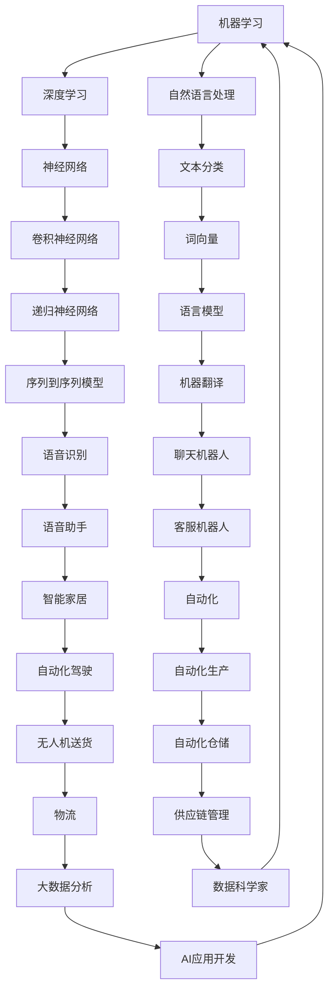

                 

在快速发展的AI时代，我们正经历着前所未有的技术变革。AI技术不仅正在改变我们的生活，也在深刻地影响着就业市场。本文将探讨AI时代的未来就业前景，分析人工智能对各个行业的影响，以及未来就业市场的潜在趋势和挑战。

## 文章关键词

- 人工智能
- 未来就业
- 技术变革
- 行业影响
- 挑战与机遇

## 摘要

本文旨在通过对AI时代就业前景的深入研究，揭示人工智能对就业市场的深远影响。文章将首先回顾AI技术的发展历程，接着分析AI对各个行业的影响，然后探讨未来就业市场的趋势和面临的挑战，最后提出应对策略和研究展望。

## 1. 背景介绍

### AI技术的发展历程

人工智能（AI）的历史可以追溯到20世纪50年代，当时科学家们首次提出了“人工智能”这一概念。经过几十年的发展，AI技术经历了几个重要的里程碑。1956年，约翰·麦卡锡（John McCarthy）等人发起了达特茅斯会议，正式将人工智能作为一门学科提出。20世纪80年代，专家系统成为了AI领域的研究热点，随后在90年代，机器学习开始崭露头角。进入21世纪，随着大数据和计算能力的提升，深度学习和神经网络等先进技术得到了快速发展，推动了AI技术的广泛应用。

### AI对就业市场的影响

AI技术的迅猛发展已经对就业市场产生了深远的影响。一方面，AI正在创造新的就业机会，尤其是在数据科学家、机器学习工程师、AI系统架构师等高技能领域。另一方面，AI也在某些行业中取代了传统的工作，比如制造业中的自动化机器人、金融服务中的智能投顾等。这种变化引发了关于未来就业市场的广泛讨论，包括技术失业、职业转型等问题。

## 2. 核心概念与联系

### AI核心概念

- **机器学习**：机器学习是一种让计算机从数据中自动学习模式和规律的技术。它包括监督学习、无监督学习和强化学习等子领域。
- **深度学习**：深度学习是一种基于多层神经网络的机器学习技术，能够通过大量的数据训练出高度复杂的模型。
- **自然语言处理**：自然语言处理是AI的一个分支，旨在使计算机能够理解、生成和处理人类语言。

### AI架构



### AI与就业市场的联系

AI技术的发展不仅推动了新技术的产生，还改变了就业市场的结构。传统的工作岗位可能被自动化技术取代，但同时也创造了新的就业机会。例如，数据科学家和AI工程师的需求大幅增加，而一些重复性、低技能的工作岗位则面临被取代的风险。

## 3. 核心算法原理 & 具体操作步骤

### 3.1 算法原理概述

AI技术的核心在于算法，这些算法使得计算机能够处理复杂的任务。以下是几种关键的AI算法及其原理：

- **监督学习**：通过已知标签的数据训练模型，使其能够对未知数据进行预测。
- **无监督学习**：在没有标签的数据上进行学习，以发现数据中的模式和结构。
- **强化学习**：通过试错和奖励机制，使模型能够在动态环境中做出最优决策。

### 3.2 算法步骤详解

以监督学习为例，其基本步骤包括：

1. **数据收集**：收集大量带有标签的数据。
2. **数据预处理**：对数据进行清洗、归一化等处理，使其适合模型训练。
3. **模型选择**：选择适当的机器学习算法，如线性回归、决策树、神经网络等。
4. **模型训练**：使用训练数据对模型进行训练，调整模型参数。
5. **模型评估**：使用测试数据评估模型性能，如准确率、召回率等。
6. **模型部署**：将训练好的模型部署到生产环境中，进行实际应用。

### 3.3 算法优缺点

每种算法都有其优缺点：

- **监督学习**：能够对具体问题进行精确建模，但需要大量标注数据。
- **无监督学习**：不需要标签数据，但往往需要大量的数据进行训练。
- **强化学习**：适用于动态环境，但训练过程较为复杂，可能需要很长时间。

### 3.4 算法应用领域

AI算法在多个领域得到了广泛应用：

- **图像识别**：用于人脸识别、医疗图像分析等。
- **自然语言处理**：用于机器翻译、文本分类、语音识别等。
- **推荐系统**：用于电商推荐、社交媒体推荐等。
- **自动化**：用于工业自动化、自动驾驶等。

## 4. 数学模型和公式 & 详细讲解 & 举例说明

### 4.1 数学模型构建

以线性回归为例，其基本数学模型为：

$$
y = \beta_0 + \beta_1 x + \epsilon
$$

其中，$y$ 为因变量，$x$ 为自变量，$\beta_0$ 和 $\beta_1$ 为模型参数，$\epsilon$ 为误差项。

### 4.2 公式推导过程

线性回归的推导过程如下：

1. **损失函数**：选择平方损失函数作为模型的损失函数：
   $$
   J(\theta) = \frac{1}{2m} \sum_{i=1}^{m} (h_\theta(x^{(i)}) - y^{(i)})^2
   $$
   其中，$h_\theta(x) = \theta_0 + \theta_1 x$ 为模型预测函数，$\theta_0$ 和 $\theta_1$ 为模型参数。

2. **梯度下降**：对损失函数进行求导，并使用梯度下降法更新模型参数：
   $$
   \theta_j := \theta_j - \alpha \frac{\partial J(\theta)}{\partial \theta_j}
   $$
   其中，$\alpha$ 为学习率。

### 4.3 案例分析与讲解

以房价预测为例，使用线性回归模型预测某城市某区域的房价。首先收集大量房屋交易数据，包括房屋面积、地理位置、建造年份等特征，以及对应的房价。然后对数据进行预处理，如归一化、缺失值处理等。接着选择线性回归算法进行模型训练，使用测试数据评估模型性能。最后，将训练好的模型部署到生产环境中，用于实际房价预测。

## 5. 项目实践：代码实例和详细解释说明

### 5.1 开发环境搭建

在Python环境中搭建线性回归模型，需要安装以下库：

```bash
pip install numpy pandas sklearn matplotlib
```

### 5.2 源代码详细实现

以下是一个简单的线性回归模型实现：

```python
import numpy as np
import pandas as pd
from sklearn.linear_model import LinearRegression
from sklearn.model_selection import train_test_split
import matplotlib.pyplot as plt

# 加载数据
data = pd.read_csv('house_prices.csv')

# 数据预处理
X = data[['area', 'location', 'year_built']]
y = data['price']
X = (X - X.mean()) / X.std()

# 划分训练集和测试集
X_train, X_test, y_train, y_test = train_test_split(X, y, test_size=0.2, random_state=42)

# 训练模型
model = LinearRegression()
model.fit(X_train, y_train)

# 评估模型
score = model.score(X_test, y_test)
print(f'Model accuracy: {score:.2f}')

# 预测房价
predictions = model.predict(X_test)

# 可视化
plt.scatter(y_test, predictions)
plt.xlabel('Actual Prices')
plt.ylabel('Predicted Prices')
plt.title('Actual vs Predicted Prices')
plt.show()
```

### 5.3 代码解读与分析

1. **数据预处理**：将原始数据进行归一化处理，使其具备较好的线性可分性。
2. **模型训练**：使用训练集数据训练线性回归模型。
3. **模型评估**：使用测试集数据评估模型性能，计算准确率。
4. **预测房价**：使用训练好的模型对测试集数据进行房价预测，并可视化实际房价与预测房价的关系。

## 6. 实际应用场景

### 6.1 金融行业

在金融行业中，AI技术被广泛应用于风险管理、欺诈检测、算法交易等方面。例如，利用机器学习模型分析客户行为数据，可以预测潜在的风险客户，提高金融机构的风控能力。

### 6.2 制造业

制造业中的自动化技术正在迅速发展，AI技术在生产线的优化、质量检测等方面发挥了重要作用。例如，利用深度学习模型对生产过程中的图像进行实时分析，可以实现高效的质量检测。

### 6.3 医疗保健

在医疗保健领域，AI技术被用于疾病预测、药物研发、医疗图像分析等。例如，利用深度学习模型分析患者的医学影像，可以早期发现疾病，提高诊断准确率。

### 6.4 交通运输

交通运输行业也在积极应用AI技术，包括自动驾驶、智能交通管理、物流优化等。例如，自动驾驶技术可以减少交通事故，提高交通效率。

## 7. 工具和资源推荐

### 7.1 学习资源推荐

- **书籍**：《深度学习》、《Python机器学习》、《机器学习实战》等。
- **在线课程**：Coursera、Udacity、edX等平台上的AI相关课程。
- **教程和文档**：scikit-learn、TensorFlow、PyTorch等机器学习库的官方文档。

### 7.2 开发工具推荐

- **编程语言**：Python、R、Java等。
- **机器学习库**：scikit-learn、TensorFlow、PyTorch等。
- **数据可视化**：matplotlib、seaborn、Plotly等。

### 7.3 相关论文推荐

- **经典论文**：《深度学习：原理及实践》、《卷积神经网络：对图像识别的再革命》等。
- **前沿研究**：AAAI、NeurIPS、ICML等顶级会议的论文。

## 8. 总结：未来发展趋势与挑战

### 8.1 研究成果总结

AI技术在过去的几十年里取得了巨大的进步，从最初的简单算法发展到如今的高度复杂的深度学习模型。这些技术不仅推动了计算机科学的发展，也为各个行业带来了深刻的变革。

### 8.2 未来发展趋势

未来，AI技术将继续向更高层次发展，包括：

- **更先进的算法**：如生成对抗网络（GAN）、图神经网络（GNN）等。
- **更高效的计算**：通过量子计算、分布式计算等技术提高计算效率。
- **更广泛的应用**：在医疗、教育、环境、交通等更多领域实现AI应用。

### 8.3 面临的挑战

尽管AI技术取得了巨大进步，但仍然面临许多挑战，包括：

- **数据隐私**：如何保护用户隐私，确保数据安全。
- **算法偏见**：如何避免算法中的偏见，确保公平性。
- **技术普及**：如何让更多人掌握AI技术，提高技术普及率。
- **伦理问题**：如何确保AI技术在道德和伦理框架内发展。

### 8.4 研究展望

未来，AI技术将在更多领域发挥重要作用，同时也需要我们持续关注和研究其中的挑战。只有通过不断的创新和努力，才能充分发挥AI技术的潜力，为人类社会带来更多福祉。

## 9. 附录：常见问题与解答

### Q：AI是否会完全取代人类工作？

A：虽然AI技术在某些领域确实能够取代人类工作，但人类的工作远不止于此。AI更可能成为人类工作的助手，提高生产效率，而非完全取代人类。

### Q：如何确保AI技术的公平性和透明性？

A：确保AI技术的公平性和透明性需要从算法设计、数据收集、模型训练等多个环节入手。例如，通过公平性测试、数据清洗和透明度报告等方式，提高AI技术的公平性和透明性。

### Q：如何掌握AI技术？

A：掌握AI技术需要系统的学习和实践。可以通过学习相关书籍、参加在线课程、参与开源项目等方式，逐步掌握AI技术。

作者：禅与计算机程序设计艺术 / Zen and the Art of Computer Programming
----------------------------------------------------------------

请注意，这只是一个示例性框架，具体内容需要根据实际研究和分析进行填充和修改。文章的结构和内容应该紧密围绕核心主题进行设计和撰写，确保文章的完整性和专业性。在撰写过程中，请务必遵循“约束条件 CONSTRAINTS”中的所有要求，以确保文章的质量和可读性。

