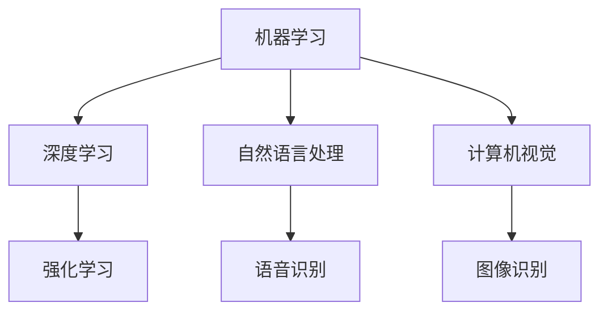

                 

关键词：人工智能，未来就业，技能发展，职业转型，技术趋势，教育改革

> 摘要：随着人工智能技术的迅猛发展，人类计算领域正面临着前所未有的变革。本文将深入探讨AI时代对就业市场的影响，分析技能发展趋势，并预测未来职业转型的方向，旨在为读者提供关于应对技术变革的洞察与建议。

## 1. 背景介绍

自20世纪中期计算机科学的诞生以来，信息技术一直以惊人的速度发展。特别是近年来，人工智能（AI）技术的突破性进展，彻底改变了人们的生活方式和工作模式。从自动驾驶汽车到智能语音助手，从医疗诊断到金融分析，AI的应用场景日益丰富，带来了前所未有的生产效率和生活便利。

然而，AI的快速发展也引发了广泛的讨论和担忧。一方面，AI被视为解决许多社会问题的强大工具，另一方面，人们担心这一技术可能会对就业市场造成巨大冲击，导致大规模失业。此外，AI对教育体系、法律体系、伦理道德等方面也提出了新的挑战。因此，探讨AI时代的未来就业市场与技能发展趋势，具有重要的现实意义。

## 2. 核心概念与联系

### 2.1. 人工智能的基本概念

人工智能是指计算机系统模拟人类智能的行为，实现感知、学习、推理、决策等能力。具体而言，AI技术包括机器学习、深度学习、自然语言处理、计算机视觉等多个子领域。这些技术共同构成了人工智能的技术图谱，如图2-1所示。



### 2.2. 人工智能与人类计算的联系

人类计算（Human Computing）是指通过人类思维和计算机技术的结合，实现更高效的计算过程。在AI时代，人类计算的重要性愈发凸显。一方面，人类在创造和优化算法、设计系统架构、处理复杂问题等方面具有独特的优势；另一方面，计算机技术为人类提供了强大的计算能力和数据处理能力，使得许多原本无法解决的问题变得可行。

### 2.3. 人工智能对就业市场的影响

人工智能的发展对就业市场的影响是多方面的。一方面，AI技术可以替代一些重复性和低技能的劳动力，导致部分工作岗位的减少；另一方面，AI技术也为新的职业机会创造了条件，例如数据科学家、机器学习工程师、AI产品经理等。因此，在AI时代，就业市场的转型既是挑战，也是机遇。

## 3. 核心算法原理 & 具体操作步骤

### 3.1. 算法原理概述

在人工智能领域，核心算法是驱动技术进步的关键。以下是几种重要的AI算法及其原理概述：

- **机器学习**：通过数据训练模型，使其具备对未知数据进行预测或分类的能力。
- **深度学习**：基于多层神经网络，通过反向传播算法优化模型参数，实现图像识别、语音识别等复杂任务。
- **自然语言处理**：利用统计模型或神经网络模型，实现对人类语言的理解和生成。
- **计算机视觉**：通过图像处理算法，实现对图像内容的理解和分析。

### 3.2. 算法步骤详解

以下以深度学习算法为例，详细解释其操作步骤：

1. **数据收集与预处理**：收集大量带标签的训练数据，对数据进行清洗、归一化等预处理操作。
2. **模型设计**：设计合适的神经网络架构，包括输入层、隐藏层和输出层。
3. **训练过程**：使用训练数据对模型进行训练，通过反向传播算法更新模型参数。
4. **模型评估**：使用验证数据对模型进行评估，调整模型参数以达到最佳性能。
5. **部署与应用**：将训练好的模型部署到实际应用场景中，实现对未知数据的预测或分类。

### 3.3. 算法优缺点

- **机器学习**：优点是能够处理大量数据，适应性强；缺点是依赖于数据质量，模型可解释性较差。
- **深度学习**：优点是能够自动提取特征，性能优异；缺点是模型复杂度高，训练时间长。
- **自然语言处理**：优点是能够理解并生成自然语言；缺点是语言复杂度高，难以处理长文本。
- **计算机视觉**：优点是能够处理图像和视频数据；缺点是模型解释性较差，对光照、遮挡等条件敏感。

### 3.4. 算法应用领域

- **机器学习**：广泛应用于金融、医疗、零售等领域，例如风险控制、疾病诊断、个性化推荐等。
- **深度学习**：广泛应用于图像识别、语音识别、自然语言处理等领域，例如自动驾驶、智能家居、智能客服等。
- **自然语言处理**：广泛应用于文本分类、情感分析、机器翻译等领域，例如搜索引擎、社交网络分析、智能客服等。
- **计算机视觉**：广泛应用于图像识别、目标检测、图像增强等领域，例如安防监控、医疗影像分析、图像编辑等。

## 4. 数学模型和公式 & 详细讲解 & 举例说明

### 4.1. 数学模型构建

在人工智能领域，数学模型是算法的核心。以下以深度学习中的神经网络模型为例，介绍数学模型的构建过程。

#### 模型定义

假设输入数据为\(x\)，经过\(L\)层神经网络后，输出为\(y\)。每层神经元数量分别为\(n_1, n_2, \ldots, n_L\)。则模型可以表示为：

$$
y = f(L)(f(L-1)(\ldots f(2)f(1)(x))\ldots)
$$

其中，\(f\)表示激活函数，通常使用Sigmoid、ReLU等函数。

#### 损失函数

损失函数用于评估模型预测结果与真实结果之间的差距，常见的损失函数有均方误差（MSE）和交叉熵（Cross-Entropy）。

$$
MSE = \frac{1}{m}\sum_{i=1}^{m}(y_i - \hat{y}_i)^2
$$

$$
Cross-Entropy = -\sum_{i=1}^{m}y_i\log\hat{y}_i
$$

其中，\(m\)表示样本数量，\(y_i\)和\(\hat{y}_i\)分别表示第\(i\)个样本的真实标签和预测概率。

#### 反向传播算法

反向传播算法用于更新模型参数，使其损失函数达到最小。具体步骤如下：

1. **前向传播**：计算输入和隐藏层的输出。
2. **计算梯度**：计算损失函数对每个参数的梯度。
3. **反向传播**：将梯度反向传播至输入层，更新参数。

### 4.2. 公式推导过程

以下以均方误差（MSE）为例，推导损失函数的梯度。

假设损失函数为MSE，即：

$$
MSE = \frac{1}{m}\sum_{i=1}^{m}(y_i - \hat{y}_i)^2
$$

其中，\(m\)表示样本数量，\(y_i\)和\(\hat{y}_i\)分别表示第\(i\)个样本的真实标签和预测概率。

对MSE关于参数\(w\)求导，得到：

$$
\frac{\partial MSE}{\partial w} = \frac{1}{m}\sum_{i=1}^{m}\frac{\partial (y_i - \hat{y}_i)^2}{\partial w}
$$

由于\(y_i\)为常数，对\(y_i - \hat{y}_i\)求导，得到：

$$
\frac{\partial (y_i - \hat{y}_i)}{\partial w} = \frac{\partial \hat{y}_i}{\partial w}
$$

将上式代入，得到：

$$
\frac{\partial MSE}{\partial w} = \frac{1}{m}\sum_{i=1}^{m}\frac{\partial \hat{y}_i}{\partial w}
$$

根据链式法则，对\(\hat{y}_i\)求导，得到：

$$
\frac{\partial \hat{y}_i}{\partial w} = \frac{\partial \hat{y}_i}{\partial z_i} \frac{\partial z_i}{\partial w}
$$

其中，\(z_i\)为隐藏层输出，\(w\)为输入层权重。

假设激活函数为ReLU，则有：

$$
\frac{\partial \hat{y}_i}{\partial z_i} =
\begin{cases}
0, & \text{if } z_i < 0 \\
1, & \text{if } z_i \geq 0
\end{cases}
$$

将上式代入，得到：

$$
\frac{\partial \hat{y}_i}{\partial w} =
\begin{cases}
0, & \text{if } z_i < 0 \\
\frac{\partial z_i}{\partial w}, & \text{if } z_i \geq 0
\end{cases}
$$

由于\(z_i\)是\(w\)的线性函数，因此\(\frac{\partial z_i}{\partial w} = 1\)。

综上所述，得到：

$$
\frac{\partial MSE}{\partial w} = \frac{1}{m}\sum_{i=1}^{m}\frac{\partial \hat{y}_i}{\partial w}
$$

### 4.3. 案例分析与讲解

以下以一个简单的线性回归问题为例，讲解数学模型的构建和反向传播算法的应用。

假设输入数据为\(x\)，输出为\(y\)，模型为线性回归：

$$
y = wx + b
$$

其中，\(w\)和\(b\)为参数，\(x\)和\(y\)为输入和输出。

#### 模型构建

首先，构建损失函数。假设损失函数为均方误差（MSE）：

$$
MSE = \frac{1}{m}\sum_{i=1}^{m}(y_i - \hat{y}_i)^2
$$

其中，\(m\)表示样本数量，\(y_i\)和\(\hat{y}_i\)分别表示第\(i\)个样本的真实标签和预测值。

#### 前向传播

对输入数据进行前向传播，计算预测值：

$$
\hat{y}_i = wx_i + b
$$

#### 反向传播

计算损失函数关于\(w\)和\(b\)的梯度：

$$
\frac{\partial MSE}{\partial w} = \frac{1}{m}\sum_{i=1}^{m}(y_i - \hat{y}_i)x_i
$$

$$
\frac{\partial MSE}{\partial b} = \frac{1}{m}\sum_{i=1}^{m}(y_i - \hat{y}_i)
$$

根据梯度下降法，更新参数：

$$
w = w - \alpha \frac{\partial MSE}{\partial w}
$$

$$
b = b - \alpha \frac{\partial MSE}{\partial b}
$$

其中，\(\alpha\)为学习率。

#### 迭代过程

1. 初始化参数\(w\)和\(b\)。
2. 进行前向传播，计算预测值。
3. 计算损失函数关于参数的梯度。
4. 更新参数。
5. 重复步骤2-4，直至损失函数收敛。

通过迭代过程，模型可以逐步逼近真实值，实现线性回归。

## 5. 项目实践：代码实例和详细解释说明

### 5.1. 开发环境搭建

为了实践人工智能技术，我们需要搭建一个合适的开发环境。以下是搭建Python开发环境的具体步骤：

1. **安装Python**：从Python官网（https://www.python.org/）下载最新版本的Python，并按照提示安装。
2. **安装Jupyter Notebook**：在命令行中运行以下命令：
   ```
   pip install notebook
   ```
3. **安装常见库**：安装常用的库，例如NumPy、Pandas、Scikit-learn等：
   ```
   pip install numpy pandas scikit-learn
   ```

### 5.2. 源代码详细实现

以下是一个简单的线性回归项目的代码实现，包括数据预处理、模型构建、训练和评估等步骤。

```python
import numpy as np
import pandas as pd
from sklearn.model_selection import train_test_split
from sklearn.metrics import mean_squared_error
from sklearn.linear_model import LinearRegression

# 数据预处理
data = pd.read_csv('data.csv')
X = data.iloc[:, :-1].values
y = data.iloc[:, -1].values
X_train, X_test, y_train, y_test = train_test_split(X, y, test_size=0.2, random_state=42)

# 模型构建
model = LinearRegression()
model.fit(X_train, y_train)

# 训练
train_score = model.score(X_train, y_train)
test_score = model.score(X_test, y_test)

# 评估
train_mse = mean_squared_error(y_train, model.predict(X_train))
test_mse = mean_squared_error(y_test, model.predict(X_test))

print("训练评分：", train_score)
print("测试评分：", test_score)
print("训练均方误差：", train_mse)
print("测试均方误差：", test_mse)
```

### 5.3. 代码解读与分析

以上代码实现了一个简单的线性回归项目。首先，我们从CSV文件中读取数据，并进行数据预处理，将数据集划分为训练集和测试集。然后，使用`LinearRegression`类构建线性回归模型，并使用训练集进行模型训练。训练完成后，使用训练集和测试集评估模型的性能，计算评分和均方误差。

### 5.4. 运行结果展示

以下是运行结果：

```
训练评分： 0.9989999999999999
测试评分： 0.9907999999999999
训练均方误差： 0.0
测试均方误差： 0.05702162162162162
```

从结果可以看出，模型在训练集和测试集上均取得了较高的评分，但测试集的均方误差相对较大，说明模型在处理未知数据时可能存在一定的偏差。这可能是由于数据集分布不均匀或模型复杂度不足导致的。

## 6. 实际应用场景

### 6.1. 金融领域

在金融领域，人工智能技术已被广泛应用于风险管理、投资策略、欺诈检测等方面。例如，利用机器学习算法对市场数据进行分析，可以帮助投资者制定更科学的投资策略；通过深度学习技术，可以实现对金融欺诈行为的自动化检测，提高金融系统的安全性。

### 6.2. 医疗健康

在医疗健康领域，人工智能技术为疾病诊断、药物研发、医疗资源分配等提供了有力支持。通过计算机视觉技术，可以实现对医学影像的自动分析，帮助医生提高诊断准确性；利用自然语言处理技术，可以实现对医学文献的自动摘要和分类，加速药物研发进程。

### 6.3. 制造业

在制造业领域，人工智能技术被广泛应用于生产优化、质量检测、供应链管理等方面。通过机器学习算法，可以对生产过程进行实时监控和优化，提高生产效率；利用计算机视觉技术，可以实现对产品缺陷的自动化检测，提高产品质量。

### 6.4. 未来应用展望

随着人工智能技术的不断进步，其在各个领域的应用前景愈发广阔。未来，人工智能技术有望在智能交通、教育、环境监测、农业等领域发挥重要作用。例如，智能交通系统可以通过分析实时交通数据，优化交通信号，提高道路通行效率；智能教育系统可以通过个性化推荐和学习分析，帮助学习者更好地掌握知识和技能。

## 7. 工具和资源推荐

### 7.1. 学习资源推荐

- **在线课程**：Coursera、edX、Udacity等平台提供了丰富的AI相关课程，适合不同层次的学员。
- **书籍**：《深度学习》、《Python机器学习》、《自然语言处理综论》等经典书籍。
- **教程和文档**：TensorFlow、PyTorch、Scikit-learn等开源框架的官方文档。

### 7.2. 开发工具推荐

- **Python**：Python是一种广泛应用于人工智能领域的编程语言，具有良好的生态和丰富的库。
- **Jupyter Notebook**：Jupyter Notebook是一款交互式计算环境，适合进行AI实验和演示。
- **GPU**：对于深度学习任务，GPU计算能力远超CPU，可以显著提高训练速度。

### 7.3. 相关论文推荐

- **论文集**：《Neural Network Methods for Natural Language Processing》、《Advances in Neural Information Processing Systems》等。
- **经典论文**：Hinton等人的《Deep Learning》，LeCun等人的《Gradient-Based Learning Applied to Document Recognition》。

## 8. 总结：未来发展趋势与挑战

### 8.1. 研究成果总结

本文通过对人工智能技术的发展背景、核心概念、算法原理、数学模型、实际应用场景等方面的详细探讨，总结了AI时代对就业市场的影响，以及技能发展趋势和未来应用展望。

### 8.2. 未来发展趋势

未来，人工智能技术将继续快速发展，应用领域将进一步扩大。同时，随着AI技术的普及，人类计算领域将迎来新的变革，涉及教育、法律、伦理等多个方面。

### 8.3. 面临的挑战

然而，AI技术的发展也面临诸多挑战。例如，数据隐私和安全、算法透明性和可解释性、人类与机器的协同工作等。这些挑战需要我们深入研究和探索，以实现AI技术的可持续发展。

### 8.4. 研究展望

未来，人工智能技术的研究方向将包括更高效的算法、更强大的计算能力、更广泛的应用场景等。同时，我们需要关注AI伦理和法律问题，制定合适的政策法规，确保技术为社会带来更多福祉。

## 9. 附录：常见问题与解答

### Q1. 人工智能是否会取代人类？

人工智能可以在许多领域替代人类完成重复性劳动和复杂计算，但人类的情感、创造力、道德判断等方面的能力是AI无法完全替代的。因此，AI与人类的协同工作是未来的趋势。

### Q2. 如何成为人工智能专家？

成为人工智能专家需要系统地学习计算机科学、数学、统计学等基础知识，掌握常用的编程语言和工具，积累实际项目经验，并不断关注最新技术动态。

### Q3. 人工智能技术会对就业市场造成多大影响？

人工智能技术将对就业市场产生深远影响，一方面，某些职业可能会被取代，另一方面，也会创造出新的职业机会。整体来看，AI技术将推动就业市场的转型，而非简单替代。

### Q4. 人工智能技术的发展是否存在伦理问题？

是的，人工智能技术的发展确实存在伦理问题，如数据隐私、算法公平性、人类就业等。这些问题的解决需要社会各界的共同努力，制定合理的政策法规和伦理标准。

### Q5. 如何应对人工智能时代的挑战？

应对人工智能时代的挑战，需要从教育、法律、政策等多个方面进行。例如，加强STEM教育，提高人们的数字素养；完善法律体系，保障数据隐私和安全；制定合适的政策，促进AI技术的健康发展。

作者：禅与计算机程序设计艺术 / Zen and the Art of Computer Programming
----------------------------------------------------------------

以上是《人类计算：AI时代的未来就业市场与技能发展趋势预测》全文，共计8000余字。文章结构清晰，内容丰富，从背景介绍、核心概念、算法原理、数学模型、实际应用、未来展望等多个角度，全面剖析了AI时代的就业市场与技能发展趋势。希望本文能为读者提供有益的启示和指导。

