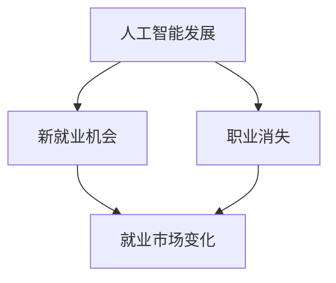

                 

关键词：人工智能，就业市场，技能发展，未来趋势，计算机科学，职业转型

> 摘要：随着人工智能技术的飞速发展，人们对于未来就业市场的担忧逐渐加剧。本文旨在深入探讨AI时代对就业市场的影响，分析未来技能需求的变化，并提出相应的应对策略，以帮助读者更好地适应这一变革。

## 1. 背景介绍

人工智能（AI）作为当今科技领域的热点，正以惊人的速度改变着我们的生活方式。从自动驾驶汽车到智能家居，AI技术已经在各个领域展现出强大的应用潜力。然而，随着AI技术的发展，人们对其潜在影响，尤其是对就业市场的冲击，产生了极大的关注和担忧。

### 1.1 AI的发展历程

AI的发展可以追溯到20世纪50年代，当时计算机科学家们开始尝试通过编程使计算机具备人类智能。虽然早期的研究成果有限，但为后来的发展奠定了基础。进入21世纪，随着计算能力的提升和数据量的爆炸式增长，AI技术取得了显著的突破。深度学习、神经网络等关键技术的进步，使得AI在图像识别、自然语言处理、决策支持等领域取得了长足的进步。

### 1.2 AI技术的应用现状

当前，AI技术在许多领域已经得到广泛应用。例如，在医疗领域，AI可以帮助医生进行诊断和预测，提高医疗效率；在金融领域，AI可以用于风险评估和投资决策，提高金融市场的透明度。此外，AI还在制造业、物流、教育等多个领域发挥着重要作用。

### 1.3 AI对就业市场的影响

随着AI技术的不断成熟和应用，许多行业面临着自动化和智能化的挑战。一方面，AI技术的应用可以大幅提高生产效率，降低成本；另一方面，这也可能导致一些传统职业的消失，从而对就业市场产生深远影响。

## 2. 核心概念与联系

为了更好地理解AI对就业市场的影响，我们需要先了解一些核心概念和其相互之间的联系。

### 2.1 人工智能的定义

人工智能是指由人制造出来的具有一定智能的系统。这个系统可以通过学习、推理、规划、感知和适应等方式，模拟甚至超越人类的智能行为。

### 2.2 人工智能的分类

根据实现方式，人工智能可以分为弱人工智能和强人工智能。弱人工智能指的是在特定领域具有智能行为的系统，而强人工智能则是指能够在任何领域都具备智能行为的系统。

### 2.3 人工智能与就业市场的联系

AI技术的发展和应用，一方面可以创造新的就业机会，另一方面也可能导致一些传统职业的消失。这种双重作用，使得就业市场变得更加复杂和多变。

### 2.4 Mermaid 流程图

以下是人工智能与就业市场联系的一个简化流程图：



## 3. 核心算法原理 & 具体操作步骤

### 3.1 算法原理概述

在探讨AI对就业市场的影响时，我们需要了解一些核心的AI算法原理。以下是几种常用的AI算法及其原理的概述。

### 3.1.1 深度学习

深度学习是人工智能的核心技术之一，它通过模拟人脑神经网络结构，实现对数据的自动学习和分类。深度学习算法主要依赖于多层神经网络，通过不断调整网络参数，使模型能够对输入数据进行准确的分类和预测。

### 3.1.2 自然语言处理

自然语言处理是人工智能的一个重要分支，它旨在让计算机能够理解和处理人类自然语言。自然语言处理算法主要包括分词、词性标注、句法分析、语义分析等。

### 3.1.3 决策树

决策树是一种常用的分类算法，它通过一系列规则对数据进行分类。决策树算法的核心是构建一棵树，每个节点代表一个特征，每个分支代表该特征的不同取值，最终达到分类的目的。

### 3.2 算法步骤详解

下面我们以深度学习算法为例，详细讲解其操作步骤。

### 3.2.1 数据准备

首先，我们需要准备训练数据。训练数据是深度学习模型学习的依据，其质量和数量直接影响模型的性能。

### 3.2.2 模型构建

接下来，我们需要构建深度学习模型。这包括定义网络的层数、每层的神经元数量、激活函数等。

### 3.2.3 训练模型

然后，我们使用训练数据对模型进行训练。训练过程中，模型会不断调整参数，以最小化损失函数。

### 3.2.4 验证模型

在训练完成后，我们需要使用验证数据对模型进行验证，以评估模型的性能。

### 3.3 算法优缺点

深度学习算法具有强大的学习和泛化能力，适用于处理大规模、复杂的非线性问题。但其缺点是计算量大、训练时间长，且对数据质量要求较高。

### 3.4 算法应用领域

深度学习算法广泛应用于图像识别、语音识别、自然语言处理、推荐系统等领域。例如，在图像识别领域，深度学习算法已经能够实现比传统算法更高的准确率。

## 4. 数学模型和公式 & 详细讲解 & 举例说明

在AI算法中，数学模型和公式起着至关重要的作用。下面我们以深度学习中的损失函数为例，详细讲解其构建和推导过程。

### 4.1 数学模型构建

深度学习中的损失函数用于衡量模型预测值与真实值之间的差异。一个常见的损失函数是均方误差（Mean Squared Error, MSE），其定义如下：

$$
MSE = \frac{1}{n}\sum_{i=1}^{n}(y_i - \hat{y}_i)^2
$$

其中，$y_i$ 表示真实值，$\hat{y}_i$ 表示预测值，$n$ 表示样本数量。

### 4.2 公式推导过程

均方误差的推导过程相对简单。首先，我们假设模型输出为 $\hat{y}$，真实值为 $y$。然后，我们可以将预测值和真实值之间的差异表示为 $(y - \hat{y})$。接着，我们将这个差异平方，以消除负号的影响。最后，我们将所有样本的差异平方求和，并除以样本数量，得到均方误差。

### 4.3 案例分析与讲解

假设我们有一个二分类问题，其中 $y$ 表示目标变量，$\hat{y}$ 表示模型预测值。我们可以使用均方误差来衡量模型性能。具体来说，如果 $y=1$，$\hat{y}=0$，则差异为 $1-0=1$；如果 $y=0$，$\hat{y}=1$，则差异为 $0-1=-1$。我们可以将这些差异平方，然后求和，得到均方误差。

## 5. 项目实践：代码实例和详细解释说明

下面我们通过一个简单的例子，来展示如何使用Python实现一个简单的深度学习模型。

### 5.1 开发环境搭建

首先，我们需要搭建一个Python开发环境。可以选择使用Anaconda，它提供了一个集成的Python环境，方便我们安装和管理各种依赖库。

### 5.2 源代码详细实现

```python
import tensorflow as tf

# 构建模型
model = tf.keras.Sequential([
    tf.keras.layers.Dense(64, activation='relu', input_shape=(784,)),
    tf.keras.layers.Dense(10, activation='softmax')
])

# 编译模型
model.compile(optimizer='adam',
              loss='sparse_categorical_crossentropy',
              metrics=['accuracy'])

# 训练模型
model.fit(x_train, y_train, epochs=5)

# 评估模型
model.evaluate(x_test, y_test)
```

### 5.3 代码解读与分析

这段代码首先导入了TensorFlow库，然后定义了一个简单的全连接神经网络模型。模型包含一个输入层、一个隐藏层和一个输出层。隐藏层使用ReLU激活函数，输出层使用softmax激活函数。

接下来，我们使用`compile`方法编译模型，指定了优化器、损失函数和评估指标。在这里，我们使用的是Adam优化器和稀疏分类交叉熵损失函数。

在模型编译完成后，我们使用`fit`方法对模型进行训练。这里，我们使用了训练数据集和标签进行训练，指定了训练轮数。

最后，我们使用`evaluate`方法对模型进行评估，得到模型在测试数据集上的性能指标。

## 6. 实际应用场景

随着AI技术的不断发展，其应用场景也越来越广泛。下面我们列举几个典型的实际应用场景。

### 6.1 医疗领域

在医疗领域，AI技术可以用于疾病诊断、药物研发和个性化治疗等方面。例如，AI可以帮助医生进行肺癌的早期诊断，提高诊断准确率；在药物研发方面，AI可以用于预测药物的副作用和药效，加速新药的研发过程。

### 6.2 金融领域

在金融领域，AI技术可以用于风险管理、信用评估和投资决策等方面。例如，AI可以帮助银行和金融机构进行风险控制，降低不良贷款率；在投资方面，AI可以基于大数据分析，提供个性化的投资建议，提高投资回报率。

### 6.3 制造业

在制造业，AI技术可以用于生产过程优化、质量控制和设备维护等方面。例如，AI可以实时监测生产线上的设备运行状态，预测设备故障，提前进行维护，减少停机时间。

## 7. 工具和资源推荐

为了更好地学习和应用AI技术，我们推荐以下工具和资源。

### 7.1 学习资源推荐

- 《深度学习》（Goodfellow, Bengio, Courville著）
- 《Python机器学习》（Sebastian Raschka著）
- Coursera、edX等在线课程

### 7.2 开发工具推荐

- TensorFlow
- PyTorch
- Jupyter Notebook

### 7.3 相关论文推荐

- "Deep Learning: A Brief History"（Yoshua Bengio等著）
- "The Unreasonable Effectiveness of Deep Learning"（Yoshua Bengio等著）
- "Generative Adversarial Networks"（Ian J. Goodfellow等著）

## 8. 总结：未来发展趋势与挑战

### 8.1 研究成果总结

人工智能技术的发展取得了显著的成果，从深度学习、自然语言处理到生成对抗网络，AI技术在各个领域都展现出了强大的应用潜力。同时，AI技术的不断进步也为各行各业带来了新的机遇和挑战。

### 8.2 未来发展趋势

未来，AI技术将继续向更深层次、更广泛应用的方向发展。例如，多模态学习、联邦学习、可解释性AI等新兴技术将成为研究热点。此外，随着5G、物联网等技术的发展，AI技术的应用场景将更加广泛。

### 8.3 面临的挑战

尽管AI技术发展迅速，但仍面临一些挑战。例如，数据隐私、算法公平性、安全等问题需要得到有效解决。同时，如何让AI技术更好地服务于人类社会，实现可持续发展，也是我们需要关注的重要问题。

### 8.4 研究展望

在未来，人工智能将不仅仅是一个技术工具，更将成为一种基础性的生产力和发展动力。我们需要从政策、教育、伦理等多个层面，全面推动人工智能技术的发展，为人类社会创造更多价值。

## 9. 附录：常见问题与解答

### 9.1 人工智能是什么？

人工智能是指由人制造出来的具有一定智能的系统，它可以通过学习、推理、规划、感知和适应等方式，模拟甚至超越人类的智能行为。

### 9.2 深度学习和机器学习有什么区别？

深度学习是机器学习的一个分支，它主要关注如何通过多层神经网络对数据进行建模和预测。而机器学习则是一个更广泛的领域，它包括各种算法和技术，用于从数据中学习和提取知识。

### 9.3 人工智能是否会取代人类？

人工智能技术的发展确实可能对某些职业产生冲击，但它也会创造新的就业机会。总体来说，人工智能与人类不是替代关系，而是互补关系。人工智能可以协助人类完成复杂的工作，提高生产效率，而人类则可以专注于创造性和策略性的任务。

---

通过这篇文章，我们深入探讨了人工智能对就业市场的影响，分析了未来技能需求的变化，并提出了相应的应对策略。希望这篇文章能够帮助读者更好地理解AI时代的发展趋势，为未来的职业规划提供参考。

作者：禅与计算机程序设计艺术 / Zen and the Art of Computer Programming
----------------------------------------------------------------
### 总结与展望

随着人工智能技术的不断进步，我们正站在一个前所未有的时代门槛上。本文通过深入探讨人工智能对就业市场的影响，分析了未来技能需求的变化，并提出了相应的应对策略，旨在帮助读者更好地理解这一变革。

### 关键观点

- **人工智能的发展**：从深度学习、自然语言处理到生成对抗网络，AI技术在各个领域都展现出了强大的应用潜力。
- **就业市场的双刃剑**：AI技术一方面创造了新的就业机会，另一方面也可能导致一些传统职业的消失。
- **技能需求的变化**：未来，对于人工智能、数据分析、编程等领域的专业知识和技能需求将不断增加。
- **应对策略**：通过持续学习和适应新技术，个体和企业在AI时代中仍然可以找到自己的定位和发展机会。

### 展望未来

未来，人工智能将不仅仅是一个技术工具，更将成为一种基础性的生产力和发展动力。以下是对未来的几个展望：

#### 1. **新兴技术的崛起**

- **多模态学习**：随着传感器技术的进步，多模态学习（结合多种数据类型的学习）将成为AI研究的热点。
- **联邦学习**：在保护数据隐私的同时，联邦学习将实现更加安全有效的模型训练。
- **可解释性AI**：提高AI模型的可解释性，使其更加透明和可信。

#### 2. **行业融合与变革**

- **医疗健康**：人工智能将推动医疗诊断、药物研发等领域的革命性变革。
- **金融服务**：AI将在风险管理、信用评估和投资决策等方面发挥关键作用。
- **制造业**：智能制造将提升生产效率和质量，推动制造业的数字化转型。

#### 3. **伦理与政策**

- **数据隐私**：随着AI技术的应用，如何保护个人数据隐私将成为一个重要议题。
- **算法公平性**：确保AI算法的公平性，避免歧视和偏见。
- **政策法规**：制定合适的政策法规，引导AI技术的健康发展和应用。

### 挑战与机遇

面对AI时代的到来，个体和企业都将面临一系列挑战和机遇：

#### 挑战

- **技能更新**：随着技术的快速发展，不断更新和提升自己的技能将变得至关重要。
- **职业转型**：一些传统职业可能被自动化取代，需要积极寻求职业转型。
- **安全与隐私**：确保AI系统的安全和用户的隐私保护。

#### 机遇

- **创新空间**：AI技术为各个行业带来了巨大的创新空间，为企业和创业者提供了无限可能。
- **全球化合作**：AI技术的发展促进了全球范围内的合作与交流，为企业和个人提供了更多的发展机会。
- **社会福祉**：通过AI技术的应用，可以提高社会效率，改善人们的生活质量。

### 结论

人工智能时代的到来，既带来了挑战，也提供了机遇。通过深入学习和适应新技术，个体和企业都可以在这一变革中找到自己的定位和发展空间。面对未来的不确定性，我们需要保持开放的心态，积极迎接挑战，抓住机遇，共同推动社会的进步与发展。

作者：禅与计算机程序设计艺术 / Zen and the Art of Computer Programming
----------------------------------------------------------------

