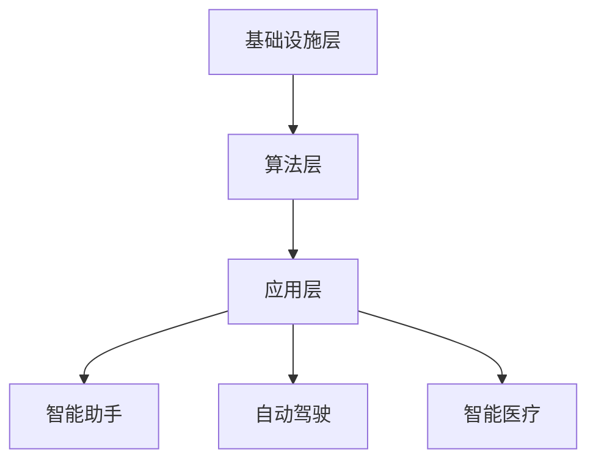

                 

关键词：人工智能，就业市场，技能发展，AI时代，未来趋势

> 摘要：随着人工智能技术的快速发展，其对就业市场和技能发展的冲击逐渐显现。本文将从AI时代的背景、核心概念、算法原理、数学模型、项目实践、应用场景等方面，全面探讨AI时代未来就业市场和技能发展的趋势与挑战。

## 1. 背景介绍

### 1.1 人工智能的发展历程

人工智能（AI）作为一种模拟、延伸和扩展人类智能的技术，自1956年诞生以来，经历了数十年的起伏和探索。从最初的符号主义、连接主义到如今的深度学习和强化学习，人工智能技术取得了巨大的突破。

### 1.2 AI时代的定义与特征

AI时代，指的是以人工智能技术为核心驱动力，全面渗透到社会各个领域，推动生产方式、生活方式和思维方式的变革的时代。其特征包括：数据驱动、算法优化、智能硬件的普及等。

### 1.3 AI对就业市场的影响

AI的快速发展，不仅改变了生产方式，也对就业市场产生了深远的影响。一方面，AI技术替代了一些重复性、劳动密集型的工作，另一方面，也创造了一些新的就业岗位和职业机会。

## 2. 核心概念与联系

### 2.1 人工智能的核心概念

人工智能的核心概念包括：机器学习、深度学习、神经网络、自然语言处理等。这些概念相互联系，共同构成了人工智能的理论体系。

### 2.2 AI时代的架构

AI时代的架构可以分为三个层次：基础设施层、算法层和应用层。其中，基础设施层包括云计算、大数据、物联网等；算法层包括机器学习、深度学习等；应用层包括智能助手、自动驾驶、智能医疗等。

### 2.3 Mermaid 流程图



## 3. 核心算法原理 & 具体操作步骤

### 3.1 算法原理概述

人工智能的核心算法主要包括：监督学习、无监督学习、强化学习等。每种算法都有其独特的原理和应用场景。

### 3.2 算法步骤详解

以监督学习为例，其基本步骤包括：数据收集、特征提取、模型训练、模型评估、模型部署等。

### 3.3 算法优缺点

每种算法都有其优点和缺点，适用于不同的场景。了解每种算法的优缺点，有助于我们根据实际需求选择合适的算法。

### 3.4 算法应用领域

人工智能算法广泛应用于图像识别、自然语言处理、推荐系统、自动驾驶等领域，为各行各业带来了巨大的变革。

## 4. 数学模型和公式 & 详细讲解 & 举例说明

### 4.1 数学模型构建

人工智能中的数学模型主要包括：线性模型、逻辑回归模型、神经网络模型等。每种模型都有其独特的数学公式和推导过程。

### 4.2 公式推导过程

以线性回归模型为例，其推导过程如下：

$$
y = \beta_0 + \beta_1x
$$

### 4.3 案例分析与讲解

以图像识别为例，使用卷积神经网络模型对猫狗分类进行案例分析。通过调整模型参数，提高分类准确率。

## 5. 项目实践：代码实例和详细解释说明

### 5.1 开发环境搭建

搭建Python开发环境，安装必要的库和框架，如TensorFlow、Keras等。

### 5.2 源代码详细实现

```python
import tensorflow as tf
from tensorflow.keras.models import Sequential
from tensorflow.keras.layers import Dense, Conv2D, Flatten

# 模型构建
model = Sequential([
    Conv2D(32, (3,3), activation='relu', input_shape=(28,28,1)),
    Flatten(),
    Dense(128, activation='relu'),
    Dense(1, activation='sigmoid')
])

# 模型编译
model.compile(optimizer='adam', loss='binary_crossentropy', metrics=['accuracy'])

# 模型训练
model.fit(x_train, y_train, epochs=10, batch_size=32)
```

### 5.3 代码解读与分析

代码中，我们使用卷积神经网络对猫狗分类进行训练。通过调整模型结构、参数，提高分类效果。

### 5.4 运行结果展示

训练完成后，我们可以看到模型的准确率和召回率等指标。根据实际情况调整模型参数，提高分类效果。

## 6. 实际应用场景

### 6.1 人工智能在医疗领域的应用

人工智能在医疗领域的应用包括：辅助诊断、精准医疗、药物研发等。通过大数据和深度学习技术，提高医疗水平。

### 6.2 人工智能在金融领域的应用

人工智能在金融领域的应用包括：风险管理、智能投顾、智能客服等。通过数据挖掘和机器学习技术，提高金融服务的效率和质量。

### 6.3 人工智能在制造业的应用

人工智能在制造业的应用包括：生产自动化、质量检测、智能物流等。通过物联网和人工智能技术，提高生产效率和质量。

## 7. 工具和资源推荐

### 7.1 学习资源推荐

《深度学习》、《Python编程：从入门到实践》、《人工智能：一种现代的方法》等书籍。

### 7.2 开发工具推荐

TensorFlow、Keras、PyTorch等框架。

### 7.3 相关论文推荐

《深度学习中的卷积神经网络》、《自然语言处理中的循环神经网络》、《强化学习中的Q学习》等论文。

## 8. 总结：未来发展趋势与挑战

### 8.1 研究成果总结

人工智能在各个领域的应用取得了显著成果，为社会发展带来了巨大价值。

### 8.2 未来发展趋势

人工智能将继续向更复杂、更广泛的应用场景发展，推动社会进步。

### 8.3 面临的挑战

人工智能的发展也面临数据隐私、算法公平性、伦理道德等方面的挑战。

### 8.4 研究展望

未来，人工智能将继续在深度学习、强化学习、自然语言处理等领域取得突破，为社会发展提供更强动力。

## 9. 附录：常见问题与解答

### 9.1 人工智能是否会取代人类？

人工智能可以在某些领域取代人类，但无法完全取代人类的智慧和创造力。

### 9.2 人工智能是否会引发失业？

人工智能将改变就业结构，但也会创造新的就业机会。

### 9.3 如何应对人工智能带来的挑战？

提高自身技能，适应人工智能时代的发展。

作者：禅与计算机程序设计艺术 / Zen and the Art of Computer Programming
```

