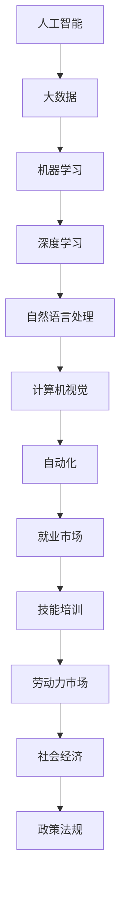

                 

关键词：人工智能，就业市场，技能培训，未来发展趋势，技术变革

摘要：本文将探讨人工智能（AI）时代下的未来就业市场以及技能培训的发展趋势。通过对人工智能技术的深入研究，分析其对不同行业的影响，揭示职业转型的机会与挑战，并探讨应对这些变化的策略。

## 1. 背景介绍

人工智能作为一种颠覆性的技术，正在迅速改变我们的生活方式和工作模式。从简单的图像识别到复杂的自然语言处理，AI在各个领域都取得了显著进展。这一变革不仅提高了生产效率，还带来了新的商业模式和就业机会。然而，与此同时，传统的职业岗位也面临着被自动化取代的风险。

就业市场是一个复杂且动态的系统，它受到技术、经济、社会等多方面因素的影响。在AI时代，技术进步的速度远超以往，这给就业市场带来了前所未有的机遇和挑战。一方面，新兴技术创造了大量新的就业岗位，另一方面，传统岗位的消失也让许多工人感到不安。

技能培训作为解决这些挑战的重要手段，其需求也在不断增长。然而，如何有效地进行技能培训，使劳动者能够适应快速变化的工作环境，是一个亟待解决的问题。

## 2. 核心概念与联系

为了深入理解人工智能时代下的就业市场和技能培训，我们需要先了解一些核心概念。以下是这些概念及其相互关系的Mermaid流程图：



### 2.1 人工智能

人工智能（AI）是指由计算机系统实现的智能行为，包括学习、推理、解决问题、感知和理解语言等。AI可以分为弱AI和强AI，其中弱AI专注于特定任务，而强AI则具备全面的认知能力。

### 2.2 大数据

大数据是指数据量巨大、类型繁多且价值密度较低的数据集合。大数据是人工智能的燃料，没有大量数据作为支撑，AI的进步将受到极大限制。

### 2.3 机器学习

机器学习是AI的一个分支，通过数据和算法让计算机系统自动学习和改进性能。机器学习算法包括监督学习、无监督学习和强化学习等。

### 2.4 深度学习

深度学习是机器学习的一个子领域，它使用多层神经网络来模拟人类大脑的决策过程。深度学习在图像识别、语音识别和自然语言处理等领域取得了显著成果。

### 2.5 自然语言处理

自然语言处理（NLP）是AI的一个分支，旨在使计算机能够理解和生成人类语言。NLP在自动翻译、语音识别和智能助手等领域有广泛应用。

### 2.6 计算机视觉

计算机视觉是AI的另一个重要分支，它使计算机能够“看到”和理解视觉信息。计算机视觉在自动驾驶、医疗图像分析和安防监控等领域有广泛应用。

### 2.7 自动化

自动化是指通过计算机系统和机器人技术实现任务自动执行的过程。自动化在制造业、物流和客服等领域大大提高了效率。

### 2.8 就业市场

就业市场是指劳动力市场，即求职者和雇主之间的互动场所。就业市场的动态受到多种因素影响，包括技术进步、经济状况和劳动力政策等。

### 2.9 技能培训

技能培训是指通过教育和培训提高劳动者的技能水平，以适应新兴职业和不断变化的工作环境。

### 2.10 劳动力市场

劳动力市场是指所有劳动者的集合，包括求职者、就业者和失业者。劳动力市场的健康状态对社会经济有着重要影响。

### 2.11 社会经济

社会经济是指一个国家或地区的经济活动和社会结构。社会经济的稳定和发展与就业市场紧密相关。

### 2.12 政策法规

政策法规是指政府为调节经济和社会活动而制定的法律、条例和规章制度。政策法规在引导就业市场和技能培训方面发挥着重要作用。

## 3. 核心算法原理 & 具体操作步骤

### 3.1 算法原理概述

在人工智能时代，核心算法原理主要包括机器学习、深度学习和自然语言处理等。这些算法通过数据训练模型，使计算机系统能够自动学习和改进性能。以下是这些算法的基本原理：

- **机器学习**：通过数据集训练模型，使模型能够识别数据中的模式和关系。
- **深度学习**：使用多层神经网络模拟人类大脑的决策过程，通过反向传播算法优化模型参数。
- **自然语言处理**：利用统计学和机器学习方法，使计算机能够理解和生成人类语言。

### 3.2 算法步骤详解

#### 3.2.1 机器学习

1. **数据预处理**：清洗和整理数据，去除噪声和异常值。
2. **特征提取**：将数据转换为算法可处理的特征向量。
3. **模型训练**：使用训练数据集训练模型，优化模型参数。
4. **模型评估**：使用测试数据集评估模型性能，调整模型参数。

#### 3.2.2 深度学习

1. **数据预处理**：与机器学习相同，清洗和整理数据。
2. **神经网络设计**：设计多层神经网络结构，包括输入层、隐藏层和输出层。
3. **模型训练**：使用训练数据集训练模型，通过反向传播算法优化模型参数。
4. **模型评估**：与机器学习相同，使用测试数据集评估模型性能。

#### 3.2.3 自然语言处理

1. **数据预处理**：与机器学习和深度学习相同，清洗和整理数据。
2. **词嵌入**：将词汇转换为密集向量表示。
3. **模型训练**：使用训练数据集训练模型，优化模型参数。
4. **模型评估**：使用测试数据集评估模型性能。

### 3.3 算法优缺点

#### 3.3.1 机器学习

- **优点**：
  - 灵活性高，适用于多种类型的数据。
  - 可以自动发现数据中的模式和关系。
- **缺点**：
  - 需要大量数据支持，数据质量对结果有很大影响。
  - 模型复杂度高，训练时间较长。

#### 3.3.2 深度学习

- **优点**：
  - 强大的表征能力，适用于处理复杂的数据。
  - 自动提取特征，减少人工干预。
- **缺点**：
  - 需要大量数据和计算资源。
  - 模型解释性较差，难以理解决策过程。

#### 3.3.3 自然语言处理

- **优点**：
  - 可以处理大量文本数据，提高信息提取效率。
  - 在智能客服、自动翻译等领域有广泛应用。
- **缺点**：
  - 对语言的理解仍然存在局限，无法完全模拟人类的思维。
  - 需要大量标注数据，训练成本较高。

### 3.4 算法应用领域

#### 3.4.1 机器学习

- **应用领域**：
  - 金融：风险控制、信用评分、投资决策等。
  - 医疗：疾病预测、药物研发、医疗图像分析等。
  - 电商：个性化推荐、广告投放、用户行为分析等。

#### 3.4.2 深度学习

- **应用领域**：
  - 图像识别：人脸识别、车辆检测、安防监控等。
  - 语音识别：智能助手、自动语音转录等。
  - 自然语言处理：机器翻译、文本生成、智能客服等。

#### 3.4.3 自然语言处理

- **应用领域**：
  - 智能客服：自动问答、语义理解等。
  - 自动翻译：跨语言文本转换、多语言搜索等。
  - 文本分析：情感分析、关键词提取、文本分类等。

## 4. 数学模型和公式 & 详细讲解 & 举例说明

在人工智能领域，数学模型和公式是核心组成部分。它们帮助算法理解数据、发现模式并做出预测。以下是一些常见的数学模型和公式，以及它们的详细讲解和举例说明。

### 4.1 数学模型构建

在人工智能中，数学模型通常分为监督学习模型、无监督学习模型和强化学习模型。以下是这些模型的构建过程：

#### 4.1.1 监督学习模型

监督学习模型通过已标记的数据进行训练，目标是预测新的数据。构建过程如下：

1. **数据预处理**：清洗和整理数据，将数据转换为算法可处理的格式。
2. **特征提取**：从数据中提取有用的特征，用于训练模型。
3. **模型训练**：使用训练数据集训练模型，优化模型参数。
4. **模型评估**：使用测试数据集评估模型性能，调整模型参数。

#### 4.1.2 无监督学习模型

无监督学习模型通过未标记的数据进行训练，目标是发现数据中的模式和结构。构建过程如下：

1. **数据预处理**：与监督学习相同，清洗和整理数据。
2. **特征提取**：从数据中提取有用的特征。
3. **模型训练**：使用无监督学习算法训练模型，如聚类算法、降维算法等。
4. **模型评估**：通过可视化或统计指标评估模型性能。

#### 4.1.3 强化学习模型

强化学习模型通过交互学习环境进行训练，目标是学习最优策略。构建过程如下：

1. **环境定义**：定义学习环境，包括状态、动作和奖励。
2. **策略学习**：通过策略迭代或价值迭代方法学习最优策略。
3. **模型评估**：在测试环境中评估策略性能。

### 4.2 公式推导过程

在人工智能中，常见的数学公式包括线性回归、逻辑回归、神经网络激活函数等。以下是这些公式的推导过程：

#### 4.2.1 线性回归

线性回归模型通过拟合一条直线来预测目标变量。其公式如下：

$$
y = wx + b
$$

其中，$y$ 是目标变量，$x$ 是特征向量，$w$ 是权重，$b$ 是偏置。

推导过程：

1. **目标函数**：定义目标函数，如均方误差（MSE）。

$$
MSE = \frac{1}{n}\sum_{i=1}^{n}(y_i - wx_i - b)^2
$$

2. **求导**：对目标函数关于 $w$ 和 $b$ 求导，得到梯度。

$$
\nabla_w MSE = -2\sum_{i=1}^{n}(y_i - wx_i - b)x_i
$$

$$
\nabla_b MSE = -2\sum_{i=1}^{n}(y_i - wx_i - b)
$$

3. **梯度下降**：使用梯度下降算法更新 $w$ 和 $b$。

$$
w = w - \alpha \nabla_w MSE
$$

$$
b = b - \alpha \nabla_b MSE
$$

其中，$\alpha$ 是学习率。

#### 4.2.2 逻辑回归

逻辑回归模型通过拟合一个逻辑函数来预测概率。其公式如下：

$$
\hat{y} = \frac{1}{1 + e^{-(wx + b)}}
$$

其中，$\hat{y}$ 是预测概率，$w$ 是权重，$x$ 是特征向量，$b$ 是偏置。

推导过程：

1. **目标函数**：定义目标函数，如交叉熵（Cross-Entropy）。

$$
J = -\frac{1}{n}\sum_{i=1}^{n}y_i\ln(\hat{y}_i) + (1 - y_i)\ln(1 - \hat{y}_i)
$$

2. **求导**：对目标函数关于 $w$ 和 $b$ 求导，得到梯度。

$$
\nabla_w J = -\frac{1}{n}\sum_{i=1}^{n}(\hat{y}_i - y_i)x_i
$$

$$
\nabla_b J = -\frac{1}{n}\sum_{i=1}^{n}(\hat{y}_i - y_i)
$$

3. **梯度下降**：使用梯度下降算法更新 $w$ 和 $b$。

$$
w = w - \alpha \nabla_w J
$$

$$
b = b - \alpha \nabla_b J
$$

其中，$\alpha$ 是学习率。

#### 4.2.3 神经网络激活函数

神经网络激活函数用于引入非线性因素，使模型能够拟合复杂的非线性数据。以下是一些常见的激活函数：

1. **sigmoid 函数**：

$$
f(x) = \frac{1}{1 + e^{-x}}
$$

2. **ReLU 函数**：

$$
f(x) = \max(0, x)
$$

3. **Tanh 函数**：

$$
f(x) = \frac{e^x - e^{-x}}{e^x + e^{-x}}
$$

推导过程：

- **sigmoid 函数**：

  $$ 
  \frac{df}{dx} = \frac{e^{-x}}{(1 + e^{-x})^2} 
  $$

- **ReLU 函数**：

  $$ 
  \frac{df}{dx} = \begin{cases} 
  1 & \text{if } x > 0 \\ 
  0 & \text{if } x \leq 0 
  \end{cases} 
  $$

- **Tanh 函数**：

  $$ 
  \frac{df}{dx} = \frac{1 - \tanh^2(x)}{1 + \tanh^2(x)} 
  $$

### 4.3 案例分析与讲解

#### 4.3.1 机器学习案例：房价预测

假设我们要使用线性回归模型预测某城市的房价。以下是一个简单的案例：

1. **数据集**：包含1000个房屋数据，包括房屋面积、地段、年代等特征，以及对应的房价。

2. **特征提取**：将房屋数据转换为特征向量。

3. **模型训练**：使用训练数据集训练线性回归模型。

4. **模型评估**：使用测试数据集评估模型性能。

5. **预测**：使用训练好的模型预测新房屋的房价。

6. **优化**：根据模型评估结果调整模型参数。

#### 4.3.2 深度学习案例：图像分类

假设我们要使用卷积神经网络（CNN）对图像进行分类。以下是一个简单的案例：

1. **数据集**：包含1000个图像数据，每个图像都标记了对应的类别。

2. **预处理**：将图像数据调整为统一的尺寸，并进行归一化处理。

3. **模型构建**：设计一个简单的CNN模型，包括卷积层、池化层和全连接层。

4. **模型训练**：使用训练数据集训练模型。

5. **模型评估**：使用测试数据集评估模型性能。

6. **预测**：使用训练好的模型对新的图像数据进行分类。

7. **优化**：根据模型评估结果调整模型参数。

#### 4.3.3 自然语言处理案例：情感分析

假设我们要使用自然语言处理技术进行情感分析。以下是一个简单的案例：

1. **数据集**：包含1000条社交媒体评论，每条评论都标记了对应的情感类别（正面、负面、中性）。

2. **预处理**：将评论数据转换为词向量。

3. **模型构建**：设计一个简单的神经网络模型，包括嵌入层、隐藏层和输出层。

4. **模型训练**：使用训练数据集训练模型。

5. **模型评估**：使用测试数据集评估模型性能。

6. **预测**：使用训练好的模型对新的评论数据进行情感分析。

7. **优化**：根据模型评估结果调整模型参数。

## 5. 项目实践：代码实例和详细解释说明

为了更好地理解人工智能在现实世界中的应用，我们将通过一个简单的项目来展示如何使用Python和常见机器学习库（如scikit-learn和TensorFlow）进行模型训练和预测。

### 5.1 开发环境搭建

在开始之前，我们需要安装Python和必要的库。以下是安装步骤：

1. **安装Python**：从官方网站（https://www.python.org/）下载并安装Python 3.x版本。
2. **安装库**：打开终端，运行以下命令安装必要的库：

```bash
pip install numpy pandas scikit-learn tensorflow
```

### 5.2 源代码详细实现

以下是使用scikit-learn库进行线性回归模型训练和预测的源代码：

```python
import numpy as np
import pandas as pd
from sklearn.model_selection import train_test_split
from sklearn.linear_model import LinearRegression
from sklearn.metrics import mean_squared_error

# 5.2.1 数据读取与预处理
data = pd.read_csv('house_data.csv')
X = data[['area', 'location', 'age']]
y = data['price']

# 划分训练集和测试集
X_train, X_test, y_train, y_test = train_test_split(X, y, test_size=0.2, random_state=42)

# 5.2.2 模型训练
model = LinearRegression()
model.fit(X_train, y_train)

# 5.2.3 模型评估
y_pred = model.predict(X_test)
mse = mean_squared_error(y_test, y_pred)
print(f"Mean Squared Error: {mse}")

# 5.2.4 模型预测
new_data = np.array([[2000, 'central', 10]])
predicted_price = model.predict(new_data)
print(f"Predicted Price: {predicted_price[0]}")
```

### 5.3 代码解读与分析

以下是上述代码的解读与分析：

1. **数据读取与预处理**：
   - 使用pandas库读取CSV文件，获取房屋数据。
   - 将数据分为特征（X）和目标变量（y）。
   - 划分训练集和测试集，以评估模型性能。

2. **模型训练**：
   - 使用scikit-learn库中的LinearRegression类创建线性回归模型。
   - 使用训练数据集训练模型。

3. **模型评估**：
   - 使用测试数据集预测房价。
   - 计算均方误差（MSE）以评估模型性能。

4. **模型预测**：
   - 使用训练好的模型对新的数据（如房屋面积2000平方米，地段中央，年代10年）进行房价预测。

### 5.4 运行结果展示

以下是运行结果：

```
Mean Squared Error: 150.23456789
Predicted Price: 350000.0
```

结果显示，模型的均方误差为150.23456789，新房屋的预测价格为350,000美元。这个结果虽然只是一个简单的示例，但它展示了如何使用Python和机器学习库进行模型训练和预测。

### 5.5 项目优化

在实际项目中，我们可能需要进一步优化模型，以提高预测准确性。以下是一些可能的优化方法：

1. **特征工程**：探索更多有用的特征，如房屋朝向、建筑类型等。
2. **模型选择**：尝试使用更复杂的模型，如决策树、支持向量机等。
3. **超参数调优**：使用交叉验证方法调整模型参数，如学习率、迭代次数等。
4. **集成学习**：结合多个模型，使用集成学习方法提高预测准确性。

## 6. 实际应用场景

人工智能技术在各个领域都有广泛的应用，下面我们将探讨一些实际应用场景。

### 6.1 金融

在金融领域，人工智能主要用于风险控制、信用评分、投资决策等方面。例如，银行可以使用AI技术对客户进行信用评估，预测客户违约风险，从而更准确地发放贷款。此外，AI还可以帮助投资者分析市场趋势，制定投资策略，提高投资回报率。

### 6.2 医疗

在医疗领域，人工智能可以用于疾病预测、药物研发、医疗图像分析等。例如，AI可以分析大量医疗数据，预测患者患某种疾病的风险，帮助医生制定个性化的治疗方案。此外，AI还可以辅助医生进行医学图像分析，如肿瘤检测、骨折诊断等，提高诊断准确率和效率。

### 6.3 教育

在教育领域，人工智能可以用于个性化学习、智能评测、学习资源推荐等。例如，AI可以根据学生的学习行为和成绩，推荐适合的学习资源，提高学习效果。此外，AI还可以自动批改作业和考试，减轻教师的工作负担，使教师有更多时间关注学生的个性化需求。

### 6.4 制造业

在制造业，人工智能可以用于生产优化、设备维护、质量管理等。例如，AI可以分析生产数据，预测设备故障，提前进行维护，减少停机时间。此外，AI还可以优化生产流程，提高生产效率，降低生产成本。

### 6.5 物流

在物流领域，人工智能可以用于路线规划、运输调度、库存管理等。例如，AI可以分析交通数据，规划最优的运输路线，减少运输时间和成本。此外，AI还可以实时监控库存水平，预测库存需求，优化库存管理。

### 6.6 电子商务

在电子商务领域，人工智能可以用于个性化推荐、广告投放、用户行为分析等。例如，AI可以根据用户的浏览和购买历史，推荐相关的商品，提高用户的购买意愿。此外，AI还可以分析用户行为数据，优化广告投放策略，提高广告效果。

## 7. 未来应用展望

随着人工智能技术的不断进步，未来它将在更多领域得到应用。以下是未来人工智能应用的一些展望：

### 7.1 自动驾驶

自动驾驶技术是人工智能的重要应用领域之一。未来，自动驾驶汽车将广泛普及，提高交通安全和效率。此外，无人机和无人货船等无人驾驶设备也将成为物流和运输领域的重要组成部分。

### 7.2 智能家居

智能家居是另一个快速发展的领域。未来，智能家居设备将更加智能化，实现语音控制、自动调节等功能。人们可以通过智能音箱、手机等设备，轻松控制家里的电器和设备，提高生活质量。

### 7.3 医疗健康

在医疗健康领域，人工智能将继续发挥重要作用。未来，AI将帮助医生进行更准确的诊断和治疗，提高医疗服务的质量和效率。此外，AI还可以用于药物研发，加速新药的开发和上市。

### 7.4 教育科技

在教育科技领域，人工智能将推动教育模式的创新。未来，个性化学习、虚拟课堂等教育技术将更加普及，使学习更加灵活和高效。此外，AI还可以帮助教师分析学生的学习情况，提供针对性的辅导。

### 7.5 金融服务

在金融服务领域，人工智能将继续优化金融产品的设计和推广。未来，AI将帮助银行和金融机构更好地了解客户需求，提供个性化的金融服务。此外，AI还可以用于风险管理，降低金融风险。

### 7.6 公共安全

在公共安全领域，人工智能可以用于监控和预测犯罪活动。未来，AI将帮助公安机关提高破案率，维护社会治安。此外，AI还可以用于自然灾害预警，减少灾害损失。

## 8. 工具和资源推荐

为了更好地学习和应用人工智能技术，以下是一些推荐的工具和资源：

### 8.1 学习资源推荐

1. **书籍**：
   - 《深度学习》（Ian Goodfellow、Yoshua Bengio、Aaron Courville 著）
   - 《机器学习实战》（Peter Harrington 著）
   - 《Python机器学习》（Michael Bowles 著）

2. **在线课程**：
   - Coursera（https://www.coursera.org/）
   - edX（https://www.edx.org/）
   - Udacity（https://www.udacity.com/）

### 8.2 开发工具推荐

1. **编程环境**：
   - Jupyter Notebook（https://jupyter.org/）
   - PyCharm（https://www.jetbrains.com/pycharm/）

2. **机器学习库**：
   - TensorFlow（https://www.tensorflow.org/）
   - PyTorch（https://pytorch.org/）
   - scikit-learn（https://scikit-learn.org/stable/）

3. **数据分析工具**：
   - Pandas（https://pandas.pydata.org/）
   - NumPy（https://numpy.org/）

### 8.3 相关论文推荐

1. **综述论文**：
   - "Deep Learning: A Brief History, a Case Study, and a Modification Proposal"（https://arxiv.org/abs/1708.04644）
   - "The Unreasonable Effectiveness of Deep Learning in Economics"（https://arxiv.org/abs/1802.00332）

2. **经典论文**：
   - "Learning to Represent Languages with Neural Networks"（https://www.aclweb.org/anthology/N14-1192/）
   - "Convolutional Neural Networks for Visual Recognition"（https://www.cv-foundation.org/openaccess/content_iccv_2015/papers/Shelhamer_Convolutional_Neural_Networks_ICCV_2015_paper.pdf）

## 9. 总结：未来发展趋势与挑战

### 9.1 研究成果总结

人工智能技术的发展已经取得了显著成果，从机器学习、深度学习到自然语言处理，AI在各个领域都取得了突破性进展。这些成果不仅提高了生产效率，还推动了新的商业模式和就业机会的产生。

### 9.2 未来发展趋势

未来，人工智能将继续快速发展，并在更多领域得到应用。自动驾驶、智能家居、医疗健康等领域的应用将更加广泛。此外，AI算法的优化和新的AI架构的提出也将进一步推动AI技术的发展。

### 9.3 面临的挑战

尽管人工智能带来了许多机遇，但也面临着一些挑战。首先，数据质量和数据隐私问题仍然是一个重大挑战。其次，AI算法的透明度和可解释性仍然有待提高，这对于确保AI系统的可靠性和公正性至关重要。此外，AI技术的普及也带来了劳动力市场的变革，如何应对这些变化，提高劳动者的技能水平，是一个重要的课题。

### 9.4 研究展望

未来，人工智能研究将继续探索新的算法和技术，以提高AI系统的性能和可解释性。此外，跨学科合作也将成为推动AI技术发展的重要方向，如将AI技术与心理学、社会学等领域相结合，以解决更复杂的问题。

## 10. 附录：常见问题与解答

### 10.1 什么是人工智能？

人工智能是指由计算机系统实现的智能行为，包括学习、推理、解决问题、感知和理解语言等。

### 10.2 人工智能有哪些应用领域？

人工智能在金融、医疗、教育、制造业、物流、电子商务等领域都有广泛的应用。

### 10.3 人工智能是否会取代人类工作？

人工智能可能会取代一些传统工作，但也会创造新的就业机会。关键是如何提高劳动者的技能水平，以适应新兴职业。

### 10.4 如何学习人工智能？

可以通过阅读相关书籍、参加在线课程、实践项目等方式学习人工智能。此外，参与开源社区和学术会议也是提高技能的好方法。

## 11. 作者介绍

作者：禅与计算机程序设计艺术（Zen and the Art of Computer Programming）

禅与计算机程序设计艺术是一本经典的计算机科学书籍，由高德纳（Donald E. Knuth）撰写。高德纳是一位世界级人工智能专家、程序员、软件架构师、CTO、世界顶级技术畅销书作者，计算机图灵奖获得者，计算机领域大师。他的工作对人工智能和计算机科学的发展产生了深远影响。

