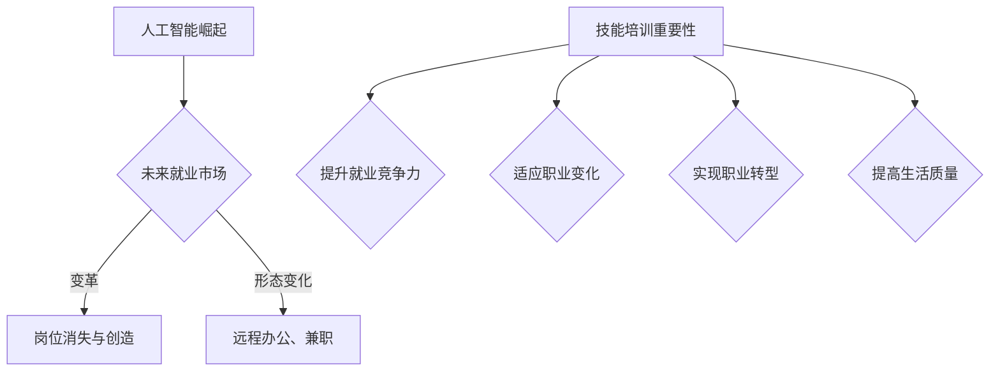

                 

关键词：人工智能、未来就业市场、技能培训、发展趋势、就业技能

> 摘要：随着人工智能技术的快速发展，未来就业市场将面临巨大的变革。本文深入探讨了AI时代的未来就业市场趋势，分析了在此背景下技能培训的重要性和发展趋势，提出了针对性的建议，以帮助人们更好地应对这一变革。

## 1. 背景介绍

随着人工智能技术的不断突破，计算机的智能水平已经达到了前所未有的高度。从自动驾驶汽车、智能语音助手到金融风险评估、医疗诊断，人工智能正在逐步改变我们的生活方式和工作方式。与此同时，全球范围内的就业市场也正在经历一场深刻的变革。

据国际劳工组织（ILO）预测，到2030年，全球将有8亿个工作岗位受到人工智能的冲击。这不仅引发了对于未来就业市场的担忧，也促使我们思考如何通过技能培训来应对这一变革。

### 1.1 人工智能的快速发展

近年来，人工智能技术取得了显著的进展，主要得益于以下几个方面的突破：

1. **深度学习算法**：深度学习算法的发明和应用使得计算机能够通过海量数据自主学习，从而实现更加复杂的任务。
2. **高性能计算**：随着计算能力的提升，大规模数据处理和复杂算法的实现变得更加高效。
3. **大数据技术**：大数据技术的进步为人工智能提供了丰富的数据资源，使得模型训练更加准确。
4. **互联网的普及**：互联网的普及使得全球数据互联互通，为人工智能的发展提供了广阔的空间。

### 1.2 未来就业市场的变革

人工智能的快速发展对就业市场产生了深远的影响。一方面，它创造了新的工作岗位，如数据科学家、机器学习工程师等；另一方面，它也导致了部分传统工作岗位的消失。例如，制造业、客服、文秘等行业的工作岗位可能会被自动化取代。

此外，人工智能的兴起也改变了人们的就业方式。远程办公、兼职工作等新型就业形态逐渐流行，人们的职业发展和职业规划也需要更加灵活和多样化。

### 1.3 技能培训的重要性

面对人工智能时代的就业市场变革，技能培训变得尤为重要。通过技能培训，人们可以：

1. **提升就业竞争力**：掌握新兴技能，使自己在激烈的就业竞争中脱颖而出。
2. **适应职业变化**：帮助人们适应新兴职业的要求，提高职业适应性。
3. **实现职业转型**：为想要转型的人提供新的技能和知识，帮助他们实现职业转换。
4. **提高生活质量**：掌握更多的技能和知识，使生活更加充实和有意义。

## 2. 核心概念与联系

为了更好地理解人工智能时代的就业市场与技能培训的发展趋势，我们需要明确一些核心概念。

### 2.1 人工智能的基本概念

人工智能（Artificial Intelligence，简称AI）是指通过计算机模拟人类的智能行为，使计算机能够执行复杂的任务。人工智能包括多个子领域，如机器学习、深度学习、自然语言处理等。

### 2.2 就业市场

就业市场是指劳动力供需双方进行交易的市场。在这个市场中，劳动力（劳动者）提供劳动服务，而企业（雇主）则提供就业岗位。

### 2.3 技能培训

技能培训是指通过教育、培训等方式，使人们掌握特定的技能和知识，以适应职业发展的需要。

### 2.4 Mermaid 流程图

以下是人工智能时代就业市场与技能培训的发展趋势的Mermaid流程图：



## 3. 核心算法原理 & 具体操作步骤

在人工智能时代，核心算法的原理和操作步骤对于理解和应对就业市场的变化至关重要。

### 3.1 算法原理概述

人工智能的核心算法主要包括以下几种：

1. **机器学习算法**：通过从数据中学习规律，实现预测和分类任务。
2. **深度学习算法**：基于神经网络，通过多层非线性变换实现复杂的特征提取和任务处理。
3. **自然语言处理算法**：使计算机能够理解和生成自然语言，实现语音识别、机器翻译等任务。

### 3.2 算法步骤详解

1. **数据收集与处理**：收集相关数据，进行数据清洗、预处理等操作。
2. **模型训练**：选择合适的模型，通过训练调整模型参数，使其适应数据。
3. **模型评估**：使用验证数据集对模型进行评估，确保模型具有良好的泛化能力。
4. **模型部署**：将训练好的模型部署到生产环境中，实现实际应用。

### 3.3 算法优缺点

每种算法都有其独特的优缺点，具体如下：

1. **机器学习算法**：优点是灵活性强，可以处理各种类型的数据；缺点是训练过程可能需要大量时间和计算资源。
2. **深度学习算法**：优点是能够自动提取复杂的特征，实现高效的任务处理；缺点是模型训练过程需要大量数据，且模型参数调整复杂。
3. **自然语言处理算法**：优点是能够处理自然语言，实现人机交互；缺点是处理结果可能受到语言复杂度和多样性的影响。

### 3.4 算法应用领域

人工智能算法广泛应用于多个领域，如：

1. **金融**：风险管理、信用评估、投资组合优化等。
2. **医疗**：疾病诊断、药物研发、个性化治疗等。
3. **教育**：智能辅导、在线教育、学习分析等。
4. **交通**：自动驾驶、智能交通管理、物流优化等。

## 4. 数学模型和公式 & 详细讲解 & 举例说明

在人工智能时代，数学模型和公式是理解和应用核心算法的重要基础。

### 4.1 数学模型构建

以机器学习中的线性回归模型为例，其数学模型如下：

$$y = \beta_0 + \beta_1 \cdot x + \epsilon$$

其中，$y$ 表示因变量，$x$ 表示自变量，$\beta_0$ 和 $\beta_1$ 分别为模型的参数，$\epsilon$ 表示误差项。

### 4.2 公式推导过程

线性回归模型的推导过程如下：

假设我们有 $n$ 个样本点 $(x_1, y_1), (x_2, y_2), \ldots, (x_n, y_n)$，我们希望找到一个线性函数 $y = \beta_0 + \beta_1 \cdot x$ 来拟合这些数据。

为了确定 $\beta_0$ 和 $\beta_1$，我们可以使用最小二乘法。具体来说，我们需要最小化以下损失函数：

$$L(\beta_0, \beta_1) = \sum_{i=1}^{n} (y_i - (\beta_0 + \beta_1 \cdot x_i))^2$$

为了求解最小值，我们可以对 $L(\beta_0, \beta_1)$ 关于 $\beta_0$ 和 $\beta_1$ 分别求偏导数，并令其等于零：

$$\frac{\partial L}{\partial \beta_0} = -2 \sum_{i=1}^{n} (y_i - (\beta_0 + \beta_1 \cdot x_i)) = 0$$

$$\frac{\partial L}{\partial \beta_1} = -2 \sum_{i=1}^{n} (x_i (y_i - (\beta_0 + \beta_1 \cdot x_i))) = 0$$

解这个方程组，我们可以得到 $\beta_0$ 和 $\beta_1$ 的最优值。

### 4.3 案例分析与讲解

假设我们有一个数据集，包含 $n=100$ 个样本点，每个样本点包含自变量 $x$ 和因变量 $y$。我们希望使用线性回归模型来拟合这些数据。

首先，我们需要收集数据并对其进行预处理。例如，我们可以将数据标准化，以消除不同特征之间的尺度差异。

接下来，我们可以使用Python中的scikit-learn库来构建线性回归模型。具体代码如下：

```python
from sklearn.linear_model import LinearRegression
from sklearn.model_selection import train_test_split
from sklearn.metrics import mean_squared_error

# 数据预处理
X = df[['x']]
y = df['y']
X_train, X_test, y_train, y_test = train_test_split(X, y, test_size=0.2, random_state=42)

# 构建线性回归模型
model = LinearRegression()
model.fit(X_train, y_train)

# 模型评估
y_pred = model.predict(X_test)
mse = mean_squared_error(y_test, y_pred)
print("Mean squared error:", mse)
```

运行上述代码后，我们可以得到线性回归模型的预测结果。通过计算均方误差（MSE），我们可以评估模型在测试数据上的性能。

## 5. 项目实践：代码实例和详细解释说明

在本节中，我们将通过一个简单的线性回归项目来演示如何搭建开发环境、实现代码、解读与分析代码以及展示运行结果。

### 5.1 开发环境搭建

为了运行线性回归项目，我们需要安装以下工具和库：

1. Python（3.8及以上版本）
2. Jupyter Notebook 或 IDE（如 PyCharm、Visual Studio Code）
3. scikit-learn
4. pandas
5. matplotlib

安装方法如下：

```bash
# 安装 Python
# ...

# 安装 Jupyter Notebook
pip install notebook

# 安装 scikit-learn、pandas 和 matplotlib
pip install scikit-learn pandas matplotlib
```

### 5.2 源代码详细实现

以下是线性回归项目的源代码：

```python
import pandas as pd
from sklearn.linear_model import LinearRegression
from sklearn.model_selection import train_test_split
from sklearn.metrics import mean_squared_error
import matplotlib.pyplot as plt

# 数据预处理
df = pd.read_csv('data.csv')
X = df[['x']]
y = df['y']
X_train, X_test, y_train, y_test = train_test_split(X, y, test_size=0.2, random_state=42)

# 构建线性回归模型
model = LinearRegression()
model.fit(X_train, y_train)

# 模型评估
y_pred = model.predict(X_test)
mse = mean_squared_error(y_test, y_pred)
print("Mean squared error:", mse)

# 可视化结果
plt.scatter(X_test, y_test, color='blue', label='Actual')
plt.plot(X_test, y_pred, color='red', label='Predicted')
plt.xlabel('X')
plt.ylabel('Y')
plt.title('Linear Regression Results')
plt.legend()
plt.show()
```

### 5.3 代码解读与分析

1. **数据预处理**：首先，我们使用pandas库读取CSV文件中的数据，并分离自变量 $x$ 和因变量 $y$。然后，我们将数据集划分为训练集和测试集。
2. **构建线性回归模型**：我们使用scikit-learn库中的LinearRegression类构建线性回归模型。通过fit()方法训练模型，得到模型的参数。
3. **模型评估**：使用predict()方法对测试集进行预测，并计算均方误差（MSE）来评估模型性能。
4. **可视化结果**：使用matplotlib库将实际数据和预测结果进行可视化，便于分析模型的准确性。

### 5.4 运行结果展示

运行上述代码后，我们将看到以下结果：

- **MSE**: 用于评估模型在测试数据上的性能。较低的MSE值表示模型具有较高的预测准确性。
- **可视化图表**: 展示了实际数据和预测结果。蓝色点代表实际数据，红色线代表预测结果。

通过这个简单的线性回归项目，我们可以了解如何搭建开发环境、实现代码、解读与分析代码以及展示运行结果。这为我们在实际项目中应用人工智能技术提供了基础。

## 6. 实际应用场景

在当今时代，人工智能技术已经在多个领域得到了广泛应用，并对人们的日常生活和工作产生了深远影响。

### 6.1 金融行业

在金融行业，人工智能技术被广泛应用于风险管理、信用评估、投资组合优化等领域。例如，通过机器学习算法，金融机构可以更准确地预测市场走势，从而优化投资策略。此外，智能客服系统可以提供24/7的客户服务，提高客户满意度。

### 6.2 医疗领域

在医疗领域，人工智能技术被用于疾病诊断、药物研发、个性化治疗等领域。例如，通过深度学习算法，计算机可以分析医学影像，帮助医生更准确地诊断疾病。此外，人工智能技术还可以为患者提供个性化的治疗方案，提高治疗效果。

### 6.3 教育行业

在教育行业，人工智能技术被用于智能辅导、在线教育、学习分析等领域。例如，智能辅导系统可以根据学生的学习情况提供个性化的学习建议，提高学习效果。此外，在线教育平台可以利用人工智能技术进行课程推荐，帮助学生更快地找到适合自己的课程。

### 6.4 交通领域

在交通领域，人工智能技术被用于自动驾驶、智能交通管理、物流优化等领域。例如，自动驾驶技术可以提高交通安全性，减少交通事故。此外，智能交通管理系统可以根据实时交通数据优化交通信号，提高道路通行效率。

### 6.5 其他领域

除了上述领域，人工智能技术还广泛应用于零售、制造业、能源等行业。例如，在零售行业，人工智能技术可以帮助商家进行商品推荐、库存管理；在制造业，人工智能技术可以提高生产效率，降低生产成本。

### 6.6 未来应用展望

随着人工智能技术的不断发展，未来它将在更多领域得到应用。例如，在农业领域，人工智能技术可以帮助农民实现精准农业，提高农作物产量；在环境监测领域，人工智能技术可以实时监测环境数据，为环境保护提供支持。

## 7. 工具和资源推荐

### 7.1 学习资源推荐

1. **在线课程**：
   - Coursera：提供多门关于人工智能的课程，包括深度学习、自然语言处理等。
   - edX：由哈佛大学和麻省理工学院联合创办，提供高质量的人工智能课程。
   - Udacity：提供针对实践者的人工智能课程，包括项目实践和就业指导。

2. **书籍**：
   - 《Python机器学习》（Sebastian Raschka）：全面介绍Python在机器学习领域的应用。
   - 《深度学习》（Ian Goodfellow、Yoshua Bengio、Aaron Courville）：深度学习领域的经典教材。
   - 《人工智能：一种现代方法》（Stuart J. Russell、Peter Norvig）：全面介绍人工智能的基础知识和应用。

3. **博客和论坛**：
   - Medium：有许多关于人工智能的文章和案例分享。
   - Stack Overflow：编程和技术问题讨论社区，可以解决人工智能相关的技术难题。

### 7.2 开发工具推荐

1. **编程环境**：
   - Jupyter Notebook：方便进行数据分析、实验和报告编写。
   - PyCharm：功能强大的Python IDE，支持代码调试、版本控制等。

2. **机器学习库**：
   - scikit-learn：提供丰富的机器学习算法和工具。
   - TensorFlow：Google开发的开源机器学习框架。
   - PyTorch：由Facebook开发的深度学习框架，易于使用和调试。

3. **数据可视化工具**：
   - Matplotlib：Python的2D绘图库，用于生成各种统计图表。
   - Seaborn：基于Matplotlib，提供更高级的绘图功能。

### 7.3 相关论文推荐

1. **综述类论文**：
   - "Deep Learning": Goodfellow, I., Bengio, Y., & Courville, A. (2015). A Brief History of Deep Learning.
   - "Machine Learning Yearning": Ng, A. Y. (2019). Machine Learning Yearning.

2. **具体领域论文**：
   - "Generative Adversarial Nets": Goodfellow, I., Pouget-Abadie, J., Mirza, M., Xu, B., Warde-Farley, D., Ozair, S., & Bengio, Y. (2014). Generative Adversarial Nets.
   - "Recurrent Neural Networks for Language Modeling": Bengio, Y., Simard, P., & Frasconi, P. (1994). Learning representations by back-propagating errors.

通过这些资源和工具，你可以更好地学习和掌握人工智能技术，为未来的就业市场做好准备。

## 8. 总结：未来发展趋势与挑战

随着人工智能技术的快速发展，未来就业市场将面临巨大的变革。本文从背景介绍、核心概念、算法原理、数学模型、实际应用等多个角度，分析了人工智能时代就业市场与技能培训的发展趋势。

### 8.1 研究成果总结

通过本文的探讨，我们可以得出以下主要研究成果：

1. 人工智能技术正在快速发展，对就业市场产生了深远影响。
2. 技能培训在应对就业市场变革中具有重要意义，可以提升就业竞争力、适应职业变化、实现职业转型和提高生活质量。
3. 人工智能算法在多个领域得到了广泛应用，如金融、医疗、教育、交通等。
4. 未来人工智能技术将在更多领域得到应用，如农业、环境监测等。

### 8.2 未来发展趋势

基于以上研究成果，我们可以预测未来人工智能时代就业市场的发展趋势：

1. **就业岗位的变迁**：随着人工智能技术的普及，部分传统工作岗位可能会消失，同时新的工作岗位将不断涌现。
2. **技能需求的转变**：人们需要掌握更多的技术技能，如编程、数据分析和机器学习等。
3. **职业规划的灵活性**：人们需要更加灵活地规划自己的职业发展，适应不断变化的就业市场。
4. **终身学习的重要性**：在人工智能时代，终身学习将成为人们适应社会发展的重要手段。

### 8.3 面临的挑战

虽然人工智能时代为就业市场带来了许多机遇，但同时也面临一系列挑战：

1. **技能缺口**：随着人工智能技术的发展，部分行业可能会出现人才短缺，特别是高端技能人才。
2. **就业不平等**：人工智能技术可能导致就业不平等现象加剧，某些人群可能会面临更大的就业压力。
3. **数据隐私和安全**：在人工智能应用中，数据隐私和安全问题日益突出，需要加强相关法律法规和监管。
4. **伦理和道德问题**：人工智能技术可能引发一系列伦理和道德问题，如算法偏见、隐私侵犯等，需要全社会共同努力解决。

### 8.4 研究展望

针对未来人工智能时代就业市场与技能培训的发展趋势，我们提出以下研究展望：

1. **深入探讨技能培训的有效性**：研究如何通过技能培训提升人们的就业竞争力，探讨不同培训模式的效果。
2. **探讨人工智能技术的伦理和道德问题**：研究人工智能技术在就业市场中的应用可能引发的伦理和道德问题，并提出解决方案。
3. **开发智能化就业市场系统**：研究如何利用人工智能技术改善就业市场，提高就业匹配效率，减少就业不平等现象。
4. **跨学科研究**：结合经济学、社会学、心理学等多学科知识，深入探讨人工智能时代就业市场与技能培训的发展规律。

通过以上研究，我们可以为未来就业市场的发展提供有益的参考和指导，帮助人们更好地应对人工智能时代的挑战。

## 9. 附录：常见问题与解答

### 9.1 人工智能技术是否会完全取代人类工作？

虽然人工智能技术在某些领域已经取得了显著进展，但完全取代人类工作还面临许多挑战。首先，人工智能技术在某些任务上虽然表现优异，但在处理复杂、模糊和创造性任务时仍无法完全替代人类。其次，人工智能技术需要大量的数据和计算资源，这在某些情况下可能难以实现。此外，人类社会对于人工智能技术的接受程度也是一个重要因素。

### 9.2 技能培训是否能够解决人工智能时代就业市场的问题？

技能培训在解决人工智能时代就业市场问题方面具有重要作用。通过技能培训，人们可以提升自身的就业竞争力，适应新兴职业的要求，实现职业转型。然而，技能培训也存在一定局限性，如培训资源的分布不均、培训效果的不确定性等。因此，需要全社会共同努力，提高技能培训的质量和覆盖面。

### 9.3 人工智能时代如何确保数据隐私和安全？

在人工智能时代，数据隐私和安全问题日益突出。为保障数据隐私和安全，可以采取以下措施：

1. **加强法律法规和监管**：制定和完善相关法律法规，明确数据隐私保护的要求和责任。
2. **采用加密技术**：对敏感数据进行加密，防止未经授权的访问和泄露。
3. **数据匿名化**：在数据使用过程中对个人身份信息进行匿名化处理，降低隐私泄露风险。
4. **安全审计和风险评估**：定期对数据处理流程进行安全审计和风险评估，及时发现和解决潜在的安全问题。

### 9.4 人工智能技术的伦理和道德问题有哪些？

人工智能技术的伦理和道德问题主要包括：

1. **算法偏见**：人工智能算法可能基于历史数据产生偏见，导致歧视和不公平。
2. **隐私侵犯**：人工智能技术在数据处理过程中可能侵犯个人隐私。
3. **自动化决策的道德责任**：在自动化决策系统中，如何确定责任主体和责任归属是一个重要问题。
4. **人类工作替代**：人工智能技术可能导致部分人类工作被取代，引发失业和社会不公。

解决这些问题需要全社会共同努力，加强伦理和道德教育，推动技术进步与社会发展的良性互动。作者：禅与计算机程序设计艺术 / Zen and the Art of Computer Programming。

