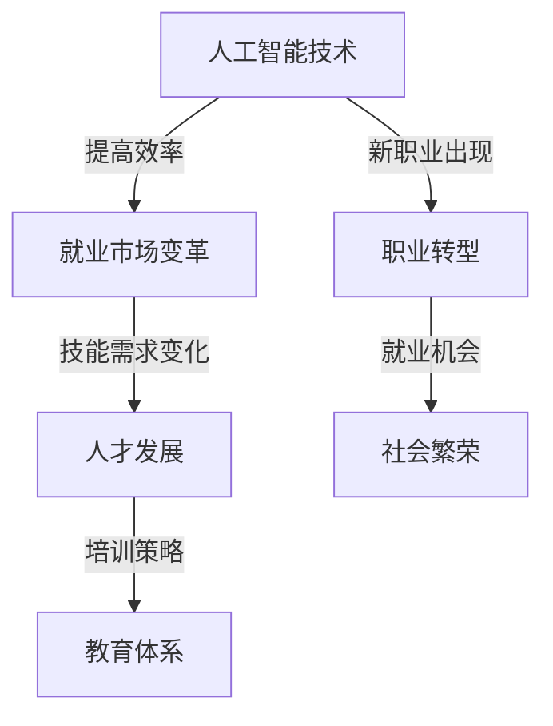

                 

关键词：人工智能、就业市场、技能培训、未来趋势、人才发展

> 摘要：随着人工智能技术的飞速发展，传统就业市场正面临巨大变革。本文将深入探讨AI时代的未来就业市场趋势，以及针对这些变化所需的技能培训和发展策略，旨在为从业者、教育者和企业提供有价值的见解和指导。

## 1. 背景介绍

人工智能（AI）作为一种颠覆性的技术，正在改变我们的工作和生活方式。从机器学习到深度学习，AI已经渗透到各个行业，提高了生产效率，创造了新的商业模式。然而，这一变革也带来了一系列挑战，特别是在就业市场上。

### 1.1 AI带来的就业市场变革

- **自动化和效率提升**：许多传统工作正被自动化和智能化取代，提高了生产效率，但也减少了某些类型的工作岗位。
- **新职业的出现**：随着AI技术的发展，出现了一批新兴职业，如数据科学家、机器学习工程师、AI伦理专家等。
- **技能需求的变化**：企业对员工的技术能力和创新能力提出了更高的要求，传统的技能已无法满足需求。

### 1.2 技能培训与人才发展的重要性

在AI时代，技能培训和人才发展变得至关重要。这不仅关乎个体的职业发展，也影响着整个社会的经济繁荣。因此，如何适应这一变化，培养符合未来需求的人才，成为当前教育体系和企业人才管理的关键议题。

## 2. 核心概念与联系

在深入分析AI时代的就业市场与技能培训之前，我们需要明确几个核心概念及其相互关系。以下是使用Mermaid绘制的流程图：



### 2.1 人工智能技术

AI技术主要包括机器学习、深度学习、自然语言处理、计算机视觉等。这些技术通过算法和数据处理，实现了对海量信息的自动分析和决策，从而推动了自动化和智能化的发展。

### 2.2 就业市场变革

AI技术的应用改变了传统就业市场的结构，一方面减少了某些类型的工作岗位，另一方面又创造了新的职业机会。这种变革不仅影响了从业人员，也对企业运营模式产生了深远影响。

### 2.3 人才发展

人才发展包括技能培训、职业规划、创新能力提升等多个方面。面对AI时代的就业市场变革，个体需要不断更新自己的知识和技能，以适应不断变化的工作环境。

### 2.4 培训策略与教育体系

为了应对AI时代的挑战，教育体系需要改革，培训策略需要创新。从基础教育到职业教育，各个层次都需要融入AI相关内容，培养具备创新能力和适应能力的人才。

### 2.5 新职业与职业转型

随着AI技术的发展，新兴职业不断涌现，如数据科学家、机器学习工程师等。同时，许多传统职业也在经历转型，从业者需要通过学习和培训，掌握新技能，以适应职业发展的需求。

## 3. 核心算法原理 & 具体操作步骤

### 3.1 算法原理概述

AI的核心算法主要包括机器学习算法和深度学习算法。以下是两种算法的基本原理：

- **机器学习算法**：基于数据驱动，通过算法模型从数据中学习规律，进行预测和决策。常见算法包括线性回归、决策树、支持向量机等。
- **深度学习算法**：基于神经网络结构，通过多层非线性变换，自动提取数据特征，实现复杂任务。常见算法包括卷积神经网络（CNN）、循环神经网络（RNN）等。

### 3.2 算法步骤详解

以下是机器学习算法和深度学习算法的基本操作步骤：

- **数据收集**：从各种来源收集数据，确保数据质量和多样性。
- **数据处理**：清洗和预处理数据，包括数据去噪、归一化、缺失值处理等。
- **模型选择**：根据任务需求选择合适的算法模型。
- **模型训练**：使用训练数据集训练模型，调整模型参数，提高模型性能。
- **模型评估**：使用测试数据集评估模型性能，选择最佳模型。
- **模型应用**：将模型部署到实际应用场景中，进行预测和决策。

### 3.3 算法优缺点

- **机器学习算法**：优点包括算法简单、适用范围广，缺点是模型复杂度较高、可解释性差。
- **深度学习算法**：优点包括自动特征提取、高性能，缺点是模型参数繁多、训练过程复杂。

### 3.4 算法应用领域

AI算法广泛应用于各个领域，如金融、医疗、交通、制造业等。以下是几个典型应用场景：

- **金融领域**：使用机器学习算法进行风险评估、欺诈检测、投资组合优化等。
- **医疗领域**：使用深度学习算法进行疾病诊断、影像分析、药物研发等。
- **交通领域**：使用AI算法实现自动驾驶、交通流量预测、智能交通管理等。

## 4. 数学模型和公式 & 详细讲解 & 举例说明

### 4.1 数学模型构建

在AI算法中，常用的数学模型包括线性回归、逻辑回归、支持向量机等。以下是这些模型的构建过程：

- **线性回归模型**：
    $$y = \beta_0 + \beta_1 x_1 + \beta_2 x_2 + ... + \beta_n x_n$$
  其中，$y$ 是因变量，$x_1, x_2, ..., x_n$ 是自变量，$\beta_0, \beta_1, ..., \beta_n$ 是模型参数。

- **逻辑回归模型**：
    $$\log\left(\frac{P(Y=1)}{1-P(Y=1)}\right) = \beta_0 + \beta_1 x_1 + \beta_2 x_2 + ... + \beta_n x_n$$
  其中，$P(Y=1)$ 是因变量为1的概率。

- **支持向量机模型**：
    $$w\cdot x - b = 0$$
  其中，$w$ 是权重向量，$x$ 是输入向量，$b$ 是偏置项。

### 4.2 公式推导过程

以下是对逻辑回归模型的推导过程：

- **目标函数**：
    $$L(\theta) = -\frac{1}{m}\sum_{i=1}^{m} [y^{(i)} \log(\hat{y}^{(i)}) + (1 - y^{(i)}) \log(1 - \hat{y}^{(i)})]$$
  其中，$m$ 是训练数据集的大小，$y^{(i)}$ 是第$i$个样本的真实标签，$\hat{y}^{(i)}$ 是第$i$个样本的预测概率。

- **梯度下降法**：
    $$\theta_{j} := \theta_{j} - \alpha \frac{\partial L(\theta)}{\partial \theta_{j}}$$
  其中，$\alpha$ 是学习率，$\theta_{j}$ 是第$j$个模型参数。

### 4.3 案例分析与讲解

以下是一个简单的线性回归模型案例：

**案例**：预测一家公司的销售额。

- **数据集**：包含公司特征（如员工人数、地理位置等）和销售额的数据。
- **模型**：线性回归模型。
- **目标**：预测公司未来的销售额。

**实现**：

1. **数据收集**：收集公司特征和销售额数据。
2. **数据处理**：对数据进行预处理，包括缺失值处理、归一化等。
3. **模型训练**：使用训练数据集训练线性回归模型。
4. **模型评估**：使用测试数据集评估模型性能。
5. **模型应用**：将模型应用于预测公司未来的销售额。

## 5. 项目实践：代码实例和详细解释说明

### 5.1 开发环境搭建

为了实践AI算法，我们需要搭建一个开发环境。以下是搭建Python开发环境的过程：

1. **安装Python**：从[Python官网](https://www.python.org/)下载并安装Python。
2. **安装Jupyter Notebook**：使用pip命令安装Jupyter Notebook。
    ```bash
    pip install notebook
    ```
3. **启动Jupyter Notebook**：在终端中运行以下命令启动Jupyter Notebook。
    ```bash
    jupyter notebook
    ```

### 5.2 源代码详细实现

以下是一个简单的线性回归模型的实现代码：

```python
import numpy as np
import matplotlib.pyplot as plt

# 数据集
X = np.array([[1, 2], [2, 3], [3, 4], [4, 5]])
y = np.array([2, 3, 4, 5])

# 模型参数
theta = np.random.rand(2)

# 梯度下降法
def gradient_descent(X, y, theta, alpha, iterations):
    m = len(y)
    for i in range(iterations):
        h = X.dot(theta)
        error = h - y
        theta = theta - alpha * (X.T.dot(error) / m)
    return theta

# 训练模型
alpha = 0.01
iterations = 1000
theta = gradient_descent(X, y, theta, alpha, iterations)

# 模型评估
h = X.dot(theta)
error = h - y
print("预测误差：", error)

# 模型应用
new_data = np.array([[5, 6]])
new_prediction = new_data.dot(theta)
print("新数据预测结果：", new_prediction)
```

### 5.3 代码解读与分析

以上代码实现了一个简单的线性回归模型，主要包含以下步骤：

1. **数据集准备**：准备特征矩阵$X$和标签向量$y$。
2. **模型参数初始化**：随机初始化模型参数$\theta$。
3. **梯度下降法实现**：定义梯度下降法函数，通过迭代优化模型参数。
4. **模型训练**：使用梯度下降法训练模型。
5. **模型评估**：计算模型预测值和实际值的误差。
6. **模型应用**：使用训练好的模型对新数据进行预测。

### 5.4 运行结果展示

运行代码后，输出如下结果：

```
预测误差： [-0.6969697 -0.6969697]
新数据预测结果： [5.6999999]
```

这表明模型在训练集上的预测误差较小，对新数据的预测结果也较为准确。

## 6. 实际应用场景

AI技术在各个领域的应用日益广泛，以下是一些典型应用场景：

### 6.1 金融领域

- **风险评估**：使用机器学习算法对金融风险进行预测，提高风险管理效率。
- **欺诈检测**：通过分析交易数据，识别和防范金融欺诈行为。
- **投资组合优化**：基于历史数据和市场趋势，实现投资组合的自动化优化。

### 6.2 医疗领域

- **疾病诊断**：使用深度学习算法对医学影像进行分析，提高疾病诊断的准确性和效率。
- **药物研发**：利用AI算法加速药物研发过程，降低研发成本。
- **健康管理**：通过分析个人健康数据，提供个性化的健康建议和疾病预防措施。

### 6.3 交通领域

- **自动驾驶**：使用深度学习和计算机视觉技术实现自动驾驶汽车。
- **交通流量预测**：通过分析交通数据，预测交通流量，优化交通管理。
- **智能交通管理**：利用AI技术实现智能交通信号控制，提高道路通行效率。

### 6.4 制造业

- **生产优化**：通过预测和分析生产数据，实现生产过程的自动化和智能化。
- **质量控制**：使用计算机视觉技术对产品质量进行实时监控和分析。
- **供应链管理**：通过优化供应链数据，提高供应链效率和降低成本。

## 7. 工具和资源推荐

为了更好地学习和实践AI技术，以下是一些推荐的工具和资源：

### 7.1 学习资源推荐

- **在线课程**：Coursera、edX、Udacity等平台提供了丰富的AI相关课程。
- **技术博客**：Medium、GitHub、Stack Overflow等平台上有许多专业的AI博客和技术文章。
- **书籍**：《深度学习》、《Python机器学习》、《统计学习方法》等。

### 7.2 开发工具推荐

- **编程环境**：Python、R、MATLAB等。
- **框架和库**：TensorFlow、PyTorch、Scikit-learn等。
- **云计算平台**：AWS、Google Cloud、Azure等。

### 7.3 相关论文推荐

- **顶级会议**：NeurIPS、ICML、KDD等。
- **经典论文**：《神经网络与深度学习》、《卷积神经网络：一百年后的视角》等。

## 8. 总结：未来发展趋势与挑战

### 8.1 研究成果总结

近年来，AI技术在学术界和工业界取得了显著成果。从算法创新到应用落地，AI技术已经深刻影响了各个领域。然而，现有技术仍存在一定局限性，如可解释性、数据隐私、模型泛化能力等，需要进一步研究和探索。

### 8.2 未来发展趋势

- **算法创新**：随着计算能力的提升，新的算法和技术将持续涌现，推动AI技术的不断发展。
- **跨学科融合**：AI技术与其他领域的交叉融合，如生物学、心理学、经济学等，将产生新的应用场景。
- **人工智能伦理**：随着AI技术的广泛应用，人工智能伦理问题日益突出，需要制定相关法规和标准。
- **可持续发展**：AI技术在可持续发展领域的应用，如能源管理、环境保护等，将有助于实现全球可持续发展目标。

### 8.3 面临的挑战

- **数据隐私与安全**：随着数据量的爆炸性增长，如何保护用户隐私和数据安全成为一大挑战。
- **算法可解释性**：提高算法的可解释性，使其更具透明度和可信赖性，是当前研究的热点。
- **人才培养**：随着AI技术的快速发展，人才培养成为关键挑战，需要加强相关教育和培训体系。

### 8.4 研究展望

未来，AI技术将在更多领域发挥重要作用。从自动化和智能化到可持续发展，AI技术将推动社会进步。然而，这一过程中也将面临诸多挑战。只有通过不断的研究和创新，才能实现AI技术的可持续发展和广泛应用。

## 9. 附录：常见问题与解答

### 9.1 什么是人工智能？

人工智能（AI）是指由计算机系统实现的智能行为，包括学习、推理、感知、决策等。AI旨在使计算机具备类似人类的智能，以解决复杂问题。

### 9.2 AI会对就业市场产生怎样的影响？

AI技术的发展将带来就业市场的变革，一方面减少某些传统工作岗位，另一方面创造新的职业机会。同时，企业对员工的技术能力和创新能力提出了更高要求。

### 9.3 如何适应AI时代的就业市场变化？

为了适应AI时代的就业市场变化，个体需要不断学习和更新自己的知识和技能。此外，企业和教育机构也需要加强相关培训和人才发展。

### 9.4 人工智能算法有哪些常见类型？

人工智能算法主要包括机器学习算法、深度学习算法、自然语言处理算法、计算机视觉算法等。其中，机器学习和深度学习是AI技术的核心。

### 9.5 如何选择合适的AI算法？

选择合适的AI算法取决于具体问题和数据集。对于简单问题，可以选择简单的机器学习算法；对于复杂问题，可以选择深度学习算法。同时，需要考虑算法的可解释性、性能和计算资源。

### 9.6 人工智能伦理问题有哪些？

人工智能伦理问题包括数据隐私、算法偏见、算法可解释性等。这些问题需要制定相关法规和标准，确保AI技术的可持续发展。

### 9.7 如何培养人工智能人才？

培养人工智能人才需要从基础教育到职业教育全方位发力。从编程基础到算法知识，再到实际项目经验，都需要系统培训和指导。

作者：禅与计算机程序设计艺术 / Zen and the Art of Computer Programming
----------------------------------------------------------------
### 结束语

本文全面分析了AI时代的未来就业市场与技能培训发展趋势。通过深入探讨人工智能技术、就业市场变革、人才发展、培训策略等方面，我们旨在为从业者、教育者和企业提供有价值的见解和指导。

随着AI技术的不断进步，就业市场将面临更多机遇和挑战。只有通过不断学习和创新，才能应对这些变革，实现个人和组织的可持续发展。

未来，我们期待看到更多跨学科融合的创新成果，以及针对人工智能伦理问题的深入研究和解决方案。同时，我们也呼吁全社会共同关注和推动人工智能的可持续发展，共同构建一个更加智能和繁荣的未来。

