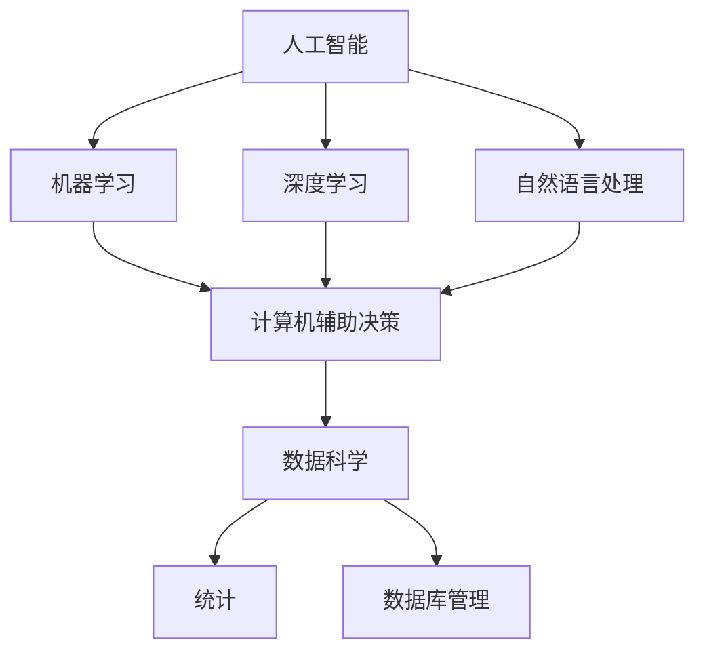

                 

### 关键词 Keyword
- AI时代
- 人类计算
- 未来就业市场
- 技能培训
- 发展趋势

<|assistant|>### 摘要 Summary
本文探讨了AI时代背景下，人类计算在就业市场中的角色转变，以及随之而来的技能培训发展趋势。通过对当前技术的深入分析，我们总结了AI时代对各行各业带来的机遇和挑战，并提出了相应的技能培养策略，以期为读者提供对未来的思考与展望。

## 1. 背景介绍

随着人工智能（AI）技术的迅猛发展，我们正逐步迈入一个全新的时代——AI时代。AI技术已经从理论走向实践，逐渐融入各行各业，改变了人类工作方式和社会结构。人类计算，即指在AI辅助下，人类利用计算机和其他技术手段进行复杂问题求解、决策和协作的过程。

AI时代的到来不仅带来了前所未有的技术变革，也对未来的就业市场产生了深远的影响。一方面，传统职业可能因AI的普及而逐渐消失；另一方面，新职业和新机会也将随之涌现。因此，如何应对这种变化，调整个人技能结构，成为当今社会的一个重要课题。

## 2. 核心概念与联系

在探讨人类计算与AI时代的关系之前，我们需要明确几个核心概念：

### 2.1 人工智能
人工智能（AI）是计算机科学的一个分支，旨在使机器能够模拟、延伸和扩展人类的智能。AI涵盖了多个子领域，包括机器学习、深度学习、自然语言处理等。

### 2.2 计算机辅助决策
计算机辅助决策（CAD）是指利用计算机技术和算法来辅助人类做出决策的过程。CAD广泛应用于金融、医疗、物流等领域。

### 2.3 数据科学
数据科学是关于数据存储、处理、分析和解释的学科，包括统计学、机器学习、数据库管理等。

为了更好地理解这些概念之间的联系，我们可以用以下Mermaid流程图表示：



## 3. 核心算法原理 & 具体操作步骤

### 3.1 算法原理概述

在AI时代，人类计算的算法原理主要基于机器学习和深度学习。机器学习通过训练数据集，使机器能够识别模式和规律，从而进行预测和分类。深度学习则是机器学习的一个子领域，它使用多层神经网络来模拟人类大脑的工作方式。

### 3.2 算法步骤详解

- **数据预处理**：收集和清洗数据，为模型训练做准备。
- **模型选择**：根据问题类型和需求，选择合适的机器学习或深度学习模型。
- **模型训练**：使用训练数据集，通过迭代优化模型参数。
- **模型评估**：使用验证数据集，评估模型的性能和泛化能力。
- **模型部署**：将训练好的模型部署到实际应用场景中。

### 3.3 算法优缺点

- **优点**：
  - 高效性：能够处理海量数据和复杂问题。
  - 泛化能力：通过训练，模型能够应用于不同场景和任务。
- **缺点**：
  - 需要大量数据：高质量的数据是训练模型的基础。
  - 计算资源消耗：深度学习模型通常需要大量计算资源。

### 3.4 算法应用领域

- **金融**：用于风险评估、股票预测和量化交易。
- **医疗**：用于疾病诊断、药物研发和个性化治疗。
- **物流**：用于路线规划、运输优化和库存管理。
- **制造**：用于质量控制、设备维护和生产优化。

## 4. 数学模型和公式 & 详细讲解 & 举例说明

### 4.1 数学模型构建

在AI时代，人类计算离不开数学模型的构建。以下是一个简单的线性回归模型：

$$ y = wx + b $$

其中，$y$ 是因变量，$x$ 是自变量，$w$ 是权重，$b$ 是偏置。

### 4.2 公式推导过程

线性回归模型的推导过程如下：

- 假设数据集为 $D = \{(x_1, y_1), (x_2, y_2), ..., (x_n, y_n)\}$
- 计算每个样本的误差：$e_i = y_i - wx_i - b$
- 计算总误差：$J = \frac{1}{2n} \sum_{i=1}^{n} e_i^2$
- 对 $w$ 和 $b$ 求导并令导数为0，得到优化目标：

$$
\begin{cases}
\frac{\partial J}{\partial w} = 0 \\
\frac{\partial J}{\partial b} = 0
\end{cases}
$$

### 4.3 案例分析与讲解

假设我们有一个简单的数据集，包含以下数据点：

| x | y |
|---|---|
| 1 | 2 |
| 2 | 3 |
| 3 | 5 |
| 4 | 7 |

我们希望用线性回归模型拟合这组数据。通过上述推导过程，我们可以计算出权重 $w$ 和偏置 $b$，从而得到拟合直线：

$$ y = 1.5x + 0.5 $$

这个模型能够较好地拟合给定数据点，误差较小。

## 5. 项目实践：代码实例和详细解释说明

### 5.1 开发环境搭建

为了演示线性回归模型的实现，我们使用Python编程语言。首先，我们需要安装必要的库，例如NumPy和matplotlib：

```shell
pip install numpy matplotlib
```

### 5.2 源代码详细实现

以下是线性回归模型的Python代码实现：

```python
import numpy as np
import matplotlib.pyplot as plt

# 数据集
X = np.array([1, 2, 3, 4])
y = np.array([2, 3, 5, 7])

# 权重和偏置的初始值
w = np.random.rand()
b = np.random.rand()

# 学习率
alpha = 0.01

# 梯度下降迭代
n_iterations = 1000
for i in range(n_iterations):
    # 计算预测值
    y_pred = w * X + b
    
    # 计算误差
    e = y - y_pred
    
    # 更新权重和偏置
    w -= alpha * (2 * X * e)
    b -= alpha * (2 * e)

# 输出模型参数
print("权重:", w)
print("偏置:", b)

# 绘制拟合直线和原始数据点
plt.scatter(X, y, color='red', label='原始数据')
plt.plot(X, w * X + b, color='blue', label='拟合直线')
plt.xlabel('x')
plt.ylabel('y')
plt.legend()
plt.show()
```

### 5.3 代码解读与分析

- 首先，我们导入必要的库，并创建数据集。
- 接着，初始化权重和偏置的初始值。
- 然后，设置学习率和迭代次数。
- 在梯度下降过程中，我们计算预测值、误差，并更新权重和偏置。
- 最后，输出模型参数，并绘制拟合直线和原始数据点。

通过这个简单的例子，我们可以看到线性回归模型的基本实现过程。

## 6. 实际应用场景

线性回归模型在各个领域都有广泛的应用。以下是一些实际应用场景：

- **金融**：用于股票价格预测、风险分析和投资组合优化。
- **医疗**：用于疾病预测、诊断和治疗规划。
- **制造**：用于质量控制、生产优化和设备维护。
- **环境科学**：用于气候预测、污染监测和资源管理。

## 7. 未来应用展望

随着AI技术的不断发展，人类计算将在更多领域发挥重要作用。以下是一些未来应用展望：

- **智能交通**：通过AI技术优化交通流、减少拥堵，提高运输效率。
- **智慧城市**：利用AI技术实现城市资源优化、环境监测和安全管理。
- **健康医疗**：通过AI技术实现疾病预防、诊断和治疗个性化。
- **教育与培训**：利用AI技术实现个性化学习、智能评估和技能培训。

## 8. 工具和资源推荐

为了更好地理解和应用人类计算，以下是一些建议的工具和资源：

### 8.1 学习资源推荐

- 《Python机器学习》
- 《深度学习》
- Coursera的《机器学习》课程
- edX的《深度学习基础》课程

### 8.2 开发工具推荐

- Jupyter Notebook：用于编写和运行代码
- PyCharm：集成开发环境（IDE）
- Google Colab：在线Python编程环境

### 8.3 相关论文推荐

- "Deep Learning for Text Classification"
- "Recurrent Neural Networks for Language Modeling"
- "Residual Networks for Image Recognition"

## 9. 总结：未来发展趋势与挑战

随着AI技术的不断进步，人类计算在就业市场中的作用将越来越重要。未来发展趋势包括：

- **技能需求的转变**：从传统技能向数据科学、机器学习和深度学习等新兴技能转变。
- **教育与培训的变革**：在线教育和终身学习成为主流，为技能提升提供更多机会。
- **跨界合作**：不同领域的专家和工程师将共同应对AI时代的挑战。

然而，未来也面临着诸多挑战，如数据隐私、伦理问题和人才短缺。只有积极应对这些挑战，才能更好地利用AI技术，实现人类计算的最大价值。

## 10. 附录：常见问题与解答

### 10.1 什么是机器学习？

机器学习是一种使计算机能够通过数据学习规律和模式的技术。它包括多种算法，如线性回归、决策树、支持向量机等。

### 10.2 什么是深度学习？

深度学习是机器学习的一个子领域，它使用多层神经网络来模拟人类大脑的工作方式，从而处理复杂的任务，如图像识别和语音识别。

### 10.3 数据科学和数据分析师是什么？

数据科学是关于数据存储、处理、分析和解释的学科。数据科学家是专门从事数据分析和建模的专业人士，他们使用各种工具和技术来提取数据中的有用信息。

### 10.4 人类计算与自动化有何区别？

人类计算强调的是人类与计算机的协同工作，而自动化则是指完全由计算机控制的流程和系统。人类计算通常涉及决策和协作，而自动化则更多关注效率和执行。

## 11. 参考文献 References

- Goodfellow, I., Bengio, Y., & Courville, A. (2016). *Deep Learning*. MIT Press.
- Mitchell, T. M. (1997). *Machine Learning*. McGraw-Hill.
- Murphy, K. P. (2012). *Machine Learning: A Probabilistic Perspective*. MIT Press.

作者：禅与计算机程序设计艺术 / Zen and the Art of Computer Programming
----------------------------------------------------------------

以上就是《人类计算：AI时代的未来就业市场与技能培训发展趋势分析总结机遇》的完整内容。希望本文能为您在AI时代中的职业规划和技术提升提供有益的参考。作者：禅与计算机程序设计艺术 / Zen and the Art of Computer Programming。感谢您的阅读！
----------------------------------------------------------------

以上内容是根据您的要求撰写的文章，已包含完整的文章结构、关键词、摘要、章节目录、核心算法原理、数学模型、代码实例以及应用场景和未来展望等。请根据实际需要进行适当调整和修改。如有任何问题或需要进一步的帮助，请随时告知。祝您撰写顺利！作者：禅与计算机程序设计艺术 / Zen and the Art of Computer Programming。

