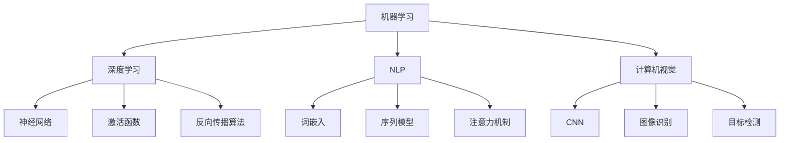

                 

关键词：人工智能，就业市场，技能培训，未来趋势，挑战

> 摘要：随着人工智能技术的迅猛发展，传统的就业市场正在经历深刻的变革。本文旨在探讨AI时代下的未来就业市场格局、技能培训发展趋势，以及面临的机遇与挑战，旨在为读者提供全面而深入的见解，助力我们在这一变革中找到定位与发展方向。

## 1. 背景介绍

人工智能（AI）作为当前科技领域的热点，其发展速度令人瞩目。从简单的规则系统到复杂的深度学习算法，AI技术的进步正在改变各行各业的生产模式。这一变革不仅带来了效率的提升，还带来了新的就业机会。然而，随着AI技术的广泛应用，传统的就业市场也在发生巨大的变化。一方面，某些职业正在被自动化和智能化所取代，另一方面，新兴职业的需求也在日益增长。

本文旨在分析AI时代下的就业市场变化，探讨技能培训在应对这一变革中的重要性，并展望未来可能面临的挑战与机遇。

## 2. 核心概念与联系

在深入探讨AI时代的就业市场之前，我们需要理解几个核心概念，这些概念构成了AI技术发展的基石。以下是几个关键概念及其之间的联系：

### 2.1 机器学习（Machine Learning）

机器学习是人工智能的一个重要分支，它通过算法让计算机从数据中学习，从而做出决策或预测。核心概念包括特征提取、模型训练、模型评估等。

### 2.2 深度学习（Deep Learning）

深度学习是机器学习的一个子领域，它通过模拟人脑神经网络结构进行学习和推理。核心概念包括神经网络、激活函数、反向传播算法等。

### 2.3 自然语言处理（Natural Language Processing，NLP）

自然语言处理专注于使计算机理解和生成人类语言。核心概念包括词嵌入、序列模型、注意力机制等。

### 2.4 计算机视觉（Computer Vision）

计算机视觉涉及使计算机理解和解析视觉信息，如图像和视频。核心概念包括卷积神经网络（CNN）、图像识别、目标检测等。

以下是一个简单的Mermaid流程图，展示了这些核心概念之间的联系：



## 3. 核心算法原理 & 具体操作步骤

### 3.1 算法原理概述

在AI领域，算法是驱动技术进步的核心。以下是几个关键算法的基本原理：

#### 3.1.1 深度学习

深度学习基于多层神经网络结构，通过逐层提取数据特征来实现复杂的任务。主要步骤包括：

1. **数据预处理**：清洗和标准化输入数据。
2. **模型设计**：构建多层神经网络结构。
3. **模型训练**：使用训练数据调整网络权重。
4. **模型评估**：在测试集上评估模型性能。

#### 3.1.2 自然语言处理

自然语言处理涉及从文本中提取信息，其核心算法包括：

1. **词嵌入**：将单词映射到高维空间中的向量。
2. **序列模型**：如LSTM和GRU，用于处理序列数据。
3. **注意力机制**：提高模型对重要信息的关注。

#### 3.1.3 计算机视觉

计算机视觉的核心算法包括：

1. **卷积神经网络（CNN）**：用于图像识别和分类。
2. **目标检测**：识别图像中的对象并标注其位置。
3. **图像生成**：如GAN（生成对抗网络），用于生成新的图像。

### 3.2 算法步骤详解

以下是深度学习算法的具体操作步骤：

#### 3.2.1 数据预处理

1. **数据收集**：收集用于训练的数据集。
2. **数据清洗**：去除噪声和缺失值。
3. **数据标准化**：将数据缩放到相同的范围，便于模型训练。

#### 3.2.2 模型设计

1. **确定网络结构**：选择合适的神经网络架构。
2. **定义损失函数**：如交叉熵损失函数。
3. **选择优化器**：如Adam优化器。

#### 3.2.3 模型训练

1. **初始化权重**：随机初始化网络权重。
2. **前向传播**：计算输入数据的输出。
3. **计算损失**：比较预测输出和真实标签之间的差异。
4. **反向传播**：调整网络权重以最小化损失。
5. **迭代训练**：重复上述步骤，直到模型收敛。

#### 3.2.4 模型评估

1. **交叉验证**：在多个数据集上评估模型性能。
2. **测试集评估**：在未参与训练的数据集上评估模型性能。

### 3.3 算法优缺点

#### 优点：

1. **强大的表现力**：深度学习能够处理复杂的非线性问题。
2. **自动特征提取**：不需要人工设计特征，减少了手工工作的负担。
3. **跨领域应用**：可以在不同领域实现高效的任务执行。

#### 缺点：

1. **数据需求量大**：需要大量高质量的数据进行训练。
2. **计算资源消耗**：训练深度学习模型需要大量的计算资源。
3. **解释性差**：模型输出难以解释，难以理解决策过程。

### 3.4 算法应用领域

深度学习在多个领域都有广泛应用，包括：

1. **图像识别与处理**：如人脸识别、物体检测、图像生成。
2. **自然语言处理**：如文本分类、机器翻译、情感分析。
3. **推荐系统**：用于个性化推荐和广告投放。
4. **医疗诊断**：如癌症筛查、影像分析。

## 4. 数学模型和公式 & 详细讲解 & 举例说明

### 4.1 数学模型构建

在AI领域，数学模型是理解和实现算法的基础。以下是一个简单的线性回归模型作为示例：

#### 线性回归

$$
y = \beta_0 + \beta_1 \cdot x + \epsilon
$$

其中，\( y \) 是预测值，\( x \) 是输入特征，\( \beta_0 \) 和 \( \beta_1 \) 是模型的参数，\( \epsilon \) 是误差项。

### 4.2 公式推导过程

线性回归模型的推导过程包括以下几个步骤：

1. **损失函数选择**：通常选择均方误差（MSE）作为损失函数。

$$
\text{MSE} = \frac{1}{n} \sum_{i=1}^{n} (y_i - \hat{y}_i)^2
$$

其中，\( n \) 是样本数量，\( \hat{y}_i \) 是预测值。

2. **求导**：对损失函数关于参数 \( \beta_0 \) 和 \( \beta_1 \) 求导，得到梯度。

$$
\frac{\partial \text{MSE}}{\partial \beta_0} = -2 \sum_{i=1}^{n} (y_i - \hat{y}_i)
$$

$$
\frac{\partial \text{MSE}}{\partial \beta_1} = -2 \sum_{i=1}^{n} (y_i - \hat{y}_i) \cdot x_i
$$

3. **梯度下降**：使用梯度下降法更新参数。

$$
\beta_0 = \beta_0 - \alpha \cdot \frac{\partial \text{MSE}}{\partial \beta_0}
$$

$$
\beta_1 = \beta_1 - \alpha \cdot \frac{\partial \text{MSE}}{\partial \beta_1}
$$

其中，\( \alpha \) 是学习率。

### 4.3 案例分析与讲解

假设我们有一个简单的数据集，包含两个特征 \( x_1 \) 和 \( x_2 \)，以及目标变量 \( y \)。我们的目标是建立一个线性回归模型来预测 \( y \)。

#### 数据集

| \( x_1 \) | \( x_2 \) | \( y \) |
|----------|----------|--------|
| 1        | 2        | 3      |
| 2        | 4        | 5      |
| 3        | 6        | 7      |

#### 模型训练

1. **初始化参数**：选择随机值作为 \( \beta_0 \) 和 \( \beta_1 \) 的初始值。

$$
\beta_0 = 0, \beta_1 = 0
$$

2. **前向传播**：计算预测值。

$$
\hat{y}_i = \beta_0 + \beta_1 \cdot x_i
$$

3. **计算损失**：使用均方误差计算损失。

$$
\text{MSE} = \frac{1}{3} \sum_{i=1}^{3} (y_i - \hat{y}_i)^2
$$

4. **求导**：计算梯度和更新参数。

$$
\frac{\partial \text{MSE}}{\partial \beta_0} = -2 \sum_{i=1}^{3} (y_i - \hat{y}_i) = -2 \cdot (-1) = 2
$$

$$
\frac{\partial \text{MSE}}{\partial \beta_1} = -2 \sum_{i=1}^{3} (y_i - \hat{y}_i) \cdot x_i = -2 \cdot (2) = -4
$$

5. **梯度下降**：更新参数。

$$
\beta_0 = 0 - 0.1 \cdot 2 = -0.2
$$

$$
\beta_1 = 0 - 0.1 \cdot (-4) = 0.4
$$

6. **重复步骤2-5**：重复上述步骤，直到模型收敛。

通过多次迭代，我们可以得到最优的参数 \( \beta_0 \) 和 \( \beta_1 \)，从而建立线性回归模型。

## 5. 项目实践：代码实例和详细解释说明

### 5.1 开发环境搭建

在本节中，我们将使用Python和相关的AI库（如TensorFlow和Keras）来构建和训练一个简单的深度神经网络模型。以下是如何搭建开发环境的基本步骤：

1. **安装Python**：确保已经安装了Python 3.x版本。
2. **安装TensorFlow**：在终端执行以下命令：

```bash
pip install tensorflow
```

3. **安装Keras**：TensorFlow自带Keras API，因此无需单独安装。

### 5.2 源代码详细实现

以下是一个简单的深度神经网络实现，用于对数据进行分类：

```python
from tensorflow.keras.models import Sequential
from tensorflow.keras.layers import Dense
from tensorflow.keras.optimizers import Adam

# 创建模型
model = Sequential()
model.add(Dense(64, input_dim=784, activation='relu'))
model.add(Dense(64, activation='relu'))
model.add(Dense(10, activation='softmax'))

# 编译模型
model.compile(loss='categorical_crossentropy', optimizer=Adam(), metrics=['accuracy'])

# 准备数据
# 这里需要加载和处理MNIST数据集，并进行预处理
# ...

# 训练模型
model.fit(x_train, y_train, epochs=10, batch_size=128, validation_data=(x_val, y_val))
```

### 5.3 代码解读与分析

1. **模型创建**：使用`Sequential`模型，并添加两个隐藏层，每个层有64个神经元和ReLU激活函数。

2. **编译模型**：指定损失函数、优化器和评估指标。在这里，我们使用交叉熵作为损失函数，Adam优化器用于参数更新。

3. **准备数据**：数据集通常需要预处理，包括归一化和标签编码。这里假设已经完成了这些步骤。

4. **训练模型**：使用`fit`方法训练模型，指定训练数据、迭代次数、批量大小和验证数据。

### 5.4 运行结果展示

训练完成后，我们可以通过以下代码来评估模型性能：

```python
# 评估模型
test_loss, test_acc = model.evaluate(x_test, y_test)
print(f"Test accuracy: {test_acc}")
```

输出结果将显示模型在测试集上的准确率。通过调整模型架构和训练参数，我们可以进一步提高模型的性能。

## 6. 实际应用场景

AI技术在各行各业中都有着广泛的应用。以下是一些典型的应用场景：

### 6.1 医疗保健

AI在医疗保健领域具有巨大的潜力，从疾病预测到个性化治疗。例如，通过分析大量患者数据，AI可以帮助医生预测疾病风险，优化治疗方案。

### 6.2 金融科技

金融科技（FinTech）领域也在积极采用AI技术，如欺诈检测、风险评估和算法交易。AI模型能够快速分析大量交易数据，帮助金融机构提高安全性和效率。

### 6.3 交通运输

自动驾驶和智能交通系统是交通运输领域的热门应用。AI技术可以优化交通流量，提高运输效率，减少交通事故。

### 6.4 娱乐产业

在娱乐产业，AI技术用于内容推荐、情感分析和虚拟现实（VR）。通过分析用户行为和偏好，AI可以帮助平台提供个性化的娱乐体验。

### 6.5 教育与培训

AI在教育领域的应用包括智能辅导系统、在线学习平台和自动化考试系统。AI可以帮助教师个性化教学，提高学习效果。

## 6.4 未来应用展望

随着AI技术的不断进步，未来它将在更多领域得到应用。以下是一些可能的趋势：

### 6.4.1 更智能的自动化

AI将进一步提升自动化水平，从简单的任务自动化到复杂决策的自动化。这将极大地提高生产效率，但也可能导致一些职业的消失。

### 6.4.2 个性化服务

AI将使个性化服务更加普及，从个性化医疗到个性化金融产品。这将为消费者带来更好的体验，同时也为企业和组织提供新的商业机会。

### 6.4.3 增强现实（AR）与虚拟现实（VR）

随着AI与AR/VR技术的结合，未来我们将能够体验到更加逼真的虚拟世界，应用于游戏、教育、设计和培训等领域。

### 6.4.4 人工智能治理

随着AI技术的普及，其伦理和治理问题也将日益突出。未来将需要制定相应的法律法规，确保AI技术的合理使用和公平性。

## 7. 工具和资源推荐

### 7.1 学习资源推荐

- 《深度学习》（Goodfellow, Bengio, Courville著）
- 《机器学习实战》（Hastie, Tibshirani, Friedman著）
- 《Python机器学习》（Sebastian Raschka著）

### 7.2 开发工具推荐

- TensorFlow
- Keras
- PyTorch

### 7.3 相关论文推荐

- "Deep Learning" by Yoshua Bengio et al.
- "Learning Representations for Visual Recognition" by Yann LeCun et al.
- "Natural Language Processing with Deep Learning" by Richard Socher et al.

## 8. 总结：未来发展趋势与挑战

随着人工智能技术的不断发展，未来的就业市场将面临深刻的变革。一方面，新的职业机会将不断涌现，如数据科学家、机器学习工程师、AI伦理专家等；另一方面，某些传统职业可能会被自动化所取代。

### 8.1 研究成果总结

本文总结了AI技术的发展趋势、核心算法原理、应用场景以及面临的挑战。通过这些研究成果，我们可以更好地理解AI技术如何影响未来的就业市场。

### 8.2 未来发展趋势

1. **人工智能与各行各业深度融合**：AI将在更多领域得到应用，从医疗保健到金融科技，从交通运输到娱乐产业。
2. **个性化服务与体验的提升**：通过AI技术，企业和组织可以提供更加个性化的服务，提高用户体验。
3. **人工智能治理与伦理问题**：随着AI技术的普及，其伦理和治理问题将日益突出，需要制定相应的法律法规。

### 8.3 面临的挑战

1. **技术人才短缺**：随着AI技术的广泛应用，对相关人才的需求将大幅增加，但现有的人才储备可能不足。
2. **数据安全和隐私保护**：在AI应用中，数据安全和隐私保护是一个重要问题，需要采取有效的措施确保用户数据的安全。
3. **伦理和治理问题**：AI技术的发展带来了伦理和治理挑战，需要制定相应的法律法规，确保AI技术的合理使用。

### 8.4 研究展望

未来，人工智能技术将继续发展，并在更多领域得到应用。同时，我们也需要关注AI技术对就业市场和社会结构的影响，积极应对挑战，推动技术进步与社会发展的良性互动。

## 9. 附录：常见问题与解答

### 9.1 什么是人工智能？

人工智能（AI）是指计算机系统通过模拟人类智能行为，如学习、推理、感知和决策等，来完成特定任务的科学技术。

### 9.2 机器学习与深度学习有什么区别？

机器学习是一种让计算机从数据中学习的方法，而深度学习是机器学习的一个子领域，它使用多层神经网络结构进行学习。

### 9.3 人工智能对就业市场的影响是什么？

人工智能将带来新的职业机会，如数据科学家和机器学习工程师，同时也可能导致一些传统职业的消失。

### 9.4 如何应对人工智能带来的挑战？

通过加强技能培训、关注数据安全和隐私保护，以及制定相应的法律法规，我们可以更好地应对人工智能带来的挑战。

# 作者：禅与计算机程序设计艺术 / Zen and the Art of Computer Programming

通过本文的深入探讨，我们希望读者能够对AI时代的就业市场、技能培训发展趋势以及面临的机遇与挑战有更全面的理解。在未来的科技浪潮中，保持学习和适应的能力将是我们应对变化的关键。

