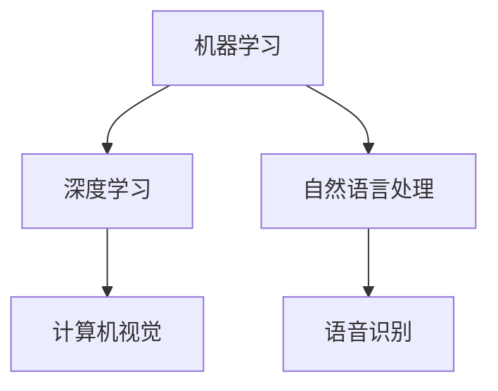
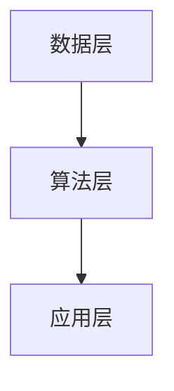

                 

关键词：人工智能，就业市场，技能培训，职业发展，技术趋势，挑战与机遇

> 摘要：本文旨在探讨人工智能（AI）时代对就业市场的影响，以及未来技能培训的发展趋势。通过分析AI技术的核心原理、应用领域、数学模型，以及实际项目实践，本文将为读者提供一个全面而深入的了解，以应对未来职业发展的机遇与挑战。

## 1. 背景介绍

### 1.1 人工智能的崛起

人工智能作为计算机科学的一个重要分支，自20世纪50年代起就开始蓬勃发展。随着计算能力的不断提升和数据量的爆炸性增长，AI技术取得了显著的进步，并在各个领域展现出强大的应用潜力。

### 1.2 人工智能对就业市场的影响

人工智能的发展不仅改变了传统产业的运作模式，也深刻影响了就业市场的格局。一方面，AI技术的应用推动了新兴职业的出现，如数据科学家、机器学习工程师等；另一方面，一些传统岗位可能因自动化而面临被取代的风险。

### 1.3 技能培训的必要性

在这个快速变化的时代，持续学习成为职业发展的关键。技能培训不仅是提升个人竞争力的必要手段，也是适应未来就业市场变化的迫切需求。

## 2. 核心概念与联系

### 2.1 人工智能的核心概念

人工智能的核心概念包括机器学习、深度学习、自然语言处理等。这些概念相互联系，共同构建了AI的技术体系。



### 2.2 人工智能的架构

人工智能的架构可以分为数据层、算法层和应用层。数据层负责数据的收集和预处理，算法层提供核心的计算能力，应用层将AI技术应用到具体领域。



## 3. 核心算法原理 & 具体操作步骤

### 3.1 算法原理概述

机器学习算法是人工智能的核心，它通过训练模型来识别数据中的模式和规律。常见的机器学习算法包括决策树、支持向量机、神经网络等。

### 3.2 算法步骤详解

- 数据收集：收集相关领域的数据，并进行预处理。
- 特征提取：将原始数据转换为可用于训练的特征向量。
- 模型训练：使用训练数据集对模型进行训练，调整参数以优化模型性能。
- 模型评估：使用测试数据集对模型进行评估，以确定其泛化能力。
- 模型应用：将训练好的模型应用到实际问题中。

### 3.3 算法优缺点

- **优点**：机器学习算法具有强大的泛化能力和适应能力，可以处理大量复杂数据。
- **缺点**：模型训练时间较长，对数据质量和特征提取要求较高。

### 3.4 算法应用领域

机器学习算法广泛应用于金融、医疗、电商、自动驾驶等多个领域，为各行业带来了巨大的变革。

## 4. 数学模型和公式 & 详细讲解 & 举例说明

### 4.1 数学模型构建

在机器学习中，常见的数学模型包括损失函数、优化算法等。以线性回归为例，其数学模型可以表示为：

$$
y = \beta_0 + \beta_1x
$$

### 4.2 公式推导过程

线性回归模型的推导过程主要包括最小二乘法和梯度下降法。最小二乘法通过寻找损失函数的最小值来确定模型参数，而梯度下降法则通过迭代更新模型参数以优化损失函数。

### 4.3 案例分析与讲解

假设我们要预测房价，使用线性回归模型。我们收集了一系列房屋数据，包括房屋面积和价格。通过训练模型，我们可以得到一个拟合的线性函数，用于预测新房屋的价格。

## 5. 项目实践：代码实例和详细解释说明

### 5.1 开发环境搭建

在Python环境中，我们可以使用scikit-learn库来实现线性回归模型。首先，需要安装相关库：

```python
pip install scikit-learn
```

### 5.2 源代码详细实现

```python
from sklearn.linear_model import LinearRegression
from sklearn.model_selection import train_test_split
from sklearn.metrics import mean_squared_error

# 数据预处理
X = data[:, :-1]  # 特征
y = data[:, -1]   # 目标变量

# 数据集划分
X_train, X_test, y_train, y_test = train_test_split(X, y, test_size=0.2, random_state=42)

# 模型训练
model = LinearRegression()
model.fit(X_train, y_train)

# 模型评估
y_pred = model.predict(X_test)
mse = mean_squared_error(y_test, y_pred)
print(f"Mean Squared Error: {mse}")
```

### 5.3 代码解读与分析

这段代码首先进行了数据预处理，然后使用train\_test\_split方法将数据集划分为训练集和测试集。接着，使用LinearRegression类创建线性回归模型，并通过fit方法进行训练。最后，使用predict方法进行预测，并计算均方误差以评估模型性能。

### 5.4 运行结果展示

通过运行代码，我们可以得到线性回归模型的均方误差。这个值越小，表示模型对数据的拟合越好。

## 6. 实际应用场景

### 6.1 人工智能在金融领域的应用

人工智能在金融领域的应用包括风险管理、信用评估、量化交易等。例如，通过机器学习算法，银行可以更准确地评估借款人的信用状况，从而降低信贷风险。

### 6.2 人工智能在医疗领域的应用

人工智能在医疗领域的应用包括疾病预测、药物研发、医疗影像分析等。例如，通过深度学习算法，医生可以更早期地预测疾病风险，从而提高治疗成功率。

### 6.3 人工智能在自动驾驶领域的应用

人工智能在自动驾驶领域的应用包括环境感知、路径规划、车辆控制等。例如，通过计算机视觉和深度学习算法，自动驾驶汽车可以更好地理解和响应道路状况。

## 7. 工具和资源推荐

### 7.1 学习资源推荐

- 《深度学习》（Goodfellow, Bengio, Courville著）
- 《Python机器学习》（Scikit-Learn & TensorFlow）
- 《人工智能：一种现代方法》（Mitchell著）

### 7.2 开发工具推荐

- Jupyter Notebook
- TensorFlow
- PyTorch

### 7.3 相关论文推荐

- “Deep Learning for Image Recognition”（Krizhevsky et al., 2012）
- “Recurrent Neural Networks for Speech Recognition”（Hinton et al., 2012）
- “Natural Language Inference with Probabilistic Models”（McDonald et al., 2017）

## 8. 总结：未来发展趋势与挑战

### 8.1 研究成果总结

人工智能在过去几十年取得了显著的成果，不仅在理论研究上有了突破，也在实际应用中展现了巨大的潜力。

### 8.2 未来发展趋势

随着计算能力的进一步提升和数据量的持续增长，人工智能在未来将继续发挥重要作用，推动各行业的数字化转型。

### 8.3 面临的挑战

然而，人工智能的发展也面临着一系列挑战，包括算法的公平性、隐私保护、以及与人类工作者的协作等。

### 8.4 研究展望

未来，人工智能将更加智能化、自适应化，并与人类更加紧密地融合。研究者需要不断创新，以应对这些挑战，推动人工智能技术的可持续发展。

## 9. 附录：常见问题与解答

### 9.1 什么是人工智能？

人工智能是指通过计算机模拟人类智能的技术，包括学习、推理、感知和解决问题等。

### 9.2 人工智能会取代人类吗？

人工智能不会完全取代人类，而是与人类相互补充，提高生产效率和创新能力。

### 9.3 如何入门人工智能？

建议先学习Python编程语言，然后掌握机器学习和深度学习的基本概念，并通过实践项目来提高技能。

---

作者：禅与计算机程序设计艺术 / Zen and the Art of Computer Programming
----------------------------------------------------------------

文章撰写完毕，接下来我们将进行文章内容的排版与格式调整，以确保其符合markdown格式的规范和阅读体验。如果您需要进一步的技术支持或对内容有任何修改意见，请告知。现在，我们将对文章进行最后的检查和排版。

