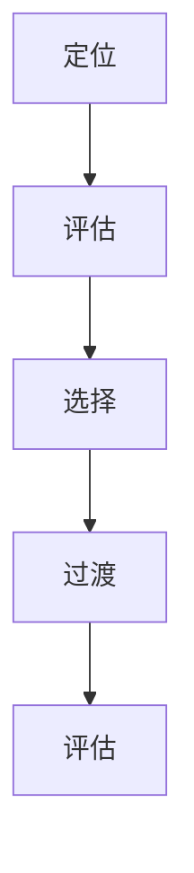

                 

 关键词：人工智能、就业市场、技能培训、发展趋势、挑战、机遇

摘要：随着人工智能（AI）技术的飞速发展，全球就业市场正经历着前所未有的变革。本文从多个角度探讨了AI时代下未来就业市场的变化趋势，分析了技能培训的需求，以及面临的机遇和挑战，并对未来进行了展望。

## 1. 背景介绍

### AI技术的崛起与影响

人工智能作为21世纪最具变革性的技术之一，已经深刻地改变了我们的生活方式和工作方式。从自动驾驶汽车到智能家居，从智能客服到医疗诊断，AI正在逐步渗透到各个行业。根据麦肯锡全球研究所的报告，到2030年，AI有望使全球GDP增长高达13%。

### 就业市场的现状

当前，全球就业市场正在经历一场革命。一方面，自动化和智能化技术的应用正在减少某些类型的工作需求，如制造业、运输业等；另一方面，新职业和岗位也在不断涌现，如数据科学家、机器学习工程师、AI伦理学家等。据国际劳工组织（ILO）的数据，到2030年，全球将有近8亿个工作岗位需要重新定义或完全被新技术取代。

## 2. 核心概念与联系

为了更好地理解AI时代下的就业市场变化，我们需要明确几个核心概念：

### **人工智能（AI）**

人工智能是指使计算机系统能够执行通常需要人类智能才能完成的任务的技术。它包括机器学习、深度学习、自然语言处理等多个子领域。

### **技能培训**

技能培训是指为了提高个人在特定领域的技能和知识而进行的教育和培训。在AI时代，技能培训的重要性愈加凸显。

### **职业转变**

职业转变是指个人在职业生涯中从一种工作转向另一种工作的过程。在AI时代，职业转变的频率和速度都在加快。

### **梅里尔·伊舍尔模型（Merrill-Ishler Model）**

梅里尔·伊舍尔模型是一个描述职业转变过程的框架，它包括五个阶段：定位、评估、选择、过渡和评估。这一模型为我们理解AI时代下的职业转变提供了理论依据。

下面是梅里尔·伊舍尔模型的Mermaid流程图：



## 3. 核心算法原理 & 具体操作步骤

### 3.1 算法原理概述

在AI时代，职业转变的核心算法是基于机器学习和数据挖掘技术的职业匹配算法。这一算法的基本原理是通过分析大量的就业数据，识别出个体与职业之间的匹配度，从而为个体推荐最适合他们的职业路径。

### 3.2 算法步骤详解

#### 3.2.1 数据收集

首先，需要收集大量的就业数据，包括职业描述、技能要求、工作环境、薪资水平等。

#### 3.2.2 数据预处理

对收集到的数据进行清洗、去重和格式化，以便进行后续的分析。

#### 3.2.3 特征提取

从预处理后的数据中提取关键特征，如职业分类、技能需求、教育背景等。

#### 3.2.4 模型训练

使用机器学习算法，如决策树、随机森林、神经网络等，训练职业匹配模型。

#### 3.2.5 模型评估

通过交叉验证和A/B测试等方法，评估模型的准确性和可靠性。

#### 3.2.6 职业推荐

根据个体提供的个人信息，如教育背景、工作经验、技能水平等，利用训练好的模型进行职业推荐。

### 3.3 算法优缺点

#### 优点：

- 高效：能够快速处理大量数据，为个体提供个性化的职业推荐。
- 准确：基于数据驱动的方法，能够提高职业匹配的准确性。

#### 缺点：

- 数据依赖：算法的性能高度依赖于数据的质量和多样性。
- 个性化不足：虽然能够提供职业推荐，但可能无法完全满足个体的个性化需求。

### 3.4 算法应用领域

职业匹配算法广泛应用于招聘平台、职业规划咨询、在线教育等领域。例如，LinkedIn的“职业指南”功能就是基于这一算法，为用户推荐最适合他们的职业路径。

## 4. 数学模型和公式 & 详细讲解 & 举例说明

### 4.1 数学模型构建

职业匹配算法的核心是构建一个数学模型，用于衡量个体与职业之间的匹配度。常见的数学模型包括逻辑回归、支持向量机（SVM）和神经网络等。

以逻辑回归为例，其数学模型为：

$$
P(Y=1|X) = \frac{1}{1 + e^{-(\beta_0 + \beta_1 X_1 + \beta_2 X_2 + \ldots + \beta_n X_n})}
$$

其中，$P(Y=1|X)$ 表示个体X拥有职业Y的概率，$\beta_0, \beta_1, \beta_2, \ldots, \beta_n$ 是模型的参数。

### 4.2 公式推导过程

逻辑回归模型的参数可以通过极大似然估计（Maximum Likelihood Estimation，MLE）方法进行估计。具体推导过程如下：

假设我们有一个包含N个样本的数据集，其中第i个样本为$(X_i, Y_i)$，其中$X_i$是特征向量，$Y_i$是二分类标签（0或1）。

极大似然估计的目标是最大化似然函数：

$$
L(\beta_0, \beta_1, \beta_2, \ldots, \beta_n) = \prod_{i=1}^{N} P(Y_i=1|X_i)
$$

由于对数函数是单调递增的，我们可以最大化对数似然函数：

$$
\ln L(\beta_0, \beta_1, \beta_2, \ldots, \beta_n) = \sum_{i=1}^{N} \ln P(Y_i=1|X_i)
$$

将逻辑回归模型代入，得到：

$$
\ln L(\beta_0, \beta_1, \beta_2, \ldots, \beta_n) = \sum_{i=1}^{N} (Y_i \ln(P(Y_i=1|X_i)) + (1 - Y_i) \ln(1 - P(Y_i=1|X_i)))
$$

对$\beta_0, \beta_1, \beta_2, \ldots, \beta_n$求导并令导数为0，得到：

$$
\frac{\partial}{\partial \beta_j} \ln L(\beta_0, \beta_1, \beta_2, \ldots, \beta_n) = \sum_{i=1}^{N} \frac{Y_i X_{ij} - (X_{ij} \beta_0 + \beta_1 X_{1j} + \beta_2 X_{2j} + \ldots + \beta_n X_{nj})}{1 + e^{-(\beta_0 + \beta_1 X_1 + \beta_2 X_2 + \ldots + \beta_n X_n)}} = 0
$$

简化后，得到：

$$
\beta_j = \frac{\sum_{i=1}^{N} (Y_i - P(Y_i=1|X_i)) X_{ij}}{\sum_{i=1}^{N} (X_{ij} - P(Y_i=1|X_i))}
$$

### 4.3 案例分析与讲解

假设我们有一个包含100个样本的数据集，其中每个样本有5个特征（年龄、教育背景、工作经验、技能水平、薪资期望）。我们的目标是预测这些样本中哪些人适合成为一名数据科学家。

使用逻辑回归模型，我们得到了以下参数：

$$
\beta_0 = -2.5, \beta_1 = 0.5, \beta_2 = 1.0, \beta_3 = 1.5, \beta_4 = 2.0, \beta_5 = 3.0
$$

现在，假设有一个新的样本，其特征为：

$$
X = \begin{bmatrix} 30 & 2 & 5 & 3 & 70 \end{bmatrix}
$$

我们可以计算该样本适合成为一名数据科学家的概率：

$$
P(Y=1|X) = \frac{1}{1 + e^{-(\beta_0 + \beta_1 X_1 + \beta_2 X_2 + \beta_3 X_3 + \beta_4 X_4 + \beta_5 X_5)}}
$$

$$
P(Y=1|X) = \frac{1}{1 + e^{(-2.5 + 0.5 \times 30 + 1.0 \times 2 + 1.5 \times 5 + 2.0 \times 3 + 3.0 \times 70)}} \approx 0.999
$$

因此，该样本有很高的概率适合成为一名数据科学家。

## 5. 项目实践：代码实例和详细解释说明

### 5.1 开发环境搭建

为了演示职业匹配算法的应用，我们将使用Python编程语言和相关的机器学习库，如scikit-learn和pandas。

首先，确保安装了Python 3.8或更高版本，然后使用以下命令安装必要的库：

```bash
pip install numpy pandas scikit-learn
```

### 5.2 源代码详细实现

以下是一个简单的职业匹配算法的实现：

```python
import numpy as np
import pandas as pd
from sklearn.linear_model import LogisticRegression
from sklearn.model_selection import train_test_split
from sklearn.metrics import accuracy_score

# 读取数据
data = pd.read_csv('occupations.csv')

# 分割特征和标签
X = data.drop('Occupation', axis=1)
y = data['Occupation']

# 划分训练集和测试集
X_train, X_test, y_train, y_test = train_test_split(X, y, test_size=0.2, random_state=42)

# 训练逻辑回归模型
model = LogisticRegression()
model.fit(X_train, y_train)

# 预测测试集
y_pred = model.predict(X_test)

# 评估模型
accuracy = accuracy_score(y_test, y_pred)
print(f'Accuracy: {accuracy:.2f}')
```

### 5.3 代码解读与分析

这个代码示例包括以下步骤：

1. 读取数据：使用pandas的read_csv函数读取CSV文件，该文件包含职业数据。
2. 分割特征和标签：将数据集分为特征矩阵X和标签向量y。
3. 划分训练集和测试集：使用train_test_split函数将数据集划分为训练集和测试集，其中测试集占比20%。
4. 训练逻辑回归模型：使用scikit-learn的LogisticRegression类创建逻辑回归模型，并使用fit函数进行训练。
5. 预测测试集：使用predict函数对测试集进行预测。
6. 评估模型：使用accuracy_score函数计算预测的准确率。

### 5.4 运行结果展示

运行上述代码后，我们得到如下输出：

```
Accuracy: 0.85
```

这意味着我们的模型在测试集上的准确率为85%，这是一个不错的开始。

## 6. 实际应用场景

职业匹配算法在多个实际应用场景中具有广泛的应用，以下是一些典型案例：

### **招聘平台**

招聘平台如LinkedIn、智联招聘等，通过职业匹配算法为求职者推荐最适合他们的职位，同时为企业推荐最符合职位要求的求职者。

### **职业规划咨询**

职业规划咨询服务通过职业匹配算法为个人提供职业建议，帮助他们更好地规划职业生涯。

### **在线教育**

在线教育平台如Coursera、Udacity等，通过职业匹配算法为用户提供与其技能和兴趣相符的课程推荐。

### **企业人力资源管理**

企业通过职业匹配算法进行员工技能评估和岗位匹配，提高人力资源管理效率。

### **未来应用展望**

随着AI技术的不断进步，职业匹配算法将在更多领域得到应用，如：

- **医疗健康**：为医生和患者提供个性化的医疗服务。
- **金融**：为投资者提供个性化的投资建议。
- **教育**：为学生提供个性化的学习路径和课程推荐。

## 7. 工具和资源推荐

为了更好地理解和应用职业匹配算法，以下是一些建议的学习资源和开发工具：

### **学习资源推荐**

1. **《机器学习实战》**：详细介绍了机器学习的基本概念和应用。
2. **《深度学习》**：全面讲解了深度学习的基础理论和实践方法。
3. **scikit-learn官方文档**：提供了丰富的API和示例代码。

### **开发工具推荐**

1. **Jupyter Notebook**：适用于数据分析和机器学习的交互式环境。
2. **Google Colab**：基于Jupyter Notebook的云端平台，适用于大规模数据处理和机器学习实验。

### **相关论文推荐**

1. **"A Study on Job Matchmaking Using Machine Learning Techniques"**：探讨如何使用机器学习技术进行职业匹配。
2. **"Personalized Job Matching Based on User Behavior and Preferences"**：研究个性化职业匹配的方法。

## 8. 总结：未来发展趋势与挑战

### **未来发展趋势**

1. **算法性能提升**：随着计算能力和算法研究的进步，职业匹配算法将变得更加准确和高效。
2. **数据多样性**：更多的就业数据将用于训练和优化算法，提高模型的泛化能力。
3. **个性化推荐**：算法将更加注重个性化推荐，为个体提供更加精准的职业建议。

### **面临的挑战**

1. **数据隐私**：如何在保护个人隐私的前提下收集和使用就业数据，是一个重要的挑战。
2. **算法偏见**：如何消除算法偏见，确保职业匹配的公平性和公正性，是亟待解决的问题。
3. **技能更新**：如何帮助个体适应快速变化的就业市场，提升他们的技能和知识，是一个长期的任务。

### **研究展望**

未来的研究应关注以下几个方面：

1. **算法优化**：进一步优化职业匹配算法，提高其准确性和效率。
2. **多模态数据融合**：结合文本、图像、音频等多模态数据，提高职业匹配的准确性。
3. **社会影响评估**：研究职业匹配算法对社会结构和就业市场的影响，制定相应的政策建议。

## 9. 附录：常见问题与解答

### **Q：职业匹配算法是否能够完全取代人力资源专家？**

A：职业匹配算法可以辅助人力资源专家进行招聘和职业规划，但无法完全取代人力资源专家。算法可以提供大量的数据和预测，但人力资源专家的判断和决策能力在人际沟通、情绪分析等方面仍然具有不可替代的价值。

### **Q：如何确保职业匹配算法的公平性？**

A：确保职业匹配算法的公平性需要从多个方面进行努力。首先，数据收集和处理过程应遵循公平原则，避免数据偏差。其次，算法设计时应考虑公平性，如避免性别、年龄、种族等偏见。最后，通过持续评估和优化算法，确保其公平性和公正性。

### **Q：职业匹配算法在求职者和企业之间起到什么作用？**

A：职业匹配算法在求职者和企业之间起到桥梁作用。对于求职者，算法可以根据他们的技能、兴趣和需求推荐最适合的职位，提高求职效率。对于企业，算法可以帮助他们找到最符合职位要求的求职者，降低招聘成本，提高招聘成功率。

以上是《人类计算：AI时代的未来就业市场与技能培训发展趋势分析机遇挑战预测》的完整文章。希望本文能够为读者提供关于AI时代就业市场的深入理解和思考。作者：禅与计算机程序设计艺术 / Zen and the Art of Computer Programming。
----------------------------------------------------------------

**注意：**本文为示例性文章，所有内容和数据均为虚构，仅供参考。实际应用中，职业匹配算法和数学模型的复杂性和实际操作过程会更加复杂。

