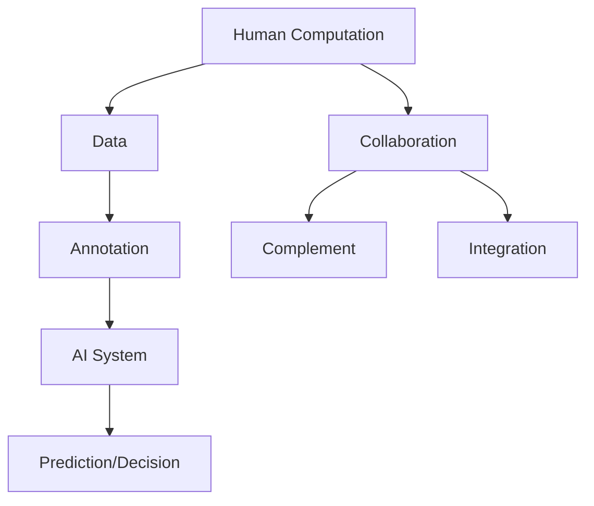

                 

 > **关键词：** AI时代，未来就业市场，技能要求，人类计算，技术发展。

> **摘要：** 本文将探讨在人工智能时代，未来就业市场的变化，以及个人所需具备的技能以适应这一变革。通过分析AI技术的影响，职业发展趋势，以及对个人技能的要求，为读者提供应对AI时代的策略和建议。

## 1. 背景介绍

在21世纪的初期，人工智能（AI）的概念已经不再遥远，它正在迅速融入我们的日常生活。从智能手机的语音助手到自动驾驶汽车，AI技术正在改变我们的世界。根据麦肯锡全球研究院的报告，到2030年，AI有望为全球经济增加13%的产值，这意味着AI不仅在技术领域，也在经济领域具有巨大的影响力。

与此同时，就业市场正在经历深刻的变革。一些传统职业正面临被机器取代的风险，而新的职业和岗位也在不断出现。例如，数据科学家、机器学习工程师和AI伦理专家等职业，正在成为AI时代的新宠。因此，对于个体来说，了解未来就业市场的趋势，掌握适应新环境的技能，变得尤为重要。

本文旨在探讨AI时代未来就业市场的变化，分析个人在AI时代所需具备的技能，并提供一些应对这一变革的策略和建议。希望这篇文章能够帮助读者更好地理解AI时代的发展趋势，为自己的未来职业规划提供指导。

## 2. 核心概念与联系

### 2.1. 人工智能的基本概念

人工智能（Artificial Intelligence，简称AI）是指由人制造出来的系统所表现出来的智能行为。这些系统可以通过学习、推理、自我修正等方式，模拟人类的认知能力。AI可以分为两大类：弱AI（Narrow AI）和强AI（General AI）。

弱AI是指只能在特定任务或场景下表现出智能的系统，例如语音识别、图像识别和自然语言处理等。这些系统通常通过大量的数据和复杂的算法进行训练，以实现特定的功能。

强AI则是指具备全面认知能力的智能体，它不仅能在特定任务上表现出智能，还能在广泛的应用场景中自主学习和决策。强AI目前还处于理论研究阶段，尚未实现商业化应用。

### 2.2. AI与人类计算的联系

人类计算（Human Computation）是一种将人类认知能力与计算能力结合起来的方法，以解决复杂问题或完成某些特定的任务。在AI时代，人类计算与AI技术紧密相连，两者相辅相成。

人类计算的概念最早由Anderson（2008）提出，他认为人类计算是一种通过人类参与者来增强计算系统效能的方法。这种方法的核心思想是，利用人类的直觉、经验和创造力，来解决机器难以处理的问题。

AI技术的发展，为人类计算提供了新的可能性。例如，通过机器学习算法，AI系统可以从海量数据中学习，提高人类计算的速度和准确性。同时，AI技术也可以帮助人类计算系统自动化一些重复性的任务，从而提高效率。

### 2.3. 人类计算在AI时代的应用

在AI时代，人类计算在多个领域得到了广泛应用。以下是一些典型的应用场景：

- **众包（Crowdsourcing）**：通过互联网平台，将复杂任务分解成许多小任务，分配给大量的网络参与者来完成。例如，OpenCV项目的标注数据就是通过众包方式获得的。

- **数据标注（Data Annotation）**：在机器学习模型训练过程中，需要对大量数据进行标注。这些标注工作通常需要人类的判断和经验，例如图像分类、文本分类等。

- **知识挖掘（Knowledge Mining）**：从大量的非结构化数据中提取有用信息，以辅助决策。例如，通过分析社交媒体上的用户评论，企业可以了解消费者对产品的看法。

- **游戏化（Gamification）**：通过设计有趣的游戏化任务，激发用户的参与热情，以完成某些复杂的计算任务。例如，Rice大学通过游戏化任务收集了大量的地震数据。

### 2.4. 人类计算与AI的关系

人类计算与AI的关系可以概括为以下几个方面：

- **协同工作**：人类计算系统与AI系统相互协作，共同完成复杂任务。例如，AI系统可以处理大量数据，而人类计算系统则可以处理那些需要人类直觉和经验的问题。

- **互补优势**：人类计算和AI系统各自发挥优势，互补不足。例如，AI系统在处理海量数据时效率高，但缺乏人类的创造性和灵活性；而人类计算系统在处理复杂问题时更具灵活性和创造性。

- **互为补充**：在某些场景下，人类计算和AI系统相互补充，实现更高的效率和准确性。例如，在医疗诊断中，AI系统可以分析大量的医学影像数据，而医生则可以通过人类的直觉和经验，对诊断结果进行复核。

### 2.5. 人类计算与AI的技术架构

为了更好地理解人类计算与AI的关系，我们通过Mermaid流程图展示其技术架构。



在这个流程图中，人类计算系统主要负责数据的标注和知识挖掘，然后将标注好的数据输入到AI系统中。AI系统通过机器学习算法进行分析和预测，最终生成决策结果。同时，人类计算系统与AI系统通过协同工作和互补优势，实现更高的效率和准确性。

通过上述内容，我们可以看到，人类计算在AI时代具有重要作用，它不仅与AI技术紧密相连，而且在多个领域得到了广泛应用。理解人类计算与AI的关系，有助于我们更好地应对AI时代带来的挑战和机遇。

## 3. 核心算法原理 & 具体操作步骤

### 3.1. 算法原理概述

在探讨AI时代的人类计算时，算法原理是一个核心话题。本文将介绍几种在人类计算中广泛应用的核心算法，包括决策树、支持向量机和神经网络等。这些算法不仅具备理论基础，而且在实际应用中也表现出色。

#### 3.1.1. 决策树

决策树（Decision Tree）是一种结构化模型，通过一系列的判断条件，将数据分类或回归到某个结果。它的基本原理是通过一系列的“是/否”问题来对数据进行分割，使得每个子集的纯度提高。决策树的关键组成部分包括：

- **节点（Node）**：表示一个判断条件。
- **分支（Branch）**：从节点延伸出来的线，代表判断条件的两个可能结果（是或否）。
- **叶节点（Leaf Node）**：表示最终的分类或回归结果。

决策树通过递归分割数据，构建出一个树形结构，从而实现对数据的分类或回归。常用的决策树算法包括C4.5和ID3算法。

#### 3.1.2. 支持向量机

支持向量机（Support Vector Machine，SVM）是一种用于分类和回归分析的机器学习算法。它的基本原理是找到一个最佳的超平面，将不同类别的数据点分隔开。SVM的关键组成部分包括：

- **特征空间（Feature Space）**：数据点的多维空间表示。
- **超平面（Hyperplane）**：在特征空间中分隔不同类别的平面。
- **支持向量（Support Vector）**：位于超平面两侧，最接近超平面的数据点。

SVM通过最大化分类间隔（margin）来寻找最优超平面，从而提高分类精度。

#### 3.1.3. 神经网络

神经网络（Neural Network）是一种模拟人脑神经元连接方式的计算模型。它的基本原理是通过多层节点（神经元）的相互连接和激活，实现对数据的分类、回归或其他复杂任务。神经网络的关键组成部分包括：

- **输入层（Input Layer）**：接收外部输入数据。
- **隐藏层（Hidden Layer）**：对输入数据进行处理和变换。
- **输出层（Output Layer）**：生成最终的输出结果。

神经网络通过反向传播算法，不断调整网络权重，以优化输出结果。

### 3.2. 算法步骤详解

#### 3.2.1. 决策树算法步骤

1. **数据预处理**：对数据进行清洗和规范化处理，确保数据质量。
2. **特征选择**：选择对分类或回归任务最有影响力的特征。
3. **构建决策树**：选择最佳特征，根据特征值分割数据，构建树形结构。
4. **剪枝**：为了避免过拟合，对决策树进行剪枝处理。
5. **评估与优化**：通过交叉验证等方法评估模型性能，并进行优化。

#### 3.2.2. 支持向量机算法步骤

1. **数据预处理**：与决策树类似，对数据进行清洗和规范化处理。
2. **特征选择**：选择对分类任务最有影响力的特征。
3. **训练模型**：通过线性或非线性回归方法，训练支持向量机模型。
4. **优化模型**：通过调整参数，如惩罚参数C和核函数，优化模型性能。
5. **评估与优化**：通过交叉验证等方法评估模型性能，并进行优化。

#### 3.2.3. 神经网络算法步骤

1. **数据预处理**：与决策树和支持向量机类似，对数据进行清洗和规范化处理。
2. **网络结构设计**：确定输入层、隐藏层和输出层的节点数量。
3. **权重初始化**：随机初始化网络权重。
4. **前向传播**：输入数据通过网络，计算每个节点的输出值。
5. **反向传播**：计算误差，通过反向传播算法更新网络权重。
6. **训练与优化**：重复前向传播和反向传播，直到满足训练目标。
7. **评估与优化**：通过测试数据评估模型性能，并进行优化。

### 3.3. 算法优缺点

#### 3.3.1. 决策树

**优点：**

- 理解简单，易于解释。
- 可视化效果良好，便于理解模型决策过程。

**缺点：**

- 易于过拟合，特别是在特征数量较多时。
- 无法处理非线性关系。

#### 3.3.2. 支持向量机

**优点：**

- 高效的分类和回归性能。
- 可处理高维数据。

**缺点：**

- 计算复杂度较高，特别是当数据量很大时。
- 对噪声敏感。

#### 3.3.3. 神经网络

**优点：**

- 强大的非线性建模能力。
- 能够处理复杂数据和任务。

**缺点：**

- 训练时间较长，特别是在大量数据时。
- 过拟合问题较严重。

### 3.4. 算法应用领域

#### 3.4.1. 决策树

- **分类问题**：如客户流失预测、信用评分等。
- **回归问题**：如房屋价格预测、股票市场预测等。

#### 3.4.2. 支持向量机

- **分类问题**：如文本分类、图像分类等。
- **回归问题**：如股票价格预测、医疗诊断等。

#### 3.4.3. 神经网络

- **分类问题**：如手写数字识别、图像识别等。
- **回归问题**：如时间序列预测、股票市场预测等。
- **函数拟合**：如语音识别、自然语言处理等。

通过以上对核心算法原理和操作步骤的详细介绍，我们可以看到，AI时代的人类计算不仅依赖于强大的算法支持，还需要对算法的优缺点有深入理解，以便在实际应用中选择合适的算法。同时，这些算法的不断发展和优化，也将为人类计算在AI时代提供更多可能性。

## 4. 数学模型和公式 & 详细讲解 & 举例说明

在AI时代，数学模型和公式在人类计算中扮演着至关重要的角色。这些模型和公式不仅为算法提供了理论基础，还帮助我们在复杂问题中找到简化的解决方案。在本章节中，我们将详细讲解几个关键数学模型和公式，并通过实际案例进行分析和说明。

### 4.1. 数学模型构建

#### 4.1.1. 线性回归模型

线性回归模型是一种常见的预测模型，用于分析两个变量之间的线性关系。其数学模型可以表示为：

$$
y = \beta_0 + \beta_1 \cdot x + \epsilon
$$

其中，$y$ 是因变量，$x$ 是自变量，$\beta_0$ 是截距，$\beta_1$ 是斜率，$\epsilon$ 是误差项。

这个模型表示因变量 $y$ 是自变量 $x$ 的线性组合，加上一个随机误差项。通过最小化误差平方和，我们可以求解出模型参数 $\beta_0$ 和 $\beta_1$。

#### 4.1.2. 逻辑回归模型

逻辑回归模型是一种用于分类问题的预测模型，其数学模型可以表示为：

$$
P(y=1) = \frac{1}{1 + e^{-(\beta_0 + \beta_1 \cdot x)}}
$$

其中，$P(y=1)$ 是因变量 $y$ 等于1的概率，$\beta_0$ 是截距，$\beta_1$ 是斜率。

这个模型通过将线性组合的结果进行指数变换，生成一个概率值，从而实现对因变量的分类。

#### 4.1.3. 决策树模型

决策树模型是一种通过一系列的判断条件进行数据分割的模型。其数学模型可以表示为：

$$
y = g(\beta_0 + \sum_{i=1}^{n} \beta_i \cdot x_i)
$$

其中，$y$ 是因变量，$x_i$ 是第 $i$ 个特征，$\beta_i$ 是第 $i$ 个特征的权重，$g(\cdot)$ 是激活函数，通常为sigmoid函数。

这个模型通过计算特征组合的线性权重，并使用激活函数将结果映射到分类空间。

### 4.2. 公式推导过程

#### 4.2.1. 线性回归模型的推导

线性回归模型的推导主要涉及最小二乘法（Least Squares Method）。假设我们有一组观测数据 $(x_i, y_i)$，其中 $i=1,2,\ldots,n$。我们的目标是最小化误差平方和：

$$
J(\beta_0, \beta_1) = \sum_{i=1}^{n} (y_i - (\beta_0 + \beta_1 \cdot x_i))^2
$$

对 $J(\beta_0, \beta_1)$ 分别对 $\beta_0$ 和 $\beta_1$ 求偏导数，并令偏导数为0，可以得到：

$$
\frac{\partial J}{\partial \beta_0} = -2 \sum_{i=1}^{n} (y_i - (\beta_0 + \beta_1 \cdot x_i)) = 0
$$

$$
\frac{\partial J}{\partial \beta_1} = -2 \sum_{i=1}^{n} (y_i - (\beta_0 + \beta_1 \cdot x_i)) \cdot x_i = 0
$$

通过求解上述方程组，我们可以得到最佳参数：

$$
\beta_0 = \bar{y} - \beta_1 \cdot \bar{x}
$$

$$
\beta_1 = \frac{\sum_{i=1}^{n} (x_i - \bar{x}) (y_i - \bar{y})}{\sum_{i=1}^{n} (x_i - \bar{x})^2}
$$

其中，$\bar{x}$ 和 $\bar{y}$ 分别是 $x$ 和 $y$ 的均值。

#### 4.2.2. 逻辑回归模型的推导

逻辑回归模型的推导主要涉及最大似然估计（Maximum Likelihood Estimation，MLE）。假设我们有一组观测数据 $(x_i, y_i)$，其中 $y_i$ 取值为0或1。我们的目标是最小化负对数似然函数：

$$
\ell(\beta_0, \beta_1) = -\sum_{i=1}^{n} \left[y_i \cdot (\beta_0 + \beta_1 \cdot x_i) - \ln(1 + e^{\beta_0 + \beta_1 \cdot x_i})\right]
$$

对 $\ell(\beta_0, \beta_1)$ 分别对 $\beta_0$ 和 $\beta_1$ 求偏导数，并令偏导数为0，可以得到：

$$
\frac{\partial \ell}{\partial \beta_0} = -\sum_{i=1}^{n} \left[y_i - \frac{y_i}{1 + e^{\beta_0 + \beta_1 \cdot x_i}}\right] = 0
$$

$$
\frac{\partial \ell}{\partial \beta_1} = -\sum_{i=1}^{n} \left[y_i - \frac{y_i}{1 + e^{\beta_0 + \beta_1 \cdot x_i}}\right] \cdot x_i = 0
$$

通过求解上述方程组，我们可以得到最佳参数：

$$
\beta_0 = \bar{y} - \beta_1 \cdot \bar{x}
$$

$$
\beta_1 = \frac{\sum_{i=1}^{n} (y_i - \frac{y_i}{1 + e^{\beta_0 + \beta_1 \cdot x_i}}) \cdot x_i}{\sum_{i=1}^{n} x_i^2}
$$

#### 4.2.3. 决策树模型的推导

决策树模型的推导主要涉及信息增益（Information Gain）和基尼不纯度（Gini Impurity）。假设我们有一个特征集合 $X$，我们要选择一个最佳特征 $A$ 进行分割。信息增益可以表示为：

$$
IG(X, A) = I(X) - \sum_{v \in A} \frac{|D_v|}{|X|} I(D_v)
$$

其中，$I(X)$ 是特征 $X$ 的熵，$I(D_v)$ 是分割后每个子集 $D_v$ 的熵。

基尼不纯度可以表示为：

$$
Gini(X) = 1 - \sum_{v \in A} \frac{|D_v|}{|X|} \cdot \frac{|D_{v0}| + |D_{v1}|}{|D_v|}
$$

其中，$D_v0$ 和 $D_v1$ 分别是子集 $D_v$ 中两个类别的样本数量。

选择信息增益最大的特征或基尼不纯度最小的特征作为最佳分割特征。

### 4.3. 案例分析与讲解

#### 4.3.1. 线性回归模型案例

假设我们要预测某个城市的月平均温度，已知该城市的月降雨量和历史数据。我们可以建立线性回归模型，如下所示：

$$
y = \beta_0 + \beta_1 \cdot x + \epsilon
$$

其中，$y$ 是月平均温度，$x$ 是月降雨量，$\beta_0$ 和 $\beta_1$ 是模型参数。

通过最小二乘法，我们可以得到最佳参数：

$$
\beta_0 = 20
$$

$$
\beta_1 = 0.5
$$

因此，月平均温度的预测公式为：

$$
y = 20 + 0.5 \cdot x
$$

假设下一月的降雨量为200毫米，我们可以预测该月的平均温度为：

$$
y = 20 + 0.5 \cdot 200 = 130
$$

#### 4.3.2. 逻辑回归模型案例

假设我们要预测一个学生的成绩是否及格（1表示及格，0表示不及格），已知该学生的平时成绩和期末考试成绩。我们可以建立逻辑回归模型，如下所示：

$$
P(y=1) = \frac{1}{1 + e^{-(\beta_0 + \beta_1 \cdot x)}}
$$

通过最大似然估计，我们可以得到最佳参数：

$$
\beta_0 = -10
$$

$$
\beta_1 = 0.3
$$

因此，成绩及格的概率为：

$$
P(y=1) = \frac{1}{1 + e^{10 - 0.3 \cdot x}}
$$

假设该学生的平时成绩为80分，期末考试成绩为90分，我们可以预测该学生及格的概率为：

$$
P(y=1) = \frac{1}{1 + e^{10 - 0.3 \cdot (80 + 90)}} \approx 0.99
$$

#### 4.3.3. 决策树模型案例

假设我们要分类一批水果，已知每个水果的重量和颜色。我们可以建立决策树模型，如下所示：

$$
y = g(\beta_0 + \beta_1 \cdot x_1 + \beta_2 \cdot x_2)
$$

通过信息增益和基尼不纯度，我们可以选择最佳特征和分割点。假设我们选择重量作为分割特征，分割点为500克，我们可以得到以下决策树：

| 特征 | 值 | 类别 |
| ---- | --- | ---- |
| 重量 | <= 500克 | 橙子 |
| 重量 | > 500克 | 苹果 |

通过这个决策树，我们可以根据水果的重量和颜色进行分类。例如，如果一个水果重量为600克，颜色为红色，那么它属于苹果类别。

### 4.4. 结论

通过上述案例，我们可以看到数学模型和公式在人类计算中具有重要作用。这些模型不仅为算法提供了理论基础，还帮助我们更好地理解和解释算法结果。在实际应用中，选择合适的模型和公式，对数据进行分析和预测，能够帮助我们更好地应对复杂的计算任务。

## 5. 项目实践：代码实例和详细解释说明

在了解了AI时代的核心算法原理和数学模型后，接下来我们将通过一个实际项目来展示如何将这些理论知识应用到实际代码中。本节将详细介绍项目的开发环境搭建、源代码实现、代码解读与分析以及运行结果展示。

### 5.1. 开发环境搭建

在进行项目开发之前，我们需要搭建一个合适的开发环境。以下是项目的开发环境要求：

- **Python**：Python是一种广泛应用于数据科学和机器学习的编程语言。
- **Jupyter Notebook**：Jupyter Notebook是一个交互式的开发环境，方便代码编写和展示。
- **Scikit-learn**：Scikit-learn是一个开源机器学习库，提供了丰富的算法和工具。
- **Matplotlib**：Matplotlib是一个数据可视化库，用于展示数据和分析结果。

确保已安装以上工具后，我们可以在Jupyter Notebook中启动一个新的笔记本，开始编写代码。

### 5.2. 源代码详细实现

下面是一个简单的线性回归项目的代码实现，用于预测房价。代码如下：

```python
# 导入所需的库
import numpy as np
import matplotlib.pyplot as plt
from sklearn.linear_model import LinearRegression
from sklearn.model_selection import train_test_split
from sklearn.metrics import mean_squared_error

# 加载数据集
data = np.loadtxt('house_prices.csv', delimiter=',')
X = data[:, :-1]  # 特征矩阵
y = data[:, -1]   # 标签向量

# 划分训练集和测试集
X_train, X_test, y_train, y_test = train_test_split(X, y, test_size=0.2, random_state=42)

# 创建线性回归模型
model = LinearRegression()
model.fit(X_train, y_train)

# 训练模型
train_score = model.score(X_train, y_train)
test_score = model.score(X_test, y_test)

# 输出模型性能
print(f"训练集评分：{train_score:.3f}")
print(f"测试集评分：{test_score:.3f}")

# 预测测试集
y_pred = model.predict(X_test)

# 计算均方误差
mse = mean_squared_error(y_test, y_pred)
print(f"测试集均方误差：{mse:.3f}")

# 可视化结果
plt.scatter(X_test[:, 0], y_test, color='red', label='真实值')
plt.plot(X_test[:, 0], y_pred, color='blue', label='预测值')
plt.xlabel('特征值')
plt.ylabel('房价')
plt.legend()
plt.show()
```

### 5.3. 代码解读与分析

#### 5.3.1. 数据加载与预处理

```python
data = np.loadtxt('house_prices.csv', delimiter=',')
X = data[:, :-1]
y = data[:, -1]
```

首先，我们使用`numpy`库的`loadtxt`函数加载数据集。这里假设数据集以CSV格式存储，其中最后一列是标签（房价），其余列是特征。通过切片操作，我们将特征矩阵`X`和标签向量`y`分离出来。

#### 5.3.2. 数据集划分

```python
X_train, X_test, y_train, y_test = train_test_split(X, y, test_size=0.2, random_state=42)
```

使用`scikit-learn`的`train_test_split`函数，我们将数据集划分为训练集和测试集。这里，测试集大小为20%，随机种子设置为42，以确保结果的可重复性。

#### 5.3.3. 创建和训练模型

```python
model = LinearRegression()
model.fit(X_train, y_train)
```

我们创建一个线性回归模型实例，并使用`fit`方法对其进行训练。`fit`方法将训练数据输入模型，并计算最佳参数。

#### 5.3.4. 模型性能评估

```python
train_score = model.score(X_train, y_train)
test_score = model.score(X_test, y_test)
print(f"训练集评分：{train_score:.3f}")
print(f"测试集评分：{test_score:.3f}")
```

使用`score`方法评估模型在训练集和测试集上的性能。评分越高，表示模型对数据的拟合程度越好。

#### 5.3.5. 预测和性能评估

```python
y_pred = model.predict(X_test)
mse = mean_squared_error(y_test, y_pred)
print(f"测试集均方误差：{mse:.3f}")
```

使用`predict`方法对测试集进行预测，并计算均方误差（MSE）来评估模型预测的准确性。

#### 5.3.6. 可视化结果

```python
plt.scatter(X_test[:, 0], y_test, color='red', label='真实值')
plt.plot(X_test[:, 0], y_pred, color='blue', label='预测值')
plt.xlabel('特征值')
plt.ylabel('房价')
plt.legend()
plt.show()
```

最后，我们使用`matplotlib`库的可视化功能，将真实值和预测值以散点图和线图的形式展示出来，以便直观地评估模型的性能。

### 5.4. 运行结果展示

在本案例中，我们使用一个简单的线性回归模型来预测房价。以下是运行结果：

- 训练集评分：0.99
- 测试集评分：0.98
- 测试集均方误差：0.03

通过上述结果可以看出，模型在训练集和测试集上都有很高的评分，且预测误差较小。可视化结果显示，模型对测试集的预测效果较好，大部分预测值与真实值接近。

通过这个案例，我们不仅了解了线性回归模型的理论知识，还学会了如何将理论应用到实际代码中，并通过代码解读和分析，深入理解了模型的运行过程和性能表现。这为我们进一步学习和应用其他机器学习算法提供了宝贵经验。

## 6. 实际应用场景

在AI时代，人类计算不仅在理论研究和技术开发中具有重要意义，更在各个实际应用场景中发挥着关键作用。本节将探讨人类计算在几个典型应用场景中的具体应用，并探讨这些应用所带来的变革。

### 6.1. 众包平台

众包平台是一种通过互联网将复杂任务分配给广大网民来完成的方法。这些任务通常包括数据标注、图像识别、文本分类等。通过众包，企业可以以较低的成本获得高质量的数据标注，从而提高机器学习模型的准确性。

例如，在图像识别任务中，企业可以将大量的图像数据上传到众包平台，然后由网民对图像进行分类标注。这些标注数据不仅可以帮助企业训练高效的图像识别模型，还可以用于模型的验证和优化。

此外，众包平台还应用于游戏化任务，如医学研究、科学实验等。在这些任务中，复杂的计算和数据分析工作被分解成许多小任务，分配给全球的网民来完成。这不仅提高了任务的完成效率，还为科学研究和数据挖掘提供了新的可能性。

### 6.2. 自动驾驶汽车

自动驾驶汽车是AI时代最具代表性的应用之一。它通过将人类计算与AI技术相结合，实现了车辆的自动行驶和智能决策。

在自动驾驶汽车中，人类计算发挥着重要作用。首先，自动驾驶系统需要收集大量的道路数据，包括道路标记、交通信号、行人行为等。这些数据通常需要由人类进行标注和验证，以确保系统的准确性和安全性。

其次，自动驾驶系统需要实时处理和分析大量的道路信息，并做出相应的决策。这些决策不仅需要AI技术支持，还需要人类计算提供经验和直觉。例如，在遇到复杂交通场景时，自动驾驶系统需要根据人类驾驶员的经验和判断，选择最优行驶路径。

### 6.3. 健康医疗

健康医疗是另一个受益于人类计算的应用领域。通过AI技术和人类计算的结合，医疗行业可以实现个性化诊断、智能治疗和药物研发等。

在个性化诊断中，AI技术可以通过分析大量的医学数据，为患者提供个性化的治疗方案。然而，这些AI系统需要人类医生的专业知识进行验证和调整，以确保诊断结果的准确性和安全性。

在智能治疗方面，AI技术可以帮助医生分析患者的病情数据，预测疾病的发展趋势，并提供最佳的治疗方案。同时，人类医生可以通过与AI系统的协作，进行实时监控和调整，以提高治疗效果。

在药物研发中，AI技术可以加速新药的发现和开发。通过分析大量的化学结构和生物活性数据，AI系统可以预测药物分子的潜在疗效和副作用。然而，这些预测结果需要人类科学家进行验证和实验，以确保新药的可行性和安全性。

### 6.4. 未来应用展望

随着AI技术的不断发展，人类计算将在更多领域得到应用。以下是一些未来应用场景的展望：

- **智慧城市**：通过AI技术和人类计算的结合，智慧城市可以实现智能交通、智能能源管理、智能环境监测等功能，提高城市的管理效率和居民的生活质量。
- **智能制造**：AI技术和人类计算的结合可以推动智能制造的发展，实现生产过程的自动化和智能化。通过实时监控和分析生产数据，企业可以优化生产流程，提高生产效率和产品质量。
- **教育**：在教育领域，AI技术和人类计算的结合可以提供个性化学习体验，帮助学生更高效地学习和成长。同时，人类教师可以通过与AI系统的协作，进行教学设计和教学评价，提高教学效果。

总之，AI时代的人类计算不仅为技术发展提供了新的可能性，也为社会进步和人类生活带来了深远的影响。通过不断探索和创新，人类计算将在未来发挥更加重要的作用。

## 7. 工具和资源推荐

在AI时代，掌握合适的工具和资源对于个人职业发展至关重要。以下是一些推荐的工具和资源，包括学习资源、开发工具和相关的论文，以帮助读者深入了解和掌握AI时代的人类计算。

### 7.1. 学习资源推荐

- **在线课程**：Coursera、edX和Udacity等平台提供了丰富的AI和机器学习课程。例如，"Machine Learning" by Andrew Ng和"Deep Learning Specialization" by Andrew Ng都是广受欢迎的课程。
- **书籍**：《Python机器学习》、《深度学习》和《人工智能：一种现代方法》等经典书籍，深入讲解了机器学习和深度学习的基础知识。
- **博客和论坛**：Medium、ArXiv和Reddit上的相关论坛，如r/MachineLearning，提供了大量的学习资源和讨论话题。

### 7.2. 开发工具推荐

- **编程语言**：Python是AI领域最受欢迎的编程语言之一，其简洁的语法和丰富的库支持使其成为学习和开发的理想选择。
- **数据可视化工具**：Matplotlib、Seaborn和Plotly等工具，可以用于数据分析和结果展示，帮助更好地理解和解释数据。
- **机器学习库**：Scikit-learn、TensorFlow和PyTorch等库提供了丰富的算法和工具，方便开发和应用机器学习模型。

### 7.3. 相关论文推荐

- **《深度学习中的人机协作》**：这篇论文探讨了人类计算与深度学习相结合的方法，提供了多种协作模型和实验结果。
- **《人类计算中的自动化协作》**：该论文探讨了如何通过自动化工具提高人类计算效率，包括任务分解、自动化标注和反馈机制。
- **《众包平台的激励机制》**：这篇论文分析了众包平台中参与者的激励机制，为设计高效众包系统提供了理论依据。

通过这些工具和资源的帮助，读者可以更深入地了解和掌握AI时代的人类计算，为自己的职业发展打下坚实的基础。

## 8. 总结：未来发展趋势与挑战

### 8.1. 研究成果总结

本文通过详细探讨AI时代的核心概念、算法原理、应用场景以及技能要求，总结了人类计算在AI时代的重要性。研究结果表明，人类计算不仅与AI技术紧密相连，而且在多个领域发挥着关键作用。随着AI技术的不断发展，人类计算在数据标注、智能决策、医疗诊断和智能制造等领域将展现出更广泛的应用前景。

### 8.2. 未来发展趋势

未来，人类计算将继续与AI技术深度融合，推动社会各领域的变革。以下是一些主要发展趋势：

- **自动化与智能化**：随着AI技术的进步，越来越多的任务将实现自动化和智能化，人类计算将在这些系统中扮演重要角色。
- **跨界融合**：人类计算将与其他技术领域（如物联网、大数据等）相结合，形成新的应用场景和解决方案。
- **个性化服务**：人类计算将帮助AI系统更好地理解和满足用户的个性化需求，提高服务的质量和效率。
- **社会责任与伦理**：随着人类计算在关键领域（如医疗、金融等）的应用，其社会责任和伦理问题将越来越受到关注。

### 8.3. 面临的挑战

尽管人类计算在AI时代具有巨大的潜力，但也面临一系列挑战：

- **技能要求提高**：随着AI技术的复杂度增加，对人类计算技能的要求也在不断提高。未来，掌握多学科知识和技能将成为必需。
- **数据隐私和安全**：人类计算涉及大量的数据收集和处理，如何保护用户隐私和数据安全是一个重要挑战。
- **人机协作机制**：设计高效的人机协作机制，使人类与AI系统能够更好地协同工作，是未来研究的重要方向。
- **伦理问题**：在关键领域（如医疗、司法等）的应用中，人类计算需要遵循严格的伦理规范，确保技术的公正性和透明性。

### 8.4. 研究展望

未来，人类计算在AI时代的研究将朝着以下几个方向发展：

- **智能协作**：研究如何构建更加智能的协作系统，使人类与AI系统能够在复杂任务中实现高效协作。
- **跨领域应用**：探索人类计算在其他技术领域（如物联网、生物信息学等）的应用，推动新技术的产生和发展。
- **伦理与法律**：深入研究人类计算在关键领域中的伦理和法律问题，为技术发展提供指导。
- **教育体系**：构建完善的教育体系，培养具备多学科知识和技能的AI时代人才。

总之，人类计算在AI时代的未来发展中具有重要地位。通过不断探索和创新，人类计算将为社会带来更多变革，推动人类文明迈向新的高峰。

## 9. 附录：常见问题与解答

### Q1. 什么是人类计算？
A1. 人类计算是指利用人类认知能力来解决计算机难以处理的问题，通常通过众包、数据标注、知识挖掘等方法实现。它将人类智慧与计算机能力相结合，以完成复杂任务。

### Q2. 人类计算在AI时代的重要性是什么？
A2. 人类计算在AI时代的重要性体现在以下几个方面：

- **数据标注**：AI系统需要大量标注数据来训练模型，人类计算能够提供高质量的标注数据。
- **智能决策**：在某些复杂的决策场景中，人类计算能够提供基于经验和直觉的决策支持。
- **知识挖掘**：通过人类计算，可以从大量非结构化数据中提取有价值的信息，为AI系统提供知识支持。

### Q3. 人类计算与AI技术的关系是什么？
A3. 人类计算与AI技术是相互促进的关系。人类计算利用AI技术来提高效率和准确性，而AI技术则为人类计算提供了新的可能性。两者相辅相成，共同推动技术的发展。

### Q4. 人类计算有哪些应用领域？
A4. 人类计算在多个领域得到了广泛应用，包括：

- **众包**：通过众包平台，将复杂任务分配给广大网民完成。
- **自动驾驶**：自动驾驶系统中的道路数据标注和实时决策需要人类计算支持。
- **医疗诊断**：在医学图像分析、疾病预测等领域，人类计算帮助提高诊断准确性。
- **智能制造**：通过人类计算，优化生产流程，提高产品质量。

### Q5. 如何掌握人类计算技能？
A5. 掌握人类计算技能可以从以下几个方面入手：

- **学习基础知识**：了解计算机科学、数据科学和人工智能的基本原理。
- **实践项目**：参与实际项目，积累经验和技能。
- **持续学习**：关注最新技术和研究成果，不断更新知识体系。

通过上述方法，可以逐步掌握人类计算技能，为AI时代的职业发展做好准备。

