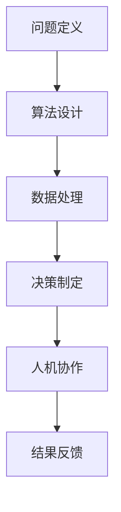

                 

关键词：人工智能、未来就业、技能发展、AI时代、计算、人机协作

> 摘要：随着人工智能技术的飞速发展，人类计算在未来的就业市场中将面临重大的变革。本文旨在探讨AI时代的未来就业趋势以及个体在新兴技术背景下所需发展的技能，为读者提供一窥未来世界的窗口。

## 1. 背景介绍

### 1.1 人工智能的崛起

人工智能（Artificial Intelligence, AI）作为计算机科学的一个分支，旨在使计算机模拟人类智能行为。自21世纪以来，得益于深度学习、神经网络、大数据等技术的迅猛发展，人工智能已经从实验室走向现实，逐渐渗透到各行各业。从自动驾驶汽车到智能家居，从医疗诊断到金融分析，AI的应用范围不断扩大，深刻改变了我们的生活方式。

### 1.2 AI时代的到来

AI时代的到来不仅仅是指技术的变革，更是对人类社会的全方位影响。在这个时代，计算能力不再是单纯的硬件竞赛，而是算法与数据的结合，是智能与决策的结合。人工智能不仅仅是一种工具，更是一种新的生产力和生活方式。

## 2. 核心概念与联系

### 2.1 人类计算的定义

人类计算是指人类在计算过程中的作用，包括但不限于问题定义、算法设计、数据处理、决策制定等。在AI时代，人类计算的意义更加凸显，因为机器可以执行大量的计算任务，但需要人类提供目标、理解和创造力。

### 2.2 人机协作

人机协作（Human-Machine Collaboration）是AI时代的一个重要概念。在这个概念中，人类和机器各自发挥优势，通过协同工作来实现更高的效率和更好的效果。人机协作不仅体现在任务执行层面，也体现在问题解决和决策制定层面。

### 2.3 Mermaid 流程图

## 3. 核心算法原理 & 具体操作步骤

### 3.1 算法原理概述

在AI时代，核心算法主要包括机器学习、深度学习、自然语言处理等。这些算法通过模拟人类的学习和思考过程，实现对数据的自动分析和决策。

### 3.2 算法步骤详解

1. **数据收集与预处理**：收集相关数据，并进行清洗、格式化等预处理操作。
2. **模型设计**：根据问题需求设计合适的算法模型，如神经网络、决策树等。
3. **模型训练**：使用预处理后的数据对模型进行训练，调整模型参数。
4. **模型评估**：评估模型性能，如准确率、召回率等。
5. **模型部署**：将训练好的模型部署到实际应用环境中。

### 3.3 算法优缺点

**优点**：高效、自动化、大规模数据处理能力。

**缺点**：对数据质量依赖较大，模型解释性较差。

### 3.4 算法应用领域

算法在图像识别、自然语言处理、金融分析等多个领域都有广泛应用。

## 4. 数学模型和公式 & 详细讲解 & 举例说明

### 4.1 数学模型构建

以深度学习中的神经网络为例，其基本数学模型为：

$$
y = f(W \cdot x + b)
$$

其中，$W$ 为权重矩阵，$x$ 为输入向量，$b$ 为偏置项，$f$ 为激活函数。

### 4.2 公式推导过程

神经网络的推导过程涉及微积分、线性代数等多个数学领域，具体推导过程如下：

$$
\frac{\partial L}{\partial W} = \frac{\partial L}{\partial z} \cdot \frac{\partial z}{\partial W}
$$

其中，$L$ 为损失函数，$z$ 为输出值。

### 4.3 案例分析与讲解

以图像识别任务为例，展示神经网络在具体应用中的工作流程。

## 5. 项目实践：代码实例和详细解释说明

### 5.1 开发环境搭建

搭建深度学习开发环境，包括安装Python、TensorFlow等工具。

### 5.2 源代码详细实现

展示一个简单的神经网络实现，包括数据预处理、模型设计、训练和评估等步骤。

### 5.3 代码解读与分析

对代码进行逐行解读，分析其实现原理和关键步骤。

### 5.4 运行结果展示

展示训练结果，包括损失函数、准确率等指标。

## 6. 实际应用场景

### 6.1 金融分析

AI在金融领域的应用，如股票预测、风险管理等。

### 6.2 医疗诊断

AI在医疗领域的应用，如疾病诊断、药物研发等。

### 6.3 未来应用展望

探讨AI在未来的潜在应用领域，如教育、娱乐、智慧城市等。

## 7. 工具和资源推荐

### 7.1 学习资源推荐

推荐一些深度学习、人工智能的在线课程和书籍。

### 7.2 开发工具推荐

推荐一些常用的深度学习框架和工具。

### 7.3 相关论文推荐

推荐一些重要的深度学习和人工智能领域的论文。

## 8. 总结：未来发展趋势与挑战

### 8.1 研究成果总结

总结当前人工智能领域的研究成果和应用现状。

### 8.2 未来发展趋势

预测未来人工智能的发展趋势，如量子计算、生物计算等。

### 8.3 面临的挑战

分析人工智能在发展过程中面临的挑战，如伦理、法律等。

### 8.4 研究展望

展望人工智能未来的发展方向和研究热点。

## 9. 附录：常见问题与解答

解答读者可能提出的问题。

---

作者：禅与计算机程序设计艺术 / Zen and the Art of Computer Programming
----------------------------------------------------------------

本文通过深入探讨AI时代的未来就业趋势与技能发展，为读者提供了一次关于AI时代的新思考。随着技术的不断进步，人类计算将在未来的社会发展中扮演越来越重要的角色。面对这一变革，我们不仅需要关注技术的发展，更需要关注自身技能的更新与提升。正如作者所言：“禅与计算机程序设计艺术”，在AI时代，我们应以禅的精神去追求计算机科学的真谛，不断创新，不断进步。

