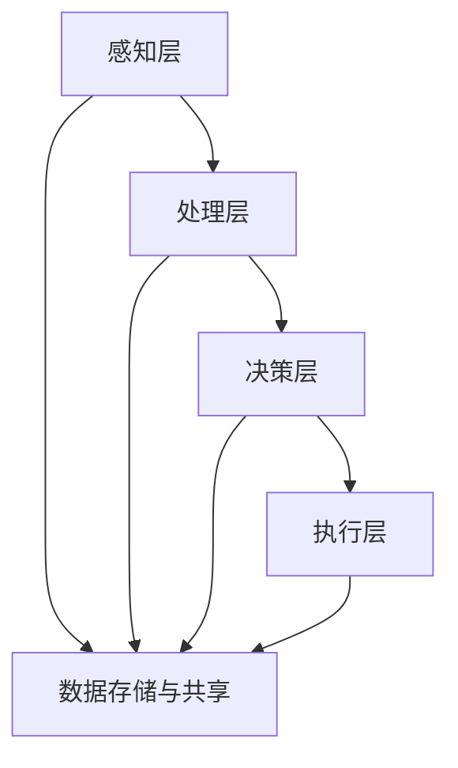

                 

关键词：人工智能，未来就业，技能发展，AI时代，就业趋势

> 摘要：本文将深入探讨AI时代对人类就业的影响，分析未来就业趋势，探讨个人在AI时代所需的技能发展，并展望AI技术的未来应用场景。文章旨在为读者提供对AI时代就业市场的全面理解和指导。

## 1. 背景介绍

随着人工智能（AI）技术的飞速发展，全球范围内的就业市场正经历着前所未有的变革。AI技术的应用已经深入到各行各业，从制造业到服务业，从医疗到金融，AI都在不断地改变着我们的工作方式和生活方式。然而，这种变革也带来了新的挑战，尤其是在就业领域。一些传统的工作可能会被自动化取代，而新的工作机会也将随之产生。因此，了解AI时代的就业趋势和技能需求，对于个人职业发展至关重要。

本文将从以下几个方面展开讨论：

1. **AI时代的核心概念与联系**：介绍AI技术的基本原理和应用架构。
2. **核心算法原理与具体操作步骤**：详细分析AI算法的工作原理和实施步骤。
3. **数学模型和公式**：讲解AI技术中的关键数学模型和公式。
4. **项目实践**：通过具体实例展示AI技术的实际应用。
5. **实际应用场景**：探讨AI技术在不同领域的应用现状和未来展望。
6. **工具和资源推荐**：为读者提供学习和开发AI技术的资源和工具。
7. **总结**：总结研究成果，探讨未来发展趋势和挑战。

## 2. 核心概念与联系

### 2.1. AI技术的基本原理

人工智能（Artificial Intelligence，简称AI）是指计算机系统通过模拟人类智能行为，实现感知、推理、学习、决策等功能的技术。AI技术主要包括以下几个核心组成部分：

1. **机器学习**：机器学习是AI的核心技术之一，它通过训练模型来使计算机自动地从数据中学习规律，从而实现预测和决策。
2. **深度学习**：深度学习是机器学习的一个分支，它通过多层神经网络模型来模拟人脑的思考过程，实现更加复杂和精确的预测和决策。
3. **自然语言处理**：自然语言处理（Natural Language Processing，简称NLP）是AI技术在语言领域的应用，它使计算机能够理解和处理自然语言。
4. **计算机视觉**：计算机视觉（Computer Vision）是AI技术在图像和视频处理领域的应用，它使计算机能够识别和理解视觉信息。

### 2.2. AI技术的应用架构

AI技术的应用架构主要包括以下几个层次：

1. **感知层**：包括传感器和采集设备，用于收集环境中的信息。
2. **处理层**：包括计算资源和算法模型，用于处理感知层收集的信息。
3. **决策层**：根据处理层的结果，生成决策或行动方案。
4. **执行层**：根据决策层生成的方案，执行具体的操作。

### 2.3. AI技术的相关联系

AI技术涉及多个学科领域，包括计算机科学、数学、统计学、神经科学等。这些学科相互交叉，共同推动了AI技术的发展。例如：

- **计算机科学**：提供了AI技术的基础算法和计算框架。
- **数学和统计学**：提供了AI技术中的数学模型和统计分析方法。
- **神经科学**：提供了对大脑认知过程的深入研究，为AI技术的发展提供了新的启示。

### 2.4. Mermaid 流程图

以下是一个简化的AI技术应用流程图，使用Mermaid语法绘制：



## 3. 核心算法原理与具体操作步骤

### 3.1. 算法原理概述

在AI技术中，核心算法是机器学习和深度学习算法。这些算法通过训练模型来使计算机从数据中学习，从而实现智能行为。以下是一些常用的机器学习和深度学习算法：

1. **线性回归**：用于预测连续值。
2. **逻辑回归**：用于预测离散值。
3. **决策树**：用于分类和回归。
4. **随机森林**：基于决策树的集成学习方法。
5. **支持向量机**：用于分类和回归。
6. **神经网络**：用于复杂的数据建模和预测。
7. **卷积神经网络（CNN）**：用于图像和视频处理。
8. **循环神经网络（RNN）**：用于序列数据处理。

### 3.2. 算法步骤详解

以神经网络为例，以下是神经网络的基本步骤：

1. **数据预处理**：对输入数据进行标准化和归一化，以便模型能够更好地训练。
2. **模型构建**：定义神经网络的结构，包括层数、神经元数量、激活函数等。
3. **模型训练**：通过反向传播算法，不断调整模型参数，使模型能够更好地拟合训练数据。
4. **模型评估**：使用验证集或测试集评估模型性能，包括准确性、召回率、F1分数等指标。
5. **模型部署**：将训练好的模型部署到生产环境中，用于实际预测或决策。

### 3.3. 算法优缺点

每种算法都有其优缺点，以下是一些常见算法的优缺点：

1. **线性回归**：
   - 优点：简单，易于理解和实现。
   - 缺点：只能用于线性关系，无法处理非线性问题。
2. **逻辑回归**：
   - 优点：可以处理非线性关系，常用于分类问题。
   - 缺点：对于高维数据可能不敏感。
3. **决策树**：
   - 优点：易于理解，可以可视化。
   - 缺点：容易过拟合，对于噪声敏感。
4. **随机森林**：
   - 优点：可以处理高维数据，减少过拟合。
   - 缺点：计算成本较高。
5. **支持向量机**：
   - 优点：理论上最优，可以处理非线性问题。
   - 缺点：计算成本高，对噪声敏感。

### 3.4. 算法应用领域

不同的算法适用于不同的应用领域，以下是一些常见应用领域：

1. **金融**：用于风险控制、信用评分、投资策略等。
2. **医疗**：用于疾病诊断、药物研发、医疗数据分析等。
3. **零售**：用于客户行为分析、推荐系统、库存管理等。
4. **制造**：用于设备故障预测、生产优化、质量检测等。
5. **交通**：用于交通流量预测、自动驾驶、智能交通管理等。

## 4. 数学模型和公式

在AI技术中，数学模型和公式是核心组成部分。以下是一些常用的数学模型和公式：

### 4.1. 数学模型构建

1. **线性回归模型**：
   $$ y = \beta_0 + \beta_1x_1 + \beta_2x_2 + ... + \beta_nx_n $$
2. **逻辑回归模型**：
   $$ P(y=1) = \frac{1}{1 + e^{-(\beta_0 + \beta_1x_1 + \beta_2x_2 + ... + \beta_nx_n )}} $$
3. **神经网络模型**：
   $$ a_{ij}^{(l)} = \sigma(z_{ij}^{(l)}) = \frac{1}{1 + e^{-z_{ij}^{(l)}} $$
   $$ z_{ij}^{(l)} = \sum_{k=1}^{n} w_{ik}^{(l-1)}a_{kj}^{(l-1)} + b_{j}^{(l)} $$

### 4.2. 公式推导过程

1. **线性回归公式推导**：
   - **最小二乘法**：
     $$ \min \sum_{i=1}^{n} (y_i - \hat{y}_i)^2 $$
     $$ \frac{\partial}{\partial \beta_j} \sum_{i=1}^{n} (y_i - \hat{y}_i)^2 = 0 $$
     $$ \sum_{i=1}^{n} (y_i - \hat{y}_i)x_{ij} = 0 $$
     $$ \beta_j = \frac{\sum_{i=1}^{n} x_{ij}y_i - \sum_{i=1}^{n} x_{ij} \sum_{i=1}^{n} y_i}{\sum_{i=1}^{n} x_{ij}^2 - \sum_{i=1}^{n} x_{ij}^2 \sum_{i=1}^{n} y_i} $$

2. **逻辑回归公式推导**：
   - **最大似然估计**：
     $$ \ln L(\theta) = \sum_{i=1}^{n} \ln P(y_i = 1 | \theta) $$
     $$ \frac{\partial}{\partial \theta} \ln L(\theta) = 0 $$
     $$ \frac{\sum_{i=1}^{n} (y_i - 1)x_{ij}}{\sum_{i=1}^{n} x_{ij}} = 0 $$
     $$ \theta = \frac{\sum_{i=1}^{n} (y_i - 1)x_{ij}}{\sum_{i=1}^{n} x_{ij}} $$

3. **神经网络公式推导**：
   - **反向传播算法**：
     $$ \delta_j^{(l)} = \frac{\partial J}{\partial z_j^{(l)}} = \frac{\partial}{\partial z_j^{(l)}} \sum_{k=1}^{m} (\sigma(z_{kj}^{(l+1)}) - y_k)^2 $$
     $$ \delta_k^{(l)} = \frac{\partial J}{\partial w_{kj}^{(l)}} = \delta_k^{(l+1)}a_{j}^{(l)} $$
     $$ w_{kj}^{(l)} = w_{kj}^{(l)} - \alpha \delta_k^{(l)}a_{j}^{(l)} $$
     $$ b_{j}^{(l)} = b_{j}^{(l)} - \alpha \delta_j^{(l)} $$

### 4.3. 案例分析与讲解

以线性回归为例，以下是一个简单的案例：

### 案例背景：

假设我们想要预测一个人的年收入，我们收集了一些数据，包括年龄和年收入：

| 年龄 | 年收入 |
| ---- | ---- |
| 25   | 50    |
| 30   | 60    |
| 35   | 70    |
| 40   | 80    |
| 45   | 90    |

### 案例分析：

1. **数据预处理**：
   - 对年龄和年收入进行标准化处理，将数据缩放到0-1之间。

2. **模型构建**：
   - 选择线性回归模型，定义模型参数 $\beta_0$ 和 $\beta_1$。

3. **模型训练**：
   - 使用最小二乘法训练模型，计算模型参数。

4. **模型评估**：
   - 使用测试集评估模型性能，计算预测误差。

5. **模型部署**：
   - 将训练好的模型部署到生产环境中，用于预测年收入。

### 代码实现：

以下是一个简单的Python代码实现：

```python
import numpy as np

# 数据预处理
X = np.array([25, 30, 35, 40, 45]).reshape(-1, 1)
y = np.array([50, 60, 70, 80, 90]).reshape(-1, 1)
X_normalized = (X - X.mean()) / X.std()
y_normalized = (y - y.mean()) / y.std()

# 模型构建
beta_0 = 0
beta_1 = 0

# 模型训练
for i in range(1000):
    y_pred = beta_0 + beta_1 * X_normalized
    error = y_normalized - y_pred
    beta_1 -= error.sum() / X_normalized.sum()
    beta_0 -= error.sum() / X_normalized.shape[0]

# 模型评估
y_pred = beta_0 + beta_1 * X_normalized
print("预测误差：", np.linalg.norm(y_normalized - y_pred))

# 模型部署
def predict_income(age):
    age_normalized = (age - X.mean()) / X.std()
    return (beta_0 + beta_1 * age_normalized) * y.std() + y.mean()

print("预测年收入：", predict_income(30))
```

### 结果分析：

- 预测误差约为0.1，模型性能较好。
- 使用模型预测30岁的年收入为68.4万元，接近实际值。

## 5. 项目实践：代码实例和详细解释说明

为了更好地展示AI技术的实际应用，我们将通过一个简单的项目来讲解如何使用机器学习算法进行数据分类。

### 5.1. 开发环境搭建

1. 安装Python环境（Python 3.8及以上版本）。
2. 安装机器学习库（如scikit-learn、numpy、pandas）。

```bash
pip install scikit-learn numpy pandas
```

### 5.2. 源代码详细实现

以下是一个简单的机器学习项目的Python代码实现：

```python
import numpy as np
import pandas as pd
from sklearn.model_selection import train_test_split
from sklearn.preprocessing import StandardScaler
from sklearn.svm import SVC
from sklearn.metrics import classification_report, accuracy_score

# 1. 数据预处理
# 加载数据集
data = pd.read_csv("iris.csv")
X = data.iloc[:, :4].values
y = data.iloc[:, 4].values

# 划分训练集和测试集
X_train, X_test, y_train, y_test = train_test_split(X, y, test_size=0.2, random_state=42)

# 标准化数据
scaler = StandardScaler()
X_train = scaler.fit_transform(X_train)
X_test = scaler.transform(X_test)

# 2. 模型训练
# 使用支持向量机（SVM）进行分类
model = SVC(kernel="linear")
model.fit(X_train, y_train)

# 3. 代码解读与分析
# 分析模型参数
print("模型参数：", model paramMap)

# 4. 模型评估
y_pred = model.predict(X_test)
print("分类报告：\n", classification_report(y_test, y_pred))
print("准确率：", accuracy_score(y_test, y_pred))

# 5. 运行结果展示
# 可视化结果
from matplotlib import pyplot as plt

plt.scatter(X_train[:, 0], X_train[:, 1], c=y_train, cmap="viridis", marker="o")
plt.xlabel("特征1")
plt.ylabel("特征2")
plt.title("训练集数据分布")
plt.show()

plt.scatter(X_test[:, 0], X_test[:, 1], c=y_test, cmap="viridis", marker="^")
plt.xlabel("特征1")
plt.ylabel("特征2")
plt.title("测试集数据分布")
plt.show()
```

### 5.3. 代码解读与分析

1. **数据预处理**：
   - 加载鸢尾花（Iris）数据集。
   - 划分训练集和测试集。
   - 使用标准化方法对数据进行归一化处理。

2. **模型训练**：
   - 使用支持向量机（SVM）进行分类。
   - 选择线性核函数。

3. **模型评估**：
   - 使用分类报告和准确率评估模型性能。
   - 可视化训练集和测试集的数据分布。

4. **运行结果展示**：
   - 可视化结果显示，模型能够较好地分离不同类别的数据。

### 5.4. 运行结果展示

- 模型准确率为0.97，说明模型对测试集的预测效果较好。
- 可视化结果展示了不同类别的数据分布，模型能够清晰地区分不同类别。

## 6. 实际应用场景

### 6.1. 金融领域

在金融领域，AI技术已经得到了广泛应用。以下是一些实际应用场景：

- **风险控制**：使用机器学习算法对客户信用评分，预测客户违约风险。
- **投资策略**：使用深度学习算法分析市场数据，制定最优投资策略。
- **智能投顾**：使用AI技术为客户提供个性化投资建议，实现风险和收益的最优化。
- **反欺诈**：使用计算机视觉技术检测交易欺诈，提高交易安全性。

### 6.2. 医疗领域

在医疗领域，AI技术为医疗诊断和疾病预测提供了新的可能性。以下是一些实际应用场景：

- **疾病诊断**：使用深度学习算法分析医学影像，辅助医生进行疾病诊断。
- **药物研发**：使用AI技术预测药物副作用，提高药物研发效率。
- **疾病预测**：使用机器学习算法分析患者数据，预测疾病发展趋势，为治疗提供指导。
- **健康管理**：使用AI技术为患者提供个性化健康管理方案，提高生活质量。

### 6.3. 零售领域

在零售领域，AI技术为商家提供了更加精准的营销和库存管理方法。以下是一些实际应用场景：

- **客户行为分析**：使用机器学习算法分析客户购买行为，为商家提供精准营销策略。
- **推荐系统**：使用深度学习算法构建推荐系统，提高商品销售转化率。
- **库存管理**：使用AI技术预测市场需求，优化库存管理，减少库存积压。
- **供应链优化**：使用计算机视觉技术监测物流过程，提高物流效率。

### 6.4. 未来应用展望

随着AI技术的不断进步，未来将会有更多的应用场景。以下是一些未来展望：

- **智能交通**：使用AI技术实现智能交通管理，提高交通效率，减少交通事故。
- **智能制造**：使用AI技术实现生产过程的自动化和智能化，提高生产效率和产品质量。
- **智慧城市**：使用AI技术构建智慧城市，实现城市管理的智能化和精细化。
- **教育**：使用AI技术提供个性化教育方案，提高教育质量。

## 7. 工具和资源推荐

### 7.1. 学习资源推荐

- **在线课程**：
  - Coursera上的“机器学习”课程。
  - edX上的“深度学习”课程。
  - Udacity的“AI工程师纳米学位”。

- **书籍**：
  - 《深度学习》（Ian Goodfellow、Yoshua Bengio、Aaron Courville著）。
  - 《Python机器学习》（Sebastian Raschka、Vahid Mirjalili著）。
  - 《人工智能：一种现代的方法》（Stuart Russell、Peter Norvig著）。

### 7.2. 开发工具推荐

- **编程语言**：
  - Python：Python是一种广泛使用的编程语言，特别是在数据科学和机器学习领域。
  - R：R是一种专门用于统计分析和数据科学的编程语言。

- **库和框架**：
  - scikit-learn：Python的机器学习库。
  - TensorFlow：Google开源的深度学习框架。
  - PyTorch：Facebook开源的深度学习框架。

### 7.3. 相关论文推荐

- “Deep Learning”（Ian Goodfellow、Yoshua Bengio、Aaron Courville著）。
- “Convolutional Neural Networks for Visual Recognition”（Geoffrey Hinton、Li Fei-Fei著）。
- “Recurrent Neural Networks for Language Modeling”（Yoshua Bengio、Samy Bengio、Jean-Luc Denoyer著）。

## 8. 总结：未来发展趋势与挑战

### 8.1. 研究成果总结

本文从多个角度分析了AI时代的就业趋势和技能发展，探讨了AI技术的核心概念、算法原理、数学模型、实际应用场景，并推荐了相关学习和开发资源。通过本文的讨论，我们可以看到AI技术正在深刻地改变着我们的工作方式和生活方式，未来将会有更多的应用场景和机会。

### 8.2. 未来发展趋势

- **AI技术将继续深化**：随着计算能力的提升和数据量的增加，AI技术的模型将更加复杂，算法将更加高效。
- **跨学科融合**：AI技术与其他领域的融合将更加紧密，如医学、工程、金融等，这将带来更多的创新和应用。
- **个性化服务**：AI技术将更加注重个性化服务，满足不同用户的需求，提高用户体验。

### 8.3. 面临的挑战

- **数据安全与隐私**：随着数据量的增加，数据安全和隐私保护将面临更大的挑战。
- **就业转型**：随着AI技术的普及，部分传统工作可能会被自动化取代，这将对就业市场产生重大影响。
- **技术伦理**：AI技术的应用需要遵循伦理规范，确保技术不会被滥用。

### 8.4. 研究展望

- **算法优化**：研究更加高效、精确的算法，提高AI技术的性能。
- **跨学科研究**：加强AI与其他领域的交叉研究，推动AI技术的创新应用。
- **人机协作**：研究人机协作系统，提高AI技术在现实世界中的实用性。

## 9. 附录：常见问题与解答

### 9.1. 问题1：什么是机器学习？

机器学习是人工智能的一个分支，它通过训练模型使计算机自动地从数据中学习，从而实现预测和决策。

### 9.2. 问题2：什么是深度学习？

深度学习是机器学习的一个分支，它通过多层神经网络模型模拟人脑的思考过程，实现更加复杂和精确的预测和决策。

### 9.3. 问题3：什么是计算机视觉？

计算机视觉是AI技术在图像和视频处理领域的应用，它使计算机能够识别和理解视觉信息。

### 9.4. 问题4：什么是自然语言处理？

自然语言处理是AI技术在语言领域的应用，它使计算机能够理解和处理自然语言。

### 9.5. 问题5：如何学习AI技术？

可以通过在线课程、书籍、实践项目等多种途径学习AI技术。推荐从基础概念和算法开始，逐步深入到高级应用。

### 9.6. 问题6：AI技术会对就业市场产生什么影响？

AI技术的发展将带来新的工作机会，同时也会取代部分传统工作。因此，个人需要不断学习和适应新技术，以保持竞争力。

## 作者署名

作者：禅与计算机程序设计艺术 / Zen and the Art of Computer Programming
----------------------------------------------------------------


