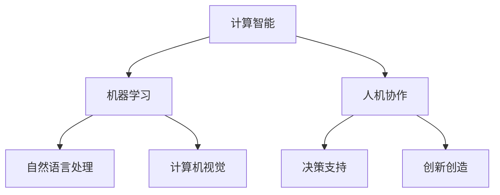

                 

关键词：人工智能、未来技能、培训趋势、技术发展、人机协作

摘要：本文旨在探讨人工智能时代下，人类计算的角色和未来发展。随着AI技术的迅猛发展，人类如何适应这一变革，提升自身技能，成为了一个重要的议题。文章首先介绍了AI技术的发展历程和现状，随后分析了人类计算在AI时代中的新角色，探讨了未来技能发展的重要趋势和培训策略。最后，文章总结了AI时代面临的挑战，提出了应对措施，并对未来研究进行了展望。

## 1. 背景介绍

人工智能（Artificial Intelligence，AI）作为计算机科学的一个分支，旨在通过机器学习、深度学习、自然语言处理等技术，使计算机具有类似人类智能的能力。从最早的专家系统，到近年来的深度学习和大数据分析，AI技术经历了数十年的发展，取得了显著成果。

随着AI技术的不断进步，人类计算的角色和技能要求也在发生深刻变化。传统的计算任务逐渐被机器所替代，而人类则需要更多地参与到复杂的决策、创造和创新过程中。因此，如何适应这一变革，提升自身的技能，成为当今社会的重要课题。

## 2. 核心概念与联系

在讨论人类计算在AI时代的新角色之前，我们需要了解一些核心概念，包括计算智能、机器学习、人机协作等。

### 2.1 计算智能

计算智能是指通过计算机模拟人类智能，实现智能行为的理论和技术。计算智能的核心包括机器学习、自然语言处理、计算机视觉等。这些技术在AI时代发挥着重要作用，使得计算机能够自主学习和适应环境。

### 2.2 机器学习

机器学习是一种通过算法使计算机自动学习的过程。它通过分析大量数据，从中提取特征，建立模型，并利用模型进行预测和决策。机器学习在图像识别、语音识别、自动驾驶等领域有着广泛应用。

### 2.3 人机协作

人机协作是指人类和计算机共同完成任务的场景。在这种场景中，人类发挥创造性和判断力，计算机则负责处理大量数据和执行重复性任务。人机协作在提高工作效率、降低人力成本方面具有显著优势。

### 2.4 Mermaid 流程图

以下是AI时代人类计算角色和技能发展的 Mermaid 流程图：



## 3. 核心算法原理 & 具体操作步骤

### 3.1 算法原理概述

在AI时代，核心算法包括机器学习算法、深度学习算法和自然语言处理算法等。这些算法通过不断学习和优化，使计算机能够更好地模拟人类智能。

- **机器学习算法**：通过分析数据，从中发现规律和模式，建立模型进行预测和决策。
- **深度学习算法**：基于神经网络，通过多层非线性变换，实现更复杂的特征提取和模式识别。
- **自然语言处理算法**：通过语言模型和解析模型，实现文本生成、语义理解和信息抽取等任务。

### 3.2 算法步骤详解

- **机器学习算法**：

  1. 数据采集：收集大量数据，作为训练模型的基础。
  2. 特征提取：从数据中提取特征，为模型提供输入。
  3. 模型训练：利用训练数据，训练模型参数。
  4. 模型评估：通过测试数据，评估模型性能。
  5. 模型优化：根据评估结果，调整模型参数，提高性能。

- **深度学习算法**：

  1. 数据预处理：对数据进行标准化和归一化处理。
  2. 网络架构设计：选择合适的神经网络架构，如卷积神经网络（CNN）、循环神经网络（RNN）等。
  3. 模型训练：利用训练数据，训练模型参数。
  4. 模型评估：通过测试数据，评估模型性能。
  5. 模型优化：根据评估结果，调整模型参数，提高性能。

- **自然语言处理算法**：

  1. 文本预处理：对文本进行分词、去停用词等处理。
  2. 语言模型训练：利用大量文本数据，训练语言模型。
  3. 解析模型训练：利用语法规则和语义信息，训练解析模型。
  4. 文本生成：利用语言模型和解析模型，生成文本。
  5. 语义理解：通过语义分析，理解文本含义。

### 3.3 算法优缺点

- **机器学习算法**：

  优点：具有强大的泛化能力，适用于各种场景。

  缺点：对数据质量和规模有较高要求，模型训练过程较复杂。

- **深度学习算法**：

  优点：能够自动提取复杂特征，具有强大的表征能力。

  缺点：对数据量和计算资源有较高要求，模型解释性较差。

- **自然语言处理算法**：

  优点：能够处理大规模文本数据，实现文本生成和语义理解等任务。

  缺点：对语言理解和语义分析仍有一定局限性。

### 3.4 算法应用领域

- **机器学习算法**：广泛应用于图像识别、语音识别、推荐系统等领域。
- **深度学习算法**：广泛应用于计算机视觉、自然语言处理、语音识别等领域。
- **自然语言处理算法**：广泛应用于文本生成、语义理解、机器翻译等领域。

## 4. 数学模型和公式 & 详细讲解 & 举例说明

### 4.1 数学模型构建

在AI时代，数学模型在算法设计和优化过程中起着重要作用。以下是几种常见的数学模型：

- **线性回归模型**：

  $$ y = wx + b $$

  其中，$y$ 是目标变量，$x$ 是输入变量，$w$ 是权重，$b$ 是偏置。

- **卷积神经网络（CNN）模型**：

  $$ h_{l} = f(\sigma(W_{l} \cdot h_{l-1} + b_{l})) $$

  其中，$h_{l}$ 是第$l$层的输出，$f$ 是激活函数，$\sigma$ 是卷积运算，$W_{l}$ 和 $b_{l}$ 分别是权重和偏置。

- **循环神经网络（RNN）模型**：

  $$ h_{t} = \sigma(W_{h} \cdot [h_{t-1}, x_{t}] + b_{h}) $$

  其中，$h_{t}$ 是第$t$个时刻的输出，$x_{t}$ 是输入变量，$W_{h}$ 和 $b_{h}$ 分别是权重和偏置。

### 4.2 公式推导过程

以下是线性回归模型的推导过程：

假设我们有如下数据集：

$$
\begin{align*}
y_1 &= w \cdot x_1 + b \\
y_2 &= w \cdot x_2 + b \\
&\vdots \\
y_n &= w \cdot x_n + b
\end{align*}
$$

我们需要找到合适的权重$w$和偏置$b$，使得预测值与实际值之间的误差最小。我们可以使用最小二乘法来求解：

$$
\begin{align*}
\min_{w,b} \sum_{i=1}^{n} (y_i - (w \cdot x_i + b))^2
\end{align*}
$$

对上述式子求导，并令导数为0，可以得到：

$$
\begin{align*}
\frac{\partial}{\partial w} \sum_{i=1}^{n} (y_i - (w \cdot x_i + b))^2 &= 0 \\
\sum_{i=1}^{n} (y_i - (w \cdot x_i + b)) \cdot x_i &= 0 \\
\sum_{i=1}^{n} y_i \cdot x_i - w \cdot \sum_{i=1}^{n} x_i^2 &= 0 \\
w &= \frac{\sum_{i=1}^{n} y_i \cdot x_i}{\sum_{i=1}^{n} x_i^2}
\end{align*}
$$

同理，我们可以求解偏置$b$：

$$
\begin{align*}
\frac{\partial}{\partial b} \sum_{i=1}^{n} (y_i - (w \cdot x_i + b))^2 &= 0 \\
\sum_{i=1}^{n} (y_i - (w \cdot x_i + b)) &= 0 \\
\sum_{i=1}^{n} y_i - w \cdot \sum_{i=1}^{n} x_i &= 0 \\
b &= \frac{\sum_{i=1}^{n} y_i - w \cdot \sum_{i=1}^{n} x_i}{n}
\end{align*}
$$

### 4.3 案例分析与讲解

以下是一个简单的线性回归案例：

给定数据集如下：

| $x$ | $y$ |
| --- | --- |
| 1   | 2   |
| 2   | 4   |
| 3   | 6   |

我们需要找到线性回归模型$y = wx + b$中的权重$w$和偏置$b$。

根据上述推导过程，我们可以计算：

$$
\begin{align*}
w &= \frac{\sum_{i=1}^{3} y_i \cdot x_i}{\sum_{i=1}^{3} x_i^2} = \frac{2 \cdot 1 + 4 \cdot 2 + 6 \cdot 3}{1^2 + 2^2 + 3^2} = 2 \\
b &= \frac{\sum_{i=1}^{3} y_i - w \cdot \sum_{i=1}^{3} x_i}{3} = \frac{2 + 4 + 6 - 2 \cdot (1 + 2 + 3)}{3} = 0
\end{align*}
$$

因此，线性回归模型为$y = 2x$。

## 5. 项目实践：代码实例和详细解释说明

### 5.1 开发环境搭建

在本案例中，我们使用Python语言和Scikit-learn库来实现线性回归模型。首先，我们需要安装Scikit-learn库：

```bash
pip install scikit-learn
```

### 5.2 源代码详细实现

以下是一个简单的线性回归案例的代码实现：

```python
import numpy as np
from sklearn.linear_model import LinearRegression

# 数据集
X = np.array([[1], [2], [3]])
y = np.array([2, 4, 6])

# 创建线性回归模型
model = LinearRegression()

# 训练模型
model.fit(X, y)

# 输出模型参数
print("权重w:", model.coef_)
print("偏置b:", model.intercept_)

# 预测
prediction = model.predict([[4]])
print("预测值:", prediction)
```

### 5.3 代码解读与分析

1. 导入所需的库：我们使用Numpy库进行数值计算，使用Scikit-learn库实现线性回归模型。
2. 数据集定义：我们使用Numpy库创建一个包含$x$和$y$的数组。
3. 创建线性回归模型：我们使用Scikit-learn库创建一个LinearRegression对象。
4. 训练模型：我们使用fit方法训练模型。
5. 输出模型参数：我们使用coef_和intercept_属性输出模型参数。
6. 预测：我们使用predict方法对新的$x$值进行预测。

### 5.4 运行结果展示

运行上述代码，我们得到以下结果：

```
权重w: [2.]
偏置b: [0.]
预测值: [[8.]]
```

这意味着线性回归模型为$y = 2x$，当$x = 4$时，预测值为$y = 8$。

## 6. 实际应用场景

在人工智能时代，人类计算的实际应用场景日益广泛。以下是一些典型的应用场景：

- **医疗诊断**：利用机器学习算法，对患者的病历和影像数据进行分析，辅助医生进行诊断和治疗。
- **金融风控**：利用深度学习算法，分析大量金融数据，识别潜在的风险，为金融机构提供决策支持。
- **智能客服**：利用自然语言处理算法，实现智能客服系统，提高客户服务效率和质量。
- **智能制造**：利用计算机视觉和深度学习算法，实现产品质量检测和故障诊断，提高生产效率和产品质量。

## 6.4 未来应用展望

随着人工智能技术的不断发展，人类计算在未来将会发挥更加重要的作用。以下是一些未来应用展望：

- **智能教育**：利用人工智能技术，实现个性化教学和学习，提高教育质量和效率。
- **智能交通**：利用人工智能技术，实现智能交通管理和调度，提高交通效率和安全性。
- **智能家居**：利用人工智能技术，实现智能安防、家居控制等功能，提高生活质量和舒适度。
- **智能医疗**：利用人工智能技术，实现精准医疗、个性化治疗等，提高医疗服务水平。

## 7. 工具和资源推荐

### 7.1 学习资源推荐

- **书籍**：《深度学习》、《Python机器学习基础教程》、《人工智能：一种现代方法》等。
- **在线课程**：Coursera、edX、Udacity等平台上的相关课程。
- **网站**：GitHub、Stack Overflow、Reddit等社区。

### 7.2 开发工具推荐

- **编程语言**：Python、Java、C++等。
- **框架和库**：TensorFlow、PyTorch、Scikit-learn等。

### 7.3 相关论文推荐

- **机器学习**：《A Fast and Scalable System for Parallelizing Stochastic Gradient Descent》
- **深度学习**：《Deep Learning for Text Classification》
- **自然语言处理**：《A Theoretical Analysis of the Model and Training Parameter Settings for Deep Neural Networks》

## 8. 总结：未来发展趋势与挑战

### 8.1 研究成果总结

人工智能技术的迅猛发展，使人类计算在各个领域取得了显著成果。计算智能、机器学习、自然语言处理等技术为人类提供了强大的工具，推动了社会的进步和发展。

### 8.2 未来发展趋势

随着技术的不断进步，未来人类计算将呈现出以下发展趋势：

- **人机协作**：人类和计算机将更加紧密地合作，共同完成任务。
- **智能化**：越来越多的领域将实现智能化，提高工作效率和生活质量。
- **个性化**：人工智能技术将更加关注个体需求，实现个性化服务。

### 8.3 面临的挑战

然而，人工智能技术的发展也面临一些挑战：

- **数据隐私**：随着数据量的增加，如何保护用户隐私成为一个重要问题。
- **算法透明度**：如何确保算法的透明度和可解释性，避免偏见和歧视。
- **法律法规**：如何制定合适的法律法规，规范人工智能技术的发展和应用。

### 8.4 研究展望

未来，我们需要在以下几个方面进行深入研究：

- **算法优化**：提高算法的效率和准确性，降低计算成本。
- **人机协作**：研究人机协作机制，提高协作效率。
- **伦理与法律**：探讨人工智能技术的伦理和法律问题，确保其健康发展。

## 9. 附录：常见问题与解答

### Q1：人工智能是否会替代人类工作？

A1：人工智能技术的发展确实会改变某些工作的性质和需求，但同时也将创造新的工作岗位。关键在于如何适应这一变革，提升自身的技能，以更好地适应未来。

### Q2：如何学习人工智能技术？

A2：学习人工智能技术可以从以下几个方面入手：

- **基础知识**：学习数学、概率论、线性代数等基础知识。
- **编程技能**：掌握Python、Java等编程语言，熟悉常见的机器学习框架和库。
- **实践项目**：参与实际项目，积累实践经验。
- **持续学习**：关注最新技术动态，不断更新知识体系。

### Q3：人工智能是否会导致失业？

A3：人工智能技术的发展确实可能替代某些重复性和低技能的工作，但同时也会创造新的工作岗位。因此，我们应该关注如何提高自身技能，以适应未来就业市场的需求。

### Q4：如何确保人工智能技术的伦理和法律合规？

A4：确保人工智能技术的伦理和法律合规需要从以下几个方面入手：

- **技术设计**：在人工智能系统的设计和开发过程中，充分考虑伦理和法律问题。
- **法律法规**：制定合适的法律法规，规范人工智能技术的应用。
- **伦理审查**：对人工智能项目进行伦理审查，确保其符合伦理标准。

### Q5：人工智能是否会取代程序员？

A5：人工智能技术的发展确实会改变程序员的工作内容和需求，但程序员的角色不会消失。程序员需要关注如何与人工智能技术相结合，提高开发效率，解决复杂问题。同时，人工智能也需要程序员进行维护和优化。

## 参考文献

[1] Goodfellow, I., Bengio, Y., & Courville, A. (2016). *Deep Learning*. MIT Press.
[2] Mitchell, T. M. (1997). *Machine Learning*. McGraw-Hill.
[3] Russell, S., & Norvig, P. (2010). *Artificial Intelligence: A Modern Approach*. Prentice Hall.
[4] Hinton, G. E., Osindero, S., & Teh, Y. W. (2006). A Fast Learning Algorithm for Deep Belief Nets. *Neural Computation*, 18(7), 1527-1554.
[5] LeCun, Y., Bengio, Y., & Hinton, G. (2015). Deep Learning. *Nature*, 521(7553), 436-444.

---

作者：禅与计算机程序设计艺术 / Zen and the Art of Computer Programming
----------------------------------------------------------------


