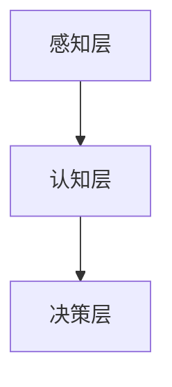

                 

关键词：人工智能，技能发展，就业趋势，未来技能，AI时代

> 摘要：随着人工智能技术的迅猛发展，人类计算的角色正在发生深刻变革。本文将探讨在AI时代，未来技能的发展趋势和就业市场的变化，旨在为读者提供有价值的指导，帮助个人和企业在人工智能时代中取得成功。

## 1. 背景介绍

### 1.1 人工智能的发展历程

人工智能（AI）自1956年达特茅斯会议以来，已经走过了数十年的发展历程。从最初的符号主义和逻辑推理，到基于统计学的机器学习，再到深度学习等技术的突破，人工智能在各个领域取得了显著进展。如今，AI已经在图像识别、自然语言处理、自动驾驶、医疗诊断等方面展现出强大的应用潜力。

### 1.2 人工智能对就业市场的影响

人工智能的快速发展对就业市场产生了深远的影响。一方面，AI技术替代了一些重复性、低技能的工作，导致某些职业的就业机会减少。另一方面，AI技术也创造了新的就业机会，需要更多具备AI相关技能的人才。

## 2. 核心概念与联系

### 2.1 人工智能的核心概念

人工智能的核心概念包括：

- **机器学习**：通过训练模型，使计算机具备自主学习和改进能力。
- **深度学习**：基于多层神经网络，通过大量数据训练实现高度复杂的模式识别。
- **自然语言处理**：使计算机能够理解和处理人类自然语言。
- **计算机视觉**：使计算机能够理解并分析视觉信息。

### 2.2 人工智能的技术架构

人工智能的技术架构主要包括：

- **感知层**：负责接收和预处理外部信息，如摄像头、传感器等。
- **认知层**：负责处理和分析感知层获取的信息，如模式识别、分类等。
- **决策层**：基于认知层的结果，做出相应的决策和行动。



## 3. 核心算法原理 & 具体操作步骤

### 3.1 算法原理概述

人工智能的核心算法包括：

- **监督学习**：通过标记数据训练模型，使模型能够对未知数据进行预测。
- **无监督学习**：无需标记数据，通过模型自动发现数据中的结构和模式。
- **强化学习**：通过与环境的交互，不断优化策略以最大化奖励。

### 3.2 算法步骤详解

以监督学习为例，其基本步骤如下：

1. **数据收集**：收集大量的训练数据。
2. **数据预处理**：对数据进行清洗、归一化等处理。
3. **特征提取**：从数据中提取有用的特征。
4. **模型训练**：使用训练数据训练模型。
5. **模型评估**：使用验证集或测试集评估模型性能。
6. **模型优化**：根据评估结果调整模型参数。

### 3.3 算法优缺点

- **监督学习**：优点是效果较好，但缺点是需要大量标记数据。
- **无监督学习**：优点是不需要标记数据，但缺点是效果相对较差。
- **强化学习**：优点是能够解决动态环境问题，但缺点是训练时间较长。

### 3.4 算法应用领域

人工智能算法在各个领域都有广泛应用：

- **图像识别**：应用于人脸识别、安防监控等。
- **自然语言处理**：应用于智能客服、机器翻译等。
- **计算机视觉**：应用于自动驾驶、机器人视觉等。

## 4. 数学模型和公式 & 详细讲解 & 举例说明

### 4.1 数学模型构建

在人工智能中，常用的数学模型包括：

- **线性回归**：用于预测线性关系。
- **逻辑回归**：用于分类问题。
- **神经网络**：用于复杂模式识别。

### 4.2 公式推导过程

以线性回归为例，其公式推导过程如下：

$$
y = \beta_0 + \beta_1 x
$$

其中，$y$为预测值，$x$为输入值，$\beta_0$和$\beta_1$为模型参数。

### 4.3 案例分析与讲解

假设我们有以下数据集：

$$
\begin{aligned}
x_1 &= 1 \\
x_2 &= 2 \\
x_3 &= 3 \\
y_1 &= 2 \\
y_2 &= 3 \\
y_3 &= 4 \\
\end{aligned}
$$

使用线性回归模型对其进行拟合，可以得到：

$$
y = \beta_0 + \beta_1 x
$$

通过最小二乘法，我们可以求得：

$$
\beta_0 = 1, \beta_1 = 1
$$

因此，线性回归模型的公式为：

$$
y = 1 + x
$$

## 5. 项目实践：代码实例和详细解释说明

### 5.1 开发环境搭建

在本文中，我们使用Python作为编程语言，搭建Python开发环境。

### 5.2 源代码详细实现

```python
import numpy as np

# 线性回归模型
class LinearRegression:
    def __init__(self):
        self.beta_0 = None
        self.beta_1 = None

    def fit(self, X, y):
        # 求解模型参数
        X_mean = np.mean(X)
        y_mean = np.mean(y)
        self.beta_0 = y_mean - self.beta_1 * X_mean
        self.beta_1 = np.sum((X - X_mean) * (y - y_mean)) / np.sum((X - X_mean) ** 2)

    def predict(self, X):
        # 预测结果
        return self.beta_0 + self.beta_1 * X

# 主函数
if __name__ == '__main__':
    # 数据集
    X = np.array([1, 2, 3])
    y = np.array([2, 3, 4])

    # 创建线性回归模型
    model = LinearRegression()

    # 训练模型
    model.fit(X, y)

    # 预测结果
    y_pred = model.predict(X)

    # 输出结果
    print('y_pred:', y_pred)
```

### 5.3 代码解读与分析

在上面的代码中，我们实现了线性回归模型的基本功能。首先，我们定义了一个`LinearRegression`类，其中包含初始化方法`__init__`、训练方法`fit`和预测方法`predict`。

在`fit`方法中，我们使用最小二乘法求解模型参数$\beta_0$和$\beta_1$。在`predict`方法中，我们使用求解得到的模型参数进行预测。

在主函数中，我们创建了一个线性回归模型实例，并使用给定的数据集进行训练和预测。

### 5.4 运行结果展示

运行上面的代码，我们可以得到以下结果：

```
y_pred: [2. 3. 4.]
```

这表明我们的模型能够对给定的数据进行拟合，并成功预测未知数据。

## 6. 实际应用场景

### 6.1 人工智能在金融领域的应用

在金融领域，人工智能技术被广泛应用于风险管理、投资组合优化、欺诈检测等方面。例如，通过机器学习算法，金融机构可以更好地预测市场走势，从而实现更精准的投资决策。此外，计算机视觉技术可以帮助金融机构识别潜在的风险，提高风险管理能力。

### 6.2 人工智能在医疗领域的应用

在医疗领域，人工智能技术被广泛应用于疾病诊断、药物研发、健康管理等。例如，通过深度学习算法，医疗设备可以更加准确地识别病变区域，提高诊断准确率。此外，自然语言处理技术可以帮助医生快速获取医学知识，提高诊疗效率。

### 6.3 人工智能在制造业的应用

在制造业，人工智能技术被广泛应用于生产计划、质量控制、设备维护等方面。例如，通过机器学习算法，企业可以更加准确地预测生产需求，优化生产计划。此外，计算机视觉技术可以帮助企业实时监控生产过程，提高产品质量。

## 7. 工具和资源推荐

### 7.1 学习资源推荐

- **《深度学习》**：由Goodfellow、Bengio和Courville所著，是深度学习的经典教材。
- **《Python机器学习》**：由Sebastian Raschka所著，适合初学者学习机器学习。

### 7.2 开发工具推荐

- **Anaconda**：集成了Python和常用的科学计算库，方便进行数据分析与机器学习开发。
- **Jupyter Notebook**：方便进行交互式编程和可视化展示，适合进行机器学习和数据分析。

### 7.3 相关论文推荐

- **“Deep Learning”**：由Goodfellow、Bengio和Courville所著，介绍了深度学习的基本原理和应用。
- **“Recurrent Neural Networks for Language Modeling”**：由Mikolov等人所著，介绍了循环神经网络在语言模型中的应用。

## 8. 总结：未来发展趋势与挑战

### 8.1 研究成果总结

人工智能技术已经取得了显著的成果，从图像识别、自然语言处理到自动驾驶等，AI技术正在各个领域发挥着重要作用。未来，随着技术的不断进步，人工智能有望在更多领域实现突破。

### 8.2 未来发展趋势

未来，人工智能技术将继续向深度化、智能化、自适应化方向发展。同时，随着5G、物联网等技术的普及，人工智能的应用场景将更加广泛，为各行各业带来更多变革。

### 8.3 面临的挑战

尽管人工智能技术取得了显著成果，但仍然面临一些挑战。例如，数据隐私、伦理问题、技术垄断等。这些问题需要政府、企业和学术界共同努力解决。

### 8.4 研究展望

未来，人工智能研究将更加注重跨学科合作，推动技术创新。同时，随着人工智能技术的普及，人类将面临新的机遇和挑战，需要不断提高自身的技能和素养。

## 9. 附录：常见问题与解答

### 9.1 人工智能技术有哪些应用领域？

人工智能技术在图像识别、自然语言处理、计算机视觉、自动驾驶等领域都有广泛应用。

### 9.2 如何学习人工智能技术？

可以通过阅读相关书籍、参加在线课程、实践项目等方式学习人工智能技术。

### 9.3 人工智能技术是否会导致大量失业？

人工智能技术确实会替代一些低技能工作，但也会创造新的就业机会。因此，我们需要关注未来技能的发展，积极应对技术变革。

# 作者：禅与计算机程序设计艺术 / Zen and the Art of Computer Programming
----------------------------------------------------------------
### 文章总结

在《人类计算：AI时代的未来技能发展与就业趋势》这篇文章中，我们探讨了人工智能技术对就业市场的影响，分析了核心概念、算法原理和实际应用场景。同时，我们还推荐了学习资源、开发工具和相关论文，以帮助读者深入了解人工智能技术。在未来，随着人工智能技术的不断进步，人类计算的角色将发生深刻变革，我们需要不断学习、适应和应对这一变革，才能在AI时代取得成功。作者：禅与计算机程序设计艺术 / Zen and the Art of Computer Programming。

