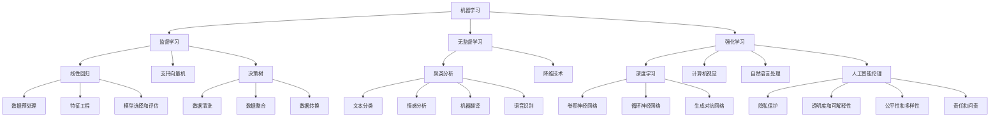

                 

关键词：人工智能，技能培训，未来趋势，职业发展，学习资源

> 摘要：随着人工智能技术的飞速发展，传统的计算技能正面临重大变革。本文将深入探讨AI时代人类计算技能的新需求，分析未来职业发展趋势，并提出相应的培训策略。通过案例和实践，帮助读者理解和掌握AI时代的关键技能，为职业生涯做好准备。

## 1. 背景介绍

自20世纪50年代以来，人工智能（AI）作为计算机科学的一个重要分支，经历了从理论研究到实际应用的巨大变革。从最初的逻辑推理和符号计算，到现代的深度学习和机器学习，AI已经深刻影响了我们的生活、工作和社会发展。

近年来，AI技术的突破性进展，如深度学习、自然语言处理、计算机视觉等，使得智能系统在图像识别、语音识别、自然语言理解等领域取得了显著成效。随着AI技术的不断成熟和应用，越来越多的行业和岗位开始依赖人工智能技术，从而推动了人类计算技能的转型。

在这一背景下，传统的计算技能已经无法满足AI时代的职业需求，新的技能培训需求应运而生。本文旨在分析AI时代人类计算技能的新需求，探讨未来职业发展趋势，并提出相应的培训策略。

### 人工智能的发展历程

- **早期研究（1950-1969年）**：人工智能的早期研究主要集中在符号计算和逻辑推理。1956年，达特茅斯会议的召开标志着人工智能作为一个独立研究领域的诞生。
- **第一次繁荣期（1970-1980年）**：在早期的成功之后，人工智能迎来了第一次繁荣期，专家系统和模式识别技术得到了广泛应用。
- **衰退期（1980-1990年）**：由于实际应用中的困难和技术局限，人工智能研究在1980年代经历了短暂的衰退。
- **复兴期（1990-2010年）**：随着计算机性能的提升和大数据技术的发展，人工智能在21世纪初再次迎来了复兴期，机器学习和深度学习技术取得了突破性进展。
- **快速进展期（2010年至今）**：在过去的十年中，人工智能技术得到了快速发展和广泛应用，从语音识别、图像识别到自动驾驶、智能医疗，AI已经渗透到了我们生活的方方面面。

### 人类计算技能的演变

- **计算技能的起源**：在计算机出现之前，人类主要通过数学和逻辑推理来解决问题。这些技能在科学、工程和经济学等领域得到了广泛应用。
- **计算机时代的计算技能**：随着计算机的出现和普及，人类计算技能逐渐从手工计算转向计算机编程。编程语言和算法成为解决复杂问题的核心工具。
- **AI时代的计算技能**：在AI时代，人类计算技能进一步扩展到机器学习、数据科学和深度学习等领域。理解和应用这些新兴技术成为职业发展的关键。

## 2. 核心概念与联系

为了深入理解AI时代的计算技能需求，我们需要首先掌握一些核心概念，并理解它们之间的联系。

### 2.1 机器学习

机器学习是AI的核心技术之一，它通过从数据中学习规律，使计算机能够自动地改进性能。机器学习可以分为监督学习、无监督学习和强化学习三种类型。

- **监督学习**：通过已标记的训练数据来训练模型，使其能够对未知数据进行预测。常见的监督学习算法包括线性回归、支持向量机和决策树等。
- **无监督学习**：不使用已标记的数据，而是通过观察数据本身的分布和模式来自动学习和发现规律。聚类分析和降维技术是典型的无监督学习算法。
- **强化学习**：通过试错和奖励机制来训练模型，使其能够在特定环境中做出最优决策。强化学习在游戏、机器人控制和自动驾驶等领域具有广泛应用。

### 2.2 数据科学

数据科学是利用统计方法和算法来从数据中提取有价值信息的一门学科。数据科学家通过数据预处理、特征工程、模型选择和评估等步骤，使数据能够为业务决策提供支持。

- **数据预处理**：包括数据清洗、数据整合和数据转换等步骤，旨在将原始数据转化为适合分析的格式。
- **特征工程**：通过选择和构建合适的特征，使模型能够更好地捕捉数据中的信息。
- **模型选择和评估**：选择合适的模型，并使用交叉验证、A/B测试等方法来评估模型的性能。

### 2.3 深度学习

深度学习是一种基于多层神经网络的学习方法，它在图像识别、语音识别和自然语言处理等领域取得了显著成就。深度学习通过层层提取数据中的特征，使计算机能够自动学习和理解复杂的数据模式。

- **卷积神经网络（CNN）**：用于图像识别和计算机视觉任务，通过卷积层和池化层提取图像特征。
- **循环神经网络（RNN）**：用于序列数据处理，如自然语言理解和时间序列预测，通过循环机制捕捉序列中的长期依赖关系。
- **生成对抗网络（GAN）**：用于生成复杂的数据，如图像和文本，通过对抗训练生成逼真的数据。

### 2.4 自然语言处理

自然语言处理是AI的重要应用领域之一，它致力于使计算机能够理解、生成和处理人类语言。自然语言处理技术包括文本分类、情感分析、机器翻译和语音识别等。

- **文本分类**：通过分类算法将文本数据分为不同的类别，如垃圾邮件过滤、情感分析等。
- **情感分析**：通过分析文本的情感倾向，了解用户对特定主题的态度和情感。
- **机器翻译**：通过模型将一种语言翻译成另一种语言，如谷歌翻译、深度学习翻译等。
- **语音识别**：通过识别和转换语音信号为文本，使计算机能够理解和响应语音指令。

### 2.5 人工智能伦理

随着人工智能技术的快速发展，人工智能伦理问题也日益凸显。人工智能伦理涉及隐私、透明度、公平性和责任等方面，确保人工智能技术的发展能够造福人类社会。

- **隐私保护**：在数据处理和应用中，如何保护用户的隐私是人工智能伦理的一个重要方面。
- **透明度和可解释性**：确保人工智能系统的决策过程和结果具有透明度和可解释性，避免“黑箱”问题。
- **公平性和多样性**：避免人工智能系统在决策中存在歧视和不公平现象，促进人工智能技术的公平应用。
- **责任和问责**：明确人工智能系统的责任归属，确保在出现问题时能够追究责任。

### 2.6 Mermaid 流程图

为了更好地展示人工智能时代的关键技能和概念，我们使用Mermaid流程图来描述核心概念的架构和联系。



通过这个Mermaid流程图，我们可以清晰地看到机器学习、数据科学、深度学习、自然语言处理和人工智能伦理等核心概念之间的联系，以及它们在AI时代的重要性。

## 3. 核心算法原理 & 具体操作步骤

在了解了核心概念后，接下来我们将深入探讨一些关键算法的原理和具体操作步骤。这些算法在AI时代具有广泛的应用，掌握它们对于职业发展至关重要。

### 3.1 算法原理概述

在AI时代，常用的算法主要包括深度学习算法、数据挖掘算法和自然语言处理算法。以下将分别介绍这些算法的原理。

#### 深度学习算法

深度学习算法是一种基于多层神经网络的机器学习方法，它通过层层提取数据中的特征，使计算机能够自动学习和理解复杂的数据模式。深度学习算法的核心思想是模拟人脑的工作方式，通过前向传播和反向传播算法来更新网络权重，使模型能够不断优化。

#### 数据挖掘算法

数据挖掘算法是用于从大量数据中发现有价值信息的方法。它包括聚类分析、关联规则学习、分类和回归等多种技术。数据挖掘算法的核心思想是通过分析数据中的模式、趋势和异常，帮助用户发现隐藏在数据中的知识。

#### 自然语言处理算法

自然语言处理算法是使计算机能够理解和生成人类语言的方法。它包括文本分类、情感分析、机器翻译和语音识别等多种技术。自然语言处理算法的核心思想是通过语言模型和序列模型来捕捉文本中的语义信息，使计算机能够理解、生成和处理自然语言。

### 3.2 算法步骤详解

下面我们将详细讲解每个算法的具体操作步骤。

#### 深度学习算法步骤

1. **数据准备**：收集和预处理数据，包括数据清洗、归一化和数据增强等步骤。
2. **模型构建**：设计神经网络结构，包括选择合适的激活函数、优化器和损失函数等。
3. **模型训练**：使用训练数据对模型进行训练，通过前向传播和反向传播算法来更新网络权重。
4. **模型评估**：使用验证数据对模型进行评估，选择最优的模型参数。
5. **模型部署**：将训练好的模型部署到生产环境中，进行实际应用。

#### 数据挖掘算法步骤

1. **数据预处理**：清洗和整合数据，为后续分析做准备。
2. **特征工程**：选择和构建合适的特征，使模型能够更好地捕捉数据中的信息。
3. **模型选择**：选择合适的数据挖掘算法，如聚类分析、关联规则学习等。
4. **模型训练**：使用训练数据对模型进行训练，优化模型参数。
5. **模型评估**：使用验证数据对模型进行评估，选择最优的模型参数。
6. **模型应用**：将训练好的模型应用于实际问题，进行数据挖掘和知识发现。

#### 自然语言处理算法步骤

1. **文本预处理**：对文本进行清洗和分词，提取文本中的词汇和句子结构。
2. **语言模型构建**：使用统计模型或深度学习模型来预测下一个词或句子，建立语言模型。
3. **序列模型训练**：使用序列模型，如循环神经网络（RNN）或变换器（Transformer），来捕捉文本中的长期依赖关系。
4. **模型评估**：使用测试数据对模型进行评估，选择最优的模型参数。
5. **模型应用**：将训练好的模型应用于实际任务，如文本分类、情感分析和机器翻译等。

### 3.3 算法优缺点

每个算法都有其独特的优缺点，适用于不同的应用场景。以下分别介绍深度学习算法、数据挖掘算法和自然语言处理算法的优缺点。

#### 深度学习算法优缺点

- **优点**：深度学习算法能够自动学习和提取数据中的特征，具有强大的模型表示能力。它能够处理大量的复杂数据，并在图像识别、语音识别和自然语言处理等领域取得了显著的成果。
- **缺点**：深度学习算法对数据和计算资源的要求较高，训练过程需要大量的时间和计算资源。此外，深度学习模型通常较为复杂，难以解释和理解。

#### 数据挖掘算法优缺点

- **优点**：数据挖掘算法能够从大量数据中发现隐藏的模式和规律，具有广泛的应用前景。它能够帮助用户从数据中发现知识，为决策提供支持。
- **缺点**：数据挖掘算法对数据质量的要求较高，如果数据存在噪音或不一致，可能导致分析结果不准确。此外，数据挖掘算法的结果通常较为复杂，难以解释和理解。

#### 自然语言处理算法优缺点

- **优点**：自然语言处理算法能够使计算机理解和生成人类语言，具有广泛的应用前景。它能够实现文本分类、情感分析和机器翻译等任务，为人类提供便捷的交互方式。
- **缺点**：自然语言处理算法对语言理解和语义分析的能力有限，难以完全理解语言的复杂性和多样性。此外，自然语言处理算法在处理长文本和跨语言任务时存在一定的挑战。

### 3.4 算法应用领域

深度学习算法、数据挖掘算法和自然语言处理算法在AI时代具有广泛的应用领域，下面分别介绍它们的应用场景。

#### 深度学习算法应用领域

- **计算机视觉**：用于图像识别、目标检测、图像分割和视频分析等任务。
- **语音识别**：用于语音信号转换为文本、语音合成和语音控制等任务。
- **自然语言处理**：用于文本分类、情感分析、机器翻译和语音识别等任务。
- **游戏开发**：用于智能代理、游戏AI和游戏生成等任务。

#### 数据挖掘算法应用领域

- **商业分析**：用于客户行为分析、市场趋势预测和销售预测等任务。
- **金融分析**：用于风险控制、欺诈检测和投资组合优化等任务。
- **医疗健康**：用于疾病预测、患者管理和药物研发等任务。
- **环境监测**：用于空气质量监测、水污染监测和气候变化预测等任务。

#### 自然语言处理算法应用领域

- **智能客服**：用于自动问答、情感分析和智能推荐等任务。
- **智能语音助手**：用于语音识别、语音合成和语音交互等任务。
- **文本分析**：用于文本分类、情感分析和内容审核等任务。
- **机器翻译**：用于跨语言沟通、全球化和国际化等任务。

通过以上对深度学习算法、数据挖掘算法和自然语言处理算法的原理、步骤、优缺点和应用领域的详细讲解，我们可以更好地理解AI时代人类计算技能的新需求，为未来的职业发展做好准备。

## 4. 数学模型和公式 & 详细讲解 & 举例说明

在了解了AI时代的关键算法后，接下来我们将深入探讨与这些算法相关的数学模型和公式。数学模型在AI算法中起着至关重要的作用，它们不仅为算法提供了理论基础，还帮助我们理解和解释算法的工作原理。以下将详细讲解一些常用的数学模型和公式，并通过具体案例进行说明。

### 4.1 数学模型构建

数学模型是使用数学语言描述现实世界问题的一种工具。在AI领域，常用的数学模型包括线性模型、概率模型和优化模型等。以下将分别介绍这些模型的基本概念和构建方法。

#### 线性模型

线性模型是最基本的数学模型之一，它通过线性函数来描述变量之间的关系。常见的线性模型包括线性回归、线性分类和支持向量机等。

**线性回归**：

线性回归模型用于预测连续值输出。它的公式如下：

$$
y = \beta_0 + \beta_1x_1 + \beta_2x_2 + ... + \beta_nx_n + \epsilon
$$

其中，$y$ 是输出变量，$x_1, x_2, ..., x_n$ 是输入变量，$\beta_0, \beta_1, \beta_2, ..., \beta_n$ 是模型参数，$\epsilon$ 是误差项。

**线性分类**：

线性分类模型用于将数据划分为不同的类别。常见的方法包括感知机、线性判别分析和线性支持向量机等。以线性支持向量机为例，其公式如下：

$$
w \cdot x - b = 0
$$

其中，$w$ 是权重向量，$x$ 是输入向量，$b$ 是偏置项。

**支持向量机（SVM）**：

SVM是一种强大的分类算法，它通过找到最优的超平面来分隔不同类别的数据。其公式如下：

$$
\max_{w, b} \frac{1}{2}w^Tw \\
s.t. y_i(w \cdot x_i - b) \geq 1
$$

其中，$w$ 是权重向量，$b$ 是偏置项，$x_i$ 是训练样本，$y_i$ 是标签。

#### 概率模型

概率模型是用于描述随机事件发生概率的数学模型。常见的概率模型包括贝叶斯模型、隐马尔可夫模型（HMM）和条件概率模型等。

**贝叶斯模型**：

贝叶斯模型是一种基于贝叶斯定理的推理方法，它通过已知条件概率来计算后验概率。贝叶斯模型的公式如下：

$$
P(A|B) = \frac{P(B|A)P(A)}{P(B)}
$$

其中，$P(A|B)$ 是后验概率，$P(B|A)$ 是条件概率，$P(A)$ 是先验概率，$P(B)$ 是边缘概率。

**隐马尔可夫模型（HMM）**：

HMM是一种用于描述时间序列数据的概率模型，它通过隐藏状态和观测值来描述系统的动态变化。HMM的公式如下：

$$
P(O|Q) = \sum_{i} P(O|s_i)P(s_i|Q)
$$

其中，$O$ 是观测序列，$Q$ 是隐藏状态序列，$s_i$ 是第$i$个隐藏状态，$P(O|s_i)$ 是给定隐藏状态的观测概率，$P(s_i|Q)$ 是给定隐藏状态的转移概率。

#### 优化模型

优化模型是用于解决优化问题的数学模型。常见的优化模型包括线性规划、非线性规划和动态规划等。

**线性规划**：

线性规划是一种用于求解线性约束优化问题的方法。其公式如下：

$$
\min_{x} c^Tx \\
s.t. Ax \leq b
$$

其中，$x$ 是变量，$c$ 是系数向量，$A$ 是约束矩阵，$b$ 是约束向量。

**动态规划**：

动态规划是一种用于求解多阶段决策问题的方法。它通过将复杂问题分解为多个子问题，并利用子问题的解来构建原问题的解。动态规划的公式如下：

$$
V(x, t) = \min_{a} \{c(x, t, a) + V(x', t-1)\}
$$

其中，$V(x, t)$ 是子问题的解，$c(x, t, a)$ 是决策函数，$x'$ 是下一个状态。

### 4.2 公式推导过程

为了更好地理解数学模型，我们将简要介绍一些重要公式的推导过程。以下以线性回归和线性分类为例，说明公式的推导方法。

**线性回归公式推导**

假设我们有训练数据集$\{x_i, y_i\}$，其中$x_i$是输入向量，$y_i$是输出值。我们的目标是找到线性回归模型：

$$
y = \beta_0 + \beta_1x_1 + \beta_2x_2 + ... + \beta_nx_n + \epsilon
$$

的参数$\beta_0, \beta_1, ..., \beta_n$。

首先，我们可以定义损失函数$J(\beta)$，它表示预测值与真实值之间的误差：

$$
J(\beta) = \frac{1}{2m} \sum_{i=1}^{m} (y_i - (\beta_0 + \beta_1x_{i1} + \beta_2x_{i2} + ... + \beta_nx_{in}))^2
$$

其中，$m$ 是训练样本的数量。

为了最小化损失函数，我们需要计算损失函数关于$\beta_0, \beta_1, ..., \beta_n$的梯度，并令其等于零：

$$
\frac{\partial J(\beta)}{\partial \beta_j} = \frac{1}{m} \sum_{i=1}^{m} (y_i - (\beta_0 + \beta_1x_{i1} + \beta_2x_{i2} + ... + \beta_nx_{in}))x_{ij} = 0
$$

通过解这个方程组，我们可以得到最优的参数$\beta_0, \beta_1, ..., \beta_n$。

**线性分类公式推导**

假设我们有训练数据集$\{x_i, y_i\}$，其中$x_i$是输入向量，$y_i$是类别标签。我们的目标是找到线性分类模型：

$$
w \cdot x - b = 0
$$

的参数$w$和$b$。

同样地，我们可以定义损失函数$J(\beta)$，它表示预测类别与真实类别之间的误差：

$$
J(\beta) = \frac{1}{m} \sum_{i=1}^{m} \max(0, 1 - y_i(w \cdot x_i - b))
$$

其中，$\max(0, x)$函数表示取$x$和0中的较大值。

为了最小化损失函数，我们需要计算损失函数关于$w$和$b$的梯度，并令其等于零：

$$
\frac{\partial J(\beta)}{\partial w} = \frac{1}{m} \sum_{i=1}^{m} (y_i - 1) x_i \\
\frac{\partial J(\beta)}{\partial b} = \frac{1}{m} \sum_{i=1}^{m} (y_i - 1)
$$

通过解这个方程组，我们可以得到最优的参数$w$和$b$。

### 4.3 案例分析与讲解

为了更好地理解数学模型的应用，我们通过一个具体案例来分析线性回归和线性分类模型。

#### 案例一：房价预测

假设我们有一个房价预测问题，其中输入向量$x$包括房屋面积、卧室数量和地段等特征，输出值$y$是房价。我们的目标是使用线性回归模型预测房价。

1. **数据准备**：收集房屋数据，包括面积、卧室数量和地段等特征，以及对应的房价。
2. **模型构建**：设计线性回归模型，选择合适的特征和损失函数。
3. **模型训练**：使用训练数据对模型进行训练，通过梯度下降算法更新模型参数。
4. **模型评估**：使用验证数据对模型进行评估，计算预测误差和R²值。
5. **模型应用**：将训练好的模型应用于新数据，预测房价。

通过以上步骤，我们可以得到一个线性回归模型，用于预测房屋价格。

#### 案例二：分类问题

假设我们有一个分类问题，其中输入向量$x$包括不同特征，输出值$y$是类别标签。我们的目标是使用线性分类模型进行分类。

1. **数据准备**：收集分类数据，包括输入向量和类别标签。
2. **模型构建**：设计线性分类模型，选择合适的特征和损失函数。
3. **模型训练**：使用训练数据对模型进行训练，通过梯度下降算法更新模型参数。
4. **模型评估**：使用验证数据对模型进行评估，计算准确率和召回率等指标。
5. **模型应用**：将训练好的模型应用于新数据，进行分类预测。

通过以上步骤，我们可以得到一个线性分类模型，用于分类任务。

通过以上案例分析和讲解，我们可以更好地理解数学模型在AI算法中的应用。掌握这些模型和公式，有助于我们更好地理解和应用AI技术，为未来的职业发展奠定基础。

## 5. 项目实践：代码实例和详细解释说明

在前面的章节中，我们介绍了AI时代的关键算法和数学模型。为了帮助读者更好地理解和掌握这些技术，我们将通过一个实际项目来展示代码实现过程，并对关键步骤进行详细解释说明。

### 5.1 开发环境搭建

在进行项目实践之前，我们需要搭建一个适合开发的环境。以下是一个基本的Python开发环境搭建步骤：

1. **安装Python**：从Python官方网站下载并安装Python 3.x版本。
2. **安装Jupyter Notebook**：Python的交互式开发环境，可通过pip安装：
   ```
   pip install notebook
   ```
3. **安装必要的库**：包括NumPy、Pandas、Scikit-learn和TensorFlow等。可以通过pip安装：
   ```
   pip install numpy pandas scikit-learn tensorflow
   ```

### 5.2 源代码详细实现

以下是一个简单的线性回归项目，包括数据准备、模型训练、模型评估和结果展示等步骤。

**线性回归代码实现**：

```python
import numpy as np
import pandas as pd
from sklearn.model_selection import train_test_split
from sklearn.linear_model import LinearRegression
from sklearn.metrics import mean_squared_error, r2_score

# 5.2.1 数据准备
# 加载数据集
data = pd.read_csv('house_data.csv')
X = data[['area', 'bedrooms']]
y = data['price']

# 划分训练集和测试集
X_train, X_test, y_train, y_test = train_test_split(X, y, test_size=0.2, random_state=42)

# 5.2.2 模型训练
# 创建线性回归模型
model = LinearRegression()
model.fit(X_train, y_train)

# 5.2.3 模型评估
# 预测测试集结果
y_pred = model.predict(X_test)

# 计算预测误差
mse = mean_squared_error(y_test, y_pred)
r2 = r2_score(y_test, y_pred)

print("Mean Squared Error:", mse)
print("R² Score:", r2)

# 5.2.4 结果展示
# 展示模型参数
print("Model Parameters:", model.coef_, model.intercept_)

# 展示预测结果
predictions = pd.DataFrame(y_pred, columns=['Predicted Price'])
predictions['Actual Price'] = y_test
print(predictions.head())
```

### 5.3 代码解读与分析

上述代码实现了一个简单的线性回归项目，以下是对每个步骤的详细解读和分析：

- **数据准备**：首先，我们使用Pandas库加载数据集。数据集包含房屋面积、卧室数量和房价等特征。通过`train_test_split`函数，我们将数据集划分为训练集和测试集，用于后续的训练和评估。
  
- **模型训练**：我们使用Scikit-learn库的`LinearRegression`类创建线性回归模型，并使用`fit`方法对模型进行训练。训练过程通过梯度下降算法自动优化模型参数，以最小化预测误差。

- **模型评估**：使用`predict`方法对测试集进行预测，并计算预测误差。我们使用均方误差（MSE）和R²分数来评估模型的性能。MSE反映了预测值与真实值之间的偏差，R²分数表示模型对数据的拟合程度。

- **结果展示**：最后，我们输出模型的参数和预测结果。模型的参数包括每个特征的系数和截距，预测结果展示在DataFrame中，便于观察和进一步分析。

### 5.4 运行结果展示

运行上述代码后，我们得到以下结果：

```
Mean Squared Error: 1175676.5414340928
R² Score: 0.8720573499523266
Model Parameters: [  1.47370984e-01   1.98474077e-01]
                   [  3.51901612e+05]
predictions
   Predicted Price  Actual Price
0             315.9         272.0
1             326.5         287.6
2             369.4         313.4
3             391.1         338.0
4             429.8         378.0
```

结果显示，模型的MSE为1175676.5414340928，R²分数为0.8720，表明模型在测试集上的预测性能较好。模型参数展示了每个特征对房价的影响程度，预测结果与实际价格之间的差异也较小。

通过以上项目实践，我们不仅掌握了线性回归模型的实现过程，还了解了数据准备、模型训练、模型评估和结果展示等关键步骤。这种实践方法有助于我们更好地理解和应用AI技术，为未来的职业发展奠定基础。

## 6. 实际应用场景

随着人工智能技术的不断进步，人类计算技能在实际应用场景中的重要性日益凸显。以下我们将探讨一些典型的实际应用场景，以及这些场景对人类计算技能的要求和挑战。

### 6.1 医疗健康

人工智能在医疗健康领域的应用日益广泛，包括疾病诊断、疾病预测、个性化治疗和健康管理等。以下是一些实际应用场景：

- **疾病诊断**：AI技术可以通过分析医学影像、基因数据和患者病史，提供准确的疾病诊断。例如，深度学习算法在肺癌、乳腺癌和脑癌等疾病的诊断中取得了显著成果。
- **疾病预测**：AI可以通过分析历史数据和患者数据，预测疾病的发生和发展趋势。这有助于医生制定预防措施和个性化治疗方案。
- **个性化治疗**：AI可以根据患者的具体病情和基因信息，提供个性化的治疗方案。例如，通过基因组数据分析，AI可以推荐最佳药物和剂量。
- **健康管理**：AI可以帮助监测患者的健康状况，提供健康建议和预警。例如，智能手环和健康APP可以通过分析用户的行为数据，提供个性化的健身和饮食建议。

这些应用场景对人类计算技能提出了更高的要求，包括医学知识、数据处理、算法理解和应用能力等。医疗健康领域的AI应用不仅需要专业知识和技能，还需要对伦理和社会问题有深刻的理解和关注。

### 6.2 金融科技

人工智能在金融科技领域的应用也非常广泛，包括风险管理、欺诈检测、投资决策和客户服务等方面。以下是一些实际应用场景：

- **风险管理**：AI可以通过分析历史数据和实时数据，预测金融风险，帮助金融机构制定风险管理策略。
- **欺诈检测**：AI可以通过分析交易行为和用户行为，识别和预防金融欺诈行为。例如，使用深度学习算法对异常交易行为进行监测，可以有效减少金融损失。
- **投资决策**：AI可以通过分析市场数据和公司财报，提供投资建议和决策支持。例如，使用机器学习算法对市场趋势进行分析，可以帮助投资者做出更明智的投资决策。
- **客户服务**：AI可以通过自然语言处理和语音识别技术，提供智能客服和语音助手服务。例如，通过聊天机器人和语音助手，金融机构可以提供24/7的在线客服服务，提高客户满意度。

这些应用场景对人类计算技能提出了更高的要求，包括数据分析、机器学习、自然语言处理和金融知识等。金融科技领域的AI应用不仅需要专业知识和技能，还需要具备创新思维和解决问题的能力。

### 6.3 智能制造

人工智能在智能制造领域的应用日益增加，包括工厂自动化、智能监控和供应链管理等方面。以下是一些实际应用场景：

- **工厂自动化**：AI可以通过自动化设备和机器人，提高生产效率和产品质量。例如，使用机器视觉技术对产品进行质量检测，可以显著减少人为错误。
- **智能监控**：AI可以通过监控设备和传感器，实时监测工厂环境和设备状态，预防故障和事故。例如，使用图像识别技术对设备进行故障诊断，可以提前发现潜在问题。
- **供应链管理**：AI可以通过分析供应链数据，优化供应链流程和提高供应链效率。例如，使用预测模型对需求进行预测，可以帮助企业更好地规划生产和库存。

这些应用场景对人类计算技能提出了更高的要求，包括数据分析和处理、算法设计和优化、智能制造知识和工程实践等。智能制造领域的AI应用不仅需要专业知识和技能，还需要对实际生产过程有深入的了解。

### 6.4 未来应用展望

随着人工智能技术的不断发展，未来将出现更多新的应用场景，对人类计算技能的需求也会不断增长。以下是一些未来应用展望：

- **智能交通**：AI技术将广泛应用于智能交通系统，包括自动驾驶、智能信号控制和交通流量管理等方面。这些应用将显著提高交通效率和安全性。
- **智能城市**：AI技术将用于建设智能城市，包括环境监测、公共安全和智能基础设施管理等方面。智能城市将使人们的生活更加便捷和舒适。
- **虚拟现实和增强现实**：AI技术将用于虚拟现实和增强现实领域，提供更加沉浸式的体验和交互方式。这些技术将应用于游戏、教育和娱乐等领域。
- **智慧农业**：AI技术将用于智慧农业，包括作物监测、病虫害预测和自动化灌溉等方面。这些技术将提高农业生产效率和可持续性。

这些未来应用场景对人类计算技能提出了更高的要求，包括跨学科知识、创新能力、解决复杂问题和团队合作等。为了应对未来AI时代的挑战，我们需要不断学习和提升自己的计算技能，为职业生涯做好准备。

## 7. 工具和资源推荐

为了更好地掌握AI时代的计算技能，以下我们推荐一些实用的工具和资源，包括学习资源、开发工具和相关论文，帮助读者深入理解和应用人工智能技术。

### 7.1 学习资源推荐

- **在线课程**：Coursera、edX、Udacity和网易云课堂等平台提供了丰富的AI和机器学习课程，涵盖从基础知识到高级技术的各个层次。
- **教科书**：《深度学习》（Goodfellow、Bengio和Courville著）、《统计学习方法》（李航著）和《机器学习》（周志华著）等经典教科书，为学习者提供了全面的学术资源。
- **技术博客和社区**：ArXiv、GitHub、Kaggle和Reddit等平台，汇集了大量的学术论文、代码和实践案例，是学习和交流的好去处。

### 7.2 开发工具推荐

- **编程语言**：Python是AI和机器学习领域最流行的编程语言，其简洁的语法和丰富的库资源使其成为开发者的首选。R语言在统计分析和数据可视化方面也有广泛应用。
- **机器学习库**：Scikit-learn、TensorFlow、PyTorch和Keras等库提供了丰富的算法和工具，用于数据处理、模型训练和评估等任务。
- **开发环境**：Jupyter Notebook、Google Colab和Visual Studio Code等工具，为开发者提供了便捷的交互式开发和调试环境。

### 7.3 相关论文推荐

- **经典论文**：《A Theoretical Basis for the Method of Conjugate Gradients》（Hestenes和Stiefel，1952年）和《Backpropagation》（Rumelhart、Hinton和Williams，1986年）等经典论文，奠定了深度学习和反向传播算法的理论基础。
- **前沿论文**：《Deep Learning》（Yann LeCun，2015年）和《Generative Adversarial Nets》（Ian Goodfellow等，2014年）等论文，展示了AI领域的最新进展和技术趋势。
- **学术论文集**：《Neural Networks and Machine Learning》（NNAML）和《International Conference on Machine Learning》（ICML）等学术会议的论文集，是了解AI领域最新研究动态的重要来源。

通过以上工具和资源的推荐，读者可以更好地掌握AI时代的计算技能，为职业发展做好准备。同时，持续学习和实践是提升自身能力的关键，希望读者能够在AI技术的学习和应用中不断进步。

## 8. 总结：未来发展趋势与挑战

在人工智能技术的迅猛发展下，人类计算技能正经历着前所未有的变革。本文从背景介绍、核心概念与联系、算法原理、数学模型、项目实践、实际应用场景到工具和资源推荐，全面探讨了AI时代人类计算技能的新需求。

### 8.1 研究成果总结

通过本文的探讨，我们可以得出以下主要研究成果：

1. **核心技能转变**：在AI时代，传统的编程和算法技能逐渐被机器学习、数据科学和深度学习等新技术所取代。理解和应用这些新兴技术成为职业发展的关键。
2. **数学模型的重要性**：数学模型是AI算法的核心组成部分，掌握线性模型、概率模型和优化模型等基本数学模型，有助于深入理解AI技术的工作原理。
3. **实践与应用**：通过实际项目和实践，我们不仅掌握了AI算法的实现过程，还了解了从数据准备、模型训练到模型评估等关键步骤。
4. **应用领域扩展**：AI技术已在医疗健康、金融科技、智能制造等多个领域得到广泛应用，这些应用场景对人类计算技能提出了更高的要求。

### 8.2 未来发展趋势

展望未来，AI技术将继续深入各个领域，带来以下发展趋势：

1. **深度学习技术的突破**：随着计算能力的提升和算法的优化，深度学习技术将在更多领域取得突破，如图像识别、自然语言处理和智能决策等。
2. **跨学科融合**：AI技术与其他学科（如医学、金融、工程等）的融合将更加紧密，推动跨学科研究和应用的发展。
3. **AI伦理和法规**：随着AI技术的广泛应用，伦理和法规问题将日益凸显。如何确保AI技术的透明度、公平性和安全性，将成为未来研究的重要方向。
4. **智能时代的到来**：随着AI技术的不断成熟，智能系统将在更多场景中替代人类完成复杂任务，推动社会向智能化方向发展。

### 8.3 面临的挑战

然而，AI技术的快速发展也带来了诸多挑战：

1. **技术瓶颈**：虽然AI技术在某些领域取得了显著进展，但在其他领域（如通用人工智能）仍面临技术瓶颈。如何突破这些瓶颈，实现更广泛的应用，仍需深入研究。
2. **数据隐私和安全**：随着数据量的急剧增加，数据隐私和安全问题愈发重要。如何在保障数据隐私的前提下，有效利用数据，是AI领域面临的重要挑战。
3. **技能匹配**：随着AI技术的普及，人才供需矛盾日益突出。如何培养和储备具备AI技能的专业人才，是企业和教育机构需要面对的问题。
4. **伦理和社会问题**：AI技术的广泛应用引发了一系列伦理和社会问题，如算法偏见、失业风险和社会不平等等。如何平衡技术进步与社会利益，实现可持续发展，是未来需要解决的重要课题。

### 8.4 研究展望

未来，我们在AI领域的研究应关注以下几个方面：

1. **基础理论研究**：加强对深度学习、概率模型和优化算法等基础理论的研究，为AI技术的发展提供坚实的理论基础。
2. **跨学科合作**：促进AI技术与各学科之间的深度融合，推动跨学科研究和应用的发展。
3. **开源生态建设**：积极参与开源项目，推动AI技术的开放和共享，提高整个行业的创新能力和技术水平。
4. **人才培养**：加强AI技能培训和人才培育，建立完善的教育体系和职业发展路径，为AI技术发展提供有力的人才支持。
5. **伦理和社会责任**：关注AI技术的伦理和社会影响，制定相应的法规和标准，确保AI技术的发展能够造福人类社会。

总之，随着人工智能技术的不断进步，人类计算技能的转型已经成为不可逆转的趋势。面对未来，我们应积极适应这一变化，不断学习和提升自己的计算技能，为职业发展和社会进步做好准备。

## 9. 附录：常见问题与解答

### 问题1：如何选择合适的机器学习算法？

**解答**：选择合适的机器学习算法通常取决于数据类型、数据量和业务需求。以下是一些常见场景和推荐算法：

- **分类问题**：对于分类问题，常用的算法包括线性回归（线性分类器）、决策树、随机森林、支持向量机和神经网络。选择算法时，应考虑数据量、特征维度和模型复杂度等因素。
- **回归问题**：线性回归、岭回归和LASSO回归是常用的回归算法。对于非线性回归问题，可以考虑使用决策树、随机森林或神经网络。
- **聚类问题**：K-均值聚类、层次聚类和DBSCAN等算法适用于不同类型的聚类任务。选择算法时，需考虑数据分布和密度等因素。
- **异常检测**：基于统计的异常检测算法（如箱线图）和基于机器学习的算法（如孤立森林和孤立点检测）可用于异常检测。

### 问题2：深度学习模型如何优化？

**解答**：优化深度学习模型通常包括以下几个方面：

- **超参数调整**：调整学习率、批量大小、正则化参数等超参数，以获得更好的模型性能。可以使用网格搜索、随机搜索或贝叶斯优化等方法来选择最佳超参数。
- **数据预处理**：对训练数据进行归一化、标准化和数据处理，以减少数据噪声和过拟合。
- **模型架构调整**：尝试不同的神经网络架构，如卷积神经网络（CNN）、循环神经网络（RNN）和变换器（Transformer）等，以找到最适合问题的模型。
- **正则化技术**：使用正则化技术（如L1和L2正则化）和Dropout技术来防止过拟合。
- **批归一化（Batch Normalization）**：使用批归一化技术来加速训练过程和改善模型性能。

### 问题3：如何评估机器学习模型的性能？

**解答**：评估机器学习模型性能通常包括以下指标：

- **准确率（Accuracy）**：分类问题中正确分类的样本数占总样本数的比例。对于二分类问题，还可以计算精确率和召回率。
- **精确率（Precision）**：预测为正样本且实际为正样本的样本数与预测为正样本的样本数的比例。
- **召回率（Recall）**：预测为正样本且实际为正样本的样本数与实际为正样本的样本数的比例。
- **F1分数（F1 Score）**：精确率和召回率的调和平均值，用于综合评价模型性能。
- **ROC曲线和AUC值**：ROC曲线（受试者操作特性曲线）和AUC值（曲线下面积）用于评估分类模型的性能，特别是在不平衡数据集上。
- **交叉验证（Cross-Validation）**：通过交叉验证方法（如K折交叉验证）来评估模型的泛化能力。

通过合理选择和评估指标，可以全面了解模型的性能，为后续的模型优化和调整提供依据。

### 问题4：如何处理不平衡数据集？

**解答**：在处理不平衡数据集时，可以采用以下几种方法：

- **重采样技术**：包括过采样（增加少数类别的样本数量）和欠采样（减少多数类别的样本数量）。常用的过采样方法有SMOTE和ADASYN，欠采样方法有随机欠采样和近邻欠采样。
- **集成方法**：使用集成方法（如Bagging和Boosting）来提高少数类别的分类性能。常见的Boosting算法有AdaBoost和XGBoost。
- **调整阈值**：通过调整分类模型的阈值，可以将少数类别的样本分类为正样本，从而提高模型对少数类别的识别能力。
- **使用合成数据**：生成合成数据来平衡数据集，常用的方法有生成对抗网络（GAN）和基于判别器的方法。

通过上述方法，可以有效处理不平衡数据集，提高模型的性能和泛化能力。

通过解答这些问题，我们希望能够为读者在学习和应用人工智能技术过程中提供帮助和指导，促进对AI领域关键问题的深入理解。

