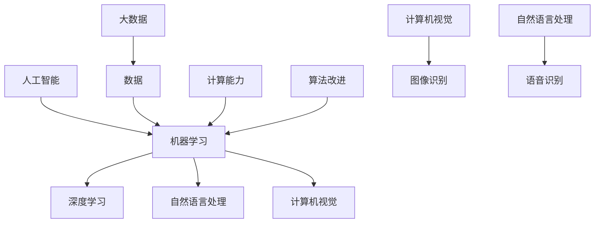

                 

关键词：人工智能，计算社会学，社会影响，AI伦理，人机协作

> 摘要：本文从人工智能（AI）的视角出发，探讨AI技术对人类社会产生的深远影响。文章首先介绍了AI的基本概念和原理，然后深入分析了AI对劳动市场、隐私保护、教育变革和伦理道德等方面的冲击，最后提出了AI时代下的社会应对策略和未来展望。

## 1. 背景介绍

人工智能，作为计算机科学的一个重要分支，旨在开发能够执行复杂任务的机器系统。自20世纪50年代以来，人工智能经历了多个发展阶段，从早期的符号主义、知识表示，到基于规则的系统、专家系统，再到现代的基于数据和机器学习的算法。随着计算能力的提升和大数据技术的发展，人工智能逐渐成为推动社会进步的重要力量。

本文将主要探讨人工智能对社会产生的以下几个方面的影响：

1. **劳动市场变化**：AI技术对传统劳动市场的冲击，以及新型职业和技能的需求。
2. **隐私保护挑战**：AI技术如何影响个人隐私，以及应对隐私泄露的对策。
3. **教育变革**：AI对教育模式的改变，以及教育者如何适应新的教育环境。
4. **伦理道德问题**：AI技术的发展引发的伦理道德困境，以及相关法律法规的制定。

## 2. 核心概念与联系

### 2.1 人工智能的基本概念

人工智能（Artificial Intelligence，简称AI）是指使计算机系统具备人类智能的学科领域。它包括机器学习、深度学习、自然语言处理、计算机视觉等多个子领域。

- **机器学习**：通过数据驱动的方法，让计算机从数据中学习规律，并作出预测或决策。
- **深度学习**：一种特殊的机器学习方法，通过多层神经网络模拟人脑的神经活动，实现复杂的特征提取和模式识别。
- **自然语言处理**：使计算机理解和生成人类自然语言的技术。
- **计算机视觉**：使计算机能够从图像或视频中提取信息，实现图像识别、目标检测等功能。

### 2.2 人工智能的架构与联系



在这个架构中，数据是人工智能的基础，计算能力是推动人工智能发展的关键，而算法的不断改进则使得人工智能系统能够实现更复杂的任务。计算机视觉和自然语言处理是人工智能在现实世界中的重要应用。

## 3. 核心算法原理 & 具体操作步骤

### 3.1 算法原理概述

人工智能的核心算法包括机器学习算法、深度学习算法和强化学习算法。

- **机器学习算法**：通过从数据中学习模式，实现数据的分类、回归、聚类等任务。
- **深度学习算法**：基于多层神经网络，实现复杂的特征提取和模式识别。
- **强化学习算法**：通过试错和奖励机制，使系统在特定环境中学会最优策略。

### 3.2 算法步骤详解

#### 3.2.1 机器学习算法步骤

1. 数据预处理：包括数据清洗、归一化、缺失值填充等。
2. 特征提取：从原始数据中提取有助于模型训练的特征。
3. 模型选择：根据任务需求选择合适的机器学习算法。
4. 模型训练：使用训练数据集训练模型。
5. 模型评估：使用验证数据集评估模型性能。
6. 模型优化：根据评估结果调整模型参数。

#### 3.2.2 深度学习算法步骤

1. 数据预处理：与机器学习相同，包括数据清洗、归一化等。
2. 网络架构设计：设计合适的神经网络架构，如卷积神经网络（CNN）、循环神经网络（RNN）等。
3. 模型训练：通过反向传播算法训练神经网络。
4. 模型评估：使用验证数据集评估模型性能。
5. 模型优化：根据评估结果调整网络结构和超参数。

#### 3.2.3 强化学习算法步骤

1. 环境构建：定义环境和状态空间。
2. 策略设计：设计学习策略，如基于值函数的Q-learning、基于策略的SARSA等。
3. 模型训练：通过试错和奖励机制训练策略。
4. 策略评估：评估策略的优劣。
5. 策略优化：根据评估结果调整策略。

### 3.3 算法优缺点

- **机器学习算法**：优点是简单、通用性强，缺点是对于复杂问题的效果可能较差，且对数据质量和数量有较高要求。
- **深度学习算法**：优点是能够处理复杂任务，效果通常优于传统机器学习算法，缺点是需要大量数据和计算资源。
- **强化学习算法**：优点是能够处理动态和不确定的环境，缺点是训练过程通常需要较长时间，且难以解释。

### 3.4 算法应用领域

- **机器学习算法**：广泛应用于分类、回归、聚类等领域，如金融风险评估、图像识别等。
- **深度学习算法**：广泛应用于计算机视觉、自然语言处理、语音识别等领域，如自动驾驶、智能客服等。
- **强化学习算法**：广泛应用于游戏、机器人控制等领域，如围棋、自动驾驶等。

## 4. 数学模型和公式 & 详细讲解 & 举例说明

### 4.1 数学模型构建

在人工智能领域，常用的数学模型包括概率模型、统计模型和优化模型。

- **概率模型**：用于描述不确定性和随机性，如贝叶斯网络、马尔可夫模型等。
- **统计模型**：用于描述数据分布和关系，如线性回归、逻辑回归等。
- **优化模型**：用于求解最优化问题，如线性规划、梯度下降等。

### 4.2 公式推导过程

以线性回归模型为例，推导其预测公式。

1. **损失函数**：均方误差（MSE）

$$
MSE = \frac{1}{n} \sum_{i=1}^{n} (y_i - \hat{y}_i)^2
$$

其中，$y_i$为实际值，$\hat{y}_i$为预测值。

2. **梯度下降**：

$$
w = w - \alpha \cdot \frac{\partial}{\partial w}MSE
$$

其中，$w$为权重，$\alpha$为学习率。

3. **预测公式**：

$$
\hat{y} = w_0 + w_1x_1 + w_2x_2 + \ldots + w_nx_n
$$

其中，$x_i$为特征值，$w_i$为权重。

### 4.3 案例分析与讲解

以房价预测为例，使用线性回归模型进行预测。

1. **数据准备**：收集一定数量的房屋数据，包括房屋面积、位置、建造年份等特征，以及对应的价格。

2. **特征提取**：将房屋数据转换为数值型数据，并进行归一化处理。

3. **模型训练**：使用训练数据集训练线性回归模型，通过梯度下降算法优化模型参数。

4. **模型评估**：使用验证数据集评估模型性能，计算预测误差。

5. **模型应用**：使用训练好的模型对新房屋进行价格预测。

## 5. 项目实践：代码实例和详细解释说明

### 5.1 开发环境搭建

1. 安装Python环境。
2. 安装必要的库，如NumPy、Pandas、Scikit-learn等。

### 5.2 源代码详细实现

```python
import numpy as np
import pandas as pd
from sklearn.linear_model import LinearRegression
from sklearn.model_selection import train_test_split
from sklearn.metrics import mean_squared_error

# 数据准备
data = pd.read_csv('house_data.csv')
X = data[['area', 'location', 'year']]
y = data['price']

# 特征提取
X = (X - X.mean()) / X.std()

# 模型训练
model = LinearRegression()
model.fit(X, y)

# 模型评估
X_test, y_test = train_test_split(X, y, test_size=0.2)
y_pred = model.predict(X_test)
mse = mean_squared_error(y_test, y_pred)
print(f'MSE: {mse}')

# 模型应用
new_house = np.array([[200, 'central', 2010]])
new_house = (new_house - new_house.mean()) / new_house.std()
predicted_price = model.predict(new_house)
print(f'Predicted Price: {predicted_price[0]}')
```

### 5.3 代码解读与分析

1. 导入必要的库。
2. 读取数据，并分离特征和标签。
3. 进行特征提取，包括数据归一化处理。
4. 使用线性回归模型进行训练。
5. 使用验证数据集评估模型性能。
6. 使用训练好的模型对新房屋进行价格预测。

## 6. 实际应用场景

### 6.1 金融服务

人工智能在金融服务领域的应用包括风险管理、客户服务、投资策略等方面。例如，银行可以使用AI技术进行客户行为分析，优化营销策略，提高客户满意度。

### 6.2 健康医疗

人工智能在健康医疗领域的应用包括疾病预测、诊断辅助、个性化治疗等方面。例如，医院可以使用AI技术分析患者数据，预测疾病发展趋势，提供更准确的诊断建议。

### 6.3 交通运输

人工智能在交通运输领域的应用包括自动驾驶、智能交通管理等方面。例如，汽车制造商可以使用AI技术开发自动驾驶系统，提高交通安全和效率。

### 6.4 未来应用展望

随着人工智能技术的不断发展，未来将会有更多的领域受益于AI技术。例如，教育领域可能会出现基于AI的个性化教学系统，提高教育质量；农业领域可能会出现基于AI的智能农业系统，提高农业生产效率。

## 7. 工具和资源推荐

### 7.1 学习资源推荐

- **《深度学习》**：由Ian Goodfellow、Yoshua Bengio和Aaron Courville所著，是深度学习的经典教材。
- **《Python机器学习》**：由Sebastian Raschka所著，详细介绍了Python在机器学习领域的应用。

### 7.2 开发工具推荐

- **TensorFlow**：由Google开发的开源深度学习框架，适用于各种深度学习任务。
- **PyTorch**：由Facebook开发的开源深度学习框架，具有灵活的动态计算图。

### 7.3 相关论文推荐

- **“A Theoretical Analysis of the Closeness Penalty for the k-Means Problem”**：研究了k-means算法的优化问题。
- **“Deep Learning”**：由Yoshua Bengio等人所著，系统介绍了深度学习的基础理论和应用。

## 8. 总结：未来发展趋势与挑战

### 8.1 研究成果总结

人工智能在过去的几十年中取得了巨大的发展，从理论到实践都取得了显著的成果。特别是在深度学习和大数据技术的推动下，人工智能在很多领域都取得了突破性进展。

### 8.2 未来发展趋势

未来，人工智能将继续向更深、更广的方向发展。一方面，人工智能将更加深入地应用于各个领域，推动社会进步；另一方面，人工智能将更加注重人机协作，实现更高效、更智能的交互。

### 8.3 面临的挑战

尽管人工智能在许多方面取得了巨大进展，但仍面临一些挑战。首先是数据隐私和安全问题，如何在保证数据安全的前提下充分利用数据价值是一个重要课题。其次是伦理道德问题，如何确保人工智能系统的公平性、透明性和可解释性是一个亟待解决的问题。

### 8.4 研究展望

在未来，人工智能的研究将更加注重交叉学科的合作，融合计算机科学、心理学、社会学等多领域的知识。同时，人工智能的应用将更加深入，涉及更多的实际场景。我们期待人工智能能够为人类社会带来更多的福祉。

## 9. 附录：常见问题与解答

### Q: 人工智能是否会取代人类？

A: 人工智能是一种工具，它可以在特定领域和任务中代替人类，但无法完全取代人类。人类具有创造性、情感和道德判断等特质，这些是人工智能难以模拟的。

### Q: 人工智能是否会引发失业潮？

A: 人工智能的发展确实会对某些行业和职业产生冲击，但也会创造出新的就业机会。社会需要关注如何应对劳动市场的变化，提高劳动者的技能水平。

### Q: 人工智能是否会带来伦理道德问题？

A: 是的，人工智能的发展引发了许多伦理道德问题，如隐私保护、公平性、可解释性等。社会需要制定相应的法律法规，确保人工智能技术的健康发展。

---

作者：禅与计算机程序设计艺术 / Zen and the Art of Computer Programming
----------------------------------------------------------------

<|im_end|>

