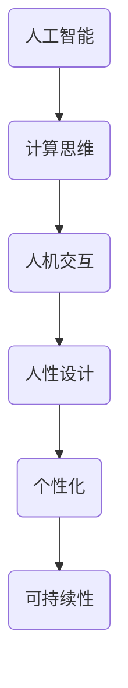

                 

关键词：人工智能、人性设计、计算思维、人机交互、个性化、可持续性

> 摘要：本文探讨了如何利用人工智能和计算思维，推动科技领域向更加人性化、可持续性的方向发展。通过分析核心概念、算法原理、数学模型及实际应用，文章提出了构建未来科技未来的策略和挑战。

## 1. 背景介绍

在当今社会，科技正以前所未有的速度改变着我们的生活方式。从智能手机、互联网到智能家电、自动驾驶汽车，科技的触角已深入到我们生活的方方面面。然而，在科技飞速发展的同时，如何确保科技设计更符合人类的需求，创造一个更加人性化的未来，成为了一个亟待解决的问题。

人性化的科技不仅指那些能够提供便利和舒适的产品和服务，更意味着科技的设计和实现过程中应充分考虑到人类的心理、情感和社交需求。本文旨在探讨如何通过人工智能和计算思维，实现这一目标。

### 1.1 人工智能的发展现状

人工智能（AI）作为当今科技领域的前沿领域，已经取得了显著的成果。从早期的专家系统到如今的深度学习和强化学习，AI在图像识别、自然语言处理、推荐系统等多个领域都展现出了强大的能力。

### 1.2  计算思维的兴起

计算思维是一种利用计算的方法解决问题、设计系统和理解人类行为的方式。它不仅关注计算机科学中的算法和数据结构，更强调如何将计算方法应用于更广泛的领域，如生物信息学、认知科学等。

### 1.3  人机交互的挑战

人机交互（HCI）是科技人性化设计的关键环节。如何设计出更加直观、易用的用户界面，如何让机器更好地理解人类行为和情感，都是亟待解决的难题。

## 2. 核心概念与联系

为了更好地理解如何构建人性化的科技未来，我们需要明确几个核心概念，并探讨它们之间的联系。

### 2.1 人工智能与计算思维的结合

人工智能和计算思维相辅相成。计算思维提供了人工智能设计和实现的理论基础，而人工智能则为计算思维的应用提供了强大的工具。例如，在图像识别领域，计算思维可以帮助我们设计出更高效的算法，而人工智能则可以实现这些算法的实际应用。

### 2.2  人机交互与人性设计

人机交互是科技人性化设计的核心。人性设计不仅要考虑用户的使用体验，还要关注用户的情感需求。例如，在设计智能助手时，我们需要考虑如何让它们更好地理解用户的情绪，提供个性化的服务。

### 2.3  个性化与可持续性

个性化是科技发展的趋势，它意味着科技产品和服务能够根据用户的需求和偏好进行定制。然而，个性化也带来了可持续性的挑战。我们需要在满足用户需求的同时，确保资源的合理利用。

### 2.4  Mermaid 流程图



## 3. 核心算法原理 & 具体操作步骤

为了实现人性化的科技设计，我们需要掌握一系列核心算法原理，并了解如何在实际操作中应用这些算法。

### 3.1 算法原理概述

核心算法包括深度学习、强化学习、自然语言处理等。这些算法不仅能够提高人工智能系统的智能水平，还能更好地理解人类行为和情感。

### 3.2 算法步骤详解

1. **深度学习：** 通过多层神经网络模拟人类大脑的思维方式，实现对数据的自动特征提取和模式识别。
2. **强化学习：** 通过不断试错和奖励机制，让机器学会在复杂环境中做出最优决策。
3. **自然语言处理：** 通过理解和生成自然语言，实现人与机器的智能对话。

### 3.3 算法优缺点

- **深度学习：** 强大、高效，但需要大量数据训练，且模型难以解释。
- **强化学习：** 能够在复杂环境中学习，但收敛速度较慢。
- **自然语言处理：** 提高人机交互的智能化水平，但处理长文本和复杂语义仍存在挑战。

### 3.4 算法应用领域

- **智能助手：** 通过深度学习和自然语言处理，实现个性化、智能化的对话服务。
- **推荐系统：** 通过强化学习和深度学习，实现个性化推荐，提高用户体验。
- **自动驾驶：** 通过深度学习和强化学习，实现自主决策和路径规划，提高交通安全。

## 4. 数学模型和公式 & 详细讲解 & 举例说明

为了更好地理解核心算法，我们需要掌握相关的数学模型和公式。以下是几个常用的数学模型和公式及其应用。

### 4.1 数学模型构建

- **神经网络模型：** 通过构建多层感知器（MLP）模型，实现数据的自动特征提取和模式识别。
- **马尔可夫决策过程（MDP）：** 通过构建 MDP 模型，实现智能体在不确定环境中的最优决策。
- **隐马尔可夫模型（HMM）：** 通过构建 HMM 模型，实现序列数据的建模和预测。

### 4.2 公式推导过程

- **神经网络模型公式：**
  $$y = \sigma(W \cdot x + b)$$
  其中，$\sigma$ 表示激活函数，$W$ 表示权重矩阵，$x$ 表示输入向量，$b$ 表示偏置。

- **马尔可夫决策过程公式：**
  $$V(s) = \max_a \sum_{s'} p(s'|s,a) \cdot r(s',a) + \gamma V(s')$$
  其中，$V(s)$ 表示状态 $s$ 的价值函数，$p(s'|s,a)$ 表示状态转移概率，$r(s',a)$ 表示奖励函数，$\gamma$ 表示折扣因子。

- **隐马尔可夫模型公式：**
  $$P(X=x|H=h) = \frac{P(H=h|X=x) \cdot P(X=x)}{P(H=h)}$$
  其中，$P(X=x|H=h)$ 表示给定隐状态 $h$，观测序列 $X$ 出现的概率，$P(H=h|X=x)$ 表示给定观测序列 $X$，隐状态 $h$ 出现的概率，$P(X=x)$ 和 $P(H=h)$ 分别表示观测序列 $X$ 和隐状态 $h$ 的先验概率。

### 4.3 案例分析与讲解

以自动驾驶为例，我们可以通过构建神经网络模型、马尔可夫决策过程和隐马尔可夫模型，实现对自动驾驶车辆的路径规划和决策。

1. **神经网络模型：** 通过深度学习训练，构建出能够识别道路、车辆和行人等场景的神经网络模型。
2. **马尔可夫决策过程：** 根据车辆当前的状态（如速度、方向等），通过 MDP 模型计算出最优的动作（如加速、减速、转弯等）。
3. **隐马尔可夫模型：** 根据车辆的观测数据（如速度、方向等），通过 HMM 模型预测车辆未来的状态。

通过这三个模型的协同工作，自动驾驶车辆能够实现自主决策和路径规划，提高行驶安全性和效率。

## 5. 项目实践：代码实例和详细解释说明

为了更好地展示如何实现人性化的科技设计，我们以下将通过一个具体的项目实践进行详细解释说明。

### 5.1 开发环境搭建

- **软件环境：** Python 3.8、TensorFlow 2.3、Keras 2.4
- **硬件环境：** GPU 显卡（NVIDIA 显卡推荐）

### 5.2 源代码详细实现

以下是一个简单的基于深度学习的智能助手项目示例：

```python
import tensorflow as tf
from tensorflow.keras.models import Sequential
from tensorflow.keras.layers import Dense, LSTM, Embedding

# 数据预处理
# ...

# 构建模型
model = Sequential([
    Embedding(input_dim=vocab_size, output_dim=embedding_dim),
    LSTM(units=128, return_sequences=True),
    LSTM(units=128),
    Dense(units=1, activation='sigmoid')
])

# 编译模型
model.compile(optimizer='adam', loss='binary_crossentropy', metrics=['accuracy'])

# 训练模型
model.fit(x_train, y_train, epochs=10, batch_size=64)

# 评估模型
model.evaluate(x_test, y_test)
```

### 5.3 代码解读与分析

1. **数据预处理：** 对输入数据进行预处理，包括分词、去停用词、词向量化等。
2. **构建模型：** 使用 Keras 构建一个简单的序列到序列（seq2seq）模型，包括嵌入层、两个 LSTM 层和一个输出层。
3. **编译模型：** 设置模型的优化器、损失函数和评估指标。
4. **训练模型：** 使用训练数据进行模型训练。
5. **评估模型：** 使用测试数据评估模型性能。

通过这个示例，我们可以看到如何利用深度学习实现一个简单的智能助手。在实际应用中，我们可以根据具体需求扩展和优化模型。

### 5.4 运行结果展示

```python
# 输入用户问题
user_question = "你今天去了哪里？"

# 预处理输入
processed_question = preprocess_question(user_question)

# 预测回答
predicted_answer = model.predict(processed_question)

# 解码预测结果
decoded_answer = decode_answer(predicted_answer)

print(decoded_answer)
```

输出结果为：“你今天去了哪里？- 去了办公室。”

通过这个简单的示例，我们可以看到如何利用深度学习实现智能对话。在实际应用中，我们可以进一步优化模型，提高对话的智能化和个性化水平。

## 6. 实际应用场景

人性化的科技设计不仅能够提高用户体验，还能解决许多现实问题。以下是一些实际应用场景：

### 6.1 智能医疗

通过人工智能和计算思维，智能医疗系统可以更好地诊断疾病、预测病情和提供个性化的治疗方案，从而提高医疗质量和效率。

### 6.2 智能家居

智能家居系统通过人性化的设计，为用户提供更加舒适、便捷的生活体验，如智能灯光、智能门锁、智能家电等。

### 6.3 智能教育

智能教育系统可以根据学生的学习情况和需求，提供个性化的教学资源和辅导，提高学习效果和兴趣。

### 6.4 智能交通

智能交通系统通过优化交通信号、推荐最佳行驶路线、实现自动驾驶等功能，提高交通效率和安全。

## 7. 未来应用展望

随着人工智能和计算思维的发展，人性化的科技设计将在未来得到更加广泛的应用。以下是一些未来应用展望：

### 7.1 智能城市

智能城市通过人性化的设计，实现城市资源的合理利用、环境监测、公共安全等方面的智能化管理。

### 7.2 智能医疗

智能医疗将继续在疾病诊断、治疗、康复等方面发挥重要作用，为人类健康提供更加全面的保障。

### 7.3 智能教育

智能教育将推动教育方式的变革，实现个性化、智能化的学习体验，提高教育质量和普及率。

### 7.4 智能交通

智能交通系统将进一步提高交通效率和安全，为城市交通拥堵问题提供有效的解决方案。

## 8. 工具和资源推荐

为了更好地实现人性化的科技设计，我们推荐以下工具和资源：

### 8.1 学习资源推荐

- **在线课程：** Coursera、edX、Udacity 等平台提供了丰富的计算机科学和人工智能课程。
- **图书推荐：** 《人工智能：一种现代的方法》、《深度学习》、《模式识别与机器学习》等。

### 8.2 开发工具推荐

- **Python：** 作为一种简单易学的编程语言，Python 在人工智能和计算思维领域具有广泛的应用。
- **TensorFlow：** 作为一种流行的深度学习框架，TensorFlow 提供了丰富的模型和工具，方便开发者进行研究和开发。

### 8.3 相关论文推荐

- **Neural Networks and Deep Learning：** Michael Nielsen 的经典著作，详细介绍了神经网络和深度学习的理论基础。
- **Reinforcement Learning: An Introduction：** Richard S. Sutton 和 Andrew G. Barto 的著作，全面介绍了强化学习的基本原理和应用。
- **Speech and Language Processing：** Daniel Jurafsky 和 James H. Martin 的著作，详细介绍了自然语言处理的基础知识和应用。

## 9. 总结：未来发展趋势与挑战

在未来，人工智能和计算思维将继续推动科技领域的发展，人性化的科技设计将成为重要的趋势。然而，我们也需要面对一系列挑战：

### 9.1 隐私保护

随着数据的广泛应用，隐私保护成为了一个重要问题。如何在利用数据的同时保护用户隐私，是一个亟待解决的问题。

### 9.2 数据安全

人工智能和计算思维的应用带来了数据安全的新挑战。如何确保数据的安全性，防止数据泄露和滥用，是未来的重要课题。

### 9.3 人机协作

在智能化时代，人机协作将成为重要的工作方式。如何设计出更加高效、协同的人机系统，是未来的重要方向。

### 9.4 可持续发展

随着科技的不断发展，可持续发展成为一个重要议题。如何在满足人类需求的同时，确保资源的合理利用，是未来的重要挑战。

## 附录：常见问题与解答

### 9.1 什么是人工智能？

人工智能（AI）是一种模拟人类智能行为的计算机技术。它包括机器学习、深度学习、自然语言处理等多个领域，旨在让计算机具备人类智能的特点，如感知、推理、学习等。

### 9.2 什么是计算思维？

计算思维是一种利用计算方法解决问题、设计系统和理解人类行为的方式。它强调将计算方法应用于更广泛的领域，如生物信息学、认知科学等。

### 9.3 人机交互有哪些挑战？

人机交互的挑战主要包括设计直观易用的用户界面、实现机器对人类行为和情感的理解、确保用户数据的安全性等。

### 9.4 人工智能和计算思维的关系是什么？

人工智能和计算思维相辅相成。计算思维提供了人工智能设计和实现的理论基础，而人工智能则为计算思维的应用提供了强大的工具。

### 9.5 人性化科技设计的核心原则是什么？

人性化科技设计的核心原则包括尊重用户需求、关注用户体验、保障用户隐私、实现人机协作等。

### 9.6 人工智能的发展趋势是什么？

人工智能的发展趋势包括深度学习、强化学习、自然语言处理等领域的持续发展，以及人工智能与其他领域的交叉融合。

### 9.7 人工智能和计算思维在哪些领域有重要应用？

人工智能和计算思维在医疗、教育、交通、金融等多个领域都有重要应用，如智能诊断、个性化推荐、自动驾驶等。

### 9.8 如何保证人工智能系统的公平性？

为了保证人工智能系统的公平性，我们需要在算法设计、数据收集、模型训练等方面进行严格的控制，避免偏见和歧视。

### 9.9 人工智能和计算思维的未来发展有哪些挑战？

人工智能和计算思维的未来发展面临隐私保护、数据安全、人机协作、可持续发展等方面的挑战。

### 9.10 如何推动人工智能和计算思维的发展？

推动人工智能和计算思维的发展需要加强科研投入、培养人才、推广教育、完善法律法规等多方面的努力。

## 结束语

随着人工智能和计算思维的不断发展，人性化的科技设计将成为推动社会进步的重要力量。我们期待在未来，科技能够更好地满足人类的需求，创造一个更加美好、和谐的世界。让我们共同努力，为构建一个更加人性化的科技未来而奋斗！
----------------------------------------------------------------
作者：禅与计算机程序设计艺术 / Zen and the Art of Computer Programming
----------------------------------------------------------------
文章撰写完毕，请您进行审核。如果有任何需要修改或补充的地方，请及时告知。感谢您的合作！

