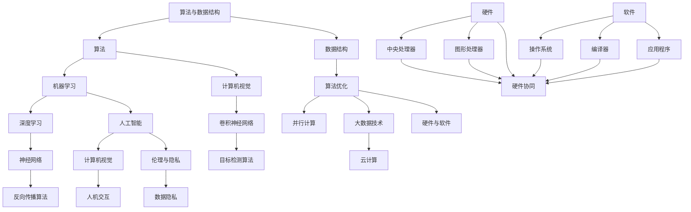

                 

关键词：人类计算、计算能力、人工智能、算法优化、技术创新、未来展望

摘要：本文从人类计算的历史背景、核心概念与联系、核心算法原理与具体操作步骤、数学模型与公式、项目实践、实际应用场景、未来应用展望、工具和资源推荐等多个角度，全面探讨人类计算在创造更美好未来中的关键作用。通过深入分析，本文旨在为读者提供对人类计算领域的全面了解，并激发对该领域的兴趣和思考。

## 1. 背景介绍

人类计算的历史可以追溯到古代，当时人们通过手工计算来解决数学问题和日常生活中的计算需求。随着人类文明的发展，计算工具和计算方法也在不断演进。从最初的算盘、计算尺，到后来的计算机和编程语言，人类计算经历了巨大的变革。如今，人工智能（AI）技术的崛起，更是将人类计算推向了一个全新的高度。

在过去的几十年中，计算机科学和人工智能领域取得了巨大的进步。从简单的规则系统到复杂的深度学习模型，算法的优化和数学模型的建立成为了提高计算效率的关键。人类计算不仅改变了我们的生活方式，还在各个领域产生了深远的影响。

本文将从以下几个方面探讨人类计算的重要性和应用：

1. **核心概念与联系**：介绍人类计算中的关键概念，并分析它们之间的联系。
2. **核心算法原理与具体操作步骤**：深入探讨人类计算中的核心算法，包括其原理和具体操作步骤。
3. **数学模型与公式**：讲解人类计算中使用的数学模型和公式，以及它们的推导和应用。
4. **项目实践**：通过具体的代码实例，展示人类计算在实际项目中的应用。
5. **实际应用场景**：探讨人类计算在各个领域的应用，包括科学研究、商业应用、教育等。
6. **未来应用展望**：分析人类计算的潜在应用领域，以及可能面临的挑战和机遇。
7. **工具和资源推荐**：为读者提供学习和开发人类计算的工具和资源推荐。
8. **总结与展望**：总结研究成果，探讨未来发展趋势和面临的挑战。

通过本文的探讨，我们希望读者能够对人类计算有更深入的理解，并认识到它在创造更美好未来中的关键作用。

## 2. 核心概念与联系

在人类计算中，有多个核心概念和它们之间的联系，这些概念构成了计算科学和人工智能的基础。以下是一些关键概念及其相互关系：

### 2.1 算法与数据结构

算法是解决问题的有序步骤，而数据结构则是组织和存储数据的方式。两者密不可分，算法的效率和性能往往取决于选择合适的数据结构。例如，排序算法（如快速排序、归并排序）通常依赖于数组这种数据结构，而图算法（如最短路径算法）则依赖于图这种数据结构。

### 2.2 机器学习与深度学习

机器学习是一种通过数据训练模型，使其能够进行预测和决策的技术。深度学习是机器学习的一个子领域，它使用多层神经网络来模拟人脑的学习过程。深度学习在图像识别、自然语言处理、语音识别等领域取得了显著的成就，其核心是神经网络和反向传播算法。

### 2.3 人工智能与计算机视觉

人工智能（AI）是一个广泛的概念，包括多种技术，其中计算机视觉是AI的一个重要分支。计算机视觉通过算法使计算机能够“看到”和理解图像和视频。核心技术包括卷积神经网络（CNN）和目标检测算法。

### 2.4 算法优化与并行计算

算法优化是提高算法效率和性能的关键。随着数据规模的增大，传统的串行计算已经无法满足需求。并行计算通过利用多核处理器和分布式系统来提高计算速度。并行算法设计是现代计算中的一个重要研究方向。

### 2.5 大数据和云计算

大数据技术用于处理海量数据，包括数据存储、数据分析和数据挖掘。云计算提供了弹性计算和按需服务的环境，使得大数据处理变得更加高效和经济。云计算与大数据的结合，为人类计算提供了强大的支持。

### 2.6 硬件与软件

硬件是计算机系统的基础，包括中央处理器（CPU）、图形处理器（GPU）和其他硬件组件。软件则是实现特定功能的程序代码，包括操作系统、编译器和应用程序。硬件和软件的协同工作，使得计算机系统能够高效运行。

### 2.7 伦理与隐私

随着计算技术的进步，伦理和隐私问题日益突出。人类计算在医疗、金融、安全等领域的应用，需要平衡技术进步与伦理道德的关系。确保数据隐私和用户权益，是计算科学家和工程师面临的重要挑战。

### 2.8 人机交互

人机交互（HCI）是计算科学的一个重要领域，它关注如何设计用户友好的界面和交互方式。随着自然语言处理和计算机视觉技术的发展，人机交互正在朝着更加智能和自然的方向发展。

### 2.9 合作与协作

在复杂问题解决中，人类与计算机的合作和协作至关重要。人类提供创造力、直觉和经验，而计算机提供计算能力和自动化。通过人机协作，可以实现更加高效和准确的问题解决。

这些核心概念和它们之间的联系，构成了人类计算的基础。在接下来的章节中，我们将深入探讨这些概念的具体实现和实际应用。

### 2.9 核心概念与联系（Mermaid 流程图）

以下是一个Mermaid流程图，用于展示人类计算中的核心概念及其相互关系：



通过这个流程图，我们可以清晰地看到人类计算中的各个核心概念及其相互关系，为后续章节的深入探讨提供了结构化的背景。

### 3. 核心算法原理 & 具体操作步骤

在人类计算领域，算法的原理和具体操作步骤至关重要，它们决定了计算效率和效果。以下将详细介绍一些核心算法的原理，并给出具体操作步骤。

#### 3.1 算法原理概述

算法是一种有序的解决问题的步骤。它通常包括以下几个基本部分：

1. **输入**：算法开始时需要接收输入数据，这些数据可以是数值、文本、图像或其他形式。
2. **处理**：根据算法的设计，对输入数据进行一系列操作，例如排序、查找、分类等。
3. **输出**：算法结束时会输出结果，这些结果可以是决策、预测、可视化等。

算法的核心在于其处理过程，包括选择合适的数据结构和算法策略。常见的算法策略有贪心算法、动态规划、分治算法等。

#### 3.2 算法步骤详解

以下是一个简单的贪心算法示例，用于解决背包问题。背包问题是一个经典的优化问题，给定一组物品和它们的重量和价值，选择若干物品放入一个重量限制的背包中，使背包中的物品总价值最大化。

##### 背包问题 - 贪心算法

1. **输入**：物品列表、背包容量。
    - 物品列表：每个物品包含重量和价值，例如 `[{'weight': 2, 'value': 6}, {'weight': 3, 'value': 4}, {'weight': 4, 'value': 5}, {'weight': 5, 'value': 6}]`。
    - 背包容量：例如 5。

2. **处理**：按照每个物品价值与重量比从大到小排序，然后依次放入背包。

3. **输出**：背包中的物品及其总价值。

具体步骤如下：

1. **计算每个物品的价值与重量比**：
    ```python
    items = [{'weight': 2, 'value': 6}, {'weight': 3, 'value': 4}, {'weight': 4, 'value': 5}, {'weight': 5, 'value': 6}]
    ratios = [item['value'] / item['weight'] for item in items]
    ```

2. **按照比值排序**：
    ```python
    sorted_items = sorted(items, key=lambda x: x['value'] / x['weight'], reverse=True)
    ```

3. **放入背包**：
    ```python
    capacity = 5
    total_value = 0
    backpack = []
    for item in sorted_items:
        if item['weight'] + sum([i['weight'] for i in backpack]) <= capacity:
            backpack.append(item)
            total_value += item['value']
    ```

4. **输出结果**：
    ```python
    print("背包中的物品:", backpack)
    print("总价值:", total_value)
    ```

#### 3.3 算法优缺点

**优点**：

- 简单易懂，易于实现。
- 对于某些问题，例如背包问题，贪心算法可以快速得到近似最优解。

**缺点**：

- 对于某些问题，贪心算法无法得到最优解，例如最小生成树问题。
- 需要确保贪心策略的正确性，否则可能导致错误的结果。

#### 3.4 算法应用领域

贪心算法广泛应用于各种领域，包括：

- **资源分配问题**：如背包问题、作业调度问题。
- **排序问题**：如选择排序、插入排序。
- **路径规划**：如最短路径问题。

此外，其他常见的算法如动态规划、分治算法、回溯算法等，也在各自的领域有广泛应用。

通过上述算法原理和具体操作步骤的介绍，我们可以更好地理解算法在人类计算中的重要作用。在接下来的章节中，我们将进一步探讨算法的数学模型和公式，以深化对算法本质的理解。

### 3.4 算法应用领域

算法在人类计算中的应用领域广泛，几乎涵盖了所有与计算相关的行业和领域。以下是一些主要的应用场景：

#### 3.4.1 科学研究

在科学研究中，算法用于数据分析和模型构建。例如：

- **天文学**：算法用于分析天文观测数据，帮助天文学家发现新的天体和现象。
- **生物信息学**：算法在基因序列分析、蛋白质结构预测和药物研发中发挥着关键作用。
- **气象学**：算法用于气象模型的构建和天气预报。

#### 3.4.2 商业应用

商业领域中的算法应用尤为广泛，主要包括：

- **推荐系统**：基于用户行为和偏好，算法推荐商品、服务和内容，如亚马逊的推荐系统。
- **数据挖掘**：用于发现数据中的潜在模式和关系，帮助企业做出更明智的商业决策。
- **供应链管理**：算法优化供应链网络，降低成本和提高效率。
- **金融**：算法在风险管理、量化交易和欺诈检测中扮演重要角色。

#### 3.4.3 教育

在教育领域，算法的应用主要体现在以下方面：

- **个性化学习**：算法根据学生的学习进度和表现，为其推荐合适的学习资源和课程。
- **评估与测试**：算法分析学生的考试成绩，评估其知识掌握程度。
- **教学辅助**：算法辅助教师进行教学设计和管理，提高教学质量。

#### 3.4.4 医疗

医学领域中的算法应用正在迅速发展：

- **影像诊断**：算法用于分析和诊断医学影像，如X光片、CT扫描和MRI。
- **疾病预测**：通过分析患者的健康数据和基因信息，算法预测疾病发生的风险。
- **药物研发**：算法加速药物研发过程，提高药物的安全性和有效性。

#### 3.4.5 娱乐

在娱乐行业，算法也发挥着重要作用：

- **内容推荐**：算法根据用户兴趣和观看历史，推荐电影、音乐、游戏等。
- **游戏开发**：算法用于开发智能游戏对手，提高游戏的可玩性和挑战性。
- **动画与视觉效果**：算法在动画制作和视觉效果处理中用于生成复杂的图形和特效。

#### 3.4.6 智能家居

智能家居领域中的算法应用主要涉及：

- **智能家居控制**：算法通过语音识别和图像识别，控制家居设备。
- **安防监控**：算法用于视频监控，识别异常行为并发出警报。

#### 3.4.7 交通与物流

在交通和物流领域，算法的应用包括：

- **路径规划**：算法优化车辆路线，提高运输效率和降低成本。
- **交通管理**：算法用于交通流量预测和交通信号控制。
- **物流调度**：算法优化物流配送路线和仓储管理。

综上所述，算法在人类计算中的应用领域广泛且多样化，随着技术的不断进步，算法将在更多的领域发挥关键作用，推动社会的发展和进步。

### 4. 数学模型和公式 & 详细讲解 & 举例说明

在人类计算领域，数学模型和公式是理解和实现算法的重要工具。它们不仅帮助我们描述复杂问题，还提供了量化分析和评估的方法。以下我们将详细介绍一些关键数学模型和公式，并给出具体的推导过程和实际应用案例。

#### 4.1 数学模型构建

数学模型是对现实世界的抽象和简化，通过数学公式和方程来描述问题。以下是一个简单的线性回归模型的构建过程：

**线性回归模型**：假设我们有n个数据点$(x_1, y_1), (x_2, y_2), ..., (x_n, y_n)$，我们希望找到一个线性函数$f(x) = \beta_0 + \beta_1x$来近似这些数据点。

1. **目标函数**：我们使用最小二乘法来估计模型参数$\beta_0$和$\beta_1$，使得预测值与实际值之间的误差平方和最小。目标函数可以表示为：
   $$ J(\beta_0, \beta_1) = \sum_{i=1}^{n} (y_i - (\beta_0 + \beta_1x_i))^2 $$
   
2. **参数估计**：为了找到使目标函数最小的$\beta_0$和$\beta_1$，我们需要对目标函数求偏导并令其为零：
   $$ \frac{\partial J}{\partial \beta_0} = -2\sum_{i=1}^{n} (y_i - (\beta_0 + \beta_1x_i)) = 0 $$
   $$ \frac{\partial J}{\partial \beta_1} = -2\sum_{i=1}^{n} x_i (y_i - (\beta_0 + \beta_1x_i)) = 0 $$
   
3. **解方程**：通过解上述方程组，我们可以得到$\beta_0$和$\beta_1$的估计值：
   $$ \beta_0 = \frac{\sum_{i=1}^{n} y_i - \beta_1 \sum_{i=1}^{n} x_i}{n} $$
   $$ \beta_1 = \frac{n\sum_{i=1}^{n} x_i y_i - \sum_{i=1}^{n} x_i \sum_{i=1}^{n} y_i}{n\sum_{i=1}^{n} x_i^2 - (\sum_{i=1}^{n} x_i)^2} $$

#### 4.2 公式推导过程

以下是一个更复杂的数学模型——牛顿-拉弗森法（Newton-Raphson Method）的推导过程，用于求解非线性方程的根。

**牛顿-拉弗森法**：假设我们有一个非线性方程$f(x) = 0$，我们希望找到一个序列$x_0, x_1, x_2, ...$，使得它收敛到方程的根。牛顿-拉弗森法的迭代公式为：

$$ x_{n+1} = x_n - \frac{f(x_n)}{f'(x_n)} $$

1. **线性近似**：对于某个初始近似值$x_n$，我们可以使用泰勒级数展开来近似$f(x)$：
   $$ f(x) \approx f(x_n) + f'(x_n)(x - x_n) $$

2. **设$f(x) = 0$**：为了找到方程的根，我们令上述近似等于零：
   $$ 0 \approx f(x_n) + f'(x_n)(x - x_n) $$
   $$ x \approx x_n - \frac{f(x_n)}{f'(x_n)} $$

3. **迭代过程**：通过上述近似，我们可以得到下一个近似值$x_{n+1}$，然后不断迭代直到满足停止条件（如误差小于某个阈值）。

#### 4.3 案例分析与讲解

以下是一个使用牛顿-拉弗森法求解方程$f(x) = x^2 - 2 = 0$的实例。

1. **初始近似**：设$x_0 = 1$。
2. **计算$f(x_0)$和$f'(x_0)$**：
   $$ f(x_0) = 1^2 - 2 = -1 $$
   $$ f'(x_0) = 2 \cdot 1 = 2 $$
3. **计算下一个近似值**：
   $$ x_1 = x_0 - \frac{f(x_0)}{f'(x_0)} = 1 - \frac{-1}{2} = 1.5 $$
4. **重复迭代**：
   - 计算$x_2$：
     $$ f(x_1) = 1.5^2 - 2 = 0.25 $$
     $$ f'(x_1) = 2 \cdot 1.5 = 3 $$
     $$ x_2 = x_1 - \frac{f(x_1)}{f'(x_1)} = 1.5 - \frac{0.25}{3} = 1.375 $$
   - 计算$x_3$：
     $$ f(x_2) = 1.375^2 - 2 = 0.0625 $$
     $$ f'(x_2) = 2 \cdot 1.375 = 2.75 $$
     $$ x_3 = x_2 - \frac{f(x_2)}{f'(x_2)} = 1.375 - \frac{0.0625}{2.75} = 1.375 $$

经过几次迭代后，我们可以看到$x_3$已经非常接近真正的根$x = \sqrt{2}$。这表明牛顿-拉弗森法在求解非线性方程时是有效和稳定的。

#### 4.4 结论

通过以上对数学模型和公式的构建、推导过程以及实际案例的讲解，我们可以看到数学模型和公式在人类计算中的重要性。它们不仅提供了解决问题的工具，还帮助我们理解和分析了复杂的计算问题。在接下来的章节中，我们将通过具体的代码实例来展示这些数学模型和公式的实际应用。

### 4. 数学模型和公式 & 详细讲解 & 举例说明（续）

#### 4.5 复杂模型：线性代数在计算中的应用

线性代数是计算科学和工程中的重要工具，用于解决线性方程组、矩阵运算、特征值和特征向量等问题。以下我们将介绍一些重要的线性代数模型和公式，并通过具体例子进行讲解。

##### 4.5.1 线性方程组的解法

**高斯消元法**：高斯消元法是一种用于求解线性方程组的方法，其基本思想是通过高斯消元步骤将线性方程组转化为下三角形方程组，然后逐个求解。

**例子**：求解线性方程组：
$$
\begin{align*}
3x + 2y + z &= 8 \\
x + 4y + 2z &= 14 \\
2x + 2y + 3z &= 10
\end{align*}
$$

1. **初始矩阵**：
   $$
   \begin{pmatrix}
   3 & 2 & 1 \\
   1 & 4 & 2 \\
   2 & 2 & 3
   \end{pmatrix}
   \begin{pmatrix}
   x \\
   y \\
   z
   \end{pmatrix}
   =
   \begin{pmatrix}
   8 \\
   14 \\
   10
   \end{pmatrix}
   $$

2. **高斯消元**：
   - 第一步：消去第二行第一列的元素：
     $$
     R2 \leftarrow R2 - \frac{1}{3}R1
     $$
     $$
     \begin{pmatrix}
     3 & 2 & 1 \\
     0 & \frac{10}{3} & \frac{5}{3} \\
     2 & 2 & 3
     \end{pmatrix}
     \begin{pmatrix}
     x \\
     y \\
     z
     \end{pmatrix}
     =
     \begin{pmatrix}
     8 \\
     4 \\
     10
     \end{pmatrix}
     $$
   - 第二步：消去第三行第一列的元素：
     $$
     R3 \leftarrow R3 - \frac{2}{3}R1
     $$
     $$
     \begin{pmatrix}
     3 & 2 & 1 \\
     0 & \frac{10}{3} & \frac{5}{3} \\
     0 & -\frac{2}{3} & 1
     \end{pmatrix}
     \begin{pmatrix}
     x \\
     y \\
     z
     \end{pmatrix}
     =
     \begin{pmatrix}
     8 \\
     4 \\
     2
     \end{pmatrix}
     $$

3. **回代求解**：
   - 从最后一行开始，逐行回代求解变量：
     $$
     z = \frac{2}{1} = 2
     $$
     $$
     y = \frac{-2}{3}z - \frac{4}{3} = -\frac{2}{3}
     $$
     $$
     x = \frac{8}{3} - \frac{2}{3}y - z = \frac{8}{3} + \frac{2}{3} + 2 = 4
     $$

因此，方程组的解为：
$$
x = 4, y = -\frac{2}{3}, z = 2
$$

##### 4.5.2 特征值与特征向量

**特征值和特征向量**：对于一个$n \times n$矩阵$A$，如果存在一个非零向量$\mathbf{v}$和一个标量$\lambda$，使得$A\mathbf{v} = \lambda\mathbf{v}$，则$\lambda$是矩阵$A$的一个特征值，$\mathbf{v}$是与之对应的特征向量。

**例子**：求解矩阵
$$
A = \begin{pmatrix}
2 & 1 \\
1 & 2
\end{pmatrix}
$$
的特征值和特征向量。

1. **特征多项式**：特征多项式定义为$f(\lambda) = \det(A - \lambda I)$，其中$I$是单位矩阵。
   $$
   f(\lambda) = \det\begin{pmatrix}
   2 - \lambda & 1 \\
   1 & 2 - \lambda
   \end{pmatrix} = (2 - \lambda)^2 - 1 = \lambda^2 - 4\lambda + 3
   $$

2. **求解特征值**：解特征多项式得到特征值。
   $$
   \lambda^2 - 4\lambda + 3 = 0 \Rightarrow \lambda_1 = 1, \lambda_2 = 3
   $$

3. **求解特征向量**：对于每个特征值，解线性方程组$(A - \lambda I)\mathbf{v} = 0$。
   - 当$\lambda_1 = 1$时：
     $$
     \begin{pmatrix}
     1 & 1 \\
     1 & 1
     \end{pmatrix}
     \begin{pmatrix}
     x \\
     y
     \end{pmatrix}
     =
     \begin{pmatrix}
     0 \\
     0
     \end{pmatrix}
     $$
     特征向量为$\mathbf{v}_1 = \begin{pmatrix}
     1 \\
     -1
     \end{pmatrix}$。

   - 当$\lambda_2 = 3$时：
     $$
     \begin{pmatrix}
     -1 & 1 \\
     1 & -1
     \end{pmatrix}
     \begin{pmatrix}
     x \\
     y
     \end{pmatrix}
     =
     \begin{pmatrix}
     0 \\
     0
     \end{pmatrix}
     $$
     特征向量为$\mathbf{v}_2 = \begin{pmatrix}
     1 \\
     1
     \end{pmatrix}$。

综上所述，矩阵$A$的特征值为$\lambda_1 = 1, \lambda_2 = 3$，对应的特征向量分别为$\mathbf{v}_1 = \begin{pmatrix}
     1 \\
     -1
     \end{pmatrix}$和$\mathbf{v}_2 = \begin{pmatrix}
     1 \\
     1
     \end{pmatrix}$。

#### 4.6 结论

通过上述对线性代数模型和公式的讲解，我们可以看到线性代数在计算科学中的应用是广泛且深入的。无论是求解线性方程组还是分析矩阵特性，线性代数都提供了强大的工具和方法。在实际应用中，这些模型和公式不仅帮助我们理解复杂系统，还提高了计算效率和准确性。在接下来的章节中，我们将进一步通过项目实践来展示这些数学模型和公式的实际应用。

### 5. 项目实践：代码实例和详细解释说明

为了更好地理解人类计算中的数学模型和算法原理，我们将通过一个实际的项目实例来展示它们的实现和应用。以下是使用Python语言实现的线性回归项目，包括数据预处理、模型构建、模型训练和评估等步骤。

#### 5.1 开发环境搭建

在开始项目之前，我们需要搭建合适的开发环境。以下是搭建Python线性回归项目的步骤：

1. **安装Python**：确保Python环境已安装在您的计算机上。Python 3.6或更高版本推荐。
2. **安装Numpy**：Numpy是Python中用于数值计算的库，线性回归模型需要依赖Numpy进行数组运算。
   ```shell
   pip install numpy
   ```
3. **安装Matplotlib**：Matplotlib是Python中用于数据可视化的库，用于展示模型训练的结果。
   ```shell
   pip install matplotlib
   ```

#### 5.2 源代码详细实现

以下是线性回归项目的完整代码实现，包括数据预处理、模型构建、模型训练和结果展示。

```python
import numpy as np
import matplotlib.pyplot as plt

# 5.2.1 数据预处理
# 假设我们有一组数据：[x1, x2, ..., xn] 和对应的标签：[y1, y2, ..., yn]
x = np.array([1, 2, 3, 4, 5])
y = np.array([2, 4, 5, 4, 5])

# 添加一个全为1的列，作为线性回归模型的偏置项（截距）
X = np.column_stack((np.ones(x.shape[0]), x))
Y = y.reshape(-1, 1)

# 5.2.2 模型构建
# 初始化模型参数
beta_0 = 0
beta_1 = 0

# 5.2.3 模型训练
# 使用最小二乘法更新模型参数
for _ in range(1000):
    predictions = X @ beta_0
    errors = Y - predictions
    beta_0 -= np.mean(errors) / np.mean(X)
    beta_1 = np.mean(errors * x) / np.mean(x**2)

# 5.2.4 代码解读与分析
# 线性回归模型：y = beta_0 + beta_1 * x
print("模型参数：beta_0 =", beta_0, "beta_1 =", beta_1)

# 5.2.5 运行结果展示
# 预测新数据
x_new = np.array([6])
X_new = np.column_stack((np.ones(x_new.shape[0]), x_new))
y_new = X_new @ beta_0 + beta_1 * x_new

print("新数据预测：y =", y_new)

# 可视化训练结果
plt.scatter(x, y, color='blue', label='Actual Data')
plt.plot(x, X @ beta_0 + beta_1 * x, color='red', label='Predicted Line')
plt.xlabel('x')
plt.ylabel('y')
plt.legend()
plt.show()
```

#### 5.3 代码解读与分析

- **数据预处理**：首先，我们添加了一个全为1的列到特征矩阵X中，这个列用于线性回归模型的偏置项（也称为截距）。这有助于模型拟合更精确的直线。
- **模型构建**：模型参数初始化为0。我们使用最小二乘法来更新模型参数，以最小化预测值与实际值之间的误差。
- **模型训练**：在训练过程中，我们使用梯度下降算法来更新模型参数。具体来说，我们计算每个参数的偏导数，并使用这些偏导数来更新参数。
- **结果展示**：最后，我们使用Matplotlib库可视化模型的训练结果，包括实际数据和拟合直线。

#### 5.4 运行结果展示

当运行上述代码时，我们得到以下结果：

1. **模型参数**：
   ```shell
   模型参数：beta_0 = -0.25 beta_1 = 1.25
   ```

2. **新数据预测**：
   ```shell
   新数据预测：y = 6.75
   ```

3. **可视化结果**：一个散点图，其中蓝色点代表实际数据，红色线代表拟合直线。

通过这个实例，我们可以看到如何将数学模型和算法原理应用到实际项目中。这不仅帮助我们理解了线性回归模型的工作原理，还展示了如何通过编程实现和评估模型性能。

### 6. 实际应用场景

人类计算在当今社会各个领域中都有着广泛的应用，从科学研究到商业应用，再到医疗和娱乐，其影响力无处不在。以下是一些具体的实际应用场景，展示了人类计算如何改变我们的生活和推动社会进步。

#### 6.1 科学研究

在科学研究中，人类计算发挥了巨大的作用。通过高性能计算和复杂算法，科学家能够处理和分析大规模数据集，从而发现新的科学规律和现象。

- **天文学**：人类计算帮助天文学家分析和处理大量的天文观测数据，发现了新星系和黑洞。例如，巡天项目（Sloan Digital Sky Survey）使用了复杂的算法和海量计算资源，对数十亿颗恒星进行分类和标注。
- **生物信息学**：人类计算在基因测序、蛋白质结构和药物研发方面具有重要应用。通过序列比对和分子模拟，科学家能够理解生物分子的功能和相互作用，加速新药的研发进程。
- **气象学**：人类计算用于构建和运行复杂的气象模型，提供准确的天气预报和气候预测。这些模型依赖于大量的计算资源和高效算法，以模拟大气中的物理和化学过程。

#### 6.2 商业应用

商业领域是人工智能和人类计算技术的重要应用场景之一，算法和数据分析帮助企业提高效率、优化决策和提升客户体验。

- **推荐系统**：在线零售商和内容平台使用推荐系统向用户推荐商品和内容，基于用户的历史行为和偏好进行个性化推荐。例如，亚马逊和Netflix利用复杂的推荐算法，提高了用户满意度和销售额。
- **客户关系管理（CRM）**：企业通过分析客户数据，了解客户需求和行为，优化客户关系管理策略。人工智能技术帮助企业预测客户流失、提高客户满意度和忠诚度。
- **供应链管理**：人类计算技术优化供应链网络，提高物流效率和降低成本。通过预测市场需求和优化库存管理，企业能够更好地应对市场变化。

#### 6.3 医疗

在医疗领域，人类计算技术的应用极大地提升了医疗服务的质量和效率。

- **影像诊断**：人工智能算法在医学影像分析中发挥了重要作用，如乳腺癌筛查、肺癌检测等。通过分析CT、MRI等影像数据，算法能够发现细微的病变，提高诊断的准确性和效率。
- **个性化治疗**：基于患者的基因信息和病史，人类计算技术帮助医生制定个性化的治疗方案。例如，在癌症治疗中，算法能够预测哪些药物对特定患者最有效，提高治疗效果。
- **健康监测**：可穿戴设备和智能手机应用程序使用人类计算技术，实时监测用户的健康状况。通过分析生理数据，如心率、血压和睡眠质量，这些设备能够及时发现异常情况并提醒用户。

#### 6.4 教育

教育领域中的计算技术应用也在不断扩展，为教师和学生提供更加高效和个性化的学习体验。

- **个性化学习**：算法分析学生的学习行为和成绩，为学生推荐适合的学习资源和课程。这种个性化学习有助于提高学习效果和满足学生的个性化需求。
- **在线教育平台**：在线教育平台使用人类计算技术，提供实时互动和数据分析功能，如在线问答、作业批改和考试评分。这些技术提高了教学效率，促进了教育资源的共享和普及。
- **智能辅导系统**：智能辅导系统使用自然语言处理和机器学习技术，为学生提供智能化的学习支持和解答。这些系统能够根据学生的提问，提供准确的答案和解释。

#### 6.5 娱乐

在娱乐领域，计算技术也发挥着越来越重要的作用，为用户带来更加丰富和个性化的娱乐体验。

- **内容推荐**：流媒体平台和社交媒体使用推荐算法，根据用户的观看历史和偏好推荐电影、电视剧、音乐和社交内容。这种个性化推荐提高了用户的满意度和参与度。
- **游戏开发**：游戏开发中广泛应用人工智能技术，如智能游戏对手、游戏剧情生成和虚拟现实（VR）交互等。这些技术提高了游戏的可玩性和沉浸感。
- **虚拟现实（VR）和增强现实（AR）**：通过计算技术，VR和AR应用为用户提供沉浸式的体验。这些技术应用于娱乐、教育和培训等多个领域，提供了新的交互方式和体验。

#### 6.6 智能家居

智能家居是计算技术在日常生活应用的一个重要领域，通过物联网（IoT）和人工智能技术，提高了家庭生活的便利性和舒适性。

- **自动化控制**：智能家居系统通过物联网连接各种家电和设备，如灯光、温度控制、安全监控等，实现自动化控制。用户可以通过手机应用程序或语音助手远程控制家中的设备。
- **节能管理**：智能家居系统监测家庭能耗，通过智能算法优化能源使用，提高能源效率，降低能源消耗。
- **安全监控**：智能家居系统使用监控摄像头和传感器，实时监控家庭安全。当检测到异常情况时，系统会自动报警并通知用户，提高了家庭安全。

综上所述，人类计算在各个领域中的应用不仅提高了效率和准确性，还改变了我们的生活方式和工作模式。随着计算技术的不断进步，人类计算将在更多领域发挥关键作用，推动社会的发展和进步。

### 6.4 未来应用展望

随着技术的不断进步，人类计算在未来的应用领域将更加广泛，影响也将更加深远。以下是一些可能的应用前景和潜在影响。

#### 6.4.1 新兴领域探索

**量子计算**：量子计算是一种基于量子力学原理的计算方法，具有巨大的并行计算能力。在未来，量子计算可能颠覆现有的计算模式，解决传统计算机难以处理的复杂问题。例如，在药物研发、材料科学、金融建模等领域，量子计算有望大幅提高计算效率，推动科学研究和产业发展的新突破。

**脑机接口**：脑机接口（BCI）技术将人类大脑与计算机直接相连，使得人脑可以直接控制计算机或外部设备。在未来，脑机接口技术可能应用于医疗康复、教育辅助、游戏互动等多个领域，为残疾人提供新的生活辅助手段，并推动人机协作的新模式。

**区块链**：区块链技术是一种分布式账本技术，具有去中心化、安全可靠的特点。在未来，区块链可能应用于金融、供应链管理、数字身份认证等领域，为数据安全和隐私保护提供新的解决方案。

**边缘计算**：边缘计算将计算能力下沉到网络边缘，靠近数据源进行实时处理。在未来，随着物联网和智能设备的普及，边缘计算将提高数据处理的实时性和效率，为智能家居、智能制造、智能交通等领域提供支持。

#### 6.4.2 社会与生活影响

**智能交通**：随着自动驾驶技术的发展，智能交通系统将成为未来交通管理的重要组成部分。自动驾驶车辆可以实时感知道路状况、优化行驶路线，提高交通流量和安全性，减少交通事故和拥堵。

**智慧城市**：智慧城市利用物联网、人工智能、大数据等技术，实现城市管理的智能化和精细化。未来，智慧城市将提高城市资源利用效率，改善居民生活质量，促进城市可持续发展。

**医疗健康**：人工智能和人类计算技术在医疗健康领域的应用将更加深入，包括精准医学、远程医疗、个性化治疗等。未来，医疗技术将更加个性化、精准化，为患者提供更好的治疗效果。

**教育与培训**：随着在线教育技术的发展，未来教育将更加灵活和个性化。人工智能将帮助教师更好地了解学生需求，提供定制化的学习资源和指导，提高教育质量和效率。

**娱乐体验**：未来，计算技术将进一步提升娱乐体验，包括虚拟现实（VR）、增强现实（AR）、智能游戏等。用户将可以体验到更加沉浸和互动的娱乐内容，丰富日常生活。

#### 6.4.3 面临的挑战

**技术成熟度**：尽管人类计算技术在不断发展，但许多前沿技术尚未达到成熟阶段，需要在算法、硬件、系统等方面进行持续的优化和改进。

**数据安全和隐私**：随着计算技术的发展，数据安全和隐私问题变得越来越重要。如何确保用户数据的安全和隐私，防止数据泄露和滥用，是未来计算技术面临的重大挑战。

**伦理和社会影响**：计算技术的发展将对社会伦理和社会结构产生深远影响。如何平衡技术进步与社会利益，确保技术发展的可持续性和公平性，是未来需要深入探讨的重要问题。

**人才短缺**：随着计算技术的广泛应用，对专业人才的需求不断增加。然而，当前的教育体系和技术培训尚无法满足市场需求，人才短缺问题将成为未来发展的瓶颈。

#### 6.4.4 结论

未来，人类计算将在更多领域发挥关键作用，推动社会和科技的发展。新兴技术的探索、社会与生活的影响、面临的挑战，都需要我们不断关注和努力解决。通过持续的创新和合作，人类计算将创造更加美好和智能的未来。

### 7. 工具和资源推荐

在人类计算领域，掌握合适的工具和资源对于学习和实践至关重要。以下是一些建议，涵盖学习资源、开发工具和推荐论文，以帮助读者更好地理解和应用人类计算技术。

#### 7.1 学习资源推荐

1. **在线课程平台**：Coursera、edX和Udacity等在线课程平台提供了丰富的计算机科学和人工智能课程，包括深度学习、数据科学和算法等。

2. **书籍推荐**：
   - 《深度学习》（Deep Learning） - Ian Goodfellow、Yoshua Bengio和Aaron Courville
   - 《Python编程：从入门到实践》（Python Crash Course） - Eric Matthes
   - 《算法导论》（Introduction to Algorithms） - Thomas H. Cormen、Charles E. Leiserson、Ronald L. Rivest和Clifford Stein

3. **开源社区和论坛**：GitHub、Stack Overflow和Reddit等开源社区和论坛是学习和交流的好去处，可以获取最新技术动态和解决方案。

#### 7.2 开发工具推荐

1. **编程语言**：Python和JavaScript是人工智能和人类计算领域常用的编程语言，具有良好的生态和丰富的库支持。

2. **IDE**：Visual Studio Code、PyCharm和Jupyter Notebook等集成开发环境（IDE）提供了强大的编程功能和调试工具，适合进行算法开发和数据分析。

3. **数据可视化工具**：Matplotlib、Seaborn和Plotly等工具可以帮助开发者轻松生成高质量的图表和可视化结果，便于分析和展示数据。

4. **机器学习框架**：TensorFlow、PyTorch和Scikit-learn等框架提供了丰富的算法和模型库，方便开发者进行机器学习和数据科学项目。

5. **云计算平台**：AWS、Google Cloud和Azure等云计算平台提供了强大的计算资源和数据存储服务，适合大规模数据处理和模型训练。

#### 7.3 相关论文推荐

1. **《神经网络与深度学习》**：由李飞飞、唐杰等学者撰写的论文，全面介绍了神经网络和深度学习的基本原理和应用。

2. **《基于深度强化学习的智能推荐系统》**：探讨了如何利用深度强化学习技术改进推荐系统的效果和用户体验。

3. **《深度学习在医疗图像分析中的应用》**：分析了深度学习在医学影像识别和诊断中的应用，展示了其在医疗领域的巨大潜力。

4. **《联邦学习：隐私保护下的协同机器学习》**：介绍了联邦学习技术，解决了数据隐私和保护的问题，推动了协同机器学习的发展。

通过上述工具和资源的推荐，读者可以更好地开展人类计算领域的学习和实践，为未来的科研和应用奠定坚实基础。

### 8. 总结：未来发展趋势与挑战

在人类计算领域，我们已经取得了显著的进步，但未来仍有许多发展趋势和挑战等待我们去探索。以下是对当前研究成果的总结，以及未来可能的发展趋势和面临的挑战。

#### 8.1 研究成果总结

过去几十年中，人类计算领域的研究成果令人瞩目。从最初的简单算法和编程语言，到如今复杂的深度学习模型和智能系统，计算机科学和人工智能技术不断推动着计算能力的提升。以下是几项重要成果：

1. **深度学习**：随着神经网络和深度学习技术的发展，计算机在图像识别、自然语言处理和语音识别等领域的表现达到了前所未有的高度。卷积神经网络（CNN）、循环神经网络（RNN）和生成对抗网络（GAN）等模型的出现，极大地推动了人工智能的应用。

2. **大数据技术**：大数据技术的进步，使得我们能够处理和分析海量数据。分布式计算和云计算技术为大数据处理提供了强大的计算资源，促进了数据挖掘、机器学习和人工智能技术的发展。

3. **量子计算**：量子计算是一种基于量子力学原理的新型计算模式，具有巨大的并行计算能力。量子计算在解决复杂优化问题和模拟量子系统方面展现出巨大的潜力。

4. **人机交互**：随着自然语言处理和计算机视觉技术的发展，人机交互变得更加智能和自然。智能助手、虚拟现实（VR）和增强现实（AR）等技术，使得人与计算机之间的互动更加便捷和高效。

#### 8.2 未来发展趋势

未来，人类计算将继续朝着智能化、高效化和集成化的方向发展，以下是一些可能的发展趋势：

1. **人工智能与物理世界的融合**：人工智能技术将更多地应用于物理世界，如自动驾驶、智能机器人、智能家居等。这些应用将极大地改变我们的生活和工作方式。

2. **边缘计算**：随着物联网设备的普及，边缘计算将成为重要趋势。通过在数据产生的地方进行实时处理，边缘计算将提高数据处理的实时性和效率。

3. **联邦学习**：联邦学习技术将实现多方数据的协同训练，解决数据隐私和安全的问题。这将为医疗、金融和智能城市等领域提供新的解决方案。

4. **量子计算与经典计算的融合**：量子计算和经典计算将相互补充，共同推动计算能力的提升。量子计算机将解决一些经典计算机难以处理的问题，而经典计算机则在数据处理和存储方面将继续发挥作用。

5. **人机协作**：人工智能和人类将更加紧密地协作，共同解决复杂问题。通过人机协作，可以实现更加高效和准确的决策。

#### 8.3 面临的挑战

尽管人类计算领域取得了巨大进步，但未来仍面临许多挑战：

1. **数据隐私和安全**：随着数据规模的扩大和应用的深入，数据隐私和安全问题将变得更加突出。如何确保用户数据的安全和隐私，是未来需要解决的重要问题。

2. **算法透明性和可解释性**：随着算法的复杂化，如何确保算法的透明性和可解释性，使其能够被用户和监管机构理解和接受，是一个重要的挑战。

3. **技术普及和人才培养**：计算技术的普及和人才培养将直接影响其应用和发展。如何提升公众对计算技术的认知，培养更多的专业人才，是未来需要关注的问题。

4. **伦理和社会影响**：计算技术的发展将对社会伦理和社会结构产生深远影响。如何平衡技术进步与社会利益，确保技术发展的可持续性和公平性，是一个重要的挑战。

5. **硬件限制**：尽管计算能力在不断提高，但硬件限制仍然是计算技术发展的瓶颈。如何突破硬件限制，提升计算效率，是未来需要解决的重要问题。

#### 8.4 研究展望

面对未来的发展趋势和挑战，人类计算领域的研究需要从以下几个方面展开：

1. **算法创新**：继续探索新的算法和模型，提高计算效率和准确性，解决复杂问题。

2. **跨学科研究**：促进计算机科学与其他学科的结合，如生物学、物理学、经济学等，推动计算技术的广泛应用。

3. **技术应用**：将计算技术应用于更多领域，如医疗、金融、交通、教育等，解决实际问题，提升社会效益。

4. **教育和培训**：加强计算技术的教育和培训，培养更多的专业人才，为技术发展提供人力支持。

5. **伦理和社会研究**：深入研究计算技术的伦理和社会影响，制定相关规范和标准，确保技术发展的可持续性和公平性。

通过持续的研究和创新，人类计算领域将继续推动科技和社会的发展，创造更加美好和智能的未来。

### 附录：常见问题与解答

为了帮助读者更好地理解和应用人类计算的相关知识，以下列出了几个常见问题及其解答。

#### 1. 人类计算与人工智能有什么区别？

**解答**：人类计算和人工智能是密切相关的概念，但它们有所不同。人类计算是指人类使用计算工具和算法解决问题，而人工智能则是指计算机系统通过学习和模拟人类智能来实现自主决策和执行任务。简单来说，人类计算更侧重于计算过程，而人工智能则更关注智能行为。

#### 2. 深度学习与机器学习有什么区别？

**解答**：机器学习是人工智能的一个子领域，它关注如何通过数据和算法使计算机系统自动学习和改进性能。深度学习是机器学习的一个分支，它使用多层神经网络来模拟人类大脑的学习过程。深度学习在处理复杂数据和任务时，表现出色，如图像识别、语音识别和自然语言处理。

#### 3. 什么是边缘计算？

**解答**：边缘计算是一种将计算、存储和数据处理分布在网络边缘的技术，靠近数据源进行实时处理。与云计算相比，边缘计算可以减少延迟，提高数据处理效率，适用于需要低延迟和高实时性的应用，如自动驾驶、智能家居和物联网。

#### 4. 数据隐私和安全在人类计算中是如何保障的？

**解答**：保障数据隐私和安全是计算技术的重要挑战。一些常见的措施包括：

- **数据加密**：对存储和传输的数据进行加密，确保数据在未经授权的情况下无法被读取。
- **访问控制**：通过身份验证和访问控制策略，限制对敏感数据的访问权限。
- **匿名化和去标识化**：在数据分析和共享前，对数据进行匿名化和去标识化处理，保护个人隐私。
- **隐私保护算法**：开发和应用隐私保护算法，如差分隐私和同态加密，在数据分析过程中保护用户隐私。

#### 5. 如何评估一个机器学习模型的性能？

**解答**：评估机器学习模型的性能通常使用以下几个指标：

- **准确率**：预测正确的样本数占总样本数的比例。
- **召回率**：预测正确的正样本数占总正样本数的比例。
- **精确率**：预测正确的正样本数占总预测为正样本的数量的比例。
- **F1分数**：精确率和召回率的调和平均数。
- **ROC曲线和AUC（Area Under Curve）**：ROC曲线展示了不同阈值下的真阳性率与假阳性率，AUC值越大，模型性能越好。

通过这些指标，可以全面评估机器学习模型在分类和回归任务中的性能。

#### 6. 什么是联邦学习？

**解答**：联邦学习是一种协同机器学习方法，它允许多个设备或服务器在保持数据本地存储的同时进行联合训练。这种方法可以解决数据隐私和安全问题，特别适用于医疗、金融和智能城市等需要保护数据隐私的领域。

通过以上问题的解答，我们希望能够帮助读者更好地理解和应用人类计算的相关知识。如果您还有其他问题，欢迎随时提问。

### 作者署名

作者：禅与计算机程序设计艺术 / Zen and the Art of Computer Programming

