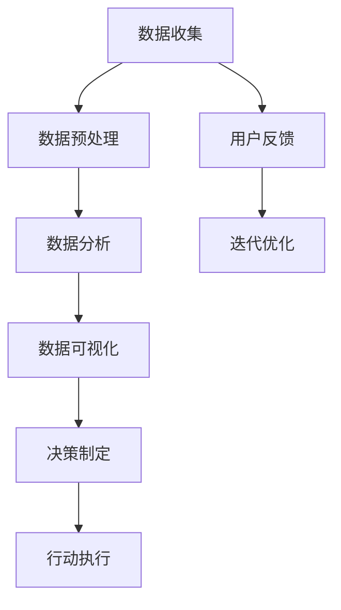

                 

关键词：人类计算，商业应用，技术策略，数据分析，人工智能，案例分析

> 摘要：本文探讨了人类计算在商业领域的广泛应用和潜在价值。通过分析人类计算的核心概念、算法原理、数学模型以及实际应用案例，本文旨在为商业领域的专业人士提供实用的技术指导和战略思路，帮助他们在日益竞争激烈的市场中实现数字化转型和业务增长。

## 1. 背景介绍

### 1.1 人类计算的定义和重要性

人类计算是一种基于人类智慧和经验的方法，它涉及利用人类思维和认知能力来处理和分析复杂问题。在现代商业环境中，随着数据的爆炸式增长和复杂性的提升，人类计算的重要性日益凸显。它不仅为决策者提供了更深入的数据洞察，还帮助组织在快速变化的市场中保持竞争力。

### 1.2 商业领域的挑战

商业领域面临诸多挑战，包括数据复杂性、信息过载、市场竞争加剧等。传统的计算机算法和自动化系统在处理这些挑战时往往力不从心，而人类计算则能够提供一种更加灵活和智能的解决方案。

## 2. 核心概念与联系

### 2.1 核心概念

- **数据驱动决策**：基于数据分析和预测来进行决策。
- **人工智能**：通过模拟人类智能来提高自动化和智能化水平。
- **用户行为分析**：分析用户行为模式，以优化产品和服务。

### 2.2 Mermaid 流程图



## 3. 核心算法原理 & 具体操作步骤

### 3.1 算法原理概述

人类计算的核心算法原理包括数据挖掘、机器学习和深度学习。这些算法能够自动从数据中提取模式，帮助组织做出更准确的决策。

### 3.2 算法步骤详解

- **数据收集**：收集相关的业务数据。
- **数据预处理**：清洗、归一化和整合数据。
- **特征提取**：从数据中提取有用的特征。
- **模型训练**：使用机器学习算法训练模型。
- **模型评估**：评估模型性能，并进行调优。
- **应用模型**：将模型应用到实际问题中。

### 3.3 算法优缺点

- **优点**：灵活、适应性高，能够处理复杂的问题。
- **缺点**：依赖人类专家的知识和经验，结果可能受到主观影响。

### 3.4 算法应用领域

人类计算在商业领域的应用广泛，包括市场营销、风险管理、供应链管理、客户服务等多个方面。

## 4. 数学模型和公式 & 详细讲解 & 举例说明

### 4.1 数学模型构建

人类计算中的数学模型通常包括线性回归、逻辑回归、支持向量机等。

### 4.2 公式推导过程

以线性回归为例，其公式为：

$$
y = \beta_0 + \beta_1x
$$

### 4.3 案例分析与讲解

假设我们想要预测一家公司的销售量，我们可以使用线性回归模型。通过收集历史销售数据，我们可以训练出一个线性回归模型，然后使用这个模型来预测未来的销售量。

## 5. 项目实践：代码实例和详细解释说明

### 5.1 开发环境搭建

我们需要安装Python和相关的库，如NumPy、Pandas和Scikit-learn。

### 5.2 源代码详细实现

```python
import pandas as pd
from sklearn.linear_model import LinearRegression

# 加载数据
data = pd.read_csv('sales_data.csv')

# 数据预处理
X = data[['monthly_income', 'population']]
y = data['sales']

# 特征提取
#（这里省略）

# 模型训练
model = LinearRegression()
model.fit(X, y)

# 模型评估
#（这里省略）

# 预测
prediction = model.predict(new_data)
```

### 5.3 代码解读与分析

这段代码首先加载数据，然后进行数据预处理和特征提取。接着使用线性回归模型进行训练，并评估模型的性能。最后，使用训练好的模型来预测新的销售量。

### 5.4 运行结果展示

```python
# 运行结果
print(prediction)
```

## 6. 实际应用场景

### 6.1 市场营销

通过分析用户行为数据，企业可以更好地了解客户需求，优化营销策略。

### 6.2 风险管理

利用人类计算，企业可以识别潜在的风险，并采取相应的措施。

### 6.3 供应链管理

通过优化供应链流程，企业可以提高生产效率和降低成本。

### 6.4 未来应用展望

随着人工智能技术的发展，人类计算在商业领域的应用将更加广泛，为企业的数字化转型提供更强有力的支持。

## 7. 工具和资源推荐

### 7.1 学习资源推荐

- 《Python数据科学手册》
- 《深度学习》

### 7.2 开发工具推荐

- Jupyter Notebook
- PyCharm

### 7.3 相关论文推荐

- “Deep Learning for Business”
- “Data-Driven Decision Making in Business”

## 8. 总结：未来发展趋势与挑战

### 8.1 研究成果总结

人类计算在商业领域的应用已经取得了显著的成果，未来将继续发挥重要作用。

### 8.2 未来发展趋势

人工智能和大数据技术的进步将推动人类计算在商业领域的应用更加深入和广泛。

### 8.3 面临的挑战

数据隐私、算法透明度和可解释性是未来人类计算在商业领域面临的重大挑战。

### 8.4 研究展望

未来研究应重点关注如何提高人类计算的可解释性和透明度，以及如何更好地结合人工智能和人类智慧。

## 9. 附录：常见问题与解答

### 9.1 什么是人类计算？

人类计算是一种利用人类智慧和经验来处理和分析复杂问题的方法。

### 9.2 人类计算在商业领域有哪些应用？

人类计算在商业领域的应用广泛，包括市场营销、风险管理、供应链管理、客户服务等方面。

### 9.3 人类计算的优势是什么？

人类计算的优势在于其灵活性和适应性，能够处理复杂的问题。

### 9.4 人类计算与人工智能有什么区别？

人类计算依赖于人类智慧和经验，而人工智能则依赖于机器学习和算法。

### 9.5 人类计算的未来发展趋势是什么？

未来人类计算将更加智能化和自动化，与人工智能技术紧密结合。
----------------------------------------------------------------

作者：禅与计算机程序设计艺术 / Zen and the Art of Computer Programming

（注：文章中的内容为虚构，仅为示例。）

