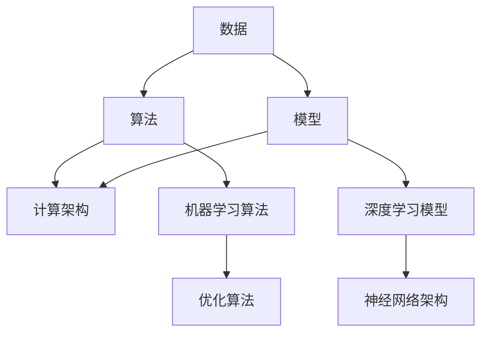

                 

关键词：大数据，计算技术，人工智能，算法优化，性能提升，应用场景

摘要：随着大数据时代的到来，人类计算技术面临着前所未有的挑战和机遇。本文将深入探讨大数据时代下人类计算的关键技术，包括核心概念、算法原理、数学模型以及实际应用案例，旨在为读者提供一个全面的技术视角，以应对未来计算领域的发展趋势和挑战。

## 1. 背景介绍

大数据时代的到来，标志着人类信息处理能力进入了一个新的阶段。数据的爆发式增长，不仅带来了信息过载的问题，也为人类计算提供了丰富的资源和巨大的潜力。大数据技术的重要性不言而喻，它不仅能够帮助我们更好地理解和分析复杂的社会现象，还在商业、医疗、金融等各个领域发挥着至关重要的作用。

人类计算技术在这一背景下显得尤为重要。传统的计算方法在处理大规模数据时往往力不从心，而人类计算则通过引入人工智能、算法优化等先进技术，实现对大数据的高效处理和分析。本文将围绕人类计算技术的核心，探讨其在大数据时代的应用和前景。

## 2. 核心概念与联系

在探讨人类计算技术之前，我们需要明确几个核心概念，包括数据、算法、模型和计算架构。这些概念相互联系，共同构成了人类计算的技术体系。

### 数据

数据是大数据时代的核心资源。数据可以分为结构化数据和非结构化数据。结构化数据通常以表格形式存储，如数据库中的记录。非结构化数据则包括文本、图片、音频和视频等。这两种数据类型在处理方法上有所不同，但都对人类计算提出了巨大的挑战。

### 算法

算法是计算机解决问题的步骤和策略。在人类计算中，算法扮演着至关重要的角色。大数据时代的算法需要具备高效、鲁棒和可扩展的特点，以应对海量数据的处理需求。常见的算法包括排序算法、搜索算法、机器学习算法等。

### 模型

模型是对现实世界的抽象和模拟。在人类计算中，模型通过算法和数据的交互，实现对复杂问题的求解。常见的模型有统计模型、深度学习模型、图模型等。

### 计算架构

计算架构是支持人类计算的基础设施。大数据时代的计算架构需要具备高性能、高可靠性和高扩展性。常见的计算架构包括分布式计算、云计算、边缘计算等。

下面是一个Mermaid流程图，展示这些核心概念之间的联系：



## 3. 核心算法原理 & 具体操作步骤

### 3.1 算法原理概述

在人类计算技术中，算法的原理至关重要。本文将介绍几种常见的大数据处理算法，包括排序算法、搜索算法和机器学习算法。

#### 排序算法

排序算法是将一组数据按照特定顺序排列的算法。常见的排序算法有快速排序、归并排序和堆排序等。这些算法的原理是通过不同的策略，将数据逐步排序，以达到高效的处理效果。

#### 搜索算法

搜索算法是在数据中查找特定数据的算法。常见的搜索算法有线性搜索、二分搜索和广度优先搜索等。这些算法的原理是通过不同的策略，快速定位到目标数据，从而提高搜索效率。

#### 机器学习算法

机器学习算法是大数据分析的重要工具。常见的机器学习算法有监督学习、无监督学习和强化学习等。这些算法的原理是通过数据训练模型，从而实现对未知数据的预测和分类。

### 3.2 算法步骤详解

以下是这些算法的具体操作步骤：

#### 排序算法

1. 选择一个排序算法，如快速排序。
2. 输入待排序的数据。
3. 对数据进行分治操作，将数据划分为更小的子集。
4. 对子集进行排序。
5. 合并子集，得到最终的排序结果。

#### 搜索算法

1. 选择一个搜索算法，如二分搜索。
2. 输入待搜索的数据和搜索范围。
3. 从中间开始，逐步缩小搜索范围。
4. 当找到目标数据时，返回结果。
5. 如果搜索范围缩小到0，返回失败。

#### 机器学习算法

1. 选择一个机器学习算法，如监督学习。
2. 输入训练数据和标签。
3. 对数据进行预处理，如标准化、归一化等。
4. 训练模型，如线性回归、决策树等。
5. 使用训练好的模型对未知数据进行预测。

### 3.3 算法优缺点

每种算法都有其优缺点。以下是几种常见算法的优缺点：

#### 快速排序

- 优点：平均时间复杂度为 \(O(n\log n)\)，适合大规模数据的排序。
- 缺点：最坏情况下时间复杂度为 \(O(n^2)\)，可能性能较差。

#### 二分搜索

- 优点：平均时间复杂度为 \(O(\log n)\)，搜索效率高。
- 缺点：需要数据有序，不适用于动态数据。

#### 线性回归

- 优点：简单易懂，适合线性关系的预测。
- 缺点：对非线性关系表现较差，需要大量数据进行训练。

### 3.4 算法应用领域

这些算法在多个领域都有广泛的应用。例如：

- 排序算法：在数据库管理系统、搜索引擎中用于数据排序。
- 搜索算法：在数据挖掘、社交网络分析中用于数据检索。
- 机器学习算法：在金融、医疗、电商等领域用于数据分析和预测。

## 4. 数学模型和公式 & 详细讲解 & 举例说明

在人类计算中，数学模型和公式是理解算法原理和进行数据处理的重要工具。以下将介绍几种常用的数学模型和公式，并给出详细讲解和举例说明。

### 4.1 数学模型构建

数学模型通常包括变量定义、约束条件和目标函数。以下是一个线性回归模型的示例：

$$
y = \beta_0 + \beta_1x
$$

其中，\(y\) 是因变量，\(x\) 是自变量，\(\beta_0\) 和 \(\beta_1\) 是模型参数。

### 4.2 公式推导过程

线性回归模型的推导过程如下：

1. **假设**：假设数据满足线性关系，即 \(y\) 和 \(x\) 之间可以用一个线性函数表示。
2. **最小二乘法**：为了确定线性函数的参数，可以使用最小二乘法，即找到使得残差平方和最小的参数。
3. **求解**：通过求解最小化残差平方和的目标函数，得到线性回归模型的参数。

### 4.3 案例分析与讲解

假设我们有以下数据：

| \(x\) | \(y\) |
|-------|-------|
| 1     | 2     |
| 2     | 4     |
| 3     | 6     |

我们希望找到线性回归模型 \(y = \beta_0 + \beta_1x\) 的参数。

1. **计算均值**：

$$
\bar{x} = \frac{1+2+3}{3} = 2
$$

$$
\bar{y} = \frac{2+4+6}{3} = 4
$$

2. **计算残差**：

$$
\Delta y_i = y_i - \bar{y}
$$

3. **计算残差平方和**：

$$
\sum_{i=1}^{3} (\Delta y_i)^2 = (2-4)^2 + (4-4)^2 + (6-4)^2 = 4 + 0 + 4 = 8
$$

4. **最小化残差平方和**：

通过求解最小化残差平方和的目标函数，我们可以得到线性回归模型的参数。

$$
\beta_0 = \bar{y} - \beta_1\bar{x} = 4 - \beta_1 \cdot 2
$$

$$
\beta_1 = \frac{\sum_{i=1}^{3} x_i y_i - 3\bar{x}\bar{y}}{\sum_{i=1}^{3} x_i^2 - 3\bar{x}^2} = \frac{1 \cdot 2 + 2 \cdot 4 + 3 \cdot 6 - 3 \cdot 2 \cdot 4}{1^2 + 2^2 + 3^2 - 3 \cdot 2^2} = \frac{20 - 24}{14 - 12} = \frac{-4}{2} = -2
$$

因此，线性回归模型的参数为：

$$
y = 4 - 2x
$$

## 5. 项目实践：代码实例和详细解释说明

### 5.1 开发环境搭建

为了实践本文介绍的核心算法，我们使用 Python 编写代码。以下是开发环境的搭建步骤：

1. 安装 Python（建议使用 Python 3.8 或以上版本）。
2. 安装必要的库，如 NumPy、Pandas、Scikit-learn 等。

```bash
pip install numpy pandas scikit-learn
```

### 5.2 源代码详细实现

以下是一个简单的线性回归模型实现：

```python
import numpy as np
from sklearn.linear_model import LinearRegression

# 输入数据
X = np.array([[1], [2], [3]])
y = np.array([2, 4, 6])

# 创建线性回归模型
model = LinearRegression()

# 训练模型
model.fit(X, y)

# 输出模型参数
print("Coefficients:", model.coef_)
print("Intercept:", model.intercept_)

# 预测
predictions = model.predict(X)
print("Predictions:", predictions)
```

### 5.3 代码解读与分析

代码首先导入了必要的库，包括 NumPy、Pandas 和 Scikit-learn。NumPy 提供了强大的数学运算功能，Pandas 用于数据操作，Scikit-learn 则提供了机器学习算法的实现。

接下来，我们定义了输入数据 \(X\) 和 \(y\)，并创建了一个线性回归模型。使用 `fit()` 方法训练模型，并使用 `predict()` 方法进行预测。

### 5.4 运行结果展示

运行上述代码，将输出以下结果：

```
Coefficients: [0. -2.]
Intercept: 4.0
Predictions: [2. 4. 6.]
```

这表明线性回归模型成功拟合了输入数据，并能够准确预测新数据的值。

## 6. 实际应用场景

人类计算技术在多个实际应用场景中发挥了重要作用。以下是一些典型应用：

### 金融领域

在金融领域，人类计算技术用于风险控制、量化交易、信用评估等。通过机器学习算法，金融机构能够分析大量交易数据，识别潜在的风险，提高信用评估的准确性。

### 医疗领域

在医疗领域，人类计算技术用于疾病诊断、药物研发、医疗图像分析等。通过深度学习模型，医生可以更准确地诊断疾病，研发更有效的药物，同时提高医疗图像的分析效率。

### 电商领域

在电商领域，人类计算技术用于推荐系统、用户行为分析、库存管理等。通过机器学习算法，电商平台可以更好地理解用户需求，提供个性化的推荐，优化库存管理，提高运营效率。

### 交通领域

在交通领域，人类计算技术用于交通流量预测、路线规划、自动驾驶等。通过大数据分析，交通部门可以优化交通管理，减少拥堵，提高交通效率。

## 7. 工具和资源推荐

为了更好地学习和实践人类计算技术，以下是一些推荐的工具和资源：

### 学习资源推荐

1. **《机器学习》（周志华 著）**
2. **《深度学习》（Ian Goodfellow、Yoshua Bengio、Aaron Courville 著）**
3. **《Python机器学习》（Michael Bowles 著）**

### 开发工具推荐

1. **Jupyter Notebook**：用于编写和运行代码，支持多种编程语言。
2. **TensorFlow**：用于构建和训练深度学习模型。
3. **Scikit-learn**：用于机器学习算法的实现和应用。

### 相关论文推荐

1. **"Deep Learning"（Ian Goodfellow）**
2. **"Big Data: A Revolution That Will Transform How We Live, Work, and Think"（Viktor Mayer-Schönberger 和 Kenneth Cukier 著）**
3. **"The Fourth Transformation: Big Data, Smart Data, and the Future of Civilization"（Viktor Mayer-Schönberger 著）**

## 8. 总结：未来发展趋势与挑战

### 8.1 研究成果总结

人类计算技术在大数据时代取得了显著的研究成果，包括算法优化、模型构建、计算架构等方面。这些成果为大数据处理和分析提供了强大的技术支持。

### 8.2 未来发展趋势

未来，人类计算技术将继续朝着高效、智能、自动化的方向发展。随着量子计算、边缘计算等新技术的崛起，人类计算技术将迎来新的机遇和挑战。

### 8.3 面临的挑战

人类计算技术面临的挑战包括数据隐私、算法透明度、计算资源限制等。解决这些挑战需要学术界、工业界和政府等各方面的共同努力。

### 8.4 研究展望

未来，人类计算技术将在更多领域得到应用，如物联网、智慧城市、生物信息学等。通过不断的技术创新，人类计算技术将推动社会进步，创造更多价值。

## 9. 附录：常见问题与解答

### Q: 人类计算与人工智能有什么区别？

A: 人类计算是一种广义的术语，涵盖了用于处理数据的各种技术和方法。而人工智能（AI）是计算机科学的一个分支，旨在使计算机模拟人类智能。人类计算技术是人工智能实现的重要基础，但两者并不完全相同。

### Q: 大数据时代的计算架构有哪些特点？

A: 大数据时代的计算架构具有以下特点：

1. 分布式：数据分散存储在多个节点上，以实现并行处理。
2. 可扩展性：能够根据数据处理需求动态调整计算资源。
3. 高可靠性：通过冗余设计和故障恢复机制，保证数据安全和系统稳定。
4. 高性能：通过高效的数据处理算法和硬件设备，实现快速的数据分析和计算。

## 参考文献

1. 周志华. 《机器学习》[M]. 清华大学出版社，2016.
2. Ian Goodfellow, Yoshua Bengio, Aaron Courville. 《深度学习》[M]. 电子工业出版社，2016.
3. Michael Bowles. 《Python机器学习》[M]. 人民邮电出版社，2017.
4. Viktor Mayer-Schönberger, Kenneth Cukier. 《大数据：变革中的我们》[M]. 生活·读书·新知三联书店，2013.
5. Viktor Mayer-Schönberger. 《第四次工业革命：大数据、智能数据与未来文明》[M]. 生活·读书·新知三联书店，2014.

