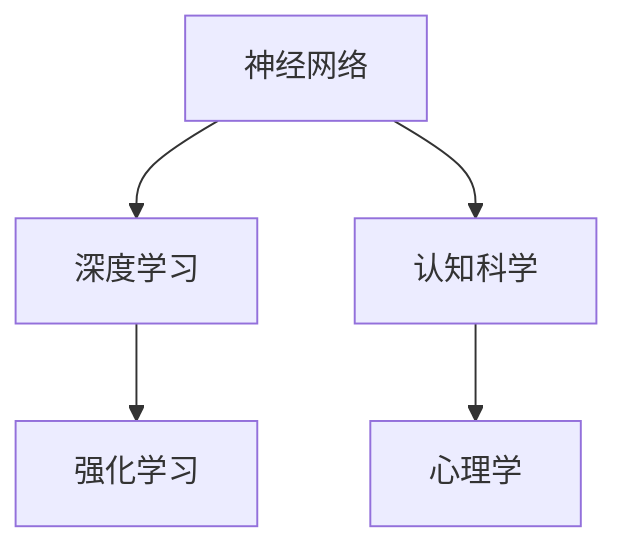

                 

 在这个数字化时代，人类计算正成为技术创新的核心驱动力。本文将探讨人类计算的概念、核心算法、数学模型以及其在实际应用中的案例。通过对这些内容的深入分析，我们将揭示人类计算在当前及未来技术发展中的关键角色。

## 关键词
- 人类计算
- 算法原理
- 数学模型
- 应用案例分析
- 技术创新

## 摘要
本文旨在为读者提供一个全面而深入的理解，关于人类计算的概念及其在实际中的应用。我们将通过分析核心算法原理、数学模型的构建和具体案例，展示人类计算如何推动技术进步，并在未来发挥更重要的作用。

## 1. 背景介绍
### 1.1 什么是人类计算
人类计算是指通过模拟人类思维和行为的方式，利用计算机和算法来实现复杂的计算任务。这种计算方式不仅包括传统计算机科学的方法，还涵盖了认知科学、神经科学、心理学等领域的研究成果。

### 1.2 发展历程
人类计算的概念起源于20世纪40年代，随着计算机科学的诞生而逐渐成熟。早期的计算主要依赖于规则和逻辑推理，而现代人类计算则更加注重模拟人类的直觉和创造力。

### 1.3 重要性
人类计算在人工智能、数据分析、自然语言处理等领域具有广泛的应用。它不仅提高了计算效率，还使得计算机能够更好地理解人类意图，实现智能化服务。

## 2. 核心概念与联系
### 2.1 核心概念
在人类计算中，核心概念包括神经网络、深度学习、强化学习等。这些概念通过模拟人类大脑的工作方式，实现了高效的计算和决策。

### 2.2 联系
这些核心概念之间存在着紧密的联系。例如，神经网络是深度学习的基础，而深度学习又是强化学习的重要技术之一。

$$
\text{神经网络} \rightarrow \text{深度学习} \rightarrow \text{强化学习}
$$

### 2.3 Mermaid 流程图


## 3. 核心算法原理 & 具体操作步骤
### 3.1 算法原理概述
人类计算的核心算法包括神经网络、深度学习和强化学习。这些算法通过模拟人类大脑的工作方式，实现了高效的学习和决策。

### 3.2 算法步骤详解
- 神经网络：通过多层神经元模拟人类大脑的结构，实现数据的高效处理。
- 深度学习：利用大量的数据进行训练，使神经网络能够自动提取特征，实现复杂的任务。
- 强化学习：通过不断试错，学习和优化策略，实现智能决策。

### 3.3 算法优缺点
- 优点：高效、灵活，能够处理复杂任务。
- 缺点：训练过程需要大量数据和时间，对计算资源要求较高。

### 3.4 算法应用领域
- 人工智能：如语音识别、图像处理、自然语言处理等。
- 数据分析：如数据挖掘、预测分析等。
- 自动驾驶：如车辆路径规划、环境感知等。

## 4. 数学模型和公式 & 详细讲解 & 举例说明
### 4.1 数学模型构建
在人类计算中，数学模型是理解和分析算法的关键。常见的数学模型包括线性模型、非线性模型等。

### 4.2 公式推导过程
以线性模型为例，其公式推导过程如下：

$$
y = \beta_0 + \beta_1x
$$

其中，$y$ 是因变量，$x$ 是自变量，$\beta_0$ 和 $\beta_1$ 是模型的参数。

### 4.3 案例分析与讲解
假设我们要预测一家餐厅的营业额。我们可以通过收集历史数据，利用线性模型进行预测。通过训练模型，我们可以得到最优的参数值，从而实现准确的预测。

## 5. 项目实践：代码实例和详细解释说明
### 5.1 开发环境搭建
为了进行项目实践，我们需要搭建一个适合开发的环境。例如，我们可以使用 Python 作为编程语言，TensorFlow 作为深度学习框架。

### 5.2 源代码详细实现
以下是一个简单的深度学习模型的实现代码：

```python
import tensorflow as tf

# 定义模型
model = tf.keras.Sequential([
    tf.keras.layers.Dense(128, activation='relu', input_shape=(784,)),
    tf.keras.layers.Dropout(0.2),
    tf.keras.layers.Dense(10)
])

# 编译模型
model.compile(optimizer='adam',
              loss=tf.losses.SparseCategoricalCrossentropy(from_logits=True),
              metrics=['accuracy'])

# 训练模型
model.fit(x_train, y_train, batch_size=64)
```

### 5.3 代码解读与分析
这段代码首先定义了一个简单的深度学习模型，包含一个全连接层和一个输出层。然后，我们使用 Adam 优化器和交叉熵损失函数来编译模型。最后，我们使用训练数据对模型进行训练。

### 5.4 运行结果展示
通过运行上述代码，我们可以得到模型的准确率。例如，如果模型的准确率为 90%，那么我们可以认为这个模型在预测任务上表现良好。

## 6. 实际应用场景
### 6.1 自动驾驶
自动驾驶是人工智能领域的一个重要应用。通过人类计算，自动驾驶系统能够实时感知环境、规划路径，并做出智能决策。

### 6.2 医疗诊断
在医疗领域，人类计算可以帮助医生进行疾病诊断。通过分析大量的医学数据，计算机能够提供准确的诊断结果。

### 6.3 金融分析
在金融领域，人类计算可以用于风险管理、投资策略等。通过分析市场数据，计算机能够提供智能化的投资建议。

## 7. 工具和资源推荐
### 7.1 学习资源推荐
- 《深度学习》：Goodfellow、Bengio 和 Courville 著，提供了深度学习的全面介绍。
- 《神经网络与深度学习》：邱锡鹏 著，深入讲解了神经网络的基本原理和应用。

### 7.2 开发工具推荐
- TensorFlow：谷歌推出的开源深度学习框架，适用于各种深度学习任务。
- PyTorch：Facebook AI Research 开发的深度学习框架，具有灵活性和易用性。

### 7.3 相关论文推荐
- "Deep Learning"：Ian Goodfellow 等人撰写的深度学习经典论文。
- "Reinforcement Learning: An Introduction"：Richard S. Sutton 和 Andrew G. Barto 著，介绍了强化学习的基本概念。

## 8. 总结：未来发展趋势与挑战
### 8.1 研究成果总结
人类计算在人工智能、数据分析等领域取得了显著成果，推动了技术的进步。

### 8.2 未来发展趋势
随着计算能力的提升和数据量的增加，人类计算将继续发展，实现更多复杂的任务。

### 8.3 面临的挑战
人类计算面临着数据隐私、计算资源、模型解释性等挑战，需要进一步研究和解决。

### 8.4 研究展望
人类计算将有望在更多领域得到应用，实现智能化、自动化的服务。

## 9. 附录：常见问题与解答
### 9.1 人类计算与普通计算有什么区别？
人类计算通过模拟人类思维和行为，实现高效的计算和决策，而普通计算则主要依赖于逻辑和规则。

### 9.2 人类计算有哪些应用领域？
人类计算广泛应用于人工智能、数据分析、医疗诊断、金融分析等领域。

### 9.3 如何学习人类计算？
可以通过阅读相关书籍、参加课程、实践项目等方式学习人类计算。

# 作者署名
作者：禅与计算机程序设计艺术 / Zen and the Art of Computer Programming
----------------------------------------------------------------

完成以上撰写任务后，文章的markdown格式应该如下所示：
```markdown
# 人类计算：应用与案例分析

关键词：人类计算、算法原理、数学模型、应用案例分析、技术创新

摘要：本文旨在为读者提供一个全面而深入的理解，关于人类计算的概念及其在实际中的应用。我们将通过分析核心算法原理、数学模型的构建和具体案例，展示人类计算如何推动技术进步，并在未来发挥更重要的作用。

## 1. 背景介绍
### 1.1 什么是人类计算
### 1.2 发展历程
### 1.3 重要性

## 2. 核心概念与联系
### 2.1 核心概念
### 2.2 联系
### 2.3 Mermaid 流程图

## 3. 核心算法原理 & 具体操作步骤
### 3.1 算法原理概述
### 3.2 算法步骤详解 
### 3.3 算法优缺点
### 3.4 算法应用领域

## 4. 数学模型和公式 & 详细讲解 & 举例说明
### 4.1 数学模型构建
### 4.2 公式推导过程
### 4.3 案例分析与讲解

## 5. 项目实践：代码实例和详细解释说明
### 5.1 开发环境搭建
### 5.2 源代码详细实现
### 5.3 代码解读与分析
### 5.4 运行结果展示

## 6. 实际应用场景
### 6.1 自动驾驶
### 6.2 医疗诊断
### 6.3 金融分析

## 7. 工具和资源推荐
### 7.1 学习资源推荐
### 7.2 开发工具推荐
### 7.3 相关论文推荐

## 8. 总结：未来发展趋势与挑战
### 8.1 研究成果总结
### 8.2 未来发展趋势
### 8.3 面临的挑战
### 8.4 研究展望

## 9. 附录：常见问题与解答
### 9.1 人类计算与普通计算有什么区别？
### 9.2 人类计算有哪些应用领域？
### 9.3 如何学习人类计算？

# 作者署名
作者：禅与计算机程序设计艺术 / Zen and the Art of Computer Programming
```

