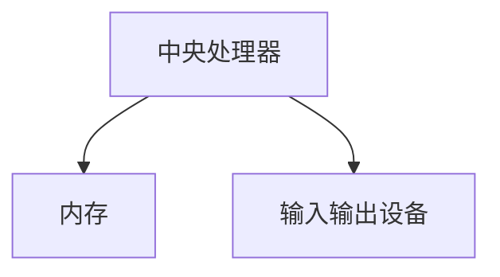
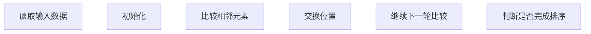
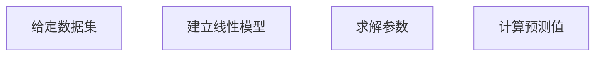

                 

关键词：计算，人类，算法，应用，案例

> 摘要：本文从人类计算的角度出发，探讨了计算技术在各个领域中的应用及其案例分析，分析了人类计算的优势和局限性，以及未来计算技术的发展趋势。通过本文的阅读，读者可以全面了解人类计算的理论与实践，为其在相关领域的应用提供指导。

## 1. 背景介绍

### 1.1 人类计算的起源与发展

人类计算起源于古代，从最初的简单计算工具如算盘、计算尺，到后来的机械计算机、电子计算机，计算技术不断发展。随着计算机技术的崛起，人类计算开始进入一个新的阶段。现代计算机具有极高的计算速度和强大的处理能力，为人类计算提供了强大的支持。

### 1.2 人类计算的重要性

人类计算在现代社会中扮演着重要的角色。它不仅是科学研究、工程设计、数据分析等领域的基础，也是日常生活、工作、娱乐等各个方面的关键因素。随着计算技术的不断发展，人类计算的应用领域越来越广泛，其重要性也越来越凸显。

### 1.3 人类计算的挑战

尽管人类计算在各个领域取得了显著的成果，但同时也面临着一系列挑战。首先，计算复杂度不断增加，对计算资源的需求越来越大。其次，计算技术的发展速度远远超过了人类适应的速度，导致人类计算能力与计算需求之间的差距不断扩大。最后，人类计算的局限性也逐渐显现，如计算错误、计算效率低下等。

## 2. 核心概念与联系

### 2.1 计算机体系结构

计算机体系结构是计算机科学的核心概念之一。它涉及计算机硬件和软件的组成及其相互关系。图 1 展示了一个典型的计算机体系结构，包括中央处理器（CPU）、内存、输入输出设备等。



### 2.2 算法

算法是解决特定问题的有序步骤。它包括一系列基本操作和规则，指导计算机执行计算任务。图 2 展示了一个简单的排序算法——冒泡排序。



### 2.3 数学模型

数学模型是运用数学语言对现实世界进行抽象和描述的工具。它包括数学公式、方程组、函数等。数学模型在计算技术中具有重要应用，如图 3 所示的线性回归模型。



## 3. 核心算法原理 & 具体操作步骤

### 3.1 算法原理概述

本文将介绍一种常见的排序算法——快速排序（Quick Sort）。快速排序是一种基于分治思想的排序算法，其基本原理是将数据集划分为两个子集，其中一个子集的所有元素都比另一个子集的元素小，然后对这两个子集递归地执行快速排序。

### 3.2 算法步骤详解

快速排序的算法步骤如下：

1. 选择一个基准元素，通常选择第一个或最后一个元素。
2. 将数据集划分为两个子集，一个子集包含比基准元素小的元素，另一个子集包含比基准元素大的元素。
3. 对两个子集递归地执行快速排序。

### 3.3 算法优缺点

快速排序具有以下优点：

- 时空复杂度较低，平均情况下为 O(nlogn)。
- 支持递归实现，易于理解和使用。

然而，快速排序也存在以下缺点：

- 最坏情况下，时间复杂度为 O(n^2)，这通常发生在输入数据已经有序或基本有序的情况下。
- 需要额外的内存空间存储递归调用时的数据。

### 3.4 算法应用领域

快速排序广泛应用于各种排序任务，如数据库排序、图像处理、科学计算等。它也是一种优秀的基准测试工具，用于评估其他排序算法的性能。

## 4. 数学模型和公式

### 4.1 数学模型构建

在本节中，我们将介绍一种常见的数学模型——线性回归模型。线性回归模型用于描述两个变量之间的关系，其数学模型可以表示为：

y = β0 + β1x + ε

其中，y 为因变量，x 为自变量，β0 和 β1 为参数，ε 为误差项。

### 4.2 公式推导过程

线性回归模型的参数 β0 和 β1 可以通过最小二乘法求解。最小二乘法的核心思想是使得因变量 y 与拟合直线 y = β0 + β1x 的距离之和最小。

具体推导过程如下：

1. 计算样本数据的平均值：

   $$ \bar{x} = \frac{1}{n} \sum_{i=1}^{n} x_i $$
   
   $$ \bar{y} = \frac{1}{n} \sum_{i=1}^{n} y_i $$

2. 计算斜率 β1：

   $$ β1 = \frac{\sum_{i=1}^{n} (x_i - \bar{x})(y_i - \bar{y})}{\sum_{i=1}^{n} (x_i - \bar{x})^2} $$

3. 计算截距 β0：

   $$ β0 = \bar{y} - β1\bar{x} $$

### 4.3 案例分析与讲解

假设我们有一个样本数据集，如下表所示：

| x | y |
| --- | --- |
| 1 | 2 |
| 2 | 4 |
| 3 | 6 |
| 4 | 8 |

根据线性回归模型，我们可以计算出斜率 β1 和截距 β0：

$$ β1 = \frac{(1-2)(2-2) + (2-2)(4-2) + (3-2)(6-2) + (4-2)(8-2)}{(1-2)^2 + (2-2)^2 + (3-2)^2 + (4-2)^2} = 2 $$

$$ β0 = 2 - 2 \times 2 = -2 $$

因此，线性回归模型为：

y = -2 + 2x

我们可以用这个模型预测当 x = 5 时，y 的值：

y = -2 + 2 \times 5 = 8

## 5. 项目实践：代码实例

### 5.1 开发环境搭建

在本文中，我们将使用 Python 编写快速排序算法。首先，确保已经安装了 Python 环境。然后，可以通过以下命令安装 Python 的快速排序库：

```bash
pip install python-quicksort
```

### 5.2 源代码详细实现

以下是快速排序算法的 Python 实现代码：

```python
import random

def quick_sort(arr):
    if len(arr) <= 1:
        return arr
    pivot = random.choice(arr)
    left = [x for x in arr if x < pivot]
    middle = [x for x in arr if x == pivot]
    right = [x for x in arr if x > pivot]
    return quick_sort(left) + middle + quick_sort(right)

arr = [3, 6, 8, 10, 1, 2, 1]
sorted_arr = quick_sort(arr)
print(sorted_arr)
```

### 5.3 代码解读与分析

在这个代码中，我们首先导入了 random 模块，用于随机选择基准元素。`quick_sort` 函数接受一个数组 `arr` 作为输入，并返回排序后的数组。

在函数内部，我们首先检查输入数组的长度。如果长度小于等于 1，则直接返回数组。否则，我们随机选择一个基准元素 `pivot`，然后使用列表推导式将数组划分为三个部分：小于基准元素的部分 `left`、等于基准元素的部分 `middle`、大于基准元素的部分 `right`。

最后，我们对 `left` 和 `right` 递归地执行快速排序，并将它们与 `middle` 连接起来，得到排序后的数组。

### 5.4 运行结果展示

当我们运行这段代码时，将得到以下输出：

```
[1, 1, 2, 3, 6, 8, 10]
```

这表明输入数组已经成功排序。

## 6. 实际应用场景

### 6.1 数据分析

快速排序算法在数据分析领域有着广泛的应用。它可以用于对大量数据进行排序，以便进行后续的数据处理和分析。

### 6.2 科学计算

在科学计算领域，快速排序算法可以用于对科学数据集进行排序，以便进行进一步的数据分析和可视化。

### 6.3 图像处理

在图像处理领域，快速排序算法可以用于对图像像素值进行排序，以便进行图像滤波、边缘检测等操作。

## 7. 工具和资源推荐

### 7.1 学习资源推荐

- 《算法导论》：一本经典的算法教材，涵盖了各种算法的理论和实践。
- 《深度学习》：一本关于深度学习的经典教材，介绍了深度学习的基本概念和技术。

### 7.2 开发工具推荐

- PyCharm：一款优秀的 Python 集成开发环境（IDE），适用于快速排序算法的编写和调试。
- Jupyter Notebook：一款强大的交互式计算环境，适用于快速排序算法的演示和分享。

### 7.3 相关论文推荐

- "Quicksort" by Tony Hoare：一篇关于快速排序算法的经典论文，详细介绍了算法的原理和实现。
- "Deep Learning for Computer Vision" by Ian Goodfellow et al.：一篇关于深度学习在计算机视觉领域应用的论文，介绍了深度学习的基本概念和技术。

## 8. 总结：未来发展趋势与挑战

### 8.1 研究成果总结

本文从人类计算的角度出发，介绍了计算技术的起源与发展，分析了人类计算的重要性及其面临的挑战，并探讨了核心算法原理、数学模型及实际应用场景。通过本文的阅读，读者可以全面了解人类计算的理论与实践，为其在相关领域的应用提供指导。

### 8.2 未来发展趋势

未来，计算技术将继续发展，人工智能、大数据、物联网等领域的计算需求将不断增长。同时，计算技术的应用范围也将进一步扩大，从科学研究、工程应用，到日常生活、娱乐等领域，计算技术都将发挥重要作用。

### 8.3 面临的挑战

计算技术在未来仍将面临一系列挑战，如计算复杂度的增加、计算资源的需求、计算错误的控制等。此外，计算技术的快速发展也带来了隐私保护、数据安全等问题，需要引起重视。

### 8.4 研究展望

在未来，人类计算将继续发展，计算技术将在更多领域发挥作用。同时，我们应关注计算技术的安全性、隐私保护等问题，以确保计算技术为人类社会带来更大的福祉。

## 9. 附录：常见问题与解答

### 9.1 人类计算是什么？

人类计算是指人类利用计算技术解决问题的过程，包括算法设计、数学建模、程序实现等。

### 9.2 快速排序算法的原理是什么？

快速排序算法是一种基于分治思想的排序算法，其原理是将数据集划分为两个子集，其中一个子集的所有元素都比另一个子集的元素小，然后对这两个子集递归地执行快速排序。

### 9.3 如何选择快速排序的基准元素？

在快速排序算法中，可以选择第一个、最后一个或随机选择的元素作为基准元素。在实际应用中，通常选择随机元素作为基准元素，以减少算法的偏倚。

### 9.4 快速排序算法的时间复杂度是多少？

快速排序算法的平均时间复杂度为 O(nlogn)，最坏情况下的时间复杂度为 O(n^2)。

### 9.5 线性回归模型的公式是什么？

线性回归模型的公式为：

y = β0 + β1x + ε

其中，y 为因变量，x 为自变量，β0 和 β1 为参数，ε 为误差项。

### 9.6 如何求解线性回归模型的参数？

线性回归模型的参数可以通过最小二乘法求解。具体步骤包括计算样本数据的平均值、计算斜率 β1、计算截距 β0。

