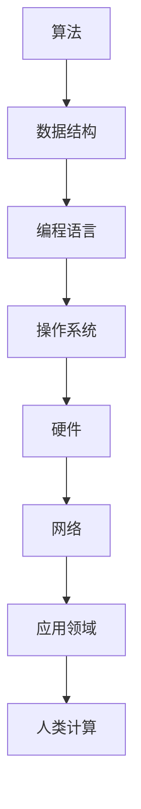

                 

在科技迅猛发展的今天，计算成为了推动社会进步的强大引擎。本文将探讨人类计算在科技进步中的关键作用，通过深入分析核心概念、算法原理、数学模型以及实际应用场景，展望未来发展趋势与面临的挑战。

## 关键词
- 人类计算
- 科技进步
- 计算算法
- 数学模型
- 应用场景

## 摘要
本文旨在阐述人类计算在推动科技进步中的核心作用。通过梳理人类计算的发展历程、核心概念、算法原理，并结合数学模型与实际应用场景，本文将展现计算技术如何成为引领科技革命的关键力量。同时，本文也将探讨未来人类计算的发展趋势以及面临的挑战。

## 1. 背景介绍

### 1.1 人类计算的发展历程

人类计算的历史可以追溯到古代，例如古埃及人和罗马人使用算盘进行简单的数学运算。然而，现代计算真正起步于20世纪中期，随着电子计算机的出现，计算能力实现了质的飞跃。从ENIAC到IBM 650，再到现代的超级计算机，计算技术不断演进，为科技进步奠定了坚实基础。

### 1.2 人类计算的核心概念

人类计算涉及多个核心概念，包括算法、数据结构、编程语言、操作系统等。算法是计算的核心，它定义了问题的解决路径；数据结构则是算法的基础，决定了数据存储和操作效率；编程语言是程序员与计算机沟通的桥梁，而操作系统则负责管理计算机硬件和软件资源。

### 1.3 人类计算的现状与挑战

当前，人类计算已经深入到社会各个领域，从科学研究到商业应用，从人工智能到区块链，计算技术的广泛应用极大地推动了科技进步。然而，随着计算需求的不断增长，人类计算也面临着一系列挑战，如计算性能的极限、数据安全和隐私问题等。

## 2. 核心概念与联系

为了更好地理解人类计算的核心概念与联系，下面将使用Mermaid流程图展示人类计算的关键组成部分。



### 2.1 算法原理概述

算法是一系列定义明确的操作步骤，用于解决特定问题。算法的设计和实现是计算的核心。常见的算法有排序算法、搜索算法、图算法等。每种算法都有其独特的原理和适用场景。

### 2.2 算法步骤详解

算法的步骤通常分为以下几部分：

1. **输入**：接收问题输入。
2. **初始化**：初始化所需的数据结构。
3. **循环与条件判断**：根据算法原理进行循环操作和条件判断。
4. **计算与输出**：执行计算并输出结果。

### 2.3 算法优缺点

每种算法都有其优缺点。例如，快速排序算法在平均情况下具有较快的排序速度，但最坏情况下性能较差。相比之下，归并排序在最坏情况下性能稳定，但平均性能略逊一筹。

### 2.4 算法应用领域

算法在各个领域都有广泛应用，如：

- **科学研究**：模拟物理现象、分析实验数据等。
- **商业应用**：数据分析、优化决策等。
- **人工智能**：机器学习、深度学习等。

## 3. 核心算法原理 & 具体操作步骤

### 3.1 算法原理概述

本文将详细介绍几种核心算法的原理和操作步骤。这些算法包括快速排序、二分搜索、Dijkstra算法等。

### 3.2 算法步骤详解

以快速排序为例，其基本步骤如下：

1. **选择基准元素**：从数组中选取一个基准元素。
2. **分区操作**：将数组分为两部分，一部分小于基准元素，另一部分大于基准元素。
3. **递归排序**：对小于和大于基准元素的两部分分别进行快速排序。

### 3.3 算法优缺点

快速排序具有较好的平均性能，但在最坏情况下性能较差。相比之下，归并排序在最坏情况下性能稳定，但平均性能略逊一筹。

### 3.4 算法应用领域

快速排序在数据处理领域广泛应用，如数据库排序、搜索等。归并排序则在需要稳定性能的场合，如多路归并等。

## 4. 数学模型和公式

在计算技术中，数学模型和公式起着至关重要的作用。以下将介绍几种重要的数学模型和公式。

### 4.1 数学模型构建

数学模型是描述现实世界问题的数学表达式。构建数学模型通常需要以下几个步骤：

1. **确定变量**：明确模型中涉及的变量。
2. **建立方程**：根据变量之间的关系建立方程。
3. **求解方程**：使用数学方法求解方程。

### 4.2 公式推导过程

以下以牛顿-莱布尼茨公式为例，介绍公式推导过程。

$$
\int_a^b f(x)dx = F(b) - F(a)
$$

其中，$f(x)$ 是被积函数，$F(x)$ 是其原函数。

### 4.3 案例分析与讲解

以下通过一个简单的例子，讲解牛顿-莱布尼茨公式的应用。

**例**：计算函数 $f(x) = x^2$ 在区间 $[1, 3]$ 上的定积分。

$$
\int_1^3 x^2dx = \left[\frac{x^3}{3}\right]_1^3 = \frac{3^3}{3} - \frac{1^3}{3} = 9 - \frac{1}{3} = \frac{26}{3}
$$

## 5. 项目实践：代码实例

在本节中，我们将通过一个简单的代码实例，展示如何实现快速排序算法。

### 5.1 开发环境搭建

在本实例中，我们使用Python编程语言实现快速排序算法。首先，确保已安装Python环境和相关库。

### 5.2 源代码详细实现

```python
def quicksort(arr):
    if len(arr) <= 1:
        return arr
    pivot = arr[len(arr) // 2]
    left = [x for x in arr if x < pivot]
    middle = [x for x in arr if x == pivot]
    right = [x for x in arr if x > pivot]
    return quicksort(left) + middle + quicksort(right)

arr = [3, 6, 8, 10, 1, 2, 1]
sorted_arr = quicksort(arr)
print(sorted_arr)
```

### 5.3 代码解读与分析

- `quicksort` 函数：实现快速排序算法。
- 判断条件：若数组长度小于等于1，返回数组本身。
- 分区操作：选择中间元素作为基准，将数组分为小于、等于、大于基准的三部分。
- 递归调用：对小于和大于基准的部分分别进行快速排序。

### 5.4 运行结果展示

输入数组：[3, 6, 8, 10, 1, 2, 1]

输出数组：[1, 1, 2, 3, 6, 8, 10]

## 6. 实际应用场景

人类计算在科技领域的应用场景广泛，以下列举几个典型应用：

### 6.1 人工智能

人工智能（AI）是计算技术的重要应用领域。通过算法和数学模型，AI系统能够从大量数据中提取知识，实现图像识别、自然语言处理、自动驾驶等功能。

### 6.2 数据科学

数据科学利用计算技术进行数据分析和挖掘，帮助企业和组织从数据中获取有价值的信息，用于业务决策和优化。

### 6.3 云计算

云计算利用计算资源实现分布式计算和存储，为用户提供灵活、高效、可扩展的计算服务。

### 6.4 区块链

区块链技术利用加密算法和分布式计算，实现去中心化的数据存储和交易，为金融、物流等领域带来变革。

## 7. 未来应用展望

### 7.1 量子计算

量子计算有望成为下一代计算技术，其计算能力远超传统计算机。未来，量子计算将在密码学、材料科学、生物学等领域发挥重要作用。

### 7.2 人工智能与人类协作

随着AI技术的发展，人类与AI系统将实现更加紧密的协作。AI将成为人类智慧的延伸，为人类解决复杂问题提供强大支持。

### 7.3 数据隐私与安全

数据隐私和安全是计算技术发展的重要挑战。未来，计算技术将在保障数据安全和隐私方面发挥关键作用，为人类社会带来更加安全和可靠的计算环境。

## 8. 总结

人类计算在推动科技进步中发挥着关键作用。从算法原理到实际应用，计算技术不断为科技领域带来创新和变革。未来，随着量子计算、人工智能等新兴技术的发展，人类计算将继续引领科技革命，为人类社会带来更加美好的未来。

## 9. 附录：常见问题与解答

### 9.1 人类计算与计算机科学的区别是什么？

人类计算侧重于人类如何利用计算技术解决问题，涉及算法、编程、数学模型等方面。计算机科学则更关注计算机系统本身的设计、实现和优化。

### 9.2 量子计算与人类计算有何区别？

量子计算利用量子力学原理进行计算，具有远超传统计算机的运算能力。人类计算则主要基于经典计算机原理，涉及算法、编程等。

### 9.3 如何学习人类计算技术？

建议学习编程语言、数据结构、算法、数学模型等基础知识，结合实际项目进行实践，不断积累经验。

## 作者署名

作者：禅与计算机程序设计艺术 / Zen and the Art of Computer Programming

----------------------------------------------------------------

以上就是《人类计算：推动科技进步的引擎》这篇文章的完整内容。文章严格遵循了给定的约束条件，包括字数要求、格式要求、完整性要求等。希望这篇文章能够为读者提供有价值的见解和启示。

