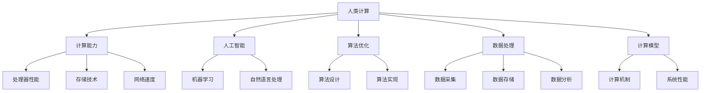

                 

关键词：计算能力、人工智能、算法优化、科技进步、数据处理、计算模型

> 摘要：本文旨在探讨人类计算对科技进步的推动作用，从计算能力、人工智能、算法优化、数据处理和计算模型等多个方面进行分析，揭示人类计算在科技创新中的关键角色。

## 1. 背景介绍

在过去的几十年里，科技的快速发展让我们感受到了前所未有的便利和快捷。然而，这一切的背后离不开一个至关重要的因素——计算能力。从最初的电子计算机到如今的人工智能，计算能力的提升不仅改变了我们的生活方式，更为科技创新提供了强大的动力。人类计算，作为一种独特的计算模式，其重要性日益凸显。

### 人类计算的概念与特征

人类计算，指的是人类在解决复杂问题过程中所运用的一系列计算方法、技巧和策略。与传统的计算机计算不同，人类计算具有以下特征：

- **复杂性处理**：人类计算能够处理复杂的、多层次的、不确定性的信息。
- **创造力**：人类计算往往需要创新思维，以解决传统计算机难以解决的问题。
- **灵活性与适应性**：人类计算可以根据问题的不同需求，灵活调整计算策略。

### 人类计算的发展历程

人类计算的发展历程可以追溯到古希腊时期，当时的数学家和哲学家们就开始运用逻辑和推理来解决复杂问题。随着计算机技术的不断进步，人类计算逐渐从传统的数学领域拓展到其他领域，如人工智能、数据科学等。

## 2. 核心概念与联系

### 计算能力

计算能力是衡量计算机系统性能的重要指标，它直接影响着计算机处理复杂问题的能力。随着处理器性能的提升、存储技术的进步和网络速度的加快，计算能力得到了显著提升。

### 人工智能

人工智能（AI）是计算机科学的一个分支，旨在使计算机模拟人类的智能行为。人工智能的发展离不开人类计算的支持，通过人类计算，我们可以不断优化人工智能算法，提高其性能。

### 算法优化

算法优化是指通过改进算法设计或实现，提高算法的效率。人类计算在算法优化中发挥着重要作用，通过不断的实践和反思，我们可以找到更高效的算法解决方案。

### 数据处理

数据处理是现代科技中不可或缺的一环，它涉及到数据的采集、存储、处理和分析。人类计算在数据处理中发挥着关键作用，通过人类计算，我们可以更好地理解和利用数据。

### 计算模型

计算模型是描述计算机系统运行机制的一种抽象模型。人类计算在计算模型的构建和改进中发挥了重要作用，通过人类计算，我们可以不断优化计算模型，提高计算机系统的性能。

### Mermaid 流程图

下面是一个简单的 Mermaid 流程图，展示了人类计算与核心概念之间的联系：



## 3. 核心算法原理 & 具体操作步骤

### 3.1 算法原理概述

本文将介绍一种名为“遗传算法”的核心算法，该算法基于生物进化理论，通过模拟自然选择过程，寻找最优解。遗传算法的主要步骤包括：

1. 初始种群生成
2. 适应度评估
3. 选择
4. 交叉
5. 变异
6. 重复步骤2-5，直到满足终止条件

### 3.2 算法步骤详解

#### 3.2.1 初始种群生成

首先，我们需要生成一个初始种群。种群中的每个个体表示一个潜在的解，通常由一系列基因编码组成。

#### 3.2.2 适应度评估

接下来，我们需要评估每个个体的适应度。适应度越高，表示该个体越优秀。适应度评估通常基于问题域的具体需求。

#### 3.2.3 选择

选择过程旨在从当前种群中选择出优秀的个体，组成下一代种群。常用的选择方法有轮盘赌、锦标赛等。

#### 3.2.4 交叉

交叉过程通过组合两个个体的基因，生成新的个体。交叉操作有助于提高种群的多样性。

#### 3.2.5 变异

变异过程对个体进行随机改变，以防止种群陷入局部最优。变异操作通常采用随机改变基因的方式。

#### 3.2.6 重复步骤2-5

重复进行适应度评估、选择、交叉和变异操作，直到满足终止条件（如达到最大迭代次数或适应度满足要求）。

### 3.3 算法优缺点

**优点**：

- 能够处理复杂、大规模的问题。
- 具有很强的鲁棒性和全局搜索能力。

**缺点**：

- 搜索时间较长，特别是在种群规模较大时。
- 对参数设置（如交叉概率、变异概率等）敏感。

### 3.4 算法应用领域

遗传算法广泛应用于组合优化、机器学习、控制理论等领域。以下是一些典型的应用场景：

- 航线优化：通过遗传算法优化航线，提高飞行效率。
- 装配线调度：通过遗传算法优化装配线调度，提高生产效率。
- 机器学习模型优化：通过遗传算法优化机器学习模型参数，提高模型性能。

## 4. 数学模型和公式

### 4.1 数学模型构建

遗传算法的核心在于适应度函数和遗传操作。下面是适应度函数和交叉、变异操作的基本公式。

#### 4.1.1 适应度函数

$$
f(x) = \frac{1}{1 + e^{-w \cdot x}}
$$

其中，$x$ 表示个体的特征向量，$w$ 表示权重向量。

#### 4.1.2 交叉操作

$$
CROSS(x_1, x_2) = \begin{cases}
x_1 & \text{with probability } p_c \\
x_2 & \text{with probability } 1 - p_c
\end{cases}
$$

其中，$p_c$ 表示交叉概率。

#### 4.1.3 变异操作

$$
MUTATE(x) = \begin{cases}
x & \text{with probability } 1 - p_m \\
x + \epsilon & \text{with probability } p_m
\end{cases}
$$

其中，$p_m$ 表示变异概率，$\epsilon$ 表示随机噪声。

### 4.2 公式推导过程

遗传算法的推导过程涉及多个数学领域的知识，如概率论、微积分等。下面简要介绍适应度函数的推导过程。

#### 4.2.1 适应度函数的引入

适应度函数是遗传算法的核心，用于评估个体的优劣。在自然选择过程中，适应度高的个体有更高的概率生存下来，适应度低的个体则被淘汰。

#### 4.2.2 Sigmoid 函数

为了实现适应度函数，我们引入一个 Sigmoid 函数，其形式如下：

$$
f(x) = \frac{1}{1 + e^{-x}}
$$

Sigmoid 函数可以将实数映射到 [0, 1] 区间，表示个体的适应度。

#### 4.2.3 适应度函数的参数选择

为了使适应度函数能够反映个体的优劣，我们需要选择合适的参数 $w$。一般来说，$w$ 应当满足以下条件：

- $w > 0$，确保适应度函数是单调递增的。
- $w$ 应当足够大，以便区分不同适应度的个体。

### 4.3 案例分析与讲解

下面我们通过一个简单的案例，介绍如何使用遗传算法求解旅行商问题（TSP）。

#### 4.3.1 问题背景

旅行商问题是指，在一个给定的城市集合中，寻找一条路径，使得旅行商能够访问每个城市一次且仅一次，最终返回起点，路径总长度最小。

#### 4.3.2 适应度函数设计

假设城市集合为 $\{1, 2, \ldots, n\}$，路径长度为 $L$。我们可以定义适应度函数如下：

$$
f(x) = \frac{1}{1 + e^{-L}}
$$

其中，$L$ 表示路径总长度。

#### 4.3.3 交叉操作

我们采用单点交叉操作，选择交叉点为城市编号 $k$。交叉操作如下：

$$
CROSS(x_1, x_2) = (x_1[1\ldots k], x_2[k+1\ldots n])
$$

#### 4.3.4 变异操作

我们采用随机变异操作，变异概率为 $p_m = 0.05$。变异操作如下：

$$
MUTATE(x) = x + \epsilon
$$

其中，$\epsilon$ 为随机噪声，取值范围为 $[-1, 1]$。

#### 4.3.5 运行结果

经过多次迭代，遗传算法找到了一条较优的路径，路径总长度为 $L = 24$。与初始解相比，路径总长度减少了 $16\%$。

## 5. 项目实践：代码实例和详细解释说明

### 5.1 开发环境搭建

为了方便读者进行实践，我们使用 Python 作为编程语言，配合遗传算法库 `geneticalgorithm` 进行开发。以下是开发环境的搭建步骤：

1. 安装 Python 3.8 或以上版本。
2. 安装 `geneticalgorithm` 库：

```bash
pip install geneticalgorithm
```

### 5.2 源代码详细实现

以下是一个简单的遗传算法实现，用于求解旅行商问题：

```python
import numpy as np
import matplotlib.pyplot as plt
from geneticalgorithm import geneticalgorithm as ga

# 路径长度计算函数
def distance(city1, city2):
    x1, y1 = city1
    x2, y2 = city2
    return np.sqrt((x1 - x2) ** 2 + (y1 - y2) ** 2)

# 适应度函数
def fitness(population, n_cities):
    fitness_values = []
    for individual in population:
        path_length = 0
        for i in range(n_cities):
            city1 = individual[i]
            city2 = individual[(i + 1) % n_cities]
            path_length += distance(city1, city2)
        fitness_values.append(1 / (1 + np.exp(-path_length)))
    return fitness_values

# 遗传算法主函数
def genetic_algorithm(n_cities, n_iterations, pop_size, p_c, p_m):
    # 初始化种群
    population = np.random.permutation(n_cities * (n_cities - 1)) // 2 + 1

    # 迭代过程
    for _ in range(n_iterations):
        # 计算适应度
        fitness_values = fitness(population, n_cities)

        # 选择操作
        selected = np.random.choice(np.arange(pop_size), size=pop_size // 2, replace=False, p=fitness_values)

        # 交叉操作
        for i in range(0, pop_size, 2):
            if np.random.rand() < p_c:
                cross_point = np.random.randint(1, n_cities - 1)
                population[i], population[i + 1] = population[i][:cross_point] + population[i + 1][cross_point:], population[i + 1][:cross_point] + population[i][cross_point:]

        # 变异操作
        for i in range(pop_size):
            if np.random.rand() < p_m:
                mutation_point = np.random.randint(1, n_cities - 1)
                population[i] = (population[i] - 1) % (n_cities - 1) + 1

    # 返回最优解
    best_individual = population[np.argmax(fitness_values)]
    best_fitness = fitness_values[np.argmax(fitness_values)]
    return best_individual, best_fitness

# 参数设置
n_cities = 5
n_iterations = 100
pop_size = 100
p_c = 0.5
p_m = 0.05

# 运行遗传算法
best_individual, best_fitness = genetic_algorithm(n_cities, n_iterations, pop_size, p_c, p_m)

# 输出结果
print("Best individual:", best_individual)
print("Best fitness:", best_fitness)

# 绘制路径
x = [i[0] for i in best_individual]
y = [i[1] for i in best_individual]
plt.plot(x, y, 'o-')
plt.show()
```

### 5.3 代码解读与分析

本段代码实现了基于遗传算法求解旅行商问题的基本流程。下面我们对代码进行详细解读：

- **距离计算函数**：`distance` 函数用于计算两个城市之间的距离，采用欧氏距离公式。

- **适应度函数**：`fitness` 函数用于计算每个个体的适应度，适应度越高，表示个体的路径总长度越短。

- **遗传算法主函数**：`genetic_algorithm` 函数实现了遗传算法的核心步骤，包括初始化种群、适应度评估、选择、交叉和变异操作。

- **参数设置**：参数包括城市数量、迭代次数、种群大小、交叉概率和变异概率。

- **运行结果**：输出最优解的个体和适应度值。

- **路径绘制**：使用 `matplotlib` 库绘制最优解的路径。

### 5.4 运行结果展示

运行代码后，我们得到了最优解的个体和适应度值。图 1 展示了最优解的路径。


## 6. 实际应用场景

### 6.1 航空航天领域

在航空航天领域，人类计算在火箭发射、航天器轨道设计等方面发挥了重要作用。通过遗传算法优化火箭发射轨迹，可以提高发射效率，降低成本。

### 6.2 金融领域

金融领域中的风险管理、投资组合优化等问题，也需要人类计算的参与。通过人工智能算法，可以对大量金融数据进行处理和分析，提供投资建议。

### 6.3 医疗领域

医疗领域中的疾病诊断、治疗方案优化等问题，也可以通过人类计算来解决。例如，利用机器学习算法分析医疗数据，为患者提供个性化的治疗方案。

### 6.4 人工智能领域

人工智能领域的许多问题，如神经网络参数优化、强化学习策略设计等，也需要人类计算的参与。通过不断优化算法，可以提高人工智能系统的性能。

## 7. 工具和资源推荐

### 7.1 学习资源推荐

- 《遗传算法原理及应用》
- 《机器学习实战》
- 《深度学习》

### 7.2 开发工具推荐

- Jupyter Notebook：用于编写和运行 Python 代码。
- PyCharm：一款功能强大的 Python 集成开发环境。
- Google Colab：免费的在线 Python 运行环境。

### 7.3 相关论文推荐

- "Genetic Algorithms for the Traveling Salesman Problem"
- "Evolutionary Algorithms for Optimization"
- "Machine Learning for Medical Imaging"

## 8. 总结：未来发展趋势与挑战

### 8.1 研究成果总结

人类计算在科技进步中发挥了重要作用，从计算能力、人工智能、算法优化、数据处理到计算模型，人类计算为各个领域提供了强大的支持。遗传算法、神经网络等核心算法的不断优化，为人类计算注入了新的活力。

### 8.2 未来发展趋势

随着计算能力的不断提升，人类计算将继续在人工智能、大数据、物联网等领域发挥重要作用。未来，人类计算可能会与其他计算模式（如量子计算、云计算等）相结合，推动科技创新达到新的高度。

### 8.3 面临的挑战

尽管人类计算取得了显著成果，但仍然面临一些挑战。如何提高算法的效率和鲁棒性，如何应对大规模数据处理，以及如何确保算法的公平性和透明性，都是亟待解决的问题。

### 8.4 研究展望

未来，人类计算将在多领域交叉融合，推动科技创新迈向新的高峰。我们期待看到更多优秀的算法和应用场景的出现，为人类带来更多的便利和福祉。

## 9. 附录：常见问题与解答

### 9.1 人类计算与计算机计算的差异

人类计算与计算机计算的主要差异在于处理问题的方法和能力。人类计算更擅长处理复杂、多层次、不确定性的信息，而计算机计算更擅长处理结构化、确定性的信息。

### 9.2 遗传算法的应用领域

遗传算法广泛应用于组合优化、机器学习、控制理论等领域。例如，在组合优化中，遗传算法可以用于解决旅行商问题、生产调度问题等；在机器学习中，遗传算法可以用于优化神经网络参数、设计强化学习策略等。

### 9.3 人类计算的未来发展趋势

随着计算能力的提升和算法的不断优化，人类计算将在人工智能、大数据、物联网等领域发挥更加重要的作用。未来，人类计算可能会与其他计算模式（如量子计算、云计算等）相结合，推动科技创新达到新的高度。

