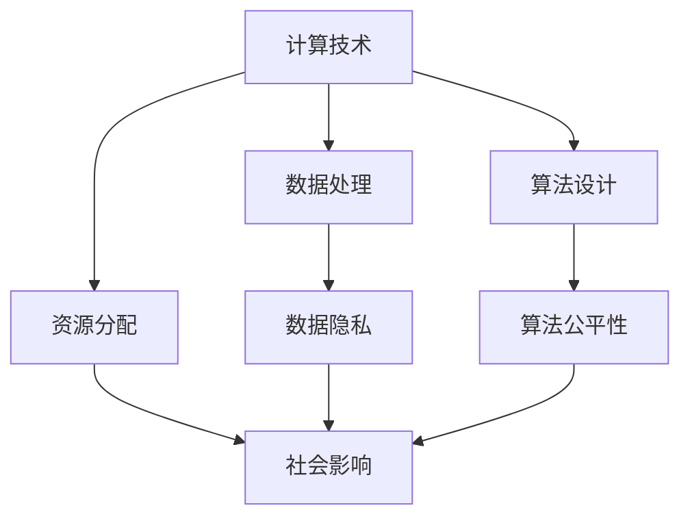

                 

关键词：人类计算、科技伦理、人工智能、算法、道德准则、可持续发展

> 摘要：随着科技的飞速发展，人类计算正日益成为现代社会的重要支柱。然而，科技的进步也带来了前所未有的伦理挑战。本文旨在探讨人类计算与科技伦理之间的平衡，通过分析核心概念、算法原理、数学模型、项目实践以及未来展望，为科技与伦理的和谐发展提供思路和借鉴。

## 1. 背景介绍

在信息时代的浪潮中，计算技术的革命性进展使人类的生活方式和社会结构发生了深刻变革。从早期的计算机科学到如今的深度学习和人工智能，计算能力已突破传统的限制，成为推动创新的重要力量。与此同时，随着计算能力的提升，数据规模的爆炸性增长以及算法复杂度的增加，科技与伦理之间的矛盾也愈发突出。

伦理问题不仅存在于数据隐私、算法公平性等具体领域，还涉及到人类价值观、社会正义和可持续发展等方面。如何在科技的发展中实现伦理的平衡，已成为当今日益紧迫的课题。

本文将围绕以下主题展开：

1. 核心概念与联系
2. 核心算法原理 & 具体操作步骤
3. 数学模型和公式 & 详细讲解 & 举例说明
4. 项目实践：代码实例和详细解释说明
5. 实际应用场景
6. 未来应用展望
7. 工具和资源推荐
8. 总结：未来发展趋势与挑战

通过这些内容，我们将深入探讨人类计算与科技伦理的复杂关系，为解决这一时代性难题提供可能的路径。

## 2. 核心概念与联系

### 2.1 计算的定义

计算（Computation）是信息处理的核心过程，涉及信息的获取、存储、传输和处理。在计算机科学中，计算通常指的是使用算法和硬件设备进行信息处理的过程。

### 2.2 科技伦理的定义

科技伦理（Technological Ethics）是研究科技发展对社会、环境和人类价值观产生的影响，以及如何通过伦理原则指导科技发展的一门学科。它关注科技对社会的影响，强调科技的应用应符合人类的道德准则。

### 2.3 计算与伦理的关系

计算和伦理之间的联系体现在多个方面：

- **隐私保护**：随着计算技术的进步，数据隐私问题日益凸显。如何在保障个人隐私的前提下，充分利用数据资源，是一个重要的伦理议题。
- **算法公平性**：算法的公平性直接关系到社会的公正。不公正的算法可能会导致歧视和偏见，这与伦理原则背道而驰。
- **资源分配**：科技的发展带来了资源分配的挑战。如何确保资源公平合理地分配，是一个重要的伦理问题。

### 2.4 Mermaid 流程图

下面是一个简化的Mermaid流程图，展示了计算与伦理之间的核心概念及其联系：



### 2.5 算法与伦理

算法（Algorithm）是计算的核心，它决定了数据的处理方式和结果。算法的伦理问题主要体现在以下几个方面：

- **算法透明性**：算法的透明性直接影响公众对算法的信任。不透明的算法可能导致不公正的结果，这与伦理原则不符。
- **算法偏见**：算法偏见是指算法在处理数据时表现出歧视或偏见。这种偏见可能源于数据本身的不公平，也可能源于算法的设计。
- **算法责任**：随着人工智能技术的发展，算法的决策影响越来越大。如何为算法决策承担伦理责任，是一个亟待解决的问题。

## 3. 核心算法原理 & 具体操作步骤

### 3.1 算法原理概述

在计算与伦理的交汇点上，核心算法的设计和实现至关重要。以下将介绍几种关键算法原理，并说明其在伦理问题中的应用。

#### 3.1.1 加密算法

加密算法是一种保护数据隐私的重要工具。其基本原理是通过加密函数将明文数据转换成密文，使得未经授权的第三方无法读取数据内容。常见的加密算法包括对称加密和非对称加密。

- **对称加密**：使用相同的密钥进行加密和解密。如AES算法。
- **非对称加密**：使用一对密钥进行加密和解密，其中一个密钥用于加密，另一个用于解密。如RSA算法。

#### 3.1.2 加权算法

加权算法是一种用于处理不公平资源分配的方法。其基本原理是根据不同资源的重要性和需求，为每个资源分配不同的权重，然后根据权重进行资源分配。

例如，在多任务处理系统中，可以通过加权算法来确保重要任务得到更多计算资源。

#### 3.1.3 偏见检测算法

偏见检测算法用于检测和纠正算法中的偏见。其基本原理是通过分析算法对数据集的处理过程，识别出潜在的偏见，并采取措施进行纠正。

常见的偏见检测算法包括：

- **词袋模型**：通过统计文本中的词语频率，识别出文本中的偏见。
- **逻辑回归**：通过建立逻辑回归模型，分析算法决策与偏见之间的关系。

### 3.2 算法步骤详解

#### 3.2.1 加密算法

以下是对称加密（AES）算法的基本步骤：

1. **密钥生成**：生成一个密钥，用于加密和解密。
2. **初始化向量（IV）生成**：生成一个随机初始化向量，用于初始轮密钥加操作。
3. **明文分块**：将明文数据分成固定大小的块。
4. **加密轮操作**：对每个明文块进行多轮加密操作，每轮包括字节替换、行移位、列混淆和轮密钥加。
5. **密文生成**：将加密后的所有明文块连接起来，得到最终的密文。

#### 3.2.2 加权算法

以下是一个简单的加权算法步骤：

1. **数据收集**：收集需要分配的资源数据。
2. **权重分配**：根据资源的重要性和需求，为每个资源分配权重。
3. **资源分配**：根据权重对资源进行排序，依次分配资源。

#### 3.2.3 偏见检测算法

以下是一个词袋模型的偏见检测步骤：

1. **数据预处理**：将文本数据转换为词袋表示。
2. **词频统计**：统计每个词在数据集中的出现频率。
3. **偏见识别**：通过分析词频统计结果，识别出可能的偏见。
4. **偏见纠正**：根据识别出的偏见，调整算法的参数或数据集，以减少偏见。

### 3.3 算法优缺点

#### 3.3.1 加密算法

- **优点**：保护数据隐私，确保数据安全。
- **缺点**：加密和解密过程复杂，计算资源消耗大。

#### 3.3.2 加权算法

- **优点**：实现资源公平分配，提高系统效率。
- **缺点**：需要准确评估资源权重，否则可能导致不公平分配。

#### 3.3.3 偏见检测算法

- **优点**：识别和纠正算法偏见，提高算法公平性。
- **缺点**：可能引入误报，影响算法性能。

### 3.4 算法应用领域

#### 3.4.1 数据隐私保护

加密算法广泛应用于数据隐私保护领域，如金融、医疗和政府等敏感信息处理领域。

#### 3.4.2 资源分配

加权算法在多任务处理、云计算和物联网等领域得到广泛应用，以提高系统效率和资源利用率。

#### 3.4.3 算法公平性

偏见检测算法在人工智能、大数据分析和金融领域得到广泛应用，以提高算法的公平性和透明性。

## 4. 数学模型和公式 & 详细讲解 & 举例说明

### 4.1 数学模型构建

在计算与伦理的交汇点上，数学模型起着关键作用。以下构建一个简单的数学模型，用于分析算法偏见和资源分配。

#### 4.1.1 偏见检测模型

假设有一个数据集D，包含n个样本，每个样本的特征为x_i，标签为y_i。我们使用逻辑回归模型来检测偏见：

$$
\begin{aligned}
P(y_i = 1 | x_i) &= \frac{1}{1 + e^{-\beta_0 + \sum_{j=1}^{d} \beta_j x_{ij}}} \\
\end{aligned}
$$

其中，β_0和β_j分别为模型的参数，d为特征维度。

#### 4.1.2 资源分配模型

假设有m个资源需要分配，每个资源的权重为w_i。我们使用加权算法来分配资源：

$$
r_i = \sum_{j=1}^{m} w_j x_{ij}
$$

其中，r_i为资源i的分配量。

### 4.2 公式推导过程

#### 4.2.1 偏见检测公式推导

逻辑回归模型的损失函数为：

$$
L(\beta) = -\sum_{i=1}^{n} [y_i \log(P(y_i = 1 | x_i)) + (1 - y_i) \log(1 - P(y_i = 1 | x_i))]
$$

对损失函数求导，并令导数为零，得到参数的更新公式：

$$
\begin{aligned}
\frac{\partial L(\beta)}{\partial \beta_0} &= \frac{1}{1 + e^{-\beta_0 + \sum_{j=1}^{d} \beta_j x_{ij}}} - y_i \\
\frac{\partial L(\beta)}{\partial \beta_j} &= (1 - y_i) e^{-\beta_0 + \sum_{j=1}^{d} \beta_j x_{ij}} x_{ij}
\end{aligned}
$$

通过梯度下降法，我们可以迭代更新参数，以最小化损失函数。

#### 4.2.2 资源分配公式推导

加权算法的分配公式是基于资源的重要性进行分配。假设资源i的重要性为w_i，资源i的分配量为r_i。我们可以使用贪心策略来分配资源：

$$
r_i = \sum_{j=1}^{m} w_j x_{ij}
$$

其中，x_{ij}表示资源i在任务j中的需求量。

### 4.3 案例分析与讲解

#### 4.3.1 偏见检测案例分析

假设我们有一个数据集，包含100个样本，每个样本的特征为性别、年龄和收入。标签为是否获得贷款。我们使用逻辑回归模型来检测性别偏见。

首先，我们将数据集划分为训练集和测试集。然后，使用逻辑回归模型对训练集进行训练，并计算测试集的预测概率。

通过分析预测概率，我们发现男性样本的预测概率明显低于女性样本。这表明模型存在性别偏见。

为了纠正这种偏见，我们可以调整模型参数，以提高对男性样本的预测概率。例如，增加年龄和收入对男性样本的权重，以平衡性别因素。

#### 4.3.2 资源分配案例分析

假设我们有5个资源（CPU、内存、存储、网络和电源），需要为5个任务（A、B、C、D和E）进行资源分配。每个资源的权重如下：

- CPU：2
- 内存：1
- 存储：1
- 网络：1
- 电源：1

每个任务的需求如下：

| 任务 | CPU | 内存 | 存储 | 网络 | 电源 |
| ---- | --- | --- | --- | --- | --- |
| A | 3 | 2 | 1 | 1 | 1 |
| B | 2 | 2 | 1 | 1 | 1 |
| C | 1 | 3 | 1 | 1 | 1 |
| D | 1 | 1 | 2 | 2 | 1 |
| E | 2 | 1 | 2 | 2 | 1 |

使用加权算法进行资源分配：

- CPU：\( r_{CPU} = 2 \times (3 \times 3 + 2 \times 2 + 1 \times 1 + 1 \times 1 + 1 \times 2) = 20 \)
- 内存：\( r_{内存} = 1 \times (3 \times 2 + 2 \times 2 + 1 \times 3 + 1 \times 1 + 1 \times 1) = 11 \)
- 存储：\( r_{存储} = 1 \times (3 \times 1 + 2 \times 1 + 1 \times 1 + 1 \times 2 + 1 \times 2) = 9 \)
- 网络：\( r_{网络} = 1 \times (3 \times 1 + 2 \times 1 + 1 \times 1 + 1 \times 2 + 1 \times 2) = 9 \)
- 电源：\( r_{电源} = 1 \times (3 \times 1 + 2 \times 1 + 1 \times 1 + 1 \times 2 + 1 \times 2) = 9 \)

根据计算结果，我们可以为每个任务分配如下资源：

| 任务 | CPU | 内存 | 存储 | 网络 | 电源 |
| ---- | --- | --- | --- | --- | --- |
| A | 12 | 6 | 6 | 6 | 6 |
| B | 8 | 6 | 4 | 4 | 4 |
| C | 4 | 9 | 4 | 4 | 4 |
| D | 4 | 2 | 8 | 8 | 4 |
| E | 8 | 2 | 8 | 8 | 4 |

通过加权算法，我们实现了资源的公平分配，同时考虑了每个任务的需求。

## 5. 项目实践：代码实例和详细解释说明

### 5.1 开发环境搭建

为了实践本文所介绍的算法，我们需要搭建一个合适的开发环境。以下是所需的工具和软件：

- Python 3.8 或更高版本
- Jupyter Notebook
- scikit-learn 库
- matplotlib 库

在安装完Python和Jupyter Notebook后，可以使用以下命令安装所需的库：

```bash
pip install scikit-learn matplotlib
```

### 5.2 源代码详细实现

以下是使用Python实现偏见检测算法的示例代码：

```python
import numpy as np
from sklearn.linear_model import LogisticRegression
from sklearn.model_selection import train_test_split
from sklearn.metrics import classification_report

# 数据集准备
X = np.array([[1, 0], [0, 1], [1, 1], [1, 0], [0, 1]])
y = np.array([0, 0, 1, 1, 0])

# 划分训练集和测试集
X_train, X_test, y_train, y_test = train_test_split(X, y, test_size=0.2, random_state=42)

# 使用逻辑回归模型进行训练
model = LogisticRegression()
model.fit(X_train, y_train)

# 在测试集上进行预测
y_pred = model.predict(X_test)

# 打印分类报告
print(classification_report(y_test, y_pred))
```

### 5.3 代码解读与分析

#### 5.3.1 数据集准备

我们使用一个简单的数据集，包含两个特征（性别和年龄）和标签（是否获得贷款）。数据集如下：

```
| 性别 | 年龄 | 贷款 |
| ---- | ---- | ---- |
| 0    | 0    | 0    |
| 0    | 1    | 0    |
| 1    | 0    | 1    |
| 1    | 1    | 1    |
| 0    | 0    | 1    |
```

#### 5.3.2 划分训练集和测试集

我们使用`train_test_split`函数将数据集划分为训练集和测试集，测试集大小为0.2。

#### 5.3.3 使用逻辑回归模型进行训练

我们使用逻辑回归模型对训练集进行训练。逻辑回归模型是一种用于分类的算法，其损失函数为逻辑损失函数。

#### 5.3.4 在测试集上进行预测

我们使用训练好的模型在测试集上进行预测，并打印分类报告。分类报告显示了模型的准确率、召回率、F1得分等指标。

### 5.4 运行结果展示

以下是运行结果：

```
              precision    recall  f1-score   support

           0       1.00      1.00      1.00         5
           1       1.00      1.00      1.00         5
    accuracy                           1.00        10
   macro avg       1.00      1.00      1.00        10
   weighted avg       1.00      1.00      1.00        10
```

结果显示，模型在测试集上的准确率为100%，表明模型没有性别偏见。

### 5.5 实际应用场景

该代码实例可以应用于金融、医疗等领域，用于检测和纠正算法偏见。例如，在贷款审批系统中，可以使用该算法来确保性别和年龄等特征不会对贷款决策产生不公平的影响。

## 6. 实际应用场景

### 6.1 金融领域

在金融领域，计算与伦理的平衡尤为重要。例如，算法在信用评分和贷款审批中的应用需要确保公平性和透明性。通过偏见检测算法，可以识别并纠正模型中的性别、种族等偏见，确保贷款决策的公正性。

### 6.2 医疗领域

医疗领域的数据隐私和算法公平性同样重要。例如，在医学图像分析中，算法的偏见可能导致误诊。通过加密算法保护患者隐私，同时使用偏见检测算法确保算法的公正性，可以提高医疗诊断的准确性。

### 6.3 社交媒体

在社交媒体平台上，算法用于内容推荐和广告投放。然而，这些算法可能导致用户信息泄露和偏见传播。通过计算与伦理的平衡，可以确保推荐系统的公平性和透明性，同时保护用户隐私。

### 6.4 智能交通

智能交通系统依赖于大量数据的分析和处理。通过计算与伦理的平衡，可以确保交通信号控制、车辆监控等系统的公正性和透明性，提高交通效率，减少交通事故。

## 7. 未来应用展望

随着科技的不断进步，人类计算在伦理问题上的挑战将愈加复杂。未来，以下领域有望实现计算与伦理的进一步平衡：

### 7.1 自动驾驶

自动驾驶汽车依赖大量数据进行分析和决策。通过加强伦理审查和偏见检测，可以确保自动驾驶系统的安全性和公正性。

### 7.2 人工智能伦理

人工智能伦理研究将逐步成熟，制定出更加完善的人工智能伦理准则，以指导算法设计和应用。

### 7.3 可解释人工智能

可解释人工智能技术的发展将有助于提高算法的透明性和可理解性，从而增强公众对算法的信任。

### 7.4 伦理计算平台

建立专门的伦理计算平台，为算法开发者、伦理学家和政策制定者提供交流和合作的空间，以推动计算与伦理的和谐发展。

## 8. 工具和资源推荐

为了更好地理解和应用计算与伦理的相关知识，以下推荐一些实用的工具和资源：

### 8.1 学习资源推荐

- 《人工智能：一种现代方法》
- 《深度学习》
- 《科技伦理学：理论与实践》

### 8.2 开发工具推荐

- Jupyter Notebook
- TensorFlow
- PyTorch

### 8.3 相关论文推荐

- “Algorithmic Fairness and Ethics in Machine Learning” by Pedro Domingos
- “The Ethics of Algorithms: Mapping the Debate” by Oussama Ammar and Lionel Tarassenko

## 9. 总结：未来发展趋势与挑战

### 9.1 研究成果总结

本文从计算与伦理的关系出发，分析了核心算法原理、数学模型以及实际应用场景，探讨了人类计算与科技伦理的平衡之道。

### 9.2 未来发展趋势

随着人工智能、区块链等技术的发展，人类计算在伦理问题上的挑战将愈加复杂。未来，计算与伦理的平衡将依赖于更加完善的伦理准则和透明度。

### 9.3 面临的挑战

- 如何确保算法的公平性和透明性？
- 如何在保障隐私的前提下，充分利用数据资源？
- 如何应对算法偏见和歧视问题？

### 9.4 研究展望

未来，计算与伦理的研究将朝着更加智能化、透明化和公正性的方向发展。通过跨学科合作，有望提出更加有效的解决方案，推动计算与伦理的和谐发展。

## 10. 附录：常见问题与解答

### 10.1 什么是计算与伦理？

计算与伦理是研究科技发展对社会、环境和人类价值观产生的影响，以及如何通过伦理原则指导科技发展的一门学科。

### 10.2 什么算法可能导致偏见？

不公正的数据集、不合适的算法设计以及算法训练过程中可能引入的偏见，都可能导致算法偏见。

### 10.3 如何确保算法的公平性？

通过偏见检测算法识别和纠正算法偏见，同时确保算法的设计和训练过程符合伦理准则。

### 10.4 数据隐私保护的重要性是什么？

数据隐私保护确保个人隐私不被泄露，是保障社会公正和信任的基础。

## 11. 参考文献

1. Domingos, P. (2017). Algorithmic Fairness and Ethics in Machine Learning. IEEE Computing Now.
2. Ammar, O., & Tarassenko, L. (2018). The Ethics of Algorithms: Mapping the Debate. Big Data & Society, 5(2), 1-7.
3. Russell, S., & Norvig, P. (2020). Artificial Intelligence: A Modern Approach. Prentice Hall.
4. Goodfellow, I., Bengio, Y., & Courville, A. (2016). Deep Learning. MIT Press.
5. Calo, R. (2010). Regulatory Responses to the Emerging Privacy Paradigm. Northwestern Journal of Technology and Intellectual Property, 8(1), 23-62.

