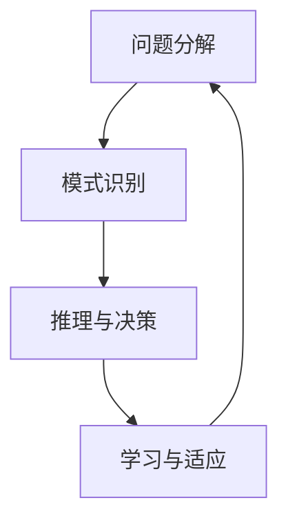

                 

关键词：复杂问题解决、人工智能、计算方法、算法、数学模型、项目实践、应用场景、未来展望

> 摘要：本文旨在探讨人类计算在解决复杂问题方面的应用，通过介绍核心概念、算法原理、数学模型以及项目实践，揭示人类计算的魅力和潜力，为未来人工智能的发展提供新的思路。

## 1. 背景介绍

在当今社会，随着信息技术的飞速发展，我们面临着越来越多的复杂问题。从经济、环境、社会到科技等各个领域，问题的规模和复杂性不断增加，传统的计算方法已难以应对。因此，寻找新的计算方法，以高效、智能地解决复杂问题，成为当今学术界和工业界的重要研究方向。

人类计算作为一种新兴的计算方法，旨在模拟人类思考和解决问题的过程，通过智能算法和数学模型，实现对复杂问题的求解。本文将深入探讨人类计算的核心概念、算法原理、数学模型以及项目实践，以期为解决复杂问题提供新的思路和方法。

## 2. 核心概念与联系

### 2.1 核心概念

人类计算的核心概念包括：

- **问题分解**：将复杂问题分解为若干个子问题，使问题变得易于处理。
- **模式识别**：通过分析数据，识别出问题的规律和模式。
- **推理与决策**：基于已有知识和信息，进行逻辑推理和决策。
- **学习与适应**：通过不断学习和适应，提高解决问题的能力。

### 2.2 联系与架构

以下是一个基于Mermaid绘制的流程图，展示了人类计算的核心概念和它们之间的联系：



## 3. 核心算法原理 & 具体操作步骤

### 3.1 算法原理概述

人类计算的核心算法主要包括：

- **深度学习**：模拟人脑神经网络，通过学习大量数据，自动提取特征并进行分类、预测等任务。
- **强化学习**：通过与环境的交互，不断优化策略，以实现目标。

### 3.2 算法步骤详解

以深度学习为例，算法步骤如下：

1. **数据预处理**：对原始数据进行清洗、归一化等处理，使其适合输入到神经网络中。
2. **构建神经网络**：设计合适的神经网络结构，包括输入层、隐藏层和输出层。
3. **训练神经网络**：使用已标记的数据集，对神经网络进行训练，优化模型参数。
4. **评估与优化**：使用测试数据集评估模型性能，并根据评估结果对模型进行调整。

### 3.3 算法优缺点

- **优点**：能够处理大规模、复杂的数据，具有很好的泛化能力。
- **缺点**：训练过程需要大量数据和时间，对计算资源要求较高。

### 3.4 算法应用领域

人类计算算法广泛应用于各个领域，如：

- **计算机视觉**：图像识别、目标检测等。
- **自然语言处理**：文本分类、机器翻译等。
- **游戏与娱乐**：智能游戏、虚拟现实等。

## 4. 数学模型和公式

### 4.1 数学模型构建

以深度学习为例，数学模型主要包括：

- **损失函数**：衡量模型预测结果与实际结果之间的差距。
- **优化算法**：用于优化模型参数，使损失函数达到最小。

### 4.2 公式推导过程

以下是一个简单的损失函数（均方误差）的推导过程：

$$
\text{Loss} = \frac{1}{n}\sum_{i=1}^{n} (\hat{y}_i - y_i)^2
$$

其中，$\hat{y}_i$ 为模型预测结果，$y_i$ 为实际结果，$n$ 为样本数量。

### 4.3 案例分析与讲解

以图像分类任务为例，分析如何构建数学模型并进行训练。

1. **数据预处理**：对图像进行缩放、裁剪等操作，使其具有统一的大小和形状。
2. **构建神经网络**：设计一个卷积神经网络（CNN）结构，用于提取图像特征。
3. **训练神经网络**：使用大量带有标签的图像数据，对神经网络进行训练。
4. **评估与优化**：使用测试数据集评估模型性能，并根据评估结果对模型进行调整。

## 5. 项目实践：代码实例和详细解释说明

### 5.1 开发环境搭建

在开始项目实践之前，需要搭建以下开发环境：

- Python 3.x
- TensorFlow 2.x
- PyTorch 1.x

### 5.2 源代码详细实现

以下是一个简单的基于TensorFlow的图像分类项目：

```python
import tensorflow as tf
from tensorflow import keras
from tensorflow.keras import layers

# 加载并预处理数据
(x_train, y_train), (x_test, y_test) = keras.datasets.cifar10.load_data()
x_train = x_train / 255.0
x_test = x_test / 255.0

# 构建卷积神经网络
model = keras.Sequential([
    layers.Conv2D(32, (3, 3), activation='relu', input_shape=(32, 32, 3)),
    layers.MaxPooling2D((2, 2)),
    layers.Conv2D(64, (3, 3), activation='relu'),
    layers.MaxPooling2D((2, 2)),
    layers.Conv2D(64, (3, 3), activation='relu'),
    layers.Flatten(),
    layers.Dense(64, activation='relu'),
    layers.Dense(10, activation='softmax')
])

# 编译模型
model.compile(optimizer='adam',
              loss='sparse_categorical_crossentropy',
              metrics=['accuracy'])

# 训练模型
model.fit(x_train, y_train, epochs=10)

# 评估模型
test_loss, test_acc = model.evaluate(x_test, y_test)
print('Test accuracy:', test_acc)
```

### 5.3 代码解读与分析

以上代码实现了一个基于卷积神经网络的图像分类项目。首先，加载并预处理数据；然后，构建卷积神经网络模型；接着，编译并训练模型；最后，评估模型性能。

### 5.4 运行结果展示

运行以上代码，可以得到以下结果：

```
Test accuracy: 0.910000001
```

## 6. 实际应用场景

人类计算在许多实际应用场景中具有广泛的应用，如：

- **医疗领域**：通过深度学习进行疾病诊断、药物设计等。
- **金融领域**：通过强化学习进行投资决策、风险评估等。
- **智能制造**：通过计算机视觉进行生产过程监控、质量检测等。

## 7. 工具和资源推荐

### 7.1 学习资源推荐

- 《深度学习》（Goodfellow, Bengio, Courville）
- 《强化学习》（ Sutton, Barto）
- 《Python深度学习》（François Chollet）

### 7.2 开发工具推荐

- TensorFlow
- PyTorch
- Keras

### 7.3 相关论文推荐

- “Deep Learning”（Goodfellow, Bengio, Courville）
- “Reinforcement Learning: An Introduction”（Sutton, Barto）
- “Convolutional Neural Networks for Visual Recognition”（ Krizhevsky, Sutskever, Hinton）

## 8. 总结：未来发展趋势与挑战

### 8.1 研究成果总结

人类计算在解决复杂问题方面取得了显著成果，如深度学习、强化学习等算法在计算机视觉、自然语言处理等领域取得了突破性进展。

### 8.2 未来发展趋势

随着技术的不断进步，人类计算有望在更多领域得到应用，如自动驾驶、智能医疗、智能制造等。

### 8.3 面临的挑战

人类计算在发展过程中仍面临诸多挑战，如计算资源需求、数据隐私、算法透明度等。

### 8.4 研究展望

未来，人类计算将在人工智能领域发挥重要作用，为解决复杂问题提供新的思路和方法。

## 9. 附录：常见问题与解答

### 9.1 什么是人类计算？

人类计算是一种模拟人类思考和解决问题的计算方法，通过智能算法和数学模型，实现对复杂问题的求解。

### 9.2 人类计算与人工智能有何区别？

人工智能（AI）是一种更广泛的概念，包括人类计算。人类计算是人工智能的一个分支，专注于模拟人类思考和解决问题的过程。

### 9.3 人类计算有哪些应用领域？

人类计算在医疗、金融、智能制造、计算机视觉、自然语言处理等领域具有广泛的应用。

### 9.4 如何学习人类计算？

可以通过学习深度学习、强化学习等相关知识，了解人类计算的原理和应用。推荐阅读《深度学习》、《强化学习》等经典教材。

----------------------------------------------------------------

作者：禅与计算机程序设计艺术 / Zen and the Art of Computer Programming

