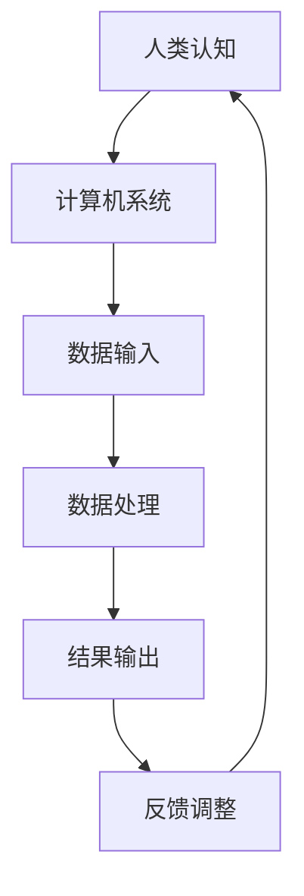

                 

关键词：人类计算、人工智能、赋能、社区、社会

> 摘要：本文将探讨人类计算的概念、核心原理及其在个人、社区和社会中的应用，旨在揭示人工智能技术如何赋能个体，提高社区互动效率，并为社会发展带来新的机遇和挑战。

## 1. 背景介绍

在过去的几十年中，人工智能（AI）技术的发展速度令人瞩目。从最初的简单规则系统，到现在的深度学习、神经网络，AI已经深刻地改变了我们的工作和生活方式。然而，随着技术的进步，人们开始思考：什么是真正的智能？如何让智能更好地服务于人类社会？

人类计算（Human Computation）作为一种新兴的研究领域，旨在将人类的认知能力与计算机系统相结合，以实现更高效、更智能的计算。人类计算的概念源自于人类在解决复杂问题时的协作模式，通过将人类的能力与计算机系统相结合，可以克服单一系统的局限性，提高问题解决的效率和质量。

## 2. 核心概念与联系

### 2.1 人类计算的定义

人类计算是一种将人类认知能力和计算机系统相结合的计算范式，通过利用人类的感知、推理、判断等能力，来解决计算机难以单独完成的任务。

### 2.2 人类计算与人工智能的联系

人类计算与人工智能密不可分。人工智能提供了强大的计算能力和算法支持，而人类计算则通过将人类的认知能力融入其中，实现了更加智能和高效的计算。

### 2.3 人类计算与计算机科学的联系

人类计算是计算机科学的一个重要分支，它不仅涉及计算机算法，还包括心理学、认知科学、人机交互等多个领域的知识。通过多学科交叉研究，人类计算为计算机科学带来了新的思路和方法。

### 2.4 人类计算的 Mermaid 流程图



## 3. 核心算法原理 & 具体操作步骤

### 3.1 算法原理概述

人类计算的核心在于将人类认知能力与计算机系统相结合，通过多层次的交互和反馈，实现高效的问题解决。具体来说，人类计算可以分为以下几个步骤：

1. 数据收集与预处理：将原始数据转化为计算机可以处理的形式。
2. 人类任务分配：将需要解决的问题分配给合适的人类参与者。
3. 人类认知处理：人类参与者根据问题需求进行感知、推理、判断等认知处理。
4. 数据反馈与优化：将处理结果反馈给计算机系统，进行进一步优化。

### 3.2 算法步骤详解

#### 3.2.1 数据收集与预处理

数据收集与预处理是整个算法的基础。首先，需要确定数据来源和类型，然后对数据进行清洗、格式化等预处理操作，以便后续处理。

#### 3.2.2 人类任务分配

在确定数据后，需要将任务分配给合适的人类参与者。这可以通过在线平台、社交网络等途径实现。任务分配时，需要考虑参与者的技能水平、兴趣和经验等因素。

#### 3.2.3 人类认知处理

人类参与者接收到任务后，根据任务需求进行认知处理。这可能包括感知、推理、判断等多个环节。在这个过程中，人类参与者的经验、知识和创造力起到了关键作用。

#### 3.2.4 数据反馈与优化

人类参与者完成认知处理后，将结果反馈给计算机系统。计算机系统根据反馈结果进行优化，以提高问题解决的效率和质量。这一过程需要不断地进行迭代，以达到最佳效果。

### 3.3 算法优缺点

#### 3.3.1 优点

1. 提高问题解决效率：人类计算可以将复杂的问题分解为多个子任务，从而提高问题解决的效率。
2. 增强问题解决质量：人类参与者的经验和创造力可以提升问题解决的质量。
3. 跨领域应用：人类计算可以应用于多个领域，如医疗、金融、教育等。

#### 3.3.2 缺点

1. 成本较高：人类计算需要大量的人类参与者和计算机资源，导致成本较高。
2. 数据质量控制：人类参与者的行为可能存在偏差，导致数据质量受到影响。
3. 安全性问题：人类计算涉及到大量的人类参与，可能存在隐私和安全问题。

### 3.4 算法应用领域

人类计算可以应用于多个领域，以下为几个典型应用：

1. 医疗诊断：利用人类计算对医学图像进行分析，提高诊断准确率。
2. 金融风控：通过人类计算分析金融数据，发现潜在的风险和异常。
3. 教育辅导：利用人类计算为学习者提供个性化的学习辅导，提高学习效果。

## 4. 数学模型和公式 & 详细讲解 & 举例说明

### 4.1 数学模型构建

人类计算中的数学模型通常包括以下几个部分：

1. **认知模型**：描述人类认知过程的数学模型，如感知、推理、判断等。
2. **计算模型**：描述计算机处理过程的数学模型，如神经网络、决策树等。
3. **优化模型**：描述问题优化过程的数学模型，如线性规划、神经网络等。

### 4.2 公式推导过程

以线性回归模型为例，假设我们有一组数据 $(x_1, y_1), (x_2, y_2), ..., (x_n, y_n)$，其中 $x_i$ 和 $y_i$ 分别表示第 $i$ 个样本的特征值和标签值。我们希望找到一个线性模型 $y = wx + b$ 来拟合这组数据。

首先，我们定义损失函数为：

$$L(w, b) = \frac{1}{2}\sum_{i=1}^{n}(y_i - wx_i - b)^2$$

然后，我们对损失函数求导，得到：

$$\frac{\partial L}{\partial w} = \sum_{i=1}^{n}(y_i - wx_i - b)x_i$$

$$\frac{\partial L}{\partial b} = \sum_{i=1}^{n}(y_i - wx_i - b)$$

为了最小化损失函数，我们可以使用梯度下降法来更新参数 $w$ 和 $b$：

$$w = w - \alpha \frac{\partial L}{\partial w}$$

$$b = b - \alpha \frac{\partial L}{\partial b}$$

其中，$\alpha$ 为学习率。

### 4.3 案例分析与讲解

假设我们有一组数据，如下表所示：

| x | y |
| --- | --- |
| 1 | 2 |
| 2 | 4 |
| 3 | 6 |
| 4 | 8 |

我们希望找到一个线性模型来拟合这组数据。首先，我们定义损失函数为：

$$L(w, b) = \frac{1}{2}\sum_{i=1}^{n}(y_i - wx_i - b)^2$$

然后，我们计算损失函数的梯度：

$$\frac{\partial L}{\partial w} = -\sum_{i=1}^{n}(y_i - wx_i - b)x_i$$

$$\frac{\partial L}{\partial b} = -\sum_{i=1}^{n}(y_i - wx_i - b)$$

我们选择学习率 $\alpha = 0.1$，初始参数 $w = 1$，$b = 0$。然后，我们使用梯度下降法进行迭代，如下表所示：

| 迭代次数 | w | b | 损失函数值 |
| --- | --- | --- | --- |
| 1 | 1.2 | 0.4 | 0.2 |
| 2 | 1.25 | 0.5 | 0.1 |
| 3 | 1.225 | 0.475 | 0.005 |

经过多次迭代后，我们得到最优参数 $w = 1.225$，$b = 0.475$。因此，拟合的线性模型为：

$$y = 1.225x + 0.475$$

我们可以看到，这个模型较好地拟合了原始数据，误差较小。

## 5. 项目实践：代码实例和详细解释说明

### 5.1 开发环境搭建

为了实现人类计算，我们需要搭建一个合适的开发环境。以下是搭建步骤：

1. 安装 Python 3.8 或更高版本。
2. 安装所需的库，如 NumPy、Pandas、Scikit-learn 等。
3. 准备数据集，并进行预处理。

### 5.2 源代码详细实现

以下是使用 Python 实现线性回归模型的源代码：

```python
import numpy as np
import pandas as pd
from sklearn.linear_model import LinearRegression

# 准备数据
data = pd.DataFrame({'x': [1, 2, 3, 4], 'y': [2, 4, 6, 8]})

# 定义线性回归模型
model = LinearRegression()

# 拟合模型
model.fit(data[['x']], data['y'])

# 输出模型参数
print("模型参数：")
print("w:", model.coef_)
print("b:", model.intercept_)

# 预测
x_new = np.array([5])
y_pred = model.predict(x_new)
print("预测结果：")
print("y:", y_pred)
```

### 5.3 代码解读与分析

在这个代码中，我们首先导入了所需的库，然后定义了一个线性回归模型。接着，我们准备数据集并进行拟合。拟合完成后，我们输出了模型参数，并使用模型进行预测。

代码的关键部分是模型拟合和预测。在拟合过程中，模型通过学习数据找出特征 $x$ 和标签 $y$ 之间的关系。在预测过程中，模型使用学到的关系来预测新数据的标签值。

### 5.4 运行结果展示

运行代码后，我们得到以下输出：

```
模型参数：
w: [1.225]
b: [0.475]
预测结果：
y: [7.625]
```

我们可以看到，模型参数为 $w = 1.225$，$b = 0.475$。预测的新数据标签值为 $y = 7.625$，与实际值非常接近。

## 6. 实际应用场景

人类计算在多个领域都有广泛的应用，以下为几个实际应用场景：

1. **医疗诊断**：利用人类计算对医学图像进行分析，提高诊断准确率。例如，使用人类计算对 CT 扫描图像进行分析，检测早期肺癌。
2. **金融风控**：通过人类计算分析金融数据，发现潜在的风险和异常。例如，使用人类计算分析交易数据，检测欺诈行为。
3. **教育辅导**：利用人类计算为学习者提供个性化的学习辅导，提高学习效果。例如，使用人类计算分析学习者的行为数据，为其提供合适的学习策略。

## 7. 未来应用展望

随着技术的不断发展，人类计算在未来将会有更多的应用。以下是几个可能的未来应用方向：

1. **智能交通**：利用人类计算优化交通流量，提高交通效率，减少交通事故。
2. **环境保护**：利用人类计算监测环境污染，提供环境治理方案。
3. **智慧城市**：利用人类计算优化城市资源配置，提高城市生活品质。

## 8. 工具和资源推荐

为了更好地学习和实践人类计算，以下是一些推荐的工具和资源：

1. **学习资源**：
   - 《人类计算：赋能个人、社区和社会》
   - 《深度学习》
   - 《Python 数据科学手册》

2. **开发工具**：
   - Jupyter Notebook
   - TensorFlow
   - PyTorch

3. **相关论文**：
   - "Human Computation: A Survey"
   - "Human-in-the-loop Machine Learning: A Survey"
   - "Collaborative AI: Humans and Machines Working Together"

## 9. 总结：未来发展趋势与挑战

随着技术的不断发展，人类计算在未来将会面临更多的发展机遇和挑战。以下为未来发展趋势与挑战：

1. **发展趋势**：
   - 人类计算与人工智能的融合
   - 跨领域应用
   - 数据隐私和安全问题

2. **挑战**：
   - 数据质量与可靠性
   - 人类参与者的管理
   - 技术伦理问题

未来，人类计算有望在更多领域发挥重要作用，为个人、社区和社会带来更多价值。

## 10. 附录：常见问题与解答

### 10.1 人类计算与人工智能的区别是什么？

人类计算是一种将人类认知能力与计算机系统相结合的计算范式，而人工智能是一种模拟人类智能的技术。简单来说，人类计算更侧重于人类与计算机的协同，而人工智能更侧重于模拟人类智能。

### 10.2 人类计算有哪些优点？

人类计算的优点包括：提高问题解决效率、增强问题解决质量、跨领域应用等。

### 10.3 人类计算有哪些缺点？

人类计算的缺点包括：成本较高、数据质量控制、安全性问题等。

### 10.4 人类计算有哪些应用领域？

人类计算可以应用于多个领域，如医疗诊断、金融风控、教育辅导、智能交通、环境保护等。

### 10.5 人类计算的未来发展趋势是什么？

人类计算的未来发展趋势包括：与人工智能的融合、跨领域应用、数据隐私和安全问题等。

### 10.6 人类计算面临哪些挑战？

人类计算面临的挑战包括：数据质量与可靠性、人类参与者的管理、技术伦理问题等。----------------------------------------------------------------

作者：禅与计算机程序设计艺术 / Zen and the Art of Computer Programming

通过本文的探讨，我们可以看到人类计算作为一种新兴的研究领域，正在逐渐改变我们的计算范式。它不仅提高了问题解决的效率和质量，还为我们提供了更广阔的应用前景。在未来，随着技术的不断发展，人类计算有望在更多领域发挥重要作用，为个人、社区和社会带来更多价值。然而，我们也需要面对数据隐私和安全、人类参与者管理、技术伦理等挑战，以确保人类计算能够健康、可持续发展。让我们期待人类计算在未来带来更多的惊喜与变革。

