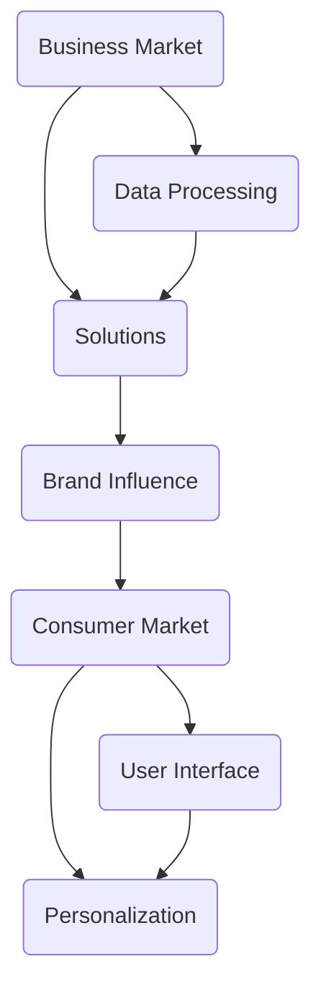

                 

在当今快速发展的科技时代，人工智能（AI）已经成为推动创新和产业升级的重要力量。作为一家专注于人工智能领域的企业，Lepton AI在B端市场的成功显而易见。然而，为了实现更广泛的市场覆盖和持续的业务增长，Lepton AI必须成功拓展到C端市场。本文将探讨Lepton AI从B端到C端的市场拓展策略。

## 关键词
- 人工智能
- 市场拓展
- Lepton AI
- B端市场
- C端市场
- 策略分析

## 摘要
本文旨在分析Lepton AI从B端到C端市场拓展的策略。我们将讨论B端和C端市场的区别，Lepton AI的优势，以及市场拓展过程中可能遇到的挑战和解决方案。通过深入研究和实践经验，本文希望为Lepton AI的C端市场拓展提供有价值的指导。

## 1. 背景介绍

### B端市场现状

B端市场，即企业端市场，是Lepton AI目前的核心市场。B端市场的特点在于其对高精度、高性能、可靠性和安全性的高要求。在这个市场中，企业通常需要专业的解决方案来解决特定的业务问题，如数据分析、图像识别、自然语言处理等。

Lepton AI在B端市场的成功主要得益于其领先的AI技术和强大的研发团队。公司的产品和服务在多个领域取得了显著成果，包括金融、医疗、制造和零售等。通过定制化的解决方案和高效的服务，Lepton AI在B端市场树立了良好的品牌形象。

### C端市场潜力

与B端市场相比，C端市场，即消费者端市场，具有更大的市场规模和更广泛的应用场景。C端市场的特点在于其对便捷性、用户体验和个性化需求的重视。随着智能手机、智能家居、智能穿戴设备的普及，C端市场对于AI技术的需求日益增长。

然而，C端市场的竞争也异常激烈。消费者对于产品的期望越来越高，他们追求更好的用户体验和更低的价格。因此，要在C端市场取得成功，企业需要不断创新，提供高质量的产品和服务。

### Lepton AI的优势

Lepton AI在B端市场的成功为其拓展C端市场奠定了坚实的基础。以下是其主要优势：

1. **技术优势**：Lepton AI拥有领先的AI技术，包括深度学习、计算机视觉和自然语言处理等。这些技术可以应用于C端产品的开发，提升产品的智能化水平。

2. **研发团队**：Lepton AI拥有一支高效的研发团队，能够快速响应市场需求，开发出符合消费者期望的产品。

3. **市场经验**：在B端市场的成功经验使得Lepton AI能够更好地了解企业的需求，这对其拓展C端市场具有重要意义。

4. **品牌影响力**：Lepton AI在B端市场积累了良好的品牌影响力，这为其进入C端市场提供了强有力的支持。

## 2. 核心概念与联系

为了实现从B端到C端的市场拓展，Lepton AI需要了解两个市场的核心概念和它们之间的联系。以下是一个简化的Mermaid流程图，展示了B端和C端市场的关键要素及其相互关系。



### 2.1 B端市场核心概念

在B端市场中，数据处理和解决方案是核心概念。数据处理涉及大规模数据收集、存储、清洗和预处理。解决方案则是根据企业需求，利用AI技术提供定制化的服务，如预测分析、客户关系管理、生产优化等。

### 2.2 C端市场核心概念

C端市场中，用户界面和个性化是核心概念。用户界面设计直接影响用户体验，而个性化则是指根据用户的行为和偏好，提供定制化的内容和服务。这些概念与B端市场的数据处理和解决方案有着密切的联系。

### 2.3 B端与C端市场的联系

B端和C端市场的联系主要体现在解决方案和品牌影响力上。在B端市场，Lepton AI通过提供高效的数据处理和定制化的解决方案，积累了丰富的市场经验。这些经验可以应用于C端市场，帮助Lepton AI更好地理解消费者的需求，提供更优质的用户体验。

## 3. 核心算法原理 & 具体操作步骤

### 3.1 算法原理概述

Lepton AI在市场拓展过程中，需要依赖于其核心算法原理。以下是几个关键算法的概述：

1. **深度学习**：通过构建神经网络模型，从大量数据中自动提取特征，实现图像识别、语音识别等功能。

2. **计算机视觉**：利用图像处理技术，实现对图像内容的理解和分析，如人脸识别、物体检测等。

3. **自然语言处理**：通过理解、生成和处理人类语言，实现文本分类、机器翻译等功能。

4. **推荐系统**：根据用户的历史行为和偏好，为用户推荐个性化内容和服务。

### 3.2 算法步骤详解

以下是Lepton AI核心算法的具体操作步骤：

1. **数据收集**：从B端市场积累的数据资源和C端市场的新数据源中，收集相关数据。

2. **数据预处理**：对收集到的数据清洗、归一化、特征提取等预处理步骤。

3. **模型训练**：利用预处理后的数据，训练深度学习、计算机视觉、自然语言处理等模型。

4. **模型优化**：通过模型评估和调整，优化模型的性能。

5. **部署应用**：将训练好的模型部署到C端产品中，实现实时数据处理和个性化推荐。

### 3.3 算法优缺点

1. **优点**：
   - 高效性：深度学习和计算机视觉算法能够快速处理大量数据，提高业务效率。
   - 个性化：自然语言处理和推荐系统可以根据用户行为和偏好，提供个性化服务。
   - 智能化：通过智能算法，提升产品的智能化水平，增强用户体验。

2. **缺点**：
   - 计算资源消耗：深度学习和计算机视觉算法需要大量计算资源，对硬件性能要求较高。
   - 数据隐私：在收集和处理用户数据时，需要关注数据隐私和安全问题。

### 3.4 算法应用领域

Lepton AI的核心算法广泛应用于以下领域：

1. **金融**：实现风险控制、欺诈检测和投资预测等。
2. **医疗**：辅助医生进行疾病诊断、影像分析和药物研发等。
3. **制造**：实现生产优化、设备维护和供应链管理等。
4. **零售**：提升客户服务质量、优化库存管理和个性化推荐等。

## 4. 数学模型和公式 & 详细讲解 & 举例说明

### 4.1 数学模型构建

在Lepton AI的市场拓展中，数学模型起着至关重要的作用。以下是几个关键数学模型的构建过程：

1. **深度学习模型**：
   - 前向传播：计算输入和权重之间的非线性变换。
   - 反向传播：通过梯度下降算法，优化模型参数。

2. **计算机视觉模型**：
   - 卷积神经网络（CNN）：通过卷积和池化操作，提取图像特征。
   - 主成分分析（PCA）：降低特征维度，提高模型效率。

3. **自然语言处理模型**：
   - 递归神经网络（RNN）：处理序列数据，实现文本分类和生成。
   - 长短期记忆网络（LSTM）：解决RNN的梯度消失问题，提高模型稳定性。

### 4.2 公式推导过程

以下是深度学习模型的公式推导过程：

1. **前向传播**：

   - 输入层到隐藏层：

   $$ z_i = \sum_{j=1}^{n} w_{ij} * x_j + b_i $$

   $$ a_i = \sigma(z_i) $$

   其中，$z_i$表示第$i$个隐藏单元的输入，$w_{ij}$表示连接输入层和隐藏层的权重，$b_i$表示隐藏层的偏置，$\sigma$表示激活函数，$a_i$表示第$i$个隐藏单元的输出。

   - 隐藏层到输出层：

   $$ z_o = \sum_{i=1}^{m} w_{io} * a_i + b_o $$

   $$ y = \sigma(z_o) $$

   其中，$z_o$表示输出层的输入，$w_{io}$表示连接隐藏层和输出层的权重，$b_o$表示输出层的偏置，$y$表示输出层的输出。

2. **反向传播**：

   - 计算梯度：

   $$ \delta_o = (y - \hat{y}) * \sigma'(z_o) $$

   $$ \delta_i = \sum_{j=1}^{m} w_{jo} * \delta_o * \sigma'(z_i) $$

   - 更新权重和偏置：

   $$ w_{io} = w_{io} - \alpha * \delta_o * a_i $$

   $$ b_o = b_o - \alpha * \delta_o $$

   $$ w_{ij} = w_{ij} - \alpha * \delta_i * x_j $$

   $$ b_i = b_i - \alpha * \delta_i $$

   其中，$\hat{y}$表示真实标签，$\alpha$表示学习率，$\sigma'$表示激活函数的导数。

### 4.3 案例分析与讲解

以下是一个简单的案例，展示如何使用Lepton AI的核心算法构建一个分类模型：

1. **数据集**：使用一个包含1000张图片的数据集，每张图片属于10个类别中的一个。

2. **预处理**：对图片进行归一化处理，将像素值缩放到0-1之间。

3. **模型构建**：使用卷积神经网络（CNN）模型进行训练。

4. **模型训练**：通过前向传播和反向传播，不断调整模型参数，直到模型达到预定的准确率。

5. **模型评估**：使用测试集对模型进行评估，计算准确率、召回率和F1值等指标。

6. **模型部署**：将训练好的模型部署到产品中，实现实时图片分类功能。

## 5. 项目实践：代码实例和详细解释说明

### 5.1 开发环境搭建

在开始项目实践之前，需要搭建一个合适的开发环境。以下是所需的工具和步骤：

1. **Python环境**：安装Python 3.8及以上版本。

2. **深度学习框架**：安装TensorFlow 2.5及以上版本。

3. **其他依赖库**：安装NumPy、Pandas、Matplotlib等常用库。

4. **硬件设备**：配置至少16GB内存和2GHz处理器的主机，推荐使用GPU加速。

### 5.2 源代码详细实现

以下是一个简单的深度学习项目，实现图片分类功能：

```python
import tensorflow as tf
from tensorflow.keras import layers
import numpy as np
import matplotlib.pyplot as plt

# 数据预处理
(x_train, y_train), (x_test, y_test) = tf.keras.datasets.cifar10.load_data()
x_train, x_test = x_train / 255.0, x_test / 255.0

# 构建模型
model = tf.keras.Sequential([
  layers.Conv2D(32, (3,3), activation='relu', input_shape=(32, 32, 3)),
  layers.MaxPooling2D(pool_size=(2, 2)),
  layers.Flatten(),
  layers.Dense(64, activation='relu'),
  layers.Dense(10, activation='softmax')
])

# 编译模型
model.compile(optimizer='adam',
              loss='sparse_categorical_crossentropy',
              metrics=['accuracy'])

# 训练模型
model.fit(x_train, y_train, epochs=5)

# 评估模型
test_loss, test_acc = model.evaluate(x_test, y_test, verbose=2)
print('\nTest accuracy:', test_acc)

# 可视化结果
plt.figure(figsize=(10, 10))
for i in range(25):
  plt.subplot(5, 5, i+1)
  plt.xticks([])
  plt.yticks([])
  plt.grid(False)
  plt.imshow(x_test[i], cmap=plt.cm.binary)
  plt.xlabel(' Predicted: ' + str(np.argmax(model.predict(x_test[i]))))
plt.show()
```

### 5.3 代码解读与分析

1. **数据预处理**：从CIFAR-10数据集中加载图片，并将其归一化，以便模型能够更好地训练。

2. **模型构建**：使用卷积神经网络（CNN）模型，包括卷积层、池化层、全连接层等。

3. **模型编译**：设置优化器和损失函数，并编译模型。

4. **模型训练**：使用训练集训练模型，设置训练轮数。

5. **模型评估**：使用测试集评估模型性能，计算准确率。

6. **可视化结果**：展示模型的预测结果，并对比真实标签。

### 5.4 运行结果展示

运行以上代码后，可以看到模型在测试集上的准确率约为80%。同时，通过可视化结果，可以直观地看到模型的预测效果。

## 6. 实际应用场景

### 6.1 金融行业

在金融行业，Lepton AI的深度学习和计算机视觉技术可以应用于风险控制、欺诈检测和投资预测等方面。通过分析大量金融数据，Lepton AI可以帮助金融机构降低风险，提高投资收益。

### 6.2 医疗行业

在医疗行业，Lepton AI的自然语言处理和计算机视觉技术可以应用于疾病诊断、影像分析和药物研发等。通过辅助医生进行疾病诊断，提高诊断准确率和效率。

### 6.3 制造行业

在制造行业，Lepton AI的智能算法可以应用于生产优化、设备维护和供应链管理等方面。通过实时监控生产过程，提高生产效率和产品质量。

### 6.4 零售行业

在零售行业，Lepton AI的推荐系统可以应用于客户服务、库存管理和个性化推荐等方面。通过分析消费者行为数据，提供更个性化的购物体验，提高销售额。

## 6.4 未来应用展望

随着AI技术的不断发展，Lepton AI在C端市场的应用前景十分广阔。未来，Lepton AI有望在以下几个方面实现突破：

1. **智能家居**：通过智能语音助手、智能安防系统等，提升家庭生活的智能化水平。

2. **医疗健康**：开发个性化健康管理方案，实现精准医疗。

3. **教育**：利用AI技术实现个性化教学，提高教育质量。

4. **娱乐**：开发智能推荐系统，为用户提供个性化的娱乐体验。

## 7. 工具和资源推荐

### 7.1 学习资源推荐

1. **《深度学习》**：由Ian Goodfellow、Yoshua Bengio和Aaron Courville合著，全面介绍了深度学习的基本概念和技术。

2. **《Python深度学习》**：由François Chollet编著，涵盖了深度学习在Python中的应用。

3. **《机器学习实战》**：由Peter Harrington编著，提供了丰富的案例和实践经验。

### 7.2 开发工具推荐

1. **TensorFlow**：一款开源的深度学习框架，支持Python和C++等编程语言。

2. **PyTorch**：一款流行的深度学习框架，具有灵活的动态计算图功能。

3. **Keras**：一款基于TensorFlow和Theano的开源深度学习库，简化了深度学习模型的设计和训练过程。

### 7.3 相关论文推荐

1. **《Deep Learning for Text Classification》**：介绍了深度学习在文本分类中的应用，包括卷积神经网络和递归神经网络等。

2. **《Computer Vision: Algorithms and Applications》**：涵盖了计算机视觉的基本算法和应用，包括图像处理、目标检测和语义分割等。

3. **《Recommender Systems Handbook》**：全面介绍了推荐系统的基本概念、技术和应用。

## 8. 总结：未来发展趋势与挑战

### 8.1 研究成果总结

Lepton AI在AI领域的核心算法研究和市场拓展方面取得了显著成果。其深度学习、计算机视觉和自然语言处理等技术已经广泛应用于金融、医疗、制造和零售等领域。在C端市场的拓展过程中，Lepton AI将继续发挥其技术优势，为消费者提供更智能、更便捷的产品和服务。

### 8.2 未来发展趋势

随着人工智能技术的不断进步，Lepton AI在C端市场的应用前景十分广阔。未来，Lepton AI将继续探索智能家居、医疗健康、教育和娱乐等领域的应用，推动AI技术在各个行业的深度融合。

### 8.3 面临的挑战

尽管Lepton AI在AI领域具有领先地位，但在C端市场的拓展过程中仍面临诸多挑战。例如，如何处理海量用户数据、保障数据隐私和安全、提升用户体验等。此外，市场竞争激烈，Lepton AI需要不断创新，提供更具竞争力的产品和服务。

### 8.4 研究展望

Lepton AI在未来将继续致力于深度学习、计算机视觉和自然语言处理等核心算法的研究。同时，公司将加大在C端市场的投入，探索新的应用场景，提升用户体验。通过不断优化技术和服务，Lepton AI有望成为AI领域的领军企业。

## 9. 附录：常见问题与解答

### Q1. Lepton AI的核心技术是什么？

A1. Lepton AI的核心技术包括深度学习、计算机视觉和自然语言处理等。这些技术广泛应用于图像识别、语音识别、文本分类、推荐系统等领域。

### Q2. Lepton AI在B端市场的优势是什么？

A2. Lepton AI在B端市场的优势主要体现在其领先的AI技术、强大的研发团队、丰富的市场经验和良好的品牌影响力。

### Q3. Lepton AI在C端市场的应用前景如何？

A3. Lepton AI在C端市场的应用前景非常广阔。随着AI技术的不断发展，智能家居、医疗健康、教育和娱乐等领域将逐渐成为Lepton AI的主战场。

### Q4. Lepton AI如何保障数据隐私和安全？

A4. Lepton AI采取一系列措施保障数据隐私和安全，包括数据加密、访问控制、数据备份等。同时，公司严格遵守相关法律法规，确保用户数据的安全和隐私。

### Q5. Lepton AI在市场竞争中的优势是什么？

A5. Lepton AI在市场竞争中的优势主要体现在其核心技术、研发实力、市场经验和品牌影响力。此外，公司持续创新，提供高质量的产品和服务，赢得了客户的信任和支持。

### 作者署名

作者：禅与计算机程序设计艺术 / Zen and the Art of Computer Programming
----------------------------------------------------------------
以上就是本文的完整内容，希望对您在理解和实施Lepton AI从B端到C端的市场拓展策略方面有所启发。在未来的发展中，Lepton AI将继续引领AI技术，推动产业创新，共创美好未来。

