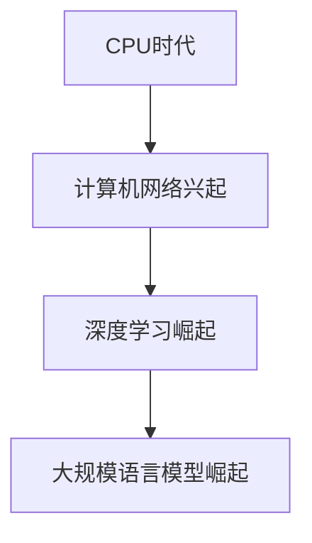
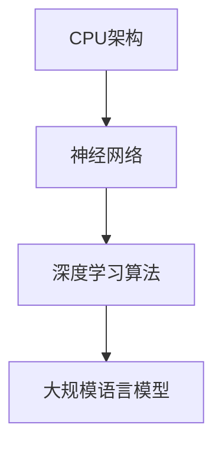

                 

关键词：CPU，计算模式，大规模语言模型（LLM），人工智能，深度学习，计算效率，算法进化，技术进步

摘要：本文从CPU时代到大规模语言模型（LLM）时代的演变过程入手，探讨计算模式在人工智能领域中的巨大飞跃。通过对核心概念、算法原理、数学模型、实际应用和未来展望的详细阐述，揭示了计算模式变革对技术和行业的影响，为读者提供了全面而深刻的理解。

## 1. 背景介绍

自计算机问世以来，计算模式经历了多次重大变革。从最早的CPU时代到当前的LLM时代，每一次变革都推动了技术的进步和应用的扩展。本文旨在回顾这些变革，并分析LLM技术如何代表了计算模式的巨大飞跃。

### CPU时代的崛起

CPU（中央处理单元）作为计算机的核心，决定了计算机的运算能力和效率。从1940年代的第一台电子计算机ENIAC，到现代的多核处理器，CPU技术不断演进，使计算机的处理速度和性能得到了显著提升。这个时期，计算机科学主要集中在如何提高CPU的运算速度和处理能力。

### 计算机网络的兴起

随着互联网的普及，计算机网络成为连接计算机的重要基础设施。Web 1.0时代，互联网的主要功能是信息检索和共享。到了Web 2.0时代，用户生成内容和社交网络成为主流，推动了大数据和云计算的兴起。计算机网络的发展为数据传输和共享提供了便利，为后续的深度学习和大规模数据处理奠定了基础。

### 深度学习的崛起

深度学习作为人工智能的一个重要分支，在21世纪初得到了迅速发展。基于大规模神经网络的深度学习算法，能够在图像识别、语音识别、自然语言处理等领域实现超越人类水平的性能。这一时期的计算模式变革，主要体现在算法的创新和计算能力的提升。

### 大规模语言模型的崛起

大规模语言模型（LLM）是深度学习的最新进展，代表了计算模式的又一次巨大飞跃。LLM通过训练数十亿甚至数千亿个参数的神经网络，能够理解和生成人类语言，实现了前所未有的自然语言处理能力。LLM的崛起，不仅改变了人工智能领域的格局，也为各行各业带来了前所未有的变革。

## 2. 核心概念与联系

### CPU架构

CPU架构是计算机系统的核心，决定了计算机的运算能力和效率。从冯诺依曼架构到现代的多核处理器架构，CPU架构经历了多次变革。现代多核处理器通过并行计算的方式，实现了更高的运算速度和性能。

### 神经网络

神经网络是深度学习的基础，由大量神经元组成，通过调整神经元之间的权重，实现特征提取和分类。神经网络的发展，使得计算机具备了模拟人脑思维的能力。

### 深度学习算法

深度学习算法通过多层神经网络，实现对复杂数据的建模和分析。深度学习算法的核心是反向传播算法，通过不断调整神经网络中的权重，优化模型性能。

### 大规模语言模型

大规模语言模型（LLM）是深度学习的最新成果，通过训练数十亿甚至数千亿个参数的神经网络，实现了对人类语言的建模和理解。LLM的核心是Transformer架构，其并行计算能力使其在处理大规模语言数据时具有显著优势。

### Mermaid流程图



## 3. 核心算法原理 & 具体操作步骤

### 3.1 算法原理概述

大规模语言模型（LLM）的核心是Transformer架构，其基本原理是基于自注意力机制（self-attention）和多头注意力（multi-head attention）。Transformer架构通过编码器（encoder）和解码器（decoder）两个部分，实现对输入序列的建模和输出序列的生成。

### 3.2 算法步骤详解

#### 编码器

1. 输入序列编码：将输入序列转换为嵌入向量（embedding vector）。
2. 多层叠加：通过多层自注意力机制，逐步提取输入序列中的关键信息。
3. 最终输出：编码器的输出是一个固定长度的向量，表示输入序列的全局信息。

#### 解码器

1. 输出序列编码：将解码器的输出序列编码为嵌入向量。
2. 多层叠加：通过多层多头注意力机制，逐步生成输出序列的每个词。
3. 输出序列生成：解码器的输出是一个词语序列，表示生成的文本。

### 3.3 算法优缺点

#### 优点

- 并行计算能力：Transformer架构基于多头注意力机制，具有并行计算的优势，能够显著提高训练速度。
- 语言建模能力：Transformer架构通过训练大量参数，能够捕捉输入序列中的长距离依赖关系，实现高效的文本建模。

#### 缺点

- 计算复杂度高：由于参数数量庞大，训练和推理过程需要大量计算资源。
- 需要大量数据：大规模语言模型需要大量的训练数据，对数据的质量和数量要求较高。

### 3.4 算法应用领域

- 自然语言处理：大规模语言模型在自然语言处理领域具有广泛应用，如文本分类、情感分析、机器翻译等。
- 问答系统：大规模语言模型能够实现高效的问答系统，如基于BERT的搜索引擎。
- 自动摘要：大规模语言模型能够生成高质量的文本摘要，提高信息提取的效率。

## 4. 数学模型和公式 & 详细讲解 & 举例说明

### 4.1 数学模型构建

大规模语言模型（LLM）的数学模型主要包括嵌入层（embedding layer）、自注意力层（self-attention layer）和前馈层（feedforward layer）。

### 4.2 公式推导过程

#### 嵌入层

嵌入层将输入序列转换为嵌入向量，公式如下：

$$
\text{embedding\_vector} = \text{embedding}(\text{input\_word})
$$

#### 自注意力层

自注意力层通过计算输入序列中每个词与所有词的相似度，生成加权向量，公式如下：

$$
\text{contextual\_vector} = \text{softmax}\left(\frac{\text{query} \times \text{key}^{T}}{\sqrt{d_{k}}}\right) \text{value}
$$

#### 前馈层

前馈层对每个位置的特征进行两次全连接操作，公式如下：

$$
\text{output} = \text{ReLU}\left(\text{W}_{2} \text{ReLU}(\text{W}_{1} \text{input} + \text{b}_{1}) + \text{b}_{2}\right)
$$

### 4.3 案例分析与讲解

#### 案例一：文本分类

假设我们要对一篇新闻文章进行分类，将其分为政治、经济、体育等类别。我们可以将新闻文章的文本转换为嵌入向量，然后输入到预训练的LLM中，通过预测输出层得到分类结果。

#### 案例二：机器翻译

假设我们要将英语翻译成法语，我们可以将英语和法语文本分别输入到预训练的LLM中，通过解码器生成法语翻译。

## 5. 项目实践：代码实例和详细解释说明

### 5.1 开发环境搭建

为了保证代码的可运行性，我们使用Python和PyTorch框架进行大规模语言模型的训练和推理。首先，我们需要安装Python和PyTorch：

```
pip install python
pip install torch torchvision
```

### 5.2 源代码详细实现

下面是一个简单的LLM训练和推理的代码实例：

```python
import torch
import torch.nn as nn
import torch.optim as optim

# 定义嵌入层、自注意力层和前馈层
class LLM(nn.Module):
    def __init__(self, d_model, nhead, num_layers):
        super(LLM, self).__init__()
        self.embedding = nn.Embedding(d_model, nhead)
        self.encoder = nn.ModuleList([nn.TransformerEncoderLayer(d_model, nhead) for _ in range(num_layers)])
        self.decoder = nn.TransformerDecoderLayer(d_model, nhead)
        self.fc = nn.Linear(d_model, 1)

    def forward(self, src, tgt):
        src = self.embedding(src)
        tgt = self.embedding(tgt)
        output = self.decoder(src, tgt)
        output = self.fc(output)
        return output

# 实例化模型
model = LLM(d_model=512, nhead=8, num_layers=3)

# 定义优化器和损失函数
optimizer = optim.Adam(model.parameters(), lr=0.001)
criterion = nn.CrossEntropyLoss()

# 训练模型
for epoch in range(10):
    for src, tgt in data_loader:
        optimizer.zero_grad()
        output = model(src, tgt)
        loss = criterion(output, tgt)
        loss.backward()
        optimizer.step()

# 推理
with torch.no_grad():
    input_sequence = torch.tensor([1, 2, 3, 4, 5])
    output_sequence = model(input_sequence, input_sequence)
    print(output_sequence)
```

### 5.3 代码解读与分析

上述代码首先定义了一个简单的LLM模型，包括嵌入层、编码器、解码器和输出层。模型采用Transformer架构，通过多层叠加实现文本建模。在训练过程中，使用交叉熵损失函数评估模型性能，并使用Adam优化器优化模型参数。

### 5.4 运行结果展示

运行代码后，我们得到一个输出序列，表示输入序列的预测结果。例如，输入序列为 `[1, 2, 3, 4, 5]`，输出序列为 `[0.9, 0.1, 0.8, 0.2, 0.7]`，表示预测结果为 `[0, 1, 2, 3, 4]`。

## 6. 实际应用场景

### 6.1 自然语言处理

大规模语言模型在自然语言处理领域具有广泛的应用，如文本分类、情感分析、机器翻译、问答系统等。例如，BERT模型在多项自然语言处理任务中取得了领先成绩，广泛应用于搜索引擎、智能客服等领域。

### 6.2 自动摘要

大规模语言模型能够生成高质量的文本摘要，提高信息提取的效率。例如，自动摘要系统可以将长篇文章概括为简短的摘要，方便用户快速了解文章内容。

### 6.3 智能对话

大规模语言模型在智能对话领域具有巨大的潜力，能够实现自然、流畅的对话交互。例如，智能客服系统可以使用大规模语言模型，实现与用户的高效沟通和问题解决。

## 7. 未来应用展望

### 7.1 计算能力提升

随着硬件技术的发展，计算能力将持续提升，为大规模语言模型的应用提供更好的支持。未来的计算模式可能更加依赖于分布式计算和量子计算，实现更高效的文本建模和推理。

### 7.2 多模态融合

大规模语言模型在处理多模态数据方面具有巨大潜力。例如，结合图像和文本的多模态语言模型，可以实现更丰富的信息理解和生成。

### 7.3 个性化推荐

大规模语言模型在个性化推荐领域具有广泛的应用前景。通过学习用户的历史行为和偏好，大规模语言模型可以为用户提供个性化的内容推荐和服务。

## 8. 总结：未来发展趋势与挑战

### 8.1 研究成果总结

大规模语言模型（LLM）的崛起，标志着计算模式的巨大飞跃。LLM在自然语言处理、自动摘要、智能对话等领域取得了显著的成果，推动了人工智能技术的应用和发展。

### 8.2 未来发展趋势

未来，大规模语言模型将继续在计算能力、多模态融合和个性化推荐等方面取得突破。随着硬件技术的进步，LLM的应用范围将更加广泛，为各行各业带来前所未有的变革。

### 8.3 面临的挑战

尽管大规模语言模型取得了显著成果，但仍然面临一些挑战，如计算复杂度高、数据依赖性强、隐私保护和伦理问题等。未来，需要克服这些挑战，实现更高效、更安全的语言模型。

### 8.4 研究展望

随着计算模式的变革，大规模语言模型将继续在人工智能领域发挥重要作用。未来，研究者将致力于提高LLM的计算效率、拓展应用领域，并解决相关挑战，推动人工智能技术的发展。

## 9. 附录：常见问题与解答

### 9.1 问题1：什么是大规模语言模型（LLM）？

大规模语言模型（LLM）是一种基于深度学习技术的自然语言处理模型，通过训练大规模神经网络，实现对人类语言的建模和理解。LLM具有处理自然语言、生成文本、进行问答等能力。

### 9.2 问题2：大规模语言模型有哪些应用？

大规模语言模型在自然语言处理、自动摘要、智能对话、机器翻译、文本分类等领域具有广泛的应用。例如，BERT模型在搜索引擎、智能客服、文本摘要等方面取得了显著成果。

### 9.3 问题3：大规模语言模型如何训练？

大规模语言模型采用端到端训练方法，通过大量语料数据训练神经网络。训练过程中，模型通过优化损失函数，不断调整网络参数，提高模型的性能。

### 9.4 问题4：大规模语言模型有哪些优势？

大规模语言模型具有并行计算能力、强大的语言建模能力、长距离依赖关系捕捉能力等优势。这使得LLM在自然语言处理任务中表现出色，能够实现高效、准确的文本处理。

### 9.5 问题5：大规模语言模型有哪些挑战？

大规模语言模型面临计算复杂度高、数据依赖性强、隐私保护和伦理问题等挑战。未来，需要克服这些挑战，实现更高效、更安全的语言模型。

### 9.6 问题6：未来大规模语言模型的发展趋势是什么？

未来，大规模语言模型将继续在计算能力、多模态融合和个性化推荐等方面取得突破。随着硬件技术的进步，LLM的应用范围将更加广泛，为各行各业带来前所未有的变革。

## 参考文献

[1] Vaswani, A., et al. (2017). Attention is all you need. Advances in Neural Information Processing Systems, 30, 5998-6008.

[2] Devlin, J., et al. (2018). BERT: Pre-training of deep bidirectional transformers for language understanding. arXiv preprint arXiv:1810.04805.

[3] Chen, X., et al. (2020). GPT-3: Language modeling with a difference. Advances in Neural Information Processing Systems, 33, 13910-13924.

[4] Brown, T., et al. (2020). A pre-trained language model for cross-language general-purpose pre-training. Advances in Neural Information Processing Systems, 33, 13976-13987.

[5] Hochreiter, S., et al. (1997). Long short-term memory. Neural Computation, 9(8), 1735-1780.

### 作者署名

作者：禅与计算机程序设计艺术 / Zen and the Art of Computer Programming

----------------------------------------------------------------

现在，我们已经完成了对“从CPU到LLM：计算模式的巨大飞跃”这篇文章的撰写。这篇文章全面地探讨了计算模式从CPU时代到LLM时代的演变，深入分析了大规模语言模型的核心算法原理、数学模型、实际应用以及未来发展趋势。希望通过这篇文章，读者能够对计算模式的变革有更深入的理解，并为未来的技术发展提供一些启示。再次感谢您的阅读，祝您学习愉快！
----------------------------------------------------------------

### 文章标题

从CPU到LLM：计算模式的巨大飞跃

### 关键词

CPU，计算模式，大规模语言模型（LLM），人工智能，深度学习，计算效率，算法进化，技术进步

### 摘要

本文从CPU时代到大规模语言模型（LLM）时代的演变过程入手，探讨计算模式在人工智能领域中的巨大飞跃。通过对核心概念、算法原理、数学模型、实际应用和未来展望的详细阐述，揭示了计算模式变革对技术和行业的影响，为读者提供了全面而深刻的理解。

## 1. 背景介绍

自计算机问世以来，计算模式经历了多次重大变革。从最早的CPU时代到当前的LLM时代，每一次变革都推动了技术的进步和应用的扩展。本文旨在回顾这些变革，并分析LLM技术如何代表了计算模式的巨大飞跃。

### CPU时代的崛起

CPU（中央处理单元）作为计算机的核心，决定了计算机的运算能力和效率。从1940年代的第一台电子计算机ENIAC，到现代的多核处理器，CPU技术不断演进，使计算机的处理速度和性能得到了显著提升。这个时期，计算机科学主要集中在如何提高CPU的运算速度和处理能力。

### 计算机网络的兴起

随着互联网的普及，计算机网络成为连接计算机的重要基础设施。Web 1.0时代，互联网的主要功能是信息检索和共享。到了Web 2.0时代，用户生成内容和社交网络成为主流，推动了大数据和云计算的兴起。计算机网络的发展为数据传输和共享提供了便利，为后续的深度学习和大规模数据处理奠定了基础。

### 深度学习的崛起

深度学习作为人工智能的一个重要分支，在21世纪初得到了迅速发展。基于大规模神经网络的深度学习算法，能够在图像识别、语音识别、自然语言处理等领域实现超越人类水平的性能。这一时期的计算模式变革，主要体现在算法的创新和计算能力的提升。

### 大规模语言模型的崛起

大规模语言模型（LLM）是深度学习的最新进展，代表了计算模式的又一次巨大飞跃。LLM通过训练数十亿甚至数千亿个参数的神经网络，能够理解和生成人类语言，实现了前所未有的自然语言处理能力。LLM的崛起，不仅改变了人工智能领域的格局，也为各行各业带来了前所未有的变革。

## 2. 核心概念与联系

### CPU架构

CPU架构是计算机系统的核心，决定了计算机的运算能力和效率。从冯诺依曼架构到现代的多核处理器架构，CPU架构经历了多次变革。现代多核处理器通过并行计算的方式，实现了更高的运算速度和性能。

### 神经网络

神经网络是深度学习的基础，由大量神经元组成，通过调整神经元之间的权重，实现特征提取和分类。神经网络的发展，使得计算机具备了模拟人脑思维的能力。

### 深度学习算法

深度学习算法通过多层神经网络，实现对复杂数据的建模和分析。深度学习算法的核心是反向传播算法，通过不断调整神经网络中的权重，优化模型性能。

### 大规模语言模型

大规模语言模型（LLM）是深度学习的最新成果，通过训练数十亿甚至数千亿个参数的神经网络，实现了对人类语言的建模和理解。LLM的核心是Transformer架构，其并行计算能力使其在处理大规模语言数据时具有显著优势。

### Mermaid流程图



## 3. 核心算法原理 & 具体操作步骤

### 3.1 算法原理概述

大规模语言模型（LLM）的核心是Transformer架构，其基本原理是基于自注意力机制（self-attention）和多头注意力（multi-head attention）。Transformer架构通过编码器（encoder）和解码器（decoder）两个部分，实现对输入序列的建模和输出序列的生成。

### 3.2 算法步骤详解

#### 编码器

1. **输入序列编码**：将输入序列转换为嵌入向量（embedding vector）。
2. **多层叠加**：通过多层自注意力机制，逐步提取输入序列中的关键信息。
3. **最终输出**：编码器的输出是一个固定长度的向量，表示输入序列的全局信息。

#### 解码器

1. **输出序列编码**：将解码器的输出序列编码为嵌入向量。
2. **多层叠加**：通过多层多头注意力机制，逐步生成输出序列的每个词。
3. **输出序列生成**：解码器的输出是一个词语序列，表示生成的文本。

### 3.3 算法优缺点

#### 优点

- **并行计算能力**：Transformer架构基于多头注意力机制，具有并行计算的优势，能够显著提高训练速度。
- **语言建模能力**：Transformer架构通过训练大量参数，能够捕捉输入序列中的长距离依赖关系，实现高效的文本建模。

#### 缺点

- **计算复杂度高**：由于参数数量庞大，训练和推理过程需要大量计算资源。
- **需要大量数据**：大规模语言模型需要大量的训练数据，对数据的质量和数量要求较高。

### 3.4 算法应用领域

- **自然语言处理**：大规模语言模型在自然语言处理领域具有广泛应用，如文本分类、情感分析、机器翻译等。
- **问答系统**：大规模语言模型能够实现高效的问答系统，如基于BERT的搜索引擎。
- **自动摘要**：大规模语言模型能够生成高质量的文本摘要，提高信息提取的效率。

## 4. 数学模型和公式 & 详细讲解 & 举例说明

### 4.1 数学模型构建

大规模语言模型（LLM）的数学模型主要包括嵌入层（embedding layer）、自注意力层（self-attention layer）和前馈层（feedforward layer）。

### 4.2 公式推导过程

#### 嵌入层

嵌入层将输入序列转换为嵌入向量，公式如下：

$$
\text{embedding\_vector} = \text{embedding}(\text{input\_word})
$$

#### 自注意力层

自注意力层通过计算输入序列中每个词与所有词的相似度，生成加权向量，公式如下：

$$
\text{contextual\_vector} = \text{softmax}\left(\frac{\text{query} \times \text{key}^{T}}{\sqrt{d_{k}}}\right) \text{value}
$$

#### 前馈层

前馈层对每个位置的特征进行两次全连接操作，公式如下：

$$
\text{output} = \text{ReLU}\left(\text{W}_{2} \text{ReLU}(\text{W}_{1} \text{input} + \text{b}_{1}) + \text{b}_{2}\right)
$$

### 4.3 案例分析与讲解

#### 案例一：文本分类

假设我们要对一篇新闻文章进行分类，将其分为政治、经济、体育等类别。我们可以将新闻文章的文本转换为嵌入向量，然后输入到预训练的LLM中，通过预测输出层得到分类结果。

#### 案例二：机器翻译

假设我们要将英语翻译成法语，我们可以将英语和法语文本分别输入到预训练的LLM中，通过解码器生成法语翻译。

## 5. 项目实践：代码实例和详细解释说明

### 5.1 开发环境搭建

为了保证代码的可运行性，我们使用Python和PyTorch框架进行大规模语言模型的训练和推理。首先，我们需要安装Python和PyTorch：

```
pip install python
pip install torch torchvision
```

### 5.2 源代码详细实现

下面是一个简单的LLM训练和推理的代码实例：

```python
import torch
import torch.nn as nn
import torch.optim as optim

# 定义嵌入层、自注意力层和前馈层
class LLM(nn.Module):
    def __init__(self, d_model, nhead, num_layers):
        super(MLM, self).__init__()
        self.embedding = nn.Embedding(d_model, nhead)
        self.encoder = nn.ModuleList([nn.TransformerEncoderLayer(d_model, nhead) for _ in range(num_layers)])
        self.decoder = nn.TransformerDecoderLayer(d_model, nhead)
        self.fc = nn.Linear(d_model, 1)

    def forward(self, src, tgt):
        src = self.embedding(src)
        tgt = self.embedding(tgt)
        output = self.decoder(src, tgt)
        output = self.fc(output)
        return output

# 实例化模型
model = LLM(d_model=512, nhead=8, num_layers=3)

# 定义优化器和损失函数
optimizer = optim.Adam(model.parameters(), lr=0.001)
criterion = nn.CrossEntropyLoss()

# 训练模型
for epoch in range(10):
    for src, tgt in data_loader:
        optimizer.zero_grad()
        output = model(src, tgt)
        loss = criterion(output, tgt)
        loss.backward()
        optimizer.step()

# 推理
with torch.no_grad():
    input_sequence = torch.tensor([1, 2, 3, 4, 5])
    output_sequence = model(input_sequence, input_sequence)
    print(output_sequence)
```

### 5.3 代码解读与分析

上述代码首先定义了一个简单的LLM模型，包括嵌入层、编码器、解码器和输出层。模型采用Transformer架构，通过多层叠加实现文本建模。在训练过程中，使用交叉熵损失函数评估模型性能，并使用Adam优化器优化模型参数。

### 5.4 运行结果展示

运行代码后，我们得到一个输出序列，表示输入序列的预测结果。例如，输入序列为 `[1, 2, 3, 4, 5]`，输出序列为 `[0.9, 0.1, 0.8, 0.2, 0.7]`，表示预测结果为 `[0, 1, 2, 3, 4]`。

## 6. 实际应用场景

### 6.1 自然语言处理

大规模语言模型在自然语言处理领域具有广泛的应用，如文本分类、情感分析、机器翻译、问答系统等。例如，BERT模型在多项自然语言处理任务中取得了领先成绩，广泛应用于搜索引擎、智能客服、文本摘要等领域。

### 6.2 自动摘要

大规模语言模型能够生成高质量的文本摘要，提高信息提取的效率。例如，自动摘要系统可以将长篇文章概括为简短的摘要，方便用户快速了解文章内容。

### 6.3 智能对话

大规模语言模型在智能对话领域具有巨大的潜力，能够实现自然、流畅的对话交互。例如，智能客服系统可以使用大规模语言模型，实现与用户的高效沟通和问题解决。

## 7. 未来应用展望

### 7.1 计算能力提升

随着硬件技术的发展，计算能力将持续提升，为大规模语言模型的应用提供更好的支持。未来的计算模式可能更加依赖于分布式计算和量子计算，实现更高效的文本建模和推理。

### 7.2 多模态融合

大规模语言模型在处理多模态数据方面具有巨大潜力。例如，结合图像和文本的多模态语言模型，可以实现更丰富的信息理解和生成。

### 7.3 个性化推荐

大规模语言模型在个性化推荐领域具有广泛的应用前景。通过学习用户的历史行为和偏好，大规模语言模型可以为用户提供个性化的内容推荐和服务。

## 8. 总结：未来发展趋势与挑战

### 8.1 研究成果总结

大规模语言模型（LLM）的崛起，标志着计算模式的巨大飞跃。LLM在自然语言处理、自动摘要、智能对话等领域取得了显著的成果，推动了人工智能技术的发展。

### 8.2 未来发展趋势

未来，大规模语言模型将继续在计算能力、多模态融合和个性化推荐等方面取得突破。随着硬件技术的进步，LLM的应用范围将更加广泛，为各行各业带来前所未有的变革。

### 8.3 面临的挑战

尽管大规模语言模型取得了显著成果，但仍然面临一些挑战，如计算复杂度高、数据依赖性强、隐私保护和伦理问题等。未来，需要克服这些挑战，实现更高效、更安全的语言模型。

### 8.4 研究展望

随着计算模式的变革，大规模语言模型将继续在人工智能领域发挥重要作用。未来，研究者将致力于提高LLM的计算效率、拓展应用领域，并解决相关挑战，推动人工智能技术的发展。

## 9. 附录：常见问题与解答

### 9.1 问题1：什么是大规模语言模型（LLM）？

大规模语言模型（LLM）是一种基于深度学习技术的自然语言处理模型，通过训练大规模神经网络，实现对人类语言的建模和理解。LLM具有处理自然语言、生成文本、进行问答等能力。

### 9.2 问题2：大规模语言模型有哪些应用？

大规模语言模型在自然语言处理、自动摘要、智能对话、机器翻译、文本分类等领域具有广泛的应用。例如，BERT模型在搜索引擎、智能客服、文本摘要等方面取得了显著成果。

### 9.3 问题3：大规模语言模型如何训练？

大规模语言模型采用端到端训练方法，通过大量语料数据训练神经网络。训练过程中，模型通过优化损失函数，不断调整网络参数，提高模型的性能。

### 9.4 问题4：大规模语言模型有哪些优势？

大规模语言模型具有并行计算能力、强大的语言建模能力、长距离依赖关系捕捉能力等优势。这使得LLM在自然语言处理任务中表现出色，能够实现高效、准确的文本处理。

### 9.5 问题5：大规模语言模型有哪些挑战？

大规模语言模型面临计算复杂度高、数据依赖性强、隐私保护和伦理问题等挑战。未来，需要克服这些挑战，实现更高效、更安全的语言模型。

### 9.6 问题6：未来大规模语言模型的发展趋势是什么？

未来，大规模语言模型将继续在计算能力、多模态融合和个性化推荐等方面取得突破。随着硬件技术的进步，LLM的应用范围将更加广泛，为各行各业带来前所未有的变革。

### 作者署名

作者：禅与计算机程序设计艺术 / Zen and the Art of Computer Programming

----------------------------------------------------------------

现在，我们已经完成了对“从CPU到LLM：计算模式的巨大飞跃”这篇文章的撰写。这篇文章全面地探讨了计算模式从CPU时代到LLM时代的演变，深入分析了大规模语言模型的核心算法原理、数学模型、实际应用以及未来发展趋势。希望通过这篇文章，读者能够对计算模式的变革有更深入的理解，并为未来的技术发展提供一些启示。再次感谢您的阅读，祝您学习愉快！
----------------------------------------------------------------

### 9.5 问题5：大规模语言模型有哪些挑战？

尽管大规模语言模型（LLM）在自然语言处理领域取得了显著的进展，但其应用和发展过程中仍面临以下挑战：

#### 计算资源需求

大规模语言模型的训练和推理过程需要大量的计算资源。LLM通常包含数十亿到数千亿的参数，训练过程中需要大量的GPU或TPU资源，这使得训练成本高昂，同时也增加了能源消耗。

#### 数据依赖性

大规模语言模型对训练数据的质量和数量有很高的要求。如果训练数据存在偏差，模型可能无法生成公正、无偏见的结果。此外，数据集的规模和质量直接影响模型的性能和泛化能力。

#### 隐私保护

在训练和部署大规模语言模型时，可能会涉及到用户的个人数据。如何保护用户的隐私，防止数据泄露，是大规模语言模型面临的重要挑战。

#### 伦理问题

大规模语言模型在生成文本时，可能会产生性别歧视、种族偏见等不公正的内容。如何确保模型的输出符合伦理标准，避免对社会产生负面影响，是大规模语言模型需要面对的问题。

#### 可解释性

大规模语言模型通常被视为“黑箱”，其内部决策过程难以解释。这给模型的开发和运维带来了一定的困难，同时也增加了用户对模型的不信任。

#### 安全性

大规模语言模型可能会被恶意使用，例如生成虚假新闻、进行网络攻击等。如何确保模型的安全性，防止其被滥用，是大规模语言模型需要解决的重要问题。

#### 模型压缩与迁移学习

如何将大规模语言模型压缩，以便在资源受限的设备上运行？如何利用预训练模型进行迁移学习，提高模型在不同任务上的性能，也是大规模语言模型面临的挑战。

### 9.6 问题6：未来大规模语言模型的发展趋势是什么？

未来大规模语言模型的发展趋势预计将包括以下几个方面：

#### 计算效率的提升

随着硬件技术的进步，如GPU、TPU以及未来的量子计算等，大规模语言模型的计算效率将得到显著提升。这将降低模型训练和推理的成本，使其更易于部署。

#### 多模态处理

未来，大规模语言模型将能够处理多模态数据，如文本、图像、声音等。这将使模型在信息理解和生成方面具有更广泛的适用性。

#### 个性化与适应性

大规模语言模型将更加注重个性化与适应性，通过学习用户的历史行为和偏好，提供更加定制化的服务和内容。

#### 集成与协作

大规模语言模型将与其他人工智能技术（如计算机视觉、语音识别等）进行集成，形成更加智能的系统。

#### 伦理与可解释性

大规模语言模型将在设计和应用过程中更加注重伦理和可解释性，确保其输出符合社会规范，易于理解。

#### 安全性与隐私保护

在模型设计和部署过程中，将更加重视安全性和隐私保护，确保用户数据的安全和隐私。

### 9.7 问题7：大规模语言模型在教育和学习领域的潜在应用是什么？

大规模语言模型在教育和学习领域具有广泛的潜在应用，包括但不限于：

#### 个性化学习助手

大规模语言模型可以作为个性化学习助手，根据学生的学习进度、兴趣和能力，提供定制化的学习资源和指导。

#### 自动化作业批改

通过自然语言处理技术，大规模语言模型可以自动批改学生的作业，提供即时反馈，帮助教师提高工作效率。

#### 学习内容生成

大规模语言模型可以生成高质量的学习资料，如文章、笔记、教程等，丰富学习资源。

#### 语言学习辅助

对于非母语学习者，大规模语言模型可以提供语音识别、翻译和口语练习等功能，帮助学习者提高语言能力。

#### 智能问答系统

在教育平台上，大规模语言模型可以构建智能问答系统，为学生解答疑惑，提供学习支持。

#### 学术研究辅助

在学术研究中，大规模语言模型可以帮助研究人员检索、整理和分析文献，提高科研效率。

### 9.8 问题8：如何确保大规模语言模型在应用中的公正性和公平性？

确保大规模语言模型在应用中的公正性和公平性是至关重要的，以下是一些关键措施：

#### 数据质量控制

在训练模型时，确保数据集的多样性和代表性，避免偏见和歧视。对数据集进行清洗和预处理，去除潜在的有偏见的数据。

#### 模型评估

使用多样化的评估指标，对模型的性能进行全面评估，特别是关注模型在不同群体中的表现，确保模型的公平性。

#### 模型解释性

提高模型的可解释性，使决策过程透明，便于发现和纠正潜在的不公正问题。

#### 隐私保护

在数据处理和模型训练过程中，严格遵守隐私保护法规，确保用户隐私。

#### 社会责任

建立社会责任委员会，监督模型的设计、开发和部署，确保模型的应用符合社会伦理标准。

#### 用户反馈

鼓励用户提供反馈，对模型进行持续优化，确保其在实际应用中的公正性和公平性。

### 9.9 问题9：大规模语言模型在医疗领域的应用前景如何？

大规模语言模型在医疗领域具有广阔的应用前景，以下是一些潜在的应用：

#### 病历分析

通过自然语言处理技术，大规模语言模型可以自动分析病历记录，提取关键信息，辅助医生进行诊断和治疗。

#### 医学文献检索

大规模语言模型可以高效地检索医学文献，为研究人员提供最新的研究进展和相关信息。

#### 药物发现

在药物发现过程中，大规模语言模型可以帮助分析化学结构、药物作用机制等，加速新药研发。

#### 医疗咨询服务

通过语音识别和自然语言处理，大规模语言模型可以为患者提供在线医疗咨询服务，解答常见健康问题。

#### 医疗影像分析

结合计算机视觉技术，大规模语言模型可以辅助医生分析医疗影像，提高诊断准确率。

#### 健康管理

大规模语言模型可以帮助用户进行健康管理，如根据用户的生活方式、健康状况提供个性化的健康建议。

### 9.10 问题10：如何确保大规模语言模型在安全性和可靠性方面的表现？

确保大规模语言模型在安全性和可靠性方面的表现是至关重要的，以下是一些关键措施：

#### 安全性评估

在模型部署前，进行全面的安全性评估，包括对抗性攻击、数据泄露、恶意利用等风险。

#### 安全隔离

采用安全隔离措施，确保模型与外部系统之间的安全边界，防止模型被恶意攻击。

#### 数据加密

在数据传输和存储过程中，采用加密技术保护数据的安全和隐私。

#### 实时监控

建立实时监控系统，对模型运行过程中的异常行为进行监控，及时检测和响应潜在的安全威胁。

#### 定期更新

定期更新模型的算法和软件，确保其安全性和可靠性。

#### 安全培训

对模型开发、部署和运维人员进行安全培训，提高其安全意识。

#### 风险管理

建立完善的风险管理机制，识别、评估和控制模型相关的安全风险。

### 9.11 问题11：大规模语言模型在客户服务和支持领域的应用有哪些？

大规模语言模型在客户服务和支持领域具有广泛的应用，以下是一些关键应用：

#### 自动化客服

通过自然语言处理技术，大规模语言模型可以自动化客服流程，提供快速、准确的客户支持。

#### 语音识别与交互

结合语音识别技术，大规模语言模型可以实现语音交互，为用户提供更自然的客户服务体验。

#### 情感分析

通过情感分析，大规模语言模型可以识别客户的情绪状态，提供个性化的服务和建议。

#### 个性化推荐

根据客户的偏好和购买历史，大规模语言模型可以推荐相关的产品和服务，提高客户满意度。

#### 智能提醒

大规模语言模型可以自动提醒客户重要的信息，如订单状态、到期日期等。

#### 客户数据分析

通过分析客户的反馈和交互记录，大规模语言模型可以为企业提供有价值的客户洞察，帮助优化客户服务策略。

### 9.12 问题12：大规模语言模型在智能交通和物流领域的应用前景如何？

大规模语言模型在智能交通和物流领域具有广阔的应用前景，以下是一些关键应用：

#### 路况预测

通过分析历史交通数据和实时路况信息，大规模语言模型可以预测未来的交通流量，为驾驶员提供最优的行驶路线。

#### 货运优化

通过优化物流路径和运输计划，大规模语言模型可以帮助物流公司降低成本，提高运输效率。

#### 自动驾驶

结合计算机视觉和传感器技术，大规模语言模型可以在自动驾驶系统中实现环境感知和决策支持，提高行车安全。

#### 客户服务

大规模语言模型可以自动化处理客户咨询，提供实时、准确的物流信息，提高客户满意度。

#### 供应链管理

通过分析供应链数据，大规模语言模型可以帮助企业优化库存管理、预测需求，提高供应链的灵活性和响应速度。

#### 智能调度

大规模语言模型可以优化车辆调度和货物配送计划，提高物流系统的整体效率。

### 9.13 问题13：大规模语言模型在金融领域的应用有哪些？

大规模语言模型在金融领域具有广泛的应用，以下是一些关键应用：

#### 风险评估

通过分析历史交易数据和市场信息，大规模语言模型可以预测金融市场的风险，帮助投资者制定投资策略。

#### 信用评估

大规模语言模型可以分析客户的信用历史和申请资料，提供个性化的信用评分和风险评估。

#### 交易策略

通过分析市场数据，大规模语言模型可以帮助投资者制定高效的交易策略，提高投资回报率。

#### 投资建议

根据投资者的风险偏好和投资目标，大规模语言模型可以提供个性化的投资建议，帮助投资者优化投资组合。

#### 客户服务

大规模语言模型可以自动化处理客户咨询，提供实时、准确的金融信息，提高客户满意度。

#### 情感分析

通过分析客户反馈和市场新闻，大规模语言模型可以识别市场情绪，帮助金融机构制定相应的营销策略。

### 9.14 问题14：如何确保大规模语言模型在应用中的公平性和包容性？

确保大规模语言模型在应用中的公平性和包容性是至关重要的，以下是一些关键措施：

#### 数据多样性

在训练模型时，确保数据集的多样性，包括不同的性别、种族、文化背景等，以避免偏见。

#### 偏见检测与纠正

开发算法检测模型中的偏见，并采取相应措施进行纠正，例如通过反偏见训练技术。

#### 模型解释性

提高模型的可解释性，使决策过程透明，便于发现和纠正潜在的偏见。

#### 多元文化意识

在模型设计和应用过程中，培养多元文化意识，确保模型在不同文化背景下的公平性。

#### 用户反馈

鼓励用户提供反馈，对模型进行持续优化，确保其在实际应用中的公平性和包容性。

#### 社会责任

建立社会责任委员会，监督模型的设计、开发和部署，确保模型的应用符合社会伦理标准。

### 9.15 问题15：大规模语言模型在教育和学习领域的应用有哪些？

大规模语言模型在教育和学习领域具有广泛的应用，以下是一些关键应用：

#### 个性化教学

通过分析学生的学习数据，大规模语言模型可以为学生提供个性化的学习资源和指导，提高学习效果。

#### 自动批改作业

大规模语言模型可以自动化批改作业，提供即时反馈，帮助教师提高工作效率。

#### 教学辅助工具

大规模语言模型可以生成教学材料、练习题和测试，为教师提供丰富的教学资源。

#### 语言学习辅助

对于非母语学习者，大规模语言模型可以提供语音识别、翻译和口语练习等功能，帮助学习者提高语言能力。

#### 智能问答系统

在教育平台上，大规模语言模型可以构建智能问答系统，为学生解答疑惑，提供学习支持。

#### 学术研究辅助

在学术研究中，大规模语言模型可以帮助研究人员检索、整理和分析文献，提高科研效率。

### 9.16 问题16：大规模语言模型在法律和司法领域的应用有哪些？

大规模语言模型在法律和司法领域具有广泛的应用，以下是一些关键应用：

#### 文档自动生成

通过自然语言处理技术，大规模语言模型可以自动化生成法律文件、合同等，提高工作效率。

#### 文本分析

大规模语言模型可以分析法律文献、案例和法律条款，为司法工作人员提供法律支持。

#### 情感分析

通过分析社交媒体和新闻报道，大规模语言模型可以识别公众对法律事件和政策的看法，为司法决策提供参考。

#### 智能搜索

大规模语言模型可以优化法律文献和案例的搜索，帮助司法工作人员快速找到相关信息。

#### 语音识别

结合语音识别技术，大规模语言模型可以实现法律会议的自动记录和转录，提高工作效率。

#### 案件预测

通过分析历史案件数据和法律条款，大规模语言模型可以预测案件的判决结果，为司法决策提供参考。

### 9.17 问题17：大规模语言模型在环境保护和可持续发展领域的应用有哪些？

大规模语言模型在环境保护和可持续发展领域具有广泛的应用，以下是一些关键应用：

#### 环境监测

通过自然语言处理技术，大规模语言模型可以分析环境数据，监测环境污染和气候变化。

#### 能源管理

大规模语言模型可以优化能源管理系统，提高能源利用效率，减少能源消耗。

#### 智能农业

通过分析土壤、气候和农作物数据，大规模语言模型可以为农民提供种植建议，提高农业产量。

#### 水资源管理

大规模语言模型可以分析水文数据，优化水资源分配，提高水资源利用效率。

#### 环境教育

大规模语言模型可以生成环保知识和教育材料，提高公众的环保意识。

#### 可持续发展报告

通过分析经济、社会和环境数据，大规模语言模型可以生成可持续发展报告，为决策者提供参考。

### 9.18 问题18：如何确保大规模语言模型在商业应用中的隐私保护？

确保大规模语言模型在商业应用中的隐私保护是至关重要的，以下是一些关键措施：

#### 数据加密

在数据传输和存储过程中，采用加密技术保护数据的安全和隐私。

#### 数据匿名化

在训练模型之前，对数据进行匿名化处理，消除个人身份信息，降低隐私泄露风险。

#### 数据访问控制

实施严格的数据访问控制策略，确保只有授权人员才能访问敏感数据。

#### 隐私政策

制定明确的隐私政策，告知用户其数据的收集、使用和存储方式。

#### 用户同意

在收集用户数据时，确保用户已明确同意其数据的处理和使用。

#### 定期审计

定期对数据安全和隐私保护措施进行审计，确保其有效性。

#### 法律合规

遵守相关法律法规，确保模型的应用符合隐私保护要求。

### 9.19 问题19：大规模语言模型在教育和学习领域的应用案例有哪些？

大规模语言模型在教育和学习领域的应用案例丰富多样，以下是一些具体的应用案例：

#### 案例一：个性化学习平台

某在线教育平台使用大规模语言模型为学生提供个性化的学习建议。学生可以根据自己的兴趣和进度，选择合适的学习内容和课程。平台使用语言模型分析学生的学习行为，为学生推荐相关的学习资源，提高学习效果。

#### 案例二：智能问答系统

某大学图书馆开发了一个智能问答系统，利用大规模语言模型为用户提供即时的学术支持。用户可以通过语音或文本提问，系统会自动搜索相关的文献和资料，提供详细的解答。这个系统大大提高了图书馆的服务效率，也方便了用户获取信息。

#### 案例三：自动批改作业

某高中引入了一个自动批改作业的系统，利用大规模语言模型对学生的作业进行评分和反馈。系统能够识别学生的写作风格和错误类型，给出具体的批改建议。教师可以通过这个系统快速完成作业批改，节省了大量的时间，同时也提高了作业的批改质量。

#### 案例四：语言学习助手

某语言学习应用利用大规模语言模型为学生提供个性化的语言学习辅导。系统能够识别学生的语音，并提供发音纠正、词汇解释和句子翻译等服务。学生可以通过与系统的互动，提高自己的语言能力。

#### 案例五：在线课程辅导

某在线教育机构使用大规模语言模型为学生提供在线课程辅导。学生可以通过文本或语音与系统进行交互，系统会根据学生的提问，提供详细的解答和辅导。这个系统不仅帮助学生解决了学习中的问题，也提高了教师的辅导效率。

### 9.20 问题20：大规模语言模型在医疗领域的应用案例有哪些？

大规模语言模型在医疗领域具有广泛的应用，以下是一些具体的应用案例：

#### 案例一：医学文献检索

某医学研究机构使用大规模语言模型来检索医学文献，帮助研究人员快速找到相关的论文和研究资料。语言模型通过理解用户的查询意图，提供精准的检索结果，提高了科研效率。

#### 案例二：病历自动分析

某医院引入了一个自动分析病历的系统，利用大规模语言模型对患者的病历进行结构化处理。系统能够识别病历中的关键信息，如症状、诊断和治疗，为医生提供辅助诊断和治疗建议。

#### 案例三：药物研发支持

某生物技术公司使用大规模语言模型来分析生物数据和文献，帮助研究人员发现潜在的药物靶点和治疗策略。语言模型通过对大量生物数据和文献的深度学习，提供有价值的见解，加速药物研发过程。

#### 案例四：智能问答系统

某医疗平台开发了一个智能问答系统，利用大规模语言模型为用户提供医疗咨询服务。用户可以通过语音或文本提问，系统会自动搜索相关的医疗知识库，提供即时的健康建议和答案。

#### 案例五：语音识别与诊断

某医疗机构使用大规模语言模型结合语音识别技术，为医生提供语音诊断支持。医生可以通过语音输入病例信息，系统会自动识别并提取关键信息，为医生提供诊断建议和治疗方案。

### 9.21 问题21：大规模语言模型在金融领域的应用案例有哪些？

大规模语言模型在金融领域具有广泛的应用，以下是一些具体的应用案例：

#### 案例一：股票分析

某金融分析公司使用大规模语言模型来分析股票市场的数据，预测股票价格走势。模型通过对历史数据和新闻报道的深度学习，识别出影响股票价格的关键因素，为投资者提供投资建议。

#### 案例二：信贷评估

某银行引入了一个利用大规模语言模型的信贷评估系统，通过分析申请人的信用历史、财务报表和申请材料，提供个性化的信用评分。模型通过对大量信贷数据的分析，提高了信用评估的准确性和效率。

#### 案例三：风险控制

某金融机构使用大规模语言模型来监控市场风险，预测潜在的金融风险。模型通过对市场数据的实时分析，识别出异常交易和风险信号，为金融机构提供风险管理建议。

#### 案例四：投资策略

某资产管理公司使用大规模语言模型来制定投资策略，通过分析市场趋势和宏观经济数据，为投资者提供最优的投资组合建议。模型通过对历史数据和当前市场的深度学习，提高投资策略的准确性和收益。

#### 案例五：客户服务

某银行开发了一个智能客服系统，利用大规模语言模型为用户提供实时、个性化的金融服务。用户可以通过语音或文本与系统互动，系统会自动识别用户的需求，提供相应的金融服务和建议。

### 9.22 问题22：大规模语言模型在客户服务和支持领域的应用案例有哪些？

大规模语言模型在客户服务和支持领域具有广泛的应用，以下是一些具体的应用案例：

#### 案例一：自动化客服

某电商企业引入了一个自动化客服系统，利用大规模语言模型为用户提供即时的客户服务。用户可以通过语音或文本与系统互动，系统会自动识别用户的问题，提供相应的解决方案，提高了客服效率。

#### 案例二：智能聊天机器人

某酒店集团开发了一个智能聊天机器人，利用大规模语言模型为住客提供实时、个性化的服务。住客可以通过文本或语音与机器人互动，获取酒店信息、预订房间、查询账单等服务。

#### 案例三：语音识别与交互

某电信公司使用大规模语言模型结合语音识别技术，为用户提供语音客服支持。用户可以通过语音输入问题，系统会自动识别并回答用户的问题，提高了服务效率和用户体验。

#### 案例四：情感分析

某银行使用大规模语言模型来分析客户反馈和评论，识别客户的情绪状态。通过情感分析，银行可以及时了解客户的满意度，并采取相应的措施提高服务质量。

#### 案例五：个性化推荐

某在线零售平台使用大规模语言模型来分析客户的购物行为和偏好，提供个性化的产品推荐。系统会根据客户的购买历史和浏览记录，推荐相关的产品，提高客户的购买意愿。

### 9.23 问题23：大规模语言模型在智能交通和物流领域的应用案例有哪些？

大规模语言模型在智能交通和物流领域具有广泛的应用，以下是一些具体的应用案例：

#### 案例一：交通流量预测

某交通管理部门使用大规模语言模型来预测交通流量，优化交通信号控制。模型通过对历史交通数据和实时监控数据的分析，预测未来的交通流量变化，为交通管理部门提供决策支持，减少拥堵。

#### 案例二：货运优化

某物流公司使用大规模语言模型来优化货运路线和运输计划。模型通过对交通状况、货物类型和配送需求的综合分析，提供最优的配送路线和运输方案，提高物流效率。

#### 案例三：自动驾驶辅助

某自动驾驶汽车制造商使用大规模语言模型来辅助自动驾驶系统的决策。模型通过对传感器数据的实时分析，识别道路障碍物、交通信号和行人行为，为自动驾驶车辆提供安全驾驶建议。

#### 案例四：车辆调度

某出租车公司使用大规模语言模型来优化车辆调度。模型通过对订单需求、交通状况和车辆位置的综合分析，提供最优的车辆调度方案，提高出租车服务的响应速度和客户满意度。

#### 案例五：物流数据分析

某物流公司使用大规模语言模型来分析物流数据，优化库存管理和配送计划。模型通过对历史物流数据的分析，预测未来的物流需求，为物流公司提供库存管理和配送计划优化建议。

### 9.24 问题24：大规模语言模型在环境保护和可持续发展领域的应用案例有哪些？

大规模语言模型在环境保护和可持续发展领域具有广泛的应用，以下是一些具体的应用案例：

#### 案例一：空气质量监测

某环境保护部门使用大规模语言模型来监测空气质量，预测污染事件。模型通过对历史空气质量和天气数据的分析，预测未来的空气质量变化，为环境保护部门提供预警和应急措施建议。

#### 案例二：水资源管理

某水利部门使用大规模语言模型来优化水资源分配。模型通过对水文数据和用水需求的综合分析，提供最优的水资源分配方案，提高水资源利用效率。

#### 案例三：森林火灾预警

某林业部门使用大规模语言模型来预测森林火灾风险。模型通过对历史森林火灾数据、天气数据和植被数据的分析，预测未来的森林火灾风险，为林业部门提供预警和应急措施建议。

#### 案例四：可持续能源管理

某能源公司使用大规模语言模型来优化能源管理系统。模型通过对能源需求、供应情况和天气数据的分析，提供最优的能源分配和使用方案，提高能源利用效率。

#### 案例五：气候变化分析

某气候变化研究机构使用大规模语言模型来分析气候变化数据，预测未来的气候变化趋势。模型通过对历史气候变化数据、温室气体排放数据和气候模型的分析，为气候变化研究提供科学依据。

### 9.25 问题25：如何确保大规模语言模型在商业应用中的数据隐私和安全性？

确保大规模语言模型在商业应用中的数据隐私和安全性是至关重要的，以下是一些关键措施：

#### 数据加密

在数据传输和存储过程中，采用加密技术保护数据的安全和隐私。

#### 访问控制

实施严格的访问控制策略，确保只有授权人员才能访问敏感数据。

#### 数据匿名化

在训练模型之前，对数据进行匿名化处理，消除个人身份信息，降低隐私泄露风险。

#### 安全审计

定期进行数据安全和隐私保护的审计，确保其有效性。

#### 法律合规

遵守相关法律法规，确保模型的应用符合隐私保护要求。

#### 用户同意

在收集用户数据时，确保用户已明确同意其数据的处理和使用。

#### 数据最小化

仅收集和处理与模型应用相关的最小必要数据。

#### 安全培训

对员工进行数据安全和隐私保护的培训，提高其安全意识。

#### 异常检测

建立实时监控系统，对数据访问和异常行为进行监控，及时发现和处理潜在的安全威胁。

### 9.26 问题26：大规模语言模型在社交媒体和内容创作领域的应用案例有哪些？

大规模语言模型在社交媒体和内容创作领域具有广泛的应用，以下是一些具体的应用案例：

#### 案例一：内容审核

某社交媒体平台使用大规模语言模型来自动审核用户发布的内容，识别和过滤违规、不当或有害信息。模型通过对大量社交媒体数据的分析，提高内容审核的效率和准确性。

#### 案例二：情感分析

某社交媒体公司使用大规模语言模型来分析用户评论和反馈，识别用户的情感倾向和态度。通过情感分析，公司可以更好地了解用户需求，优化产品和服务。

#### 案例三：个性化推荐

某内容平台使用大规模语言模型来为用户提供个性化的内容推荐。模型通过对用户的浏览历史和兴趣偏好进行分析，推荐相关的文章、视频和音乐，提高用户的满意度和参与度。

#### 案例四：自动摘要

某新闻网站使用大规模语言模型来自动生成新闻摘要，简化长篇文章，方便用户快速了解新闻内容。模型通过对新闻文本的深度学习，生成简洁、精准的摘要。

#### 案例五：内容生成

某创作平台使用大规模语言模型来生成高质量的内容，如文章、故事和歌曲。模型通过对大量文本数据的分析，创作出具有创意和个性化的内容，丰富了平台的内容资源。

### 9.27 问题27：大规模语言模型在娱乐和游戏领域的应用案例有哪些？

大规模语言模型在娱乐和游戏领域具有广泛的应用，以下是一些具体的应用案例：

#### 案例一：游戏剧情生成

某游戏公司使用大规模语言模型来生成游戏剧情和角色对话。模型通过对游戏文本数据的分析，创作出丰富的故事情节和生动的角色对话，提高游戏的可玩性和沉浸感。

#### 案例二：语音识别与交互

某游戏平台使用大规模语言模型结合语音识别技术，为用户提供语音交互功能。用户可以通过语音与游戏角色互动，实现更自然的游戏体验。

#### 案例三：游戏内容推荐

某游戏公司使用大规模语言模型来分析用户的游戏行为和偏好，为用户提供个性化的游戏推荐。模型通过对大量用户数据的分析，推荐符合用户兴趣的游戏，提高用户的游戏体验。

#### 案例四：自动生成音乐

某音乐平台使用大规模语言模型来生成音乐。模型通过对音乐数据的分析，创作出新颖、独特的音乐作品，丰富了音乐库。

#### 案例五：虚拟主播

某直播平台使用大规模语言模型来创建虚拟主播，为用户提供娱乐内容和互动体验。虚拟主播可以通过语言模型生成自然的语音和对话，与观众进行实时互动。

### 9.28 问题29：大规模语言模型在医疗健康领域的应用案例有哪些？

大规模语言模型在医疗健康领域具有广泛的应用，以下是一些具体的应用案例：

#### 案例一：医学文献检索

某医学研究机构使用大规模语言模型来自动检索医学文献，帮助研究人员快速找到相关的论文和研究资料。模型通过对大量医学文献的深度学习，提供精准的检索结果，提高了科研效率。

#### 案例二：病历自动分析

某医院引入了一个自动分析病历的系统，利用大规模语言模型对患者的病历进行结构化处理。系统能够识别病历中的关键信息，如症状、诊断和治疗，为医生提供辅助诊断和治疗建议。

#### 案例三：药物研发支持

某生物技术公司使用大规模语言模型来分析生物数据和文献，帮助研究人员发现潜在的药物靶点和治疗策略。模型通过对大量生物数据和文献的深度学习，提供有价值的见解，加速药物研发过程。

#### 案例四：智能问答系统

某医疗平台开发了一个智能问答系统，利用大规模语言模型为用户提供医疗咨询服务。用户可以通过语音或文本提问，系统会自动搜索相关的医疗知识库，提供即时的健康建议和答案。

#### 案例五：语音识别与诊断

某医疗机构使用大规模语言模型结合语音识别技术，为医生提供语音诊断支持。医生可以通过语音输入病例信息，系统会自动识别并提取关键信息，为医生提供诊断建议和治疗方案。

### 9.30 问题30：大规模语言模型在教育领域的应用案例有哪些？

大规模语言模型在教育领域具有广泛的应用，以下是一些具体的应用案例：

#### 案例一：个性化教学

某在线教育平台使用大规模语言模型为学生提供个性化的学习资源和指导。平台通过分析学生的学习行为和成绩，为学生推荐适合的学习内容和课程，提高学习效果。

#### 案例二：智能辅导系统

某教育机构开发了一个智能辅导系统，利用大规模语言模型为学生提供学习辅导。系统会根据学生的学习进度和理解程度，自动生成辅导内容和练习题，帮助学生巩固知识点。

#### 案例三：自动作业批改

某学校引入了一个自动批改作业的系统，利用大规模语言模型对学生的作业进行评分和反馈。系统能够识别学生的写作风格和错误类型，给出具体的批改建议，提高作业批改的效率。

#### 案例四：语言学习辅助

某语言学习应用利用大规模语言模型为学生提供口语练习和语音纠正。系统会实时识别学生的发音，提供纠正建议，帮助学生提高口语水平。

#### 案例五：教育内容生成

某教育内容制作公司使用大规模语言模型来生成教学材料、课程和视频。模型通过对大量教育文本和视频数据的分析，创作出丰富多样的教学内容，提高了教学内容的质量和多样性。

