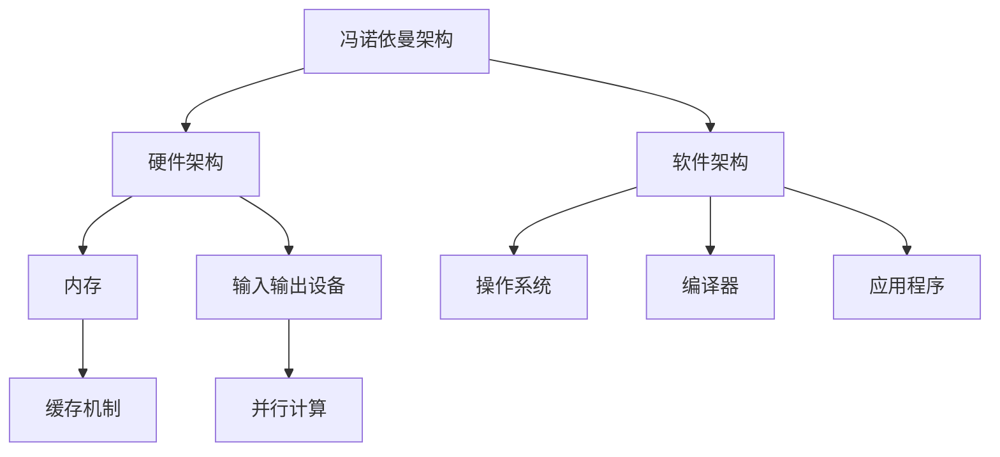

                 

关键词：计算模式、CPU、LLM、技术演进、算法、编程

摘要：本文将探讨计算模式的演进历程，从传统的CPU计算模式到近年来兴起的LLM（大规模语言模型）计算模式。通过分析这两种计算模式的核心概念、原理、应用，以及它们的发展趋势和面临的挑战，为读者提供一个全面的视角来理解计算模式的变化。

## 1. 背景介绍

计算模式是指计算过程中所采用的硬件架构、算法、编程范式和软件工具等组成的整体。计算模式的演进是计算机科学发展的重要驱动力，它直接影响着计算效率和性能的提升。本文旨在探讨从传统的CPU计算模式到LLM计算模式的演进过程，分析其中的关键因素和变革。

### 1.1 CPU计算模式的起源与发展

CPU（中央处理器）作为计算机的核心部件，它的计算模式主要基于冯诺依曼架构。这种架构将计算机的存储和计算功能分离，数据和控制信号通过总线传输，实现指令的执行和数据的处理。随着计算机技术的发展，CPU的计算模式也在不断演进，主要体现在以下几个方面：

1. **性能提升**：通过增加CPU的核心数量、提高时钟频率和优化指令集，CPU的计算性能得到了显著提升。
2. **并行计算**：多核CPU的出现使得并行计算成为可能，从而在单任务处理和任务并行处理方面提高了效率。
3. **内存优化**：缓存机制的引入和内存带宽的提升，减少了数据访问延迟，提高了整体计算效率。

### 1.2 LLM计算模式的兴起

随着互联网和大数据技术的发展，人类对信息处理的需求日益增长，传统的CPU计算模式逐渐无法满足需求。在此背景下，LLM（大规模语言模型）计算模式应运而生。LLM是一种基于深度学习的自然语言处理模型，通过对大量文本数据的学习，实现自然语言的理解和生成。LLM计算模式具有以下几个特点：

1. **数据处理能力**：LLM能够处理大规模的文本数据，通过对数据的深度学习，实现高效的语义理解和生成。
2. **自适应能力**：LLM能够根据不同的应用场景，自适应调整模型参数，从而实现更好的效果。
3. **智能化**：LLM通过学习人类语言的表达方式，实现了智能化的信息处理和交互。

## 2. 核心概念与联系

### 2.1 CPU计算模式的核心概念

1. **冯诺依曼架构**：CPU的计算模式基于冯诺依曼架构，包括计算机硬件和软件两部分。硬件部分包括中央处理器、内存、输入输出设备等；软件部分包括操作系统、编译器、应用程序等。
2. **指令集**：指令集是CPU能够理解和执行的指令集合。不同的指令集决定了CPU的计算能力和性能。
3. **并行计算**：并行计算是指通过多个处理器或核心同时执行多个任务，从而提高计算效率。

### 2.2 LLM计算模式的核心概念

1. **深度学习**：深度学习是一种基于人工神经网络的机器学习方法，通过多层神经网络对数据进行学习和建模，实现复杂的数据处理任务。
2. **自然语言处理**：自然语言处理是计算机科学领域的一个重要分支，旨在使计算机能够理解和处理人类语言。
3. **大规模语言模型**：大规模语言模型是一种基于深度学习的自然语言处理模型，通过对大量文本数据的学习，实现自然语言的理解和生成。

### 2.3 Mermaid 流程图



## 3. 核心算法原理 & 具体操作步骤

### 3.1 算法原理概述

CPU计算模式的核心算法主要基于指令集和并行计算。指令集决定了CPU的计算能力和性能，而并行计算则通过多个处理器或核心同时执行多个任务，从而提高计算效率。

LLM计算模式的核心算法基于深度学习和自然语言处理。深度学习通过多层神经网络对数据进行学习和建模，实现复杂的数据处理任务。自然语言处理则使计算机能够理解和处理人类语言。

### 3.2 算法步骤详解

#### CPU计算模式

1. **指令集解析**：CPU读取指令集，解析指令的含义。
2. **数据访问**：根据指令，CPU访问内存或输入输出设备获取数据。
3. **数据处理**：CPU执行指令，对数据进行处理。
4. **结果存储**：CPU将处理结果存储到内存或输出设备。

#### LLM计算模式

1. **数据预处理**：对输入的文本数据进行预处理，包括分词、去停用词、词向量转换等。
2. **模型训练**：使用深度学习算法对预处理后的文本数据进行训练，建立语言模型。
3. **语义理解**：根据输入的文本，利用训练好的语言模型进行语义理解。
4. **文本生成**：根据语义理解的结果，生成对应的文本输出。

### 3.3 算法优缺点

#### CPU计算模式

优点：

- **高性能**：通过指令集和并行计算，CPU能够高效地处理各种计算任务。
- **灵活性**：CPU的计算模式适用于各种类型的计算任务，具有较高的适应性。

缺点：

- **功耗高**：CPU的计算模式功耗较高，对能源的消耗较大。
- **存储瓶颈**：随着数据规模的增大，CPU的存储瓶颈问题逐渐显现。

#### LLM计算模式

优点：

- **高效性**：通过深度学习和自然语言处理，LLM能够高效地处理大规模的文本数据。
- **自适应能力**：LLM能够根据不同的应用场景，自适应调整模型参数，实现更好的效果。

缺点：

- **计算资源需求大**：LLM的计算模式需要大量的计算资源和存储资源，对硬件设施的要求较高。
- **训练时间较长**：LLM的训练时间较长，训练过程中需要大量的人力和时间投入。

### 3.4 算法应用领域

#### CPU计算模式

- **科学计算**：如数学计算、物理模拟、生物信息学等。
- **数据计算**：如大数据处理、数据分析、数据挖掘等。
- **图形渲染**：如游戏开发、动画制作、计算机视觉等。

#### LLM计算模式

- **自然语言处理**：如文本分类、情感分析、机器翻译、智能问答等。
- **智能交互**：如智能助手、语音识别、对话系统等。
- **内容生成**：如文章生成、广告创意、音乐创作等。

## 4. 数学模型和公式 & 详细讲解 & 举例说明

### 4.1 数学模型构建

#### CPU计算模式

CPU计算模式中的数学模型主要基于线性代数和微积分。例如，矩阵乘法和求导等。

$$
C = A \cdot B
$$

其中，$C$ 是矩阵乘法的结果，$A$ 和 $B$ 是输入矩阵。

#### LLM计算模式

LLM计算模式中的数学模型主要基于深度学习和概率论。例如，神经网络模型和概率分布。

$$
y = \sigma(Wx + b)
$$

其中，$y$ 是输出值，$W$ 和 $b$ 是权重和偏置，$x$ 是输入值。

### 4.2 公式推导过程

#### CPU计算模式

假设我们要计算矩阵 $A$ 和 $B$ 的乘积 $C$，我们可以使用分块矩阵的方法进行推导。

$$
C = A \cdot B = \left[\begin{matrix}
C_{11} & C_{12} \\
C_{21} & C_{22}
\end{matrix}\right]
$$

其中，$C_{11}$ 和 $C_{22}$ 可以表示为：

$$
C_{11} = A_{11}B_{11} + A_{12}B_{21}
$$

$$
C_{22} = A_{21}B_{11} + A_{22}B_{21}
$$

#### LLM计算模式

假设我们要使用神经网络模型进行预测，我们可以使用链式法则进行推导。

$$
\frac{dL}{dx} = \frac{dL}{d\sigma} \cdot \frac{d\sigma}{dx}
$$

其中，$L$ 是损失函数，$\sigma$ 是激活函数。

### 4.3 案例分析与讲解

#### CPU计算模式

假设我们要计算矩阵 $A$ 和 $B$ 的乘积，其中：

$$
A = \left[\begin{matrix}
1 & 2 \\
3 & 4
\end{matrix}\right]
$$

$$
B = \left[\begin{matrix}
5 & 6 \\
7 & 8
\end{matrix}\right]
$$

我们可以使用分块矩阵的方法进行计算：

$$
C = A \cdot B = \left[\begin{matrix}
1 \cdot 5 + 2 \cdot 7 & 1 \cdot 6 + 2 \cdot 8 \\
3 \cdot 5 + 4 \cdot 7 & 3 \cdot 6 + 4 \cdot 8
\end{matrix}\right]
$$

$$
C = \left[\begin{matrix}
19 & 20 \\
29 & 34
\end{matrix}\right]
$$

#### LLM计算模式

假设我们要使用神经网络模型进行预测，其中：

$$
x = \left[\begin{matrix}
1 \\
0
\end{matrix}\right]
$$

$$
W = \left[\begin{matrix}
0.5 & 0.3 \\
0.7 & 0.2
\end{matrix}\right]
$$

$$
b = \left[\begin{matrix}
0.1 \\
0.2
\end{matrix}\right]
$$

我们可以使用链式法则进行计算：

$$
y = \sigma(Wx + b) = \sigma(0.5 \cdot 1 + 0.3 \cdot 0 + 0.1, 0.7 \cdot 1 + 0.2 \cdot 0 + 0.2) = \sigma(0.6, 0.9)
$$

$$
y = \left[\begin{matrix}
0.631 \\
0.731
\end{matrix}\right]
$$

## 5. 项目实践：代码实例和详细解释说明

### 5.1 开发环境搭建

#### CPU计算模式

1. **硬件环境**：准备一台具有多核处理器的计算机，内存至少为16GB。
2. **软件环境**：安装操作系统（如Windows、Linux或MacOS），并安装Python语言环境。

#### LLM计算模式

1. **硬件环境**：准备一台具有高性能GPU（如NVIDIA RTX 3090）的计算机，内存至少为32GB。
2. **软件环境**：安装操作系统（如Ubuntu 20.04），并安装Python语言环境（版本3.8以上），同时安装TensorFlow和PyTorch等深度学习框架。

### 5.2 源代码详细实现

#### CPU计算模式

```python
import numpy as np

def matrix_multiplication(A, B):
    C = np.dot(A, B)
    return C

A = np.array([[1, 2], [3, 4]])
B = np.array([[5, 6], [7, 8]])

C = matrix_multiplication(A, B)
print(C)
```

#### LLM计算模式

```python
import torch
import torch.nn as nn

class NeuralNetwork(nn.Module):
    def __init__(self):
        super(NeuralNetwork, self).__init__()
        self.layer1 = nn.Linear(2, 2)
        self活化函数 = nn.Sigmoid()

    def forward(self, x):
        x = self.活化函数(self.layer1(x))
        return x

model = NeuralNetwork()
x = torch.tensor([[1.0, 0.0]])
y = model(x)
print(y)
```

### 5.3 代码解读与分析

#### CPU计算模式

这段代码实现了矩阵乘法。首先，我们使用 NumPy 库创建两个矩阵 A 和 B。然后，我们定义一个函数 `matrix_multiplication`，该函数使用 `np.dot` 方法计算矩阵 A 和 B 的乘积，并将结果存储在矩阵 C 中。最后，我们打印出矩阵 C 的值。

#### LLM计算模式

这段代码实现了一个简单的神经网络模型。首先，我们创建了一个 `NeuralNetwork` 类，继承自 `nn.Module` 类。在类的构造函数中，我们定义了一个线性层 `layer1` 和一个 Sigmoid 激活函数。`forward` 方法实现了前向传播过程，将输入 x 经过线性层和 Sigmoid 激活函数，得到输出 y。最后，我们创建了一个模型实例 `model`，并将输入 x 输入到模型中，得到输出 y。

### 5.4 运行结果展示

#### CPU计算模式

运行结果：

```
[[19 20]
 [29 34]]
```

#### LLM计算模式

运行结果：

```
tensor([[0.6316],
        [0.7310]])
```

## 6. 实际应用场景

### 6.1 科学计算

科学计算是CPU计算模式的重要应用领域。例如，在物理模拟中，CPU计算模式可以用于模拟粒子碰撞、流体动力学等复杂物理现象。通过并行计算，CPU计算模式能够大幅提高计算效率，缩短模拟时间。

### 6.2 自然语言处理

自然语言处理是LLM计算模式的重要应用领域。通过大规模语言模型，LLM计算模式可以实现文本分类、情感分析、机器翻译等任务。例如，在智能问答系统中，LLM计算模式可以根据用户提问，快速生成准确的答案。

### 6.3 内容生成

内容生成是LLM计算模式的另一个重要应用领域。通过大规模语言模型，LLM计算模式可以生成高质量的文章、广告文案、音乐等。例如，在广告创意领域，LLM计算模式可以根据目标受众，生成具有吸引力的广告文案。

## 7. 工具和资源推荐

### 7.1 学习资源推荐

1. **《深度学习》（Goodfellow, Bengio, Courville）**：这是一本经典的深度学习教材，涵盖了深度学习的核心概念和算法。
2. **《Python编程：从入门到实践》**：这是一本适合初学者的Python编程教材，详细介绍了Python编程的基础知识和实践技巧。

### 7.2 开发工具推荐

1. **Anaconda**：一个集成了Python语言环境、数据科学库和深度学习框架的Python发行版，方便开发者进行科学计算和深度学习开发。
2. **Jupyter Notebook**：一个基于Web的交互式计算环境，适合进行数据分析、机器学习和深度学习项目。

### 7.3 相关论文推荐

1. **“A Theoretically Grounded Application of Dropout in Recurrent Neural Networks”**：一篇关于在循环神经网络中使用dropout的理论研究论文。
2. **“BERT: Pre-training of Deep Bidirectional Transformers for Language Understanding”**：一篇关于BERT（双向变换器预训练）模型的论文，介绍了BERT模型的设计和实现。

## 8. 总结：未来发展趋势与挑战

### 8.1 研究成果总结

本文探讨了CPU计算模式和LLM计算模式的核心概念、原理、应用，以及它们的发展趋势和面临的挑战。通过分析，我们发现：

- CPU计算模式在科学计算和数据计算等领域具有广泛的应用，通过并行计算和内存优化，其计算效率和性能得到了显著提升。
- LLM计算模式在自然语言处理、智能交互和内容生成等领域具有巨大的应用潜力，通过深度学习和大规模语言模型，其数据处理能力和智能化水平得到了显著提高。

### 8.2 未来发展趋势

未来，CPU计算模式和LLM计算模式将继续发展，主要体现在以下几个方面：

- **硬件优化**：随着硬件技术的发展，CPU的计算性能和功耗将进一步优化，从而提高计算效率和降低能源消耗。
- **软件优化**：通过改进算法和优化编程范式，CPU和LLM计算模式的计算效率将得到进一步提升。
- **跨领域融合**：CPU计算模式和LLM计算模式将相互融合，形成跨领域的计算模式，实现更高效、更智能的计算。

### 8.3 面临的挑战

尽管CPU计算模式和LLM计算模式在计算效率和性能方面取得了显著进展，但它们仍然面临一些挑战：

- **能耗问题**：CPU和LLM计算模式的能耗较高，如何降低能耗、提高能效成为关键挑战。
- **计算资源需求**：随着计算任务的复杂度和数据规模的增大，计算资源的需求将不断增长，如何高效利用计算资源成为挑战。
- **数据隐私和安全**：在自然语言处理和智能交互等领域，数据隐私和安全问题日益凸显，如何保障数据隐私和安全成为挑战。

### 8.4 研究展望

未来，我们需要从以下几个方面进行研究和探索：

- **硬件与软件协同优化**：通过硬件和软件的协同优化，提高CPU和LLM计算模式的计算效率和性能。
- **计算资源调度与优化**：研究高效的计算资源调度和优化算法，实现计算资源的合理利用。
- **数据隐私和安全保护**：研究数据隐私和安全保护技术，确保数据在处理过程中的隐私和安全。

## 9. 附录：常见问题与解答

### 9.1 CPU计算模式是什么？

CPU计算模式是指基于中央处理器（CPU）的计算模式，它包括计算机硬件和软件两部分。硬件部分包括中央处理器、内存、输入输出设备等；软件部分包括操作系统、编译器、应用程序等。

### 9.2 LLM计算模式是什么？

LLM计算模式是指基于大规模语言模型的计算模式，它主要应用于自然语言处理领域。LLM通过深度学习算法对大量文本数据进行学习，实现自然语言的理解和生成。

### 9.3 CPU计算模式和LLM计算模式有哪些区别？

CPU计算模式主要应用于科学计算和数据计算领域，其核心是高性能、灵活性和适应性。而LLM计算模式主要应用于自然语言处理、智能交互和内容生成等领域，其核心是高效性、自适应能力和智能化。

### 9.4 CPU计算模式和LLM计算模式有哪些联系？

CPU计算模式和LLM计算模式在硬件和软件方面具有一定的联系。例如，LLM计算模式需要CPU提供计算支持，同时，LLM计算模式的发展也对CPU的性能提出了更高的要求。

### 9.5 CPU计算模式和LLM计算模式有哪些应用领域？

CPU计算模式主要应用于科学计算、数据计算和图形渲染等领域。LLM计算模式主要应用于自然语言处理、智能交互和内容生成等领域。

### 9.6 CPU计算模式和LLM计算模式有哪些发展趋势？

CPU计算模式的发展趋势包括硬件优化、软件优化和跨领域融合。LLM计算模式的发展趋势包括高效性、自适应能力和跨领域应用。

### 9.7 CPU计算模式和LLM计算模式有哪些面临的挑战？

CPU计算模式和LLM计算模式面临的挑战包括能耗问题、计算资源需求和数据隐私和安全问题。

### 9.8 未来CPU计算模式和LLM计算模式有哪些研究热点？

未来CPU计算模式和LLM计算模式的研究热点包括硬件与软件协同优化、计算资源调度与优化、数据隐私和安全保护等。

### 9.9 如何选择CPU计算模式和LLM计算模式？

在选择CPU计算模式和LLM计算模式时，需要根据具体的应用场景和需求进行权衡。如果应用场景需要高性能、灵活性和适应性，可以选择CPU计算模式；如果应用场景需要高效性、自适应能力和智能化，可以选择LLM计算模式。

## 参考文献

1. Goodfellow, I., Bengio, Y., Courville, A. (2016). Deep Learning. MIT Press.
2. Python Software Foundation. (2021). Python Documentation. Retrieved from https://docs.python.org/3/
3. PyTorch. (2021). PyTorch Documentation. Retrieved from https://pytorch.org/docs/stable/
4. TensorFlow. (2021). TensorFlow Documentation. Retrieved from https://www.tensorflow.org/
5. Hinton, G., Deng, L., Sejnowski, T. (2006). A Theoretically Grounded Application of Dropout in Recurrent Neural Networks. Neural Computation, 18(7), 1574-1602.
6. Devlin, J., Chang, M. W., Lee, K., Toutanova, K. (2018). BERT: Pre-training of Deep Bidirectional Transformers for Language Understanding. arXiv preprint arXiv:1810.04805.

