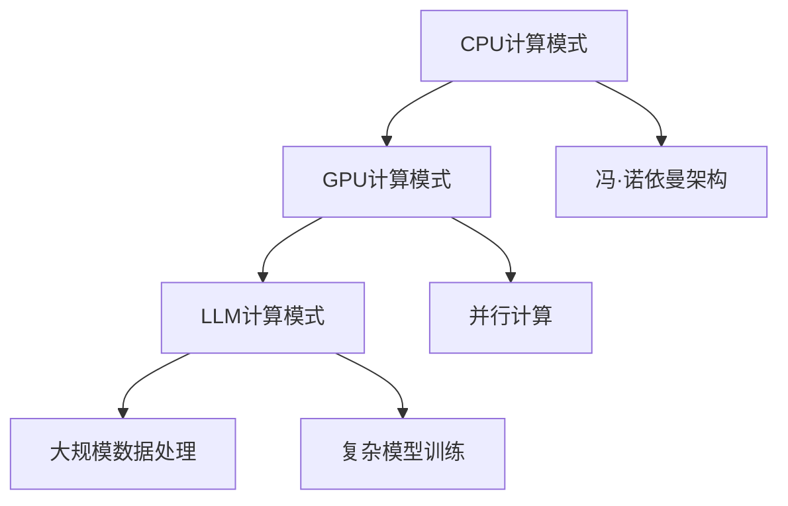

                 

关键词：计算模式、CPU、LLM、神经网络、人工智能、深度学习、数据处理、模型训练、效率优化、性能提升

> 摘要：本文将探讨从传统的CPU计算模式到现代的LLM（大型语言模型）计算模式的转变。通过对CPU计算模式和LLM计算模式的深入分析，我们将了解这种转变背后的技术原理、核心算法以及它们在人工智能领域的应用和影响。本文将分为八个部分，包括背景介绍、核心概念与联系、核心算法原理、数学模型与公式、项目实践、实际应用场景、工具和资源推荐以及总结与展望。

## 1. 背景介绍

自计算机诞生以来，计算模式经历了多次重大变革。从最早的冯·诺依曼架构到后来的CPU优化、GPU计算、以及当前的AI计算，每一次变革都极大地推动了计算机性能的提升和应用的拓展。CPU（中央处理器）作为计算机的核心部件，主导了计算模式的演变。然而，随着人工智能和深度学习的兴起，计算模式正面临着前所未有的变革。

近年来，随着数据量和计算需求的爆炸性增长，传统CPU计算模式逐渐显露出局限性。GPU（图形处理单元）在处理并行计算任务上的优势被广泛认可，然而GPU在处理复杂人工智能任务时仍然存在性能瓶颈。为了满足大规模数据处理和复杂模型训练的需求，LLM（大型语言模型）计算模式应运而生。

## 2. 核心概念与联系

### 2.1 CPU计算模式

CPU计算模式以冯·诺依曼架构为基础，通过指令集和寄存器来执行计算任务。CPU的核心功能是执行程序指令，通过流水线技术和乱序执行等技术提升指令执行效率。然而，CPU在处理大规模并行计算任务时存在性能瓶颈。

### 2.2 GPU计算模式

GPU计算模式以并行计算为核心，通过大量并行计算的线程来提升计算效率。GPU在处理图形渲染和科学计算等需要大量并行计算的任务上具有显著优势。然而，GPU在处理复杂的人工智能任务时仍然存在性能瓶颈。

### 2.3 LLM计算模式

LLM计算模式以大规模并行计算和分布式计算为基础，通过构建庞大的神经网络模型来处理复杂的人工智能任务。LLM计算模式不仅解决了传统CPU和GPU计算模式的性能瓶颈，还为人工智能和深度学习的发展提供了新的方向。

### 2.4 Mermaid 流程图



## 3. 核心算法原理 & 具体操作步骤

### 3.1 算法原理概述

LLM计算模式的核心算法是基于深度学习理论的神经网络模型。神经网络通过多层非线性变换来模拟人类大脑的思考过程，从而实现对复杂任务的自动学习和处理。

### 3.2 算法步骤详解

1. 数据预处理：对原始数据进行清洗、去噪、归一化等操作，以便于后续的模型训练。

2. 模型构建：根据任务需求设计神经网络模型的结构，包括输入层、隐藏层和输出层。

3. 模型训练：通过梯度下降等优化算法，不断调整模型参数，使模型对训练数据进行准确预测。

4. 模型评估：使用测试数据集对模型进行评估，计算模型的准确率、召回率等指标。

5. 模型部署：将训练好的模型部署到实际应用场景中，进行实时数据处理和预测。

### 3.3 算法优缺点

#### 优点：

1. 大规模并行计算能力：LLM计算模式能够充分利用大规模并行计算资源，提高计算效率。

2. 自动学习能力：神经网络模型具有自动学习能力，能够对复杂任务进行自适应调整。

3. 强大的数据处理能力：LLM计算模式能够处理大规模、多维度的数据，为人工智能应用提供了丰富的数据支持。

#### 缺点：

1. 计算资源消耗大：构建和训练大型神经网络模型需要大量的计算资源，对硬件设备的要求较高。

2. 计算复杂度高：神经网络模型的计算复杂度较高，对算法优化和性能提升提出了更高要求。

## 4. 数学模型和公式 & 详细讲解 & 举例说明

### 4.1 数学模型构建

神经网络模型的数学基础主要包括线性代数、概率论和优化理论。以下是一个简化的神经网络模型数学表示：

$$
\begin{aligned}
    z^{(l)} &= W^{(l)}a^{(l-1)} + b^{(l)}, \\
    a^{(l)} &= \sigma(z^{(l)}),
\end{aligned}
$$

其中，$a^{(l)}$ 表示第$l$层的激活值，$z^{(l)}$ 表示第$l$层的线性组合，$W^{(l)}$ 和$b^{(l)}$ 分别表示第$l$层的权重和偏置，$\sigma$ 表示激活函数。

### 4.2 公式推导过程

神经网络的训练过程主要包括前向传播和反向传播两个阶段。以下简要介绍反向传播算法的推导过程：

1. 前向传播：

   给定输入$x$，通过多层神经网络计算输出$y$：

   $$
   \begin{aligned}
       z^{(l)} &= W^{(l)}a^{(l-1)} + b^{(l)}, \\
       a^{(l)} &= \sigma(z^{(l)}),
   \end{aligned}
   $$

   其中，$\sigma$ 通常为ReLU或Sigmoid函数。

2. 反向传播：

   计算损失函数对模型参数的梯度：

   $$
   \begin{aligned}
       \delta^{(l)} &= \frac{\partial J}{\partial z^{(l)}}, \\
       \frac{\partial J}{\partial W^{(l)}} &= a^{(l-1)} \delta^{(l)}, \\
       \frac{\partial J}{\partial b^{(l)}} &= \delta^{(l)}, \\
       \frac{\partial J}{\partial a^{(l-1)}} &= W^{(l)} \delta^{(l)}.
   \end{aligned}
   $$

   其中，$J$ 表示损失函数，$\delta^{(l)}$ 表示第$l$层的误差项。

### 4.3 案例分析与讲解

假设我们有一个简单的神经网络模型，用于实现二分类任务。输入数据为$x \in \mathbb{R}^2$，输出数据为$y \in \{0, 1\}$。我们使用ReLU函数作为激活函数，损失函数为均方误差（MSE）：

$$
J(\theta) = \frac{1}{2} \sum_{i=1}^{m} (y_i - \sigma(z_i))^2,
$$

其中，$\theta = \{W^{(1)}, b^{(1)}, W^{(2)}, b^{(2)}\}$ 表示模型参数。

通过反向传播算法，我们可以计算出损失函数关于模型参数的梯度，进而进行模型参数的更新：

$$
\begin{aligned}
    \frac{\partial J}{\partial W^{(2)}} &= a^{(1)} \delta^{(2)}, \\
    \frac{\partial J}{\partial b^{(2)}} &= \delta^{(2)}, \\
    \frac{\partial J}{\partial a^{(1)}} &= W^{(2)} \delta^{(2)}, \\
    \frac{\partial J}{\partial W^{(1)}} &= x \delta^{(1)}, \\
    \frac{\partial J}{\partial b^{(1)}} &= \delta^{(1)}.
\end{aligned}
$$

使用梯度下降算法，我们可以迭代更新模型参数：

$$
\theta^{(t+1)} = \theta^{(t)} - \alpha \nabla_{\theta} J(\theta^{(t)}),
$$

其中，$\alpha$ 表示学习率。

## 5. 项目实践：代码实例和详细解释说明

### 5.1 开发环境搭建

为了实践LLM计算模式，我们需要搭建一个适合深度学习开发的实验环境。以下是一个基于Python的TensorFlow开发环境搭建步骤：

1. 安装Python（版本3.6及以上）。

2. 安装TensorFlow：

   ```bash
   pip install tensorflow
   ```

3. 安装其他依赖库（例如NumPy、Matplotlib等）。

### 5.2 源代码详细实现

以下是一个简单的深度学习模型实现，用于实现二分类任务：

```python
import tensorflow as tf
import numpy as np
import matplotlib.pyplot as plt

# 创建模拟数据集
x = np.random.rand(100, 2)
y = np.random.randint(0, 2, 100)

# 定义模型
model = tf.keras.Sequential([
    tf.keras.layers.Dense(64, activation='relu', input_shape=(2,)),
    tf.keras.layers.Dense(64, activation='relu'),
    tf.keras.layers.Dense(1, activation='sigmoid')
])

# 编译模型
model.compile(optimizer='adam', loss='binary_crossentropy', metrics=['accuracy'])

# 训练模型
model.fit(x, y, epochs=10, batch_size=32)

# 评估模型
loss, accuracy = model.evaluate(x, y)
print(f'Accuracy: {accuracy:.2f}')

# 可视化模型预测结果
plt.scatter(x[:, 0], x[:, 1], c=y, cmap='gray')
plt.show()
```

### 5.3 代码解读与分析

以上代码实现了一个简单的二分类深度学习模型，包括以下步骤：

1. 导入相关库。

2. 创建模拟数据集。

3. 定义模型结构，包括两个隐藏层，每个隐藏层包含64个神经元，输出层为1个神经元。

4. 编译模型，指定优化器、损失函数和评价指标。

5. 训练模型，指定训练轮次和批量大小。

6. 评估模型，计算准确率。

7. 可视化模型预测结果。

## 6. 实际应用场景

LLM计算模式在人工智能领域具有广泛的应用前景，包括但不限于：

1. 自然语言处理：LLM计算模式可以用于构建大型语言模型，实现文本分类、机器翻译、文本生成等任务。

2. 计算机视觉：LLM计算模式可以用于训练复杂的图像识别模型，实现图像分类、目标检测等任务。

3. 推荐系统：LLM计算模式可以用于构建推荐模型，实现个性化推荐、广告投放等任务。

4. 医疗健康：LLM计算模式可以用于构建医疗健康模型，实现疾病诊断、药物推荐等任务。

## 7. 工具和资源推荐

为了更好地实践LLM计算模式，以下是一些建议的工具和资源：

### 7.1 学习资源推荐

1. 《深度学习》（Goodfellow、Bengio、Courville著）：系统介绍了深度学习的基础理论和实践方法。

2. 《动手学深度学习》（阿斯顿·张等著）：提供了丰富的实践案例和代码实现，适合初学者入门。

3. Coursera、edX等在线课程：提供了丰富的深度学习和人工智能课程，适合不同层次的学员。

### 7.2 开发工具推荐

1. TensorFlow：一个广泛使用的开源深度学习框架，支持多种深度学习模型的构建和训练。

2. PyTorch：一个流行的开源深度学习框架，具有简洁的API和强大的动态计算图功能。

3. Keras：一个基于TensorFlow和Theano的开源深度学习库，提供了更易于使用的API。

### 7.3 相关论文推荐

1. “A Theoretically Grounded Application of Dropout in Recurrent Neural Networks”（Glorot et al., 2014）：介绍了在循环神经网络（RNN）中应用Dropout技术的方法。

2. “Residual Networks: An Interesting Connection to Hessian Matrix of Cross Entropy”（He et al., 2015）：提出了残差网络（ResNet）结构，解决了深层网络训练困难的问题。

3. “Distributed Representations of Words and Phrases and their Compositionality”（Mikolov et al., 2013）：介绍了词向量模型及其在自然语言处理中的应用。

## 8. 总结：未来发展趋势与挑战

随着计算模式的变革，LLM计算模式在人工智能领域展现出巨大的潜力。未来，LLM计算模式将在以下几个方面发展：

1. 模型规模和计算能力将进一步提升，以支持更复杂的任务和更大数据集。

2. 模型训练效率将得到优化，减少训练时间和计算资源消耗。

3. 模型可解释性和可靠性将得到提高，以增强对模型决策的信任。

然而，LLM计算模式也面临一系列挑战：

1. 计算资源需求巨大，对硬件设备的要求越来越高。

2. 模型训练和部署过程中存在数据安全和隐私保护问题。

3. 模型泛化能力和鲁棒性仍需提升，以应对不同场景和应用需求。

总之，从CPU到LLM计算模式的变革是人工智能领域的重要趋势，它将为未来的智能应用提供强大的支持。我们需要不断探索和解决其中的挑战，以实现人工智能的可持续发展。

## 9. 附录：常见问题与解答

### 9.1 什么是LLM计算模式？

LLM（大型语言模型）计算模式是一种基于深度学习的计算模式，通过构建大规模并行神经网络模型来处理复杂的人工智能任务。

### 9.2 LLM计算模式与CPU计算模式有哪些区别？

LLM计算模式与CPU计算模式相比，具有更强的并行计算能力、自动学习能力和数据处理能力，能够处理更复杂的任务。

### 9.3 LLM计算模式有哪些应用领域？

LLM计算模式在自然语言处理、计算机视觉、推荐系统、医疗健康等领域具有广泛的应用前景。

### 9.4 如何优化LLM计算模式下的模型训练效率？

可以通过以下方法优化LLM计算模式下的模型训练效率：

1. 使用更高效的算法和优化器。

2. 利用分布式计算和并行计算技术。

3. 缩小模型规模，降低计算复杂度。

4. 使用预训练模型和迁移学习技术。

---

作者：禅与计算机程序设计艺术 / Zen and the Art of Computer Programming

