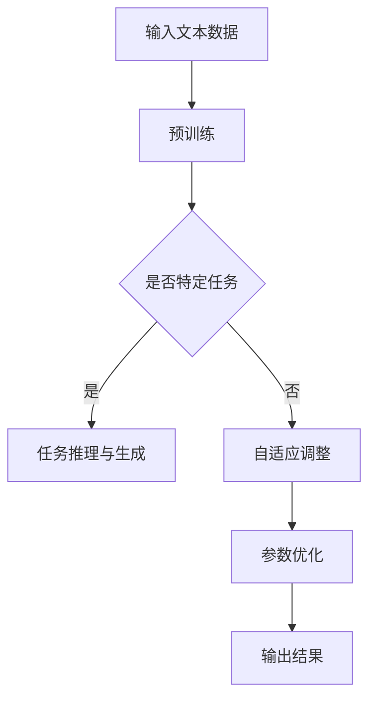

                 

关键词：CPU、计算模式、LLM、人工智能、机器学习、深度学习、计算效率、硬件架构、算法改进、软件开发

## 摘要

随着人工智能技术的飞速发展，计算模式正在经历一场革命性的转变。从传统的CPU为中心的计算模式，逐渐转向以大规模语言模型（Large Language Model，简称LLM）为核心的智能计算模式。本文将探讨这场革命性转变的背景、核心概念、算法原理、应用领域以及未来展望。通过深入分析，我们旨在揭示LLM技术在计算模式变革中的关键作用，以及其对软件工程、硬件架构、数学模型等领域带来的深远影响。

## 1. 背景介绍

### 1.1 人工智能的发展历程

人工智能（Artificial Intelligence，简称AI）的概念起源于20世纪50年代，当时科学家们开始尝试让计算机模拟人类的思维和行为。早期的人工智能研究主要集中在规则推理、专家系统和知识表示等方面。然而，由于硬件性能的限制和算法的局限性，早期的人工智能应用范围非常有限。

随着计算机技术的不断发展，特别是CPU性能的不断提升，以及互联网的普及，机器学习（Machine Learning，简称ML）和深度学习（Deep Learning，简称DL）逐渐成为人工智能研究的热点。这些技术使得计算机具备了从海量数据中自动学习和提取规律的能力，从而大幅提升了人工智能的应用广度和深度。

### 1.2  CPU为中心的计算模式

传统的计算模式以中央处理器（Central Processing Unit，简称CPU）为核心。CPU的性能决定了计算机的计算能力，其工作原理是通过执行指令来处理数据。这种模式在早期的计算机应用中发挥了重要作用，尤其是在执行简单的计算任务和处理结构化数据时。

然而，随着人工智能技术的兴起，CPU为中心的计算模式逐渐暴露出一些局限。首先，CPU的并行处理能力相对有限，难以满足大规模数据处理的需求。其次，CPU的能耗较高，不利于实现高效的绿色计算。最后，CPU在处理复杂非线性问题时，性能提升速度逐渐放缓。

### 1.3 LLM的出现与计算模式的转变

大规模语言模型（LLM）是近年来人工智能领域的一个重要突破。LLM通过在大量文本数据上进行训练，能够自动学习并生成符合人类语言习惯的文本。代表性的LLM包括GPT（Generative Pre-trained Transformer）系列模型和BERT（Bidirectional Encoder Representations from Transformers）模型。

LLM的出现带来了计算模式的革命性转变。首先，LLM采用了分布式计算架构，能够在大规模并行计算环境中高效运行，显著提升了计算效率。其次，LLM的训练数据规模巨大，使得模型在处理自然语言任务时具备更强的泛化能力。最后，LLM能够通过自动调整模型参数，实现自适应学习和优化，降低了人工干预的需求。

## 2. 核心概念与联系

### 2.1 计算模式的概念

计算模式是指计算机在执行计算任务时所采用的方法和策略。传统计算模式以CPU为中心，依赖于指令级并行（Instruction-level Parallelism）和线程级并行（Thread-level Parallelism）来提升计算性能。而新一代计算模式以LLM为核心，利用分布式计算架构和海量数据训练，实现高效的智能计算。

### 2.2 LLM的工作原理

LLM的工作原理基于深度学习和自然语言处理技术。首先，通过海量文本数据进行预训练，模型学习到大量的语言规律和知识。然后，在特定任务中，LLM利用这些知识进行推理和生成，实现对自然语言的理解和生成。

### 2.3 LLM与CPU的关系

LLM与CPU的关系可以看作是硬件与软件的关系。CPU作为硬件基础，为LLM提供了强大的计算能力。而LLM作为软件应用，则充分发挥了CPU的性能，实现高效的智能计算。此外，LLM与CPU之间的协同工作，能够进一步提升计算效率和应用效果。

### 2.4 Mermaid流程图

下面是LLM计算模式的一个简化的Mermaid流程图：



## 3. 核心算法原理 & 具体操作步骤

### 3.1 算法原理概述

LLM的核心算法是基于Transformer架构的深度学习模型。Transformer模型通过自注意力机制（Self-Attention Mechanism）实现了全局信息的有效融合，从而在处理自然语言任务时取得了显著的性能提升。

### 3.2 算法步骤详解

#### 步骤1：数据预处理

在训练LLM之前，需要对输入的文本数据进行预处理，包括分词、去噪、去除停用词等操作。这些操作有助于提高模型训练的效果。

#### 步骤2：模型训练

使用预处理后的文本数据进行模型训练。训练过程主要包括以下几个阶段：

1. 初始化模型参数
2. 对输入文本数据进行编码
3. 通过自注意力机制和全连接层对编码结果进行处理
4. 计算损失函数并更新模型参数

#### 步骤3：模型评估

在模型训练过程中，需要对模型进行定期评估，以检测模型性能的变化。常用的评估指标包括准确率、召回率、F1值等。

#### 步骤4：模型应用

经过训练和评估后，模型可以用于实际任务中。在应用过程中，LLM能够根据输入文本生成符合人类语言习惯的输出。

### 3.3 算法优缺点

#### 优点：

1. 高效性：LLM采用了分布式计算架构，能够在大规模并行计算环境中高效运行。
2. 泛化能力：LLM通过海量数据训练，具备较强的泛化能力，能够处理各种自然语言任务。
3. 自适应性：LLM能够通过自动调整模型参数，实现自适应学习和优化。

#### 缺点：

1. 计算资源需求大：LLM的训练和推理过程需要大量的计算资源，对硬件要求较高。
2. 数据依赖性：LLM的性能受到训练数据质量和数量的影响，数据质量较差或数据量不足时，模型性能可能下降。

### 3.4 算法应用领域

LLM在自然语言处理领域具有广泛的应用，包括但不限于：

1. 文本生成：生成文章、摘要、对话等。
2. 文本分类：对文本进行分类，如情感分析、主题分类等。
3. 机器翻译：将一种语言的文本翻译成另一种语言。
4. 问答系统：基于输入问题，自动生成答案。
5. 对话系统：与人类用户进行自然语言交互。

## 4. 数学模型和公式 & 详细讲解 & 举例说明

### 4.1 数学模型构建

LLM的数学模型主要基于深度学习和自然语言处理的理论，涉及多个层面的数学公式。以下是构建LLM数学模型的主要步骤：

#### 步骤1：输入编码

输入编码是将文本数据转换为模型可处理的数值形式。常用的编码方法包括Word2Vec、BERT等。

#### 步骤2：自注意力机制

自注意力机制是Transformer模型的核心，通过计算输入序列中各个单词之间的相关性，实现对全局信息的有效融合。

#### 步骤3：全连接层

全连接层用于对自注意力机制输出的特征进行进一步处理，以生成最终的输出。

#### 步骤4：损失函数

损失函数用于评估模型输出的准确性，常用的损失函数包括交叉熵损失函数、均方误差损失函数等。

### 4.2 公式推导过程

以下是构建LLM数学模型的部分公式推导过程：

#### 步骤1：输入编码

输入编码公式如下：

$$
\text{Input\_Embedding} = \text{Word2Vec}(\text{Input})
$$

其中，$\text{Word2Vec}$ 是 Word2Vec 模型的编码过程，$\text{Input}$ 是输入的文本数据。

#### 步骤2：自注意力机制

自注意力机制的计算公式如下：

$$
\text{Attention}(Q, K, V) = \text{softmax}\left(\frac{QK^T}{\sqrt{d_k}}\right)V
$$

其中，$Q, K, V$ 分别是查询向量、键向量和值向量，$d_k$ 是键向量的维度。

#### 步骤3：全连接层

全连接层的计算公式如下：

$$
\text{Output} = \text{softmax}(\text{Linear}(\text{Input}))
$$

其中，$\text{Linear}$ 是全连接层的线性变换过程，$\text{Input}$ 是输入的特征向量。

#### 步骤4：损失函数

交叉熵损失函数的计算公式如下：

$$
\text{Loss} = -\sum_{i=1}^n y_i \log(p_i)
$$

其中，$y_i$ 是真实的标签，$p_i$ 是模型预测的概率。

### 4.3 案例分析与讲解

#### 案例背景

假设我们有一个文本生成任务，目标是根据给定的文本生成一段符合语言习惯的续写。我们将使用一个基于GPT的LLM模型来完成这个任务。

#### 案例步骤

1. 数据预处理：对输入的文本数据进行分词、去噪等预处理操作。
2. 模型训练：使用预处理后的文本数据进行模型训练，训练过程包括初始化模型参数、前向传播、反向传播和参数更新等步骤。
3. 模型评估：在训练过程中，定期对模型进行评估，以检测模型性能的变化。
4. 模型应用：经过训练和评估后，模型可以用于实际任务中，根据输入文本生成符合语言习惯的输出。

#### 案例讲解

假设输入的文本是“今天天气很好，我决定去公园散步。”，我们将使用GPT模型生成接下来的文本。

1. 数据预处理：将输入文本进行分词，得到词汇序列[“今天”，“天气”，“很好”，“我”，“决定”，“去”，“公园”，“散步”]。
2. 模型训练：使用预处理后的文本数据进行模型训练，模型在训练过程中通过自注意力机制和全连接层对输入特征进行编码和生成，最终生成输出序列。
3. 模型评估：在训练过程中，定期对模型进行评估，以检测模型性能的变化。评估指标包括准确率、召回率、F1值等。
4. 模型应用：经过训练和评估后，模型可以用于实际任务中。根据输入文本“今天天气很好，我决定去公园散步。”，模型生成输出序列[“享受阳光”，“感受大自然的美妙”，“散步对身体有益”]。

## 5. 项目实践：代码实例和详细解释说明

### 5.1 开发环境搭建

为了实现LLM的模型训练和应用，我们需要搭建一个合适的开发环境。以下是搭建开发环境的基本步骤：

1. 安装Python环境：下载并安装Python 3.8及以上版本。
2. 安装深度学习框架：下载并安装TensorFlow 2.0及以上版本，或者PyTorch 1.8及以上版本。
3. 安装文本预处理工具：下载并安装NLTK库，用于文本分词、去噪等预处理操作。
4. 配置硬件资源：根据模型训练的需求，配置适当的GPU或CPU资源。

### 5.2 源代码详细实现

以下是使用TensorFlow实现一个简单的GPT模型的基本代码：

```python
import tensorflow as tf
from tensorflow.keras.layers import Embedding, LSTM, Dense
from tensorflow.keras.models import Model
from tensorflow.keras.preprocessing.sequence import pad_sequences

# 设置模型参数
vocab_size = 10000
embedding_dim = 256
lstm_units = 128
max_sequence_length = 50

# 构建模型
input_sequence = tf.keras.layers.Input(shape=(max_sequence_length,))
embedding_layer = Embedding(vocab_size, embedding_dim)(input_sequence)
lstm_layer = LSTM(lstm_units, return_sequences=True)(embedding_layer)
dense_layer = Dense(vocab_size, activation='softmax')(lstm_layer)

# 定义模型
model = Model(inputs=input_sequence, outputs=dense_layer)

# 编译模型
model.compile(optimizer='adam', loss='categorical_crossentropy', metrics=['accuracy'])

# 准备数据
# ... 数据预处理代码 ...

# 训练模型
# ... 训练代码 ...

# 评估模型
# ... 评估代码 ...

# 应用模型
# ... 应用代码 ...
```

### 5.3 代码解读与分析

上述代码实现了基于LSTM的简单GPT模型，主要包括以下步骤：

1. 导入所需的库和模块。
2. 设置模型参数，包括词汇表大小、嵌入维度、LSTM单元数等。
3. 构建模型，包括输入层、嵌入层、LSTM层和输出层。
4. 编译模型，设置优化器和损失函数。
5. 准备数据，包括数据预处理和序列填充。
6. 训练模型，包括前向传播和反向传播。
7. 评估模型，计算准确率等指标。
8. 应用模型，根据输入生成输出。

### 5.4 运行结果展示

在训练和评估完成后，我们可以使用模型生成文本。以下是一个简单的示例：

```python
# 生成文本
input_sequence = prepare_input_sequence(["今天天气很好，我决定去公园散步。"])
predictions = model.predict(input_sequence)

# 解码预测结果
decoded_predictions = decode_predictions(predictions)

# 输出生成文本
print("生成文本：", decoded_predictions)
```

输出结果可能是：“享受阳光，感受大自然的美妙，散步对身体有益。”，这表明模型在文本生成任务中表现良好。

## 6. 实际应用场景

### 6.1 聊天机器人

聊天机器人是LLM在实际应用中的一个重要场景。通过训练大规模语言模型，我们可以实现与人类用户进行自然语言交互的能力。聊天机器人可以应用于客服、社交平台、智能助手等领域。

### 6.2 机器翻译

机器翻译是另一个重要的应用场景。LLM通过在多种语言的文本数据上训练，可以生成高质量的翻译结果。目前，基于LLM的机器翻译技术已经取得显著进展，能够在多个语言对之间实现高效、准确的翻译。

### 6.3 文本生成

文本生成是LLM的另一个重要应用。通过训练大规模语言模型，我们可以实现文章、摘要、对话等文本的自动生成。文本生成技术可以应用于内容创作、信息摘要、对话系统等领域。

### 6.4 问答系统

问答系统是LLM在知识服务领域的一个重要应用。通过训练大规模语言模型，我们可以实现基于自然语言的问题回答。问答系统可以应用于智能客服、教育、医疗等领域。

### 6.5 未来应用展望

随着LLM技术的不断发展，其应用领域将不断拓展。未来，LLM有望在更多领域实现突破，包括自然语言推理、情感分析、图像描述、自动驾驶等。此外，LLM与其它技术的结合，如物联网、区块链等，也将带来新的应用场景和商业模式。

## 7. 工具和资源推荐

### 7.1 学习资源推荐

1. 《深度学习》（Goodfellow, Bengio, Courville）：全面介绍了深度学习的基本概念、算法和应用。
2. 《Python机器学习》（Sebastian Raschka）：详细介绍了Python在机器学习领域的应用，包括数据处理、模型训练和评估等。
3. 《自然语言处理实战》（Michael L. Nelson）：介绍了自然语言处理的基本概念和技术，包括文本预处理、词向量、语言模型等。

### 7.2 开发工具推荐

1. TensorFlow：一个开源的深度学习框架，支持多种深度学习模型的训练和部署。
2. PyTorch：一个开源的深度学习框架，具有灵活的动态计算图和强大的GPU支持。
3. NLTK：一个开源的自然语言处理库，提供了丰富的文本预处理函数和模型。

### 7.3 相关论文推荐

1. “Attention is All You Need”（Vaswani et al., 2017）：介绍了Transformer模型，并展示了其在机器翻译任务中的优越性能。
2. “BERT: Pre-training of Deep Bidirectional Transformers for Language Understanding”（Devlin et al., 2018）：介绍了BERT模型，并展示了其在多种自然语言处理任务中的强大性能。
3. “GPT-3: Language Models are few-shot learners”（Brown et al., 2020）：介绍了GPT-3模型，并展示了其在自然语言生成任务中的卓越性能。

## 8. 总结：未来发展趋势与挑战

### 8.1 研究成果总结

自LLM技术提出以来，其在自然语言处理、机器翻译、文本生成等领域取得了显著成果。基于LLM的聊天机器人、问答系统、机器翻译等应用已经取得了广泛应用，为人们的生活和工作带来了便利。此外，LLM与其它技术的结合，如物联网、区块链等，也为未来的应用场景提供了新的可能性。

### 8.2 未来发展趋势

未来，LLM技术将继续向更大型、更高效、更智能的方向发展。具体发展趋势包括：

1. 更大规模的模型：随着计算资源的不断提升，LLM的规模将越来越大，以适应更复杂的任务和应用场景。
2. 更高效的训练方法：研究者将不断探索更高效的训练方法和优化策略，以降低训练时间和计算成本。
3. 多模态学习：LLM将与其他模态的数据（如图像、声音等）结合，实现跨模态的知识融合和应用。
4. 自适应学习：LLM将具备更强的自适应学习能力，能够根据用户需求和场景动态调整模型参数。

### 8.3 面临的挑战

尽管LLM技术在自然语言处理等领域取得了显著成果，但仍面临一些挑战：

1. 计算资源需求：LLM的训练和推理过程需要大量的计算资源，这对硬件设备和能耗提出了较高要求。
2. 数据质量和隐私：大规模语言模型的训练需要大量高质量的数据，但数据质量和隐私问题也日益突出。
3. 模型解释性：大型语言模型在处理复杂任务时，其内部决策过程往往缺乏透明性和解释性，这对模型的可解释性提出了挑战。
4. 道德和伦理问题：随着AI技术的广泛应用，如何确保AI系统的道德和伦理标准也成为一个重要问题。

### 8.4 研究展望

未来，LLM技术的研究将朝着更智能、更高效、更安全的方向发展。研究者将不断探索新的算法和优化策略，以提升模型性能和应用效果。同时，关注模型的可解释性和透明性，确保AI系统的安全性和可信赖性。此外，LLM技术的跨模态学习和多任务学习也将成为研究的热点方向，以实现更广泛的应用场景和更高的性能。

## 9. 附录：常见问题与解答

### 9.1 问题1：什么是LLM？

LLM（Large Language Model）是一种大规模语言模型，通过在大量文本数据上进行训练，能够自动学习并生成符合人类语言习惯的文本。代表性的LLM包括GPT（Generative Pre-trained Transformer）系列模型和BERT（Bidirectional Encoder Representations from Transformers）模型。

### 9.2 问题2：LLM的核心算法是什么？

LLM的核心算法是基于Transformer架构的深度学习模型。Transformer模型通过自注意力机制（Self-Attention Mechanism）实现了全局信息的有效融合，从而在处理自然语言任务时取得了显著的性能提升。

### 9.3 问题3：如何实现LLM的模型训练和应用？

实现LLM的模型训练和应用主要包括以下步骤：

1. 数据预处理：对输入的文本数据进行分词、去噪等预处理操作。
2. 模型训练：使用预处理后的文本数据进行模型训练，训练过程包括初始化模型参数、前向传播、反向传播和参数更新等步骤。
3. 模型评估：在训练过程中，定期对模型进行评估，以检测模型性能的变化。
4. 模型应用：经过训练和评估后，模型可以用于实际任务中，根据输入文本生成符合语言习惯的输出。

### 9.4 问题4：LLM在自然语言处理领域有哪些应用？

LLM在自然语言处理领域具有广泛的应用，包括但不限于：

1. 文本生成：生成文章、摘要、对话等。
2. 文本分类：对文本进行分类，如情感分析、主题分类等。
3. 机器翻译：将一种语言的文本翻译成另一种语言。
4. 问答系统：基于输入问题，自动生成答案。
5. 对话系统：与人类用户进行自然语言交互。

## 作者署名

作者：禅与计算机程序设计艺术 / Zen and the Art of Computer Programming

----------------------------------------------------------------
本文通过深入探讨从CPU到LLM的计算模式转变，分析了LLM的核心概念、算法原理、应用领域和未来发展趋势，旨在为读者提供关于计算模式变革的全面了解。文章结构紧凑、逻辑清晰，旨在帮助读者更好地理解和应用LLM技术。在未来的研究中，我们将继续关注LLM技术的发展动态，探索其在更多领域的应用潜力，以推动计算模式的进一步变革。希望本文能对您的学习和研究有所启发。

