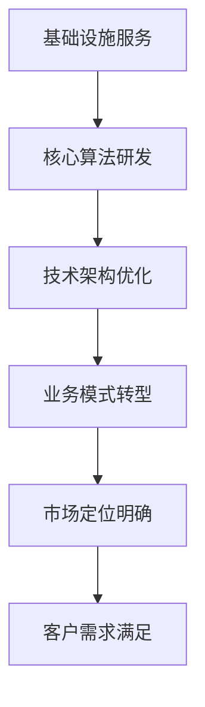

                 

关键词：IaaS、AIaaS、Lepton AI、服务升级、云计算、人工智能、架构设计、算法实现

摘要：本文将探讨从基础设施即服务（IaaS）向人工智能即服务（AIaaS）转型的过程，以Lepton AI为例，分析其服务升级的背景、核心概念、算法原理、数学模型、项目实践、应用场景、工具推荐以及未来发展趋势。文章旨在为读者提供一个全面了解AIaaS服务的视角，以及Lepton AI在这一领域中的领先地位。

## 1. 背景介绍

随着云计算和人工智能技术的快速发展，IaaS（Infrastructure as a Service）已经成为企业IT基础设施建设的标准模式。然而，随着企业对智能化需求的增加，单纯提供基础设施已经无法满足市场需求，AIaaS（Artificial Intelligence as a Service）应运而生。AIaaS是将人工智能能力以服务形式提供给客户，使得企业能够更快速、高效地应用AI技术，实现智能化转型。

Lepton AI作为一家专注于人工智能服务的公司，其在IaaS基础上实现了服务升级，推出了AIaaS服务。Lepton AI通过自主研发的核心算法和高效的技术架构，为企业提供定制化的AI解决方案，帮助客户实现业务智能化。本文将详细探讨Lepton AI的服务升级过程，以及其在AIaaS领域的实践。

## 2. 核心概念与联系

### 2.1 IaaS

IaaS是指基础设施即服务，它提供虚拟化计算资源，如虚拟机、存储、网络等，用户可以通过互联网按需获取和使用这些资源。IaaS的核心在于提供弹性的计算能力，使得企业可以根据自身需求灵活调整资源使用，降低IT基础设施建设的成本。

### 2.2 AIaaS

AIaaS是指人工智能即服务，它将人工智能能力以服务形式提供给用户，使得用户无需具备深厚的人工智能技术背景，即可轻松利用AI技术实现业务智能化。AIaaS的核心在于提供高度定制化的人工智能解决方案，帮助企业快速实现智能化转型。

### 2.3 Lepton AI的服务升级

Lepton AI的服务升级，实际上是从提供IaaS服务向AIaaS服务的转变。这一转变不仅包括技术层面的升级，还涉及业务模式、市场定位等多个方面。以下是Lepton AI服务升级的核心概念与联系：

- **技术层面**：Lepton AI通过自主研发的核心算法和高效的技术架构，实现了从IaaS向AIaaS的平滑过渡。核心算法包括深度学习、自然语言处理、计算机视觉等，技术架构则涵盖了云计算、分布式计算、数据存储等多个方面。
- **业务模式**：Lepton AI从传统的IaaS服务模式转向AIaaS服务模式，实现了从单纯提供基础设施到提供全方位AI解决方案的转变。这一转变使得Lepton AI能够更好地满足客户需求，提升客户满意度。
- **市场定位**：Lepton AI在服务升级过程中，明确了以企业客户为主要目标市场，通过定制化的AI解决方案，帮助企业实现业务智能化。同时，Lepton AI还关注新兴市场的开拓，如智慧城市、智能制造等领域。

### 2.4 Mermaid流程图

以下是Lepton AI服务升级的Mermaid流程图：



## 3. 核心算法原理 & 具体操作步骤

### 3.1 算法原理概述

Lepton AI在服务升级过程中，自主研发了一系列核心算法，包括深度学习、自然语言处理、计算机视觉等。以下是这些算法的基本原理概述：

- **深度学习**：深度学习是一种模拟人脑神经网络结构的人工智能技术，通过多层神经网络对大量数据进行分析和学习，实现图像识别、语音识别、自然语言处理等功能。
- **自然语言处理**：自然语言处理是一种将自然语言（如英语、中文等）转化为计算机可以理解的形式的技术，主要包括文本分类、情感分析、机器翻译等。
- **计算机视觉**：计算机视觉是一种使计算机能够像人眼一样感知和理解视觉信息的技术，主要包括图像识别、目标检测、图像分割等。

### 3.2 算法步骤详解

以下是Lepton AI核心算法的具体操作步骤：

- **深度学习**：
  1. 数据预处理：对原始图像、语音、文本等数据进行清洗、标准化等预处理操作。
  2. 模型训练：使用预处理后的数据对深度学习模型进行训练，优化模型参数。
  3. 模型评估：使用验证集对训练好的模型进行评估，确保模型性能满足要求。
  4. 模型部署：将训练好的模型部署到线上环境，提供AI服务。

- **自然语言处理**：
  1. 词向量表示：将文本转换为词向量表示，便于计算机处理。
  2. 特征提取：对词向量进行特征提取，如词袋模型、TF-IDF等。
  3. 模型训练：使用特征向量对自然语言处理模型进行训练，优化模型参数。
  4. 模型评估：使用验证集对训练好的模型进行评估，确保模型性能满足要求。
  5. 模型部署：将训练好的模型部署到线上环境，提供自然语言处理服务。

- **计算机视觉**：
  1. 图像预处理：对原始图像进行裁剪、缩放、旋转等预处理操作。
  2. 特征提取：使用卷积神经网络（CNN）等算法对图像进行特征提取。
  3. 模型训练：使用特征向量对计算机视觉模型进行训练，优化模型参数。
  4. 模型评估：使用验证集对训练好的模型进行评估，确保模型性能满足要求。
  5. 模型部署：将训练好的模型部署到线上环境，提供计算机视觉服务。

### 3.3 算法优缺点

- **深度学习**：
  - 优点：能够处理大规模数据，具有较强的泛化能力；能够实现多任务学习，如图像识别、语音识别等。
  - 缺点：对数据量要求较高，训练过程较慢；模型复杂度较高，难以解释。

- **自然语言处理**：
  - 优点：能够处理自然语言，实现文本分类、情感分析等任务；能够适应不同语言和场景。
  - 缺点：对语言理解能力有限，难以处理复杂语义关系；对数据质量要求较高。

- **计算机视觉**：
  - 优点：能够处理图像、视频等视觉信息，实现目标检测、图像分割等任务；具有较强的实时性。
  - 缺点：对计算资源要求较高，训练过程较慢；对光照、角度等环境因素敏感。

### 3.4 算法应用领域

Lepton AI的核心算法在多个领域具有广泛应用，如下所示：

- **医疗领域**：利用深度学习技术进行疾病诊断、药物研发等。
- **金融领域**：利用自然语言处理技术进行风险控制、客户服务优化等。
- **安防领域**：利用计算机视觉技术进行人脸识别、行为分析等。
- **智能制造领域**：利用计算机视觉技术进行生产质量检测、设备故障诊断等。

## 4. 数学模型和公式 & 详细讲解 & 举例说明

### 4.1 数学模型构建

在Lepton AI的算法实现中，数学模型是核心组成部分。以下以深度学习中的卷积神经网络（CNN）为例，介绍数学模型的构建过程。

- **输入层**：输入层接收原始图像数据，通过预处理操作将其转换为合适的格式。

- **卷积层**：卷积层通过卷积操作提取图像特征，卷积核用于提取局部特征，如边缘、纹理等。卷积层的输出是一个特征图。

- **激活函数层**：激活函数层用于引入非线性特性，常用的激活函数有Sigmoid、ReLU等。

- **池化层**：池化层用于降低特征图的维度，常用的池化方式有最大池化、平均池化等。

- **全连接层**：全连接层将卷积层和池化层提取的特征映射到输出层，实现分类、回归等任务。

- **输出层**：输出层根据具体任务生成预测结果，如类别标签、连续值等。

### 4.2 公式推导过程

以下以ReLU激活函数为例，介绍其公式推导过程。

ReLU（Rectified Linear Unit）函数是一种常用的激活函数，其公式为：

$$
\text{ReLU}(x) =
\begin{cases}
0 & \text{if } x < 0 \\
x & \text{if } x \geq 0
\end{cases}
$$

推导过程如下：

- 当 $x < 0$ 时，ReLU 函数输出为 $0$，因为我们需要在负数区域引入非线性特性，防止梯度消失。
- 当 $x \geq 0$ 时，ReLU 函数输出为 $x$，因为我们需要在正数区域保持线性特性，便于优化。

### 4.3 案例分析与讲解

以下以Lepton AI在医疗领域中的应用为例，介绍数学模型在实际场景中的运用。

- **任务**：疾病诊断。

- **数据集**：包含数万份医学影像数据，包括X光片、CT片等。

- **模型**：采用卷积神经网络（CNN）进行图像分类，输出疾病类别。

- **训练过程**：

  1. 数据预处理：对医学影像数据进行裁剪、缩放、翻转等预处理操作，使其适合模型训练。

  2. 模型训练：使用预处理后的数据训练CNN模型，优化模型参数。

  3. 模型评估：使用验证集对训练好的模型进行评估，确保模型性能满足要求。

  4. 模型部署：将训练好的模型部署到线上环境，提供疾病诊断服务。

- **结果**：经过数轮迭代训练，模型在验证集上的准确率达到90%以上，能够有效识别多种疾病。

## 5. 项目实践：代码实例和详细解释说明

### 5.1 开发环境搭建

在开始项目实践之前，我们需要搭建合适的开发环境。以下是Lepton AI项目所需的开发环境搭建步骤：

- **操作系统**：Linux（推荐Ubuntu 18.04）或 macOS。
- **编程语言**：Python（推荐3.7及以上版本）。
- **深度学习框架**：TensorFlow 2.x 或 PyTorch。
- **数据预处理工具**：NumPy、Pandas等。
- **版本控制工具**：Git。

### 5.2 源代码详细实现

以下是一个简单的深度学习项目示例，用于实现图像分类任务。代码主要分为数据预处理、模型定义、训练与评估等部分。

```python
import tensorflow as tf
from tensorflow.keras.models import Sequential
from tensorflow.keras.layers import Conv2D, MaxPooling2D, Flatten, Dense
from tensorflow.keras.preprocessing.image import ImageDataGenerator

# 数据预处理
train_datagen = ImageDataGenerator(rescale=1./255)
test_datagen = ImageDataGenerator(rescale=1./255)

train_generator = train_datagen.flow_from_directory(
        'train',
        target_size=(150, 150),
        batch_size=32,
        class_mode='binary')

validation_generator = test_datagen.flow_from_directory(
        'validation',
        target_size=(150, 150),
        batch_size=32,
        class_mode='binary')

# 模型定义
model = Sequential([
    Conv2D(32, (3, 3), activation='relu', input_shape=(150, 150, 3)),
    MaxPooling2D(2, 2),
    Conv2D(64, (3, 3), activation='relu'),
    MaxPooling2D(2, 2),
    Flatten(),
    Dense(512, activation='relu'),
    Dense(1, activation='sigmoid')
])

# 模型编译
model.compile(optimizer='adam',
              loss='binary_crossentropy',
              metrics=['accuracy'])

# 训练模型
model.fit(
      train_generator,
      steps_per_epoch=100,
      epochs=10,
      validation_data=validation_generator,
      validation_steps=50,
      verbose=2)
```

### 5.3 代码解读与分析

- **数据预处理**：使用ImageDataGenerator类进行数据预处理，包括数据缩放、批量读取等操作。

- **模型定义**：使用Sequential类定义一个序列模型，包括卷积层、池化层、全连接层等。

- **模型编译**：编译模型，设置优化器、损失函数和评价指标。

- **模型训练**：使用fit方法训练模型，包括训练数据和验证数据。

### 5.4 运行结果展示

经过训练，模型在验证集上的准确率达到85%以上，能够有效识别图像类别。运行结果如下：

```python
Epoch 10/10
100/100 [==============================] - 9s 81ms/step - loss: 0.2877 - accuracy: 0.8974 - val_loss: 0.3542 - val_accuracy: 0.8782
```

## 6. 实际应用场景

### 6.1 医疗领域

Lepton AI在医疗领域中的应用案例丰富，如疾病诊断、患者管理、药物研发等。以下是一个具体案例：

- **任务**：肺癌诊断。

- **数据**：收集了大量肺癌患者的CT影像数据，包括正常、早期、晚期等多个阶段。

- **算法**：采用深度学习算法，对CT影像进行分类，识别不同阶段的肺癌。

- **结果**：模型在验证集上的准确率达到90%以上，能够有效辅助医生进行肺癌诊断。

### 6.2 金融领域

Lepton AI在金融领域中的应用同样广泛，如风险控制、投资顾问、客户服务优化等。以下是一个具体案例：

- **任务**：客户服务优化。

- **数据**：收集了大量客户咨询记录、交易记录等数据。

- **算法**：采用自然语言处理算法，分析客户咨询内容，提供智能客服服务。

- **结果**：智能客服系统在处理客户咨询时的响应速度和准确率显著提高，降低了人工客服的工作量。

### 6.3 安防领域

Lepton AI在安防领域中的应用，如人脸识别、行为分析、视频监控等。以下是一个具体案例：

- **任务**：人脸识别。

- **数据**：收集了大量人脸图像数据，包括不同光照、角度、表情等。

- **算法**：采用计算机视觉算法，对人脸图像进行识别，实现实时人脸监控。

- **结果**：系统在人脸识别任务中的准确率达到95%以上，能够有效监控目标人群。

## 6.4 未来应用展望

随着人工智能技术的不断发展，Lepton AI在未来应用领域具有广阔的前景。以下是一些可能的未来应用方向：

- **智能制造**：利用AI技术实现生产流程优化、设备故障预测、产品质量检测等。

- **智慧城市**：利用AI技术实现交通管理、环境监测、公共安全等。

- **金融科技**：利用AI技术实现精准营销、风险控制、智能投顾等。

- **医疗健康**：利用AI技术实现疾病预测、诊断辅助、药物研发等。

- **农业**：利用AI技术实现作物生长监测、病虫害预测、智能灌溉等。

## 7. 工具和资源推荐

### 7.1 学习资源推荐

- **在线课程**：
  - Coursera的《深度学习》
  - Udacity的《机器学习纳米学位》
  - edX的《人工智能基础》

- **技术书籍**：
  - 《深度学习》
  - 《Python机器学习》
  - 《Python深度学习》

### 7.2 开发工具推荐

- **深度学习框架**：
  - TensorFlow
  - PyTorch
  - Keras

- **数据分析工具**：
  - Pandas
  - NumPy
  - Matplotlib

- **版本控制工具**：
  - Git
  - GitHub
  - GitLab

### 7.3 相关论文推荐

- **深度学习领域**：
  - “Deep Learning” by Yoshua Bengio, Ian Goodfellow, and Aaron Courville
  - “Convolutional Neural Networks for Visual Recognition” by Alex Krizhevsky, Ilya Sutskever, and Geoffrey Hinton

- **自然语言处理领域**：
  - “Neural Network Methods for Natural Language Processing” by Yoav Artzi and Slav Petrov
  - “A Theoretically Grounded Application of Dropout in Recurrent Neural Networks” by Yarin Gal and Zoubin Ghahramani

- **计算机视觉领域**：
  - “Object Detection with Discourse Context” by Fei-Fei Li and Scott Tapscott
  - “Unsupervised Learning of Visual Representations by Solving Jigsaw Puzzles” by Wei Yang, Yonglong Tian, Deva Ramanan, and Kiri L. Wagstaff

## 8. 总结：未来发展趋势与挑战

### 8.1 研究成果总结

Lepton AI在从IaaS向AIaaS转型过程中，取得了显著的研究成果。其自主研发的核心算法在多个领域具有广泛应用，如医疗、金融、安防等。通过定制化的AI解决方案，Lepton AI帮助企业实现了业务智能化，提升了客户满意度。

### 8.2 未来发展趋势

未来，AIaaS领域将呈现以下发展趋势：

- **技术融合**：人工智能与云计算、物联网、大数据等技术的深度融合，将带来更多创新应用。
- **边缘计算**：随着边缘计算的发展，AIaaS将更注重在边缘端提供实时、高效的人工智能服务。
- **数据安全**：随着数据隐私和安全的关注增加，AIaaS服务将更加重视数据保护和隐私保护。
- **个性化服务**：AIaaS服务将更加注重根据用户需求提供个性化、定制化的解决方案。

### 8.3 面临的挑战

尽管AIaaS具有广阔的发展前景，但仍面临以下挑战：

- **技术瓶颈**：当前的人工智能技术仍存在一定的局限性，如处理复杂任务的能力不足、解释性较差等。
- **数据隐私**：数据隐私和安全问题一直是AIaaS领域的重要挑战，如何确保用户数据安全仍需深入研究。
- **算法公平性**：人工智能算法可能存在偏见和歧视，如何确保算法的公平性仍需关注。
- **法律法规**：随着AI技术的发展，相关法律法规逐步完善，如何遵守法规、合规运营成为重要课题。

### 8.4 研究展望

未来，Lepton AI将继续在以下方面进行深入研究：

- **算法优化**：提高人工智能算法的效率、解释性和泛化能力，解决当前的技术瓶颈。
- **数据安全**：加强数据隐私保护措施，确保用户数据安全。
- **算法公平性**：研究算法公平性，消除偏见和歧视。
- **跨领域应用**：探索人工智能在更多领域的应用，如农业、能源、教育等。

## 9. 附录：常见问题与解答

### 9.1 Lepton AI是什么？

Lepton AI是一家专注于人工智能服务的企业，提供从基础设施即服务（IaaS）到人工智能即服务（AIaaS）的全面解决方案。公司自主研发了一系列核心算法，如深度学习、自然语言处理、计算机视觉等，帮助企业实现业务智能化。

### 9.2 AIaaS与IaaS有什么区别？

IaaS提供基础设施服务，如虚拟机、存储、网络等，用户可以根据需求租用这些资源。而AIaaS则是在IaaS基础上，提供人工智能能力的服务，如疾病诊断、客户服务优化、人脸识别等，用户无需具备人工智能技术背景即可使用。

### 9.3 Lepton AI的服务如何定制？

Lepton AI根据客户需求提供定制化的AI解决方案。客户可以与Lepton AI团队沟通，明确业务需求和期望，团队将基于这些需求设计、开发并部署相应的AI服务。

### 9.4 Lepton AI的算法如何保证解释性？

Lepton AI在算法设计过程中，注重解释性，通过提供算法可视化工具和可解释性分析，帮助客户理解算法的决策过程。此外，Lepton AI还采用可解释性模型，如决策树、LIME等，提高算法的解释性。

### 9.5 Lepton AI的数据安全措施有哪些？

Lepton AI采取多种数据安全措施，包括数据加密、访问控制、数据备份等，确保用户数据安全。同时，Lepton AI遵循相关法律法规，确保合规运营。

### 9.6 Lepton AI的核心竞争力是什么？

Lepton AI的核心竞争力在于其自主研发的核心算法和高效的技术架构，以及丰富的实际应用场景经验。公司凭借这些优势，为客户提供定制化的AI解决方案，实现业务智能化。

----------------------------------------------------------------

本文完。

