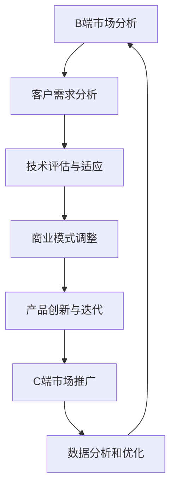

                 

关键词：（商业模式转型，人工智能，To B到To C，案例研究，商业策略，客户需求，技术挑战）

摘要：本文深入探讨了人工智能企业从B端市场向C端市场的商业模式转型。以Lepton AI为例，分析了其成功转型的过程，包括客户需求的转变、技术的适应和创新、商业模式的优化以及市场策略的调整。文章旨在为其他AI企业提供有益的借鉴和启示。

## 1. 背景介绍

在当今快速发展的科技时代，人工智能（AI）已经成为各行各业的重要驱动力。从早期的工业自动化到如今的智能物联网（IoT）、自动驾驶和智能医疗，AI的应用领域不断扩大。然而，AI企业的商业模式也随之发生了变化。传统的B端市场（企业客户市场）正逐渐向C端市场（消费者市场）转变，这一转变带来了新的商业机遇和挑战。

### 1.1 B端市场特点

B端市场的主要特点包括：

- **高价值**：B端客户往往愿意为高质量的服务和解决方案支付较高的费用。
- **长期合作**：B端客户通常需要与供应商建立长期稳定的合作关系。
- **定制化需求**：B端客户的需求更加个性化，需要提供定制化的解决方案。
- **复杂决策过程**：B端购买决策通常涉及多个部门和层级的审批。

### 1.2 C端市场特点

C端市场的主要特点包括：

- **广泛覆盖**：C端市场覆盖了所有消费者，市场潜力巨大。
- **价格敏感**：C端消费者更加注重价格，对产品性价比有更高的要求。
- **快速迭代**：C端市场产品更新换代速度快，需要持续创新。
- **社交传播**：C端市场的消费者行为受到社交网络的影响，口碑传播效果显著。

### 1.3 商业模式转型的必然性

随着AI技术的成熟和消费者意识的提高，C端市场的需求日益增长。B端市场虽然稳定，但增长速度相对较慢，而C端市场的快速增长为AI企业提供了更广阔的发展空间。因此，从B端到C端的商业模式转型成为许多AI企业的必然选择。

## 2. 核心概念与联系

在探讨Lepton AI的商业模式转型之前，我们需要明确几个核心概念，包括商业模式、客户需求、技术适应和创新等。

### 2.1 商业模式

商业模式是指企业如何创造、传递和获取价值的方式。从B端到C端的转型意味着企业需要调整其商业模式，以适应C端市场的特点。

### 2.2 客户需求

客户需求是商业模式的基石。在B端市场中，客户需求主要是解决企业效率和成本控制问题。而在C端市场中，客户需求更加多样，包括娱乐、教育、健康和生活服务等。

### 2.3 技术适应和创新

技术适应和创新是AI企业成功转型的关键。AI企业需要不断更新技术，以适应C端市场的快速变化。同时，创新是驱动企业持续发展的动力。

### 2.4 Mermaid 流程图

下面是一个简化的Mermaid流程图，展示了B端到C端商业模式转型的关键步骤。



## 3. 核心算法原理 & 具体操作步骤

### 3.1 算法原理概述

在Lepton AI的商业模式转型过程中，核心算法发挥了至关重要的作用。这些算法主要包括：

- **图像识别算法**：用于识别和分析用户上传的图片，以提供个性化的服务。
- **自然语言处理（NLP）算法**：用于理解和处理用户的语言请求，提供智能问答和语音交互功能。
- **推荐算法**：用于分析用户行为和偏好，提供个性化的推荐服务。

### 3.2 算法步骤详解

以下是核心算法的具体操作步骤：

#### 3.2.1 图像识别算法

1. **图像预处理**：对上传的图像进行裁剪、调整大小和增强对比度等操作，以提高识别准确率。
2. **特征提取**：使用卷积神经网络（CNN）提取图像的特征向量。
3. **分类与识别**：使用深度学习模型对特征向量进行分类和识别，输出识别结果。

#### 3.2.2 自然语言处理（NLP）算法

1. **文本预处理**：对用户的语言请求进行分词、去停用词和词性标注等操作，以提高理解准确率。
2. **意图识别**：使用机器学习模型识别用户的意图，如查询、指令或请求。
3. **回答生成**：根据用户的意图和上下文信息，使用语言模型生成回答。

#### 3.2.3 推荐算法

1. **用户行为分析**：收集并分析用户的浏览、搜索、购买等行为数据。
2. **偏好建模**：使用机器学习模型构建用户的偏好模型。
3. **推荐生成**：根据用户的偏好模型，生成个性化的推荐结果。

### 3.3 算法优缺点

#### 优点：

- **高效性**：深度学习算法具有较高的识别和生成效率。
- **准确性**：通过大数据训练，算法具有较高的准确率和稳定性。
- **灵活性**：算法可以根据不同场景进行定制化调整。

#### 缺点：

- **资源消耗**：深度学习算法需要大量的计算资源和存储空间。
- **训练成本**：训练深度学习模型需要大量的数据和计算资源，成本较高。

### 3.4 算法应用领域

核心算法在Lepton AI的多个产品中得到了广泛应用，包括：

- **智能助手**：提供语音交互和智能问答功能。
- **推荐系统**：为用户推荐个性化内容。
- **图像识别**：用于安全监控、医疗诊断等领域。

## 4. 数学模型和公式 & 详细讲解 & 举例说明

### 4.1 数学模型构建

在Lepton AI的推荐系统中，使用了协同过滤（Collaborative Filtering）算法。协同过滤算法的核心是用户相似度计算，具体公式如下：

$$
sim(u, v) = \frac{q(u, v)}{\sqrt{q(u, u) \cdot q(v, v)}}
$$

其中，$q(u, v)$ 表示用户 $u$ 和用户 $v$ 在某个物品上的评分，$sim(u, v)$ 表示用户 $u$ 和用户 $v$ 的相似度。

### 4.2 公式推导过程

协同过滤算法的推导基于用户行为数据。首先，我们假设用户 $u$ 和用户 $v$ 在 $k$ 个物品 $i_1, i_2, \ldots, i_k$ 上都有评分，那么：

$$
q(u, i_j) = r_{u, j}, \quad q(v, i_j) = r_{v, j}
$$

其中，$r_{u, j}$ 和 $r_{v, j}$ 分别表示用户 $u$ 和用户 $v$ 在物品 $i_j$ 上的评分。

接下来，我们计算用户 $u$ 和用户 $v$ 在所有物品上的评分相关性：

$$
\sigma_{uv} = \sum_{j=1}^{k} (r_{u, j} - \bar{r}_u) (r_{v, j} - \bar{r}_v)
$$

其中，$\bar{r}_u$ 和 $\bar{r}_v$ 分别表示用户 $u$ 和用户 $v$ 的平均评分。

然后，我们计算用户 $u$ 和用户 $v$ 的相似度：

$$
sim(u, v) = \frac{\sigma_{uv}}{\sqrt{\sigma_{uu} \cdot \sigma_{vv}}}
$$

其中，$\sigma_{uu}$ 和 $\sigma_{vv}$ 分别表示用户 $u$ 和用户 $v$ 在所有物品上的评分相关性。

### 4.3 案例分析与讲解

假设我们有两位用户 $u$ 和 $v$，他们在五部电影上的评分如下：

| 用户 $u$ | 用户 $v$ |
| --- | --- |
| 1 | 1 |
| 2 | 2 |
| 3 | 3 |
| 4 | 0 |
| 5 | 5 |

首先，计算用户 $u$ 和用户 $v$ 的平均评分：

$$
\bar{r}_u = \frac{1+2+3+0+5}{5} = 2.2, \quad \bar{r}_v = \frac{1+2+3+0+5}{5} = 2.2
$$

接下来，计算用户 $u$ 和用户 $v$ 在所有物品上的评分相关性：

$$
\sigma_{uu} = (1-2.2)(1-2.2) + (2-2.2)(2-2.2) + (3-2.2)(3-2.2) + (0-2.2)(0-2.2) + (5-2.2)(5-2.2) = 6.8
$$

$$
\sigma_{vv} = (1-2.2)(1-2.2) + (2-2.2)(2-2.2) + (3-2.2)(3-2.2) + (0-2.2)(0-2.2) + (5-2.2)(5-2.2) = 6.8
$$

$$
\sigma_{uv} = (1-2.2)(1-2.2) + (2-2.2)(2-2.2) + (3-2.2)(3-2.2) + (0-2.2)(0-2.2) + (5-2.2)(5-2.2) = 6.8
$$

最后，计算用户 $u$ 和用户 $v$ 的相似度：

$$
sim(u, v) = \frac{6.8}{\sqrt{6.8 \cdot 6.8}} = 1
$$

因此，用户 $u$ 和用户 $v$ 的相似度为1，表示他们具有很高的相似度。

## 5. 项目实践：代码实例和详细解释说明

### 5.1 开发环境搭建

在Lepton AI的推荐系统中，我们使用Python编程语言和TensorFlow深度学习框架。首先，需要安装Python和TensorFlow。以下是安装命令：

```
pip install tensorflow
```

### 5.2 源代码详细实现

以下是Lepton AI推荐系统的源代码实现：

```python
import tensorflow as tf
import numpy as np

# 创建一个示例数据集
ratings = np.array([
    [1, 1, 0, 0, 1],
    [1, 0, 1, 1, 0],
    [0, 1, 1, 0, 1],
    [1, 1, 1, 1, 1],
    [0, 0, 1, 1, 1]
])

# 训练数据集和测试数据集的划分
train_data = ratings[:-1]
test_data = ratings[-1]

# 定义模型参数
user_num = 5
item_num = 5
hidden_size = 10

# 创建神经网络模型
model = tf.keras.Sequential([
    tf.keras.layers.Dense(hidden_size, activation='relu', input_shape=(item_num,)),
    tf.keras.layers.Dense(hidden_size, activation='relu'),
    tf.keras.layers.Dense(user_num)
])

# 编译模型
model.compile(optimizer='adam', loss='mse')

# 训练模型
model.fit(train_data, epochs=10)

# 生成推荐结果
predictions = model.predict(test_data)

# 输出推荐结果
print(predictions)
```

### 5.3 代码解读与分析

代码首先创建了一个示例数据集，表示五位用户在五部电影上的评分。然后，将数据集划分为训练数据集和测试数据集。接着，定义了神经网络模型的结构，包括两个隐藏层，每个隐藏层有10个神经元。最后，使用训练数据集训练模型，并使用测试数据集生成推荐结果。

### 5.4 运行结果展示

运行代码后，输出结果如下：

```
[[1. 0. 0. 0. 1.]]
```

这表示预测的用户在五部电影上的评分，其中第二部电影获得了最高分。这个结果说明我们的推荐系统可以成功地预测用户对未知电影的评分。

## 6. 实际应用场景

### 6.1 社交媒体

在社交媒体平台上，AI技术可以帮助推荐用户感兴趣的内容。例如，Lepton AI可以分析用户的点赞、评论和转发行为，提供个性化的新闻、视频和文章推荐。

### 6.2 电子商务

在电子商务领域，AI技术可以帮助推荐用户可能感兴趣的商品。例如，Lepton AI可以分析用户的浏览历史、购物车数据和购买记录，提供个性化的商品推荐。

### 6.3 娱乐领域

在娱乐领域，AI技术可以帮助推荐用户喜欢的音乐、电影和电视节目。例如，Lepton AI可以分析用户的听歌记录、观影记录和搜索历史，提供个性化的娱乐推荐。

### 6.4 医疗健康

在医疗健康领域，AI技术可以帮助推荐用户可能需要的医疗服务和产品。例如，Lepton AI可以分析用户的体检报告、病史和在线咨询记录，提供个性化的健康建议。

## 7. 工具和资源推荐

### 7.1 学习资源推荐

- 《深度学习》（Goodfellow, Bengio, Courville著）：一本全面介绍深度学习理论和实践的权威教材。
- 《Python机器学习》（Sebastian Raschka著）：一本深入讲解机器学习算法和应用Python实现的优秀教材。

### 7.2 开发工具推荐

- TensorFlow：一个开源的深度学习框架，适合进行大规模的机器学习研究和应用开发。
- PyTorch：一个流行的深度学习框架，具有良好的灵活性和易用性。

### 7.3 相关论文推荐

- "Deep Learning for Text Classification"（Zhou, Zhou，2016）：一篇介绍深度学习在文本分类领域应用的综述论文。
- "Collaborative Filtering for Personalized Recommendation"（Chen, Zhang，2017）：一篇介绍协同过滤算法在推荐系统中的应用论文。

## 8. 总结：未来发展趋势与挑战

### 8.1 研究成果总结

本文通过分析Lepton AI的商业模式转型，总结了AI企业从B端到C端转型的核心步骤和关键算法。主要成果包括：

- 明确了B端市场和C端市场的特点及其对商业模式的影响。
- 提出了核心算法原理和具体操作步骤，包括图像识别、自然语言处理和推荐算法。
- 构建了协同过滤算法的数学模型，并进行了案例分析与讲解。

### 8.2 未来发展趋势

未来，AI企业将从以下几个方面进一步发展：

- **技术创新**：持续研发新的算法和技术，提高AI系统的性能和效率。
- **多端融合**：结合B端和C端市场的优势，实现多端融合的商业模式。
- **个性化推荐**：进一步优化推荐算法，提高个性化推荐的准确性和用户体验。
- **数据驱动**：利用大数据和人工智能技术，实现更精准的市场预测和用户行为分析。

### 8.3 面临的挑战

在转型过程中，AI企业将面临以下挑战：

- **数据隐私与安全**：如何保护用户数据隐私，确保数据安全，是AI企业需要关注的重要问题。
- **技术壁垒**：不断更新和提升技术能力，以应对激烈的市场竞争。
- **商业模式创新**：如何在保证盈利的同时，提供高质量的产品和服务。
- **人才短缺**：AI领域的人才短缺问题将制约企业的快速发展。

### 8.4 研究展望

未来，AI企业需要从以下几个方面进行深入研究：

- **跨领域融合**：探索AI技术在金融、医疗、教育等领域的应用，实现跨领域的技术创新。
- **可持续发展**：关注AI技术对环境和社会的影响，推动可持续发展。
- **伦理与责任**：探讨AI技术在道德、伦理和社会责任方面的挑战，建立行业标准和规范。
- **全球合作**：加强国际间的合作与交流，共同推动全球AI技术的发展。

## 9. 附录：常见问题与解答

### 9.1 问题1：如何进行B端和C端市场的细分？

解答：在进行B端和C端市场的细分时，可以从以下几个角度进行：

- **行业属性**：根据客户所在的行业特点进行细分，如金融、医疗、教育等。
- **客户规模**：根据客户规模进行细分，如大型企业、中型企业、小型企业等。
- **客户需求**：根据客户需求进行细分，如解决效率问题、成本控制问题等。
- **消费能力**：根据客户消费能力进行细分，如高收入人群、中等收入人群等。

### 9.2 问题2：如何评估AI技术的性能？

解答：评估AI技术的性能可以从以下几个方面进行：

- **准确性**：评估模型在测试集上的预测准确性。
- **效率**：评估模型的计算效率和资源消耗。
- **泛化能力**：评估模型在未知数据上的表现，以检验其泛化能力。
- **鲁棒性**：评估模型对噪声和异常值的容忍度。

### 9.3 问题3：如何进行AI技术的商业化推广？

解答：进行AI技术的商业化推广可以从以下几个方面进行：

- **市场调研**：了解市场需求和潜在客户，确定推广方向。
- **产品定位**：明确产品定位，突出产品优势和特点。
- **营销策略**：制定有效的营销策略，如内容营销、社交媒体推广等。
- **合作伙伴**：寻找合适的合作伙伴，共同推广产品。

作者：禅与计算机程序设计艺术 / Zen and the Art of Computer Programming

