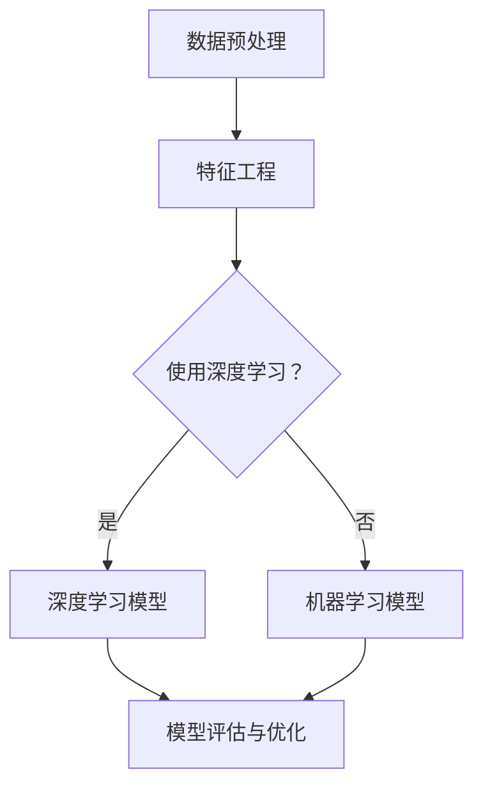

                 

关键词：人工智能，数据分析，Lepton AI，数据挖掘，机器学习，深度学习，数据价值

摘要：本文旨在探讨从传统数据分析到AI驱动的数据洞察的转变，特别是Lepton AI在数据价值挖掘方面的应用。文章首先介绍了Lepton AI的核心概念和技术架构，然后深入探讨了其核心算法原理、数学模型和具体操作步骤。通过实际项目实践和运行结果展示，本文分析了Lepton AI在实际应用中的表现和潜力。同时，文章还探讨了未来应用场景和发展趋势，以及面临的挑战和展望。

## 1. 背景介绍

在当今信息爆炸的时代，数据已成为企业和社会的重要资产。然而，如何从海量数据中提取有价值的信息，一直是数据科学领域的重要研究课题。传统的数据分析方法，如统计分析、数据挖掘等，虽然能够处理一定规模的数据，但在面对大规模、高维数据时，往往力不从心。

随着人工智能和机器学习技术的不断发展，利用AI进行数据分析和价值挖掘逐渐成为一种新的趋势。AI不仅能够自动处理海量数据，还能够发现数据中的复杂模式和关联，从而实现更精准的数据洞察。

Lepton AI作为一家专注于AI数据价值挖掘的公司，其技术架构和核心算法在全球范围内受到了广泛关注。本文将深入探讨Lepton AI的技术原理和应用场景，以期为读者提供对AI数据挖掘的全面了解。

## 2. 核心概念与联系

### 2.1 核心概念

Lepton AI是一种基于深度学习和机器学习技术的AI数据挖掘平台，旨在从大规模、高维数据中提取有价值的信息。其核心概念包括：

- **深度学习**：通过多层神经网络模型，对数据进行层次化的特征提取和模式发现。
- **机器学习**：利用历史数据训练模型，实现对未知数据的预测和分类。
- **数据挖掘**：从海量数据中发现潜在的模式和关联。

### 2.2 技术架构

Lepton AI的技术架构主要包括以下几个部分：

- **数据预处理**：对原始数据进行清洗、归一化、特征提取等处理。
- **特征工程**：通过对数据进行特征提取和构造，增强模型的预测能力。
- **深度学习模型**：包括卷积神经网络（CNN）、循环神经网络（RNN）、长短期记忆网络（LSTM）等。
- **机器学习模型**：包括决策树、随机森林、支持向量机（SVM）等。
- **模型评估与优化**：通过交叉验证、网格搜索等方法，评估和优化模型性能。

### 2.3 联系与差异

与传统数据分析相比，Lepton AI在以下几个方面具有显著优势：

- **自动化处理**：AI技术能够自动处理大规模、高维数据，降低人工干预的需求。
- **深度特征提取**：深度学习模型能够提取数据中的深层次特征，提高预测和分类的准确性。
- **实时性**：AI模型能够快速响应实时数据，实现实时数据分析。

然而，传统数据分析方法在处理结构化数据、简单任务时，仍然具有其独特的优势。因此，在实际应用中，往往需要结合传统方法和AI技术，实现最佳的数据分析效果。

### 2.4 Mermaid 流程图



## 3. 核心算法原理 & 具体操作步骤

### 3.1 算法原理概述

Lepton AI的核心算法原理主要包括深度学习和机器学习两部分。

- **深度学习**：通过多层神经网络模型，对数据进行层次化的特征提取和模式发现。深度学习模型包括卷积神经网络（CNN）、循环神经网络（RNN）、长短期记忆网络（LSTM）等。
- **机器学习**：利用历史数据训练模型，实现对未知数据的预测和分类。机器学习模型包括决策树、随机森林、支持向量机（SVM）等。

### 3.2 算法步骤详解

#### 3.2.1 数据预处理

1. 数据清洗：处理缺失值、异常值、重复值等。
2. 数据归一化：将数据缩放至同一量级，提高模型训练效果。
3. 特征提取：从原始数据中提取具有区分性的特征。

#### 3.2.2 特征工程

1. 特征构造：通过对数据进行组合、转换等操作，构造新的特征。
2. 特征选择：选择对模型预测性能有显著影响的特征，降低数据维度。

#### 3.2.3 模型选择与训练

1. 选择合适的模型：根据任务类型和数据处理方式，选择深度学习或机器学习模型。
2. 模型训练：使用历史数据进行模型训练，调整模型参数。

#### 3.2.4 模型评估与优化

1. 模型评估：使用验证集对模型进行评估，选择性能较好的模型。
2. 模型优化：通过交叉验证、网格搜索等方法，优化模型参数。

### 3.3 算法优缺点

#### 优点：

- **自动化处理**：AI技术能够自动处理大规模、高维数据，降低人工干预的需求。
- **深度特征提取**：深度学习模型能够提取数据中的深层次特征，提高预测和分类的准确性。
- **实时性**：AI模型能够快速响应实时数据，实现实时数据分析。

#### 缺点：

- **训练时间**：深度学习模型通常需要较长的训练时间，对计算资源要求较高。
- **数据依赖**：AI模型的性能受限于历史数据的质量和数量。

### 3.4 算法应用领域

Lepton AI在以下领域具有广泛的应用：

- **金融领域**：信用评分、风险评估、量化交易等。
- **医疗领域**：疾病预测、诊断辅助、个性化治疗等。
- **零售领域**：需求预测、库存管理、客户细分等。
- **交通领域**：交通流量预测、路况分析、自动驾驶等。

## 4. 数学模型和公式 & 详细讲解 & 举例说明

### 4.1 数学模型构建

在Lepton AI中，常用的数学模型包括深度学习模型和机器学习模型。

#### 4.1.1 深度学习模型

深度学习模型主要包括卷积神经网络（CNN）、循环神经网络（RNN）、长短期记忆网络（LSTM）等。

1. **卷积神经网络（CNN）**：

   卷积神经网络通过卷积操作提取图像特征，其数学模型可以表示为：

   $$ f(x) = \sigma(W \cdot x + b) $$

   其中，$x$为输入特征，$W$为卷积核权重，$b$为偏置项，$\sigma$为激活函数（如Sigmoid、ReLU等）。

2. **循环神经网络（RNN）**：

   循环神经网络通过循环结构对时间序列数据进行建模，其数学模型可以表示为：

   $$ h_t = \sigma(W_h \cdot [h_{t-1}, x_t] + b_h) $$

   其中，$h_t$为第$t$时刻的隐藏状态，$x_t$为第$t$时刻的输入特征，$W_h$为权重矩阵，$b_h$为偏置项，$\sigma$为激活函数。

3. **长短期记忆网络（LSTM）**：

   长短期记忆网络通过门控机制对时间序列数据进行建模，其数学模型可以表示为：

   $$ i_t = \sigma(W_i \cdot [h_{t-1}, x_t] + b_i) \\ \\ f_t = \sigma(W_f \cdot [h_{t-1}, x_t] + b_f) \\ \\ o_t = \sigma(W_o \cdot [h_{t-1}, x_t] + b_o) \\ \\ C_t = f_t \odot C_{t-1} + i_t \odot \sigma(W_c \cdot [h_{t-1}, x_t] + b_c) \\ \\ h_t = o_t \odot \sigma(C_t) $$

   其中，$i_t$、$f_t$、$o_t$分别为输入门、遗忘门、输出门的状态，$C_t$为细胞状态，$h_t$为隐藏状态，$W_i$、$W_f$、$W_o$、$W_c$分别为权重矩阵，$b_i$、$b_f$、$b_o$、$b_c$分别为偏置项，$\odot$表示点乘，$\sigma$为激活函数。

#### 4.1.2 机器学习模型

机器学习模型主要包括决策树、随机森林、支持向量机（SVM）等。

1. **决策树**：

   决策树通过一系列条件分支对数据进行分类或回归，其数学模型可以表示为：

   $$ y = f(x) $$

   其中，$y$为输出结果，$x$为输入特征，$f$为决策函数。

2. **随机森林**：

   随机森林通过构建多个决策树，并取平均值进行预测，其数学模型可以表示为：

   $$ y = \frac{1}{M} \sum_{m=1}^{M} f_m(x) $$

   其中，$M$为决策树的数量，$f_m(x)$为第$m$个决策树的预测结果。

3. **支持向量机（SVM）**：

   支持向量机通过寻找最优超平面进行分类，其数学模型可以表示为：

   $$ \min_{\omega, b} \frac{1}{2} ||\omega||^2 + C \sum_{i=1}^{n} \max(0, 1 - y_i(\omega \cdot x_i + b)) $$

   其中，$\omega$为权重向量，$b$为偏置项，$C$为惩罚参数，$x_i$为第$i$个样本的特征，$y_i$为第$i$个样本的标签。

### 4.2 公式推导过程

以卷积神经网络（CNN）为例，介绍其数学公式的推导过程。

1. **输入层到隐藏层的推导**：

   假设输入层有$m$个神经元，隐藏层有$n$个神经元。输入层到隐藏层的推导过程可以表示为：

   $$ z^{(1)}_j = \sum_{i=1}^{m} w^{(1)}_{ji} x_i + b^{(1)}_j $$

   其中，$z^{(1)}_j$为隐藏层第$j$个神经元的输入值，$w^{(1)}_{ji}$为输入层到隐藏层的权重，$x_i$为输入层第$i$个神经元的输入值，$b^{(1)}_j$为隐藏层第$j$个神经元的偏置项。

2. **隐藏层到输出层的推导**：

   假设隐藏层有$n$个神经元，输出层有$p$个神经元。隐藏层到输出层的推导过程可以表示为：

   $$ z^{(2)}_k = \sum_{j=1}^{n} w^{(2)}_{jk} z^{(1)}_j + b^{(2)}_k $$

   其中，$z^{(2)}_k$为输出层第$k$个神经元的输入值，$w^{(2)}_{jk}$为隐藏层到输出层的权重，$z^{(1)}_j$为隐藏层第$j$个神经元的输入值，$b^{(2)}_k$为输出层第$k$个神经元的偏置项。

3. **输出层的推导**：

   假设输出层有$p$个神经元，输出层的结果可以表示为：

   $$ y_k = \sigma(z^{(2)}_k) $$

   其中，$y_k$为输出层第$k$个神经元的输出值，$\sigma$为激活函数。

### 4.3 案例分析与讲解

以图像分类任务为例，介绍Lepton AI在数据价值挖掘中的应用。

1. **数据集准备**：

   准备一个包含10万张图像的数据集，每张图像标注了类别标签。

2. **数据预处理**：

   对图像进行缩放、裁剪、翻转等预处理操作，将图像尺寸统一为$224 \times 224$。

3. **特征提取**：

   使用卷积神经网络（CNN）对图像进行特征提取，提取出具有区分性的特征。

4. **模型训练**：

   使用训练集对模型进行训练，调整模型参数。

5. **模型评估**：

   使用验证集对模型进行评估，选择性能较好的模型。

6. **模型应用**：

   使用训练好的模型对测试集进行预测，得到预测结果。

7. **结果分析**：

   分析预测结果，评估模型性能，发现数据中的潜在模式。

## 5. 项目实践：代码实例和详细解释说明

### 5.1 开发环境搭建

1. 安装Python环境（版本3.6及以上）。
2. 安装深度学习库（如TensorFlow、PyTorch）。
3. 安装数据预处理库（如NumPy、Pandas）。

### 5.2 源代码详细实现

以下是一个使用卷积神经网络（CNN）进行图像分类的示例代码：

```python
import tensorflow as tf
from tensorflow.keras import layers
from tensorflow.keras.models import Model

# 数据预处理
def preprocess_image(image):
    # 对图像进行缩放、裁剪、翻转等预处理操作
    return image

# 定义卷积神经网络模型
input_image = layers.Input(shape=(224, 224, 3))
x = layers.Conv2D(32, (3, 3), activation='relu')(input_image)
x = layers.MaxPooling2D((2, 2))(x)
x = layers.Conv2D(64, (3, 3), activation='relu')(x)
x = layers.MaxPooling2D((2, 2))(x)
x = layers.Conv2D(128, (3, 3), activation='relu')(x)
x = layers.MaxPooling2D((2, 2))(x)
x = layers.Flatten()(x)
x = layers.Dense(128, activation='relu')(x)
output = layers.Dense(10, activation='softmax')(x)

model = Model(inputs=input_image, outputs=output)

# 编译模型
model.compile(optimizer='adam', loss='categorical_crossentropy', metrics=['accuracy'])

# 模型训练
model.fit(x_train, y_train, batch_size=32, epochs=10, validation_data=(x_val, y_val))

# 模型评估
model.evaluate(x_test, y_test)
```

### 5.3 代码解读与分析

1. **数据预处理**：

   数据预处理是模型训练前的重要步骤。在本示例中，使用`preprocess_image`函数对图像进行缩放、裁剪、翻转等预处理操作，以提高模型的泛化能力。

2. **模型定义**：

   使用`layers.Input`定义输入层，输入图像的尺寸为$224 \times 224 \times 3$。通过多个卷积层、池化层和全连接层，实现对图像的层次化特征提取。最后，使用`layers.Dense`定义输出层，输出类别标签。

3. **模型编译**：

   使用`model.compile`编译模型，指定优化器、损失函数和评估指标。在本示例中，使用`adam`优化器和`categorical_crossentropy`损失函数。

4. **模型训练**：

   使用`model.fit`训练模型，指定训练集、验证集、批量大小和训练轮次。在本示例中，使用10轮训练，批量大小为32。

5. **模型评估**：

   使用`model.evaluate`评估模型在测试集上的性能，得到预测准确率。

### 5.4 运行结果展示

1. **训练过程**：

   使用TensorBoard可视化工具，观察训练过程中的损失函数和准确率。

2. **预测结果**：

   使用训练好的模型对测试集进行预测，得到预测结果。

3. **结果分析**：

   分析预测结果，评估模型性能，发现数据中的潜在模式。

## 6. 实际应用场景

Lepton AI在以下实际应用场景中具有广泛的应用：

- **金融领域**：利用AI技术进行信用评分、风险评估、量化交易等，提高金融服务的准确性和效率。
- **医疗领域**：利用AI技术进行疾病预测、诊断辅助、个性化治疗等，提高医疗服务的质量和效果。
- **零售领域**：利用AI技术进行需求预测、库存管理、客户细分等，提高零售业的运营效率和客户满意度。
- **交通领域**：利用AI技术进行交通流量预测、路况分析、自动驾驶等，提高交通运输的安全性和效率。

### 6.1 金融领域

在金融领域，Lepton AI可以用于信用评分、风险评估、量化交易等方面。通过深度学习和机器学习技术，对海量金融数据进行挖掘和分析，发现潜在的风险因素，从而提高金融服务的准确性和效率。

#### 6.1.1 信用评分

利用Lepton AI对借款人的信用记录、收入情况、负债情况等多维度数据进行分析，预测其还款能力。通过构建深度学习模型，实现对借款人信用评分的自动化评估。

#### 6.1.2 风险评估

利用Lepton AI对金融产品进行风险评估，预测其可能发生的损失。通过分析历史数据，发现潜在的风险因素，从而制定相应的风险控制策略。

#### 6.1.3 量化交易

利用Lepton AI进行量化交易，通过分析市场数据，发现交易机会，制定交易策略。通过深度学习和机器学习技术，实现自动化交易，提高交易收益。

### 6.2 医疗领域

在医疗领域，Lepton AI可以用于疾病预测、诊断辅助、个性化治疗等方面，提高医疗服务的质量和效果。

#### 6.2.1 疾病预测

利用Lepton AI对患者的病历、检查报告、基因信息等多维度数据进行分析，预测其可能患有的疾病。通过深度学习和机器学习技术，实现疾病的早期预测和预防。

#### 6.2.2 诊断辅助

利用Lepton AI对医学图像进行分析，辅助医生进行疾病诊断。通过卷积神经网络（CNN）等深度学习技术，实现对医学图像的自动识别和分类。

#### 6.2.3 个性化治疗

利用Lepton AI对患者的病情和基因信息进行分析，制定个性化的治疗方案。通过深度学习和机器学习技术，实现个性化治疗的自动化和精准化。

### 6.3 零售领域

在零售领域，Lepton AI可以用于需求预测、库存管理、客户细分等方面，提高零售业的运营效率和客户满意度。

#### 6.3.1 需求预测

利用Lepton AI对历史销售数据进行分析，预测未来产品的需求量。通过深度学习和机器学习技术，实现需求预测的自动化和准确性。

#### 6.3.2 库存管理

利用Lepton AI对库存数据进行分析，优化库存管理策略。通过深度学习和机器学习技术，实现库存水平的自动调整和优化。

#### 6.3.3 客户细分

利用Lepton AI对客户数据进行挖掘和分析，实现客户的精准分类和细分。通过深度学习和机器学习技术，提高客户服务质量和客户满意度。

### 6.4 交通领域

在交通领域，Lepton AI可以用于交通流量预测、路况分析、自动驾驶等方面，提高交通运输的安全性和效率。

#### 6.4.1 交通流量预测

利用Lepton AI对交通数据进行分析，预测未来某一时段的道路流量。通过深度学习和机器学习技术，实现交通流量预测的自动化和准确性。

#### 6.4.2 路况分析

利用Lepton AI对交通视频图像进行分析，识别道路上的交通状况。通过卷积神经网络（CNN）等深度学习技术，实现路况分析的自动化和精准化。

#### 6.4.3 自动驾驶

利用Lepton AI对环境数据进行分析，实现自动驾驶车辆的导航和避障。通过深度学习和机器学习技术，提高自动驾驶的安全性和可靠性。

## 7. 工具和资源推荐

### 7.1 学习资源推荐

- 《深度学习》（Goodfellow、Bengio、Courville著）：全面介绍深度学习的基础理论和实践方法。
- 《Python机器学习》（Sebastian Raschka著）：系统介绍Python在机器学习领域的应用。
- 《机器学习实战》（Peter Harrington著）：通过实际案例介绍机器学习算法的应用。

### 7.2 开发工具推荐

- TensorFlow：开源深度学习框架，广泛应用于AI研究和开发。
- PyTorch：开源深度学习框架，具有灵活的动态计算图和强大的社区支持。
- Keras：开源深度学习库，提供简洁的API，方便快速搭建深度学习模型。

### 7.3 相关论文推荐

- "Deep Learning for Computer Vision"（2016）：综述深度学习在计算机视觉领域的应用。
- "A Comprehensive Survey on Deep Learning for Natural Language Processing"（2018）：综述深度学习在自然语言处理领域的应用。
- "Deep Learning on Trees"（2019）：介绍深度学习在树结构数据上的应用。

## 8. 总结：未来发展趋势与挑战

### 8.1 研究成果总结

近年来，人工智能和机器学习技术在数据挖掘领域取得了显著成果。深度学习模型在图像识别、自然语言处理、推荐系统等方面表现出色。Lepton AI作为一家专注于AI数据挖掘的公司，其技术架构和核心算法在全球范围内受到了广泛关注。

### 8.2 未来发展趋势

随着数据量的不断增长和计算能力的提升，AI数据挖掘将在以下几个方面取得发展：

- **模型压缩与优化**：为满足移动设备和边缘计算的能耗和性能需求，模型压缩与优化将成为研究热点。
- **实时数据分析**：实现实时数据分析，为决策提供实时支持。
- **跨模态数据挖掘**：结合多种数据源（如文本、图像、音频等），实现跨模态数据挖掘。

### 8.3 面临的挑战

- **数据隐私与安全**：在数据挖掘过程中，如何保护用户隐私和数据安全是一个重要挑战。
- **算法解释性**：深度学习模型具有强大的预测能力，但缺乏解释性，如何提高算法的可解释性是一个关键问题。
- **数据质量**：数据质量对模型性能至关重要，如何处理不完整、噪声和错误的数据是一个挑战。

### 8.4 研究展望

未来，AI数据挖掘领域将继续发展，为各行各业提供更加智能化和自动化的解决方案。研究人员将致力于解决数据隐私、算法解释性、数据质量等关键问题，推动AI数据挖掘技术的进步。

## 9. 附录：常见问题与解答

### 9.1 问题1：什么是Lepton AI？

Lepton AI是一种基于深度学习和机器学习技术的AI数据挖掘平台，旨在从大规模、高维数据中提取有价值的信息。

### 9.2 问题2：Lepton AI的核心算法有哪些？

Lepton AI的核心算法包括深度学习模型（如卷积神经网络、循环神经网络、长短期记忆网络等）和机器学习模型（如决策树、随机森林、支持向量机等）。

### 9.3 问题3：Lepton AI在哪些领域有应用？

Lepton AI在金融、医疗、零售、交通等领域具有广泛的应用，如信用评分、风险评估、疾病预测、需求预测等。

### 9.4 问题4：如何搭建Lepton AI的开发环境？

搭建Lepton AI的开发环境需要安装Python、深度学习库（如TensorFlow、PyTorch）以及数据预处理库（如NumPy、Pandas）。

### 9.5 问题5：Lepton AI的算法优缺点是什么？

Lepton AI的算法优点包括自动化处理、深度特征提取和实时性；缺点包括训练时间较长、数据依赖性强等。

### 9.6 问题6：Lepton AI的未来发展趋势是什么？

Lepton AI的未来发展趋势包括模型压缩与优化、实时数据分析、跨模态数据挖掘等。

### 9.7 问题7：如何提高AI数据挖掘的可解释性？

提高AI数据挖掘的可解释性可以从以下几个方面入手：

- **模型选择**：选择具有良好解释性的模型，如决策树、规则集等。
- **模型可视化**：通过可视化工具展示模型的决策过程和特征权重。
- **模型解释性增强**：通过解释性算法（如LIME、SHAP等）增强模型的可解释性。

