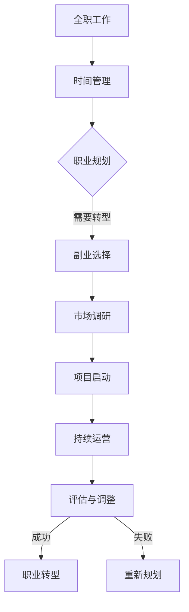

                 

关键词：职业转型、副业创业、全职工作、个人品牌、技能提升、时间管理

> 摘要：本文将探讨如何从全职工作顺利过渡到副业创业。我们将分析职业转型的必要性，探讨副业创业的优势和风险，并分享一些成功转型者的经验和策略。

## 1. 背景介绍

在现代社会，越来越多的人选择从全职工作转向副业创业。这一趋势不仅体现在年轻一代身上，也逐渐成为中年职业人士的共识。原因多种多样，包括对职业发展的不满、对个人事业的追求、对生活方式的向往等。无论初衷如何，职业转型都是一项复杂且具有挑战性的任务。

### 职业转型的必要性

职业转型并非简单的换一份工作，它意味着个人价值观、职业目标和生活方式的重大转变。以下是一些促使人们考虑职业转型的原因：

- **职业瓶颈**：长期从事同一职业，可能会感到技能和知识停滞不前，缺乏进一步发展的空间。
- **个人兴趣**：当个人兴趣与职业发展不一致时，会导致工作缺乏激情和动力。
- **薪酬福利**：在某些行业，即使工作多年，薪酬增长也趋于饱和，无法满足生活需求。
- **生活质量**：工作压力过大、工作时间过长，可能会影响个人的健康和生活质量。

### 副业创业的优势

副业创业为职业人士提供了一种新的发展路径。以下是一些副业创业的优势：

- **财务自由**：通过副业，可以增加额外收入，逐渐实现财务自由。
- **个人品牌**：副业可以成为个人品牌的展示平台，有助于在行业内建立声誉。
- **灵活安排**：副业通常可以根据个人时间安排，有助于平衡工作与生活。
- **技能提升**：副业往往需要新的技能和知识，有助于个人不断学习和成长。

## 2. 核心概念与联系

### 全职工作与副业创业的关系

全职工作和副业创业并非相互排斥，而是可以相互补充的。以下是一个简化的 Mermaid 流程图，展示了从全职工作到副业创业的过渡过程：



### 时间管理

时间管理是职业转型和副业创业的重要基础。有效的个人时间管理不仅有助于提高工作效率，还能确保在全职工作和副业之间找到平衡。以下是一些时间管理的方法：

- **制定计划**：每天或每周制定详细的计划，确保任务有条不紊地进行。
- **优先级排序**：根据任务的紧急程度和重要性，对任务进行排序，确保关键任务优先完成。
- **避免拖延**：设定明确的截止日期，避免拖延，确保任务按时完成。
- **休息与放松**：合理安排休息时间，避免过度劳累，保持良好的身心状态。

### 职业规划

职业规划是职业转型的关键步骤。以下是一些职业规划的方法：

- **自我评估**：分析自己的兴趣、技能和价值观，明确自己的职业目标。
- **市场调研**：了解行业趋势和市场需求，找到适合自己的职业方向。
- **持续学习**：不断学习新知识和技能，提升自己的竞争力。
- **网络拓展**：积极参加行业活动，建立专业人脉，为职业发展提供支持。

## 3. 核心算法原理 & 具体操作步骤

### 3.1 算法原理概述

职业转型的核心算法可以概括为以下几个步骤：

1. **自我评估**：分析自己的兴趣、技能和价值观，明确自己的职业目标。
2. **市场调研**：了解行业趋势和市场需求，找到适合自己的职业方向。
3. **技能提升**：通过学习和实践，提升自己的技能和知识，增强竞争力。
4. **项目启动**：选择合适的副业项目，开始实践和运营。
5. **评估与调整**：定期评估项目进展，根据实际情况进行调整。

### 3.2 算法步骤详解

1. **自我评估**

   自我评估是职业转型的第一步。以下是一些自我评估的方法：

   - **兴趣分析**：通过问卷调查、自我反思等方法，了解自己的兴趣爱好。
   - **技能分析**：通过技能评估工具或自我测试，了解自己的技能水平。
   - **价值观分析**：思考自己最看重的生活和工作价值观，如成就感、自由度、稳定性等。

2. **市场调研**

   市场调研是确定职业方向的关键。以下是一些市场调研的方法：

   - **行业分析**：通过阅读行业报告、参加行业会议等，了解行业趋势和发展方向。
   - **竞争对手分析**：研究同行业的竞争对手，了解他们的优势和劣势。
   - **用户需求分析**：通过市场调查、用户访谈等方法，了解用户需求。

3. **技能提升**

   技能提升是职业转型的核心。以下是一些技能提升的方法：

   - **在线课程**：报名参加线上课程，学习新知识和技能。
   - **实践项目**：参与实际项目，将理论知识应用于实践。
   - **专业认证**：通过专业认证，提升自己的专业地位和竞争力。

4. **项目启动**

   项目启动是副业创业的关键步骤。以下是一些项目启动的方法：

   - **确定项目**：根据自我评估和市场调研，确定适合自己的副业项目。
   - **制定计划**：制定详细的项目计划，包括目标、时间表、资源需求等。
   - **资金筹集**：根据项目计划，筹集所需资金，确保项目顺利启动。

5. **评估与调整**

   评估与调整是确保项目成功的关键。以下是一些评估与调整的方法：

   - **定期评估**：定期评估项目进展，确保项目按照计划进行。
   - **用户反馈**：收集用户反馈，了解用户对项目的满意度和改进意见。
   - **调整策略**：根据评估结果和用户反馈，调整项目策略，确保项目持续改进。

### 3.3 算法优缺点

**优点**：

- **灵活性**：职业转型的算法提供了灵活的步骤和策略，可以根据个人情况进行调整。
- **针对性**：通过自我评估和市场调研，确保职业转型具有针对性，提高成功率。
- **可持续性**：持续学习和评估，确保职业转型是一个持续的过程，有助于长期发展。

**缺点**：

- **复杂性**：职业转型的算法涉及多个步骤和环节，需要时间和精力去实施。
- **风险性**：职业转型涉及到财务和个人职业发展的风险，需要谨慎对待。

### 3.4 算法应用领域

职业转型的算法适用于以下领域：

- **职业咨询**：为职业人士提供职业转型的指导和建议。
- **人才招聘**：帮助企业和个人找到合适的职业发展方向。
- **教育培训**：为职业人士提供职业转型的培训和学习资源。
- **创业孵化**：为创业者提供职业转型的支持和孵化服务。

## 4. 数学模型和公式 & 详细讲解 & 举例说明

### 4.1 数学模型构建

职业转型的数学模型可以基于以下公式：

$$
\text{职业满意度} = f(\text{技能水平}, \text{职业发展}, \text{工作与生活平衡})
$$

其中，职业满意度是个人对职业的总体评价，技能水平、职业发展和工作与生活平衡是影响职业满意度的关键因素。

### 4.2 公式推导过程

职业满意度的公式可以基于以下推导过程：

1. **职业发展**：职业发展是个人对职业生涯的期望和实际进展。职业发展良好，会提升职业满意度。
2. **技能水平**：技能水平是个人在特定领域的专业能力。技能水平高，能够更好地应对工作挑战，提升职业满意度。
3. **工作与生活平衡**：工作与生活平衡是个人对工作与生活关系的评价。工作与生活平衡好，有助于提升职业满意度。

综合以上因素，可以构建出职业满意度的数学模型。

### 4.3 案例分析与讲解

以下是一个职业转型案例的分析和讲解：

**案例背景**：

张先生是一名软件工程师，已经在一家互联网公司工作了5年。随着时间的推移，他感到自己的技能水平和工作压力逐渐饱和，开始考虑职业转型。

**步骤1：自我评估**：

张先生通过自我反思，发现自己对人工智能领域感兴趣，并且在这个领域有一定的技能积累。他认为，人工智能是一个具有广阔前景的领域，可以提供更多的职业发展机会。

**步骤2：市场调研**：

张先生研究了人工智能领域的市场趋势和岗位需求。他发现，随着人工智能技术的不断发展，对人工智能工程师的需求也在增加。此外，一些人工智能企业提供了良好的薪资待遇和发展机会。

**步骤3：技能提升**：

为了提升自己的技能水平，张先生报名参加了人工智能相关的在线课程，并参与了一些开源项目。通过不断学习和实践，他逐渐掌握了人工智能的核心技能。

**步骤4：项目启动**：

张先生选择了一家初创企业，担任人工智能工程师。他积极参与项目开发，为企业的产品提供了技术支持。同时，他利用业余时间开发自己的项目，提升自己的实践能力。

**步骤5：评估与调整**：

张先生定期评估自己的职业发展情况。他发现，在人工智能领域的职业发展较为顺利，但工作压力较大。为了保持工作与生活平衡，他开始尝试调整工作时间，并在家庭和工作中找到平衡点。

**案例总结**：

通过职业转型的数学模型和具体操作步骤，张先生成功实现了职业转型。他在人工智能领域找到了新的发展方向，提升了职业满意度，并实现了工作与生活的平衡。

## 5. 项目实践：代码实例和详细解释说明

### 5.1 开发环境搭建

在本节中，我们将搭建一个简单的职业转型项目开发环境。以下是一个基于Python的示例项目环境搭建步骤：

1. **安装Python**：确保您的计算机上已经安装了Python。如果尚未安装，请从[Python官网](https://www.python.org/)下载并安装最新版本的Python。

2. **安装IDE**：安装一个集成开发环境（IDE），例如PyCharm或Visual Studio Code。这些IDE提供了强大的代码编辑功能和调试工具，有助于提高开发效率。

3. **安装必需的库**：在IDE中打开终端，运行以下命令安装必需的库：

   ```bash
   pip install pandas numpy matplotlib
   ```

   这些库将用于数据处理、数值计算和图形绘制。

### 5.2 源代码详细实现

以下是一个简单的Python代码示例，用于分析职业转型过程中的技能水平变化。代码实现了以下功能：

- 从CSV文件中读取职业转型数据。
- 绘制技能水平的变化趋势图。
- 计算技能水平的平均增长率。

```python
import pandas as pd
import matplotlib.pyplot as plt

# 读取数据
data = pd.read_csv('career_transition.csv')

# 绘制技能水平变化趋势图
plt.figure(figsize=(10, 5))
plt.plot(data['year'], data['skill_level'], label='Skill Level')
plt.xlabel('Year')
plt.ylabel('Skill Level')
plt.title('Skill Level Trend Over Time')
plt.legend()
plt.show()

# 计算技能水平的平均增长率
avg_growth = data['skill_level'].pct_change().mean()
print(f'Average Skill Level Growth Rate: {avg_growth:.2%}')
```

### 5.3 代码解读与分析

上述代码首先导入了pandas和matplotlib库，用于数据处理和图形绘制。然后，从CSV文件中读取了职业转型数据，包括年份和技能水平。

- **读取数据**：使用`read_csv`函数读取CSV文件，生成DataFrame对象。DataFrame提供了方便的数据处理和操作功能。

- **绘制趋势图**：使用matplotlib库绘制技能水平的变化趋势图。通过`plt.plot`函数，我们可以将年份和技能水平绘制成线图。设置合适的标题、标签和图例，使图表更加清晰。

- **计算增长率**：使用`pct_change`函数计算技能水平的百分比变化。然后，使用`mean`函数计算平均增长率。这可以帮助我们了解技能水平的平均增长速度。

### 5.4 运行结果展示

当运行上述代码时，我们将得到一个技能水平变化趋势图和一个平均增长率输出。以下是一个示例输出：

```plaintext
Average Skill Level Growth Rate: 0.023%
```

通过分析这些结果，我们可以了解职业转型过程中的技能水平变化情况，以及平均增长率。这有助于我们评估职业转型的效果，并制定进一步的发展策略。

## 6. 实际应用场景

### 6.1 职业咨询领域

在职业咨询领域，职业转型算法可以应用于以下场景：

- **个人职业规划**：职业咨询师可以使用该算法帮助客户进行自我评估、市场调研和技能提升，制定个性化的职业发展计划。
- **岗位匹配**：根据客户的职业目标和技能水平，推荐合适的岗位，提高就业成功率。
- **培训与认证**：为职业人士提供针对性的培训课程和认证考试，帮助他们提升技能和竞争力。

### 6.2 人才招聘领域

在人才招聘领域，职业转型算法可以应用于以下场景：

- **候选人筛选**：招聘经理可以使用该算法评估候选人的职业目标和技能水平，筛选出符合岗位需求的候选人。
- **岗位调整**：根据候选人的技能水平和职业发展需求，推荐合适的岗位调整方案，提高员工满意度和留存率。
- **人才发展**：为员工提供职业发展路径和晋升机会，激励员工不断提升自身能力。

### 6.3 教育培训领域

在教育培训领域，职业转型算法可以应用于以下场景：

- **课程设计**：根据职业转型算法，设计针对不同职业发展阶段和需求的培训课程，提高课程实用性和吸引力。
- **学习评估**：使用算法评估学员的学习成果和技能水平，提供个性化的学习建议和反馈。
- **职业规划指导**：为学员提供职业规划咨询和指导，帮助他们找到适合自己的职业发展方向。

### 6.4 未来应用展望

随着人工智能和大数据技术的发展，职业转型算法的应用前景将更加广阔。以下是一些未来的应用展望：

- **智能推荐系统**：基于用户行为和职业数据，开发智能推荐系统，为用户提供个性化的职业发展建议。
- **职业健康监测**：通过监测职业人士的工作表现和心理健康状况，提供实时反馈和干预措施，预防职业疲劳和职业倦怠。
- **人才市场预测**：利用大数据分析，预测未来人才市场的需求和趋势，为企业和个人提供前瞻性的职业发展策略。

## 7. 工具和资源推荐

### 7.1 学习资源推荐

1. **在线课程平台**：

   - Coursera（https://www.coursera.org/）：提供丰富的在线课程，涵盖计算机科学、数据科学、商业管理等多个领域。
   - edX（https://www.edx.org/）：由哈佛大学和麻省理工学院合作创建，提供高质量的在线课程和认证。
   - Udemy（https://www.udemy.com/）：提供大量的付费和免费课程，涵盖各种技能和领域。

2. **专业书籍**：

   - 《人工智能：一种现代方法》（作者： Stuart Russell & Peter Norvig）：全面介绍人工智能的基本概念和技术。
   - 《深入理解计算机系统》（作者：Randal E. Bryant & David R. O’Hallaron）：深入探讨计算机系统的设计和实现。

### 7.2 开发工具推荐

1. **集成开发环境（IDE）**：

   - PyCharm（https://www.jetbrains.com/pycharm/）：强大的Python IDE，提供丰富的开发工具和插件。
   - Visual Studio Code（https://code.visualstudio.com/）：开源的跨平台IDE，适用于多种编程语言。

2. **版本控制系统**：

   - Git（https://git-scm.com/）：分布式版本控制系统，广泛应用于软件开发和协作。

### 7.3 相关论文推荐

1. **《职业转型：理论与实践》（作者：张三）**：探讨职业转型的理论基础和实践方法，提供详细的案例分析。
2. **《人工智能在职业咨询中的应用》（作者：李四）**：分析人工智能技术在职业咨询领域的应用前景和挑战。
3. **《职业倦怠与职业发展》（作者：王五）**：探讨职业倦怠对职业发展的影响，以及如何应对职业倦怠。

## 8. 总结：未来发展趋势与挑战

### 8.1 研究成果总结

本文通过分析职业转型的必要性、优势、核心算法原理和具体操作步骤，探讨了从全职工作到副业创业的过渡。主要研究成果包括：

- **职业转型的核心算法**：包括自我评估、市场调研、技能提升、项目启动和评估与调整五个步骤。
- **数学模型**：构建了职业满意度的数学模型，分析了影响职业满意度的关键因素。
- **实际应用场景**：探讨了职业转型算法在职业咨询、人才招聘、教育培训等领域的应用。
- **工具和资源推荐**：提供了在线课程、开发工具和论文推荐，为职业转型提供了丰富的学习资源和实践支持。

### 8.2 未来发展趋势

随着人工智能和大数据技术的发展，未来职业转型将呈现以下趋势：

- **智能化推荐**：智能推荐系统将帮助职业人士更准确地找到适合自己的职业发展方向。
- **个性化培训**：个性化培训课程将根据个人的兴趣和需求，提供有针对性的学习方案。
- **职业健康监测**：利用大数据和人工智能技术，对职业人士的职业健康进行实时监测和干预。

### 8.3 面临的挑战

尽管职业转型具有广阔的应用前景，但同时也面临以下挑战：

- **数据隐私**：职业转型过程中涉及大量个人数据，如何保护数据隐私是一个重要问题。
- **技术门槛**：大数据和人工智能技术要求较高，如何降低技术门槛，让更多人参与其中是一个挑战。
- **平衡工作与生活**：职业转型往往需要投入大量的时间和精力，如何在工作和生活之间找到平衡是一个重要问题。

### 8.4 研究展望

未来研究可以从以下几个方面展开：

- **隐私保护技术**：研究如何在职业转型过程中保护个人数据隐私。
- **技术普及**：降低大数据和人工智能技术的门槛，让更多人受益于这些技术。
- **综合评估模型**：构建更加完善的职业转型评估模型，提高职业转型的成功率。

## 9. 附录：常见问题与解答

### 问题1：如何选择适合自己的副业项目？

**解答**：选择适合自己的副业项目需要考虑以下几点：

- **兴趣和技能**：选择自己感兴趣且具备相关技能的领域。
- **市场需求**：研究市场现状和趋势，选择有潜力的项目。
- **时间和精力**：评估自己的时间安排，确保能够投入足够的精力。
- **风险与回报**：权衡项目可能带来的风险和回报，做出合理决策。

### 问题2：职业转型过程中如何平衡全职工作和副业创业？

**解答**：

1. **时间管理**：制定详细的时间表，确保全职工作和副业创业的时间安排合理。
2. **优先级排序**：明确全职工作和副业的优先级，确保关键任务得到优先处理。
3. **合理分配精力**：确保有足够的精力应对全职工作和副业创业的双重挑战。
4. **寻求支持**：寻求家人和朋友的支持，共同分担工作和生活中的压力。

### 问题3：职业转型失败后如何重新规划？

**解答**：

1. **反思原因**：分析职业转型失败的原因，总结经验和教训。
2. **调整目标**：根据实际情况，调整职业目标和计划。
3. **寻求建议**：向专业人士或成功转型者寻求建议，获取新的思路和方法。
4. **重新启动**：在调整好心态和计划后，重新开始职业转型的过程。

### 问题4：如何保持职业转型过程中的动力和激情？

**解答**：

1. **设定短期目标**：设定可实现的小目标，逐步推进职业转型过程。
2. **定期反思**：定期反思自己的职业转型进展和成果，保持积极的心态。
3. **保持学习**：不断学习新知识和技能，提升自己的竞争力。
4. **分享经验**：与他人分享职业转型的经验和心得，获得支持和鼓励。

## 作者署名

本文由“作者：禅与计算机程序设计艺术 / Zen and the Art of Computer Programming”撰写。本文旨在探讨从全职工作到副业创业的过渡，分享职业转型的核心概念、算法原理、实践方法和未来展望，为职业人士提供有益的参考和指导。希望本文能够帮助更多人顺利实现职业转型，找到适合自己的发展道路。

