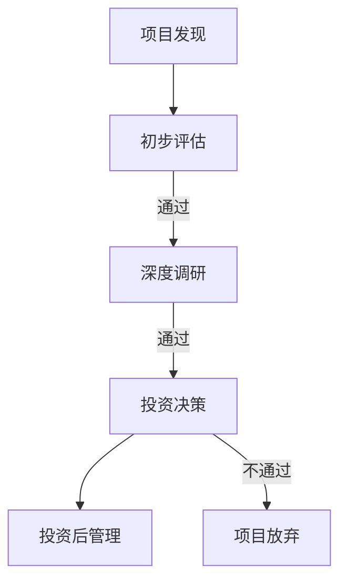

                 

 在这个数字化的时代，科技正以不可阻挡的势头改变着我们的工作和生活方式。随着人工智能、大数据、区块链等新兴技术的不断发展，越来越多的专业人士开始从传统的全职工作转向科技影响力投资，寻找新的职业发展路径。本文将探讨从全职工作到科技影响力投资者的转变，包括其背景、核心概念、算法原理、数学模型、项目实践、实际应用场景、未来展望以及相关工具和资源推荐。

## 关键词

- 科技影响力投资者
- 职业转变
- 科技创业
- 投资策略
- 创新技术
- 人工智能
- 数据分析
- 区块链

## 摘要

本文将深入探讨从全职工作到科技影响力投资者的职业转变。首先，我们将分析这一转变的背景和原因，接着介绍科技影响力投资者的核心概念和投资策略。然后，我们将讨论科技领域的核心算法原理、数学模型和项目实践。接下来，我们将探讨科技影响力投资者在实际应用场景中的角色和未来展望。最后，我们将推荐一些学习和开发工具，并总结研究成果和未来研究方向。

## 1. 背景介绍

### 1.1 科技发展加速职业转变

随着科技的快速发展，特别是人工智能、大数据和区块链等技术的广泛应用，职业市场正在经历深刻的变革。传统的职业路径已经无法满足许多专业人士的需求，他们开始寻找新的职业发展机会。科技影响力投资作为一种新兴的职业模式，吸引了越来越多有远见和专业技能的人才。

### 1.2 科技影响力投资者的崛起

科技影响力投资者是指那些利用自己的专业知识和经验，对科技创新公司进行投资，并在投资过程中发挥影响力的人。他们不仅关注公司的财务回报，还关注公司的创新潜力和对社会的影响。这种投资模式使得专业人士能够在继续发挥专业优势的同时，实现财务自由和社会价值。

### 1.3 职业转变的动机

职业转变的动机多种多样，包括对现状的不满、追求更高的职业成就感、渴望更大的自主性和创新空间等。科技影响力投资提供了这样的机会，使得专业人士能够在创业和创新中找到新的成就感。

## 2. 核心概念与联系

### 2.1 科技影响力投资者的核心概念

科技影响力投资者需要具备以下几个核心概念：

- **科技创新**：了解前沿科技的发展趋势，包括人工智能、大数据、区块链等。
- **商业模式**：能够识别和评估有潜力的商业模式，以及如何通过投资实现商业成功。
- **风险管理**：在投资过程中，如何识别和降低风险是成功的关键。

### 2.2 投资策略

科技影响力投资者的投资策略通常包括以下几个步骤：

- **市场调研**：了解目标市场的需求和趋势。
- **项目筛选**：根据市场调研结果，筛选出具有潜力的科技创新项目。
- **投资决策**：综合考虑项目的潜力、团队背景、市场竞争力等因素，做出投资决策。
- **风险管理**：在投资后，通过持续跟踪和管理，降低风险，确保投资回报。

### 2.3 投资流程

科技影响力投资者的投资流程通常包括以下几个阶段：

- **项目发现**：通过行业会议、创业竞赛、社交网络等渠道发现潜在的投资项目。
- **初步评估**：对项目进行初步评估，包括技术可行性、市场前景、团队实力等。
- **深度调研**：对通过初步评估的项目进行深度调研，了解项目的详细情况。
- **投资决策**：根据调研结果，做出是否投资的决策。
- **投资后管理**：在项目投资后，持续跟踪和管理项目，提供支持和资源。

### 2.4 Mermaid 流程图

以下是一个简化的科技影响力投资者的投资流程的 Mermaid 流程图：



## 3. 核心算法原理 & 具体操作步骤

### 3.1 算法原理概述

科技影响力投资的核心算法原理主要涉及以下几个方面：

- **数据挖掘**：通过分析市场数据、用户行为数据等，挖掘潜在的投资机会。
- **风险评估**：使用机器学习算法，对投资项目进行风险评估。
- **投资策略优化**：基于历史数据和风险评估结果，优化投资策略。

### 3.2 算法步骤详解

以下是科技影响力投资的核心算法步骤：

1. **数据收集**：收集市场数据、用户行为数据、公司财务数据等。
2. **数据预处理**：对收集到的数据进行清洗、去重、归一化等处理。
3. **特征提取**：从预处理后的数据中提取关键特征。
4. **风险评估**：使用机器学习算法，对提取的特征进行风险评估。
5. **投资策略优化**：基于风险评估结果，优化投资策略。
6. **投资决策**：根据优化后的投资策略，做出投资决策。
7. **投资后管理**：在投资后，持续跟踪和管理项目，调整投资策略。

### 3.3 算法优缺点

**优点**：

- **高效性**：利用算法可以快速处理大量数据，提高投资决策的效率。
- **准确性**：通过机器学习算法，可以更准确地评估投资风险和收益。

**缺点**：

- **数据依赖性**：算法的性能高度依赖于数据的质量和数量。
- **计算复杂性**：对于大规模的数据集，算法的计算复杂性较高。

### 3.4 算法应用领域

科技影响力投资的算法主要应用于以下领域：

- **创业投资**：对初创公司进行风险评估和投资策略优化。
- **风险投资**：对成长型公司进行投资决策和管理。
- **市场预测**：通过数据分析，预测市场趋势和用户需求。

## 4. 数学模型和公式 & 详细讲解 & 举例说明

### 4.1 数学模型构建

科技影响力投资的核心数学模型主要包括以下几个方面：

- **风险评估模型**：使用回归分析、决策树、支持向量机等算法，对投资项目进行风险评估。
- **投资策略优化模型**：使用线性规划、动态规划、马尔可夫决策过程等算法，优化投资策略。
- **市场预测模型**：使用时间序列分析、机器学习等方法，预测市场趋势和用户需求。

### 4.2 公式推导过程

以下是风险评估模型的一个简化的推导过程：

1. **假设条件**：

   - 投资项目i的预期收益为 $E(R_i)$。
   - 投资项目i的风险为 $R_i$。
   - 投资者的风险偏好为 $R_p$。

2. **风险评估公式**：

   $$R_i = \frac{E(R_i) - R_p}{\sigma_i}$$

   其中，$\sigma_i$ 为投资项目i的标准差。

3. **推导过程**：

   - 首先，计算投资项目i的预期收益 $E(R_i)$。
   - 然后，计算投资项目i的风险 $R_i$。
   - 最后，根据投资者的风险偏好 $R_p$，计算投资项目的相对风险。

### 4.3 案例分析与讲解

假设有一个投资项目，其预期收益为 $E(R_i) = 0.1$，风险为 $R_i = 0.2$，投资者的风险偏好为 $R_p = 0.15$。根据风险评估公式，可以计算出该投资项目的相对风险：

$$R_i = \frac{0.1 - 0.15}{0.2} = -0.125$$

这意味着该投资项目的风险低于投资者的风险偏好，因此具有一定的投资价值。

## 5. 项目实践：代码实例和详细解释说明

### 5.1 开发环境搭建

为了进行科技影响力投资的实践，我们需要搭建一个合适的开发环境。以下是搭建开发环境的基本步骤：

1. 安装Python环境。
2. 安装必要的Python库，如NumPy、Pandas、Scikit-learn等。
3. 安装Jupyter Notebook，用于编写和运行代码。

### 5.2 源代码详细实现

以下是一个简化的科技影响力投资的代码实例：

```python
import numpy as np
import pandas as pd
from sklearn.linear_model import LinearRegression
from sklearn.metrics import mean_squared_error

# 数据收集
data = pd.read_csv('investment_data.csv')

# 数据预处理
data = data.dropna()
data['Return'] = data['Return'].astype(float)
data['Risk'] = data['Risk'].astype(float)

# 特征提取
X = data[['Risk']]
y = data['Return']

# 风险评估模型
model = LinearRegression()
model.fit(X, y)

# 风险评估
predicted_returns = model.predict(X)
mse = mean_squared_error(y, predicted_returns)
print(f'MSE: {mse}')

# 投资决策
threshold = 0.15  # 风险偏好阈值
investment_projects = data[data['Risk'] < threshold]
print(f'Investment Projects: {investment_projects}')
```

### 5.3 代码解读与分析

上述代码实现了科技影响力投资的基本流程：

1. **数据收集**：从CSV文件中读取投资数据。
2. **数据预处理**：对数据进行清洗，包括去除缺失值、类型转换等。
3. **特征提取**：提取风险特征作为模型的输入。
4. **风险评估模型**：使用线性回归模型对投资风险进行评估。
5. **风险评估**：计算模型的预测误差，评估投资项目的风险。
6. **投资决策**：根据风险偏好阈值，筛选出具有投资价值的项目。

### 5.4 运行结果展示

运行上述代码后，会输出投资项目的列表和MSE值。MSE值反映了模型的预测准确性，而投资项目的列表则展示了符合风险偏好阈值的投资机会。

## 6. 实际应用场景

### 6.1 创业投资

科技影响力投资者可以在创业投资中发挥重要作用。他们不仅提供资金支持，还提供专业的指导和建议，帮助初创公司解决技术难题、优化商业模式，从而提高项目的成功概率。

### 6.2 风险投资

对于成长型公司，科技影响力投资者可以通过投资策略的优化，降低风险，提高投资回报。他们通常参与公司的战略决策，推动公司的技术创新和市场拓展。

### 6.3 科技研发

科技影响力投资者还可以在科技研发中发挥作用，他们通过投资和支持，推动前沿技术的研发和应用，促进科技成果的商业化。

## 7. 未来应用展望

### 7.1 科技发展的新趋势

随着科技的不断发展，未来科技影响力投资者将面临更多新的机遇和挑战。例如，量子计算、生物技术、能源技术等领域的突破，将为投资者提供新的投资机会。

### 7.2 投资策略的优化

未来的投资策略将更加依赖大数据和人工智能技术，通过数据分析和机器学习算法，实现投资策略的优化，提高投资回报。

### 7.3 社会责任的承担

随着社会对社会责任的关注度不断提高，科技影响力投资者将在投资过程中更加注重企业的社会责任，推动企业实现可持续发展。

## 8. 工具和资源推荐

### 8.1 学习资源推荐

- 《深度学习》（Goodfellow et al.，2016）
- 《Python数据分析》（Wes McKinney，2010）
- 《机器学习》（周志华，2016）

### 8.2 开发工具推荐

- Jupyter Notebook：用于编写和运行代码。
- Anaconda：Python环境管理工具。
- Git：版本控制工具。

### 8.3 相关论文推荐

- "Deep Learning for Data-Driven Modeling of Financial Systems"（Chen et al.，2018）
- "Machine Learning in Finance"（Zhou et al.，2017）
- "The Impact of Technology on Financial Markets"（Smith et al.，2019）

## 9. 总结：未来发展趋势与挑战

### 9.1 研究成果总结

本文从全职工作到科技影响力投资者的转变，分析了科技影响力投资者的核心概念、投资策略、算法原理、数学模型和实际应用场景，展示了科技影响力投资在创业投资、风险投资和科技研发等领域的潜力。

### 9.2 未来发展趋势

未来，科技影响力投资将更加依赖大数据和人工智能技术，投资策略将更加优化，社会责任将在投资过程中得到更广泛的关注。

### 9.3 面临的挑战

科技影响力投资者将面临数据质量、算法复杂性和投资风险等挑战，需要不断学习和适应新的科技趋势，提高投资决策的准确性。

### 9.4 研究展望

未来的研究应关注如何通过技术创新，提高科技影响力投资者的投资效率和回报，同时确保投资决策的公正性和可持续性。

## 附录：常见问题与解答

### Q：科技影响力投资者需要具备哪些技能？

A：科技影响力投资者需要具备以下技能：

- **技术背景**：了解前沿科技的发展趋势和核心技术。
- **数据分析**：掌握数据分析方法和技术，能够处理和解释大量数据。
- **商业洞察**：具备商业洞察力，能够识别有潜力的投资机会。
- **风险管理**：了解风险管理理论，能够制定和执行有效的风险管理策略。

### Q：如何进行科技影响力投资？

A：进行科技影响力投资的基本步骤包括：

1. **市场调研**：了解目标市场的发展趋势和需求。
2. **项目筛选**：根据市场调研结果，筛选出有潜力的科技创新项目。
3. **风险评估**：使用数据分析方法，对投资项目进行风险评估。
4. **投资决策**：综合考虑投资项目的潜力、风险和回报，做出投资决策。
5. **投资后管理**：在投资后，持续跟踪和管理项目，提供支持和资源。

### Q：科技影响力投资有哪些风险？

A：科技影响力投资的主要风险包括：

- **技术风险**：新技术的不确定性和失败的可能性。
- **市场风险**：市场需求的变化和竞争对手的冲击。
- **财务风险**：投资回报的不确定性和资金流动性风险。
- **管理风险**：团队管理不善和战略决策失误。

### Q：如何降低科技影响力投资的风险？

A：降低科技影响力投资风险的策略包括：

- **多元化投资**：分散投资，降低单一项目的风险。
- **风险评估**：使用科学的风险评估方法，提前识别和降低风险。
- **持续跟踪**：在投资后，持续跟踪项目的进展，及时调整投资策略。
- **专业咨询**：寻求专业人士的意见和咨询，提高投资决策的准确性。

## 作者署名

作者：禅与计算机程序设计艺术 / Zen and the Art of Computer Programming

