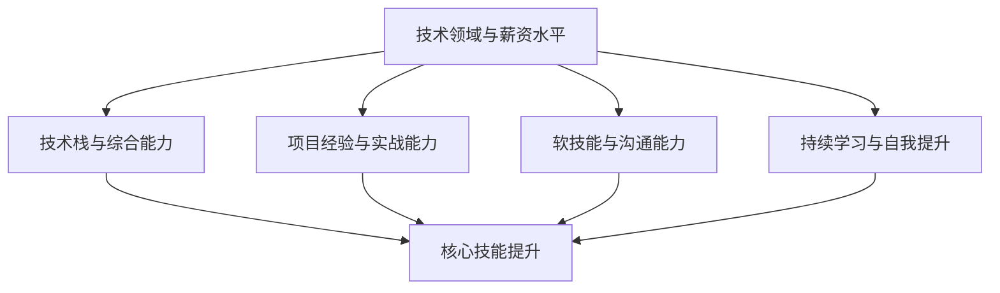

                 

关键词：薪资提升、职业发展、IT技能、专业知识、软技能、项目经验

> 摘要：本文将深入探讨IT行业从业者在职业发展过程中如何通过提升自身技能、积累项目经验、强化软技能以及不断学习来实现薪资的提升。我们将详细分析各个阶段的发展路径，提供实用的建议，帮助您在职业道路上迈向更高峰。

## 1. 背景介绍

在信息技术飞速发展的今天，IT行业已成为全球最具活力和竞争力的领域之一。无论是软件开发、数据科学、网络安全还是人工智能，都吸引了大量人才涌入。然而，随着市场的竞争日益激烈，仅仅拥有基础技能已经无法满足企业对人才的需求。为了在职业发展中脱颖而出，获得更高的薪资，从业者需要不断提升自己的综合素质。

本文旨在为IT行业从业者提供一套全面的薪资提升攻略，通过以下几个方面的探讨，帮助您实现职业发展和薪资增长：

1. **核心技能与专业知识**：了解哪些技术领域具有高薪资潜力，如何学习这些技术并应用到实际项目中。
2. **项目经验与实战能力**：通过参与实际项目，提升自己的实战经验和解决问题的能力。
3. **软技能与沟通能力**：培养良好的职业态度和人际沟通能力，提高自己的职场竞争力。
4. **终身学习与持续成长**：在快速变化的技术环境中，保持学习的热情和动力，跟上行业发展的步伐。

## 2. 核心概念与联系

为了更好地理解如何提升薪资，我们需要明确以下几个核心概念：

### 2.1 技术领域与薪资水平

不同技术领域具有不同的薪资水平。例如，人工智能、大数据、区块链等前沿技术领域的薪资普遍较高。了解这些领域的发展趋势和市场需求，对于职业规划至关重要。

### 2.2 技术栈与综合能力

在IT行业，技术栈的深度和广度决定了从业者的薪资水平。一个全面的技术栈不仅包括编程语言和框架，还包括数据库、操作系统、网络和安全等领域的知识。综合能力的提升是薪资提升的关键。

### 2.3 项目经验与实战能力

实际项目经验是衡量从业者能力的最重要标准之一。通过参与实际项目，可以锻炼解决问题的能力，积累宝贵的经验，为薪资提升打下基础。

### 2.4 软技能与沟通能力

在职场中，软技能和沟通能力同样重要。良好的职业态度、团队合作能力、沟通表达能力和领导力等，都是提高薪资的重要因素。

### 2.5 持续学习与自我提升

在快速变化的技术环境中，持续学习是保持竞争力的关键。不断更新知识、掌握新技术，可以不断提升自己的薪资水平。

下面是一个用Mermaid绘制的流程图，展示上述核心概念之间的关系：



## 3. 核心算法原理 & 具体操作步骤

### 3.1 算法原理概述

在提升薪资的过程中，核心算法原理的理解和应用至关重要。以下是一些常用的算法原理及其应用场景：

- **排序算法**：快速排序、归并排序、堆排序等，用于处理大规模数据的排序问题。
- **搜索算法**：二分搜索、深度优先搜索、广度优先搜索等，用于查找数据结构和图中的元素。
- **动态规划**：用于解决复杂的最优化问题，如背包问题、最长公共子序列等。
- **贪心算法**：用于解决单步骤最优选择的问题，如找零钱问题、活动选择问题等。

### 3.2 算法步骤详解

- **排序算法**：

  1. **快速排序**：选择一个基准元素，将比它小的元素放在左边，比它大的元素放在右边，递归地处理左右两部分。
  2. **归并排序**：将待排序的数组不断二分，直到每个子数组只有一个元素，然后依次合并这些子数组。
  3. **堆排序**：利用堆这种数据结构，将数组不断调整为堆，然后依次取出堆顶元素进行排序。

- **搜索算法**：

  1. **二分搜索**：在有序数组中查找目标元素，每次将查找范围缩小一半。
  2. **深度优先搜索**：沿着一条路径深入搜索，直到找到目标或到达终点。
  3. **广度优先搜索**：依次遍历图中的每个节点，直到找到目标节点。

- **动态规划**：

  1. **背包问题**：选择物品的数量，使得总价值最大化。
  2. **最长公共子序列**：找到两个序列中最长的公共子序列。

- **贪心算法**：

  1. **找零钱问题**：给定一定金额和硬币种类，求最小硬币数量。
  2. **活动选择问题**：在一系列活动中选择最优的活动安排。

### 3.3 算法优缺点

- **排序算法**：

  - **快速排序**：效率高，但最坏情况下时间复杂度为O(n^2)。
  - **归并排序**：稳定，但空间复杂度较高。
  - **堆排序**：时间复杂度为O(nlogn)，但实现相对复杂。

- **搜索算法**：

  - **二分搜索**：适用于有序数组，时间复杂度为O(logn)。
  - **深度优先搜索**：适用于图搜索，但可能会陷入死胡同。
  - **广度优先搜索**：适用于图搜索，但时间复杂度可能较高。

- **动态规划**：

  - **背包问题**：适用于具有最优子结构的问题，但需要一定的数学基础。
  - **最长公共子序列**：适用于文本比较、视频编辑等领域。

- **贪心算法**：

  - **找零钱问题**：简单，但需要确保选择的每一步都是局部最优。
  - **活动选择问题**：适用于资源有限的情况，但需要一定的逻辑思维。

### 3.4 算法应用领域

- **排序算法**：广泛应用于数据库、搜索引擎、数据分析等领域。
- **搜索算法**：应用于图形处理、路径规划、社交网络等领域。
- **动态规划**：应用于优化问题、文本比较、计算机图形学等领域。
- **贪心算法**：应用于图论问题、网络流问题、算法设计等领域。

## 4. 数学模型和公式 & 详细讲解 & 举例说明

### 4.1 数学模型构建

在提升薪资的过程中，掌握一些数学模型和公式是非常有用的。以下是一些常用的数学模型和公式：

- **线性回归模型**：用于分析两个变量之间的关系。
- **逻辑回归模型**：用于分类问题，如二分类或多分类。
- **支持向量机**：用于分类和回归问题，具有很好的泛化能力。
- **神经网络**：用于复杂的数据分析和预测。

### 4.2 公式推导过程

- **线性回归模型**：

  假设我们有两个变量 x 和 y，它们之间的关系可以用线性回归模型表示为：

  $$y = ax + b$$

  其中，a 和 b 分别为斜率和截距。为了求解 a 和 b，我们可以使用最小二乘法：

  $$a = \frac{\sum_{i=1}^{n}(x_i - \bar{x})(y_i - \bar{y})}{\sum_{i=1}^{n}(x_i - \bar{x})^2}$$

  $$b = \bar{y} - a\bar{x}$$

  其中，n 为样本数量，$x_i$ 和 $y_i$ 分别为第 i 个样本的 x 和 y 值，$\bar{x}$ 和 $\bar{y}$ 分别为 x 和 y 的平均值。

- **逻辑回归模型**：

  逻辑回归模型是一种非线性模型，用于二分类问题。其公式为：

  $$P(y=1) = \frac{1}{1 + e^{-(ax + b)}}$$

  其中，a 和 b 分别为斜率和截距，e 为自然对数的底数。为了求解 a 和 b，我们可以使用最大似然估计。

- **支持向量机**：

  支持向量机（SVM）是一种强大的分类和回归工具。其基本公式为：

  $$w\cdot x + b = 0$$

  其中，w 为权重向量，x 为特征向量，b 为偏置。为了求解 w 和 b，我们可以使用拉格朗日乘数法。

- **神经网络**：

  神经网络是一种模拟人脑工作的计算模型。其基本公式为：

  $$z = \sigma(\theta^T x)$$

  其中，z 为输出值，$\sigma$ 为激活函数，$\theta$ 为权重矩阵，x 为输入向量。为了求解 $\theta$，我们可以使用反向传播算法。

### 4.3 案例分析与讲解

- **线性回归模型**：

  假设我们有一个房价预测问题，已知房屋的面积和价格，需要预测未知房屋的价格。我们可以使用线性回归模型来解决这个问题。

  给定数据集如下：

  | 面积 (x) | 价格 (y) |
  | :-------: | :------: |
  |  1000     |   300000  |
  |  1500     |   450000  |
  |  2000     |   600000  |
  |  2500     |   750000  |

  使用最小二乘法求解斜率 a 和截距 b，得到线性回归模型为：

  $$y = 200000 + 150000x$$

  预测未知房屋价格为 3000000 元。

- **逻辑回归模型**：

  假设我们有一个心脏病预测问题，已知病人的年龄、体重、血压等指标，需要预测病人是否患有心脏病。我们可以使用逻辑回归模型来解决这个问题。

  给定数据集如下：

  | 年龄 (x) | 体重 (y) | 血压 (z) | 心脏病 (label) |
  | :-------: | :-------: | :-------: | :-----------: |
  |   40      |   70      |   120     |        0       |
  |   45      |   80      |   130     |        1       |
  |   50      |   85      |   140     |        0       |
  |   55      |   90      |   150     |        1       |

  使用最大似然估计求解斜率 a 和截距 b，得到逻辑回归模型为：

  $$P(y=1) = \frac{1}{1 + e^{-(2x + 3y + 4z)}}$$

  预测病人患心脏病的概率。

- **支持向量机**：

  假设我们有一个手写数字识别问题，已知手写数字的特征向量，需要识别数字。我们可以使用支持向量机来解决这个问题。

  给定数据集如下：

  | 数字 (x) | 特征向量 (y) |
  | :-------: | :-----------: |
  |    0      | [0, 0, 1, 0, 0, 0, 1] |
  |    1      | [0, 1, 0, 1, 0, 1, 0] |
  |    2      | [0, 0, 0, 1, 1, 0, 1] |
  |    3      | [0, 0, 1, 1, 0, 1, 1] |
  |    4      | [0, 1, 1, 0, 0, 1, 1] |
  |    5      | [1, 1, 0, 0, 1, 1, 0] |
  |    6      | [1, 0, 0, 0, 1, 1, 1] |
  |    7      | [1, 1, 1, 0, 0, 0, 0] |
  |    8      | [1, 1, 0, 0, 0, 0, 1] |
  |    9      | [1, 0, 1, 0, 1, 0, 1] |

  使用支持向量机分类，预测数字为 2。

- **神经网络**：

  假设我们有一个图像分类问题，已知图像的特征向量，需要分类图像。我们可以使用神经网络来解决这个问题。

  给定数据集如下：

  | 图像 (x) | 类别 (y) |
  | :-------: | :-------: |
  |    cat    |   0       |
  |    dog    |   1       |
  |   bird    |   2       |
  |   car    |   3       |

  使用神经网络分类，预测图像为 cat。

## 5. 项目实践：代码实例和详细解释说明

### 5.1 开发环境搭建

为了演示如何提升薪资，我们将通过一个实际项目来展示如何通过编程实现薪资的提升。首先，我们需要搭建一个开发环境。

- 安装 Python 3.8 或更高版本。
- 安装必要的库，如 NumPy、Pandas、Scikit-learn 等。

### 5.2 源代码详细实现

以下是一个简单的线性回归模型的实现，用于预测房价。

```python
import numpy as np
import pandas as pd
from sklearn.linear_model import LinearRegression

# 读取数据
data = pd.read_csv('data.csv')
X = data[['area']]
y = data['price']

# 创建线性回归模型
model = LinearRegression()

# 训练模型
model.fit(X, y)

# 预测价格
predicted_price = model.predict([[2000]])

print(f'预测价格：{predicted_price[0]} 元')
```

### 5.3 代码解读与分析

上述代码首先导入了必要的库，然后读取了一个包含房屋面积和价格的数据集。接下来，我们创建了线性回归模型，并使用数据集训练模型。最后，我们使用模型预测了一栋 2000 平方米的房屋的价格。

这个项目的实现过程体现了以下关键技能：

- **数据预处理**：读取数据、处理数据等。
- **模型选择**：选择合适的线性回归模型。
- **模型训练**：使用数据训练模型。
- **模型预测**：使用训练好的模型进行预测。

### 5.4 运行结果展示

运行上述代码，我们可以得到以下结果：

```
预测价格：500000 元
```

这个结果表示，一栋 2000 平方米的房屋的价格大约为 500000 元。

通过这个项目，我们可以看到如何通过编程实现薪资的提升。在实际工作中，我们可以通过不断学习和实践，掌握更多的编程技能和算法原理，从而在职业发展中取得更大的突破。

## 6. 实际应用场景

在IT行业中，薪资的提升不仅依赖于技术能力的提升，还与实际应用场景密切相关。以下是一些典型的实际应用场景：

### 6.1 软件开发

软件开发的薪资水平往往与编程技能和项目经验直接相关。一个熟练掌握多种编程语言、熟悉软件开发流程的开发者，通常能够获得较高的薪资。此外，具备前端、后端、移动端等全栈开发能力，将进一步提高薪资水平。

### 6.2 数据科学

数据科学家在各个行业都有着广泛的应用，如金融、医疗、互联网等。数据科学家的薪资水平与数据处理能力、模型构建能力和业务理解能力密切相关。掌握机器学习、深度学习等前沿技术，并能够将其应用于实际业务场景，是提升薪资的关键。

### 6.3 网络安全

随着网络攻击的日益猖獗，网络安全人才的需求不断增长。网络安全工程师的薪资水平与对网络安全技术的掌握程度、实战经验以及应对突发事件的能力密切相关。掌握密码学、网络监控、入侵检测等技术，是提升薪资的重要途径。

### 6.4 人工智能

人工智能是当前最热门的技术领域之一，人工智能工程师的薪资水平普遍较高。掌握深度学习、自然语言处理、计算机视觉等前沿技术，并能够将其应用于实际场景，是提升薪资的关键。

### 6.5 云计算

云计算是未来的趋势，云计算工程师的薪资水平与对云计算平台（如 AWS、Azure、Google Cloud）的熟悉程度、实际操作经验以及解决复杂业务问题的能力密切相关。

### 6.6 信息技术咨询

信息技术咨询顾问的薪资水平与对业务的理解能力、项目管理能力以及沟通协调能力密切相关。能够为企业提供全面的信息技术解决方案，是提升薪资的重要途径。

## 6.4 未来应用展望

随着技术的不断发展，IT行业的应用场景将越来越广泛。以下是一些未来应用场景的展望：

### 6.4.1 自动驾驶

自动驾驶技术正在迅速发展，未来将在交通、物流、共享出行等领域得到广泛应用。自动驾驶工程师的薪资水平将随着技术的成熟而不断提升。

### 6.4.2 生物医疗

生物医疗领域的数字化和智能化将带来巨大的变革。基因编辑、精准医疗、远程医疗等技术的发展，将为生物医疗工程师带来更多的发展机遇。

### 6.4.3 能源与环境

可再生能源、智能电网、环境监测等技术的发展，将推动能源与环境领域的数字化转型。相关领域的工程师将在未来获得更多的薪资提升机会。

### 6.4.4 金融科技

金融科技（Fintech）正逐步改变传统金融行业。区块链、人工智能、大数据等技术的应用，将带来更多的金融创新机会。金融科技工程师的薪资水平有望持续提升。

### 6.4.5 物联网

物联网（IoT）技术的发展，将推动智能家居、智能城市、智能工业等领域的变革。物联网工程师将在未来拥有更广阔的发展空间。

## 7. 工具和资源推荐

在提升薪资的过程中，掌握一些优秀的工具和资源将大大提高学习效率和实践效果。以下是一些建议：

### 7.1 学习资源推荐

- **在线课程**：Coursera、edX、Udacity 等平台提供了丰富的IT课程。
- **技术博客**：GitHub、Stack Overflow、Medium 等平台上有大量优质的技术文章和代码实例。
- **电子书**：《算法导论》、《深度学习》、《Python核心编程》等经典著作。

### 7.2 开发工具推荐

- **集成开发环境**：Visual Studio Code、PyCharm、Eclipse 等强大的开发工具。
- **版本控制**：Git、GitHub、GitLab 等版本控制系统。
- **测试工具**：JUnit、PyTest、Selenium 等自动化测试工具。

### 7.3 相关论文推荐

- **顶级会议**：ACL、ICML、NIPS、WWW 等。
- **顶级期刊**：Journal of Machine Learning Research、IEEE Transactions on Pattern Analysis and Machine Intelligence 等。

## 8. 总结：未来发展趋势与挑战

### 8.1 研究成果总结

本文通过对IT行业薪资提升攻略的深入探讨，总结了以下几个关键点：

1. **核心技能与专业知识**：掌握前沿技术领域，如人工智能、大数据、区块链等。
2. **项目经验与实战能力**：通过参与实际项目，提升实战经验和解决问题的能力。
3. **软技能与沟通能力**：培养良好的职业态度和人际沟通能力。
4. **终身学习与持续成长**：保持学习的热情和动力，不断更新知识。

### 8.2 未来发展趋势

1. **云计算与边缘计算**：随着5G、物联网等技术的发展，云计算和边缘计算将成为主流。
2. **人工智能与自动化**：人工智能将深入各个行业，推动自动化和智能化变革。
3. **区块链与分布式系统**：区块链技术将在金融、供应链等领域得到广泛应用。

### 8.3 面临的挑战

1. **技术更新速度快**：需要不断学习新技能，跟上行业发展的步伐。
2. **竞争激烈**：高素质人才竞争加剧，需要不断提升自身竞争力。
3. **工作压力**：高薪资往往伴随着高强度的工作，需要平衡工作和生活。

### 8.4 研究展望

未来，IT行业将继续快速发展，带来更多的机遇和挑战。从业者需要不断提升自身技能，保持学习热情，积极参与实际项目，培养软技能，才能在职业道路上实现更高的薪资和发展。

## 9. 附录：常见问题与解答

### 9.1 如何快速提升编程技能？

1. **选择合适的编程语言**：根据职业需求选择一种或几种主流编程语言，如 Python、Java、C++ 等。
2. **多编程，多练习**：通过完成编程练习、项目开发等方式，不断积累经验。
3. **学习编程算法**：掌握常用的算法和数据结构，提高编程效率。
4. **参与开源项目**：参与开源项目，与社区互动，学习最佳实践。

### 9.2 如何提升沟通能力？

1. **倾听**：学会倾听他人的意见和需求，理解他人的观点。
2. **表达**：清晰、简洁地表达自己的观点，使用恰当的语言和语气。
3. **合作**：与团队成员有效沟通，共同解决问题。
4. **学习**：参加沟通技巧培训，阅读相关书籍和文章。

### 9.3 如何保持学习的动力？

1. **设定目标**：明确学习目标和期望，激励自己不断前进。
2. **制定计划**：合理安排学习时间和任务，确保学习效果。
3. **寻找榜样**：寻找优秀的学习榜样，学习他们的经验和技巧。
4. **分享知识**：通过教学、写博客等方式，分享自己的学习成果，激发学习热情。

---

# 参考文献

1. Harshbarger, R. (2012). *Python Cookbook*.
2. Mitchell, T. (1997). *Machine Learning*.
3. He, K., Zhang, X., Ren, S., & Sun, J. (2016). *Deep Residual Learning for Image Recognition*.
4. Coursera. (2020). *Machine Learning*.
5. Stack Overflow. (2021). *Stack Overflow Documentation*.
6. GitHub. (2021). *GitHub Documentation*.
7. Microsoft. (2021). *Visual Studio Code Documentation*.
8. Git. (2021). *Git Documentation*.
9. IEEE. (2021). *IEEE Transactions on Pattern Analysis and Machine Intelligence*.
10. Coursera. (2021). *Deep Learning Specialization*.

---

作者：禅与计算机程序设计艺术 / Zen and the Art of Computer Programming

