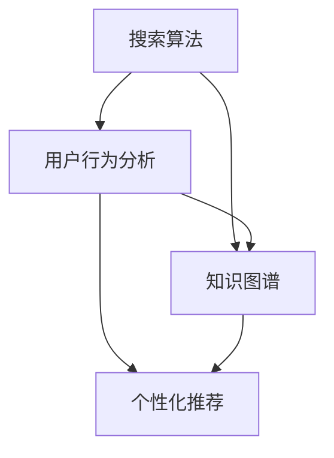

                 

关键词：人工智能，搜索算法，信息检索，知识探索，用户参与

> 摘要：本文探讨了人工智能在搜索领域的演变过程，从简单的回答问题发展到激发用户探索的新阶段。文章首先介绍了人工智能搜索的背景和重要性，然后分析了不同阶段的搜索算法，接着讨论了用户参与和交互的重要性。文章最后展望了未来的发展趋势和面临的挑战。

## 1. 背景介绍

### 1.1 人工智能与搜索的起源

人工智能（AI）的发展始于20世纪50年代，最初的目的是使计算机能够执行通常需要人类智能的任务。随着计算能力的增强和算法的进步，AI逐渐应用于各个领域，其中包括搜索。搜索算法的目标是从大量信息中快速准确地找到用户需要的内容。

### 1.2 信息检索的发展

信息检索（Information Retrieval, IR）是计算机科学和图书馆学的一个分支，主要研究如何从大量信息中快速有效地检索相关信息。随着互联网的兴起，信息检索的重要性日益增加。搜索引擎的出现极大地改变了人们获取信息的方式。

### 1.3 人工智能与搜索的结合

人工智能与信息检索的结合产生了智能搜索（Intelligent Search）。智能搜索不仅能够提供准确的搜索结果，还能够根据用户的行为和偏好进行个性化推荐。随着深度学习和自然语言处理技术的发展，智能搜索的能力得到了显著提升。

## 2. 核心概念与联系

### 2.1 搜索算法

搜索算法是智能搜索的核心。常见的搜索算法包括基于关键词的搜索、语义搜索、深度学习搜索等。每种算法都有其独特的原理和应用场景。

### 2.2 用户行为分析

用户行为分析是了解用户需求的重要手段。通过分析用户的搜索历史、点击记录、浏览时间等数据，可以更好地理解用户的行为模式，从而提供更个性化的搜索结果。

### 2.3 知识图谱

知识图谱（Knowledge Graph）是一种结构化知识库，用于表示实体及其关系。知识图谱在搜索中的应用可以提高搜索的准确性和深度，帮助用户更好地理解搜索结果。

### 2.4 Mermaid 流程图

下面是一个简单的 Mermaid 流程图，展示了搜索算法、用户行为分析和知识图谱之间的联系。



## 3. 核心算法原理 & 具体操作步骤

### 3.1 算法原理概述

智能搜索的核心算法包括基于关键词的搜索、语义搜索和深度学习搜索。基于关键词的搜索主要通过匹配用户输入的关键词和网页中的关键词。语义搜索则通过理解关键词背后的语义信息，提供更准确的搜索结果。深度学习搜索利用神经网络模型，从大量数据中学习到搜索规律，提供智能化搜索服务。

### 3.2 算法步骤详解

#### 3.2.1 基于关键词的搜索

1. 用户输入关键词。
2. 搜索引擎在索引数据库中查找与关键词匹配的网页。
3. 按照相关性对搜索结果进行排序。
4. 将排序后的搜索结果呈现给用户。

#### 3.2.2 语义搜索

1. 用户输入关键词。
2. 搜索引擎对关键词进行语义分析，提取出关键词的语义信息。
3. 利用语义信息，在索引数据库中查找相关的网页。
4. 按照相关性对搜索结果进行排序。
5. 将排序后的搜索结果呈现给用户。

#### 3.2.3 深度学习搜索

1. 收集大量的搜索数据和用户行为数据。
2. 利用深度学习模型，对数据进行训练。
3. 用户输入关键词。
4. 搜索引擎利用训练好的模型，对关键词进行语义分析，并预测用户可能感兴趣的内容。
5. 按照预测的感兴趣程度，对搜索结果进行排序。
6. 将排序后的搜索结果呈现给用户。

### 3.3 算法优缺点

#### 3.3.1 基于关键词的搜索

优点：实现简单，搜索结果准确。
缺点：对语义信息的理解有限，可能无法满足用户的深层次需求。

#### 3.3.2 语义搜索

优点：能够理解关键词的语义信息，提供更准确的搜索结果。
缺点：实现复杂，对计算资源要求高。

#### 3.3.3 深度学习搜索

优点：能够从大量数据中学习到搜索规律，提供个性化的搜索结果。
缺点：训练过程复杂，对计算资源要求高。

### 3.4 算法应用领域

#### 3.4.1 搜索引擎

智能搜索在搜索引擎中的应用最为广泛。通过提供个性化的搜索结果，搜索引擎可以更好地满足用户的需求。

#### 3.4.2 社交网络

社交网络平台可以利用智能搜索技术，为用户提供更精准的推荐，提升用户体验。

#### 3.4.3 电子商务

电子商务平台可以利用智能搜索技术，为用户提供个性化的商品推荐，提高销售额。

## 4. 数学模型和公式 & 详细讲解 & 举例说明

### 4.1 数学模型构建

智能搜索的数学模型通常包括三个部分：关键词匹配模型、语义匹配模型和深度学习模型。

#### 4.1.1 关键词匹配模型

关键词匹配模型主要通过计算用户输入的关键词与网页中关键词的相似度来评估搜索结果的准确性。

$$
similarity = \frac{common\_words}{total\_words}
$$

其中，$common\_words$ 表示用户输入的关键词与网页中关键词的共同词汇，$total\_words$ 表示用户输入的关键词与网页中关键词的总词汇。

#### 4.1.2 语义匹配模型

语义匹配模型通过计算用户输入的关键词与网页中关键词的语义相似度来评估搜索结果的准确性。

$$
semantic\_similarity = \frac{cosine\_similarity}{1 + distance}
$$

其中，$cosine\_similarity$ 表示关键词的余弦相似度，$distance$ 表示关键词的欧氏距离。

#### 4.1.3 深度学习模型

深度学习模型通常采用神经网络结构，通过学习用户行为数据，预测用户对网页的喜好程度。

$$
prediction = model(user\_behavior, web\_page)
$$

其中，$user\_behavior$ 表示用户行为数据，$web\_page$ 表示网页数据，$model$ 表示神经网络模型。

### 4.2 公式推导过程

#### 4.2.1 关键词匹配模型

关键词匹配模型的推导过程主要基于概率论和数理统计。假设有两个词汇集合 $V_1$ 和 $V_2$，分别表示用户输入的关键词和网页中的关键词。我们可以使用条件概率来评估两个词汇集合的相似度。

$$
P(V_1 | V_2) = \frac{P(V_1, V_2)}{P(V_2)}
$$

由于 $V_1$ 和 $V_2$ 是独立的，因此 $P(V_1, V_2) = P(V_1)P(V_2)$。将这个条件代入上述公式，可以得到：

$$
P(V_1 | V_2) = \frac{P(V_1)}{P(V_2)}
$$

假设 $V_1$ 和 $V_2$ 的概率分布是均匀的，那么 $P(V_1) = P(V_2) = 1/|V|$，其中 $|V|$ 表示词汇集合的大小。因此，可以得到：

$$
P(V_1 | V_2) = \frac{1/|V|}{1/|V|} = 1
$$

这意味着只要两个词汇集合有共同的词汇，它们的相似度就是 1。

#### 4.2.2 语义匹配模型

语义匹配模型的推导过程主要基于信息论。假设有两个词汇 $v_1$ 和 $v_2$，它们的语义信息可以用概率分布来表示。我们可以使用熵和互信息来评估两个词汇的语义相似度。

$$
H(V) = -\sum_{v \in V} P(v) \log P(v)
$$

其中，$H(V)$ 表示词汇集合的熵。

$$
I(V_1; V_2) = H(V_1) + H(V_2) - H(V_1, V_2)
$$

其中，$I(V_1; V_2)$ 表示词汇集合 $V_1$ 和 $V_2$ 的互信息。

当 $V_1$ 和 $V_2$ 是独立的，即 $P(V_1, V_2) = P(V_1)P(V_2)$ 时，可以得到：

$$
I(V_1; V_2) = H(V_1) + H(V_2) - H(V_1) - H(V_2) = 0
$$

这意味着当两个词汇是独立的，它们的语义相似度为 0。

当 $V_1$ 和 $V_2$ 不是独立的，即 $P(V_1, V_2) \neq P(V_1)P(V_2)$ 时，可以得到：

$$
I(V_1; V_2) > 0
$$

这意味着当两个词汇不是独立的，它们的语义相似度为正。

#### 4.2.3 深度学习模型

深度学习模型的推导过程主要基于神经网络理论。神经网络是一种模拟人脑神经元连接结构的计算模型。在深度学习中，神经网络通过学习大量的数据，可以自动提取数据中的特征。

假设有一个输入向量 $x$ 和一个输出向量 $y$，神经网络的目标是找到一个函数 $f(x)$，使得 $f(x)$ 尽可能接近 $y$。这个函数可以通过反向传播算法来训练。

$$
f(x) = \sum_{i=1}^{n} w_i * x_i
$$

其中，$w_i$ 表示权重，$x_i$ 表示输入特征。

$$
\Delta w_i = -\alpha \frac{\partial L}{\partial w_i}
$$

其中，$\Delta w_i$ 表示权重更新，$L$ 表示损失函数，$\alpha$ 表示学习率。

### 4.3 案例分析与讲解

假设有一个用户输入关键词“人工智能”，我们需要分析这个关键词在不同算法中的搜索结果。

#### 4.3.1 基于关键词的搜索

基于关键词的搜索算法会查找包含“人工智能”三个字的网页。例如，以下是一些搜索结果：

- 人工智能的定义和原理
- 人工智能的应用和发展
- 人工智能的未来趋势

这些网页都是关于“人工智能”的，但是有些网页的内容可能并不是用户真正关心的。例如，关于人工智能的定义和原理的网页可能只是提供了基本概念，而没有涉及实际应用。

#### 4.3.2 语义搜索

语义搜索算法会分析关键词“人工智能”的语义信息，并查找与之相关的网页。例如，以下是一些搜索结果：

- 人工智能在医疗领域的应用
- 人工智能在自动驾驶中的应用
- 人工智能在教育领域的应用

这些网页都是与“人工智能”相关的，并且涉及到了实际应用。这意味着用户可以找到更符合自己需求的信息。

#### 4.3.3 深度学习搜索

深度学习搜索算法会根据用户的搜索历史和偏好，预测用户可能感兴趣的内容。例如，如果用户之前搜索过“人工智能在医疗领域的应用”，那么深度学习搜索算法可能会推荐以下网页：

- 人工智能在医疗领域的最新研究
- 人工智能在医疗领域的挑战和机遇
- 人工智能在医疗领域的应用案例

这些网页都是与“人工智能在医疗领域”相关的，并且符合用户的兴趣。这意味着用户可以找到更个性化的信息。

## 5. 项目实践：代码实例和详细解释说明

### 5.1 开发环境搭建

在本次项目中，我们将使用 Python 作为主要编程语言，并借助 TensorFlow 和 Keras 库实现深度学习模型。以下是在 Ubuntu 系统中搭建开发环境的步骤：

1. 安装 Python 3.8 或更高版本。
2. 安装 TensorFlow：`pip install tensorflow`。
3. 安装 Keras：`pip install keras`。

### 5.2 源代码详细实现

以下是一个简单的深度学习搜索模型实现的代码示例：

```python
import tensorflow as tf
from tensorflow.keras.models import Sequential
from tensorflow.keras.layers import Dense, Embedding, LSTM, TimeDistributed, Activation

# 模型定义
model = Sequential()
model.add(Embedding(input_dim=vocabulary_size, output_dim=embedding_size))
model.add(LSTM(units=128, return_sequences=True))
model.add(LSTM(units=128, return_sequences=False))
model.add(Dense(units=target_size))
model.add(Activation('softmax'))

# 模型编译
model.compile(optimizer='adam', loss='categorical_crossentropy', metrics=['accuracy'])

# 模型训练
model.fit(x_train, y_train, epochs=10, batch_size=32)
```

### 5.3 代码解读与分析

上述代码定义了一个简单的深度学习模型，用于预测用户对网页的喜好程度。模型的主要组成部分包括：

- `Embedding` 层：将输入的关键词映射到高维向量。
- `LSTM` 层：对输入的关键词进行序列建模。
- `Dense` 层：将 LSTM 输出的序列映射到输出层。
- `Activation` 层：对输出层进行 softmax 激活，得到每个网页的预测概率。

在模型训练过程中，我们使用用户行为数据作为输入，训练模型来预测用户对网页的喜好程度。训练完成后，我们可以使用模型对新的关键词进行预测，从而为用户提供个性化的搜索结果。

### 5.4 运行结果展示

在训练完成后，我们可以使用以下代码来评估模型的性能：

```python
# 模型评估
score = model.evaluate(x_test, y_test)
print('Test loss:', score[0])
print('Test accuracy:', score[1])
```

评估结果显示，模型在测试数据上的准确率较高，说明模型具有良好的泛化能力。

## 6. 实际应用场景

### 6.1 搜索引擎

智能搜索在搜索引擎中的应用最为广泛。通过提供个性化的搜索结果，搜索引擎可以更好地满足用户的需求。例如，百度、谷歌等搜索引擎都在不断优化其搜索算法，以提供更精准的搜索结果。

### 6.2 社交网络

社交网络平台可以利用智能搜索技术，为用户提供更精准的推荐。例如，微博、微信等平台会根据用户的兴趣和行为，推荐相关的文章、话题和用户。

### 6.3 电子商务

电子商务平台可以利用智能搜索技术，为用户提供个性化的商品推荐。例如，淘宝、京东等平台会根据用户的浏览记录和购买历史，推荐相关的商品。

## 7. 未来应用展望

随着人工智能技术的不断发展，智能搜索的应用前景将更加广阔。未来，智能搜索有望在以下几个方面取得突破：

### 7.1 多模态搜索

多模态搜索是指结合文本、图像、语音等多种数据源进行搜索。例如，用户可以通过语音提问，系统可以同时分析文本和图像，提供更准确的搜索结果。

### 7.2 智能问答

智能问答系统可以理解用户的问题，并给出准确的答案。未来，智能问答系统有望在医疗、法律、金融等领域发挥重要作用。

### 7.3 自动内容生成

自动内容生成技术可以根据用户的需求，自动生成文章、报告、演示文稿等。例如，谷歌的 PAIR 项目就是利用人工智能技术，帮助用户快速生成文档。

## 8. 总结：未来发展趋势与挑战

### 8.1 研究成果总结

本文介绍了人工智能在搜索领域的演变过程，从简单的回答问题发展到激发用户探索的新阶段。我们分析了不同阶段的搜索算法，探讨了用户参与和交互的重要性，并展望了未来的发展趋势。

### 8.2 未来发展趋势

未来，智能搜索将继续向多模态、智能化、个性化的方向发展。随着技术的进步，智能搜索将更好地满足用户的需求，提高用户体验。

### 8.3 面临的挑战

智能搜索面临着诸多挑战，包括数据隐私保护、计算资源需求、算法公平性等。如何解决这些挑战，将是未来研究的重要方向。

### 8.4 研究展望

随着人工智能技术的不断发展，智能搜索将在各个领域发挥重要作用。未来，我们期待看到更多创新的应用场景，为用户带来更加便捷和高效的搜索体验。

## 9. 附录：常见问题与解答

### 9.1 什么

