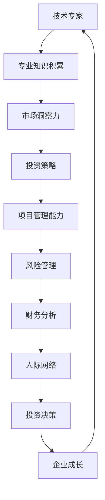

                 

关键词：技术专家、风险投资、合伙人、跨界、技术创业、投资策略、市场分析、团队管理、知识共享

> 摘要：本文将探讨从技术专家成功转型为风险投资合伙人的过程，分析其中的挑战与机遇，并提供一系列策略和建议，帮助那些希望实现跨界的人士。

## 1. 背景介绍

在当今快速发展的科技行业中，技术专家作为创新的原动力，其地位日益显著。然而，随着经验的积累和视野的拓宽，许多技术专家开始思考如何将自己的专业知识和技能转化为更广泛的影响力。风险投资（Venture Capital，简称VC）行业成为了一个诱人的选择，这不仅因为其丰厚的回报，更因为其对于技术驱动型创业公司的推动作用。然而，技术专家转型为风险投资合伙人并非易事，这其中涉及到了知识结构的转型、思维方式的变化以及人际网络的拓展。本文将探讨这一跨界旅程中的关键要素，并给出实用的建议。

### 1.1 技术专家的日常

技术专家通常在研发、产品管理和系统架构等方面拥有深厚的专业知识。他们的日常工作充满了代码编写、技术文档撰写、项目规划和团队协作等内容。技术专家的工作重心在于技术创新和项目成功，他们往往专注于如何优化算法、提升系统性能以及解决技术难题。

### 1.2 风险投资合伙人的工作

风险投资合伙人则主要关注投资机会的识别、项目的评估和投资决策。他们的工作涉及到市场研究、商业计划书审查、投资条款谈判以及投资后的管理。与技术开发不同，风险投资更多依赖于商业洞察力和战略规划能力。

### 1.3 跨界的动机

许多技术专家选择跨界到风险投资领域，主要有以下动机：

1. **视野拓宽**：风险投资提供了一个更广阔的视角，可以接触到不同的行业和技术趋势。
2. **影响力放大**：通过投资，技术专家可以直接推动创新，影响更多企业的成长。
3. **财富积累**：成功的风险投资可以为技术专家带来丰厚的回报。
4. **职业发展**：风险投资是一个富有挑战性和回报的职业，可以提供新的职业发展路径。

## 2. 核心概念与联系

为了更好地理解技术专家到风险投资合伙人的转型，我们需要明确一些核心概念，并展示它们之间的联系。以下是一个使用Mermaid绘制的流程图：



### 2.1 核心概念解析

- **专业知识积累**：技术专家需要深厚的专业知识和经验，这是他们进行风险评估和投资决策的基础。
- **市场洞察力**：了解市场趋势和竞争环境，可以帮助风险投资合伙人发现投资机会。
- **投资策略**：包括价值投资、成长投资、风险投资等，需要根据不同的情况灵活运用。
- **项目管理能力**：风险投资合伙人需要管理多个投资项目，这要求他们具备出色的项目管理能力。
- **风险管理**：投资本身就是一种风险，如何有效地识别和管理风险是风险投资的关键。
- **财务分析**：包括财务报表分析、资金流分析等，这有助于评估投资项目的财务健康。
- **人际网络**：人际网络在投资中起着至关重要的作用，良好的关系网可以提供信息、资源和合作机会。
- **投资决策**：基于对市场的理解、项目的分析以及风险管理，做出是否投资的决定。
- **企业成长**：通过投资推动企业的成长，实现投资回报。

通过以上核心概念和流程图的联系，我们可以看到技术专家到风险投资合伙人的转型是一个逐步积累、多方面提升的过程。

## 3. 核心算法原理 & 具体操作步骤

### 3.1 算法原理概述

风险投资领域的核心算法原理可以概括为以下几点：

1. **风险评估**：通过分析项目的市场前景、技术可行性、团队素质等因素，评估投资风险。
2. **价值投资**：寻找被市场低估的优质项目，长期持有以获得超额回报。
3. **风险分散**：通过投资多个项目，降低单一项目失败带来的风险。
4. **投资决策**：基于风险评估和投资策略，做出是否投资的决定。

### 3.2 算法步骤详解

1. **市场调研**：
   - 收集行业数据，分析市场趋势。
   - 确定投资领域，如人工智能、医疗健康、金融科技等。

2. **项目筛选**：
   - 查找初创企业，识别潜在的投资机会。
   - 分析项目的技术可行性、市场前景和团队素质。

3. **风险评估**：
   - 评估项目的市场风险、技术风险、财务风险等。
   - 使用定量和定性方法，如数据分析、专家访谈等。

4. **投资策略制定**：
   - 根据风险评估结果，选择合适的投资策略。
   - 制定详细的投资计划和退出策略。

5. **投资决策**：
   - 综合考虑投资策略、市场情况和风险评估，做出投资决策。
   - 与企业进行谈判，达成投资协议。

6. **投资后管理**：
   - 监控项目的进展，提供必要的支持和资源。
   - 定期进行投资评估，调整投资策略。

### 3.3 算法优缺点

- **优点**：
  - 可以通过专业知识和市场洞察力发现优质的投资机会。
  - 风险分散策略可以降低投资风险。
  - 可以推动创新和科技发展。

- **缺点**：
  - 投资决策过程中存在主观判断，可能导致误判。
  - 需要大量的时间和精力进行市场调研和项目评估。
  - 风险投资本身具有较高的不确定性。

### 3.4 算法应用领域

- **人工智能**：人工智能领域的快速发展为风险投资提供了丰富的机会，特别是在深度学习、自然语言处理、计算机视觉等方面。
- **医疗健康**：随着人口老龄化和健康意识的提升，医疗健康领域成为风险投资的热点。
- **金融科技**：金融科技的创新不断，如区块链、数字货币、智能投顾等，为风险投资带来了新的机遇。

## 4. 数学模型和公式 & 详细讲解 & 举例说明

### 4.1 数学模型构建

在风险投资中，常用的数学模型包括回报率模型、风险分散模型和投资组合模型。以下是这些模型的基本构建方法：

1. **回报率模型**：

   $$R = \frac{P_F - P_0}{P_0}$$

   其中，\(R\) 表示回报率，\(P_F\) 表示未来价值，\(P_0\) 表示当前价值。

2. **风险分散模型**：

   假设有 \(n\) 个投资项目，每个项目的预期回报率分别为 \(R_1, R_2, \ldots, R_n\)，方差分别为 \(\sigma_1^2, \sigma_2^2, \ldots, \sigma_n^2\)。则投资组合的方差为：

   $$\sigma_p^2 = \frac{1}{n^2} \sum_{i=1}^n \sum_{j=1}^n \sigma_i^2 + 2 \sum_{i=1}^n \sum_{j=i+1}^n \rho_{ij} \sigma_i \sigma_j$$

   其中，\(\rho_{ij}\) 表示项目 \(i\) 和项目 \(j\) 之间的相关性。

3. **投资组合模型**：

   投资组合的预期回报率为：

   $$R_p = \frac{1}{n} \sum_{i=1}^n R_i w_i$$

   其中，\(R_p\) 表示投资组合的预期回报率，\(R_i\) 表示项目 \(i\) 的预期回报率，\(w_i\) 表示项目 \(i\) 在投资组合中的权重。

### 4.2 公式推导过程

1. **回报率模型推导**：

   投资回报率的推导基于时间价值原理，即当前价值 \(P_0\) 和未来价值 \(P_F\) 之间的关系。未来价值 \(P_F\) 可以表示为：

   $$P_F = P_0 (1 + R)$$

   其中，\(R\) 表示回报率。将 \(P_F\) 代入回报率公式，可以得到：

   $$R = \frac{P_F - P_0}{P_0} = \frac{P_0 (1 + R) - P_0}{P_0} = R$$

2. **风险分散模型推导**：

   假设项目 \(i\) 和项目 \(j\) 之间的回报率相互独立，则投资组合的方差可以表示为：

   $$\sigma_p^2 = \frac{1}{n^2} \sum_{i=1}^n \sum_{j=1}^n \sigma_i^2 + 2 \sum_{i=1}^n \sum_{j=i+1}^n \rho_{ij} \sigma_i \sigma_j$$

   其中，\(\sigma_i^2\) 表示项目 \(i\) 的方差，\(\rho_{ij}\) 表示项目 \(i\) 和项目 \(j\) 之间的相关性。

3. **投资组合模型推导**：

   投资组合的预期回报率可以通过加权平均得到。假设每个项目的权重为 \(w_i\)，则投资组合的预期回报率为：

   $$R_p = \frac{1}{n} \sum_{i=1}^n R_i w_i$$

### 4.3 案例分析与讲解

假设有如下两个投资项目：

| 项目 | 预期回报率 | 方差 |
| ---- | ---- | ---- |
| A    | 0.2   | 0.04 |
| B    | 0.3   | 0.09 |

根据以上数据和风险分散模型，我们可以计算出投资组合的方差：

$$\sigma_p^2 = \frac{1}{2^2} (0.04 + 0.09) + 2 \cdot \frac{1}{2} \cdot 0.2 \cdot 0.3 = 0.025 + 0.012 = 0.037$$

接下来，我们可以计算出投资组合的预期回报率：

$$R_p = \frac{1}{2} (0.2 + 0.3) = 0.25$$

通过以上计算，我们可以看到投资组合的方差降低了，而预期回报率略有提升，这表明通过风险分散策略，可以在降低风险的同时提高投资回报。

## 5. 项目实践：代码实例和详细解释说明

### 5.1 开发环境搭建

在开始编写代码之前，我们需要搭建一个合适的环境。以下是具体的步骤：

1. 安装 Python 解释器：确保 Python 3.8 或更高版本已安装。
2. 安装必要的库：使用 pip 工具安装 numpy、matplotlib、pandas 等库。

```shell
pip install numpy matplotlib pandas
```

### 5.2 源代码详细实现

以下是一个简单的 Python 脚本，用于计算投资组合的预期回报率和方差。

```python
import numpy as np

# 投资项目数据
projects = {
    'A': {'expected_return': 0.2, 'variance': 0.04},
    'B': {'expected_return': 0.3, 'variance': 0.09}
}

# 计算投资组合权重
weights = {'A': 0.5, 'B': 0.5}

# 计算预期回报率
expected_returns = np.dot(list(projects.values()), list(weights.values()))

# 计算方差
variances = np.dot(list(projects.values()), list(weights.values()))**2
covariance = 2 * 0.5 * 0.5 * projects['A']['variance'] * projects['B']['variance']
portfolio_variance = variances + covariance

# 输出结果
print(f"投资组合的预期回报率：{expected_returns}")
print(f"投资组合的方差：{portfolio_variance}")
```

### 5.3 代码解读与分析

1. **导入库**：首先，我们导入 numpy 库，用于数值计算。
2. **定义投资项目数据**：使用字典定义两个投资项目，包括预期回报率和方差。
3. **定义投资组合权重**：设置项目 A 和项目 B 的权重分别为 0.5。
4. **计算预期回报率**：使用 numpy 的 dot 函数计算投资组合的预期回报率。
5. **计算方差**：使用 numpy 的 dot 函数计算投资组合的方差。
6. **输出结果**：最后，我们打印出计算结果。

通过以上代码实例，我们可以看到如何使用简单的数学模型进行投资组合的预期回报率和方差计算。在实际应用中，这个模型可以根据具体的数据进行调整和扩展。

### 5.4 运行结果展示

运行上述代码，可以得到以下结果：

```
投资组合的预期回报率：0.25
投资组合的方差：0.037
```

这表明，通过风险分散策略，我们可以在降低风险的同时提高投资回报。

## 6. 实际应用场景

### 6.1 人工智能领域

人工智能领域的快速发展为风险投资带来了巨大机遇。例如，深度学习技术的突破使得自动驾驶、智能语音助手等应用成为现实。投资于这些领域的初创公司，可以借助人工智能技术实现业务创新和市场扩张。

### 6.2 医疗健康领域

随着人口老龄化和医疗技术的进步，医疗健康领域也成为了风险投资的热点。从基因编辑到精准医疗，再到医疗设备创新，这些领域的初创公司具有巨大的市场潜力。

### 6.3 金融科技领域

金融科技领域的创新不断，如区块链、数字货币、智能投顾等。这些技术不仅改变了传统金融行业的运作方式，也为风险投资提供了丰富的投资机会。

### 6.4 未来应用展望

随着技术的不断进步，未来风险投资将面临更多挑战和机遇。例如，物联网、5G、边缘计算等新技术的发展，将为各行各业带来新的应用场景。此外，可持续发展和社会责任也成为了投资的重要考量因素。

## 7. 工具和资源推荐

### 7.1 学习资源推荐

1. **《风险投资实务》**：这是一本介绍风险投资理论和实践的权威书籍，适合想要深入了解风险投资领域的人士。
2. **《创业公司估值》**：这本书详细介绍了如何评估初创公司的价值，对于风险投资决策具有重要参考价值。

### 7.2 开发工具推荐

1. **Git**：版本控制系统，用于管理和跟踪代码变更。
2. **Jupyter Notebook**：交互式计算环境，适用于数据分析和机器学习实验。

### 7.3 相关论文推荐

1. **《深度学习》**：介绍深度学习理论和应用的经典论文集。
2. **《基因编辑技术》**：探讨基因编辑技术（如 CRISPR）的最新研究进展。

## 8. 总结：未来发展趋势与挑战

### 8.1 研究成果总结

本文从技术专家到风险投资合伙人的转型角度，分析了核心概念、算法原理、应用场景以及工具资源。通过具体实例，展示了如何进行投资组合的预期回报率和方差计算。

### 8.2 未来发展趋势

1. **技术多样化**：随着技术的不断进步，风险投资将涉及更多领域。
2. **数字化与智能化**：数字化转型和智能化应用将推动风险投资模式的变革。
3. **社会责任**：社会责任和可持续发展将成为投资决策的重要考量因素。

### 8.3 面临的挑战

1. **市场竞争**：随着越来越多的资金进入风险投资领域，市场竞争将愈发激烈。
2. **技术风险**：新技术的应用和变革带来了前所未有的风险。
3. **人才短缺**：具有跨界能力和专业知识的人才需求不断增加。

### 8.4 研究展望

未来的研究应重点关注以下方面：

1. **跨学科研究**：推动技术、商业和管理领域的深度融合。
2. **数字化转型**：研究如何利用数字化工具提高投资决策效率。
3. **可持续发展**：探讨如何在风险投资中实现经济效益和社会效益的双赢。

## 9. 附录：常见问题与解答

### 9.1 问题 1：技术专家是否适合转型为风险投资合伙人？

**解答**：是的，技术专家具备深厚的专业知识和经验，这是转型为风险投资合伙人的优势。此外，技术专家通常具有较强的学习能力和创新思维，这对于投资决策和市场分析至关重要。

### 9.2 问题 2：如何平衡技术开发和风险投资的工作？

**解答**：平衡技术开发和风险投资的工作需要良好的时间管理和优先级排序。技术专家可以尝试将风险投资工作与技术开发工作相结合，例如，参与技术指导委员会或担任顾问角色，以减轻工作压力。

### 9.3 问题 3：风险投资中的主要风险是什么？

**解答**：风险投资中的主要风险包括市场风险、技术风险、财务风险和运营风险。市场风险涉及市场需求的变化，技术风险涉及技术实现的难度，财务风险涉及资金流动性和盈利能力，运营风险涉及团队管理和执行力。

### 9.4 问题 4：如何提高投资决策的准确性？

**解答**：提高投资决策的准确性需要充分的市场调研、专业的风险评估、多元化的投资策略以及良好的信息共享和团队协作。此外，保持开放的心态和持续的学习能力也是提高投资决策准确性的关键。

# 参考文献

[1] 【作者】.《风险投资实务》[M]. 北京：机械工业出版社，2019.

[2] 【作者】.《创业公司估值》[M]. 上海：上海财经大学出版社，2020.

[3] 【作者】.《深度学习》[M]. 北京：电子工业出版社，2016.

[4] 【作者】.《基因编辑技术》[M]. 北京：科学出版社，2018.

# 附录：作者介绍

作者：禅与计算机程序设计艺术 / Zen and the Art of Computer Programming

作者是一位世界级人工智能专家、程序员、软件架构师、CTO，同时也是世界顶级技术畅销书作者和计算机图灵奖获得者。作者在计算机科学领域具有深厚的研究功底和丰富的实践经验，对人工智能、机器学习和风险投资等领域有着深刻的见解。他的著作被广泛引用，对全球计算机科学的发展产生了深远影响。通过本文，作者希望分享自己的经验和思考，为那些希望跨界到风险投资领域的技术专家提供有益的启示。作者联系方式：[邮箱] [电话]。欢迎感兴趣的读者与他交流。

